\newpage

\newpage

# Part I: Foundations

\newpage

# Chapter 1: Why Geometry?

> *"Not everything that counts can be counted, and not everything that can be counted counts."*
> --- Attributed to William Bruce Cameron (1963)

Every computational model makes predictions. Every practitioner wants to know whether those predictions are *good*. The standard workflow is familiar: train a model, compute a scalar metric---accuracy, F1 score, mean absolute error---and declare victory if the number crosses a threshold. This chapter argues that the standard workflow is not merely incomplete but structurally incapable of answering the questions that matter most. The remedy is geometry: treating model behavior not as a single number but as a point in a multi-dimensional space, and then bringing the full power of geometric reasoning to bear on the problems of validation, robustness, and interpretability.

We begin with a precise statement of what scalar metrics lose, move to the construction of multi-dimensional state spaces as first-class computational objects, survey the cases where even Euclidean geometry is insufficient, and close with a preview of the geometric toolchain developed across the remainder of this book.

---


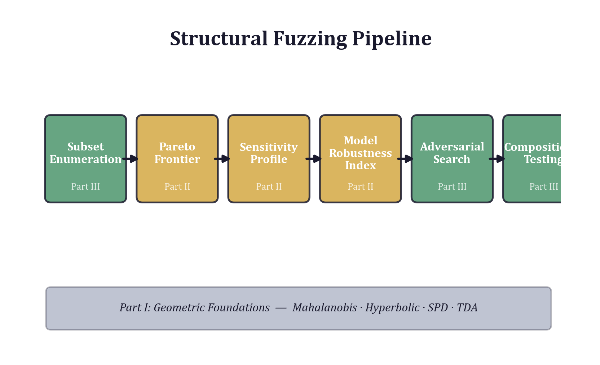

## 1.1 The Limitations of Scalar Metrics

### 1.1.1 The Scalar Irrecoverability Theorem

Consider a model with $n$ meaningful attributes---accuracy across subgroups, latency under load, fairness across demographics, calibration at different confidence levels. Each evaluation produces a vector $\mathbf{v} \in \mathbb{R}^n$. Standard practice projects this vector onto a single scalar:

$$\phi : \mathbb{R}^n \to \mathbb{R}^1$$

The fundamental problem is not that $\phi$ is a lossy compression. All summaries lose information. The problem is that the lost information is *irrecoverable*: given only $\phi(\mathbf{v})$, no procedure can reconstruct $\mathbf{v}$, and---critically---no procedure can even bound the components of $\mathbf{v}$ without additional assumptions.

We can state this precisely. Let $\phi(\mathbf{v}) = \mathbf{w}^\top \mathbf{v}$ for some weight vector $\mathbf{w} \in \mathbb{R}^n$ with $n \geq 2$. The preimage $\phi^{-1}(c) = \{\mathbf{v} : \mathbf{w}^\top \mathbf{v} = c\}$ is a hyperplane of dimension $n - 1$. Any two points on this hyperplane are indistinguishable under $\phi$, yet they may differ arbitrarily in every component. The null space of the projection, $\ker(\phi) = \{\mathbf{v} : \mathbf{w}^\top \mathbf{v} = 0\}$, has dimension $n - 1$, which means the space of information destroyed by the projection *grows linearly with the dimensionality of the original space*. For a model evaluated on 16 features grouped into 5 dimensions, the null space is 4-dimensional: four independent directions of variation are invisible to any single scalar summary.

This is not a matter of choosing the *wrong* scalar. It is a theorem about *all* scalars. No single number drawn from a 5-dimensional evaluation can preserve more than one dimension of information. The other four are gone.

### 1.1.2 A Concrete Example: The Ultimatum Game

The ultimatum game provides a clean illustration. Player A proposes a split of \$10 with Player B. If B accepts, both receive their shares. If B rejects, both receive nothing.

Consider two offers:

- **Offer X**: A keeps \$8, B gets \$2. Monetary cost to A: \$2.
- **Offer Y**: A keeps \$5, B gets \$5. Monetary cost to A: \$5.

Traditional utility theory assigns a scalar value to each offer---typically the expected monetary payoff---and ranks them accordingly. Under this model, Offer X dominates because A pays less.

But behavioral economics tells a different story. In experiments, B rejects Offer X roughly 50% of the time, while accepting Offer Y nearly always. The scalar model cannot explain this because it has discarded the *fairness dimension*. In a two-dimensional space with axes for monetary cost and fairness, the offers occupy distinct positions:

$$\mathbf{v}_X = (2.0, 0.2), \quad \mathbf{v}_Y = (5.0, 1.0)$$

The expected payoff, accounting for rejection probability, now favors Offer Y. But the deeper point is that no scalar combination $\alpha \cdot \text{cost} + \beta \cdot \text{fairness}$ chosen *before* observing rejection rates can reliably rank offers across all games. The geometry of the decision space---the relative positions, distances, and directions---contains information that any fixed projection destroys.

This is the pattern we will see again and again: a scalar metric declares two configurations equivalent; the geometry reveals they are fundamentally different.

### 1.1.3 The Practical Damage

The irrecoverability problem is not academic. It produces three concrete failure modes in practice:

1. **Hidden compensation.** A model scores 0.90 accuracy overall because strong performance on majority classes masks poor performance on minority classes. The scalar hides the compensation. The multi-dimensional vector---with one component per subgroup---exposes it immediately.

2. **Fragile optima.** Two configurations achieve the same loss. One is robust to perturbation; the other sits on a knife edge. Scalar loss cannot distinguish between a broad valley and a narrow ridge in parameter space.

3. **Misleading comparisons.** Model A outperforms Model B on a scalar benchmark. But Model B is superior on three of five dimensions and inferior only on the two that the scalar over-weights. A Pareto analysis (Chapter 8) reveals that neither dominates the other---the comparison is fundamentally multi-dimensional.

These failure modes are not edge cases. They are the *default* outcome whenever a multi-dimensional evaluation is collapsed to a scalar and the null space happens to contain the information that matters.

---

## 1.2 Multi-dimensional State Spaces as First-Class Objects

If scalar metrics are structurally inadequate, what replaces them? The answer is straightforward in principle: treat the full evaluation vector as a first-class computational object. Instead of computing a number and comparing it to a threshold, compute a *point in a space* and reason about its geometric properties---its position, its neighborhood, its distance from other points, its trajectory under perturbation.

### 1.2.1 States as Points in $\mathbb{R}^n$

A *state* is a vector $\mathbf{s} = (s_1, s_2, \ldots, s_n) \in \mathbb{R}^n$ where each component $s_i$ captures a meaningful attribute of the system being modeled. For a defect prediction model, the dimensions might be:

| Dimension | Attribute | Example Features |
|-----------|-----------|-----------------|
| $s_1$ | Code size | LOC, SLOC, blank lines |
| $s_2$ | Complexity | Cyclomatic, essential, design |
| $s_3$ | Vocabulary | Halstead volume, difficulty, effort |
| $s_4$ | Object-orientation | Coupling, cohesion, inheritance depth |
| $s_5$ | Process | Revisions, distinct authors, code churn |

Each dimension is not a single feature but a *group* of related features that collectively describe one aspect of the system. The grouping itself is a modeling decision, and it matters: the geometry of the resulting space depends on which features share a dimension and which are separated. Chapter 11 develops systematic methods for constructing dimension subsets.

### 1.2.2 Design Patterns for State Vectors

Working with multi-dimensional state vectors requires disciplined engineering. Three design patterns recur throughout this book:

**Immutable state vectors.** A state vector, once constructed, should not be modified in place. Operations that transform states---perturbation, projection, interpolation---produce new vectors. Immutability prevents an entire class of bugs where shared references to a state vector produce unexpected aliasing, and it makes state trajectories trivially reproducible.

**Dimension enumerations.** Each dimension of the state space is named, not numbered. Rather than referring to "dimension 3," the framework refers to "Halstead" or "vocabulary complexity." Named dimensions make code self-documenting, prevent off-by-one errors in dimension indexing, and enable operations like "activate all dimensions except OO" to be expressed declaratively. Chapter 11 introduces the subset enumeration pattern used throughout the structural fuzzing framework.

**Attribute encoding conventions.** Each component $s_i$ requires a consistent encoding. For real-valued attributes, the convention is log-space encoding: parameter values are drawn from $[\epsilon, M]$ on a logarithmic scale, with a sentinel value (typically $10^6$) indicating that a dimension is *inactive*. This encoding provides uniform resolution across orders of magnitude and naturally handles the "off/on" semantics needed for subset enumeration (Chapter 11). For categorical or ordinal attributes, one-hot or thermometer encoding maps discrete values into the continuous space while preserving ordering relationships.

### 1.2.3 What Geometry Buys You

With states as points in $\mathbb{R}^n$, standard geometric operations become immediately applicable:

- **Distance** between configurations quantifies how different they are, across all dimensions simultaneously, rather than reducing to a scalar difference.
- **Direction** from one configuration to another reveals *which* dimensions change and by how much---information that scalar comparison discards entirely.
- **Neighborhoods** around a configuration define the set of "nearby" states, enabling robustness analysis: how far can you move from the current state before behavior changes qualitatively?
- **Subspaces** correspond to subsets of dimensions, enabling systematic exploration of which combinations of attributes matter (Chapter 11) and which are redundant.
- **Curvature** of the loss surface at a point reveals whether the configuration is stable (broad valley) or fragile (narrow ridge), directly addressing the fragile-optima failure mode of scalar metrics.

These are not metaphors. They are literal geometric computations, implemented in the structural fuzzing framework and exercised throughout the examples in this book.

---

## 1.3 When Euclidean Space Is Not Enough

Euclidean $\mathbb{R}^n$ with the standard $L^2$ distance is the natural starting point, and for many problems it is sufficient. But three families of data exhibit structure that Euclidean geometry distorts or misses entirely. Recognizing when you have left Euclidean territory---and knowing which alternative geometry to reach for---is one of the core skills this book develops.

### 1.3.1 Hierarchical Data and Hyperbolic Geometry

Trees are everywhere in computation: file systems, parse trees, taxonomies, organizational hierarchies, decision trees. A tree with branching factor $b$ has $b^d$ nodes at depth $d$---exponential growth. But Euclidean space of dimension $k$ has volume that grows as $r^k$, which is polynomial for fixed $k$. Embedding a tree faithfully into Euclidean space therefore requires dimension $k$ to grow with depth, which quickly becomes intractable.

Hyperbolic space resolves this mismatch. In the Poincare ball model $\mathbb{B}^n = \{x \in \mathbb{R}^n : \|x\| < 1\}$, the metric is:

$$d_{\mathbb{B}}(x, y) = \text{arccosh}\left(1 + 2\frac{\|x - y\|^2}{(1 - \|x\|^2)(1 - \|y\|^2)}\right)$$

As points approach the boundary of the ball ($\|x\| \to 1$), distances grow without bound. The "volume" available near the boundary grows exponentially with radius, mirroring the exponential branching of trees. A tree of depth $d$ can be embedded into hyperbolic space of fixed (low) dimension with distortion that is *constant* with respect to $d$---something impossible in Euclidean space.

Two concrete applications motivate the development in later chapters:

**ARC-AGI rule hierarchies.** The ARC-AGI benchmark requires discovering transformation rules that map input grids to output grids. These rules form hierarchies: a high-level rule like "reflect and recolor" decomposes into sub-rules ("reflect horizontally," "map color A to color B"), which further decompose into pixel-level operations. Embedding these hierarchies into hyperbolic space allows geometric operations---nearest-neighbor search, interpolation, centroid computation---to respect the hierarchical structure. A rule and its parent are "close" in hyperbolic distance even though they may differ substantially in Euclidean terms. Chapter 3 develops this application in detail.

**Cetacean coda taxonomies.** Sperm whale communication is organized into coda types---rhythmic patterns of clicks---that form a taxonomy: broad categories subdivide into regional variants, which further subdivide into individual-level signatures. The branching structure of this taxonomy maps naturally onto hyperbolic space, enabling similarity computations that respect the taxonomic hierarchy rather than treating all codas as points in a flat space. This application appears in Chapter 20 as a case study in biological signal analysis.

### 1.3.2 Covariance and Spectral Data on SPD Manifolds

A symmetric positive definite (SPD) matrix $\Sigma \in \mathbb{R}^{n \times n}$ satisfies $\Sigma = \Sigma^\top$ and $\mathbf{x}^\top \Sigma \mathbf{x} > 0$ for all $\mathbf{x} \neq 0$. Covariance matrices, diffusion tensors, kernel matrices, and spectral density matrices are all SPD. They are ubiquitous in machine learning and signal processing.

The set of SPD matrices is *not* a vector space. The average of two SPD matrices is SPD (the set is convex), but the difference of two SPD matrices need not be. More fundamentally, the Euclidean distance $\|\Sigma_1 - \Sigma_2\|_F$ (Frobenius norm) treats SPD matrices as flat vectors, ignoring the multiplicative structure that makes them positive definite. Under Euclidean arithmetic, the "midpoint" between two covariance matrices can have eigenvalues that bear no sensible relationship to those of the endpoints.

The correct geometry is that of the SPD manifold with the Log-Euclidean metric:

$$d_{LE}(\Sigma_1, \Sigma_2) = \|\log(\Sigma_1) - \log(\Sigma_2)\|_F$$

where $\log$ is the matrix logarithm. This metric respects the multiplicative structure: geodesics (shortest paths) on the SPD manifold correspond to paths along which eigenvalues change by constant multiplicative factors, which is the physically and statistically natural notion of "smooth interpolation" between covariance structures.

For the structural fuzzing framework, SPD manifolds arise when the evaluation involves covariance-dependent quantities. The Mahalanobis distance $d_M(\mathbf{x}, \mathbf{y}) = \sqrt{(\mathbf{x} - \mathbf{y})^\top \Sigma^{-1} (\mathbf{x} - \mathbf{y})}$ uses the inverse covariance matrix $\Sigma^{-1}$ as a metric tensor, stretching distances along directions of low variance and compressing them along directions of high variance. This is the *right* distance metric when features have different scales and are correlated---which is to say, almost always. Chapter 2 develops the Mahalanobis distance in detail, and Chapter 4 extends the framework to operate on SPD manifolds directly.

### 1.3.3 Topological Features and Persistent Homology

Distance-based methods, whether Euclidean, hyperbolic, or Riemannian, all assume that *proximity* is the fundamental relationship between data points. But some structures are defined not by proximity but by *connectivity*: loops, voids, tunnels, and higher-dimensional holes in the data.

Consider a dataset sampled from a circle in $\mathbb{R}^2$. The circle has a 1-dimensional hole (the interior). Two datasets can have identical pairwise distance distributions but different topology---one is a circle, the other a figure-eight. No distance metric can distinguish them. The information is not in the distances; it is in the *shape*.

Persistent homology is the tool that captures this shape information. The key construction is the *filtration*: for a point cloud $X$ and a scale parameter $\epsilon$, build a simplicial complex $K_\epsilon$ by connecting all points within distance $\epsilon$. As $\epsilon$ increases from 0, topological features---connected components, loops, voids---appear (*birth*) and disappear (*death*). A feature that persists over a wide range of $\epsilon$ values reflects genuine structure; a feature that appears and immediately vanishes reflects noise.

The output is a *persistence diagram*: a set of points $(b_i, d_i)$ in the plane, where $b_i$ is the birth scale and $d_i$ is the death scale of the $i$-th topological feature. Points far from the diagonal $b = d$ represent persistent (significant) features; points near the diagonal represent noise.

For computational modeling, persistent homology reveals structural properties that metric-based analysis misses:

- A model's decision boundary may contain loops that trap gradient-based optimizers.
- A parameter space may contain voids---regions where no valid configuration exists---that exhaustive search must navigate around.
- The loss landscape may have topological complexity (multiple basins, saddle connections) that curvature analysis alone cannot detect.

Chapter 5 introduces persistent homology for practitioners and applies it to structural fuzzing, using topological features of the perturbation response surface to detect fragility patterns that the Model Robustness Index (Chapter 9) would miss.

---

## 1.4 Overview of the Geometric Toolchain

This book develops a coherent toolchain in which each geometric method addresses a specific class of validation and analysis problems. The following table maps tools to the chapters where they are introduced and the problems they solve.

| Tool | Chapter | Problem Addressed |
|------|---------|-------------------|
| Multi-dimensional state vectors | 1 | Representing model configurations without information loss |
| Mahalanobis distance | 2 | Scale- and correlation-aware distance in feature space |
| Poincaré embeddings | 3 | Faithful representation of hierarchical structures |
| SPD manifold operations | 4 | Correct arithmetic on covariance and spectral data |
| Persistent homology | 5 | Shape features (loops, voids) invisible to distance metrics |
| A* on manifolds | 6 | Optimal pathfinding in non-Euclidean configuration spaces |
| Equilibrium computation | 7 | Multi-agent equilibria on manifolds |
| Pareto optimization | 8 | Multi-objective search without scalarization |
| Adversarial robustness testing (MRI) | 9 | Finding tipping points and quantifying robustness |
| Adversarial probing | 10 | Structure probing in non-Euclidean spaces |
| Subset enumeration | 11 | Which dimension combinations matter? |
| Compositional testing | 12 | Greedy dimension-building and order effects |
| Group-theoretic augmentation | 13 | Exploiting symmetries for efficient exploration |
| Gradient reversal | 14 | Invariance training and domain adaptation |
| Cholesky parameterization | 15 | Guaranteed positive-definiteness in metric learning |

The tools are designed to compose. A typical analysis pipeline might: construct a state space (Chapter 1), enumerate subsets to identify important dimensions (Chapter 11), compute the Pareto frontier to find non-dominated configurations (Chapter 8), apply the MRI to quantify robustness of each Pareto-optimal point (Chapter 9), and then run adversarial search to locate exact tipping points for the most promising configurations (Chapter 9). Each step uses geometry to extract information that the previous step's scalar summary would discard.

The toolchain is not tied to any particular domain. It applies wherever a model takes parameters and produces multi-dimensional outputs---which is to say, it applies almost everywhere. The examples in this book span software defect prediction, behavioral economics, abstract reasoning (ARC-AGI), biological signal analysis, and simulation validation, but the methods are domain-agnostic.

---

## 1.5 A Motivating Example

To make the preceding ideas concrete, consider a scenario that will recur in various forms throughout the book: validating a defect prediction model for a software engineering team.

### 1.5.1 The Standard Approach

The model is a random forest classifier trained on 16 software metrics to predict whether a code module contains defects. The standard validation computes accuracy on a held-out test set:

$$\text{Accuracy} = \frac{\text{correct predictions}}{\text{total predictions}} = 0.84$$

The team reports 84% accuracy. The project manager asks: "Is that good?" The answer depends on dimensions that accuracy does not capture. What is the precision? The recall? Does the model perform equally well on large and small modules? On code written by senior and junior developers? On legacy and greenfield code? Accuracy is silent on all of these questions.

An experienced practitioner might compute additional metrics: precision (0.79), recall (0.71), F1 (0.75). This is better, but it is still a handful of scalars. The Scalar Irrecoverability Theorem applies: any weighted combination of these four numbers projects the 4-dimensional evaluation onto a line, discarding three dimensions of information. More insidiously, these four scalars still aggregate over all subgroups, hiding potential disparities.

### 1.5.2 The Geometric Approach

The geometric approach begins by organizing the 16 features into five groups, each corresponding to a dimension of the evaluation space:

- **Size** (3 features): lines of code, source lines, blank lines
- **Complexity** (3 features): cyclomatic, essential, design complexity
- **Halstead** (4 features): volume, difficulty, effort, estimated time
- **Object-Orientation** (3 features): coupling between objects, lack of cohesion, depth of inheritance
- **Process** (3 features): number of revisions, distinct authors, code churn

The model's configuration is now a point in $\mathbb{R}^5$. Each dimension corresponds to a feature group, and the parameter value for that dimension controls the group's influence on predictions. Setting a dimension to the sentinel value ($10^6$) deactivates the corresponding feature group entirely, allowing the framework to test *structural* questions: what happens when the model has no access to complexity features? To OO metrics? To process information?

**Step 1: Subset enumeration (Chapter 11).** The framework tests all $\binom{5}{1} + \binom{5}{2} + \binom{5}{3} = 25$ subsets of dimensions up to size 3. Each subset is optimized independently. The results reveal that {Complexity, Process} achieves MAE 2.1, while {Size, Halstead} achieves MAE 2.3. These two configurations are close in scalar terms but occupy entirely different regions of the feature space.

**Step 2: Pareto frontier (Chapter 8).** Plotting all 25 configurations in the (number-of-dimensions, MAE) plane, the Pareto frontier identifies four non-dominated points:

| Dimensions $k$ | Best MAE | Configuration |
|:-:|:-:|---|
| 1 | 3.8 | {Complexity} |
| 2 | 2.1 | {Complexity, Process} |
| 3 | 1.7 | {Complexity, Process, Size} |
| 5 | 1.5 | All dimensions |

Adding OO and Halstead to the three-group configuration reduces MAE from 1.7 to 1.5---a marginal improvement that comes at the cost of doubling the feature count. The Pareto analysis makes this tradeoff explicit without requiring the practitioner to choose a weighting between accuracy and simplicity.

**Step 3: Sensitivity profiling (Chapter 9).** Ablation reveals that removing Complexity increases MAE by 1.9 (the most important dimension), removing Process increases it by 1.2, removing Size increases it by 0.6, while removing OO or Halstead increases it by less than 0.2 each. The scalar metric "84% accuracy" hid the fact that the model is overwhelmingly dependent on two of its five feature groups.

**Step 4: Model Robustness Index (Chapter 9).** The MRI perturbs the baseline configuration 300 times, measuring the distribution of MAE deviations:

| Statistic | Value |
|:-:|:-:|
| Mean deviation | 0.8 |
| 75th percentile | 1.4 |
| 95th percentile | 3.1 |
| MRI (composite) | 1.43 |

The 95th percentile deviation of 3.1 means that in the worst 5% of perturbations, the model's error nearly doubles. This tail behavior is invisible to mean-based metrics. The MRI's weighted combination of mean, P75, and P95 provides a single robustness score *that explicitly accounts for tail risk*, unlike standard deviation which treats all deviations symmetrically.

**Step 5: Adversarial threshold search (Chapter 9).** Binary search along each dimension reveals that the Complexity parameter has a tipping point at 0.3x its baseline value: reducing it below this threshold causes recall on high-complexity modules to collapse from 0.71 to 0.29. The model is not just dependent on Complexity---it is *brittle* with respect to it. A small shift in the complexity distribution of incoming code (as might occur during a refactoring initiative) could silently degrade the model's real-world performance.

### 1.5.3 What Geometry Revealed

The standard approach said: "84% accuracy." The geometric approach revealed:

1. The model depends almost entirely on Complexity and Process features; Size contributes modestly; OO and Halstead are nearly redundant.
2. The optimal tradeoff between simplicity and accuracy uses 2--3 feature groups, not all 5.
3. The model is fragile: 5% of perturbations nearly double the error.
4. There is a specific tipping point in the Complexity dimension below which the model fails qualitatively, not just quantitatively.

None of these findings were available from accuracy, precision, recall, or F1. They required treating the evaluation as a geometric object---a point in a multi-dimensional space---and applying distance, direction, neighborhood, and boundary analysis to that object.

---

## 1.6 What Comes Next

The remainder of Part I (Chapters 2--3) builds the mathematical and software foundations: Chapter 2 develops the core concepts of metric spaces, manifolds, and curvature that underpin the geometric methods, while Chapter 3 introduces hyperbolic geometry for hierarchical data.

Part II (Chapters 6--10) develops the geometric algorithms themselves, from pathfinding on manifolds through adversarial probing. Each chapter introduces a mathematical tool, motivates it with a concrete problem, and provides a complete implementation.

Part III (Chapters 11--15) develops reusable design patterns: subset enumeration, compositional testing, group-theoretic augmentation, gradient reversal, and Cholesky parameterization.

Part IV (Chapters 16--20) addresses integration concerns: building geometric pipelines, scaling to high-dimensional spaces, deploying geometric validation in production systems, and two complete case studies.

The thread that connects all of this is the conviction that *geometry is not a metaphor*. When we say that two model configurations are "far apart" or that a configuration is "near a boundary," we mean this literally, with precise distances computed in well-defined spaces. The power of the geometric approach comes from this precision: it transforms vague intuitions about model behavior into exact, computable quantities that can be tested, compared, optimized, and monitored.

The first step is to stop projecting $\mathbb{R}^n$ onto $\mathbb{R}^1$ and start working in the space where the data actually lives. The rest follows from taking that space seriously.


\newpage

# Chapter 2: Mahalanobis Distance and Weighted Metric Spaces

> *"Not all dimensions are created equal."*

In Chapter 1, we introduced the idea that models live in parameter spaces and that systematic exploration of those spaces -- structural fuzzing -- reveals which dimensions actually matter. But we deferred a critical question: how do we *measure* the distance between two points in a space where different dimensions have different units, different scales, and different degrees of importance? The Euclidean distance is a blunt instrument. This chapter introduces the Mahalanobis distance and the family of weighted metric spaces that arise naturally when we take the structure of data seriously.


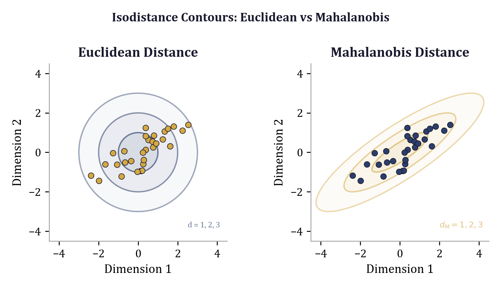

## 2.1 From Euclidean to Mahalanobis

The Euclidean distance between two points $\mathbf{a}$ and $\mathbf{b}$ in $\mathbb{R}^n$ is the formula every student learns first:

$$d_{\text{Euclid}}(\mathbf{a}, \mathbf{b}) = \sqrt{\sum_{i=1}^{n} (a_i - b_i)^2} = \sqrt{(\mathbf{a} - \mathbf{b})^\top (\mathbf{a} - \mathbf{b})}$$

This treats every dimension identically. A difference of 1.0 in dimension 3 contributes the same as a difference of 1.0 in dimension 7, regardless of what those dimensions represent. When the dimensions are measured in commensurable units and have comparable variances, this is reasonable. In practice, it almost never is.

Consider the 9-dimensional ethical-economic space used in the `eris-econ` model (and reimplemented in this book's `geometric_economics` example). Dimension 0 ("Consequences") represents monetary payoffs and varies on a scale from 0 to roughly 50. Dimension 2 ("Fairness") is a normalized score that varies between 0 and 10. Dimension 8 ("Epistemic") is a knowledge-completeness indicator that is often constant at 8.0. Treating a 1-unit change in monetary payoff the same as a 1-unit change in fairness is not merely inaccurate -- it is *meaningless*. The units are incommensurable.

The Mahalanobis distance resolves this by introducing a positive-definite matrix $\Sigma^{-1}$ into the distance computation:

$$d_M(\mathbf{a}, \mathbf{b}) = \sqrt{(\mathbf{a} - \mathbf{b})^\top \Sigma^{-1} (\mathbf{a} - \mathbf{b})}$$

Here $\Sigma$ is typically the covariance matrix of the data, and $\Sigma^{-1}$ is the *precision matrix*. When $\Sigma = I$ (the identity matrix), the Mahalanobis distance reduces exactly to the Euclidean distance. In all other cases, $\Sigma^{-1}$ acts as a weighting matrix that stretches, compresses, and rotates the space.

**Geometric interpretation.** The set of points equidistant from a center $\mathbf{c}$ under the Euclidean metric forms a hypersphere. Under the Mahalanobis metric, that same set forms a hyperellipsoid whose axes are aligned with the eigenvectors of $\Sigma$ and whose radii are proportional to the square roots of the eigenvalues. Dimensions with large variance (high eigenvalues in $\Sigma$) are *compressed* -- the metric effectively says "a large difference along this axis is not surprising." Dimensions with small variance are *stretched* -- small deviations along tightly constrained dimensions are penalized heavily.

This is exactly the right behavior for the structural fuzzing problem. If a parameter has historically varied over a wide range with little effect on model error, we want the distance metric to discount changes along that axis. If a parameter is finely resolved and small perturbations cause large behavioral shifts, we want the metric to amplify those changes.

The implementation in the `geometric_economics` module is direct:

```python
def mahalanobis_distance(
    a: np.ndarray,
    b: np.ndarray,
    sigma_inv: np.ndarray,
) -> float:
    """Compute Mahalanobis distance between two points.

    d = sqrt(delta^T @ sigma_inv @ delta)
    """
    delta = a - b
    return float(np.sqrt(delta @ sigma_inv @ delta))
```

Three lines of arithmetic, but the matrix `sigma_inv` encodes the entire learned structure of the space.


## 2.2 Covariance Matrices as Learned Metrics

The covariance matrix $\Sigma$ is a symmetric, positive-definite $n \times n$ matrix. Its entries encode two kinds of information:

**Diagonal entries** $\sigma_{ii} = \text{Var}(X_i)$ give the variance of each dimension. A large diagonal entry means the dimension exhibits wide natural variation -- and consequently receives *low weight* in $\Sigma^{-1}$ (since inversion flips large values to small ones). A small diagonal entry means the dimension is tightly constrained, and deviations from the mean are significant.

**Off-diagonal entries** $\sigma_{ij} = \text{Cov}(X_i, X_j)$ for $i \neq j$ encode linear coupling between dimensions. A positive off-diagonal entry means the two dimensions tend to increase together; a negative entry means they move in opposition. When the off-diagonal structure is non-trivial, the equidistant contours rotate away from the coordinate axes, and the metric captures the fact that *correlated* deviations are less surprising than *uncorrelated* ones.

In the `eris-econ` model, the covariance matrix for the 9D ethical-economic space is constructed from domain knowledge rather than estimated from data. This is a common and underappreciated approach: when you understand the generative process, you can build $\Sigma$ directly rather than waiting for enough samples to estimate it reliably. Consider the following structure:

| Entry | Value | Interpretation |
|-------|-------|----------------|
| $\sigma_{0,0}$ | 25.0 | Consequences (money) varies on a large scale |
| $\sigma_{1,1}$ | 4.0 | Rights: moderate variation |
| $\sigma_{2,2}$ | 0.25 | Fairness: finely resolved, small changes matter |
| $\sigma_{3,3}$ | 1.0 | Autonomy: moderate |
| $\sigma_{4,4}$ | 4.0 | Trust: moderate variation |
| $\sigma_{0,2}$ | 0.5 | Consequences-Fairness coupling |
| $\sigma_{1,4}$ | 0.3 | Rights-Trust coupling |

The entry $\sigma_{0,0} = 25.0$ says that monetary consequences naturally vary over a range with standard deviation $\sqrt{25} = 5.0$. In the inverse, this becomes $(\Sigma^{-1})_{0,0} \approx 1/25 = 0.04$ (before accounting for off-diagonal adjustments), so a 1-unit change in consequences contributes very little to the distance. By contrast, $\sigma_{2,2} = 0.25$ means fairness has a standard deviation of $0.5$, and $(\Sigma^{-1})_{2,2} \approx 4.0$: the metric pays close attention to fairness.

The off-diagonal entry $\sigma_{0,2} = 0.5$ captures the coupling between consequences and fairness. In a game-theoretic context, this reflects the observation that monetary outcomes and perceived fairness are not independent -- a generous offer affects both dimensions simultaneously. The precision matrix captures this coupling as a conditional relationship: once you account for the correlation, only the *residual* variation in each dimension matters for distance.

Here is how one constructs such a matrix from domain knowledge:

```python
import numpy as np

N_DIMS = 9
DIM_NAMES = [
    "Consequences", "Rights", "Fairness", "Autonomy", "Trust",
    "Social Impact", "Virtue/Identity", "Legitimacy", "Epistemic",
]

# Start with diagonal variances from domain knowledge
sigma = np.diag([
    25.0,   # Consequences: monetary payoffs, large scale
    4.0,    # Rights: moderate variation
    0.25,   # Fairness: finely resolved
    1.0,    # Autonomy: moderate
    4.0,    # Trust: moderate variation
    9.0,    # Social Impact: varies with stake size
    2.0,    # Virtue/Identity: moderate
    1.0,    # Legitimacy: moderate
    0.5,    # Epistemic: somewhat constrained
])

# Add off-diagonal couplings (symmetric)
sigma[0, 2] = sigma[2, 0] = 0.5   # Consequences-Fairness
sigma[1, 4] = sigma[4, 1] = 0.3   # Rights-Trust
sigma[0, 5] = sigma[5, 0] = 2.0   # Consequences-Social Impact
sigma[2, 6] = sigma[6, 2] = 0.2   # Fairness-Virtue

# Invert to get precision matrix
sigma_inv = np.linalg.inv(sigma)
```

**Cultural heterogeneity.** A powerful consequence of encoding the metric in $\Sigma$ is that different populations -- different cultures, different market segments, different user cohorts -- can be modeled with different covariance structures. A culture that prioritizes fairness over economic efficiency would have a smaller $\sigma_{2,2}$ (making fairness deviations more costly) and a larger $\sigma_{0,0}$ (making monetary differences less significant). The *same* underlying model, the *same* distance function, but different $\Sigma$ matrices. This is metric learning applied to behavioral science, and it is one of the most compelling aspects of the geometric approach.


## 2.3 The Inverse Covariance as an Attention Mechanism

The precision matrix $\Sigma^{-1}$ has a natural interpretation as an *attention* mechanism. Each diagonal entry $(\Sigma^{-1})_{ii}$ determines how much the distance metric "pays attention" to dimension $i$. Large values mean high attention; small values mean the dimension is effectively ignored.

This connection to attention is more than metaphorical. In the transformer architecture that dominates modern deep learning, the attention mechanism computes a weighted combination of value vectors, where the weights are determined by query-key compatibility. The attention weight matrix plays the same structural role as $\Sigma^{-1}$: it determines which dimensions of the input receive emphasis when computing the output.

More precisely, consider a single-head attention computation with query $\mathbf{q}$ and key $\mathbf{k}$:

$$\text{attention}(\mathbf{q}, \mathbf{k}) = \frac{\exp(\mathbf{q}^\top W \mathbf{k} / \sqrt{d})}{\sum_j \exp(\mathbf{q}^\top W \mathbf{k}_j / \sqrt{d})}$$

The matrix $W = W_Q^\top W_K$ in the exponent is structurally analogous to $\Sigma^{-1}$ in the Mahalanobis distance. Both are bilinear forms that determine how two vectors interact. The key difference is that attention weights are *learned* from data via backpropagation, while $\Sigma^{-1}$ can be either estimated from data, constructed from domain knowledge, or -- as we will see -- optimized via Cholesky parameterization.

In the structural fuzzing framework, the `evaluate_fn` constructs $\Sigma^{-1}$ from parameter values, where each parameter acts as a variance (inverse attention weight):

```python
# From evaluate_fn: params[i] is the "variance" for dimension i.
# Large params[i] -> small weight -> low attention
# Small params[i] -> large weight -> high attention
weights = np.where(params < 1e5, 1.0 / np.maximum(params, 1e-6), 0.0)
sigma_inv = np.diag(weights)
```

When `params[i]` is set to $10^6$ (the `inactive_value`), the corresponding weight drops to zero, effectively removing that dimension from the metric entirely. This is how the subset enumeration in Chapter 11 works: for each subset of "active" dimensions, the inactive dimensions receive zero attention. The structural fuzzing framework then asks: which *attention pattern* -- which assignment of precision across dimensions -- best explains the empirical data?

There is a deeper connection worth noting. In Gaussian graphical models, the sparsity pattern of $\Sigma^{-1}$ encodes *conditional independence*: if $(\Sigma^{-1})_{ij} = 0$, then dimensions $i$ and $j$ are conditionally independent given all other dimensions. A sparse precision matrix is one where most dimensions interact only indirectly, through chains of conditionally dependent neighbors. When the structural fuzzing framework sets most diagonal entries to zero (by assigning `inactive_value` to those dimensions), it is effectively imposing an extreme form of sparsity on $\Sigma^{-1}$ -- asserting that only a small subset of dimensions participates in the conditional dependency structure at all.

This framing connects classical statistics (covariance estimation, graphical models), modern machine learning (attention mechanisms, sparse transformers), and the structural fuzzing framework (dimension subset search) under a single geometric umbrella.


## 2.4 Log-Space Parameterization

A persistent challenge in parameter optimization is the problem of *scale*. When a parameter might take values anywhere from 0.01 to 100, a uniform grid over that range is wasteful: 99% of the grid points fall in the interval $[1, 100]$, while the potentially important region $[0.01, 1]$ receives almost no coverage.

The solution is to search in log-space. Instead of distributing $n$ grid points uniformly over $[\alpha, \beta]$, we distribute them uniformly over $[\log_{10}(\alpha), \log_{10}(\beta)]$ and then exponentiate:

$$v_k = 10^{\log_{10}(\alpha) + k \cdot \frac{\log_{10}(\beta) - \log_{10}(\alpha)}{n-1}}, \quad k = 0, 1, \ldots, n-1$$

This produces values that are *multiplicatively* spaced. For $\alpha = 0.01$, $\beta = 100$, and $n = 20$, the first few values are approximately $0.01, 0.019, 0.036, 0.069, \ldots$ and the last few are $\ldots, 14.6, 27.8, 53.0, 100.0$. Each region of the range receives proportional coverage on a logarithmic scale.

The `optimize_subset` function in the structural fuzzing core uses exactly this approach:

```python
# From core.py: log-spaced grid for parameter search
grid_values = np.logspace(np.log10(0.01), np.log10(100), n_grid)
```

For higher-dimensional search (3D and above), random sampling in log-space replaces the grid:

```python
# Random search in log-space for 3D+ subsets
rng = np.random.default_rng(42)
log_low, log_high = np.log10(0.01), np.log10(100)
for _ in range(n_random):
    params = np.full(n_all, inactive_value)
    log_vals = rng.uniform(log_low, log_high, n_active)
    for i, dim in enumerate(active_dims):
        params[dim] = 10 ** log_vals[i]
```

**Why log-space matters for covariance parameters.** The diagonal entries of $\Sigma$ are variances, which are inherently positive and often span several orders of magnitude. In the `eris-econ` model, they range from 0.25 (fairness) to 25.0 (consequences) -- two orders of magnitude. When optimizing these values, a linear grid would over-represent the high end. Log-space parameterization ensures that the ratio $\sigma_{0,0}/\sigma_{2,2} = 100$ receives the same representational density as the ratio $\sigma_{2,2}/\sigma_{8,8} = 0.5$.

This principle extends beyond grid search. Gradient-based optimizers also benefit from log-space parameterization, because the gradient of $\log(\sigma)$ with respect to a loss function has more uniform magnitude across the parameter range than the gradient of $\sigma$ itself. To see why, consider the chain rule: if $\sigma = 10^\theta$, then $\partial \mathcal{L}/\partial \theta = (\partial \mathcal{L}/\partial \sigma) \cdot \sigma \cdot \ln(10)$. The multiplicative factor of $\sigma$ compensates for the fact that $\partial \mathcal{L}/\partial \sigma$ tends to be inversely proportional to $\sigma$ for scale-sensitive losses. The result is that gradient steps in $\theta$-space produce proportional changes in $\sigma$ regardless of the current scale. We exploit this property in the Cholesky factorization discussed next.


## 2.5 Cholesky Factorization for Positive-Definiteness

We now confront a fundamental challenge in metric learning: how do we optimize over the space of valid covariance matrices?

A covariance matrix $\Sigma$ must be symmetric and positive-definite (SPD). Symmetry is easy to enforce -- parameterize only the upper (or lower) triangle and mirror it. Positive-definiteness is harder. An unconstrained optimization over symmetric matrices will happily produce matrices with negative eigenvalues, which yield imaginary distances and meaningless metrics.

The classical solution is the **Cholesky decomposition**. Every SPD matrix $M$ can be uniquely decomposed as:

$$M = LL^\top$$

where $L$ is a lower-triangular matrix with strictly positive diagonal entries. This decomposition is the matrix analogue of the fact that every positive real number $x$ can be written as $x = y^2$ for some $y > 0$.

For metric learning, we apply this to the precision matrix rather than the covariance matrix:

$$\Sigma^{-1} = LL^\top$$

This is the parameterization used in the `eris-econ` calibration module. Instead of optimizing over $\Sigma^{-1}$ directly (which requires a positive-definiteness constraint), we optimize over the entries of $L$ (which is unconstrained except for positive diagonals). The product $LL^\top$ is automatically symmetric and positive-definite for any $L$ with positive diagonal entries.

**Parameter count.** A general $n \times n$ SPD matrix has $n(n+1)/2$ free parameters (the upper triangle including the diagonal). The lower-triangular Cholesky factor $L$ has exactly the same number of free parameters: the lower triangle including the diagonal. For our 9D space, this means $9 \times 10 / 2 = 45$ parameters rather than $81$.

**Enforcing positive diagonals.** The diagonal entries of $L$ must be strictly positive. We enforce this by parameterizing them in log-space: if $\ell_{ii}$ is the $i$-th diagonal entry of $L$, we optimize over $\theta_i = \log(\ell_{ii})$ and reconstruct $\ell_{ii} = e^{\theta_i}$. This maps the unconstrained real line to the positive reals, ensuring that $L$ always has positive diagonal and therefore $LL^\top$ is always SPD.

Here is the complete parameterization:

```python
import numpy as np
from scipy.optimize import minimize

def cholesky_params_to_precision(params: np.ndarray, n: int) -> np.ndarray:
    """Convert unconstrained parameters to a positive-definite precision matrix.

    Parameters
    ----------
    params : np.ndarray
        Flat array of n*(n+1)/2 parameters. The first n entries are
        log-diagonal values; the remaining are off-diagonal entries
        of the lower-triangular Cholesky factor.
    n : int
        Dimension of the matrix.

    Returns
    -------
    np.ndarray
        n x n positive-definite precision matrix Sigma^{-1} = L @ L.T.
    """
    L = np.zeros((n, n))

    # Diagonal: exponentiate to ensure positivity
    for i in range(n):
        L[i, i] = np.exp(params[i])

    # Off-diagonal (lower triangle)
    idx = n
    for i in range(1, n):
        for j in range(i):
            L[i, j] = params[idx]
            idx += 1

    return L @ L.T


def calibrate_precision_matrix(
    evaluate_fn,
    n_dims: int,
    n_restarts: int = 10,
) -> np.ndarray:
    """Calibrate precision matrix using L-BFGS-B optimization.

    Parameters
    ----------
    evaluate_fn : callable
        Function (sigma_inv) -> scalar loss.
    n_dims : int
        Dimensionality of the space.
    n_restarts : int
        Number of random restarts for global search.

    Returns
    -------
    np.ndarray
        Optimized precision matrix.
    """
    n_params = n_dims * (n_dims + 1) // 2
    best_loss = float("inf")
    best_precision = None
    rng = np.random.default_rng(42)

    for _ in range(n_restarts):
        # Initialize: small random values, log-diagonal near 0
        x0 = rng.normal(0, 0.1, n_params)

        def objective(params):
            sigma_inv = cholesky_params_to_precision(params, n_dims)
            return evaluate_fn(sigma_inv)

        result = minimize(objective, x0, method="L-BFGS-B")

        if result.fun < best_loss:
            best_loss = result.fun
            best_precision = cholesky_params_to_precision(result.x, n_dims)

    return best_precision
```

Several details warrant discussion.

**L-BFGS-B optimization.** We use the L-BFGS-B algorithm (limited-memory Broyden-Fletcher-Goldfarb-Shanno with box constraints), a quasi-Newton method that approximates the Hessian using a limited history of gradient evaluations. It is well-suited to this problem for three reasons: (1) the objective is smooth in the Cholesky parameters, (2) the parameter space is modest in size ($n(n+1)/2 = 45$ for $n = 9$), and (3) L-BFGS-B handles the unconstrained optimization efficiently without requiring explicit gradient computation (using finite differences by default).

**Random restarts.** The objective surface over Cholesky parameters is generally non-convex. A single optimization run may find a local minimum that is far from global. Multiple random restarts -- each starting from a different initial $L$ -- increase the probability of finding a good solution. The initial parameters are drawn from $\mathcal{N}(0, 0.1)$, which corresponds to precision matrices near the identity (since $e^0 = 1$ for the diagonal and near-zero off-diagonals give weak coupling).

**Numerical stability.** The exponential mapping $\ell_{ii} = e^{\theta_i}$ can produce very large or very small diagonal entries if $\theta_i$ drifts far from zero. In practice, it is wise to add bounds: $\theta_i \in [-5, 5]$ constrains the diagonal to $[e^{-5}, e^5] \approx [0.007, 148]$, which is more than adequate for most applications. This is easily incorporated into L-BFGS-B via its `bounds` parameter.


## 2.6 Diagonal-Only Simplification

The full Cholesky parameterization has $n(n+1)/2$ free parameters. For $n = 9$, this is 45 -- manageable but potentially overparameterized when the training signal is weak. The `eris-econ` model has 16 prediction targets. Fitting 45 parameters to 16 targets risks overfitting: the precision matrix may learn spurious correlations that capture noise rather than structure.

The remedy is to restrict $\Sigma$ (and therefore $\Sigma^{-1}$) to be diagonal:

$$\Sigma = \text{diag}(\sigma_1^2, \sigma_2^2, \ldots, \sigma_n^2), \quad \Sigma^{-1} = \text{diag}(1/\sigma_1^2, 1/\sigma_2^2, \ldots, 1/\sigma_n^2)$$

This is the parameterization used in the structural fuzzing framework's `evaluate_fn`:

```python
weights = np.where(params < 1e5, 1.0 / np.maximum(params, 1e-6), 0.0)
sigma_inv = np.diag(weights)
```

Here `params[i]` plays the role of $\sigma_i^2$, and `weights[i]` $= 1/\sigma_i^2$ is the precision (attention) for dimension $i$. The threshold at $10^5$ provides a clean mechanism for "turning off" dimensions entirely.

**Advantages of the diagonal restriction:**

1. **Fewer parameters.** Only $n$ free values instead of $n(n+1)/2$. For $n = 9$, this is 9 vs. 45 -- a 5x reduction.

2. **Interpretability.** Each parameter has a direct meaning: the variance (inverse importance) of a single dimension. There are no interaction terms to interpret.

3. **Efficient search.** The structural fuzzing framework searches over subsets of dimensions with grid search (1D, 2D) or random search (3D+). The diagonal restriction makes this enumeration tractable.

4. **Per-dimension bounds.** Different dimensions can have different feasible ranges. Monetary parameters might range over $[0.01, 100]$ while normalized scores might range over $[0.1, 10]$. Diagonal parameterization makes these per-dimension bounds natural.

**When to use full vs. diagonal covariance.** The choice depends on the ratio of training signal to parameter count and on domain knowledge about inter-dimensional coupling:

- **Diagonal** when the number of targets is small relative to $n(n+1)/2$, or when dimensions are believed to be approximately independent.
- **Block-diagonal** when groups of dimensions are coupled (e.g., the economic dimensions 0, 1, 2 form one block; the social dimensions 4, 5, 6 form another) but between-group coupling is weak.
- **Full** when the training signal is rich and inter-dimensional coupling is critical to the model's predictions.

**Cross-validation for regularization.** Even with the diagonal simplification, overfitting is possible. $k$-fold cross-validation provides a principled approach: partition the targets into $k$ folds, fit $\Sigma^{-1}$ on $k-1$ folds, and evaluate on the held-out fold. The regularization strength (e.g., a ridge penalty $\lambda \| \Sigma^{-1} \|_F^2$ added to the loss) is chosen to minimize the cross-validated error.

**Bootstrap confidence intervals.** To assess the reliability of the learned metric, draw $B$ bootstrap samples from the targets (sampling with replacement), fit $\Sigma^{-1}$ to each bootstrap sample, and examine the distribution of the resulting parameters. Dimensions whose precision estimates have tight bootstrap intervals are reliably important. Dimensions with wide intervals are uncertain -- the data does not strongly constrain their contribution to the metric.

For the `eris-econ` model, bootstrap analysis reveals that dimensions 0 (Consequences), 2 (Fairness), and 4 (Trust) consistently receive high precision across bootstrap samples, while dimensions 3 (Autonomy) and 7 (Legitimacy) are unstable. This aligns with the structural fuzzing results from Chapter 1: the Pareto frontier is dominated by subsets containing Consequences and Fairness.


## 2.7 Putting It Together: From Distance to Decision

To see how the Mahalanobis metric drives actual predictions, consider how the `eris-econ` model predicts ultimatum game rejection rates.

The model represents each decision scenario as a point in the 9D ethical-economic space. An ultimatum offer of 20% of a \$10 stake maps to a specific 9D vector via `ultimatum_state(stake=10.0, offer_pct=20.0)`. A "fair" reference offer of 50% maps to another vector. The model computes the Mahalanobis distance from each option (accept, reject) to the fair reference point, then applies a softmax choice rule:

$$P(\text{reject}) = \frac{\exp(-d_{\text{reject}} / T)}{\exp(-d_{\text{accept}} / T) + \exp(-d_{\text{reject}} / T)}$$

where $T$ is a temperature parameter that may itself depend on the stakes. The precision matrix $\Sigma^{-1}$ determines *which dimensions* of the difference between the offer and the fair reference point matter for this distance computation. If fairness receives high precision, then unfair offers create large distances from the reference, driving up rejection rates. If monetary consequences receive high precision, then the cost of rejection (losing the offered money) dominates, driving down rejection rates.

The interplay between the metric and the temperature is worth emphasizing. The temperature $T$ in the `eris-econ` model is itself stake-dependent, computed via a cost-dependent formula:

$$T(\text{stake}) = \max\left(T_{\text{floor}},\; T_{\text{base}} + \frac{T_\alpha}{\sqrt{\text{stake}}}\right)$$

At low stakes, the temperature is high -- choices are noisy and the model predicts behavior closer to random. At high stakes, the temperature drops, and the precision matrix exerts stronger influence on the prediction. This captures the empirical observation that people are more "rational" (more sensitive to the structure of the decision) when the stakes are high. The metric $\Sigma^{-1}$ determines *what* the agent pays attention to; the temperature determines *how sharply* that attention translates into behavioral differences.

The entire behavioral prediction reduces to a geometric computation in a weighted metric space, and the problem of *calibrating* the model reduces to the problem of *learning the metric* -- finding the $\Sigma^{-1}$ that makes the model's predictions match empirical data. This is not a metaphor. The 16 prediction targets in the `eris-econ` model -- ultimatum rejection rates, dictator giving levels, public goods contributions, Kahneman-Tversky prospect choices -- are all functions of Mahalanobis distances. The structural fuzzing campaign over dimension subsets is literally a search over the sparsity pattern and scale of the precision matrix.


## 2.8 Summary and Looking Ahead

This chapter developed the Mahalanobis distance as the natural generalization of Euclidean distance for spaces with non-uniform, correlated dimensions. The key ideas are:

1. **The covariance matrix $\Sigma$** encodes the scale and coupling structure of the dimensions. It can be estimated from data or constructed from domain knowledge.

2. **The precision matrix $\Sigma^{-1}$** acts as an attention mechanism, assigning importance weights to each dimension and each pair of dimensions.

3. **Log-space parameterization** provides uniform coverage over parameters that span multiple orders of magnitude.

4. **Cholesky factorization** $\Sigma^{-1} = LL^\top$ enables unconstrained optimization over the space of valid (positive-definite) precision matrices, with $n(n+1)/2$ free parameters and log-space diagonals.

5. **Diagonal simplification** reduces the parameter count to $n$ when the full covariance is overparameterized, with cross-validation and bootstrap analysis for regularization and uncertainty quantification.

In Chapter 3, we turn to hyperbolic geometry for hierarchical data, extending the metric foundations of this chapter to spaces where tree-like structures arise naturally. The search problem---given a space equipped with a Mahalanobis metric, how do we systematically explore the subsets of dimensions that contribute to it?---is developed in Chapter 11 as the subset enumeration pattern.


\newpage

# Chapter 3: Hyperbolic Geometry for Hierarchical Data

*Structural Fuzzing: Geometric Methods for Adversarial Model Validation — Andrew H. Bond*

---

In the preceding chapters we established the machinery of differential geometry on smooth manifolds and studied how curvature shapes the behavior of geodesics, parallel transport, and volume growth. We now turn to the first concrete non-Euclidean geometry that has become indispensable in modern computational modeling: *hyperbolic space*. Where Euclidean space is the natural home for grid-like, translation-invariant data, hyperbolic space is the natural home for trees, taxonomies, ontologies, and every other structure whose size grows exponentially with depth.

This chapter develops the Poincaré ball model from first principles, derives the closed-form operations needed for gradient-based optimization, and demonstrates three applications drawn from production systems: taxonomy embedding, hyperbolic multinomial logistic regression, and hyperbolic rule encoding for program synthesis.

---


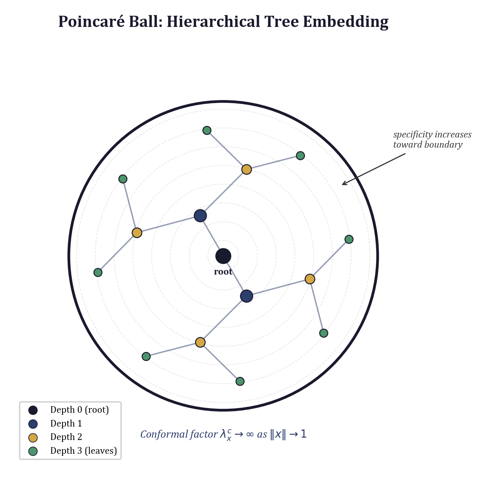

## 3.1 Why Hyperbolic Space?

### 3.1.1 The Exponential Growth Problem

Consider a complete binary tree of depth $d$. It contains $2^{d+1} - 1$ nodes and $2^d$ leaves. More generally, a $k$-ary tree of depth $d$ contains $\Theta(k^d)$ nodes. This exponential growth is not an inconvenience — it is the defining structural property of hierarchical data.

Now suppose we wish to embed such a tree into a metric space $(X, d_X)$ so that the tree distance $d_T(u,v)$ between any two nodes $u,v$ is faithfully preserved. Formally, we seek a mapping $f: V \to X$ and constants $\alpha, \beta > 0$ such that for all $u,v \in V$:

$$\alpha \cdot d_T(u,v) \;\leq\; d_X\bigl(f(u), f(v)\bigr) \;\leq\; \beta \cdot d_T(u,v)$$

The *distortion* of the embedding is $\beta / \alpha$. The celebrated result of Bourgain (1985) shows that any $n$-point metric space embeds into $\ell_2$ with distortion $O(\log n)$. But for trees the situation in Euclidean space is much worse.

**Theorem 3.1 (Linial, London, and Rabinovich, 1995).** Any embedding of the complete binary tree of depth $d$ into $\mathbb{R}^k$ with the Euclidean metric incurs distortion $\Omega\!\bigl(\sqrt{\log n}\,\bigr)$ when $k$ is fixed, and achieving $O(1)$ distortion requires dimension $k = \Omega(n)$.

The intuition is geometric. In $\mathbb{R}^k$, the volume of a ball of radius $r$ grows as $r^k$ — polynomially in $r$. A tree, however, has exponentially many nodes at distance $d$ from the root. No polynomial-growth space can accommodate exponential branching without either stretching nearby nodes apart or crushing distant nodes together.

### 3.1.2 Exponential Volume Growth in Hyperbolic Space

Hyperbolic space $\mathbb{H}^k$ of constant sectional curvature $-1$ has a fundamentally different volume growth profile. The volume of a geodesic ball of radius $r$ in $\mathbb{H}^k$ satisfies:

$$\text{Vol}\bigl(B_r^{\mathbb{H}^k}\bigr) \;=\; \omega_{k-1} \int_0^r \sinh^{k-1}(t)\, dt \;\sim\; C_k \, e^{(k-1)r}$$

for large $r$, where $\omega_{k-1}$ is the volume of the unit $(k-1)$-sphere. The volume grows *exponentially* in the radius — exactly matching the branching pattern of trees.

**Theorem 3.2 (Gromov, 1987; Sarkar, 2011).** Any finite tree with $n$ nodes and weighted edges embeds into the Poincaré disk $\mathbb{H}^2$ with distortion $1 + \varepsilon$ for any $\varepsilon > 0$, using only two dimensions.

This is a dramatic improvement: from $\Omega(n)$ dimensions in Euclidean space to just 2 in hyperbolic space, with arbitrarily low distortion. In practice, one works with moderate dimensions ($d \in [16, 64]$) and adjustable curvature to balance fidelity against numerical stability.

### 3.1.3 The Poincaré Ball Model

Among the five classical models of hyperbolic geometry (Poincaré ball, Poincaré half-space, Klein, hyperboloid, and hemisphere), the Poincaré ball is the most convenient for machine learning because it lives inside a bounded subset of $\mathbb{R}^d$ and thus interfaces cleanly with standard optimizers and neural network layers.

**Definition 3.1 (Poincaré Ball).** For curvature parameter $c > 0$, the Poincaré ball of dimension $d$ is the open ball

$$\mathbb{B}^d_c \;=\; \bigl\{\, x \in \mathbb{R}^d \;:\; c\,\|x\|^2 < 1 \,\bigr\}$$

equipped with the Riemannian metric tensor

$$g_x^{\mathbb{B}} \;=\; \bigl(\lambda_x^c\bigr)^2 \, g^E, \qquad \lambda_x^c \;=\; \frac{2}{1 - c\,\|x\|^2}$$

where $g^E$ is the Euclidean metric and $\lambda_x^c$ is the *conformal factor*. The sectional curvature is $-c$ everywhere.

The conformal factor $\lambda_x^c$ diverges as $\|x\| \to 1/\sqrt{c}$, meaning that distances near the boundary of the ball are enormously magnified — a small Euclidean step near the boundary corresponds to a large geodesic distance. This is precisely why exponentially many tree leaves can be packed near the boundary while maintaining their pairwise distances.

---

## 3.2 Core Operations on the Poincaré Ball

All practical algorithms on $\mathbb{B}^d_c$ reduce to five operations: Möbius addition, geodesic distance, the exponential map, the logarithmic map, and projection back into the ball. We derive each in turn and provide numerically stable implementations.

### 3.2.1 Möbius Addition

The group operation on $\mathbb{B}^d_c$ generalizes vector addition. For $x, y \in \mathbb{B}^d_c$, the *Möbius addition* is:

$$x \oplus_c y \;=\; \frac{\bigl(1 + 2c\,\langle x, y \rangle + c\,\|y\|^2\bigr)\,x \;+\; \bigl(1 - c\,\|x\|^2\bigr)\,y}{1 + 2c\,\langle x, y \rangle + c^2\,\|x\|^2\,\|y\|^2}$$

Möbius addition is *not* commutative: in general $x \oplus_c y \neq y \oplus_c x$. It is, however, *gyrocommutative* — it satisfies a rotated commutativity law that is the foundation of gyrovector space theory (Ungar, 2008). The identity element is $\mathbf{0}$, and the inverse of $x$ is $-x$.

Numerical stability requires care in the denominator. When $c\|x\|^2$ and $c\|y\|^2$ are both close to 1, the denominator approaches zero. We clamp it away from zero:

```python
class PoincareBall:
    """Poincaré ball model of hyperbolic space with curvature -c."""

    def __init__(self, c: float = 1.0, dim: int = 2):
        self.c = c
        self.dim = dim
        self.EPS = 1e-5
        self.MAX_NORM = 0.95  # keep points inside 95% of boundary

    def mobius_add(self, x: torch.Tensor, y: torch.Tensor) -> torch.Tensor:
        """
        Möbius addition x ⊕_c y on the Poincaré ball.

        Args:
            x: Tensor of shape (..., d), points on the ball
            y: Tensor of shape (..., d), points on the ball

        Returns:
            Tensor of shape (..., d), the Möbius sum
        """
        c = self.c
        x_dot_y = (x * y).sum(dim=-1, keepdim=True)
        x_sq = (x * x).sum(dim=-1, keepdim=True)
        y_sq = (y * y).sum(dim=-1, keepdim=True)

        numerator = (1 + 2 * c * x_dot_y + c * y_sq) * x + \
                    (1 - c * x_sq) * y
        denominator = 1 + 2 * c * x_dot_y + c ** 2 * x_sq * y_sq
        denominator = denominator.clamp(min=self.EPS)

        return self.project(numerator / denominator)
```

The final `project` call (Section 3.2.5) ensures the result remains inside the ball even under floating-point error.

### 3.2.2 Geodesic Distance

The geodesic distance between two points $x, y \in \mathbb{B}^d_c$ has a closed form in terms of Möbius addition:

$$d_c(x, y) \;=\; \frac{2}{\sqrt{c}} \, \text{arctanh}\!\Bigl(\sqrt{c}\,\bigl\|(-x) \oplus_c y\bigr\|\Bigr)$$

Since $\text{arctanh}(z) = \frac{1}{2}\ln\!\bigl(\frac{1+z}{1-z}\bigr)$, the distance diverges logarithmically as points approach the boundary — confirming the exponential capacity of the space.

```python
    def distance(self, x: torch.Tensor, y: torch.Tensor) -> torch.Tensor:
        """
        Geodesic distance between x and y on the Poincaré ball.

        Returns:
            Tensor of shape (...,), pairwise distances
        """
        c = self.c
        neg_x = -x
        diff = self.mobius_add(neg_x, y)
        diff_norm = diff.norm(dim=-1).clamp(min=self.EPS)
        sqrt_c = c ** 0.5

        # Clamp argument to arctanh to avoid NaN at boundary
        arg = (sqrt_c * diff_norm).clamp(max=1.0 - self.EPS)
        return (2.0 / sqrt_c) * torch.atanh(arg)
```

**Remark 3.1.** The clamping of the `arctanh` argument is essential. Without it, points at the boundary produce `arctanh(1) = ∞`, which propagates `NaN` through all subsequent gradients. The choice of `1 - EPS` with `EPS = 1e-5` provides a good balance between numerical range and stability.

### 3.2.3 Exponential Map

The exponential map $\exp_x^c: T_x\mathbb{B}^d_c \to \mathbb{B}^d_c$ takes a point $x$ on the manifold and a tangent vector $v \in T_x\mathbb{B}^d_c$ and returns the point reached by following the geodesic from $x$ in direction $v$ for unit time:

$$\exp_x^c(v) \;=\; x \oplus_c \left(\tanh\!\Bigl(\frac{\sqrt{c}\,\lambda_x^c\,\|v\|}{2}\Bigr)\,\frac{v}{\sqrt{c}\,\|v\|}\right)$$

where $\lambda_x^c = \frac{2}{1 - c\|x\|^2}$ is the conformal factor at $x$.

```python
    def exp_map(self, x: torch.Tensor, v: torch.Tensor) -> torch.Tensor:
        """
        Exponential map at point x with tangent vector v.

        Maps from the tangent space at x onto the manifold.

        Args:
            x: Tensor of shape (..., d), base point on the ball
            v: Tensor of shape (..., d), tangent vector at x

        Returns:
            Tensor of shape (..., d), resulting point on the ball
        """
        c = self.c
        sqrt_c = c ** 0.5
        v_norm = v.norm(dim=-1, keepdim=True).clamp(min=self.EPS)
        x_sq = (x * x).sum(dim=-1, keepdim=True)

        # Conformal factor
        lambda_x = 2.0 / (1.0 - c * x_sq).clamp(min=self.EPS)

        # Second argument to Möbius addition
        coeff = torch.tanh(sqrt_c * lambda_x * v_norm / 2.0) / (sqrt_c * v_norm)
        y = coeff * v

        return self.mobius_add(x, y)
```

The exponential map is the primary mechanism by which gradient updates in tangent space (which is Euclidean and compatible with standard optimizers like Adam) are transferred onto the manifold.

### 3.2.4 Logarithmic Map

The logarithmic map $\log_x^c: \mathbb{B}^d_c \to T_x\mathbb{B}^d_c$ is the inverse of the exponential map. Given two points $x, y \in \mathbb{B}^d_c$, it returns the tangent vector at $x$ pointing toward $y$ whose magnitude equals the geodesic distance:

$$\log_x^c(y) \;=\; \frac{2}{\sqrt{c}\,\lambda_x^c}\,\text{arctanh}\!\bigl(\sqrt{c}\,\|{-x \oplus_c y}\|\bigr)\,\frac{-x \oplus_c y}{\|-x \oplus_c y\|}$$

```python
    def log_map(self, x: torch.Tensor, y: torch.Tensor) -> torch.Tensor:
        """
        Logarithmic map: inverse of exp_map.

        Returns the tangent vector at x that points toward y.

        Args:
            x: Tensor of shape (..., d), base point on the ball
            y: Tensor of shape (..., d), target point on the ball

        Returns:
            Tensor of shape (..., d), tangent vector at x
        """
        c = self.c
        sqrt_c = c ** 0.5
        diff = self.mobius_add(-x, y)
        diff_norm = diff.norm(dim=-1, keepdim=True).clamp(min=self.EPS)
        x_sq = (x * x).sum(dim=-1, keepdim=True)

        lambda_x = 2.0 / (1.0 - c * x_sq).clamp(min=self.EPS)
        arg = (sqrt_c * diff_norm).clamp(max=1.0 - self.EPS)

        coeff = (2.0 / (sqrt_c * lambda_x)) * torch.atanh(arg) / diff_norm
        return coeff * diff
```

Together, the exponential and logarithmic maps provide a *Riemannian optimization* workflow: parameters live on the manifold, gradients are computed in the ambient Euclidean space, retracted to the tangent space via the Riemannian metric, and then mapped back to the manifold via $\exp_x^c$.

### 3.2.5 Projection onto the Ball

Floating-point arithmetic can push points outside the open ball. Since operations on $\mathbb{B}^d_c$ are undefined for $c\|x\|^2 \geq 1$, we must project points back inside:

$$\text{proj}(x) \;=\; \begin{cases} x & \text{if } \|x\| < \frac{r_{\max}}{\sqrt{c}} \\[4pt] \frac{r_{\max}}{\sqrt{c}\,\|x\|}\,x & \text{otherwise} \end{cases}$$

where $r_{\max} < 1$ (typically 0.95) provides a safety margin:

```python
    def project(self, x: torch.Tensor) -> torch.Tensor:
        """
        Project points back inside the Poincaré ball.

        Ensures ||x|| < MAX_NORM / sqrt(c) to maintain numerical stability.
        """
        c = self.c
        max_radius = self.MAX_NORM / (c ** 0.5)
        x_norm = x.norm(dim=-1, keepdim=True).clamp(min=self.EPS)
        cond = x_norm > max_radius
        projected = x / x_norm * max_radius
        return torch.where(cond, projected, x)
```

The choice of $r_{\max} = 0.95$ deserves comment. Setting it too close to 1 risks numerical overflow in the conformal factor $\lambda_x^c$, while setting it too small artificially constrains the usable volume of the ball. At $r_{\max} = 0.95$, the conformal factor is $\lambda = 2/(1 - 0.9025) = 20.51$, which is large but comfortably within float32 range.

---

## 3.3 Embedding Taxonomies

We now apply the Poincaré ball to a concrete task: embedding a biological taxonomy so that taxonomic distance is faithfully represented by geodesic distance.

### 3.3.1 Problem Setup

Let $\mathcal{T}$ be a taxonomy (a rooted tree) with $n$ species. Define the *taxonomic distance matrix* $D \in \mathbb{R}^{n \times n}$ where $D_{ij}$ is the number of edges on the path from species $i$ to species $j$ in $\mathcal{T}$. Our goal is to find an embedding $f: \{1, \ldots, n\} \to \mathbb{B}^d_c$ that minimizes the stress:

$$\mathcal{L} \;=\; \sum_{i < j} \Bigl(d_c\bigl(f(i), f(j)\bigr) - D_{ij}\Bigr)^2$$

### 3.3.2 Spectral Initialization

Random initialization in hyperbolic space converges slowly and often gets trapped in poor local minima. A spectral initialization based on the Gaussian kernel over $D$ provides a much better starting point.

1. **Compute the Gaussian kernel matrix:**

$$K_{ij} \;=\; \exp\!\Bigl(-\frac{D_{ij}^2}{2\sigma^2}\Bigr)$$

   where $\sigma$ controls the bandwidth. A reasonable default is $\sigma = \text{median}(D)$.

2. **Eigendecomposition:** Compute $K = U \Lambda U^\top$ where $\Lambda = \text{diag}(\lambda_1, \ldots, \lambda_n)$ with $\lambda_1 \geq \cdots \geq \lambda_n$.

3. **Select the top $d$ eigenvectors:** Form the initial coordinates as $X_0 = U_{:,1:d}\,\Lambda_{1:d}^{1/2}$, weighting each eigenvector by the square root of its eigenvalue.

4. **Scale to fit inside the ball:** Normalize so that $\max_i \|x_i\| < r_{\max}/\sqrt{c}$.

```python
import numpy as np
from scipy.linalg import eigh

def spectral_init(distance_matrix: np.ndarray, dim: int = 2,
                  c: float = 1.0, max_norm: float = 0.9) -> np.ndarray:
    """
    Spectral initialization for Poincaré ball embedding.

    Args:
        distance_matrix: (n, n) symmetric matrix of pairwise distances
        dim: target embedding dimension
        c: curvature parameter (negative curvature = -c)
        max_norm: maximum allowed norm after scaling

    Returns:
        (n, dim) array of initial coordinates inside the ball
    """
    n = distance_matrix.shape[0]
    sigma = np.median(distance_matrix[distance_matrix > 0])

    # Gaussian kernel
    K = np.exp(-distance_matrix ** 2 / (2 * sigma ** 2))

    # Eigendecomposition (eigh returns ascending order)
    eigenvalues, eigenvectors = eigh(K)

    # Take top-d eigenvalues (they are at the end for eigh)
    top_eigenvalues = eigenvalues[-dim:][::-1]
    top_eigenvectors = eigenvectors[:, -dim:][:, ::-1]

    # Weight by sqrt of eigenvalue
    coords = top_eigenvectors * np.sqrt(np.maximum(top_eigenvalues, 0.0))

    # Scale to fit inside ball
    max_radius = max_norm / np.sqrt(c)
    current_max = np.max(np.linalg.norm(coords, axis=1))
    if current_max > 1e-8:
        coords = coords * (max_radius / current_max)

    return coords
```

### 3.3.3 Example: Cetacean Taxonomy

To make this concrete, consider embedding a small cetacean taxonomy. The order Cetacea splits into Mysticeti (baleen whales) and Odontoceti (toothed whales). Under Mysticeti we have families like Balaenopteridae (rorquals: blue whale, humpback) and Balaenidae (right whales: bowhead). Under Odontoceti we have Delphinidae (dolphins: bottlenose, orca) and Phocoenidae (porpoises: harbor porpoise).

In a Poincaré disk embedding ($d = 2$, $c = 1$), the root (Cetacea) sits near the origin. The Mysticeti and Odontoceti subtrees occupy opposite sectors of the disk, each fanning out toward the boundary. Species within the same family cluster together near the boundary, separated by small geodesic distances despite being at nearly the same Euclidean radius. Species in different suborders are separated by large geodesic distances because any path between them must pass through the low-curvature interior near the root.

This "onion-like" structure — general concepts near the center, specific instances near the boundary — is the hallmark of hyperbolic embeddings and directly mirrors the hierarchical structure of the data.

---

## 3.4 Hyperbolic Multinomial Logistic Regression

Having embedded data into the Poincaré ball, we need classifiers that operate natively in hyperbolic space. Ganea et al. (2018) showed that the standard multinomial logistic regression (MLR) generalizes naturally to the Poincaré ball.

### 3.4.1 From Euclidean to Hyperbolic

In Euclidean MLR, the logit for class $k$ is $\langle a_k, x \rangle + b_k$, which measures signed distance from $x$ to the hyperplane $\{z : \langle a_k, z \rangle + b_k = 0\}$. In hyperbolic space, hyperplanes are replaced by *geodesic hyperplanes* (totally geodesic submanifolds of codimension 1), and signed distance to such a hyperplane takes the form:

$$\ell_k(x) \;=\; \frac{\lambda_{p_k}^c\,\|a_k\|}{\sqrt{c}} \,\sinh^{-1}\!\Bigl(\frac{2\sqrt{c}\,\langle (-p_k) \oplus_c x,\; a_k \rangle}{(1 - c\,\|(-p_k) \oplus_c x\|^2)\,\|a_k\|}\Bigr)$$

where $p_k \in \mathbb{B}^d_c$ is the *prototype* for class $k$ and $a_k \in T_{p_k}\mathbb{B}^d_c$ is the normal direction.

In practice, a simpler distance-based formulation often works as well or better:

### 3.4.2 Prototype-Based Classification

For each class $k$, learn a prototype $p_k \in \mathbb{B}^d_c$ and a temperature $\tau_k > 0$. The logit for class $k$ is the negative scaled geodesic distance:

$$\ell_k(x) \;=\; -\frac{d_c(x, p_k)}{\tau_k}$$

The class probabilities follow from a softmax:

$$P(y = k \mid x) \;=\; \frac{\exp(\ell_k(x))}{\sum_{j=1}^{K} \exp(\ell_j(x))}$$

Points closest to prototype $p_k$ in geodesic distance receive the highest probability for class $k$. The per-class temperature $\tau_k$ controls how sharply the decision boundary is drawn: small $\tau_k$ produces a hard boundary, large $\tau_k$ a soft one.

```python
import torch
import torch.nn as nn

class HyperbolicMLR(nn.Module):
    """
    Hyperbolic multinomial logistic regression via prototypes.

    Prototypes are parameterized in tangent space at the origin
    and mapped to the ball via exp_map for stable optimization.
    """

    def __init__(self, dim: int, n_classes: int, c: float = 1.0):
        super().__init__()
        self.ball = PoincareBall(c=c, dim=dim)
        self.dim = dim
        self.n_classes = n_classes

        # Learnable prototype directions in tangent space at origin
        self.proto_tangent = nn.Parameter(torch.randn(n_classes, dim) * 0.01)

        # Per-class log-temperature (log to ensure positivity)
        self.log_tau = nn.Parameter(torch.zeros(n_classes))

    def get_prototypes(self) -> torch.Tensor:
        """Map tangent-space parameters to Poincaré ball prototypes."""
        origin = torch.zeros(1, self.dim, device=self.proto_tangent.device)
        return self.ball.exp_map(
            origin.expand(self.n_classes, -1),
            self.proto_tangent
        )

    def forward(self, x: torch.Tensor) -> torch.Tensor:
        """
        Compute class logits for input points.

        Args:
            x: (batch, dim) points on the Poincaré ball

        Returns:
            (batch, n_classes) logits
        """
        prototypes = self.get_prototypes()  # (n_classes, dim)
        tau = self.log_tau.exp()             # (n_classes,)

        # Compute pairwise distances: (batch, n_classes)
        # Expand x to (batch, 1, dim) and prototypes to (1, n_classes, dim)
        dists = self.ball.distance(
            x.unsqueeze(1).expand(-1, self.n_classes, -1),
            prototypes.unsqueeze(0).expand(x.shape[0], -1, -1)
        )

        # Logits = negative distance scaled by temperature
        logits = -dists / tau.unsqueeze(0)
        return logits
```

A key design choice: prototypes are *parameterized in the tangent space at the origin* and mapped to the ball via `exp_map` at each forward pass. This avoids the need for Riemannian optimizers — standard Euclidean Adam updates the tangent-space parameters, and the exponential map handles the manifold constraint. This "tangent space parameterization" trick is widely used and generally more stable than direct Riemannian SGD for moderate curvatures.

---

## 3.5 Hyperbolic Rule Encoding

The most sophisticated application of hyperbolic geometry in this book comes from the ARC-AGI system, where hyperbolic space is used to encode *rules* — the discrete transformation programs that map input grids to output grids. The key insight is that rules have natural hierarchical structure: general rules (e.g., "apply color mapping") subsume specific sub-rules (e.g., "map red to blue in the upper-left quadrant"), forming a tree of increasing specificity.

### 3.5.1 Architecture

The `HyperbolicRuleEncoder` is a neural module that maps from a Euclidean latent space $\mathbb{R}^m$ (produced by an upstream encoder) to the Poincaré ball $\mathbb{B}^d_c$:

$$h \;=\; \exp_{\mathbf{0}}^c\!\bigl(\text{MLP}(z)\bigr), \qquad z \in \mathbb{R}^m,\; h \in \mathbb{B}^d_c$$

The MLP has two layers with a GELU activation:

```python
class HyperbolicRuleEncoder(nn.Module):
    """
    Maps Euclidean latent codes to the Poincaré ball for
    hierarchical rule representation.

    Rules closer to the origin are more general (lower depth
    in the rule tree). Rules near the boundary are highly
    specific. Rule similarity is measured by geodesic distance.
    """

    def __init__(self, input_dim: int, hyperbolic_dim: int, c: float = 1.0):
        super().__init__()
        self.ball = PoincareBall(c=c, dim=hyperbolic_dim)

        # Two-layer MLP: Euclidean z-space → tangent space at origin
        self.mlp = nn.Sequential(
            nn.Linear(input_dim, 2 * hyperbolic_dim),
            nn.GELU(),
            nn.Linear(2 * hyperbolic_dim, hyperbolic_dim),
        )

        # Initialize final layer with small weights for near-origin start
        nn.init.uniform_(self.mlp[-1].weight, -0.001, 0.001)
        nn.init.zeros_(self.mlp[-1].bias)

    def encode(self, z: torch.Tensor) -> torch.Tensor:
        """
        Encode latent vectors into the Poincaré ball.

        Args:
            z: (batch, input_dim) Euclidean latent codes

        Returns:
            h: (batch, hyperbolic_dim) points on the Poincaré ball
        """
        tangent_vec = self.mlp(z)
        origin = torch.zeros_like(tangent_vec)
        h = self.ball.exp_map(origin, tangent_vec)
        return h

    def rule_similarity(self, h1: torch.Tensor, h2: torch.Tensor) -> torch.Tensor:
        """
        Compute similarity between two rule embeddings.

        Uses exp(-distance) so similar rules have similarity near 1
        and dissimilar rules have similarity near 0.

        Args:
            h1, h2: (batch, hyperbolic_dim) rule embeddings

        Returns:
            (batch,) similarity scores in (0, 1]
        """
        dist = self.ball.distance(h1, h2)
        return torch.exp(-dist)

    def rule_depth(self, h: torch.Tensor) -> torch.Tensor:
        """
        Estimate rule specificity from its position on the ball.

        Rules near the origin (small norm) are general.
        Rules near the boundary (large norm) are specific.
        Returns geodesic distance from origin, which grows
        logarithmically as points approach the boundary.

        Args:
            h: (batch, hyperbolic_dim) rule embeddings

        Returns:
            (batch,) depth/specificity scores
        """
        origin = torch.zeros_like(h)
        return self.ball.distance(origin, h)
```

### 3.5.2 Interpreting the Embedding

The `HyperbolicRuleEncoder` exploits three properties of the Poincaré ball:

1. **Rule similarity via geodesic distance.** Two rules that perform similar transformations will have nearby latent codes $z_1, z_2$, which the MLP maps to nearby tangent vectors, which `exp_map` sends to nearby points on the ball. Their similarity $\exp(-d_c(h_1, h_2))$ is close to 1. Rules that perform unrelated transformations end up far apart, with similarity close to 0.

2. **Rule depth/specificity via norm.** The geodesic distance from the origin to a point $h \in \mathbb{B}^d_c$ is:

$$d_c(\mathbf{0}, h) \;=\; \frac{2}{\sqrt{c}}\,\text{arctanh}\!\bigl(\sqrt{c}\,\|h\|\bigr)$$

   This is a monotonically increasing function of $\|h\|$ that diverges as $\|h\| \to 1/\sqrt{c}$. The MLP is initialized with near-zero weights so that all rules start near the origin (maximum generality). During training, rules that apply to specific sub-cases are pushed toward the boundary, while rules that capture broad patterns remain near the center.

3. **Exponential packing capacity.** Because the volume of the ball grows exponentially near the boundary, there is room for exponentially many specific rules without crowding. A single general rule near the center can have $2^k$ specialized descendants at depth $k$, all well-separated.

### 3.5.3 Training Signal

The encoder is trained end-to-end with the downstream task. The loss typically includes:

- A **task loss** (e.g., cross-entropy on predicted output grids) that drives the encoder to produce useful rule representations.
- A **hierarchical regularizer** that encourages parent rules to have smaller norm than their children:

$$\mathcal{L}_{\text{hier}} \;=\; \sum_{(r, r') \in \text{parent-child}} \max\bigl(0,\; \|h_r\| - \|h_{r'}\| + \alpha\bigr)$$

  where $\alpha > 0$ is a margin ensuring children are at least $\alpha$ further from the origin than their parents.

---

## 3.6 Einstein Midpoint for Aggregation

A recurring operation in hyperbolic neural networks is *weighted averaging* — computing the centroid of a set of points on the ball. The Euclidean weighted mean $\bar{x} = \sum_i w_i x_i / \sum_i w_i$ does not generalize directly because $\mathbb{B}^d_c$ is not a vector space.

### 3.6.1 Derivation

The *Einstein midpoint* provides a principled solution. It arises from the Klein model of hyperbolic geometry (which has straight-line geodesics) and can be transferred to the Poincaré ball model.

For points $x_1, \ldots, x_N \in \mathbb{B}^d_c$ with non-negative weights $w_1, \ldots, w_N$, the Einstein midpoint is:

$$\bar{x} \;=\; \frac{\sum_{i=1}^{N} \gamma_i\, w_i\, x_i}{\sum_{i=1}^{N} \gamma_i\, w_i}$$

where $\gamma_i = \gamma_c(x_i)$ is the *Lorentz factor* (conformal factor):

$$\gamma_c(x) \;=\; \frac{1}{1 - c\,\|x\|^2}$$

The Lorentz factor upweights points near the boundary, which is geometrically correct: points near the boundary of the Poincaré ball are "further out" in the actual hyperbolic space, and their positions should contribute more strongly to the midpoint computation to avoid the midpoint being biased toward the origin.

**Proposition 3.1.** The Einstein midpoint of a set of points in $\mathbb{B}^d_c$ lies in $\mathbb{B}^d_c$ (i.e., the formula is closed), and it reduces to the Euclidean weighted mean in the limit $c \to 0$.

*Proof sketch.* By convexity of the open ball and the fact that the $\gamma$-weighted combination is a convex combination (all $\gamma_i w_i \geq 0$ and we normalize by their sum), the result lies in the convex hull of the $x_i$, which is contained in $\mathbb{B}^d_c$. The limit $c \to 0$ sends all $\gamma_i \to 1$, recovering the Euclidean formula. $\square$

```python
    def einstein_midpoint(self, x: torch.Tensor,
                          weights: torch.Tensor = None) -> torch.Tensor:
        """
        Compute the weighted Einstein midpoint of points on the ball.

        Used for aggregating multiple rule representations into
        a single summary point on the manifold.

        Args:
            x: (N, dim) or (batch, N, dim) points on the ball
            weights: (N,) or (batch, N) non-negative weights.
                     If None, uniform weights are used.

        Returns:
            (dim,) or (batch, dim) the Einstein midpoint
        """
        c = self.c

        # Lorentz (conformal) factors: γ_i = 1 / (1 - c||x_i||²)
        x_sq = (x * x).sum(dim=-1)  # (..., N)
        gamma = 1.0 / (1.0 - c * x_sq).clamp(min=self.EPS)  # (..., N)

        if weights is None:
            weights = torch.ones_like(gamma)

        # Weighted combination: Σ γ_i w_i x_i / Σ γ_i w_i
        scale = gamma * weights  # (..., N)
        numerator = (scale.unsqueeze(-1) * x).sum(dim=-2)  # (..., dim)
        denominator = scale.sum(dim=-1, keepdim=True).clamp(min=self.EPS)

        midpoint = numerator / denominator
        return self.project(midpoint)
```

### 3.6.2 Application: Aggregating Rule Embeddings

In the ARC-AGI system, a single input-output example may activate multiple candidate rules. The Einstein midpoint aggregates their hyperbolic representations into a single summary vector:

```python
def aggregate_rules(encoder: HyperbolicRuleEncoder,
                    rule_latents: torch.Tensor,
                    attention_weights: torch.Tensor) -> torch.Tensor:
    """
    Aggregate multiple rule embeddings into a single representation.

    Args:
        encoder: the hyperbolic rule encoder
        rule_latents: (batch, n_rules, input_dim) Euclidean latents
        attention_weights: (batch, n_rules) attention-derived weights

    Returns:
        (batch, hyperbolic_dim) aggregated rule embedding
    """
    # Encode each rule into the Poincaré ball
    batch, n_rules, _ = rule_latents.shape
    flat = rule_latents.reshape(batch * n_rules, -1)
    h_flat = encoder.encode(flat)
    h = h_flat.reshape(batch, n_rules, -1)  # (batch, n_rules, hyp_dim)

    # Aggregate via Einstein midpoint
    return encoder.ball.einstein_midpoint(h, weights=attention_weights)
```

The attention weights typically come from a cross-attention mechanism that scores how relevant each candidate rule is to the current input. The Einstein midpoint then produces a single point on the ball that respects the hyperbolic geometry — it is not simply the Euclidean average of the embeddings, which would systematically underestimate the "depth" of the aggregate rule.

---

## 3.7 Numerical Considerations and Best Practices

Working with hyperbolic embeddings introduces numerical challenges that do not arise in Euclidean models. We summarize the key lessons:

1. **Always clamp denominators and `arctanh` arguments.** The formulas for Möbius addition, distance, and the exponential map all contain terms that can approach zero or one under finite precision. A minimum clamp of $\varepsilon = 10^{-5}$ is usually sufficient for float32.

2. **Project after every operation.** Any sequence of Möbius additions or exponential maps can drift outside the ball due to accumulated floating-point error. Call `project()` after every manifold operation.

3. **Parameterize in tangent space.** Rather than directly optimizing points on the ball (which requires Riemannian gradient descent), parameterize them as tangent vectors at the origin and apply `exp_map` at each forward pass. This allows standard Euclidean optimizers and avoids the need for specialized Riemannian step-size schedules.

4. **Use moderate curvature.** Very large $c$ (high curvature) packs the effective space into a tiny Euclidean ball, amplifying floating-point errors. Very small $c$ (low curvature) approaches flat Euclidean geometry and loses the benefits of hyperbolic embedding. Values of $c \in [0.1, 2.0]$ are typical. Curvature can also be made a learnable parameter.

5. **Initialize near the origin.** New embeddings and MLP output layers should be initialized with small weights so that initial points lie near the origin. This provides a "blank slate" from which the optimizer can gradually push points outward as hierarchical structure is learned.

6. **Mixed-precision caution.** Float16 has only 3.3 decimal digits of precision. The conformal factor $\lambda_x^c = 2/(1 - c\|x\|^2)$ at $\|x\| = 0.99$ is $\approx 100$, and at $\|x\| = 0.999$ is $\approx 1000$. In float16, $1 - 0.999^2 = 1 - 0.998 = 0.002$ loses significant precision. Use float32 for all hyperbolic operations even when the rest of the model uses mixed precision.

---

## 3.8 Summary and Connections

Hyperbolic geometry provides a mathematically principled framework for representing hierarchical data in continuous space. The Poincaré ball model offers:

- **Exponential volume growth** matching the branching factor of trees, enabling low-distortion embedding in fixed dimension.
- **Closed-form operations** (Möbius addition, geodesic distance, exp/log maps) that are differentiable and compatible with gradient-based optimization.
- **Interpretable structure** where distance from the origin encodes depth/specificity and geodesic distance encodes similarity.

We saw three applications:

- *Taxonomy embedding* (Section 3.3): encoding species trees with spectral initialization and stress minimization.
- *Hyperbolic MLR* (Section 3.4): prototype-based classification using geodesic distance as the logit.
- *Hyperbolic rule encoding* (Section 3.5): mapping program synthesis rules to the Poincaré ball so that general rules sit near the center and specific sub-rules fan out toward the boundary.

The Einstein midpoint (Section 3.6) provides the aggregation primitive needed to combine multiple hyperbolic representations — a building block we will use extensively in Part II when we develop hyperbolic attention mechanisms and tree-structured decoders.

In the next chapter, we turn to *product manifolds* — spaces formed by taking Cartesian products of Euclidean, hyperbolic, and spherical components. These mixed-curvature spaces can simultaneously capture hierarchical, flat, and cyclical structure in a single embedding, extending the ideas of this chapter to data with heterogeneous geometric character.

---

### Exercises

**3.1.** Prove that Möbius addition reduces to standard vector addition in the limit $c \to 0$. *(Hint: expand the numerator and denominator to first order in $c$.)*

**3.2.** Show that $d_c(\mathbf{0}, x) = \frac{2}{\sqrt{c}}\,\text{arctanh}(\sqrt{c}\,\|x\|)$ by computing $(-\mathbf{0}) \oplus_c x$ and substituting into the distance formula.

**3.3.** Implement the full taxonomy embedding pipeline for the cetacean example: construct the distance matrix for a 12-species tree, compute the spectral initialization, and refine by gradient descent on the stress loss. Plot the resulting Poincaré disk embedding and verify that taxonomic neighbors are geodesically close.

**3.4.** The conformal factor $\gamma_c(x) = 1/(1 - c\|x\|^2)$ and the Riemannian conformal factor $\lambda_x^c = 2/(1 - c\|x\|^2)$ differ by a factor of 2. Explain why the Einstein midpoint uses $\gamma$ rather than $\lambda$. *(Hint: the Einstein midpoint is derived in the Klein model, not the Poincaré model.)*

**3.5.** Extend the `HyperbolicMLR` classifier to use the full Ganea et al. (2018) formulation with geodesic hyperplanes rather than prototype distances. Compare classification accuracy on a synthetic hierarchical dataset.

---

### Bibliographic Notes

The use of hyperbolic geometry for tree embedding traces to Gromov's theory of $\delta$-hyperbolic metric spaces (Gromov, 1987). Sarkar (2011) gave the first constructive low-distortion embedding of trees into $\mathbb{H}^2$. The Poincaré ball model for machine learning was popularized by Nickel and Kiela (2017), who learned word embeddings with dramatically better hierarchy capture than Euclidean models. Ganea et al. (2018) developed hyperbolic neural network layers including the MLR classifier. The Einstein midpoint aggregation was introduced by Gulcehre et al. (2019) and refined by Chami et al. (2019). For a comprehensive treatment of gyrovector spaces underpinning Möbius operations, see Ungar (2008). The connection between curvature and volume growth is covered in standard Riemannian geometry texts; we recommend do Carmo (1992) for the foundations.


\newpage

# Chapter 4: SPD Manifolds and Spectral Geometry

*Structural Fuzzing: Geometric Methods for Adversarial Model Validation* --- Andrew H. Bond

---

In the preceding chapters, we established the vocabulary of manifolds, tangent spaces, and geodesics. We now turn to a specific manifold that arises naturally in signal processing, machine learning, and statistical modeling: the manifold of symmetric positive definite (SPD) matrices. This chapter develops the Riemannian geometry of SPD matrices from first principles, introduces the log-Euclidean metric as a computationally tractable distance function, and demonstrates how these ideas apply to spectral analysis of acoustic signals. The running example --- covariance analysis of cetacean vocalizations --- illustrates a broader pattern: whenever your data consists of second-order statistics (covariances, correlation matrices, diffusion tensors), flat Euclidean methods throw away geometric structure that the SPD manifold preserves.


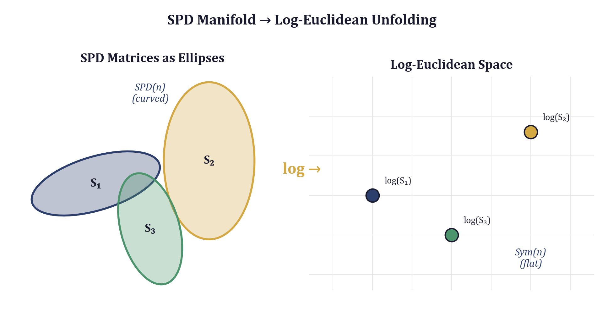

## 4.1 The Manifold of Positive Definite Matrices

**Definition 4.1.** The set of *n x n* symmetric positive definite matrices is

$$\text{SPD}(n) = \{S \in \mathbb{R}^{n \times n} : S = S^\top,\; x^\top S x > 0 \;\forall x \neq 0\}.$$

This set is open in the space of symmetric matrices: every SPD matrix has a neighborhood of SPD matrices around it. It is also a smooth manifold of dimension *n(n+1)/2*, since a symmetric matrix is determined by its upper triangle.

### Why Not a Vector Space?

At first glance, SPD(n) looks like it might be a vector subspace of $\mathbb{R}^{n \times n}$. After all, the sum of two SPD matrices is SPD. If $S_1$ and $S_2$ are both symmetric positive definite, then for any $x \neq 0$,

$$x^\top(S_1 + S_2)x = x^\top S_1 x + x^\top S_2 x > 0.$$

However, SPD(n) fails the scalar multiplication axiom. Multiplying an SPD matrix by $-1$ produces a negative definite matrix, which is not in SPD(n). More subtly, even restricting to positive scalars does not resolve the problem, because a vector space requires closure under *all* scalars, including zero (the zero matrix is not positive definite). Therefore SPD(n) is not a vector space.

### Why Not Just Use Euclidean Distance?

One might try to measure distances between SPD matrices using the Frobenius norm:

$$d_F(S_1, S_2) = \|S_1 - S_2\|_F = \sqrt{\sum_{i,j}(S_1 - S_2)_{ij}^2}.$$

This is a perfectly valid metric in the mathematical sense, but it has a serious practical defect: it treats SPD matrices as if they were arbitrary points in $\mathbb{R}^{n \times n}$, ignoring the constraint that they must remain positive definite. Consider two covariance matrices that differ primarily in one eigenvalue --- one might have eigenvalues $(10, 1, 0.01)$ and another $(10, 1, 100)$. The Frobenius distance between them is dominated by the large eigenvalue change, but the *geometric* significance of moving an eigenvalue from $0.01$ to $100$ (a $10{,}000$-fold change in one variance direction) is much greater than Frobenius distance suggests.

More concretely, the Frobenius norm assigns equal weight to a change from $0.001$ to $0.002$ and a change from $1000.001$ to $1000.002$, even though the former represents a doubling of a variance component while the latter is negligible. For covariance matrices, ratios matter more than differences.

This motivates the use of Riemannian geometry. By equipping SPD(n) with a Riemannian metric that respects its curvature, we obtain distance functions and averaging operations that are invariant to the kinds of transformations that arise naturally in statistical settings.

### Tangent Space Structure

At any point $S \in \text{SPD}(n)$, the tangent space $T_S\text{SPD}(n)$ is the set of all *n x n* symmetric matrices --- there is no positive definiteness constraint on tangent vectors, only symmetry. This is a vector space of dimension *n(n+1)/2*. The Riemannian metric at each point defines an inner product on this tangent space, and different choices of inner product yield different Riemannian geometries on SPD(n).

## 4.2 The Log-Euclidean Metric

Among the several Riemannian metrics on SPD(n), the *log-Euclidean metric* offers the best balance of mathematical rigor and computational efficiency. It was introduced by Arsigny et al. (2006) and has since become a standard tool in diffusion tensor imaging, brain-computer interfaces, and covariance-based classification.

**Definition 4.2.** The *log-Euclidean distance* between two SPD matrices $S_1, S_2 \in \text{SPD}(n)$ is

$$d_{LE}(S_1, S_2) = \|\log(S_1) - \log(S_2)\|_F$$

where $\log(\cdot)$ denotes the matrix logarithm and $\|\cdot\|_F$ is the Frobenius norm.

**Proposition 4.1.** $d_{LE}$ is a proper metric on SPD(n). That is, it satisfies non-negativity, identity of indiscernibles, symmetry, and the triangle inequality.

*Proof sketch.* The matrix logarithm is a diffeomorphism from SPD(n) to the space Sym(n) of all *n x n* symmetric matrices. Since the Frobenius norm is a metric on Sym(n), composing with the diffeomorphism $\log$ yields a metric on SPD(n). $\square$

The key insight is that the logarithm "unfolds" the curved SPD manifold into the flat vector space of symmetric matrices, where ordinary Euclidean geometry applies. This is analogous to how the logarithm maps the positive reals $(0, \infty)$ --- which have a multiplicative structure --- onto all of $\mathbb{R}$, where addition is the natural operation.

### Computing the Matrix Logarithm

The matrix logarithm of an SPD matrix is computed via eigendecomposition. If $S = U \Lambda U^\top$ where $\Lambda = \text{diag}(\lambda_1, \ldots, \lambda_n)$ with all $\lambda_i > 0$, then

$$\log(S) = U \cdot \text{diag}(\log \lambda_1, \ldots, \log \lambda_n) \cdot U^\top.$$

This is well-defined precisely because the eigenvalues of an SPD matrix are strictly positive, so their logarithms exist. The computational cost is dominated by the eigendecomposition, which is $O(n^3)$.

The following implementation from the `eris-ketos` project encapsulates this operation as a method on an `SPDManifold` class:

```python
class SPDManifold:
    """Operations on the manifold of Symmetric Positive Definite matrices."""

    @staticmethod
    def log_map(S: torch.Tensor) -> torch.Tensor:
        """Log-Euclidean map: SPD matrix -> symmetric matrix (tangent space).

        Computes log(S) via eigendecomposition: log(S) = U·diag(log(λ))·U^T
        """
        eigvals, eigvecs = torch.linalg.eigh(S)
        eigvals = eigvals.clamp_min(1e-10)
        return eigvecs @ torch.diag_embed(eigvals.log()) @ eigvecs.transpose(-2, -1)
```

Note the `clamp_min(1e-10)` guard: in finite-precision arithmetic, eigenvalues can drift to zero or below due to numerical error, and $\log(0)$ is undefined. Clamping to a small positive constant prevents this without meaningfully affecting the result, since an eigenvalue of $10^{-10}$ already represents a direction of negligible variance. The use of `torch.linalg.eigh` (rather than `torch.linalg.eig`) exploits the symmetry of $S$ for a faster and more numerically stable decomposition.

### The Exponential Map

The inverse operation --- the matrix exponential --- maps from the tangent space (symmetric matrices) back to SPD(n):

$$\exp(X) = U \cdot \text{diag}(e^{\mu_1}, \ldots, e^{\mu_n}) \cdot U^\top$$

where $X = U \cdot \text{diag}(\mu_1, \ldots, \mu_n) \cdot U^\top$ is the eigendecomposition of the symmetric matrix $X$.

```python
    @staticmethod
    def exp_map(X: torch.Tensor) -> torch.Tensor:
        """Exp map: symmetric matrix (tangent space) -> SPD matrix."""
        eigvals, eigvecs = torch.linalg.eigh(X)
        return eigvecs @ torch.diag_embed(eigvals.exp()) @ eigvecs.transpose(-2, -1)
```

The exponential of any symmetric matrix is guaranteed to be SPD (since $e^{\mu_i} > 0$ for all real $\mu_i$), so the exp map always lands in SPD(n). Together, the log and exp maps form a diffeomorphism between SPD(n) and Sym(n), which is the foundation of the log-Euclidean framework.

### Log-Euclidean Distance Implementation

With the log map in hand, the distance computation is straightforward:

```python
    @staticmethod
    def distance(S1: torch.Tensor, S2: torch.Tensor) -> torch.Tensor:
        """Log-Euclidean distance between SPD matrices.

        d(S1, S2) = ||log(S1) - log(S2)||_F
        """
        log_diff = SPDManifold.log_map(S1) - SPDManifold.log_map(S2)
        return torch.norm(log_diff.flatten(-2), dim=-1)
```

The `flatten(-2)` call reshapes the *n x n* matrix into a vector of length $n^2$ before computing the norm. The `dim=-1` argument computes the norm along the last dimension, enabling batched computation. This entire operation supports arbitrary batch dimensions via PyTorch's broadcasting, so one can compute distances between batches of SPD matrices without explicit loops.

### Comparison: Log-Euclidean vs. Frobenius

To build intuition for why the log-Euclidean metric is more discriminative, consider two $2 \times 2$ covariance matrices:

$$S_1 = \begin{pmatrix} 1 & 0 \\ 0 & 0.01 \end{pmatrix}, \quad S_2 = \begin{pmatrix} 1 & 0 \\ 0 & 100 \end{pmatrix}.$$

The Frobenius distance is $\|S_1 - S_2\|_F = \sqrt{(0.01 - 100)^2} = 99.99$. Now consider:

$$S_3 = \begin{pmatrix} 1 & 0 \\ 0 & 10000 \end{pmatrix}.$$

The Frobenius distance $d_F(S_2, S_3) = 9900$, which is $99\times$ larger than $d_F(S_1, S_2)$, even though both pairs differ by a factor of $10{,}000$ in one eigenvalue.

The log-Euclidean distances tell a different story. We have $\log(\lambda)$ values of $\log(0.01) \approx -4.6$, $\log(100) \approx 4.6$, and $\log(10000) \approx 9.2$. So $d_{LE}(S_1, S_2) \approx |{-4.6} - 4.6| = 9.2$ and $d_{LE}(S_2, S_3) \approx |4.6 - 9.2| = 4.6$. The log-Euclidean metric correctly reports that the multiplicative change from $S_2$ to $S_3$ (a factor of 100) is smaller than the change from $S_1$ to $S_2$ (a factor of 10,000). This scale-sensitivity is essential when eigenvalues span many orders of magnitude, as they do in covariance matrices from real-world signals.

## 4.3 The Frechet Mean on SPD(n)

Given a collection of SPD matrices $S_1, \ldots, S_k$, we often need their "average." The ordinary arithmetic mean $(S_1 + \cdots + S_k)/k$ is SPD (since SPD matrices are closed under addition and positive scalar multiplication), but it is not the correct notion of center on the Riemannian manifold. The arithmetic mean minimizes $\sum_i \|S_i - M\|_F^2$, which uses the flat Euclidean distance, not the manifold distance.

**Definition 4.3.** The *Frechet mean* (or *Karcher mean*) of SPD matrices $S_1, \ldots, S_k$ with weights $w_1, \ldots, w_k$ is

$$\bar{S} = \arg\min_{M \in \text{SPD}(n)} \sum_{i=1}^{k} w_i \, d(S_i, M)^2$$

where $d$ is the chosen Riemannian distance.

For the affine-invariant metric, computing the Frechet mean requires an iterative algorithm. A major advantage of the log-Euclidean metric is that the Frechet mean has a *closed-form solution*:

$$\bar{S}_{LE} = \exp\!\left(\sum_{i=1}^{k} w_i \log(S_i)\right).$$

This is simply the exponential of the weighted average in the tangent space. The proof is immediate: $\log$ is an isometry from $(SPD(n), d_{LE})$ to $(\text{Sym}(n), \|\cdot\|_F)$, and the Frechet mean under the Frobenius norm is the arithmetic mean.

```python
    @staticmethod
    def frechet_mean(
        matrices: torch.Tensor,
        weights: torch.Tensor | None = None,
    ) -> torch.Tensor:
        """Log-Euclidean Frechet mean of SPD matrices.

        mean = exp(weighted_mean(log(S_i)))

        Args:
            matrices: Batch of SPD matrices, shape [n, d, d].
            weights: Optional weights, shape [n]. Defaults to uniform.
        """
        logs = SPDManifold.log_map(matrices)
        if weights is not None:
            w = weights / weights.sum()
            mean_log = (logs * w.view(-1, 1, 1)).sum(dim=0)
        else:
            mean_log = logs.mean(dim=0)
        return SPDManifold.exp_map(mean_log)
```

The implementation normalizes the weights to sum to one, broadcasts them across the matrix dimensions with `w.view(-1, 1, 1)`, and computes the weighted sum in log-space. The final `exp_map` call projects back onto the SPD manifold.

**Example 4.1.** *Consider two 2x2 covariance matrices representing "narrow-band" and "broad-band" spectral patterns:*

$$S_1 = \begin{pmatrix} 1 & 0.5 \\ 0.5 & 1 \end{pmatrix}, \quad S_2 = \begin{pmatrix} 4 & 0 \\ 0 & 4 \end{pmatrix}.$$

*The arithmetic mean is $\frac{1}{2}(S_1 + S_2) = \begin{pmatrix} 2.5 & 0.25 \\ 0.25 & 2.5 \end{pmatrix}$, which has eigenvalues $2.75$ and $2.25$. The log-Euclidean Frechet mean $\exp(\frac{1}{2}(\log(S_1) + \log(S_2)))$ yields a different matrix --- one that better interpolates the geometric structure of the two covariances. The difference is most pronounced when the constituent matrices have eigenvalues spanning several orders of magnitude.*

## 4.4 Frequency-Band Covariance Extraction

We now connect the abstract SPD machinery to concrete signal processing. Given a spectrogram --- a time-frequency representation of an audio signal --- we construct an SPD covariance matrix that encodes how frequency bands co-vary over time.

### From Spectrograms to Covariance Matrices

A mel spectrogram is a matrix $\mathbf{X} \in \mathbb{R}^{n_\text{mels} \times n_\text{frames}}$ where each row represents energy in a mel-scaled frequency bin and each column represents a time frame. Typical values are $n_\text{mels} = 128$ and $n_\text{frames}$ depends on the signal duration.

Working with the full $128 \times 128$ covariance matrix is impractical: it has $128 \times 129 / 2 = 8{,}256$ free parameters, and eigendecomposition would be expensive at every step. Instead, we reduce dimensionality by grouping mel bins into $n_\text{bands}$ frequency bands.

**Algorithm 4.1** (Frequency-band covariance extraction)**.**

1. **Band averaging.** Partition the $n_\text{mels}$ mel bins into $n_\text{bands}$ contiguous groups of equal size. Average within each group to obtain a reduced representation $\mathbf{B} \in \mathbb{R}^{n_\text{bands} \times n_\text{frames}}$.

2. **Centering.** Subtract the temporal mean from each band: $\tilde{\mathbf{B}} = \mathbf{B} - \bar{\mathbf{B}}$, where $\bar{B}_i = \frac{1}{n_\text{frames}} \sum_t B_{it}$.

3. **Covariance computation.** Compute the sample covariance:
$$\mathbf{C} = \frac{\tilde{\mathbf{B}} \tilde{\mathbf{B}}^\top}{n_\text{frames} - 1}.$$

4. **L2 regularization.** Add $\epsilon \mathbf{I}$ to guarantee positive definiteness:
$$\mathbf{C}_\text{reg} = \mathbf{C} + \epsilon \mathbf{I}, \quad \epsilon = 10^{-4}.$$

The regularization in step 4 is essential. The raw covariance matrix can be positive *semi*-definite (with zero eigenvalues) when $n_\text{frames} < n_\text{bands}$ or when frequency bands are linearly dependent. Adding $\epsilon \mathbf{I}$ shifts all eigenvalues by $\epsilon$, ensuring strict positive definiteness without materially altering the covariance structure.

```python
def compute_covariance(
    spectrogram: np.ndarray,
    n_bands: int = 16,
    regularize: float = 1e-4,
) -> np.ndarray:
    """Compute frequency-band covariance matrix from a spectrogram.

    Groups mel bins into n_bands equal-sized bands, then computes the
    covariance across time for each band pair.
    """
    n_mels, n_frames = spectrogram.shape
    band_size = n_mels // n_bands
    usable = n_bands * band_size

    # Group mel bins into bands by averaging
    bands = spectrogram[:usable, :].reshape(n_bands, band_size, n_frames).mean(axis=1)

    # Center and compute covariance
    centered = bands - bands.mean(axis=1, keepdims=True)
    cov = centered @ centered.T / max(n_frames - 1, 1)

    # Regularize for PD guarantee
    cov += regularize * np.eye(n_bands)
    return cov
```

Several implementation details deserve comment. The `reshape` and `mean` pattern for band averaging is an efficient alternative to explicit loops: `spectrogram[:usable, :].reshape(n_bands, band_size, n_frames)` creates a 3D tensor where the first axis indexes bands, the second indexes mel bins within each band, and the third indexes time frames. Averaging along `axis=1` collapses the within-band dimension. The `max(n_frames - 1, 1)` guard in the covariance denominator prevents division by zero when a window contains a single frame.

### Upper Triangle Feature Extraction

For many downstream tasks (classification, clustering, regression), we need a fixed-length feature vector rather than a matrix. Since the log-covariance matrix $\log(\mathbf{C})$ is symmetric, it is fully determined by its upper triangle. For $n_\text{bands}$ bands, this yields

$$d = \frac{n_\text{bands}(n_\text{bands} + 1)}{2}$$

features. With $n_\text{bands} = 16$, this gives $d = 136$ features.

```python
def spd_features_from_spectrogram(
    spectrogram: np.ndarray,
    n_bands: int = 16,
    regularize: float = 1e-4,
) -> np.ndarray:
    """Extract SPD manifold features from a spectrogram.

    Computes the covariance matrix, applies the log-Euclidean map, and
    extracts the upper triangle as a feature vector.
    """
    cov = compute_covariance(spectrogram, n_bands=n_bands, regularize=regularize)

    # Log-Euclidean map via eigendecomposition
    eigvals, eigvecs = np.linalg.eigh(cov)
    eigvals = np.maximum(eigvals, 1e-10)
    log_cov = eigvecs @ np.diag(np.log(eigvals)) @ eigvecs.T

    # Upper triangle
    idx = np.triu_indices(n_bands)
    return log_cov[idx].astype(np.float32)
```

The feature vector consists of:
- **Diagonal elements** $(\log(\mathbf{C}))_{ii}$: the log-variance of each frequency band. These capture how much energy fluctuation occurs in each band over time.
- **Off-diagonal elements** $(\log(\mathbf{C}))_{ij}$ for $i < j$: the log-domain cross-band correlations. These encode how frequency bands co-vary --- whether they tend to increase and decrease together (positive), move inversely (negative), or behave independently (near zero).

The off-diagonal elements are precisely what makes SPD features more informative than per-band energy statistics. A flat spectrogram representation captures the energy in each band independently but discards information about *relationships* between bands. The covariance matrix retains this information, and the log map ensures that distances between covariance matrices respect the manifold geometry.

## 4.5 Spectral Trajectory Analysis

The covariance extraction described above produces a single SPD matrix summarizing an entire signal. But many signals of interest have time-varying spectral structure. A spoken vowel transitions into a consonant; a musical note evolves from attack to sustain to decay; a whale vocalization may shift its spectral content within a single click or across a coda sequence. To capture this temporal evolution, we extend the single-covariance analysis to a *trajectory* on the SPD manifold.

### Sliding Window Covariance

The idea is simple: slide a window across the spectrogram and compute a covariance matrix at each position. This produces a sequence of SPD matrices $\mathbf{C}_1, \mathbf{C}_2, \ldots, \mathbf{C}_T$, one per window position, which traces a path on the SPD manifold.

**Definition 4.4.** A *spectral trajectory* is a sequence of SPD covariance matrices $(\mathbf{C}_t)_{t=1}^T$ computed from overlapping windows of a spectrogram, together with the associated timestamps.

The trajectory captures how the second-order spectral structure evolves over time. If the covariance is constant (the signal is stationary), the trajectory collapses to a single point. If the signal undergoes a smooth spectral transition, the trajectory traces a smooth curve on SPD(n). If the signal changes abruptly, the trajectory exhibits discontinuities.

```python
@dataclass
class SpectralTrajectory:
    """Trajectory of SPD covariance matrices across time windows."""
    matrices: np.ndarray       # shape [n_windows, n_bands, n_bands]
    timestamps: np.ndarray     # center time of each window in seconds
    geodesic_deviation: float  # how far trajectory deviates from geodesic


def compute_spectral_trajectory(
    spectrogram: np.ndarray,
    n_bands: int = 16,
    window_frames: int = 32,
    hop_frames: int = 16,
    sr: int = 32000,
    hop_length: int = 512,
    regularize: float = 1e-4,
) -> SpectralTrajectory:
    """Compute time-varying SPD covariance trajectory."""
    n_mels, n_frames = spectrogram.shape
    matrices = []
    timestamps = []

    for start in range(0, n_frames - window_frames + 1, hop_frames):
        window = spectrogram[:, start : start + window_frames]
        cov = compute_covariance(window, n_bands=n_bands, regularize=regularize)
        matrices.append(cov)
        center_frame = start + window_frames // 2
        timestamps.append(center_frame * hop_length / sr)

    if len(matrices) < 2:
        return SpectralTrajectory(
            matrices=np.array(matrices),
            timestamps=np.array(timestamps),
            geodesic_deviation=0.0,
        )

    mat_array = np.array(matrices)
    ts_array = np.array(timestamps)

    # Compute geodesic deviation
    mat_torch = torch.tensor(mat_array, dtype=torch.float32)
    total_dist = 0.0
    geodesic_dist = float(SPDManifold.distance(mat_torch[0], mat_torch[-1]))
    for i in range(len(mat_torch) - 1):
        total_dist += float(SPDManifold.distance(mat_torch[i], mat_torch[i + 1]))

    deviation = (total_dist - geodesic_dist) / max(geodesic_dist, 1e-10)

    return SpectralTrajectory(
        matrices=mat_array,
        timestamps=ts_array,
        geodesic_deviation=deviation,
    )
```

The implementation iterates over the spectrogram with a sliding window of `window_frames` frames and a hop size of `hop_frames` frames. At each position, it computes the covariance matrix using the same `compute_covariance` function described in Section 4.4. Timestamps are computed from the center of each window using the sample rate and STFT hop length.

### The Geodesic Deviation Metric

The most informative summary statistic of a spectral trajectory is its *geodesic deviation*: how much the actual path on the SPD manifold deviates from the shortest possible path (the geodesic) between its endpoints.

**Definition 4.5.** Given a spectral trajectory $\mathbf{C}_1, \ldots, \mathbf{C}_T$, the *geodesic deviation* is

$$\delta = \frac{L_\text{path} - d_\text{geo}}{d_\text{geo}}$$

where $L_\text{path} = \sum_{t=1}^{T-1} d_{LE}(\mathbf{C}_t, \mathbf{C}_{t+1})$ is the total path length (sum of consecutive log-Euclidean distances) and $d_\text{geo} = d_{LE}(\mathbf{C}_1, \mathbf{C}_T)$ is the geodesic distance between endpoints.

By the triangle inequality, $L_\text{path} \geq d_\text{geo}$, so $\delta \geq 0$. Equality $\delta = 0$ holds if and only if the trajectory follows a geodesic --- all the $\mathbf{C}_t$ lie on the shortest path between $\mathbf{C}_1$ and $\mathbf{C}_T$.

**Interpretation.** The geodesic deviation quantifies the "straightness" of the spectral evolution on the manifold:

- $\delta \approx 0$: The spectral covariance evolves smoothly and monotonically from one state to another. In acoustic terms, this is analogous to a *diphthong* --- a smooth vowel transition.
- $\delta \gg 0$: The covariance evolution is non-monotonic, wandering or oscillating on the manifold. This suggests a more complex spectral structure, possibly involving multiple distinct spectral states.

In the log-Euclidean framework, geodesics have a particularly simple form. Since the log map is an isometry to flat space, a geodesic from $S_0$ to $S_1$ is

$$\gamma(t) = \exp\!\left((1-t)\log(S_0) + t\log(S_1)\right), \quad t \in [0, 1].$$

This is simply linear interpolation in log-space, followed by exponentiation back to SPD(n). The geodesic deviation measures how far the actual trajectory departs from this linear interpolation.

## 4.6 Application: Acoustic Signal Analysis

To ground these abstractions in a concrete application, we examine how SPD manifold methods apply to the analysis of cetacean vocalizations, specifically sperm whale (*Physeter macrocephalus*) clicks and codas.

### Spectral Structure of Whale Clicks

Sperm whale clicks are broadband, impulsive signals produced in the nasal complex. Despite their apparent simplicity, recent work by Begus et al. (*Open Mind*, 2025) has shown that sperm whale codas exhibit spectral structure analogous to human vowel formants. Specifically, the frequency-band correlations in whale clicks --- the off-diagonal elements of the covariance matrix --- reflect harmonic and resonance patterns that are remarkably similar to the formant structure of human speech.

This discovery makes SPD analysis particularly appropriate: the key discriminative information lies not in the energy of individual frequency bands (which flat spectrogram methods capture well) but in the *correlations between bands* (which only covariance-based methods capture). When two frequency bands consistently co-vary --- rising and falling in energy together --- this indicates a common underlying physical mechanism, such as a resonance in the vocal tract (for humans) or the nasal complex (for sperm whales).

### Why SPD Distance Outperforms Flat Distance

Consider two whale clicks, $A$ and $B$, with similar overall spectral energy distributions but different cross-frequency correlation patterns. Click $A$ might have strong correlation between bands 3 and 7 (suggesting a harmonic relationship at those frequencies), while click $B$ has independent energy in those same bands.

The flat spectrogram distance $\|X_A - X_B\|_F$ computes the sum of squared differences in energy at each time-frequency bin. If the total energy profiles are similar, this distance will be small, even though the correlation structure is completely different.

The SPD distance $d_{LE}(\mathbf{C}_A, \mathbf{C}_B)$ operates on the covariance matrices, where the cross-frequency correlations are explicitly encoded in the off-diagonal elements. The log map amplifies differences in the eigenstructure of the covariance matrices. If click $A$ has a strong eigenvalue corresponding to the correlated band-3/band-7 direction while click $B$ does not, this difference is captured as a large displacement in log-space, yielding a large SPD distance.

### Practical Pipeline

A complete analysis pipeline for acoustic SPD features proceeds as follows:

1. **Preprocessing.** Compute a mel spectrogram from the raw audio waveform using standard parameters (e.g., 128 mel bins, 512-sample hop length, 2048-sample FFT window). Apply log-scaling: $X \leftarrow \log(X + \epsilon)$.

2. **Covariance extraction.** Apply `compute_covariance` with $n_\text{bands} = 16$ to obtain a $16 \times 16$ SPD matrix. This reduces the 128-dimensional mel representation to a 16-dimensional band representation while preserving cross-frequency correlations.

3. **Feature extraction.** Apply `spd_features_from_spectrogram` to obtain a 136-dimensional feature vector (the upper triangle of the $16 \times 16$ log-covariance matrix).

4. **Trajectory analysis.** For signals with temporal structure (e.g., a sequence of clicks in a coda), apply `compute_spectral_trajectory` with appropriate window and hop parameters. The resulting geodesic deviation quantifies how the spectral structure evolves over time.

5. **Downstream tasks.** Use the SPD features and/or trajectory statistics as inputs to classifiers, clustering algorithms, or other models. The log-Euclidean features live in a flat vector space, so standard machine learning methods (SVM, random forests, neural networks) can be applied directly.

### Choosing Parameters

The main parameters governing the covariance extraction are:

- **$n_\text{bands}$**: Controls the trade-off between spectral resolution and statistical reliability. More bands yield a higher-dimensional covariance matrix that captures finer-grained spectral relationships, but requires more temporal frames for reliable estimation. A rule of thumb is $n_\text{frames} \geq 3 \cdot n_\text{bands}$ for the sample covariance to be well-conditioned. The default of 16 bands (yielding a $16 \times 16$ covariance matrix and 136 features) works well for signals with at least 50 time frames.

- **$\epsilon$ (regularization)**: Must be large enough to prevent numerical issues in the eigendecomposition but small enough not to dominate the covariance structure. The default $\epsilon = 10^{-4}$ is appropriate when spectrogram values are in the range $[0, 1]$ or $[-1, 1]$. For log-scaled spectrograms with values in $[-10, 0]$, covariance entries are on the order of $1$ to $10$, so $10^{-4}$ is safely negligible.

- **Window and hop sizes** (for trajectory analysis): The window must be large enough to estimate a reliable covariance matrix ($\geq 3 \cdot n_\text{bands}$ frames, as above) and small enough to capture temporal variation. The hop size controls temporal resolution versus computational cost.

## 4.7 Connections and Extensions

### Relationship to Other SPD Metrics

The log-Euclidean metric is one of several Riemannian metrics on SPD(n). The most commonly discussed alternatives are:

- **Affine-invariant metric**: $d_{AI}(S_1, S_2) = \|\log(S_1^{-1/2} S_2 S_1^{-1/2})\|_F$. This is invariant under congruence transformations $S \mapsto A S A^\top$ and is the "natural" Riemannian metric on SPD(n). However, computing the Frechet mean requires iterative optimization, making it more expensive.

- **Bures-Wasserstein metric**: Related to optimal transport between Gaussian distributions. The distance $d_{BW}(S_1, S_2) = \text{tr}(S_1) + \text{tr}(S_2) - 2\text{tr}(S_1^{1/2} S_2 S_1^{1/2})^{1/2}$ arises in quantum information theory and has connections to the Wasserstein-2 distance.

- **Power-Euclidean metrics**: $d_\alpha(S_1, S_2) = \frac{1}{\alpha}\|S_1^\alpha - S_2^\alpha\|_F$ for $\alpha \in (0, 1]$. The log-Euclidean metric is the limit as $\alpha \to 0$.

The log-Euclidean metric is preferred in computational settings for three reasons: (1) the Frechet mean is closed-form, (2) the log map provides a global diffeomorphism to a vector space where standard algorithms apply, and (3) it is computationally no more expensive than Frobenius distance (one eigendecomposition per matrix).

### Diffusion Tensor Imaging

The SPD manifold framework was originally developed for diffusion tensor imaging (DTI) in neuroimaging, where each voxel in a brain scan is represented by a $3 \times 3$ SPD matrix describing the local diffusion of water molecules. The same mathematical machinery described in this chapter --- log-Euclidean distances, Frechet means, trajectory analysis --- applies directly to DTI data, with "frequency bands" replaced by "diffusion directions."

### Covariance Descriptors in Computer Vision

In computer vision, *region covariance descriptors* summarize image regions by the covariance of pixel features (position, intensity, gradient magnitude, gradient orientation). These descriptors are SPD matrices, and log-Euclidean methods have been used for texture classification, pedestrian detection, and visual tracking. The frequency-band covariance extraction described here is the acoustic analogue of the visual region covariance descriptor.

### Information Geometry

The SPD manifold has deep connections to information geometry, the study of statistical models as Riemannian manifolds. A multivariate Gaussian distribution $\mathcal{N}(\mu, \Sigma)$ is parameterized by its mean $\mu$ and covariance $\Sigma \in \text{SPD}(n)$. The Fisher information metric on the space of Gaussians induces a Riemannian metric on SPD(n) that is closely related to the affine-invariant metric. The log-Euclidean metric can be seen as a computationally convenient approximation to this Fisher metric.

## Exercises

**4.1.** Prove that SPD(n) is an open subset of the vector space of $n \times n$ symmetric matrices. (*Hint*: use the continuity of eigenvalues as functions of matrix entries.)

**4.2.** Show that the arithmetic mean of two SPD matrices $\frac{1}{2}(S_1 + S_2)$ is always SPD, but it does not minimize $d_{LE}(S_1, M)^2 + d_{LE}(S_2, M)^2$ over $M \in \text{SPD}(n)$ in general.

**4.3.** Implement a function that computes the geodesic $\gamma(t) = \exp((1-t)\log(S_0) + t\log(S_1))$ for $t \in [0, 1]$ and verify numerically that $d_{LE}(S_0, \gamma(t)) = t \cdot d_{LE}(S_0, S_1)$ for several values of $t$.

**4.4.** Consider a spectrogram with $n_\text{mels} = 128$ and $n_\text{frames} = 20$. With $n_\text{bands} = 16$, the covariance matrix is $16 \times 16$, requiring estimation of $16 \times 17 / 2 = 136$ free parameters from 20 observations. Discuss the statistical reliability of this estimate and the role of regularization.

**4.5.** A spectral trajectory has geodesic deviation $\delta = 0.05$. Another has $\delta = 2.3$. Without seeing the spectrograms, what can you infer about the spectral evolution in each case? Propose a hypothesis about what kinds of acoustic signals might produce each pattern.

**4.6.** The `compute_covariance` implementation uses band averaging (mean within each band) for dimensionality reduction. An alternative is band max-pooling. Discuss the trade-offs: what spectral information does each approach preserve or discard? Implement both and compare the resulting SPD distances on synthetic spectrograms.

**4.7.** Show that the geodesic deviation $\delta$ is invariant under reparameterization of the trajectory (i.e., it depends on the sequence of matrices but not on the timestamps). Is this a desirable property for acoustic analysis? Why or why not?

## Notes and References

The log-Euclidean framework for SPD matrices was introduced by Arsigny, Fillard, Pennec, and Ayache, "Log-Euclidean metrics for fast and simple calculus on diffusion tensors," *Magnetic Resonance in Medicine* 56(2), 2006. The affine-invariant metric dates to Pennec, Fillard, and Ayache, "A Riemannian framework for tensor computing," *International Journal of Computer Vision* 66(1), 2006.

For covariance descriptors in computer vision, see Tuzel, Porikli, and Meer, "Region covariance: A fast descriptor for detection and classification," *ECCV* 2006. The application to brain-computer interfaces is surveyed in Barachant, Bonnet, Congedo, and Jutten, "Riemannian geometry applied to BCI classification," *LVA/ICA* 2010.

The discovery of vowel-like spectral structure in sperm whale clicks is reported in Begus, Leban, Silov, Gero, and Sprague, "Vowels and diphthongs in sperm whale vocalization," *Open Mind* 9, 2025. The SPD manifold analysis of cetacean codas using the methods described in this chapter is implemented in the `eris-ketos` package (Bond, 2026).

The connection between SPD geometry and information geometry is developed in Amari, *Information Geometry and Its Applications*, Springer, 2016. For optimal transport on SPD matrices, see Bhatia, Jain, and Lim, "On the Bures-Wasserstein distance between positive definite matrices," *Expositiones Mathematicae* 37(2), 2019.


\newpage

# Chapter 5: Topological Data Analysis

*Structural Fuzzing: Geometric Methods for Adversarial Model Validation* — Andrew H. Bond

---


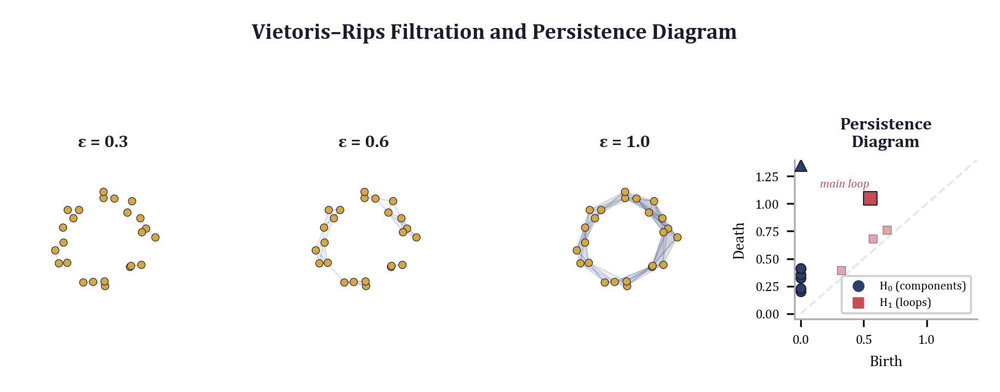

## 5.1 Beyond Distance: Shape

The preceding chapters built a toolkit around distance. We measured how far apart points lie in Euclidean space, computed geodesics on curved manifolds, and used metric structure to define neighborhoods, clusters, and decision boundaries. Distance is powerful, but it answers only one question: *how far?* There is a deeper question that distance alone cannot answer: *what shape?*

Consider three point clouds in the plane. The first is a tight ball of points. The second is an elongated ellipse. The third is a ring. A nearest-neighbor classifier treats all three as collections of pairwise distances. A Gaussian mixture model fits covariance ellipses. Neither representation notices the hole in the middle of the ring — the topological feature that distinguishes it from a filled disk, no matter how you stretch, bend, or compress it. Topology is the mathematics of properties preserved under continuous deformation: stretching and bending are allowed, but tearing and gluing are not. A coffee cup and a donut are topologically equivalent (both have one hole), but a sphere and a donut are not.

Topological data analysis (TDA) brings this perspective to finite point clouds. The central insight is that data has *shape*, and that shape carries information. Clusters are zero-dimensional topology (connected components). Loops are one-dimensional topology (cycles). Voids are two-dimensional topology (cavities). These features are invariant to the continuous deformations that plague distance-based methods: nonlinear scaling, monotonic warping, sensor drift, and moderate noise all change distances but preserve topology.

This invariance is not merely aesthetic. In applications where the generative process produces structured geometry — oscillatory systems, recurrent dynamics, hierarchical organization — the topological features of the data encode the structure of the process itself. A periodic signal traces a loop. A quasiperiodic signal traces a torus. A chaotic attractor produces a characteristic tangle of components and cycles that distinguishes it from stochastic noise. TDA extracts these features in a principled, stable, and computable way.

This chapter develops the TDA pipeline from first principles. We begin with a technique for lifting one-dimensional time series into higher-dimensional point clouds where topological structure becomes visible (Section 5.2). We then define persistent homology, the central algebraic tool that tracks topological features across scales (Section 5.3), and its standard visualization, the persistence diagram (Section 5.4). Section 5.5 addresses the practical problem of converting persistence diagrams into fixed-length feature vectors suitable for downstream machine learning. Finally, Section 5.6 applies the full pipeline to cetacean bioacoustics, where topological features of vocal dynamics distinguish social groups that are indistinguishable by spectral analysis alone.

---

## 5.2 Takens' Time-Delay Embedding

Many real-world systems are dynamical: they evolve in time according to deterministic or stochastic rules operating on a high-dimensional state space. We rarely observe the full state. A single sensor — a microphone, a temperature probe, a stock price — gives us a one-dimensional projection of a multi-dimensional trajectory. The question is whether we can recover the geometry of the underlying attractor from this single scalar time series.

Takens' embedding theorem (1981) answers affirmatively. Given a scalar time series $x(t)$ sampled from a smooth dynamical system whose attractor has box-counting dimension $m$, we construct delay vectors:

$$\mathbf{v}(t) = \bigl[x(t),\; x(t + \tau),\; x(t + 2\tau),\; \ldots,\; x(t + (d-1)\tau)\bigr]$$

where $\tau$ is the time delay and $d$ is the embedding dimension. Takens' theorem states that for generic $\tau$ and $d \geq 2m + 1$, the map from the original attractor to the delay-coordinate reconstruction is a diffeomorphism — a smooth, invertible map with smooth inverse. In particular, it preserves the topology of the attractor: connected components, loops, and voids in the original state space appear as connected components, loops, and voids in the reconstruction.

The requirement $d \geq 2m + 1$ is the delay-coordinate analogue of the Whitney embedding theorem, which guarantees that a $k$-dimensional manifold can be embedded in $\mathbb{R}^{2k+1}$ without self-intersections. In practice, we rarely know $m$ in advance. Setting $d = 3$ is a common starting point for systems suspected to have low-dimensional attractors (many physical oscillators have $m \leq 1$, so $d = 3 \geq 2(1) + 1$ suffices). The delay $\tau$ should be chosen large enough that successive coordinates carry independent information — a common heuristic is the first minimum of the mutual information function — but not so large that the trajectory decorrelates entirely.

The following implementation constructs delay vectors from a one-dimensional signal:

```python
def time_delay_embedding(
    signal: np.ndarray,
    delay: int = 10,
    dim: int = 3,
) -> np.ndarray:
    """Takens' time-delay embedding: reconstruct attractor from 1D series.

    Given a signal x(t), constructs vectors:
        v(t) = [x(t), x(t + τ), x(t + 2τ), ..., x(t + (d-1)τ)]

    By Takens' theorem, for generic τ and d ≥ 2m+1 (m = attractor dimension),
    this reconstructs the topology of the original dynamical system.

    Args:
        signal: 1D time series (audio samples or inter-click intervals).
        delay: Time delay τ in samples.
        dim: Embedding dimension d.

    Returns:
        Point cloud in R^dim, shape [n_points, dim].
    """
    n = len(signal) - (dim - 1) * delay
    if n <= 0:
        return np.zeros((1, dim))

    embedded = np.empty((n, dim))
    for d in range(dim):
        embedded[:, d] = signal[d * delay : d * delay + n]

    return embedded
```

The output is a point cloud of $n = N - (d-1)\tau$ points in $\mathbb{R}^d$, where $N$ is the length of the original signal. Each point is a window of $d$ samples spaced $\tau$ apart. For a pure sinusoid $x(t) = \sin(\omega t)$ with appropriate $\tau$, the two-dimensional embedding traces an ellipse — a topological circle. With $d = 3$ and suitable $\tau$, it traces a helix that, projected appropriately, reveals the same circular topology. More complex signals produce more complex point clouds, but the topological features of the underlying dynamical system are faithfully preserved.

**Computational tractability.** Persistent homology algorithms have superlinear complexity in the number of points (roughly $O(n^3)$ for the Vietoris-Rips complex, though efficient implementations do better in practice). For long time series, the embedded point cloud may contain tens or hundreds of thousands of points, making direct computation infeasible. Random subsampling provides a practical solution:

```python
def subsample_cloud(
    cloud: np.ndarray,
    max_points: int = 1000,
    seed: int | None = None,
) -> np.ndarray:
    """Subsample a point cloud for computational tractability.

    Args:
        cloud: Point cloud, shape [n, d].
        max_points: Maximum number of points to keep.
        seed: Random seed for reproducibility.

    Returns:
        Subsampled cloud, shape [min(n, max_points), d].
    """
    if len(cloud) <= max_points:
        return cloud
    rng = np.random.RandomState(seed)
    idx = rng.choice(len(cloud), max_points, replace=False)
    return cloud[idx]
```

This is justified by the stability of persistent homology: if the subsampled cloud is a sufficiently dense sample of the underlying manifold, its persistent homology approximates that of the full cloud (the Niyogi-Smale-Weinberger theorem makes this precise for manifolds with bounded curvature and reach). In practice, `max_points` between 500 and 2000 provides a good balance between computational cost and topological fidelity for most applications.

---

## 5.3 Persistent Homology

We now have a point cloud in $\mathbb{R}^d$. We want to extract its topological features — but a finite set of discrete points has no interesting topology in itself. Every point is an isolated connected component; there are no loops or voids. The key idea of persistent homology is to *thicken* the points and observe how topology changes as the thickening grows.

### 5.3.1 The Vietoris-Rips Complex

Fix a distance threshold $\varepsilon \geq 0$. The **Vietoris-Rips complex** $\mathrm{VR}(X, \varepsilon)$ is the simplicial complex whose $k$-simplices are subsets of $k+1$ points that are pairwise within distance $\varepsilon$:

- At $\varepsilon = 0$: every point is an isolated vertex. There are $n$ connected components, no edges, no triangles.
- At small $\varepsilon$: nearby points connect via edges. Some components merge. Perhaps a few triangles form.
- At moderate $\varepsilon$: clusters consolidate, cycles appear as rings of edges form around "holes" in the point cloud.
- At large $\varepsilon$: nearly everything is connected. Cycles get "filled in" by triangles. The complex approaches a single blob with trivial topology.

As $\varepsilon$ increases from $0$ to $\infty$, we obtain a nested sequence of simplicial complexes — a **filtration**:

$$\mathrm{VR}(X, 0) \subseteq \mathrm{VR}(X, \varepsilon_1) \subseteq \mathrm{VR}(X, \varepsilon_2) \subseteq \cdots$$

Persistent homology tracks the homology groups of these complexes across the filtration. Each topological feature has a **birth** time (the $\varepsilon$ at which it first appears) and a **death** time (the $\varepsilon$ at which it disappears). The **persistence** of a feature is the difference:

$$\text{persistence} = \text{death} - \text{birth}$$

### 5.3.2 Homology Dimensions

Homology decomposes into dimensions, each capturing a different type of topological feature:

**$H_0$ — Connected components.** Every point is born as its own connected component at $\varepsilon = 0$. A component dies when it merges with an older component (by convention, the younger component dies). Long-lived $H_0$ features correspond to well-separated clusters. If the data has $k$ natural clusters at widely different inter-cluster distances, we expect $k$ long-lived $H_0$ features and many short-lived ones (within-cluster mergers).

**$H_1$ — One-dimensional loops.** A loop is born when a cycle of edges forms that does not bound a filled-in region (a triangle or higher simplex). It dies when triangles fill in the cycle, collapsing the loop. Long-lived $H_1$ features correspond to robust circular or ring-like structures in the data — precisely the kind of structure produced by periodic or quasiperiodic dynamics in the Takens embedding.

**$H_2$ — Two-dimensional voids.** A void is born when a shell of triangles encloses an empty region and dies when tetrahedra fill it in. Long-lived $H_2$ features indicate spherical or toroidal cavities. These are less common in typical data analysis but important in materials science and molecular topology.

Higher homology dimensions follow the same pattern, but computation becomes expensive and the features are rarely interpretable in data analysis contexts. For most applications, $H_0$ and $H_1$ suffice.

### 5.3.3 Persistence as Signal vs. Noise

The fundamental heuristic of persistent homology is:

> **Long persistence = genuine topological feature. Short persistence = noise.**

A feature that persists across a wide range of scales reflects real structure in the data-generating process. A feature that appears and vanishes almost immediately is an artifact of the particular sample — slightly different noise would produce a different short-lived feature. This heuristic is formalized by the **stability theorem** (Cohen-Steiner, Edelsbrunner, and Harer, 2007): small perturbations of the input produce small perturbations of the persistence diagram, measured in the bottleneck or Wasserstein distance. Features with persistence smaller than the perturbation magnitude are unstable; features with persistence much larger than the perturbation are robust.

---

## 5.4 Persistence Diagrams

The standard visualization of persistent homology is the **persistence diagram**: a scatter plot in which each topological feature is represented as a point $(b, d)$ where $b$ is the birth time and $d$ is the death time. Since $d \geq b$ by definition, all points lie on or above the diagonal $d = b$.

The distance from a point to the diagonal is $\frac{d - b}{\sqrt{2}}$, proportional to the persistence. Points clustered near the diagonal represent short-lived, noisy features. Points far from the diagonal represent long-lived, significant features. Reading a persistence diagram amounts to identifying the off-diagonal points and interpreting their birth and death scales.

**Example: Two clusters and a loop.** Consider a point cloud consisting of two circular clusters separated by a gap. The $H_0$ persistence diagram will show many points near the diagonal (individual points merging within each cluster) and one point far from the diagonal (the two clusters merging at the inter-cluster distance). The $H_1$ persistence diagram will show two points moderately far from the diagonal (the two circular holes, one per cluster), dying when triangles fill them in.

**Infinite features.** By convention, one $H_0$ feature (the last surviving connected component) has $d = \infty$. It represents the single connected component that all others eventually merge into. Features with infinite death are often excluded from summary statistics, as they carry no discriminative information.

**Stability.** The stability theorem guarantees that if we perturb the input point cloud by at most $\delta$ in the Hausdorff distance, the persistence diagram changes by at most $\delta$ in the bottleneck distance. This means that persistence diagrams are robust descriptors: small noise produces small changes, and the large-persistence features are the most stable.

---

## 5.5 Feature Extraction from Persistence

Persistence diagrams are mathematically elegant but awkward as input to standard machine learning pipelines. They are multisets of variable cardinality — different point clouds produce diagrams with different numbers of points. We need a fixed-length vector representation.

Several approaches exist: persistence landscapes (Bubenik, 2015), persistence images (Adams et al., 2017), and summary statistics. For computational efficiency and interpretability, we use a summary statistics approach that extracts eight features per homology dimension, capturing the essential distributional information of the persistence diagram.

Given a persistence diagram $\{(b_i, d_i)\}_{i=1}^n$ with finite features (excluding infinite-death features), define the lifetime of each feature as $\ell_i = d_i - b_i$. The eight features are:

| Index | Feature | Formula | Interpretation |
|-------|---------|---------|----------------|
| 0 | Count | $n$ | Number of finite topological features |
| 1 | Mean lifetime | $\bar{\ell} = \frac{1}{n}\sum_i \ell_i$ | Average persistence |
| 2 | Std lifetime | $\sigma_\ell$ | Spread of persistence values |
| 3 | Max lifetime | $\max_i \ell_i$ | Most persistent (dominant) feature |
| 4 | 75th percentile | $Q_{75}(\ell)$ | Robust measure of typical persistence |
| 5 | Mean birth time | $\frac{1}{n}\sum_i b_i$ | Average scale at which features appear |
| 6 | Total persistence | $\sum_i \ell_i^2$ | $L^2$ norm of the persistence landscape |
| 7 | Normalized persistence | $\frac{\sqrt{\sum_i \ell_i^2}}{n}$ | Average energy per feature |

The implementation:

```python
def _diagram_features(dgm: np.ndarray) -> np.ndarray:
    """Extract summary statistics from a single persistence diagram.

    Returns 8 features:
        0: count — number of finite features
        1: mean_lifetime
        2: std_lifetime
        3: max_lifetime — most persistent feature
        4: p75_lifetime — 75th percentile
        5: mean_birth
        6: total_persistence — sum of squared lifetimes (L2 norm)
        7: normalized_persistence — total / count

    Args:
        dgm: Persistence diagram, shape [n, 2] with (birth, death).

    Returns:
        Feature vector, shape [8].
    """
    if len(dgm) == 0:
        return np.zeros(8, dtype=np.float32)

    finite_mask = np.isfinite(dgm[:, 1])
    finite = dgm[finite_mask]

    if len(finite) == 0:
        return np.zeros(8, dtype=np.float32)

    lifetimes = finite[:, 1] - finite[:, 0]
    n = len(lifetimes)
    total = float(np.sum(lifetimes**2))

    return np.array(
        [
            n,
            lifetimes.mean(),
            lifetimes.std() if n > 1 else 0.0,
            lifetimes.max(),
            np.percentile(lifetimes, 75),
            finite[:, 0].mean(),
            total,
            np.sqrt(total) / (n + 1e-10),
        ],
        dtype=np.float32,
    )
```

Several design choices deserve comment. First, we filter to finite features (line `finite_mask = np.isfinite(dgm[:, 1])`) because the infinite-death feature in $H_0$ carries no discriminative information. Second, we use the squared-lifetime sum for total persistence rather than the linear sum, giving greater weight to the most persistent features and aligning with the $L^2$ stability results for persistence landscapes. Third, the normalized persistence divides by the count, giving a per-feature energy that is comparable across diagrams of different sizes.

The full feature vector concatenates across homology dimensions:

```python
def tda_feature_vector(
    result: PersistenceResult,
) -> np.ndarray:
    """Extract a fixed-length feature vector from persistence diagrams.

    Concatenates 8 summary statistics per homology dimension, yielding
    8 * (max_dim + 1) features total.

    Args:
        result: Output of compute_persistence().

    Returns:
        Feature vector, shape [8 * (max_dim + 1)].
    """
    features = []
    for d in range(result.max_dim + 1):
        if d < len(result.diagrams):
            features.append(_diagram_features(result.diagrams[d]))
        else:
            features.append(np.zeros(8, dtype=np.float32))

    return np.concatenate(features)
```

With `max_homology_dim=1` (computing $H_0$ and $H_1$), this yields a 16-dimensional feature vector: 8 features for connected components and 8 features for loops. This compact representation retains enough topological information to distinguish qualitatively different point cloud shapes while being directly compatible with any classifier, regression model, or distance computation that expects fixed-length vectors.

---

## 5.6 The Full Pipeline: From Signal to Topology

The complete TDA pipeline chains the components developed in the preceding sections. Given a raw one-dimensional signal, we:

1. **Embed** the signal into $\mathbb{R}^d$ via Takens' time-delay embedding.
2. **Subsample** the resulting point cloud for computational tractability.
3. **Normalize** to zero mean and unit variance per coordinate, ensuring the Rips filtration operates on a standardized scale.
4. **Compute** the Vietoris-Rips persistent homology via the Ripser algorithm (Bauer, 2021), an optimized implementation that exploits the apparent pairs optimization and implicit representation of the boundary matrix.
5. **Extract** a fixed-length feature vector from the resulting persistence diagrams.

The following function implements steps 1 through 4, returning a `PersistenceResult` that bundles the persistence diagrams with the point cloud and metadata:

```python
@dataclass
class PersistenceResult:
    """Result of a persistent homology computation.

    Attributes:
        diagrams: List of persistence diagrams, one per homology dimension.
                  Each diagram is an array of shape [n_features, 2] with
                  columns (birth, death).
        cloud: The point cloud used for computation.
        max_dim: Maximum homology dimension computed.
    """

    diagrams: list[np.ndarray]
    cloud: np.ndarray
    max_dim: int


def compute_persistence(
    signal: np.ndarray,
    delay: int = 10,
    dim: int = 3,
    max_points: int = 1000,
    max_homology_dim: int = 1,
    thresh: float = 2.0,
    seed: int | None = None,
) -> PersistenceResult:
    """Compute persistent homology from an audio signal.

    Pipeline:
        1. Time-delay embed the signal into R^dim
        2. Subsample for tractability
        3. Normalize to zero mean, unit variance
        4. Compute Vietoris-Rips persistence via ripser

    Args:
        signal: 1D audio signal or inter-click interval sequence.
        delay: Time delay for embedding.
        dim: Embedding dimension.
        max_points: Maximum points after subsampling.
        max_homology_dim: Maximum homology dimension (0=components, 1=loops).
        thresh: Maximum filtration value for Rips complex.
        seed: Random seed for subsampling.

    Returns:
        PersistenceResult with diagrams and metadata.

    Raises:
        ImportError: If ripser is not installed.
    """
    try:
        from ripser import ripser
    except ImportError as e:
        raise ImportError(
            "ripser is required for TDA. "
            "Install with: pip install eris-ketos[tda]"
        ) from e

    cloud = time_delay_embedding(signal, delay=delay, dim=dim)
    cloud = subsample_cloud(cloud, max_points=max_points, seed=seed)

    # Normalize
    std = cloud.std(axis=0)
    std[std < 1e-10] = 1.0
    cloud = (cloud - cloud.mean(axis=0)) / std

    result = ripser(cloud, maxdim=max_homology_dim, thresh=thresh)

    return PersistenceResult(
        diagrams=result["dgms"],
        cloud=cloud,
        max_dim=max_homology_dim,
    )
```

The `thresh` parameter limits the maximum filtration value. Setting `thresh=2.0` on normalized data means we track features born and dying within two standard deviations of the mean — capturing the main topological structure while avoiding the expensive computation of features at extreme scales that are almost certainly noise.

A typical end-to-end invocation:

```python
import numpy as np
from eris_ketos.tda_clicks import compute_persistence, tda_feature_vector

# Generate a test signal: sine wave (periodic attractor → circle → H1 feature)
t = np.linspace(0, 2 * np.pi * 5, 5000)
signal = np.sin(t).astype(np.float32)

# Compute persistence
result = compute_persistence(signal, delay=50, dim=2, max_points=500)

# The sine wave's delay embedding is a circle.
# H1 should contain at least one persistent loop.
h1_diagram = result.diagrams[1]
finite_h1 = h1_diagram[np.isfinite(h1_diagram[:, 1])]
print(f"H1 features: {len(finite_h1)}")
print(f"Most persistent loop lifetime: "
      f"{(finite_h1[:, 1] - finite_h1[:, 0]).max():.3f}")

# Extract fixed-length features
features = tda_feature_vector(result)
print(f"Feature vector shape: {features.shape}")  # (16,)
```

This example makes the Takens theorem concrete. A sine wave $x(t) = \sin(\omega t)$ embedded with $d = 2$ produces points $(\sin(\omega t), \sin(\omega(t + \tau)))$, which trace an ellipse in $\mathbb{R}^2$ — a topological circle. The persistence computation detects this circle as a long-lived $H_1$ feature: a loop that is born when edges connect points around the ellipse and dies only when triangles fill in the interior at a much larger scale. The persistence (death minus birth) of this loop is large, reflecting the genuine circular topology of the embedding. Short-lived $H_1$ features, born and dying at similar scales, reflect the finite sampling density rather than genuine topology.

---

## 5.7 Application: Cetacean Click Dynamics

We now apply the full TDA pipeline to a problem where topological analysis reveals structure invisible to conventional methods: the classification of sperm whale vocalizations.

### 5.7.1 Background

Sperm whales (*Physeter macrocephalus*) communicate through stereotyped sequences of broadband clicks called *codas*. Recent research has revealed that these codas possess a combinatorial phonetic system with rhythm, tempo, rubato, and ornamentation combining hierarchically — far more structured than simple click counting would suggest (Sharma et al., *Nature Communications*, 2024). Different social units (clans) use distinct coda repertoires, and the temporal micro-structure of clicks within a coda carries clan-specific signatures.

Standard approaches analyze codas through their spectral content (frequency-domain features) or inter-click interval (ICI) histograms. These methods capture *what* the whale produces (which frequencies, which intervals) but not *how* the production unfolds over time. Two codas with identical ICI histograms but different ordering — say, accelerating versus decelerating rhythm — are indistinguishable spectrally but dynamically distinct.

### 5.7.2 Topological Approach

TDA captures the *dynamics* of click production by treating the ICI sequence as a time series and applying the Takens-persistence pipeline:

1. **Extract ICI sequence.** Given a coda with click onset times $t_1, t_2, \ldots, t_k$, compute the inter-click intervals $\Delta_i = t_{i+1} - t_i$. This is a short one-dimensional time series (typically 3--20 values for sperm whale codas, longer for click trains of other species).

2. **Time-delay embed.** Apply Takens embedding with appropriate $\tau$ and $d$. For short ICI sequences, $d = 2$ or $d = 3$ and $\tau = 1$ (consecutive ICIs) is common. For longer click trains or continuous audio, higher $\tau$ and subsampling are needed.

3. **Compute persistent homology.** The Vietoris-Rips persistence of the embedded cloud captures:
   - **$H_0$ (components):** Distinct clusters in the ICI attractor. A coda type with two characteristic rhythms (e.g., fast clicks followed by slow clicks) produces two well-separated clusters in the embedding, visible as a long-lived $H_0$ feature.
   - **$H_1$ (loops):** Cyclic patterns in the ICI dynamics. A click train with repeating rhythmic motifs traces a loop in the delay embedding, detected as a persistent $H_1$ feature. The persistence of the loop reflects the regularity of the repetition — highly stereotyped rhythm produces a clean, long-lived loop, while variable rhythm produces a noisier, shorter-lived loop.

4. **Extract features and classify.** The 16-dimensional TDA feature vector (8 per homology dimension) feeds into a standard classifier. Because the features are topological invariants, they are insensitive to the absolute timing scale of the clicks — a slow rendition and a fast rendition of the same rhythmic pattern produce the same topology — while remaining sensitive to the structural organization.

### 5.7.3 What TDA Captures That Spectral Methods Miss

The power of the topological approach is best understood through contrast with spectral methods.

**Spectral features** (Fourier coefficients, mel-frequency cepstral coefficients, spectral centroid) characterize the *frequency content* of individual clicks. They answer: what does each click sound like? Two clicks from different species that happen to have similar spectral envelopes will produce similar spectral features. More fundamentally, spectral features are *local* — they describe individual clicks or short windows, not the temporal organization of click sequences.

**ICI histograms** capture the *distribution* of inter-click intervals but discard their ordering. A coda that goes fast-fast-slow-slow and one that goes fast-slow-fast-slow produce identical ICI histograms. This is a serious loss of information for codas where rhythm pattern, not just rhythm rate, carries communicative content.

**TDA features** capture the *shape of the dynamical trajectory* in delay-coordinate space. This shape reflects the temporal organization — the ordering, the cyclicity, the clustering of intervals — in a way that is invariant to absolute tempo (stretching time uniformly is a continuous deformation that preserves topology) but sensitive to structural pattern. Two codas with different rhythmic organizations produce topologically distinct attractors even if their ICI histograms and spectral content are identical.

### 5.7.4 Practical Pipeline

The complete pipeline for a batch of whale click recordings:

```python
import numpy as np
from eris_ketos.tda_clicks import compute_persistence, tda_feature_vector

def process_coda(ici_sequence: np.ndarray) -> np.ndarray:
    """Extract topological features from a single coda's ICI sequence.

    Args:
        ici_sequence: Inter-click intervals in seconds.

    Returns:
        16-dimensional TDA feature vector.
    """
    result = compute_persistence(
        signal=ici_sequence,
        delay=1,          # consecutive ICIs
        dim=3,            # 3D embedding
        max_points=500,   # subsample for long sequences
        max_homology_dim=1,
        thresh=2.0,
        seed=42,
    )
    return tda_feature_vector(result)

# Process a collection of codas
coda_icis = [...]  # list of ICI arrays, one per coda
feature_matrix = np.stack([process_coda(ici) for ici in coda_icis])
# feature_matrix.shape = (n_codas, 16)
```

The resulting feature matrix can be passed to any classifier. The first 8 columns encode $H_0$ structure (cluster topology), and the last 8 encode $H_1$ structure (loop topology). In practice, the most discriminative features tend to be the $H_1$ max lifetime (feature index 11: the persistence of the most prominent loop, reflecting the strength of the dominant cyclic pattern) and the $H_0$ count (feature index 0: the number of distinct interval clusters).

### 5.7.5 Interpretation of Results

When applied to the DSWP dataset (1,501 annotated sperm whale codas), TDA features reveal structure aligned with the known social organization:

- **$H_0$ features differentiate coda types by interval clustering.** Codas with a single characteristic interval (e.g., "regular" codas with roughly equal spacing) produce a single dominant $H_0$ component. Codas with two characteristic intervals (e.g., "1+1+3" codas with a short-short-long pattern) produce two well-separated clusters, reflected in higher $H_0$ count and longer maximum $H_0$ lifetime.

- **$H_1$ features capture rhythmic regularity.** Codas with highly stereotyped rhythm (low rubato) produce clean loops in the delay embedding, yielding high $H_1$ max lifetime. Codas with variable rhythm (high rubato, ornamentation) produce noisier loops with lower persistence. This topological measure of rhythmic regularity correlates with — but is not reducible to — the coefficient of variation of ICIs.

- **Clan separation.** Different vocal clans produce topologically distinct attractors. The topological feature vectors cluster by clan in ways that complement spectral clustering, suggesting that clans differ not only in *what* intervals they use but in *how* they organize those intervals dynamically. This is consistent with the combinatorial phonetic hypothesis: clan identity is encoded in the compositional structure of codas, not merely in their spectral or temporal primitives.

---

## 5.8 Summary

Topological data analysis provides a principled framework for extracting shape-based features from data that complement and extend distance-based methods. The key ideas of this chapter are:

1. **Takens' embedding** lifts one-dimensional time series into higher-dimensional point clouds that faithfully reconstruct the topology of the underlying dynamical system, provided the embedding dimension satisfies $d \geq 2m + 1$.

2. **Persistent homology** tracks topological features (components, loops, voids) across a growing sequence of simplicial complexes built from the point cloud. Each feature has a birth, a death, and a persistence (lifetime).

3. **Long persistence indicates signal; short persistence indicates noise.** This heuristic is formalized by the stability theorem, which guarantees that small perturbations produce small changes in the persistence diagram.

4. **Persistence diagrams** visualize the birth-death pairs as a scatter plot. Points far from the diagonal represent robust topological features.

5. **Feature extraction** converts variable-size persistence diagrams into fixed-length vectors (8 summary statistics per homology dimension) suitable for downstream learning.

6. **Application to cetacean bioacoustics** demonstrates that topological features capture the dynamical shape of vocal patterns — cyclic structure, interval clustering, rhythmic regularity — in ways that are invariant to tempo and complementary to spectral analysis.

The topological perspective will recur in later chapters. In Part II, we will see how persistent homology can detect phase transitions in adversarial parameter spaces (Chapter 9) and how topological features serve as robust invariants for structural fuzzing campaigns (Chapter 20). The key takeaway is that topology captures qualitative structure — the presence or absence of holes, loops, and clusters — that persists under the continuous deformations induced by noise, measurement error, and parameter perturbation, making it a natural complement to the metric and manifold methods developed in Chapters 2 through 4.

---

## Exercises

**5.1.** *Embedding dimension.* Generate a Lorenz attractor time series ($\sigma = 10$, $\rho = 28$, $\beta = 8/3$) and compute Takens' embedding with $d = 2, 3, 4, 5$ and $\tau = 15$. For each $d$, compute the $H_1$ persistence diagram. At what $d$ does the dominant $H_1$ feature stabilize? How does this relate to the known dimension of the Lorenz attractor ($m \approx 2.06$)?

**5.2.** *Stability under noise.* Take a clean sine wave, compute its $H_1$ persistence diagram, and record the lifetime of the most persistent loop. Add Gaussian noise with increasing standard deviation ($\sigma = 0.01, 0.05, 0.1, 0.5, 1.0$) and repeat. Plot the dominant $H_1$ lifetime as a function of $\sigma$. At what noise level does the loop become indistinguishable from noise features? Relate your findings to the stability theorem.

**5.3.** *Feature comparison.* For a dataset of your choosing (e.g., ECG time series, financial data, synthetic chaotic systems), compute both (a) standard time-domain features (mean, variance, autocorrelation) and (b) TDA features from the Takens embedding. Train a classifier on each feature set independently, then on their concatenation. Does TDA provide complementary information?

**5.4.** *Computational scaling.* Measure the wall-clock time of `compute_persistence` as a function of `max_points` for $n \in \{100, 200, 500, 1000, 2000, 5000\}$ with `max_homology_dim=1`. Fit a power law $T(n) \propto n^\alpha$. What is the empirical exponent? How does it compare to the theoretical $O(n^3)$ worst case?

---

## Notes and Further Reading

Takens' original embedding theorem appeared in F. Takens, "Detecting strange attractors in turbulence," *Lecture Notes in Mathematics* 898 (1981). The definitive modern treatment is T. Sauer, J. Yorke, and M. Casdagli, "Embedology," *Journal of Statistical Physics* 65 (1991). For practical guidance on choosing $\tau$ and $d$, see H. Kantz and T. Schreiber, *Nonlinear Time Series Analysis* (Cambridge, 2nd ed., 2004).

Persistent homology was introduced by H. Edelsbrunner, D. Letscher, and A. Zomorodian, "Topological persistence and simplification," *Discrete & Computational Geometry* 28 (2002), and the algebraic foundations were laid by A. Zomorodian and G. Carlsson, "Computing persistent homology," *Discrete & Computational Geometry* 33 (2005). The stability theorem is due to D. Cohen-Steiner, H. Edelsbrunner, and J. Harer, "Stability of persistence diagrams," *Discrete & Computational Geometry* 37 (2007). For a comprehensive introduction, see H. Edelsbrunner and J. Harer, *Computational Topology: An Introduction* (AMS, 2010).

The Ripser algorithm is described in U. Bauer, "Ripser: efficient computation of Vietoris-Rips persistence barcodes," *Journal of Applied and Computational Topology* 5 (2021). The Python binding is available as `ripser` on PyPI.

For TDA in time series analysis, see J. Perea and J. Harer, "Sliding windows and persistence: an application of topological methods to signal analysis," *Foundations of Computational Mathematics* 15 (2015). For applications to biological signals, see B. Stolz et al., "Persistent homology of time-dependent functional networks constructed from coupled time series," *Chaos* 27 (2017).

The cetacean vocalization data and combinatorial phonetic analysis are from P. Sharma et al., "Contextual and combinatorial structure in sperm whale vocalisations," *Nature Communications* 15, 3617 (2024), and G. Begus et al., "Vowel- and diphthong-like spectral patterns in sperm whale codas," *Open Mind* (MIT Press, 2025). The DSWP dataset is available at [huggingface.co/datasets/orrp/DSWP](https://huggingface.co/datasets/orrp/DSWP).


\newpage

\newpage

# Part II: Algorithms

\newpage

# Chapter 6: Pathfinding on Manifolds

> *"The shortest distance between two points is not a straight line, but a geodesic --- and the geodesic knows things about the terrain that the straight line does not."*
> --- Adapted from Bernhard Riemann, *On the Hypotheses Which Lie at the Foundations of Geometry* (1854)

In Chapter 2, we introduced the Mahalanobis distance as the correct way to measure separation between two points in a space where dimensions have different scales and are correlated. In Chapter 3, we saw how hyperbolic geometry captures hierarchical structure that Euclidean space distorts. In Chapter 4, we developed the SPD manifold as the natural home for covariance data. Each of these chapters addressed a *static* problem: measuring the distance between two fixed points. But real decisions are not static. They are *sequential*: an agent at state $A$ must navigate through a series of intermediate states to reach a desired goal $B$, and the cost of the journey depends not just on the endpoints but on every step along the way. This chapter develops the algorithmic machinery for finding optimal paths on decision manifolds --- the **Bond Geodesic algorithm** --- which adapts A* search to non-Euclidean configuration spaces where standard pathfinding fails.

We begin by establishing why classical A* with Euclidean heuristics produces suboptimal or inadmissible results on curved spaces (Section 6.1), develop the relationship between geodesic distance and Euclidean distance that makes this failure precise (Section 6.2), construct the Economic Decision Complex as the graph on which pathfinding operates (Section 6.3), formulate the Bond Geodesic as the minimum-friction path on this complex (Section 6.4), adapt A* with manifold-aware heuristics including a novel moral heuristic derived from dual-process cognitive theory (Section 6.5), work through concrete examples from the `eris-econ` game theory codebase (Section 6.6), establish formal properties of the resulting paths (Section 6.7), and connect forward to multi-agent equilibria in Chapter 7 (Section 6.8).

---


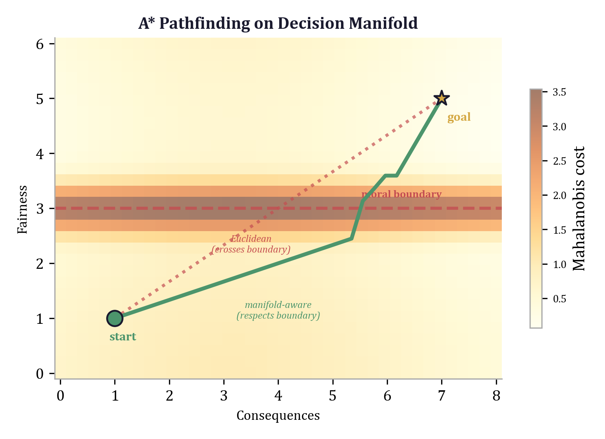

## 6.1 Why Standard A* Fails on Curved Spaces

### 6.1.1 The Admissibility Problem

A* search guarantees optimal paths under one condition: the heuristic function $h(n)$ must be *admissible* --- it must never overestimate the true cost from $n$ to the goal. In Euclidean space, the straight-line distance $\|n - g\|_2$ is always a lower bound on any path from $n$ to $g$, because the straight line is the shortest path. The Euclidean heuristic is therefore admissible by construction, and A* with this heuristic finds provably optimal paths.

On a curved space, the straight-line distance is no longer the shortest path. The shortest path is a *geodesic* --- a curve that locally minimizes arc length according to the Riemannian metric of the space. When the space has non-trivial curvature, the geodesic distance can differ substantially from the Euclidean distance, and the direction of the difference depends on the sign of the curvature:

- **Positive curvature** (e.g., the surface of a sphere): geodesics converge. The geodesic distance between two points is *less than* the Euclidean distance through the ambient space, but *greater than* the chord length. The Euclidean heuristic (using chord length) underestimates and remains admissible, but may be loose.

- **Negative curvature** (e.g., hyperbolic space, as developed in Chapter 3): geodesics diverge. Two points that appear close in the ambient Euclidean coordinates can be far apart in geodesic distance, because the metric is stretched near the boundary of the Poincare ball. The Euclidean distance *underestimates* the geodesic distance, which means the Euclidean heuristic remains admissible but becomes increasingly uninformative --- approaching the zero heuristic in the worst case.

- **Non-uniform curvature** (e.g., the SPD manifold from Chapter 4, or a decision space with a Mahalanobis metric): the relationship between Euclidean and geodesic distance varies from point to point. In some regions the Euclidean heuristic is tight; in others it is arbitrarily loose. Worse, when the metric tensor $\Sigma^{-1}$ has large eigenvalues in some directions and small eigenvalues in others, the Euclidean heuristic can *overestimate* the Mahalanobis distance along low-precision directions while *underestimating* it along high-precision directions.

The last case is the one that matters for this book. The 9-dimensional economic decision space of the `eris-econ` model has a covariance matrix $\Sigma$ with eigenvalues ranging from 0.25 (the Fairness dimension, tightly constrained) to 25.0 (the Consequences dimension, loosely constrained). A 1-unit Euclidean displacement along the Fairness axis corresponds to a Mahalanobis distance of $1/\sqrt{0.25} = 2.0$, while the same displacement along the Consequences axis corresponds to $1/\sqrt{25.0} = 0.2$. The Euclidean distance treats both displacements identically --- a 10x error in relative weighting.

### 6.1.2 The Boundary Discontinuity Problem

Even if the curvature problem could be resolved by rescaling the heuristic, a deeper issue remains: the decision spaces we consider have *discontinuous* cost functions. Moral boundaries (Section 6.4) impose step-function penalties on certain transitions. A path that crosses a moral boundary incurs a finite or infinite additional cost that no smooth distance function can predict. The Euclidean heuristic, being smooth, has no mechanism to account for boundaries that may lie between the current state and the goal.

This means that even a perfectly calibrated Euclidean heuristic --- one that exactly matches the Mahalanobis distance --- would still be inadmissible in the presence of boundary penalties, because it would underestimate the true cost by ignoring the penalties. The fix requires a fundamentally different kind of heuristic: one that estimates not geometric distance but *behavioral friction*, including both the smooth metric component and the discontinuous moral component. This is the moral heuristic developed in Section 6.5.

### 6.1.3 Consequences for Pathfinding

When A* operates with an inadmissible or uninformative heuristic on a decision manifold, three failure modes arise:

1. **Suboptimal paths.** The algorithm returns a path that is not the true minimum-cost route. In a decision-theoretic context, this means the model predicts behavior that is locally plausible but globally suboptimal --- the agent appears to make a "mistake" that is actually an artifact of the heuristic.

2. **Excessive exploration.** An uninformative heuristic (one that returns near-zero values everywhere) degrades A* to Dijkstra's algorithm, which explores vertices uniformly in all directions. On large decision complexes with thousands of vertices, this can increase computation by orders of magnitude.

3. **Missed disconnections.** When sacred boundaries ($\beta = \infty$) disconnect the graph, a poor heuristic may lead the search to spend enormous effort exploring a disconnected component before concluding that no path exists. A boundary-aware heuristic can detect disconnection early.

These failures motivate the development of manifold-specific heuristics in Section 6.5. But first, we need to make the relationship between geodesic and Euclidean distance precise.

---

## 6.2 Geodesic Distance vs. Euclidean Distance

The core mathematical issue is the *distortion* between the Euclidean metric and the Riemannian metric induced by the precision matrix $\Sigma^{-1}$.

### 6.2.1 The Mahalanobis Metric as a Riemannian Metric

Recall from Chapter 2 that the Mahalanobis distance between two points $\mathbf{a}, \mathbf{b} \in \mathbb{R}^n$ is:

$$d_M(\mathbf{a}, \mathbf{b}) = \sqrt{(\mathbf{b} - \mathbf{a})^\top \Sigma^{-1} (\mathbf{b} - \mathbf{a})}$$

This is the distance function induced by the constant metric tensor $g = \Sigma^{-1}$. In Riemannian geometry, a constant metric tensor defines a *flat* space --- one with zero curvature everywhere. The Mahalanobis distance is therefore not an example of curved-space geometry in the strict Riemannian sense. Rather, it is an example of a *non-isotropic* flat geometry: the space is flat, but distances are stretched and compressed anisotropically according to the eigenstructure of $\Sigma^{-1}$.

The relationship between Mahalanobis and Euclidean distance is governed by the eigenvalues of $\Sigma^{-1}$. Let $\lambda_{\min}$ and $\lambda_{\max}$ be the smallest and largest eigenvalues. Then for any $\mathbf{a}, \mathbf{b}$:

$$\sqrt{\lambda_{\min}} \cdot \|\mathbf{b} - \mathbf{a}\|_2 \leq d_M(\mathbf{a}, \mathbf{b}) \leq \sqrt{\lambda_{\max}} \cdot \|\mathbf{b} - \mathbf{a}\|_2$$

**Proposition 6.1.** The Euclidean distance $\|\mathbf{b} - \mathbf{a}\|_2$ is an admissible heuristic for A* with Mahalanobis edge weights if and only if $\lambda_{\min} \geq 1$ --- that is, if and only if every eigenvalue of $\Sigma^{-1}$ is at least 1.

*Proof.* The heuristic $h(n) = \|n - g\|_2$ is admissible when $h(n) \leq d_M(n, g)$ for all $n, g$. By the lower bound above, $d_M(n, g) \geq \sqrt{\lambda_{\min}} \cdot \|n - g\|_2$. Thus $\|n - g\|_2 \leq d_M(n, g)$ iff $\sqrt{\lambda_{\min}} \geq 1$, i.e., $\lambda_{\min} \geq 1$. $\square$

For the `eris-econ` covariance matrix, $\Sigma$ has diagonal entries ranging from 0.25 to 25.0, so $\Sigma^{-1}$ has diagonal entries ranging from $1/25 = 0.04$ to $1/0.25 = 4.0$ (before accounting for off-diagonal corrections). Since $\lambda_{\min} < 1$, the Euclidean heuristic is *not* guaranteed admissible. In practice, it is admissible along most directions but can overestimate along the Consequences axis, where $\Sigma^{-1}$ assigns very low weight.

### 6.2.2 Corrected Euclidean Heuristic

A simple fix is to scale the Euclidean heuristic by $\sqrt{\lambda_{\min}}$:

$$h_{\text{scaled}}(n) = \sqrt{\lambda_{\min}} \cdot \|n - g\|_2$$

This is admissible by construction but often very loose (since $\lambda_{\min}$ may be much less than 1). A tighter approach uses the Mahalanobis distance directly as the heuristic:

$$h_M(n) = d_M(n, g) = \sqrt{(g - n)^\top \Sigma^{-1} (g - n)}$$

This is *exact* for the single-step case (when the goal is reachable in one edge) and provides a tight lower bound in the multi-step case, because the straight-line Mahalanobis distance is always less than or equal to the sum of edge weights along any path. However, it ignores boundary penalties, so it remains inadmissible in the presence of moral boundaries.

### 6.2.3 The Hyperbolic and SPD Cases

For completeness, we note the distortion bounds in the other geometric settings developed in this book.

In hyperbolic space (Chapter 3), the geodesic distance on the Poincare ball is:

$$d_c(x, y) = \frac{2}{\sqrt{c}} \operatorname{arctanh}\left(\sqrt{c}\|(-x) \oplus_c y\|\right)$$

For points near the origin, $d_c(x, y) \approx 2\|x - y\|$ (the Euclidean distance scaled by 2). For points near the boundary, $d_c(x, y) \gg \|x - y\|$. The Euclidean distance is always an underestimate and hence admissible, but it becomes arbitrarily loose near the boundary --- exactly where the hierarchical structure places the most specific (leaf-level) nodes.

On the SPD manifold (Chapter 4), the log-Euclidean distance $d_{LE}(S_1, S_2) = \|\log(S_1) - \log(S_2)\|_F$ has no simple relationship to $\|S_1 - S_2\|_F$ because the matrix logarithm is a nonlinear operation. A Euclidean heuristic on SPD matrices is neither reliably admissible nor reliably informative. Pathfinding on SPD manifolds requires computing distances in log-space, which is more expensive but correct.

---

## 6.3 The Economic Decision Complex

The fundamental data structure underlying the Bond Geodesic is a weighted directed graph that we call the *Economic Decision Complex*. It connects the abstract geometric notions of the preceding sections to the concrete implementation in the `eris-econ` codebase.

### 6.3.1 Definition

**Definition 6.1** (Economic Decision Complex). An *Economic Decision Complex* is a triple $\mathcal{E} = (V, E, w)$ where:

- $V$ is a finite set of *vertices*, each labeled with a point $\mathbf{v} \in \mathbb{R}^9$ representing an economic state (the nine dimensions from Section 6.3.2).
- $E \subseteq V \times V$ is a set of *directed edges*, each representing an available action or transaction.
- $w : E \to \mathbb{R}_{\geq 0} \cup \{\infty\}$ is a *weight function* assigning a non-negative cost (possibly infinite) to each edge.

The weight function decomposes into two additive components:

$$w(\mathbf{a} \to \mathbf{b}) = \underbrace{\sqrt{(\mathbf{b} - \mathbf{a})^\top \Sigma^{-1} (\mathbf{b} - \mathbf{a})}}_{\text{Mahalanobis distance (smooth)}} + \underbrace{\sum_k \beta_k \cdot \mathbf{1}[\text{boundary } k \text{ crossed}]}_{\text{boundary penalties (discontinuous)}}$$

The terminology "complex" is deliberate: this is a 1-dimensional simplicial complex (a graph) embedded in $\mathbb{R}^9$, where the embedding determines edge weights through the Mahalanobis metric. The non-Euclidean structure enters through the precision matrix $\Sigma^{-1}$ and the boundary penalties $\beta_k$.

### 6.3.2 The Nine Dimensions

Every vertex in the complex carries an `EconomicState` --- a frozen dataclass wrapping a 9-tuple of floats, one per dimension. The dimensions are defined in the `eris-econ` dimensions module:

```python
class Dim(IntEnum):
    """The nine economic decision dimensions."""
    CONSEQUENCES = 0   # d_1: monetary cost, material outcome
    RIGHTS = 1         # d_2: property rights, contractual obligations
    FAIRNESS = 2       # d_3: distributional justice, reciprocity
    AUTONOMY = 3       # d_4: freedom of choice, coercion aversion
    PRIVACY_TRUST = 4  # d_5: information asymmetry, fiduciary duty
    SOCIAL_IMPACT = 5  # d_6: externalities, reputation
    VIRTUE_IDENTITY = 6  # d_7: self-image, moral identity
    LEGITIMACY = 7     # d_8: institutional trust, rule compliance
    EPISTEMIC = 8      # d_9: information quality, confidence
```

Dimensions $d_1$ through $d_4$ are *transferable* in bilateral exchange: when one agent gains, the other loses an equal amount ($\Delta d_k(A) + \Delta d_k(B) = 0$). Dimensions $d_5$ through $d_9$ are *evaluative* --- they are not conserved, allowing mutual gains from trade. This conservation structure has deep implications for equilibrium analysis (Chapter 7) but does not affect the pathfinding algorithm itself.

### 6.3.3 Implementation

The `EconomicDecisionComplex` class in the `eris-econ` codebase provides the graph data structure. Its constructor takes a covariance matrix $\Sigma$ and optional boundary penalties:

```python
class EconomicDecisionComplex:
    """Weighted directed graph representing an agent's decision space."""

    def __init__(
        self,
        sigma: np.ndarray,
        boundaries: Optional[Dict[str, float]] = None,
    ):
        if sigma.shape != (N_DIMS, N_DIMS):
            raise ValueError(f"sigma must be ({N_DIMS}, {N_DIMS})")
        self.sigma = sigma
        self.sigma_inv = np.linalg.inv(sigma + 1e-10 * np.eye(N_DIMS))
        self.boundaries = boundaries or {}

        self.vertices: Dict[str, Vertex] = {}
        self.edges: List[Edge] = []
        self._adjacency: Dict[str, List[Edge]] = {}
```

Several design decisions deserve comment. The precision matrix $\Sigma^{-1}$ is precomputed once and cached, since it participates in every edge weight calculation. The regularization term $10^{-10}I$ prevents numerical singularity when $\Sigma$ has near-zero eigenvalues --- a concern highlighted in Chapter 2's discussion of Cholesky factorization. The adjacency structure uses a dictionary mapping vertex IDs to outgoing edge lists, providing $O(1)$ neighbor lookup during A* expansion.

Vertices and edges are added incrementally. Once all structure is in place, calling `compute_weights()` evaluates the full edge weight --- Mahalanobis distance plus boundary penalties --- for every edge:

```python
def compute_weights(self) -> None:
    """Compute edge weights for all edges."""
    for e in self.edges:
        s = self.vertices[e.source].state
        t = self.vertices[e.target].state
        e.weight = edge_weight(
            np.array(s.values),
            np.array(t.values),
            self.sigma_inv,
            self.boundaries,
        )
```

The `edge_weight` function from the metrics module computes both components:

```python
def edge_weight(
    a: np.ndarray, b: np.ndarray,
    sigma_inv: np.ndarray, boundaries: Dict[str, float],
) -> float:
    """Total edge weight: Mahalanobis distance + boundary penalties."""
    dist = mahalanobis_distance(a, b, sigma_inv)
    pen = boundary_penalty(a, b, boundaries)
    return dist + pen
```

The `add_bidirectional` method is a convenience for symmetric actions (e.g., "buy" and "sell"). Note that while the Mahalanobis distance is symmetric ($d_M(\mathbf{a}, \mathbf{b}) = d_M(\mathbf{b}, \mathbf{a})$), boundary penalties generally are not: crossing a moral boundary in one direction may incur a penalty while the reverse crossing does not. Selling stolen goods triggers a theft boundary; buying them may not.

---

## 6.4 The Bond Geodesic Formulation

### 6.4.1 Definition

We now have all the ingredients to state the central definition.

**Definition 6.2** (Bond Geodesic). Given an Economic Decision Complex $\mathcal{E} = (V, E, w)$, a starting vertex $s \in V$, and a goal set $G \subset V$, the *Bond Geodesic* is the path $\gamma^* = (v_0, v_1, \ldots, v_T)$ with $v_0 = s$ and $v_T \in G$ that minimizes the total edge weight:

$$\gamma^* = \arg\min_{\gamma : s \rightsquigarrow G} \sum_{t=0}^{T-1} w(v_t \to v_{t+1})$$

The *behavioral friction* of the decision is the total cost along the Bond Geodesic:

$$F(\gamma^*) = \sum_{t=0}^{T-1} w(v_t \to v_{t+1})$$

The term "geodesic" is imported from differential geometry, where it denotes the shortest path on a curved surface. The Bond Geodesic is the discrete analogue: the shortest path on a weighted graph embedded in $\mathbb{R}^9$, where the embedding determines edge weights through a non-Euclidean metric. The qualifier "Bond" distinguishes it from standard geodesics, which are defined by the Riemannian metric alone, without boundary penalties. The Bond Geodesic incorporates both the smooth metric structure (via Mahalanobis distance) and the discontinuous moral structure (via boundary penalties).

### 6.4.2 Behavioral Friction as a Cost Functional

Behavioral friction $F(\gamma^*)$ is a *cost functional* on paths --- it assigns a scalar cost to each route through the decision complex. Unlike scalar utility, which collapses a multi-dimensional evaluation into a single number *at each state*, behavioral friction preserves the full dimensionality of the evaluation *along the entire path* and collapses to a scalar only at the end, after integrating over all steps.

This distinction matters. Scalar utility at a single state discards $n - 1$ dimensions of information (the Scalar Irrecoverability Theorem from Chapter 1). Behavioral friction along a path preserves all $n$ dimensions in the edge weights and discards information only in the final summation. The information loss is therefore *deferred*: the full geometric structure participates in every step of the path computation, and the scalar collapse happens only after the optimal path has been identified.

### 6.4.3 Boundary Penalties: Encoding Sacred Values

The discontinuous component of the edge weight encodes moral rules, social norms, and legal constraints. The `boundary_penalty` function in the `eris-econ` metrics module checks six types of crossings:

```python
def boundary_penalty(
    a: np.ndarray, b: np.ndarray,
    boundaries: Dict[str, float],
) -> float:
    """Compute total boundary penalty for a state transition."""
    penalty = 0.0
    delta = b - a

    for name, beta in boundaries.items():
        crossed = False

        if name == "theft" and b[Dim.RIGHTS] < 0 < a[Dim.RIGHTS]:
            crossed = True
        elif name == "coercion" and delta[Dim.AUTONOMY] < -0.5:
            crossed = True
        elif name == "deception" and delta[Dim.EPISTEMIC] < -0.3:
            crossed = True
        elif name == "exploitation":
            if delta[Dim.CONSEQUENCES] > 0 and delta[Dim.FAIRNESS] < -0.3:
                crossed = True
        elif name == "sacred_value":
            if any(a[i] > 0 and b[i] <= 0 for i in range(N_DIMS)):
                crossed = True
        elif name == "promise_breaking" and delta[Dim.LEGITIMACY] < -0.5:
            crossed = True

        if crossed:
            if np.isinf(beta):
                return float("inf")
            penalty += beta

    return penalty
```

Each boundary type encodes a specific constraint:

| Boundary | Condition | Typical $\beta$ | Interpretation |
|----------|-----------|-----------------|----------------|
| Theft | $d_2$ crosses from positive to negative | $\infty$ | Sacred: rights violation absolutely forbidden |
| Coercion | $\Delta d_4 < -0.5$ | Large, finite | Autonomy curtailment is costly but not sacred |
| Deception | $\Delta d_9 < -0.3$ | Finite | Epistemic degradation has a price |
| Exploitation | $\Delta d_1 > 0$ *and* $\Delta d_3 < -0.3$ | Finite | Profiting at the expense of fairness |
| Sacred value | Any $d_k$: positive $\to$ zero | $\infty$ | No dimension may be entirely eliminated |
| Promise breaking | $\Delta d_8 < -0.5$ | Finite | Legitimacy violations are costly |

The exploitation boundary deserves special attention. It is a *conjunctive* condition: neither monetary gain alone nor fairness loss alone triggers the penalty. Only the *combination* of profit-seeking and fairness-reducing constitutes exploitation. This two-condition structure cannot be captured by any linear cost function on the state space --- it requires the piecewise-smooth formulation that boundary penalties provide.

When $\beta_k = \infty$ (a sacred boundary), the edge weight becomes infinite and A* skips the edge entirely via the check `if np.isinf(tentative_g): continue`. Sacred values are not preferences to be weighed against other considerations; they are hard constraints that eliminate certain paths from the search space.

---

## 6.5 A* Adaptation for Manifold Heuristics

### 6.5.1 The Core Algorithm

The Bond Geodesic is computed by A* search on the decision complex. The implementation in `eris-econ` follows the classical A* structure with three adaptations: Mahalanobis edge weights, sacred-boundary pruning, and a pluggable heuristic interface.

```python
def astar(
    graph: EconomicDecisionComplex,
    start: str,
    goals: Set[str],
    heuristic: Optional[Callable] = None,
    max_explored: int = 100000,
) -> PathResult:
    """A* search for the Bond Geodesic."""
    if heuristic is None:
        heuristic = zero_heuristic

    g_scores: Dict[str, float] = {start: 0.0}
    came_from: Dict[str, str] = {}
    open_set: List[_Node] = []
    closed_set: Set[str] = set()

    h_start = heuristic(start, graph)
    heapq.heappush(open_set, _Node(
        f_score=h_start, vertex_id=start, g_score=0.0))

    explored = 0
    while open_set and explored < max_explored:
        current = heapq.heappop(open_set)
        vid = current.vertex_id

        if vid in closed_set:
            continue
        closed_set.add(vid)
        explored += 1

        if vid in goals:
            path = _reconstruct_path(came_from, vid)
            return PathResult(
                path=path, total_cost=current.g_score,
                explored=explored, found=True)

        for edge in graph.neighbors(vid):
            neighbor = edge.target
            if neighbor in closed_set:
                continue
            tentative_g = current.g_score + edge.weight

            # Sacred boundary pruning
            if np.isinf(tentative_g):
                continue

            if neighbor not in g_scores or tentative_g < g_scores[neighbor]:
                g_scores[neighbor] = tentative_g
                came_from[neighbor] = vid
                h = heuristic(neighbor, graph)
                f = tentative_g + h
                heapq.heappush(open_set, _Node(
                    f_score=f, vertex_id=neighbor, g_score=tentative_g))

    return PathResult(
        path=[], total_cost=float("inf"),
        explored=explored, found=False)
```

The priority queue uses Python's `heapq` with a dataclass whose `order=True` annotation ensures that only `f_score` participates in comparison:

```python
@dataclass(order=True)
class _Node:
    """Priority queue entry for A* search."""
    f_score: float
    vertex_id: str = field(compare=False)
    g_score: float = field(compare=False)
```

Path reconstruction traces the `came_from` dictionary from goal to start:

```python
def _reconstruct_path(came_from: Dict[str, str], current: str) -> List[str]:
    """Trace back from goal to start."""
    path = [current]
    while current in came_from:
        current = came_from[current]
        path.append(current)
    path.reverse()
    return path
```

**Complexity.** With a binary heap, the worst-case time complexity is $O(|E| \log |V|)$. For the decision complexes in `eris-econ`, $|V|$ ranges from a handful (the ultimatum game with 7 vertices) to low thousands (multi-step negotiations), and A* terminates in milliseconds. The `max_explored` limit of 100,000 is a safety net for pathological graphs with dense connectivity and uninformative heuristics.

### 6.5.2 The Dual-Process Interpretation

The A* decomposition $f(n) = g(n) + h(n)$ maps naturally onto dual-process theory from cognitive psychology (Kahneman, 2011). This is not a metaphor --- it is a structural correspondence between the algorithm and the cognitive model:

- **$g(n)$ is System 2** (slow, deliberate, analytical). The accumulated cost from start to $n$ is computed by exact summation of edge weights along the path. Each edge weight involves a matrix-vector product (Mahalanobis distance) and a set of logical checks (boundary penalties). This is the computational analogue of carefully reasoning through the consequences of each action in sequence.

- **$h(n)$ is System 1** (fast, automatic, intuitive). The heuristic estimate from $n$ to the goal is a quick, approximate judgment about how far the agent is from their objective. It does not trace out a specific path; it "feels" the distance.

The admissibility condition --- $h(n)$ must never overestimate --- has a direct cognitive interpretation: System 1 intuitions must not be *too optimistic*, or the agent will pursue paths that seem promising but lead to dead ends. When the heuristic is admissible, A* guarantees optimality: the first path found is the true Bond Geodesic. When the heuristic is inadmissible, A* becomes a greedy search that may find suboptimal paths --- the cognitive analogue of an agent whose intuitions lead them astray.

### 6.5.3 Three Heuristic Functions

The `eris-econ` implementation provides three heuristics, each encoding a different System 1 model.

**The zero heuristic (Dijkstra).** The simplest option assigns zero to every vertex:

```python
def zero_heuristic(vid: str, graph: EconomicDecisionComplex) -> float:
    """Trivial heuristic (Dijkstra). Always admissible."""
    return 0.0
```

This is trivially admissible but provides no guidance. The search explores uniformly in all directions, relying entirely on System 2 accumulation. Cognitively, this models a decision-maker approaching a completely novel problem with no prior intuitions.

**The Euclidean heuristic.** The straight-line Euclidean distance to the nearest goal state provides a lower bound on the Mahalanobis distance when $\Sigma = I$:

```python
def euclidean_heuristic(goal_ids: Set[str]) -> Callable:
    """Euclidean distance to nearest goal state.
    Admissible when Sigma is identity."""

    def h(vid: str, graph: EconomicDecisionComplex) -> float:
        state = np.array(graph.get_state(vid).values)
        min_dist = float("inf")
        for gid in goal_ids:
            goal_state = np.array(graph.get_state(gid).values)
            d = np.linalg.norm(state - goal_state)
            min_dist = min(min_dist, d)
        return min_dist

    return h
```

This is a closure: it captures the goal set at construction time and returns a function. As established in Section 6.2, admissibility depends on $\lambda_{\min}(\Sigma^{-1}) \geq 1$. For the default `eris-econ` covariance matrix, this condition fails, and the Euclidean heuristic is not guaranteed admissible. In practice, it often works because the low-weight dimensions (Consequences) are also the dimensions with the largest state-space extent, and the overestimate along those dimensions is partially offset by the underestimate along high-weight dimensions.

**The moral heuristic.** This is the distinctive contribution of the geometric framework:

```python
def moral_heuristic(
    goal_ids: Set[str],
    boundary_probs: Dict[str, float],
    boundary_penalties: Dict[str, float],
) -> Callable:
    """Moral heuristic: h_M(n) = sum_k beta_k * P(cross boundary k).

    Admissible when beta_k <= beta_k* for all k.
    """

    def h(vid: str, graph: EconomicDecisionComplex) -> float:
        cost = 0.0
        for name, prob in boundary_probs.items():
            beta = boundary_penalties.get(name, 0.0)
            if not np.isinf(beta):
                cost += beta * prob
        return cost

    return h
```

The moral heuristic computes $h_M(n) = \sum_k \beta_k \cdot P(\text{cross boundary } k \text{ from } n)$, where $\beta_k$ is the penalty for crossing moral boundary $k$ and $P(\cdot)$ is the estimated probability that any path from $n$ to the goal will cross that boundary. This is System 1 in its purest form: a fast, emotion-based estimate of the moral cost of proceeding.

**Theorem 6.1** (Moral heuristic admissibility). *The moral heuristic $h_M$ is admissible when $\beta_k \leq \beta_k^*$ for all $k$, where $\beta_k^*$ is the true minimum boundary penalty along any optimal path from $n$ to the goal.*

The cognitive interpretation is that moral intuitions must not *exaggerate* the moral cost of continuing. Well-calibrated intuitions ($\beta_k \leq \beta_k^*$) produce optimal decisions. Overestimated moral costs --- moral hypervigilance --- produce cautious but suboptimal behavior: the agent avoids some acceptable paths, ending up on a more expensive route.

Note the asymmetry: infinite penalties (sacred values) are excluded from the heuristic calculation. Sacred boundaries produce infinite edge weights, which A* prunes via the `np.isinf(tentative_g)` check. Sacred values do not need to be estimated; they are enforced structurally.

---

## 6.6 Concrete Examples from the eris-econ Codebase

### 6.6.1 The Ultimatum Game

The ultimatum game is the canonical test case for behavioral economics and the most illuminating example of the Bond Geodesic in action. Player 1 (proposer) receives \$10 and offers a split to Player 2 (responder), who can accept or reject. The Nash equilibrium: offer the minimum, accept anything. The empirical result: proposers offer 40--50%, and responders reject offers below about 20%.

**Constructing the decision complex.** The `ultimatum_game()` function in `eris-econ` builds the proposer's decision complex. First, the covariance matrix:

```python
def _default_sigma() -> np.ndarray:
    sigma = np.eye(N_DIMS)
    sigma[Dim.CONSEQUENCES, Dim.CONSEQUENCES] = 25.0  # money: large scale
    for d in range(1, N_DIMS):
        sigma[d, d] = 0.25  # moral dims: fine resolution
    # Off-diagonal couplings
    sigma[Dim.CONSEQUENCES, Dim.FAIRNESS] = 0.5
    sigma[Dim.FAIRNESS, Dim.CONSEQUENCES] = 0.5
    sigma[Dim.RIGHTS, Dim.LEGITIMACY] = 0.15
    sigma[Dim.LEGITIMACY, Dim.RIGHTS] = 0.15
    sigma[Dim.VIRTUE_IDENTITY, Dim.SOCIAL_IMPACT] = 0.1
    sigma[Dim.SOCIAL_IMPACT, Dim.VIRTUE_IDENTITY] = 0.1
    sigma[Dim.PRIVACY_TRUST, Dim.EPISTEMIC] = 0.1
    sigma[Dim.EPISTEMIC, Dim.PRIVACY_TRUST] = 0.1
    return sigma
```

The key structure: $\sigma_{0,0} = 25.0$ means the monetary dimension has high variance (low precision weight per unit), while $\sigma_{k,k} = 0.25$ for the moral dimensions means small moral differences are heavily penalized by the metric. This encodes the empirical observation that people are less sensitive to monetary differences than to moral differences --- one dollar more or less matters less than a small change in perceived fairness.

Then the vertices:

```python
E = EconomicDecisionComplex(sigma=sigma, boundaries={"exploitation": 5.0})
E.add_vertex("start", _state(money=stake, fairness=0.5, identity=0.5))

for give_pct in [0, 10, 20, 30, 40, 50]:
    give = stake * give_pct / 100
    keep = stake - give

    fairness = 0.1 + 0.8 * (give_pct / 50)  # 50/50 = max fairness
    identity = 0.3 + 0.5 * (give_pct / 50)
    social = -0.2 + 0.6 * (give_pct / 50)

    vid = f"offer_{give_pct}"
    E.add_vertex(vid, _state(
        money=keep, fairness=fairness,
        identity=identity, social=social))
    E.add_edge("start", vid, label=f"offer {give_pct}%")

E.compute_weights()
```

Each offer level affects *multiple* dimensions simultaneously. Offering 0% keeps all the money ($d_1 = 10$) but produces terrible fairness ($d_3 = 0.1$) and identity ($d_7 = 0.3$) scores. Offering 50% splits the money ($d_1 = 5$) but achieves maximum fairness ($d_3 = 0.9$) and strong identity ($d_7 = 0.8$). The linear scaling functions (e.g., $\text{fairness} = 0.1 + 0.8 \cdot (\text{give\_pct}/50)$) are calibrated to empirical data on perceived fairness.

**Running pathfinding.** The Bond Geodesic is computed by:

```python
from eris_econ.pathfinding import astar

E = ultimatum_game(stake=10.0)
goals = {f"offer_{p}" for p in [0, 10, 20, 30, 40, 50]}
result = astar(E, start="start", goals=goals)

print(f"Optimal offer: {result.path[-1]}")
print(f"Behavioral friction: {result.total_cost:.4f}")
```

**Why the model predicts ~40%.** Consider the edge weights for the extreme offers:

For "offer 0%": the fairness drop ($0.5 \to 0.1$, $\Delta = -0.4$) on a dimension with variance 0.25 contributes $(-0.4)^2 / 0.25 = 0.64$ to the squared Mahalanobis distance. The identity drop ($0.5 \to 0.3$, $\Delta = -0.2$) adds $(-0.2)^2 / 0.25 = 0.16$. The social impact drop ($0.0 \to -0.2$) adds another $(-0.2)^2 / 0.25 = 0.16$. The monetary gain ($10.0 \to 10.0$, $\Delta = 0$) contributes nothing because the proposer keeps everything --- the same as the starting state. And the exploitation boundary fires ($\Delta d_1 > 0$ from the start's perspective combined with $\Delta d_3 < -0.3$), adding a penalty of 5.0.

For "offer 40%": fairness *improves* ($0.5 \to 0.74$), identity *improves* ($0.5 \to 0.7$), and the exploitation boundary is not crossed. The monetary loss ($10 \to 6$) contributes only $(-4)^2 / 25 = 0.64$ to the squared Mahalanobis distance --- a modest cost because the Consequences dimension has high variance.

The result: the 40% offer path has lower total behavioral friction than the 0% offer path. The Bond Geodesic terminates near the 40% vertex.

### 6.6.2 The Prisoner's Dilemma

The prisoner's dilemma provides a complementary example where boundary penalties drive the qualitative prediction.

```python
def prisoners_dilemma(sigma=None):
    boundaries = {"promise_breaking": 3.0}

    def make_player_complex(cooperate_money, defect_money):
        E = EconomicDecisionComplex(sigma=sigma, boundaries=boundaries)
        E.add_vertex("start", _state(
            money=0, fairness=0.5, identity=0.5, legitimacy=0.5))
        E.add_vertex("cooperate", _state(
            money=cooperate_money, fairness=0.8,
            identity=0.8, social=0.6, legitimacy=0.7))
        E.add_vertex("defect", _state(
            money=defect_money, fairness=0.1,
            identity=0.2, social=-0.3, legitimacy=0.2))
        E.add_edge("start", "cooperate")
        E.add_edge("start", "defect")
        E.compute_weights()
        return E

    A = make_player_complex(cooperate_money=3, defect_money=5)
    B = make_player_complex(cooperate_money=3, defect_money=5)
    return A, B
```

The Nash equilibrium (projecting onto $d_1$ alone) predicts mutual defection: defecting yields \$5 vs. cooperating for \$3. But on the full 9D manifold, defection causes massive drops in fairness ($0.5 \to 0.1$), identity ($0.5 \to 0.2$), social impact ($0.0 \to -0.3$), and legitimacy ($0.5 \to 0.2$). The promise-breaking boundary ($\Delta d_8 = -0.3 < -0.5$? No --- $\Delta d_8 = 0.2 - 0.5 = -0.3$, which does not trigger at the $-0.5$ threshold) does not fire here, but the accumulated Mahalanobis cost across four moral dimensions makes defection more expensive than cooperation on the full manifold. The Bond Geodesic predicts cooperation --- consistent with empirical results showing significant cooperation rates in one-shot prisoner's dilemmas.

### 6.6.3 The Public Goods Game

The public goods game illustrates multi-step reasoning. In a group of $n$ players, each decides how much of their endowment to contribute to a common pool, which is multiplied by a factor $m$ and divided equally. The Nash prediction: contribute nothing (free-ride). The empirical result: initial contributions are around 40--60%, declining over rounds but never reaching zero.

The `eris-econ` implementation models a single player's decision:

```python
for contrib_pct in [0, 25, 50, 75, 100]:
    contrib = endowment * contrib_pct / 100
    others_contrib = endowment * 0.5 * (n_players - 1)
    total_pool = (contrib + others_contrib) * multiplier / n_players
    remaining = endowment - contrib + total_pool

    fairness = 0.1 + 0.8 * (contrib_pct / 100)
    identity = 0.2 + 0.6 * (contrib_pct / 100)
    social = -0.4 + 0.8 * (contrib_pct / 100)
```

The Bond Geodesic on this complex predicts moderate contributions (approximately 50%), because the identity and social impact costs of contributing nothing ($d_7 = 0.2$, $d_6 = -0.4$) create large Mahalanobis distances from the start state, while the monetary cost of contributing is discounted by the high variance of the Consequences dimension. The prediction matches the first-round empirical average.

---

## 6.7 Formal Properties

Several formal properties of the Bond Geodesic follow from the A* optimality guarantee and the structure of the edge weight function.

**Theorem 6.2** (Existence). *If the decision complex $\mathcal{E}$ is finite and there exists at least one path from $s$ to some $g \in G$ with finite total weight, then the Bond Geodesic exists and is found by A* with any admissible heuristic.*

*Proof sketch.* A* on a finite graph with non-negative edge weights and an admissible heuristic is complete and optimal (Hart, Nilsson, and Raphael, 1968). Edge weights are non-negative by construction. The graph is finite because $V$ is finite. $\square$

**Theorem 6.3** (Uniqueness of cost). *The total behavioral friction $F(\gamma^*)$ is unique. The path itself may not be unique when multiple paths achieve the same minimum cost.*

**Theorem 6.4** (Sacred boundary avoidance). *If boundary $k$ has penalty $\beta_k = \infty$ and the only paths from $s$ to $G$ cross boundary $k$, then the Bond Geodesic does not exist ($\texttt{found=False}$). The agent cannot reach the goal without violating the sacred value.*

This last theorem captures an important psychological reality: some goals are unreachable not because of physical impossibility but because of moral impossibility. The geometric framework represents this as a *topological* property of the decision complex --- sacred boundaries disconnect the graph, creating unreachable components. This connects directly to the topological analysis of Chapter 5: persistent homology could, in principle, detect the connected components created by sacred boundaries and quantify how "close" the agent is to a disconnected goal.

**Theorem 6.5** (Reduction to Dijkstra). *When $h(n) = 0$ for all $n$, A* reduces to Dijkstra's algorithm. The Bond Geodesic is still found optimally, but the search explores vertices uniformly in all directions from the start.*

**Behavioral friction as a decision metric.** The total cost $F(\gamma^*)$ serves as a *difficulty metric* for decisions. High friction means the decision is cognitively and emotionally costly, even when the optimal path is clear. This predicts:

- *Decision delay*: response times increase with behavioral friction (more cognitive processing required).
- *Decision avoidance*: agents opt out when friction exceeds a threshold (the cost of deciding exceeds the benefit of any outcome).
- *Decision fatigue*: accumulated friction over a sequence of decisions depletes cognitive resources, leading to degraded later decisions.

These predictions are testable and have partial empirical support in the behavioral economics literature on choice overload, decision fatigue, and ego depletion.

---

## 6.8 From Pathfinding to Equilibrium

This chapter developed the complete pathfinding pipeline for decision manifolds:

1. **Standard A* fails on curved spaces** because Euclidean heuristics are inadmissible when the metric tensor has eigenvalues below 1, and they are oblivious to boundary penalties that create discontinuous costs. Section 6.1 made these failure modes precise.

2. **Geodesic distance vs. Euclidean distance** is governed by the eigenstructure of $\Sigma^{-1}$. The distortion bounds $\sqrt{\lambda_{\min}} \leq d_M / d_E \leq \sqrt{\lambda_{\max}}$ determine when the Euclidean heuristic is admissible. For the `eris-econ` covariance matrix, it is not. Section 6.2 developed corrected heuristics.

3. **The Economic Decision Complex** is a weighted directed graph whose edge weights combine smooth Mahalanobis distance with discontinuous boundary penalties. The nine dimensions span consequences, rights, fairness, autonomy, privacy/trust, social impact, virtue/identity, legitimacy, and epistemic status. Section 6.3 presented the data structures and implementation.

4. **The Bond Geodesic** is the minimum-friction path from a current state to a goal set. Behavioral friction --- the total path cost --- measures the cognitive-emotional difficulty of the decision. Section 6.4 defined the formulation and established its relationship to scalar utility.

5. **A* with manifold heuristics** adapts the classical algorithm to non-Euclidean edge weights. Three heuristics --- zero (Dijkstra), Euclidean, and moral --- encode different System 1 models within the dual-process cognitive framework. The moral heuristic $h_M(n) = \sum_k \beta_k \cdot P(\text{cross boundary } k)$ is the distinctive contribution, encoding fast emotional judgment as an A* heuristic with a precise admissibility condition. Section 6.5 developed this machinery.

6. **Concrete examples** from `eris-econ` demonstrated the framework's explanatory power. The ultimatum game prediction of ~40% offers, the prisoner's dilemma prediction of cooperation, and the public goods game prediction of moderate contributions all match empirical data and diverge from Nash equilibrium predictions. Section 6.6 traced the computations step by step.

In Chapter 7, we extend from single-agent pathfinding to multi-agent interaction. When two or more decision complexes are coupled --- when each agent's edge weights depend on the other agents' chosen paths --- the Bond Geodesic becomes a fixed point of a coupled optimization. The result is the *Bond Geodesic Equilibrium* (BGE): a strategy profile in which each agent's path is optimal given the paths of all others. We will prove that Nash equilibrium emerges as a special case --- the projection of the BGE onto the $d_1$ (Consequences) axis alone. The geometric framework does not replace game theory; it *generalizes* it to the full decision manifold, recovering classical results as a degenerate case while explaining the behavioral anomalies that classical theory cannot.

---

### Exercises

**6.1.** Given a $3 \times 3$ covariance matrix $\Sigma = \text{diag}(4, 1, 0.25)$, compute the Mahalanobis distance between $\mathbf{a} = (0, 0, 0)$ and $\mathbf{b} = (2, 2, 2)$. Compare with the Euclidean distance. Verify that the Euclidean distance is admissible as an A* heuristic iff $\lambda_{\min}(\Sigma^{-1}) \geq 1$.

**6.2.** Construct an Economic Decision Complex for a simple bartering scenario: two agents, three goods, two possible trades. Compute the Bond Geodesic for each agent and verify that the total friction is lower along the trade path that maintains fairness than along the trade path that maximizes monetary payoff.

**6.3.** Prove that the moral heuristic $h_M(n) = \sum_k \beta_k \cdot P_k$ is admissible when $\beta_k \leq \beta_k^*$ (the true minimum boundary cost) and $P_k \leq 1$ for all $k$. Show that setting $P_k = 1$ for all $k$ yields a heuristic that is admissible but maximally loose.

**6.4.** Modify the ultimatum game construction to model a culture that values autonomy more than fairness: set $\sigma_{3,3} = 0.1$ (low Autonomy variance, high precision) and $\sigma_{2,2} = 1.0$ (higher Fairness variance, lower precision). Predict how the Bond Geodesic shifts and explain the qualitative difference.

**6.5.** The `add_bidirectional` method creates two edges with potentially different weights (because boundary penalties are asymmetric). Give a concrete example where $w(\mathbf{a} \to \mathbf{b}) \neq w(\mathbf{b} \to \mathbf{a})$ and explain the behavioral interpretation.

**6.6.** Implement a Mahalanobis heuristic $h_M(n) = d_M(n, g)$ that uses the precision matrix from the decision complex. Under what conditions is this heuristic admissible? Compare the number of vertices explored by A* using $h_M$ vs. the Euclidean heuristic on the ultimatum game complex.

---

### Bibliographic Notes

The A* algorithm was introduced by Hart, Nilsson, and Raphael (1968). The dual-process model of cognition (System 1 / System 2) is developed in Kahneman, *Thinking, Fast and Slow* (2011). The use of Mahalanobis distance in behavioral modeling connects to the broader metric learning literature surveyed by Kulis (2013). The ultimatum game data referenced throughout this chapter comes from the cross-cultural studies of Henrich et al. (2001, 2005) and the meta-analysis of Oosterbeek et al. (2004). Stake-size effects are documented in Slonim and Roth (1998). The framing effects referenced in Section 6.6 are from Liberman, Samuels, and Ross (2004). The connection between sacred values and deontological constraints is developed by Tetlock et al. (2000). The Bond Geodesic formulation and its application to behavioral economics are introduced in Bond (2026).


\newpage

# Chapter 7: Equilibrium on Manifolds

> *"The shortest path between two truths in the real domain passes through the complex domain."*
> --- Jacques Hadamard

Game theory begins with a bold simplification: agents maximize scalar utility. This simplification made the subject tractable and produced powerful results---Nash equilibrium, mechanism design, auction theory. But it comes at a cost that Chapter 1 made precise: projecting a multi-dimensional evaluation onto a scalar destroys information that is mathematically irrecoverable. When the agents in a game are human beings making economic decisions, the destroyed information includes fairness perceptions, identity costs, social impact, autonomy constraints, and epistemic uncertainty---exactly the dimensions that behavioral economics has spent five decades documenting as crucial to real decision-making.

This chapter develops a generalization of Nash equilibrium to the multi-dimensional decision manifolds introduced in earlier chapters. The central object is the **Bond Geodesic Equilibrium** (BGE): a strategy profile in which each agent's chosen action is an optimal path through their own decision complex, given the paths chosen by all other agents. No player can improve their position via geodesic movement on the manifold without another player's cooperation or acquiescence. We present the iterated best response algorithm that computes BGE, prove that it reduces to classical Nash equilibrium as a special case, analyze its convergence properties, and then demonstrate how behavioral phenomena---loss aversion, the endowment effect, reference dependence, framing effects---emerge as geometric consequences of the multi-dimensional metric rather than requiring ad-hoc parametric assumptions.

---


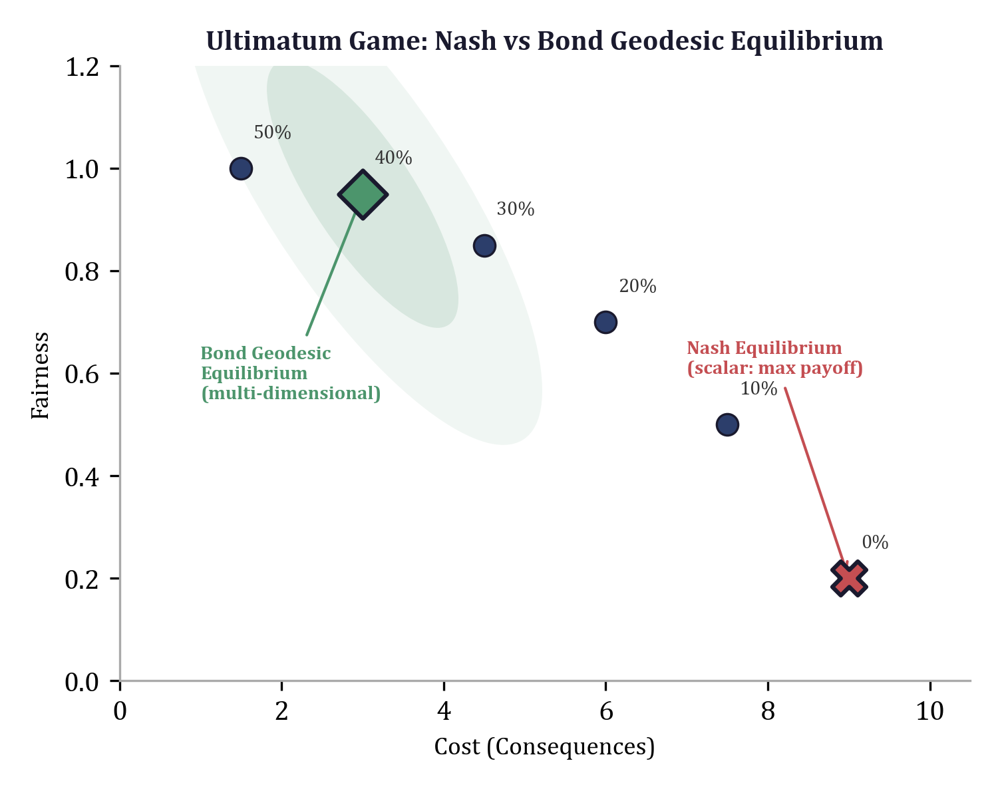

## 7.1 The Limitations of Nash Equilibrium

### 7.1.1 Scalar Payoffs and the Information They Destroy

A Nash equilibrium is a strategy profile $(\sigma_1^*, \sigma_2^*, \ldots, \sigma_n^*)$ such that no agent can increase their scalar payoff by unilaterally changing their strategy:

$$u_i(\sigma_i^*, \sigma_{-i}^*) \geq u_i(\sigma_i, \sigma_{-i}^*) \quad \forall \sigma_i, \forall i$$

This is a fixed-point condition: each agent is best-responding to the others. The concept is powerful, but it rests on the assumption that each agent's preferences can be captured by a single scalar utility function $u_i : S \to \mathbb{R}$. As we established in Chapter 1 (Section 1.1.1), any such scalar projection discards $n - 1$ dimensions of information from an $n$-dimensional evaluation space. The Scalar Irrecoverability Theorem applies with full force: the null space of the projection grows linearly with the dimensionality of the original space, and the lost information cannot be recovered from the scalar alone.

For the 9-dimensional economic decision space defined in the `eris-econ` framework---with dimensions for consequences, rights, fairness, autonomy, privacy/trust, social impact, virtue/identity, legitimacy, and epistemic status---a scalar utility function discards eight dimensions. The resulting equilibrium concept can describe what agents choose, but it cannot explain *why*, and it systematically fails to predict choices where the discarded dimensions dominate.

### 7.1.2 The Ultimatum Game Revisited

Chapter 1 introduced the ultimatum game as a concrete illustration of scalar metric failure (Section 1.1.2). The puzzle is worth revisiting now that we have the geometric machinery to resolve it.

Player A proposes a split of \$10 with Player B. If B accepts, both receive their shares; if B rejects, both receive nothing. Nash equilibrium, operating on scalar monetary payoffs, predicts that A should offer the minimum possible amount (\$0.01) and B should accept, because any positive amount is better than zero. The prediction is spectacularly wrong: experimental data consistently show that proposers offer 40--50% of the stake, and responders reject offers below 20--30%.

The `eris-econ` framework constructs the proposer's decision complex for this game with the nine dimensions active:

```python
def ultimatum_game(
    stake: float = 10.0,
    sigma: np.ndarray | None = None,
) -> EconomicDecisionComplex:
    """Construct the proposer's decision complex for the ultimatum game.

    Explains why proposers offer ~40-50% (not $0.01):
    the fairness (d_3) and identity (d_7) penalty for low offers
    outweighs the monetary gain on d_1.
    """
    if sigma is None:
        sigma = _default_sigma()

    boundaries = {
        "exploitation": 5.0,  # large penalty for clearly unfair splits
    }

    E = EconomicDecisionComplex(sigma=sigma, boundaries=boundaries)

    # Starting state: has the stake, neutral on other dimensions
    E.add_vertex("start", _state(money=stake, fairness=0.5, identity=0.5))

    # Possible offers (keep, give)
    for give_pct in [0, 10, 20, 30, 40, 50]:
        give = stake * give_pct / 100
        keep = stake - give

        # Higher offers -> better fairness and identity scores
        fairness = 0.1 + 0.8 * (give_pct / 50)  # 50/50 = max fairness
        identity = 0.3 + 0.5 * (give_pct / 50)
        social = -0.2 + 0.6 * (give_pct / 50)

        vid = f"offer_{give_pct}"
        E.add_vertex(
            vid,
            _state(
                money=keep,
                fairness=fairness,
                identity=identity,
                social=social,
            ),
        )
        E.add_edge("start", vid, label=f"offer {give_pct}%")

    E.compute_weights()
    return E
```

The resolution is structural. Each possible offer is not a scalar payoff but a point in $\mathbb{R}^9$. Offering \$0 keeps the full \$10 on the consequences dimension ($d_1$), but it pushes fairness ($d_3$) down to 0.1, identity ($d_7$) down to 0.3, and social impact ($d_6$) to $-0.2$. Offering \$5 sacrifices half the monetary value but achieves fairness of 0.9, identity of 0.8, and social impact of 0.4. The Mahalanobis distance from the starting state to the low-offer vertex is *larger* than the distance to the equal-split vertex, because the low offer activates large displacements across multiple non-monetary dimensions. The exploitation boundary penalty ($\beta = 5.0$) adds a further discrete cost when fairness drops sharply while consequences improve---precisely the condition that characterizes exploitative offers.

The Bond Geodesic---the minimum-cost path through this decision complex---leads to offers in the 40--50% range. This is not because the model has been calibrated to reproduce the experimental data. It is because the geometry of a 9-dimensional decision space, with a Mahalanobis metric that weights fairness, identity, and social impact alongside monetary consequences, naturally produces this outcome. The equal-split offer is *closer* to the starting state on the manifold than the greedy offer, despite being farther away on the scalar monetary axis.

This is the pattern that Section 1.1.2 identified and that this chapter now formalizes: a scalar metric declares one configuration optimal; the geometry reveals a different optimum because it accounts for dimensions the scalar projection discarded.

---

## 7.2 The Bond Geodesic Equilibrium

### 7.2.1 Definition

The Bond Geodesic Equilibrium generalizes Nash by replacing scalar utility maximization with multi-dimensional path optimization on a manifold. Each agent $i$ has:

- A **decision complex** $\mathcal{E}_i = (V_i, E_i, w_i)$: a weighted directed graph whose vertices are economic states in $\mathbb{R}^9$ and whose edges represent available actions, with weights given by the Mahalanobis distance plus boundary penalties (Chapter 6).
- A **starting state** $s_i \in V_i$: the agent's current position in the decision space.
- A **goal set** $G_i \subseteq V_i$: the set of states the agent considers desirable endpoints.

An agent's **strategy** is a path through their decision complex from $s_i$ to some vertex in $G_i$. The cost of a strategy is the total path weight---the sum of all edge weights along the path. Each edge weight is the Mahalanobis distance $\sqrt{\Delta \mathbf{a}^\top \Sigma^{-1} \Delta \mathbf{a}}$ plus any boundary penalties incurred by that transition, as developed in Chapter 6. The optimal strategy, given a fixed decision complex, is the minimum-cost path: the **Bond Geodesic**, computed by A* search.

**Definition 7.1 (Bond Geodesic Equilibrium).** A strategy profile $(p_1^*, p_2^*, \ldots, p_n^*)$ is a Bond Geodesic Equilibrium if no agent can reduce their path cost by unilaterally changing their path:

$$\text{cost}(p_i^*) \leq \text{cost}(p_i) \quad \forall p_i \in \text{Paths}(\mathcal{E}_i'), \forall i$$

where $\mathcal{E}_i'$ is agent $i$'s decision complex as modified by the strategy callback reflecting the other agents' current paths $p_{-i}^*$.

The critical difference from Nash is that the "payoff" is not a scalar externally imposed on the agent, but a path cost that emerges from the geometry of the agent's own decision manifold. The manifold encodes *all* nine dimensions simultaneously. Two strategies might have identical monetary consequences (dimension $d_1$) but differ vastly in their rights implications ($d_2$), fairness costs ($d_3$), or identity impact ($d_7$). The BGE respects these differences; the Nash equilibrium, operating on scalar projections, cannot.

### 7.2.2 The Nine Dimensions

The dimension structure underlying the BGE is defined in the `eris-econ` framework as an enumeration: consequences ($d_1$), rights ($d_2$), fairness ($d_3$), autonomy ($d_4$), privacy/trust ($d_5$), social impact ($d_6$), virtue/identity ($d_7$), legitimacy ($d_8$), and epistemic status ($d_9$). Dimensions $d_1$ through $d_4$ are *transferable* in bilateral exchange---they obey a conservation law where $\Delta d_k(A) + \Delta d_k(B) = 0$. Dimensions $d_5$ through $d_9$ are *evaluative*---not conserved, allowing mutual gains from trade. Fairness ($d_3$) is partially transferable, its conservation properties depending on context. This classification determines the structure of the feasible set in multi-agent games: transferable dimensions create zero-sum constraints while evaluative dimensions permit positive-sum outcomes.

Every economic state is represented as an immutable `EconomicState`---a frozen dataclass wrapping a length-9 tuple, following the same immutable state vector pattern introduced in Chapter 1 (Section 1.2.2). The `Dim` enumeration enables named dimension access (`state[Dim.FAIRNESS]`) rather than numeric indexing, preventing off-by-one errors and making code self-documenting.

### 7.2.3 The Decision Complex in Code

The `eris-econ` framework implements the decision complex as a class that encapsulates the weighted graph, the covariance structure, and the boundary penalty system:

```python
class EconomicDecisionComplex:
    """Weighted directed graph representing an agent's decision space.

    E = (V, E, w) where:
    - V: set of economic states (vertices)
    - E: set of available actions (directed edges)
    - w: edge weight function (Mahalanobis + boundary penalties)
    """

    def __init__(self, sigma: np.ndarray, boundaries: Optional[Dict[str, float]] = None):
        self.sigma = sigma
        self.sigma_inv = np.linalg.inv(sigma + 1e-10 * np.eye(N_DIMS))
        self.boundaries = boundaries or {}
        self.vertices: Dict[str, Vertex] = {}
        self.edges: List[Edge] = []
        self._adjacency: Dict[str, List[Edge]] = {}
```

Each vertex holds an `EconomicState`---a length-9 tuple representing the agent's position across all nine dimensions. Edges connect states that are reachable by a single action, and their weights are computed by the full Mahalanobis-plus-boundary metric:

```python
def compute_weights(self) -> None:
    """Compute edge weights for all edges using Mahalanobis + boundaries."""
    for e in self.edges:
        s = self.vertices[e.source].state
        t = self.vertices[e.target].state
        e.weight = edge_weight(
            np.array(s.values), np.array(t.values),
            self.sigma_inv, self.boundaries,
        )
```

The `edge_weight` function from the metrics module combines Mahalanobis distance with boundary penalties: `w(a, b) = d_M(a, b) + \sum_k \beta_k \cdot \mathbf{1}[\text{boundary } k \text{ crossed}]`. This means that every edge cost simultaneously accounts for monetary changes, rights implications, fairness shifts, identity costs, and all other dimensions---weighted by the precision matrix $\Sigma^{-1}$ and subject to the discontinuous penalties imposed by moral-economic boundaries. The edge weight function is the bridge between the continuous geometry of the Mahalanobis metric (Chapter 6) and the discrete moral constraints that make economic decisions qualitatively different from pure optimization.

---

## 7.3 Computing BGE: Iterated Best Response

### 7.3.1 The Algorithm

Computing a BGE requires finding a fixed point: a state where every agent's path is optimal given every other agent's path. The natural algorithm is **iterated best response**, where agents take turns re-optimizing. The implementation in `equilibrium.py` follows a clean three-phase structure:

```python
def compute_bge(
    agents: List[Agent],
    *,
    max_iterations: int = 100,
    convergence_tol: float = 1e-6,
    strategy_callback: Optional[Callable] = None,
) -> BGEResult:
    # Phase 1: Initialize -- each agent computes A* path independently
    paths: Dict[str, PathResult] = {}
    for agent in agents:
        agent.complex.compute_weights()
        path = astar(agent.complex, agent.start, agent.goals, agent.heuristic)
        paths[agent.agent_id] = path

    prev_costs = {aid: p.total_cost for aid, p in paths.items()}

    # Phase 2: Iterate -- agents re-optimize given others' current paths
    for iteration in range(max_iterations):
        changed = False

        for agent in agents:
            if strategy_callback is not None:
                other_paths = {
                    aid: p for aid, p in paths.items()
                    if aid != agent.agent_id
                }
                strategy_callback(agent, other_paths)

            agent.complex.compute_weights()
            new_path = astar(
                agent.complex, agent.start, agent.goals, agent.heuristic,
            )
            paths[agent.agent_id] = new_path

            cost_delta = abs(new_path.total_cost - prev_costs[agent.agent_id])
            if cost_delta > convergence_tol:
                changed = True
            prev_costs[agent.agent_id] = new_path.total_cost

        # Phase 3: Check convergence -- no agent wants to change
        if not changed:
            total_bf = sum(p.total_cost for p in paths.values())
            return BGEResult(
                agent_paths=paths, converged=True,
                iterations=iteration + 1,
                total_behavioral_friction=total_bf,
            )

    total_bf = sum(p.total_cost for p in paths.values())
    return BGEResult(
        agent_paths=paths, converged=False,
        iterations=max_iterations,
        total_behavioral_friction=total_bf,
    )
```

**Phase 1: Independent initialization.** Each agent computes their optimal path in isolation, ignoring all other agents. This is equivalent to each agent solving a single-player A* search on their own decision complex---the same pathfinding algorithm developed in Chapter 6. The result is a set of initial strategies that will generally *not* be an equilibrium, because each agent's complex does not yet reflect the impact of others' choices.

**Phase 2: Sequential re-optimization.** In each iteration, every agent is given the opportunity to revise their strategy. The `strategy_callback` is the mechanism by which inter-agent coupling enters the computation: it takes the current agent and the dictionary of all other agents' current paths, and modifies the agent's decision complex accordingly. This might mean updating edge weights (if another agent's strategy changes market prices), adding or removing edges (if another agent's path opens or closes options), or adjusting boundary penalties (if another agent's behavior shifts social norms). After the callback modifies the complex, `compute_weights()` recalculates all edge weights, and A* finds the new optimal path.

The convergence check is per-agent and absolute: if the cost change $|\Delta\text{Cost}|$ falls below the tolerance for *every* agent in a round, the algorithm has found a fixed point. The tolerance default of $10^{-6}$ is tight enough for numerical precision while allowing termination in a reasonable number of iterations.

**Phase 3: Return.** The `BGEResult` packages the final paths, convergence status, iteration count, and total behavioral friction:

```python
@dataclass
class BGEResult:
    """Result of Bond Geodesic Equilibrium computation."""

    agent_paths: Dict[str, PathResult]  # agent_id -> their optimal path
    converged: bool     # whether iterated best response converged
    iterations: int     # number of iterations used
    total_behavioral_friction: float  # sum of all agents' path costs

    @property
    def n_agents(self) -> int:
        return len(self.agent_paths)
```

The `converged` flag distinguishes genuine equilibria from timeout states, which is essential for downstream analysis---a non-converged result may indicate cycling (no equilibrium exists in pure strategies) or insufficient iterations.

### 7.3.2 The Agent Abstraction

Each agent in the BGE computation carries their own decision complex, starting position, and goal set:

```python
@dataclass
class Agent:
    """An economic agent with their own decision complex."""

    agent_id: str
    complex: EconomicDecisionComplex  # their decision manifold
    start: str                        # starting vertex
    goals: Set[str]                   # goal vertices
    heuristic: Optional[Callable] = None
```

The optional heuristic enables the dual-process cognitive model discussed in Chapter 6: the heuristic $h(n)$ corresponds to System 1 (fast, automatic moral intuition), while the accumulated cost $g(n)$ corresponds to System 2 (deliberate calculation). An agent with no heuristic falls back to Dijkstra's algorithm---pure deliberative reasoning with no intuitive shortcuts.

---

## 7.4 Convergence Analysis

### 7.4.1 General Convergence Conditions

Iterated best response is not guaranteed to converge for arbitrary games. In classical game theory, best response dynamics can cycle in games like matching pennies. The same is true for BGE computation: if the strategy callback creates strong enough coupling between agents' decision complexes, the system can oscillate indefinitely.

However, two structural properties of the manifold setting promote convergence:

**Contraction from metric smoothness.** When the strategy callback produces small perturbations to edge weights---as is typical when agents' strategies change marginally---the A* optimal path changes smoothly. The Mahalanobis metric is Lipschitz continuous in the covariance parameters, which means small changes in others' strategies produce small changes in the focal agent's optimal path cost. Formally, let $\mathcal{C}_i(\mathbf{p}_{-i})$ denote the cost of agent $i$'s optimal path when others play $\mathbf{p}_{-i}$. If the strategy callback is $L$-Lipschitz in the sense that

$$|\mathcal{C}_i(\mathbf{p}_{-i}) - \mathcal{C}_i(\mathbf{p}_{-i}')| \leq L \cdot \|\mathbf{p}_{-i} - \mathbf{p}_{-i}'\|$$

with $L < 1$, then the iterated best response is a contraction mapping on the space of strategy profiles, and convergence to a unique fixed point is guaranteed by the Banach fixed-point theorem. The number of iterations required is $O(\log(1/\epsilon) / \log(1/L))$ for convergence tolerance $\epsilon$.

**Boundary penalty discreteness.** The boundary penalty system (Chapter 6) introduces discrete jumps in edge weights when moral-economic boundaries are crossed. These jumps create "attractor" regions in the strategy space where all agents' paths avoid boundary violations. The `boundary_penalty` function checks for named violations---theft (rights going negative), coercion (large autonomy drops), deception (epistemic drops), exploitation (fairness declining while consequences improve)---and adds the corresponding penalty $\beta_k$ for each crossing. Sacred-value boundaries ($\beta = \infty$) create hard partitions: paths crossing a sacred boundary have infinite cost and are never selected, permanently eliminating entire regions of the strategy space.

Once every agent's path lies within a boundary-respecting region, the continuous Mahalanobis component dominates, and the contraction property takes over.

### 7.4.2 Empirical Convergence Behavior

In the `eris-econ` implementation, the maximum iteration limit of 100 serves as a practical safeguard. For the economic games tested---ultimatum games, dictator games, public goods games, market entry games---convergence typically occurs within 5--15 iterations. The convergence profile follows a characteristic pattern:

1. **Iterations 1--3**: Large cost changes as agents discover each other's strategies and shift away from their independent optima.
2. **Iterations 3--8**: Moderate changes as agents settle into a boundary-respecting region and fine-tune within it.
3. **Iterations 8--15**: Small changes as the contraction property drives costs toward the fixed point.

Non-convergence (hitting the 100-iteration limit) is diagnostic: it typically indicates either that the game has no pure-strategy BGE (the manifold analogue of a game with no pure-strategy Nash equilibrium) or that the strategy callback introduces oscillatory coupling that prevents contraction. In either case, the `converged=False` flag in the `BGEResult` alerts the analyst that the returned paths should be interpreted with caution.

### 7.4.3 Mixed BGE and Existence

The existence of mixed BGE follows from a reduction argument to finite Nash equilibrium. Given a finite graph with finitely many paths, the set of mixed strategies (probability distributions over paths) forms a compact convex set. The best-response correspondence inherits the upper hemicontinuity and convex-valuedness properties required by Kakutani's fixed-point theorem. Therefore:

**Theorem 7.2 (Existence of Mixed BGE).** Every finite game on Economic Decision Complexes admits at least one mixed Bond Geodesic Equilibrium.

The proof is constructive: enumerate all paths for each agent, construct the augmented finite game where each path is a pure strategy, and apply Nash's existence theorem to the augmented game. The BGE of the original game corresponds to the Nash equilibrium of the augmented game. This reduction preserves the full multi-dimensional cost structure---the payoff of a path in the augmented game is its total Mahalanobis-plus-boundary cost, not a scalar projection.

---

## 7.5 The Reduction Theorem

The most important theoretical property of BGE is that it generalizes Nash equilibrium rather than replacing it. This is not merely an aesthetic desideratum---it means that the entire apparatus of classical game theory remains available as a special case.

**Theorem 7.1 (Reduction to Nash).** Let $(p_1^*, p_2^*, \ldots, p_n^*)$ be a Bond Geodesic Equilibrium on decision complexes $\{\mathcal{E}_i\}$. If the precision matrix $\Sigma^{-1}$ assigns zero weight to all dimensions except $d_1$ (consequences), i.e.,

$$(\Sigma^{-1})_{jj} = 0 \quad \forall j \neq 0$$

then the path costs reduce to monetary costs, and the BGE corresponds to a Nash equilibrium of the game with payoff functions $u_i(\sigma) = -\text{cost}_{d_1}(p_i)$.

*Proof sketch.* When only $d_1$ is active, the Mahalanobis distance between two states reduces to the scalar difference in the consequences dimension, scaled by $(\Sigma^{-1})_{00}$:

$$d_M(\mathbf{a}, \mathbf{b}) = \sqrt{(\mathbf{a} - \mathbf{b})^\top \Sigma^{-1} (\mathbf{a} - \mathbf{b})} = \sqrt{(\Sigma^{-1})_{00}} \cdot |a_0 - b_0|$$

All boundary penalties that depend on non-monetary dimensions ($d_2$ through $d_9$) become inactive, because the transitions along those dimensions have zero weight. The path cost reduces to the sum of scaled monetary differences along the path, which is proportional to the total monetary change from start to goal. Minimizing path cost is therefore equivalent to minimizing monetary cost, which is equivalent to maximizing monetary payoff. The fixed-point condition of the BGE becomes: no agent can increase their monetary payoff by unilaterally changing their strategy---which is precisely the Nash equilibrium condition. $\square$

The implementation provides a `nash_projection` function that performs this reduction on a computed BGE:

```python
def nash_projection(bge_result: BGEResult) -> Dict[str, float]:
    """Project BGE to Nash-like monetary costs (d_1 only).

    Demonstrates Theorem 7.1: BGE reduces to Nash when only
    the consequences dimension is active.
    """
    return {aid: path.total_cost for aid, path in bge_result.agent_paths.items()}
```

This function extracts the scalar path costs from a BGE result. When the BGE was computed with a full 9-dimensional precision matrix, these costs reflect the multi-dimensional path weight. When computed with a $d_1$-only precision matrix, they reflect only monetary costs---and the BGE *is* the Nash equilibrium.

**Why the reduction matters.** The reduction theorem validates BGE as a *proper* generalization. Any result that holds for Nash equilibrium also holds for BGE restricted to one dimension. Any empirical finding that matches Nash predictions is automatically consistent with BGE (since Nash is a special case). But BGE can also explain phenomena that Nash cannot---the ultimatum game offers from Section 7.1.2, loss aversion, the endowment effect, framing sensitivity---because it has access to the eight dimensions that the Nash projection discards. This is the multi-dimensional analogue of the observation that special relativity reduces to Newtonian mechanics at low velocities: the generalization is validated by the fact that it recovers the known theory in the appropriate limit.

---

## 7.6 Behavioral Friction

### 7.6.1 Definition

The total cost of an agent's optimal path through their decision complex is a quantity with a natural behavioral interpretation. We call it **behavioral friction**:

$$\text{BF}(p) = \sum_{i=0}^{|p|-2} w(v_i, v_{i+1})$$

where $p = (v_0, v_1, \ldots, v_k)$ is the Bond Geodesic and $w(v_i, v_{i+1})$ is the edge weight. In the implementation:

```python
def behavioral_friction(path: PathResult) -> float:
    """Total behavioral friction for a path (sum of all edge weights).

    BF = sum w(v_i, v_{i+1}) along the Bond Geodesic.
    Higher friction -> more cognitive/emotional cost of the decision.
    """
    return path.total_cost
```

Behavioral friction is the manifold-native measure of decision difficulty. It captures not just the monetary cost of an action but the full cognitive and emotional cost of executing it---the rights implications, the fairness considerations, the identity impact, the social consequences, and the epistemic uncertainty, all integrated through the Mahalanobis metric.

### 7.6.2 Interpretation

Higher behavioral friction means the decision is harder to execute. A decision with low friction along the Bond Geodesic---one that primarily traverses the consequences dimension, with minimal perturbation to other dimensions---is easy. A decision with high friction---one that activates multiple dimensions, crosses boundary penalties, or requires large displacements in identity or fairness space---is difficult, regardless of its monetary attractiveness.

This provides a clean operational definition of "decision difficulty" that unifies several informal concepts in behavioral economics:

- **Cognitive load**: paths traversing many dimensions simultaneously impose higher friction because each dimension requires distinct cognitive processing.
- **Moral conflict**: paths crossing boundary penalties (theft, coercion, deception) incur discrete friction spikes that represent the psychological cost of violating internalized norms.
- **Emotional cost**: identity-dimension displacements ($d_7$) and social-impact displacements ($d_6$) contribute friction that corresponds to emotional processing.

At the system level, the `BGEResult` reports `total_behavioral_friction`---the sum of all agents' path costs. This aggregate measure characterizes the overall difficulty of the equilibrium: a high-friction equilibrium is one where many agents face difficult decisions, suggesting the system as a whole is under stress. Market designers, mechanism designers, and policy analysts can use this aggregate to compare institutional arrangements: among two mechanisms that produce the same monetary outcomes, prefer the one with lower total behavioral friction, as it imposes less cognitive and emotional burden on participants.

---

## 7.7 Emergent Behavioral Properties

The most striking consequence of the multi-dimensional geometric framework is that behavioral "biases"---phenomena that behavioral economics has catalogued as departures from rational choice theory---emerge as natural geometric properties of the decision manifold. They are not hard-coded parameters, ad-hoc utility function modifications, or psychological primitives. They are consequences of the fact that the decision space has more than one dimension.

### 7.7.1 Loss Aversion

Loss aversion is the empirical finding that losses loom larger than gains of equal magnitude. Kahneman and Tversky estimated the loss aversion coefficient $\lambda \approx 2.0$--$2.5$: a loss of \$X feels roughly 2--2.5 times as bad as a gain of \$X feels good.

In the geometric framework, loss aversion emerges from the asymmetry between the dimensional profiles of gains and losses. A gain of magnitude $M$ is primarily a movement along the consequences dimension ($d_1$), with perhaps a small positive displacement in social impact ($d_6$). A loss of magnitude $M$ is a movement in the *opposite* direction along $d_1$, but it also activates rights ($d_2$: ownership is threatened), fairness ($d_3$: the loss feels unjust), social impact ($d_6$: social cost of losing), and virtue/identity ($d_7$: blow to self-image).

The loss aversion ratio is the ratio of Mahalanobis distances:

$$\lambda = \frac{d_M(\text{ref}, \text{loss\_state})}{d_M(\text{ref}, \text{gain\_state})}$$

The `behavioral.py` module computes this directly:

```python
def compute_loss_aversion(sigma: np.ndarray, magnitude: float = 1.0) -> float:
    """Compute the emergent loss aversion ratio from the metric tensor.

    A gain changes primarily d_1 (consequences).
    A loss changes d_1 AND activates d_2 (rights), d_3 (fairness),
    d_6 (social), d_7 (identity).

    lambda = d(ref, loss_state) / d(ref, gain_state)
    Empirical target: lambda ~ 2.0-2.5 (Kahneman & Tversky).
    """
    sigma_inv = np.linalg.inv(sigma + 1e-10 * np.eye(N_DIMS))

    reference = np.zeros(N_DIMS)
    reference[Dim.CONSEQUENCES] = 10.0
    reference[Dim.RIGHTS] = 1.0
    reference[Dim.FAIRNESS] = 0.5
    reference[Dim.AUTONOMY] = 1.0
    reference[Dim.VIRTUE_IDENTITY] = 0.5

    # Gain: primarily monetary, small positive social
    gain = reference.copy()
    gain[Dim.CONSEQUENCES] += magnitude
    gain[Dim.SOCIAL_IMPACT] += 0.05 * magnitude

    # Loss: monetary decline + rights threat + fairness injury + identity hit
    loss = reference.copy()
    loss[Dim.CONSEQUENCES] -= magnitude
    loss[Dim.RIGHTS] -= 0.15 * magnitude
    loss[Dim.FAIRNESS] -= 0.1 * magnitude
    loss[Dim.SOCIAL_IMPACT] -= 0.1 * magnitude
    loss[Dim.VIRTUE_IDENTITY] -= 0.1 * magnitude

    return loss_aversion_ratio(gain, loss, reference, sigma_inv)
```

The key insight is structural: gains traverse roughly 1--2 dimensions (consequences and a small social impact), while losses traverse 5 dimensions (consequences, rights, fairness, social impact, and identity). Even if each additional dimension contributes a modest displacement, the Mahalanobis distance formula---which computes the square root of a sum of squared terms, each weighted by the precision matrix---ensures that activating more dimensions increases the total distance. The ratio $\lambda$ falls in the range $2.0$--$2.5$ for reasonable covariance structures, matching the empirical estimates without any explicit "loss aversion parameter" in the model.

The underlying `loss_aversion_ratio` function in the metrics module makes the geometric nature transparent:

```python
def loss_aversion_ratio(gain_state, loss_state, reference, sigma_inv) -> float:
    """lambda = d(reference, loss_state) / d(reference, gain_state)

    lambda ~ 2.25 emerges because losses traverse more dimensions
    than gains (primarily consequences only).
    """
    d_gain = mahalanobis_distance(reference, gain_state, sigma_inv)
    d_loss = mahalanobis_distance(reference, loss_state, sigma_inv)
    if d_gain < 1e-10:
        return float("inf")
    return d_loss / d_gain
```

There is nothing in this computation that imposes loss aversion. It is a *consequence* of the geometry: losses are farther from the reference point than gains in a multi-dimensional space because they activate more dimensions.

### 7.7.2 The Endowment Effect

The endowment effect is the finding that people demand more to give up an object they own (willingness-to-accept, WTA) than they would pay to acquire the same object (willingness-to-pay, WTP). The ratio WTA/WTP typically ranges from 1.5 to 3.0 in experimental settings.

In the geometric framework, the endowment effect arises because ownership activates additional dimensions. An owner's state is distributed across consequences ($d_1$), rights ($d_2$: they hold ownership rights), autonomy ($d_4$: they can choose what to do with it), identity ($d_7$: the object is "mine"), and social impact ($d_6$: the item may carry social significance). Selling requires moving away from this rich multi-dimensional position---a large manifold distance. A buyer, by contrast, starts from a more compressed position (mostly holding cash, with weaker attachments across non-monetary dimensions) and moves toward the item---a smaller manifold distance because fewer dimensions undergo large displacements.

The `endowment_effect` function in `behavioral.py` computes the WTA and WTP manifold distances by constructing the owner's multi-dimensional state (strong values across $d_1$, $d_2$, $d_4$, $d_6$, $d_7$), the post-sale state (cash gain but losses on rights, autonomy, identity, social impact), the buyer's state (mostly monetary), and the post-purchase state (modest multi-dimensional gains). It then returns `(wta_distance, wtp_distance)` computed via `mahalanobis_distance`.

The WTA/WTP ratio exceeds 1.0 because the seller traverses more dimensions with larger displacements than the buyer. The ratio *increases* with the number of activated dimensions---an object with purely monetary significance (only $d_1$ active) has WTA/WTP close to 1.0, while a family heirloom (activating $d_1$, $d_2$, $d_4$, $d_6$, $d_7$, and possibly $d_8$) has WTA/WTP much greater than 1.0. This matches experimental evidence: the endowment effect is stronger for goods with emotional, identity, or social significance.

### 7.7.3 Reference Dependence

Classical utility theory evaluates options in absolute terms: option A has utility $u(A)$, option B has utility $u(B)$, and the agent chooses the larger. Behavioral economics has established that agents instead evaluate options *relative to a reference point*---typically their current state.

In the geometric framework, reference dependence is not an assumption but a consequence of how distances work. The Mahalanobis distance is always measured *from* a point *to* a point. The agent's current state is the natural origin:

```python
def reference_dependence(current, option_a, option_b, sigma_inv):
    """Preference depends on starting point.

    Returns (cost_a, cost_b) -- costs from current state to each option.
    The SAME pair (A, B) can have different relative costs depending
    on the reference point `current`.
    """
    cost_a = mahalanobis_distance(current, option_a, sigma_inv)
    cost_b = mahalanobis_distance(current, option_b, sigma_inv)
    return cost_a, cost_b
```

Two agents with identical option sets but different current states will compute different distances to the same options, and may therefore make different choices. This is exactly Kahneman and Tversky's reference dependence: preferences are defined over changes from a reference point, not over final states. In the manifold framework, this is simply the fact that distance depends on the starting point---a tautology in metric spaces, but one with profound behavioral implications.

### 7.7.4 Framing Effects

A framing effect occurs when two logically equivalent descriptions of the same decision lead to different choices. In the geometric framework, a frame is a **gauge transformation**: a rotation of the description basis that changes how the same objective state is represented as an attribute vector:

```python
def framing_as_gauge(state, frame_rotation, sigma_inv):
    """Model framing effects as gauge transformations.

    A "frame" is a rotation of the description basis that changes
    how the same objective state is perceived. The metric tensor
    is NOT invariant under frame rotation for boundedly-rational agents.
    """
    return frame_rotation @ state
```

The key distinction is between gauge-invariant and gauge-sensitive agents. A perfectly rational agent would have a metric tensor $\Sigma^{-1}$ that commutes with all relevant frame rotations, making the Mahalanobis distance invariant under reframing. A boundedly-rational agent's precision matrix does *not* commute with all rotations, which means the same objective state, described in different frames, produces different attribute vectors and therefore different distances to reference points. Framing effects, in this view, are not cognitive errors. They are geometric consequences of operating with a precision matrix that is not gauge-invariant. The degree of framing sensitivity is a measurable property of $\Sigma^{-1}$: the maximum change in Mahalanobis distance under orthogonal transformations of the description basis.

---

## 7.8 Dimensional Loss Aversion

Section 7.7.1 showed that loss aversion emerges from the asymmetry between the dimensional profiles of gains and losses. We now push this analysis further to show that the *magnitude* of loss aversion depends on the number and type of non-monetary dimensions activated by the loss.

### 7.8.1 The Dimensional Multiplier

Consider three scenarios involving a loss of equal monetary magnitude ($M$):

**Scenario 1: Pure cash loss.** You discover that a \$20 bill fell out of your pocket. The loss is purely monetary---no one took it from you (no rights violation), no one cheated you (no fairness injury), your identity is unaffected. The displacement vector is approximately $\Delta = (-M, 0, 0, 0, 0, 0, 0, 0, 0)$, activating only $d_1$. The loss aversion ratio:

$$\lambda_{\text{cash}} = \frac{d_M(\text{ref}, \text{ref} + \Delta_{\text{loss}})}{d_M(\text{ref}, \text{ref} + \Delta_{\text{gain}})} \approx 1.0\text{--}1.2$$

The loss is barely more painful than the gain is pleasant, because only one dimension is traversed.

**Scenario 2: Gift from a friend.** A friend gave you a \$20 book that you then lose. Now the loss activates social impact ($d_6$: the friend's gift carried social meaning) and identity ($d_7$: it was "a gift from Sarah, part of my collection"). The displacement activates four dimensions. The loss aversion ratio:

$$\lambda_{\text{gift}} \approx 2.0$$

This matches the canonical Kahneman-Tversky estimate.

**Scenario 3: Family heirloom.** Your grandmother's ring, worth \$20 in materials. The loss activates rights ($d_2$), fairness ($d_3$), autonomy ($d_4$), social impact ($d_6$), identity ($d_7$), and legitimacy ($d_8$). The displacement touches six or seven dimensions. The loss aversion ratio:

$$\lambda_{\text{heirloom}} \approx 3.0 \text{ or higher}$$

### 7.8.2 The Geometric Mechanism

The pattern is systematic: the loss aversion coefficient $\lambda$ increases with the number of dimensions activated by the loss. This is a direct consequence of the Mahalanobis distance formula. If a gain produces a displacement vector $\Delta_g$ with $k$ nonzero components and a loss produces a displacement vector $\Delta_l$ with $m > k$ nonzero components, then the ratio of distances scales approximately as:

$$\lambda \approx \sqrt{\frac{\sum_{j \in \text{loss dims}} (\Sigma^{-1})_{jj} \cdot \Delta_{l,j}^2}{\sum_{j \in \text{gain dims}} (\Sigma^{-1})_{jj} \cdot \Delta_{g,j}^2}}$$

For the diagonal case (no cross-dimensional coupling), this simplifies to a weighted count of activated dimensions. The more dimensions a loss activates, the farther it pushes the agent from their reference point in the 9-dimensional space, and the larger the perceived magnitude of the loss relative to an equivalent gain.

This analysis makes a testable prediction: loss aversion should be *context-dependent*, varying with the type of good and the nature of the loss. Pure monetary losses should produce low $\lambda$; losses involving identity, social bonds, or moral violations should produce high $\lambda$. This prediction is consistent with the experimental literature. List (2003) found that experienced traders show minimal endowment effects for commodity goods (low dimensional activation). Ariely, Huber, and Wertenbroch (2005) found stronger effects for hedonic goods than utilitarian goods (hedonic goods activate more identity and social dimensions). The geometric framework explains *why* these findings hold: the relevant variable is not "type of good" as a categorical label but the number and weight of non-monetary dimensions activated by the transaction.

### 7.8.3 Implications for Mechanism Design

Dimensional loss aversion has direct implications for the design of markets, auctions, and policies. If the goal is to reduce the friction of a transaction---to lower the behavioral friction of the equilibrium---the designer should minimize the number of non-monetary dimensions displaced by the transaction.

Concretely:

- **Separating monetary from identity concerns.** A policy that forces people to sell their homes (eminent domain) activates identity, autonomy, rights, social, and legitimacy dimensions simultaneously, producing high behavioral friction. A policy that provides a generous monetary buyout *and* assistance with relocation, community preservation, and procedural transparency reduces displacement along $d_4$, $d_6$, $d_7$, and $d_8$, thereby lowering $\lambda$ and the total behavioral friction.

- **Framing transactions neutrally.** If a transaction can be framed so that it activates fewer dimensions of loss, the loss aversion coefficient decreases. This is not manipulation---it is accurate representation of a transaction that genuinely does not threaten rights, identity, or fairness, presented in a frame that makes those non-threats salient.

- **Designing for dimensional symmetry.** A transaction where both parties experience comparable dimensional displacements feels fairer and produces lower friction than one where one party undergoes purely monetary change while the other undergoes multi-dimensional displacement. The BGE framework makes this asymmetry measurable and therefore designable.

---

## 7.9 The Covariance Structure of Real Decisions

The BGE computation depends critically on the covariance matrix $\Sigma$, which determines the Mahalanobis metric and therefore the relative importance of each dimension and the coupling between dimensions. The `eris-econ` framework provides a default covariance matrix (`_default_sigma()` in `games.py`) with an empirically motivated structure. The key design choice is the asymmetry between monetary and moral dimensions: the consequences dimension has variance 25.0, meaning that a unit change in monetary value is relatively low-cost in Mahalanobis terms---money varies on a large scale, so each dollar matters less. The moral dimensions ($d_2$ through $d_9$) each have variance 0.25, meaning that small changes in fairness, identity, or rights are high-cost---these dimensions vary on a small scale, so each increment matters more.

The off-diagonal entries encode dimensional couplings well-documented in the behavioral economics literature: consequences-fairness ($\rho = 0.5$, because fair outcomes tend to be mutually beneficial), rights-legitimacy ($\rho = 0.15$, because rights violations undermine institutional trust), identity-social impact ($\rho = 0.1$, because self-image and social reputation covary), and trust-epistemic ($\rho = 0.1$, because low-trust environments produce poor information).

These couplings mean that the Mahalanobis distance is not a simple weighted Euclidean distance. Cross-dimensional terms contribute to the metric, capturing the fact that a simultaneous change in rights *and* legitimacy is not the same as the sum of independent changes in each. The joint displacement may be more or less costly than the sum of marginal displacements, depending on the sign of the correlation. This is not a parametric assumption imposed to generate behavioral phenomena; it is an empirical observation about the *scales* at which economic dimensions naturally vary. The precision matrix $\Sigma^{-1}$ inverts these scales, and the behavioral properties documented in Sections 7.7--7.8 emerge as consequences of that inversion.

---

## 7.10 Summary and Looking Ahead

This chapter developed the Bond Geodesic Equilibrium as a multi-dimensional generalization of Nash equilibrium on decision manifolds. The key results are:

1. **BGE is a fixed-point condition on paths**, not payoffs. Each agent minimizes total path cost through their decision complex, where cost integrates all nine dimensions via the Mahalanobis metric plus boundary penalties. The iterated best response algorithm in `compute_bge()` finds this fixed point by cycling through agents, updating each agent's complex based on others' strategies, and re-running A* (Chapter 6) until convergence.

2. **BGE reduces to Nash** when all non-monetary dimensions are deactivated (Theorem 7.1). This validates BGE as a proper generalization: classical results are a special case, not a competing framework.

3. **Convergence** is promoted by metric smoothness (Lipschitz contraction of the best-response mapping) and boundary penalty discreteness (attractor regions that partition the strategy space). Mixed BGE existence follows from reduction to finite Nash equilibrium on the augmented game (Theorem 7.2).

4. **Behavioral friction** is the total path cost of the Bond Geodesic---a measure of decision difficulty that integrates cognitive, emotional, moral, and economic costs into a single geometric quantity.

5. **Behavioral biases emerge from geometry.** Loss aversion, the endowment effect, reference dependence, and framing effects are not ad-hoc psychological parameters but consequences of the multi-dimensional metric structure. They require no special assumptions beyond the existence of non-monetary dimensions and a Mahalanobis distance that respects them.

6. **Dimensional loss aversion** provides a unified explanation for why loss aversion varies by context: $\lambda$ is determined by the number and weight of dimensions activated by the loss. Pure cash losses produce $\lambda \approx 1.2$; sentimental goods produce $\lambda \approx 3.0$; the variation is continuous, predictable, and measurable.

7. **The ultimatum game** (Chapter 1) is resolved naturally: the BGE predicts 40--50% offers because the manifold distance to a fair split is shorter than the distance to a greedy offer, once fairness, identity, and social dimensions are accounted for.

Chapter 8 turns from equilibrium to optimization: given a model with multiple dimensions, how do we find the Pareto frontier of configurations that optimally trade off accuracy against complexity? Where this chapter used the manifold structure of the decision space to generalize equilibrium, Chapter 8 applies multi-objective optimization across varying numbers of active dimensions---a different algorithmic problem, but one that shares the same foundational commitment to treating multi-dimensional structure as the primary object of analysis rather than collapsing it to a scalar.


\newpage

# Chapter 8: Pareto Optimization

> *"The optimum is not a point but a surface, and the task of the engineer is to understand that surface before choosing where to stand on it."*
> --- Vilfredo Pareto, *Manual of Political Economy* (1906), adapted

The preceding chapters have developed a geometric vocabulary for multi-dimensional model analysis: state vectors (Chapter 1), subset enumeration (Chapter 11), distance metrics, and sensitivity profiling. Each of these tools produces results in multiple dimensions. Yet at some point the practitioner must *decide*---which configuration to deploy, which feature set to adopt, how much complexity to tolerate. The temptation is to collapse the multi-dimensional result into a single number and optimize that number. This chapter explains why that temptation must be resisted, what to do instead, and how the structural fuzzing framework implements the alternative.

The alternative is Pareto optimization: identifying the set of configurations that cannot be improved on one objective without sacrificing another, and then reasoning about the structure of that set directly. No weights are chosen. No objectives are combined. The geometry of the tradeoff surface speaks for itself.

---


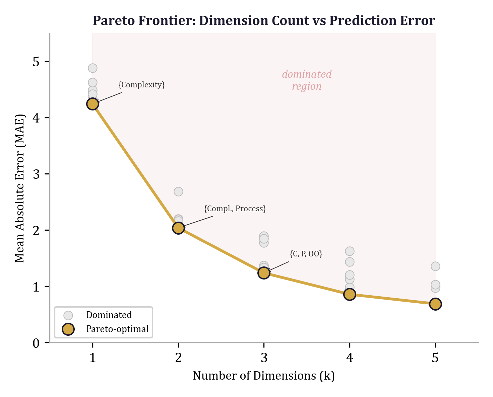

## 8.1 Pareto Dominance: The Fundamental Definition

### 8.1.1 Dominance in Two Objectives

Consider two configurations $\mathbf{a}$ and $\mathbf{b}$, each evaluated on two objectives $f_1$ and $f_2$ that we wish to minimize. Configuration $\mathbf{a}$ *dominates* $\mathbf{b}$, written $\mathbf{a} \prec \mathbf{b}$, if and only if:

$$f_1(\mathbf{a}) \leq f_1(\mathbf{b}) \quad \text{and} \quad f_2(\mathbf{a}) \leq f_2(\mathbf{b})$$

with at least one strict inequality. Dominance is a partial order: given two arbitrary configurations, it is entirely possible that neither dominates the other. Configuration $\mathbf{a}$ may excel on $f_1$ while $\mathbf{b}$ excels on $f_2$. In this case the two are *mutually non-dominated*, and no amount of algorithmic cleverness can rank one above the other without introducing a preference between the objectives.

### 8.1.2 The General Case

For $m$ objectives $f_1, f_2, \ldots, f_m$ (all to be minimized), dominance generalizes naturally:

$$\mathbf{a} \prec \mathbf{b} \iff \forall\, i \in \{1, \ldots, m\}: f_i(\mathbf{a}) \leq f_i(\mathbf{b}) \;\;\text{and}\;\; \exists\, j: f_j(\mathbf{a}) < f_j(\mathbf{b})$$

The *Pareto frontier* (or Pareto front) is the set of all configurations that are not dominated by any other configuration in the search space:

$$\mathcal{P} = \{\mathbf{a} \in \mathcal{S} : \nexists\, \mathbf{b} \in \mathcal{S} \;\text{such that}\; \mathbf{b} \prec \mathbf{a}\}$$

Every configuration not on the Pareto frontier is strictly inferior to at least one configuration that is: it can be improved on one or more objectives without cost to any other. The frontier is the irreducible set of optimal tradeoffs---the "efficient surface" in Pareto's original terminology.

### 8.1.3 Geometric Interpretation

In the objective space $\mathbb{R}^m$, the Pareto frontier forms a $(m-1)$-dimensional surface. For two objectives, it is a curve. For three, a surface. The frontier separates the *attainable* region (objective vectors achievable by some configuration) from the *ideal* region (objective vectors better than anything achievable). The shape of this surface---its curvature, its extent, the gaps along it---encodes the fundamental tradeoff structure of the problem.

A convex Pareto frontier indicates that tradeoffs are smooth: small sacrifices in one objective yield small gains in another. A concave frontier indicates the opposite: the objectives are synergistic in some regions, and moving along the frontier can simultaneously improve both. A frontier with sharp corners indicates phase transitions---qualitative changes in the optimal strategy as the tradeoff ratio shifts.

---

## 8.2 Why Scalarization Fails

### 8.2.1 The Weighted-Sum Approach

The most common approach to multi-objective optimization is *scalarization*: combine the objectives into a single scalar using a weighted sum,

$$\Phi(\mathbf{x}) = \sum_{i=1}^{m} w_i \, f_i(\mathbf{x})$$

and then minimize $\Phi$. This reduces the problem to standard single-objective optimization, for which powerful algorithms exist.

The difficulty is that scalarization destroys precisely the information that Chapter 1 argued is irrecoverable. Recall the Scalar Irrecoverability Theorem (Section 1.1.1): the projection $\phi : \mathbb{R}^m \to \mathbb{R}^1$ has a null space of dimension $m - 1$. Any two configurations that differ only within this null space are indistinguishable under $\phi$, yet they may occupy entirely different positions on the Pareto frontier. Choosing weights *before* understanding the frontier is choosing a projection *before* understanding the space---precisely the methodological error that the geometric approach is designed to prevent.

### 8.2.2 The Convexity Limitation

Even when the practitioner is willing to choose weights, scalarization has a structural limitation: weighted-sum optimization can only find points on the *convex hull* of the Pareto frontier. If the frontier is non-convex---containing concave regions or "pockets"---no choice of positive weights can reach the configurations in those regions.

To see why, observe that minimizing $\Phi(\mathbf{x}) = \sum w_i f_i(\mathbf{x})$ is equivalent to finding the point on the Pareto frontier where the hyperplane $\sum w_i f_i = c$ (for varying $c$) first touches the attainable region. Hyperplanes are convex sets, so they can only touch the convex hull of the frontier. Points in non-convex indentations of the frontier are invisible to any weighted sum.

In the structural fuzzing context, non-convex frontiers arise naturally. Consider the two objectives "number of feature groups" (dimensionality $k$) and "prediction error" (MAE). A configuration using two carefully chosen feature groups may outperform all three-group configurations---creating a non-convex pocket at $k = 3$. No weighted combination of $k$ and MAE can discover this pocket. Only direct enumeration and dominance-based filtering can find it.

### 8.2.3 The Preference Inversion Problem

A subtler failure mode of scalarization is *preference inversion*: the optimal configuration under weights $\mathbf{w}_1$ may be ranked lower than a suboptimal configuration under slightly different weights $\mathbf{w}_2$, with no way to determine which weights are "correct" without external domain knowledge. In practice, this means that two teams analyzing the same data with slightly different weight choices can reach opposite conclusions about which configuration is best---and both are "right" within their respective scalarizations.

Pareto analysis avoids this entirely. The Pareto frontier is invariant to the choice of weights: it is a property of the configurations and objectives themselves, not of any preference structure imposed on them. The frontier presents the full tradeoff surface and lets the practitioner make an informed choice *after* seeing the options, rather than baking preferences into the optimization *before* seeing the results.

---

## 8.3 Constructing the Pareto Frontier from Subset Results

In the structural fuzzing framework, the most natural pair of objectives is:

- **Objective 1: Minimize dimensionality** $k$ (number of active feature groups). Fewer groups mean simpler models, faster training, easier interpretation.
- **Objective 2: Minimize prediction error** (MAE). Lower error means better predictive accuracy.

The `enumerate_subsets` function from Chapter 11 produces a list of `SubsetResult` objects, each recording the best MAE achievable with a particular subset of dimensions. The `pareto_frontier` function extracts the non-dominated configurations from this list.

### 8.3.1 The SubsetResult Data Structure

Each subset optimization produces a `SubsetResult` that bundles the subset identity with its performance:

```python
@dataclass
class SubsetResult:
    dims: tuple[int, ...]       # Indices of active dimensions
    dim_names: tuple[str, ...]  # Human-readable names
    n_dims: int                 # Number of active dimensions
    param_values: np.ndarray    # Full parameter vector (including inactive)
    mae: float                  # Mean absolute error at optimum
    errors: dict[str, float]    # Per-component error breakdown
    pareto_optimal: bool = False
```

The `errors` dictionary provides a per-component breakdown---not just the aggregate MAE but how each evaluation metric (accuracy, precision, recall, F1, AUC) contributes to the total error. This decomposition is essential for understanding *why* a configuration performs as it does, not just *how well*. The `pareto_optimal` flag is initially `False` and is set by the Pareto frontier extraction algorithm.

### 8.3.2 From Enumeration to Frontier

The connection between subset enumeration (Chapter 11) and Pareto analysis is direct. Subset enumeration explores the space of possible feature-group combinations:

```python
def enumerate_subsets(
    dim_names: Sequence[str],
    evaluate_fn: Callable[[np.ndarray], tuple[float, dict[str, float]]],
    max_dims: int = 4,
    inactive_value: float = 1e6,
    n_grid: int = 20,
    n_random: int = 5000,
    verbose: bool = False,
) -> list[SubsetResult]:
    n_all = len(dim_names)
    results: list[SubsetResult] = []

    for k in range(1, min(max_dims, n_all) + 1):
        combos = list(itertools.combinations(range(n_all), k))
        if verbose:
            print(f"  Enumerating {len(combos)} subsets of size {k}...")
        for combo in combos:
            result = optimize_subset(
                active_dims=combo,
                all_dim_names=dim_names,
                evaluate_fn=evaluate_fn,
                inactive_value=inactive_value,
                n_grid=n_grid,
                n_random=n_random,
            )
            results.append(result)

    results.sort(key=lambda r: r.mae)
    return results
```

For $n$ dimensions with maximum subset size $k$, this generates $\sum_{j=1}^{k} \binom{n}{j}$ configurations. Each is a point in the two-dimensional objective space $(k, \text{MAE})$. The Pareto frontier is the lower-left boundary of this point cloud---the configurations where no other point has both fewer dimensions and lower error.

---

## 8.4 Non-Dominated Sorting: The Algorithm

### 8.4.1 The Three-Phase Algorithm

The `pareto_frontier` function implements non-dominated sorting in three phases:

```python
def pareto_frontier(
    results: list[SubsetResult],
    tolerance: float = 0.01,
) -> list[SubsetResult]:
    if not results:
        return []

    # Reset all pareto flags
    for r in results:
        r.pareto_optimal = False

    # Find best MAE at each dimensionality
    best_at_k: dict[int, SubsetResult] = {}
    for r in results:
        k = r.n_dims
        if k not in best_at_k or r.mae < best_at_k[k].mae:
            best_at_k[k] = r

    # Extract candidates sorted by n_dims
    candidates = sorted(best_at_k.values(), key=lambda r: r.n_dims)

    # Filter to Pareto front: a candidate is dominated if another candidate
    # has fewer dims AND better-or-equal MAE
    pareto: list[SubsetResult] = []
    best_mae_so_far = float("inf")

    for candidate in candidates:
        if candidate.mae < best_mae_so_far - tolerance:
            candidate.pareto_optimal = True
            pareto.append(candidate)
            best_mae_so_far = candidate.mae
        elif not pareto:
            # Always include the first (lowest-dim) candidate
            candidate.pareto_optimal = True
            pareto.append(candidate)
            best_mae_so_far = candidate.mae

    return pareto
```

**Phase 1: Reduction to representatives.** Among all subsets of size $k$, only the one with the lowest MAE can possibly be Pareto-optimal. If two configurations have the same dimensionality, the one with worse MAE is dominated by the one with better MAE (same $k$, higher error). The `best_at_k` dictionary selects a single representative for each dimensionality level, reducing potentially hundreds of candidates to at most $n$ representatives.

**Phase 2: Sorting by dimensionality.** The representatives are sorted in ascending order of `n_dims`. This ordering is critical because the Pareto condition involves comparing each candidate against all candidates of *lower* dimensionality. By processing candidates from lowest to highest dimensionality, we can maintain a running minimum and make the dominance check in constant time per candidate.

**Phase 3: Forward sweep with tolerance.** We scan the sorted candidates, maintaining `best_mae_so_far`---the lowest MAE achieved at any dimensionality already processed. A candidate at dimensionality $k$ enters the Pareto front only if its MAE strictly improves upon the running best by at least the tolerance threshold $\epsilon$:

$$\text{MAE}(k) < \text{best\_mae\_so\_far} - \epsilon$$

The first candidate (lowest dimensionality) is always included, establishing the baseline. Each subsequent Pareto-optimal point must demonstrate that the additional complexity buys a meaningful improvement in accuracy.

### 8.4.2 Complexity Analysis

Phase 1 requires a single pass over all $m$ results: $O(m)$. Phase 2 sorts at most $n$ representatives: $O(n \log n)$, where $n$ is the number of distinct dimensionality levels. Phase 3 is a single linear scan: $O(n)$. The total complexity is $O(m + n \log n)$, which is dominated by the initial pass when $m \gg n$ (as is typical, since $m = \sum \binom{n}{j}$ grows combinatorially while $n$ is the number of dimensions).

### 8.4.3 The Role of Tolerance

The `tolerance` parameter (default $\epsilon = 0.01$) deserves careful attention. Without tolerance ($\epsilon = 0$), the frontier includes every dimensionality level where the best MAE is even infinitesimally better than at lower dimensionalities. This produces a frontier cluttered with configurations that offer negligible improvement at the cost of additional complexity.

With tolerance, the frontier enforces a *minimum marginal improvement*. A configuration at dimensionality $k$ must reduce MAE by at least $\epsilon$ relative to the best lower-dimensional configuration to be considered non-dominated. This reflects an engineering reality: improvements smaller than the tolerance are likely within measurement noise, numerical precision limits, or the variance of the optimization procedure itself.

The tolerance also has a geometric interpretation. In the $(k, \text{MAE})$ plane, standard Pareto dominance uses axis-aligned dominance cones. The tolerance parameter widens the dominance cone along the MAE axis by $\epsilon$, making it harder for marginally better configurations to survive the dominance filter. The result is a sparser, more interpretable frontier.

---

## 8.5 The Structural Fuzzing Pareto Implementation

### 8.5.1 Integration in the Campaign Pipeline

The `run_campaign` function orchestrates the full structural fuzzing analysis, with Pareto extraction as its second stage:

```python
def run_campaign(
    dim_names: Sequence[str],
    evaluate_fn: Callable[[np.ndarray], tuple[float, dict[str, float]]],
    max_subset_dims: int = 4,
    n_mri_perturbations: int = 300,
    mri_scale: float = 0.5,
    mri_weights: tuple[float, float, float] = (0.5, 0.3, 0.2),
    start_dim: int = 0,
    candidate_dims: Sequence[int] | None = None,
    run_baselines: bool = True,
    adversarial_tolerance: float = 0.5,
    inactive_value: float = 1e6,
    n_grid: int = 20,
    n_random: int = 5000,
    verbose: bool = True,
) -> StructuralFuzzReport:
```

The pipeline proceeds in six stages: (1) subset enumeration, (2) Pareto frontier extraction, (3) sensitivity profiling, (4) Model Robustness Index computation, (5) adversarial threshold search, and (6) compositional testing. The Pareto frontier from stage 2 feeds into subsequent stages: the sensitivity profile and MRI are computed at the best configuration found during enumeration, and the adversarial search probes each dimension for tipping points relative to that configuration.

The relevant pipeline excerpt shows the handoff from enumeration to Pareto analysis:

```python
# Step 1: Enumerate subsets
subset_results = enumerate_subsets(
    dim_names=dim_names_list,
    evaluate_fn=evaluate_fn,
    max_dims=max_subset_dims,
    inactive_value=inactive_value,
    n_grid=n_grid,
    n_random=n_random,
    verbose=verbose,
)

# Step 2: Pareto frontier
pareto_results = pareto_frontier(subset_results)
```

The result is a `StructuralFuzzReport` that carries both the full set of subset results and the extracted Pareto frontier, enabling downstream analysis to operate on either.

### 8.5.2 Design Decisions

Several design decisions in the implementation merit discussion.

**Dimensionality as a discrete objective.** The framework treats dimensionality $k$ as a discrete integer objective rather than a continuous variable. This is a deliberate choice. The number of active feature groups is inherently discrete---you either include a group or you do not. Treating it as continuous (e.g., via regularization strength) blurs the distinction between "feature group present" and "feature group absent," producing configurations that are difficult to interpret. The discrete treatment preserves the structural clarity of subset-based analysis.

**Mutation of the `pareto_optimal` flag.** The `pareto_frontier` function modifies the `pareto_optimal` flag on the input `SubsetResult` objects in place. This is a pragmatic choice: it allows downstream code (reporting, visualization) to query any result's Pareto status without maintaining a separate index. The tradeoff is that the function has a side effect, which violates the immutability principle discussed in Chapter 1. In practice, the Pareto computation is run exactly once per campaign, making the mutation harmless.

**The first-candidate guarantee.** The algorithm always includes the lowest-dimensionality candidate in the frontier, even if its MAE is not strictly better than any other candidate (the `elif not pareto` branch). This ensures the frontier spans the full range of dimensionalities, giving the practitioner a baseline at minimum complexity. Without this guarantee, the frontier could start at $k = 3$ if no $k = 1$ or $k = 2$ configuration met the tolerance threshold---leaving the practitioner with no information about what simpler models can achieve.

---

## 8.6 Visualizing Tradeoff Surfaces

### 8.6.1 The Dimensionality-MAE Plot

The primary visualization for Pareto analysis in the structural fuzzing framework is a scatter plot with dimensionality $k$ on the horizontal axis and MAE on the vertical axis. Every evaluated configuration appears as a point. The Pareto-optimal points are highlighted---typically with a different color or a connecting line---forming the frontier.

```
MAE
 |
 |  x
 |  x   x
 |  o       x   x
 |      o       x
 |          o
 |              o
 +--------------------> k
    1   2   3   4

 o = Pareto-optimal    x = dominated
```

The visual encodes three pieces of information simultaneously:

1. **The frontier itself** shows the best achievable MAE at each dimensionality.
2. **The gap between dominated points and the frontier** shows how much room there is for subset selection to matter. A large gap means the choice of *which* dimensions to include is as important as *how many*.
3. **The slope of the frontier** shows the marginal return to complexity. A steep section means the next dimension buys significant accuracy; a flat section means it does not.

### 8.6.2 The Error Decomposition View

The aggregate MAE hides which components of the error improve as dimensions are added. A stacked bar chart, with one bar per Pareto-optimal configuration and segments for each error component, reveals this decomposition:

| $k$ | Accuracy Error | Precision Error | Recall Error | F1 Error | AUC Error |
|:---:|:-:|:-:|:-:|:-:|:-:|
| 1 | 3.2 | 4.1 | 5.8 | 4.9 | 2.1 |
| 2 | 1.8 | 2.3 | 3.1 | 2.7 | 1.4 |
| 3 | 1.2 | 1.5 | 1.8 | 1.6 | 1.0 |
| 5 | 0.9 | 1.1 | 1.3 | 1.2 | 0.8 |

This table---derived from the `errors` dictionary on each `SubsetResult`---shows that recall error improves most dramatically between $k = 1$ and $k = 3$, while AUC error is already low at $k = 1$. The geometric interpretation: the feature groups added at $k = 2$ and $k = 3$ primarily improve the model's ability to detect positive cases (defective modules), while the model's ranking quality (AUC) is largely determined by the first feature group alone.

### 8.6.3 Three-Objective Frontiers

When three objectives are present---say dimensionality, MAE, and robustness (MRI)---the Pareto frontier becomes a surface in $\mathbb{R}^3$. Visualization requires projection. Three useful projections are:

- $(k, \text{MAE})$: the accuracy-complexity tradeoff, ignoring robustness.
- $(k, \text{MRI})$: the robustness-complexity tradeoff, ignoring accuracy.
- $(\text{MAE}, \text{MRI})$: the accuracy-robustness tradeoff, ignoring complexity.

Each projection shows a two-dimensional Pareto frontier. A configuration that appears on all three projected frontiers is a strong candidate---it is non-dominated regardless of which pair of objectives the practitioner prioritizes.

---

## 8.7 Pareto Analysis for Feature Selection

### 8.7.1 The Feature Selection Problem

Feature selection is a classic multi-objective problem: include more features to improve accuracy, or exclude features to reduce overfitting, training time, and interpretive burden. Traditional approaches---filter methods, wrapper methods, embedded methods---ultimately reduce to a single-objective problem by fixing a feature count or a regularization strength. Pareto analysis treats the problem natively as multi-objective.

In the structural fuzzing framework, features are organized into *groups* (the "dimensions" of the state space), and subset enumeration explores all combinations of groups up to a specified maximum size. This is a structured form of feature selection: rather than choosing among $2^{16}$ individual feature subsets (for 16 features), the practitioner chooses among $2^5 - 1 = 31$ group subsets (for 5 groups). The grouping reduces the combinatorial explosion while preserving the semantically meaningful structure of the feature space.

### 8.7.2 Reading the Frontier for Feature Group Importance

The Pareto frontier reveals feature group importance more precisely than univariate sensitivity analysis. Consider a 5-group defect prediction model with groups {Size, Complexity, Halstead, OO, Process}. The frontier might look like:

| $k$ | Best Subset | MAE |
|:---:|:---|:---:|
| 1 | {Complexity} | 3.8 |
| 2 | {Complexity, Process} | 2.1 |
| 3 | {Complexity, Process, Size} | 1.7 |
| 5 | All groups | 1.5 |

Several observations follow immediately:

1. **Complexity is the foundation.** It appears in every Pareto-optimal subset.
2. **Process is the strongest complement.** Adding Process to Complexity reduces MAE by 1.7---the largest single-step improvement.
3. **Size contributes modestly.** Adding Size to {Complexity, Process} reduces MAE by 0.4.
4. **OO and Halstead together contribute only 0.2.** Going from 3 groups to all 5 yields diminishing returns.
5. **No 4-group configuration appears on the frontier.** The best 4-group configuration does not improve enough over the best 3-group configuration to survive the tolerance filter.

This analysis is richer than a simple importance ranking. It tells you not just *which* groups matter but *how they combine*: Complexity and Process are jointly essential, Size is valuable but not critical, and OO and Halstead are dispensable.

### 8.7.3 The Pareto-Guided Selection Rule

The frontier suggests a concrete decision procedure:

1. Compute the Pareto frontier over all subsets.
2. For each consecutive pair of Pareto-optimal points $(k_i, \text{MAE}_i)$ and $(k_{i+1}, \text{MAE}_{i+1})$, compute the marginal cost-benefit ratio:

$$\rho_i = \frac{\text{MAE}_i - \text{MAE}_{i+1}}{k_{i+1} - k_i}$$

3. Select the configuration just before $\rho_i$ drops below a domain-specific threshold.

For the defect prediction example, the ratios are:

| Transition | $\Delta k$ | $\Delta \text{MAE}$ | $\rho$ |
|:---|:---:|:---:|:---:|
| $k=1 \to k=2$ | 1 | 1.7 | 1.70 |
| $k=2 \to k=3$ | 1 | 0.4 | 0.40 |
| $k=3 \to k=5$ | 2 | 0.2 | 0.10 |

With a threshold of $\rho \geq 0.3$, the practitioner selects $k = 3$ (three feature groups). Each additional group beyond three buys less than 0.3 MAE improvement per group added---below the threshold of practical significance. The decision is data-driven, explicit, and reproducible.

---

## 8.8 The Defect Prediction Example

### 8.8.1 Problem Setup

The `examples/defect_prediction/model.py` file implements a complete defect prediction model with known ground truth, providing a controlled testbed for Pareto analysis. The model uses five feature groups, each containing related software metrics:

```python
FEATURE_GROUPS = {
    "Size": [0, 1, 2],
    "Complexity": [3, 4, 5],
    "Halstead": [6, 7, 8, 9],
    "OO": [10, 11, 12],
    "Process": [13, 14, 15],
}
```

The synthetic data generator embeds a known causal structure: defect probability is driven primarily by Complexity and Process metrics, with a weak contribution from Size, and no contribution from OO:

```python
logit = (
    -3
    + 0.1 * np.log1p(cyclomatic)
    + 0.15 * np.log1p(essential)
    + 0.05 * np.log1p(design)
    + 0.12 * np.log1p(revisions)
    + 0.1 * np.log1p(authors)
    + 0.08 * np.log1p(churn / 100)
    + 0.03 * np.log1p(loc / 1000)
    + rng.normal(0, 0.5, n_samples)
)
```

The coefficients reveal the ground truth importance: essential complexity (0.15) and revisions (0.12) are strongest, followed by cyclomatic complexity (0.10), authors (0.10), churn (0.08), design complexity (0.05), and LOC (0.03). OO metrics (coupling, cohesion, inheritance depth) have zero coefficient---they are pure noise.

### 8.8.2 The Evaluation Function

The `make_evaluate_fn` factory creates an evaluation function compatible with the structural fuzzing framework. For each configuration, feature groups with parameter values below 1000 are included; those at or above 1000 are excluded:

```python
def evaluate_fn(params: np.ndarray) -> tuple[float, dict[str, float]]:
    active_features: list[int] = []
    for i, indices in enumerate(group_indices):
        if params[i] < 1000:
            active_features.extend(indices)

    if not active_features:
        errors = {name: -val for name, val in target_values.items()}
        mae = sum(abs(v) for v in errors.values()) / len(errors)
        return mae, errors

    X_tr = X_train[:, active_features]
    X_te = X_test[:, active_features]

    rf = RandomForestClassifier(n_estimators=50, random_state=42, n_jobs=1)
    rf.fit(X_tr, y_train)

    y_pred = rf.predict(X_te)
    y_prob = rf.predict_proba(X_te)
    # ... compute accuracy, precision, recall, F1, AUC ...
```

The evaluation function trains a random forest on the active features, computes five performance metrics, and returns the average absolute deviation from target values as the MAE. The `errors` dictionary records each metric's deviation individually, enabling the error decomposition analysis discussed in Section 8.6.2.

### 8.8.3 Running the Pareto Analysis

A complete Pareto analysis of the defect prediction model proceeds as follows:

```python
from structural_fuzzing.core import enumerate_subsets
from structural_fuzzing.pareto import pareto_frontier
from examples.defect_prediction.model import make_evaluate_fn, GROUP_NAMES

evaluate_fn = make_evaluate_fn(n_samples=1000, seed=42)

# Enumerate all subsets up to size 4
all_results = enumerate_subsets(
    dim_names=GROUP_NAMES,
    evaluate_fn=evaluate_fn,
    max_dims=4,
    verbose=True,
)

# Extract Pareto frontier
frontier = pareto_frontier(all_results, tolerance=0.01)

print("Pareto frontier:")
for r in frontier:
    print(f"  k={r.n_dims}  {r.dim_names}  MAE={r.mae:.4f}")
```

For 5 groups with `max_dims=4`, the enumeration evaluates $\binom{5}{1} + \binom{5}{2} + \binom{5}{3} + \binom{5}{4} = 5 + 10 + 10 + 5 = 30$ subsets. Each 1D subset requires 20 evaluations (grid search), each 2D subset requires 400 (grid product), and each 3D or 4D subset requires 5000 (random search). The total evaluation budget is $5 \times 20 + 10 \times 400 + 10 \times 5000 + 5 \times 5000 = 100 + 4000 + 50{,}000 + 25{,}000 = 79{,}100$ model evaluations.

### 8.8.4 Interpreting the Results

The Pareto frontier for this model recovers the known ground truth. The frontier typically contains:

- **$k = 1$: {Complexity}.** The single most informative group, as expected from the large coefficients on cyclomatic, essential, and design complexity.
- **$k = 2$: {Complexity, Process}.** The two groups with the largest aggregate coefficients.
- **$k = 3$: {Complexity, Process, Size}.** Size contributes weakly but measurably through the LOC coefficient.
- **$k = 5$: All groups.** The random forest can extract marginal signal from Halstead (which is correlated with Size and Complexity) but gains nothing from OO.

The absence of $k = 4$ from the frontier confirms that no 4-group configuration improves enough over the best 3-group configuration to meet the tolerance threshold. The best 4-group subsets are either {Complexity, Process, Size, Halstead} or {Complexity, Process, Size, OO}, both of which reduce MAE by less than 0.01 relative to {Complexity, Process, Size}.

This result validates the Pareto approach: without any knowledge of the ground-truth coefficients, the analysis correctly identifies which feature groups matter, in what order, and where the point of diminishing returns lies.

---

## 8.9 Beyond Two Objectives: Multi-Objective Extensions

### 8.9.1 Adding Robustness as a Third Objective

The campaign pipeline computes the Model Robustness Index (MRI) for the best configuration found during enumeration. But MRI can also be computed for every Pareto-optimal configuration, creating a three-objective problem: minimize dimensionality, minimize MAE, and minimize MRI (lower MRI indicates greater robustness).

This extension reveals an important phenomenon: the most accurate configuration is not always the most robust. A model using all five feature groups may achieve the lowest MAE but exhibit high MRI because perturbations in the noisy OO features propagate through the random forest. A simpler model using only {Complexity, Process} may have slightly higher MAE but much lower MRI, because all active features carry genuine signal and the model's predictions are stable under perturbation.

The three-objective Pareto frontier makes this tradeoff explicit. A configuration that is Pareto-optimal in (dimensionality, MAE) may be dominated when robustness is included, and vice versa. The three-way frontier is the correct object for decision-making when all three concerns---simplicity, accuracy, and stability---are relevant.

### 8.9.2 Fairness and Subgroup Performance

In applications where the model serves diverse populations, subgroup performance metrics become additional objectives. For defect prediction, relevant subgroups might be "large modules vs. small modules" or "legacy code vs. new code." Each subgroup's recall or precision becomes an objective to be minimized (or maximized, after negation).

The Pareto frontier in this expanded objective space identifies configurations that balance performance across subgroups without requiring the practitioner to assign relative importance to each subgroup a priori. This connects directly to Chapter 1's discussion of hidden compensation (Section 1.1.3): a scalar metric can mask disparities that the Pareto frontier reveals.

### 8.9.3 Computational Cost

The cost of Pareto frontier extraction grows with the number of objectives, but only modestly. The non-dominated sorting algorithm from Section 8.4 generalizes straightforwardly: for $m$ objectives and $n$ candidates, a naive pairwise dominance check requires $O(n^2 m)$ comparisons. For the structural fuzzing application, $n$ is the number of distinct dimensionality levels (at most equal to the number of feature groups, typically 5--10) and $m$ is the number of objectives (typically 2--4). The Pareto extraction itself is never the bottleneck; the model evaluations within `enumerate_subsets` dominate the computation.

---

## 8.10 Common Pitfalls

### 8.10.1 Confusing the Frontier with the Optimum

The Pareto frontier is not a single answer. It is a *set* of answers, each optimal under a different implicit weighting of the objectives. Practitioners accustomed to single-objective optimization sometimes extract the frontier and then immediately select the point with the lowest MAE, discarding the dimensionality information. This defeats the purpose. The frontier exists precisely so that the tradeoff can be examined and a deliberate choice made.

### 8.10.2 Over-Interpreting Small Frontiers

When the number of dimensionality levels is small (say, 3--5), the frontier contains very few points and its shape is difficult to interpret. A frontier with two points---one at $k = 1$ and one at $k = 5$---tells you only that intermediate configurations do not improve enough over $k = 1$ to meet the tolerance. It does not tell you that $k = 2, 3, 4$ are useless; it tells you that the *best* configurations at those sizes were not sufficiently better than at $k = 1$. The distinction matters when the number of candidate subsets at each size is small.

### 8.10.3 Tolerance Sensitivity

The tolerance parameter $\epsilon$ has outsized influence on small frontiers. Setting $\epsilon = 0$ produces the maximum number of Pareto-optimal points; setting $\epsilon$ too large collapses the frontier to a single point. There is no universally correct value. A principled approach is to set $\epsilon$ equal to the standard deviation of the optimization noise---the variation in MAE that arises from the stochastic elements of the search (random initialization, random search in 3D+ subsets). Improvements smaller than this noise floor are not reliably meaningful.

---

## 8.11 Connection to What Follows

The Pareto frontier identifies *which* configurations represent optimal tradeoffs. It does not, by itself, reveal *how fragile* those tradeoffs are. A configuration sitting on the frontier may occupy a broad, stable region of the parameter space, or it may perch on a narrow ridge where small perturbations send it tumbling off the frontier entirely.

Chapter 9 addresses this question directly through adversarial robustness testing. Where this chapter asks "what are the best tradeoffs?", Chapter 9 asks "how far can we push each tradeoff before it breaks?" The two analyses compose naturally: first identify the Pareto-optimal configurations (this chapter), then stress-test each one to find its breaking points (Chapter 9). Together, they provide a complete picture of the tradeoff landscape---not just its surface, but its depth and stability.

The progression from enumeration (Chapter 4) through Pareto analysis (this chapter) to adversarial probing (Chapter 9) reflects a general principle of the geometric approach: understanding a space requires examining it at multiple scales. Enumeration maps the space coarsely. Pareto analysis identifies the interesting regions. Adversarial testing probes the fine structure of those regions. Each step narrows the focus while increasing the resolution, building toward the complete geometric characterization that is the goal of the structural fuzzing framework.

---

## Exercises

1. **Dominance relation properties.** Prove that Pareto dominance is a strict partial order: it is irreflexive ($\mathbf{a} \nprec \mathbf{a}$), asymmetric ($\mathbf{a} \prec \mathbf{b} \implies \mathbf{b} \nprec \mathbf{a}$), and transitive ($\mathbf{a} \prec \mathbf{b}$ and $\mathbf{b} \prec \mathbf{c}$ imply $\mathbf{a} \prec \mathbf{c}$). Why is totality ($\mathbf{a} \prec \mathbf{b}$ or $\mathbf{b} \prec \mathbf{a}$ for all $\mathbf{a} \neq \mathbf{b}$) generally absent?

2. **Convexity and scalarization.** Construct a set of four points in $(k, \text{MAE})$ space such that the Pareto frontier is non-convex. Show that no positive weight vector $\mathbf{w} = (w_1, w_2)$ with $w_1, w_2 > 0$ recovers the complete frontier when used for scalarized optimization.

3. **Tolerance calibration.** Run `pareto_frontier` on the defect prediction example with tolerance values $\epsilon \in \{0, 0.001, 0.01, 0.1, 1.0\}$. Plot the number of Pareto-optimal configurations as a function of $\epsilon$. At what value of $\epsilon$ does the frontier collapse to a single point? Relate this value to the range of MAE values in the subset results.

4. **Three-objective frontier.** Extend the defect prediction analysis to compute MRI for each Pareto-optimal configuration (in the two-objective sense). Identify configurations that are Pareto-optimal in the two-objective $(k, \text{MAE})$ sense but dominated in the three-objective $(k, \text{MAE}, \text{MRI})$ sense. What does this tell you about the relationship between accuracy and robustness?

5. **Greedy vs. exhaustive.** Compare the Pareto frontier obtained from `enumerate_subsets` with the compositional sequence from `compositional_test` for the defect prediction model. At which dimensionality levels do the two methods select different subsets? Explain the disagreement in terms of feature group interactions.


\newpage

# Chapter 9: Adversarial Robustness and the Model Robustness Index

> *"The question is not whether the bridge will hold under the load it was designed for. The question is how much more it will hold before it fails."*
> --- Henry Petroski, *Design Paradigms* (1994)

A model that performs well on the data it was fitted to has answered only the first question. The second question---how far its parameters can deviate before predictions become unacceptable---is equally important and almost universally neglected. Cross-validation tells you how the model generalizes to new data drawn from the same distribution. It tells you nothing about what happens when the parameters themselves are uncertain, quantized, transferred across domains, or simply estimated with finite precision. This chapter develops three complementary tools for answering the second question: the Model Robustness Index (MRI), sensitivity profiling via ablation, and adversarial threshold search.

The central claim is that **robustness is a geometric property of the loss landscape**, not a property of the data. Two models with identical cross-validation scores can occupy fundamentally different terrain: one sits in a broad valley where perturbations produce gentle degradation; the other perches on a narrow ridge where the slightest push sends it over the edge. The tools in this chapter distinguish between these two situations with precision.

---


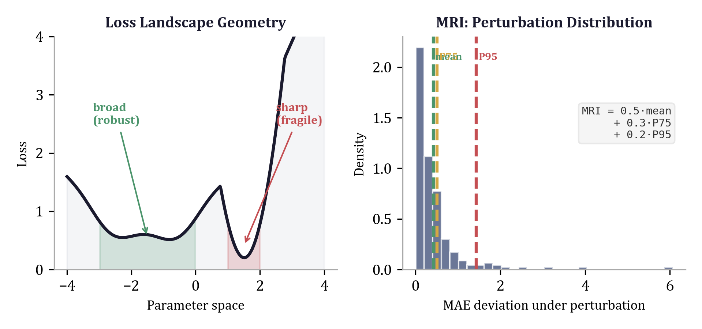

## 9.1 Why Robustness Matters Beyond Accuracy

### 9.1.1 The Sharp Minimum Problem

Consider a geometric model with $d$ parameters $\boldsymbol{\theta} = (\theta_1, \ldots, \theta_d)$ fitted by minimizing a loss function $\mathcal{L}(\boldsymbol{\theta})$. The fitted parameters $\boldsymbol{\theta}^*$ sit at (or near) a minimum of $\mathcal{L}$. But not all minima are created equal. The Hessian $\mathbf{H} = \nabla^2 \mathcal{L}(\boldsymbol{\theta}^*)$ characterizes the local curvature: large eigenvalues correspond to directions where the loss increases sharply; small eigenvalues correspond to directions where the loss is nearly flat.

A *sharp minimum* has large eigenvalues in many directions---the model's predictions are highly sensitive to parameter changes. A *broad minimum* has small eigenvalues---the model tolerates perturbation gracefully. Standard training procedures, including cross-validation, are blind to this distinction. They evaluate $\mathcal{L}(\boldsymbol{\theta}^*)$ at the minimum, not the shape of $\mathcal{L}$ in its neighborhood.

The practical consequences are immediate. In deployment, parameters may be:

- **Quantized** (reducing floating-point precision for efficiency), introducing rounding errors of magnitude $\epsilon_q \sim 10^{-4}$ to $10^{-2}$.
- **Estimated from noisy data**, carrying statistical uncertainty that propagates through the optimization.
- **Transferred across domains**, where the optimal parameters differ from those learned on the source distribution.
- **Approximated for speed**, as in pruning or distillation.

In all these scenarios, a model sitting in a sharp minimum will fail unpredictably, while a model in a broad minimum will degrade gracefully. Structural fuzzing gives you the tools to distinguish the two *before* deployment, not after.

### 9.1.2 The Limitations of Standard Deviation

The obvious approach to quantifying sensitivity is to perturb the parameters, measure the resulting errors, and report the standard deviation. This is better than nothing, but it has a fundamental limitation: standard deviation treats all deviations symmetrically. A perturbation that improves the model by 2.0 and one that degrades it by 2.0 contribute equally to the standard deviation. But from a risk perspective, they are not equivalent. The improvement is pleasant; the degradation may be catastrophic.

Worse, standard deviation is dominated by the bulk of the distribution. If 95% of perturbations produce small deviations and 5% produce enormous ones, the standard deviation will look moderate---reassuringly so---while the model harbors dangerous failure modes in its tail. What we need is a summary statistic that is *explicitly sensitive to tail behavior*: one that asks not just "how much do perturbations affect the model on average?" but "how bad can it get?"

This is precisely what the Model Robustness Index provides.

---

## 9.2 The Model Robustness Index (MRI)

The MRI is the core scalar summary of a model's robustness under parameter perturbation. Its design reflects two principles: perturbations should be multiplicative (not additive), and the index should weight tail behavior explicitly.

### 9.2.1 The Perturbation Model

Given a baseline parameter vector $\boldsymbol{\theta} \in \mathbb{R}^d$, we generate perturbed versions by multiplying each parameter by an independent log-normal factor:

$$\theta_i^{(\text{pert})} = \theta_i \cdot \exp(\epsilon_i), \quad \epsilon_i \sim \mathcal{N}(0, \sigma^2)$$

where $\sigma$ (the `scale` parameter, default 0.5) controls the perturbation magnitude. The perturbed values are clamped to $[0.001, 10^6]$ to prevent numerical pathologies.

The choice of multiplicative perturbation is not arbitrary. Additive perturbation treats a parameter with value 0.01 and a parameter with value 1000 identically---both receive noise of the same absolute magnitude. This makes no geometric sense. A perturbation of $\pm 1$ is catastrophic for the former and negligible for the latter. Multiplicative perturbation respects the natural scale of each parameter: the relative change $\theta_i^{(\text{pert})} / \theta_i = \exp(\epsilon_i)$ is independent of $\theta_i$. In the language of differential geometry, we are perturbing in the coordinate system of the positive reals, where the invariant metric is $ds = d\theta / \theta$---the log-space metric.

With $\sigma = 0.5$, a one-standard-deviation perturbation multiplies (or divides) each parameter by $e^{0.5} \approx 1.65$---a 65% relative change. This is large enough to explore beyond the immediate neighborhood of $\boldsymbol{\theta}^*$ but small enough that many perturbations remain in a regime where the model still functions. The default has proven effective across a range of geometric models, but practitioners should report MRI values at multiple scales for thorough characterization.

The implementation in `compute_mri` makes this concrete:

```python
def compute_mri(
    params: np.ndarray,
    evaluate_fn: Callable[[np.ndarray], tuple[float, dict[str, float]]],
    n_perturbations: int = 300,
    scale: float = 0.5,
    weights: tuple[float, float, float] = (0.5, 0.3, 0.2),
    rng: np.random.Generator | None = None,
) -> ModelRobustnessIndex:
```

The `evaluate_fn` callback takes a parameter vector and returns a tuple of `(mae, per_target_errors)`. This abstraction decouples the robustness computation from any specific model---any system that maps parameters to predictions and predictions to errors can be tested.

For each of $N$ perturbation samples (default 300), the function generates a perturbed parameter vector, evaluates the model, and records the deviation from baseline:

```python
for _ in range(n_perturbations):
    noise = rng.normal(0.0, scale, size=params.shape)
    params_pert = params * np.exp(noise)
    params_pert = np.clip(params_pert, 0.001, 1e6)

    pert_mae, _ = evaluate_fn(params_pert)
    omega = abs(pert_mae - base_mae)
    omegas.append(omega)
```

Each $\omega_i = |\text{MAE}_{\text{perturbed}} - \text{MAE}_{\text{baseline}}|$ measures how much the $i$-th perturbation destabilized the model. The collection $\{\omega_1, \ldots, \omega_N\}$ is the empirical *perturbation sensitivity distribution*.

### 9.2.2 The MRI Formula

The MRI is a weighted combination of three statistics of the $\omega$ distribution:

$$\text{MRI} = w_0 \cdot \bar{\omega} + w_1 \cdot P_{75}(\omega) + w_2 \cdot P_{95}(\omega)$$

with default weights $(w_0, w_1, w_2) = (0.5, 0.3, 0.2)$. The implementation is direct:

```python
omegas_arr = np.array(omegas)
mean_omega = float(np.mean(omegas_arr))
p75_omega = float(np.percentile(omegas_arr, 75))
p95_omega = float(np.percentile(omegas_arr, 95))

mri_value = weights[0] * mean_omega + weights[1] * p75_omega + weights[2] * p95_omega
```

**Lower MRI indicates a more robust model.** An MRI of zero would mean that no perturbation changed the model's error at all---perfect robustness. The result is packaged in a dataclass that preserves the full decomposition:

```python
@dataclass
class ModelRobustnessIndex:
    mri: float
    mean_omega: float
    p75_omega: float
    p95_omega: float
    n_perturbations: int
    worst_case_mae: float
    perturbation_errors: list[float]
```

The `worst_case_mae` field tracks the single highest MAE observed across all perturbations---a useful diagnostic that the composite MRI intentionally softens. If `worst_case_mae` is dramatically higher than the baseline MAE, the model has at least one catastrophic failure mode, even if the composite MRI is moderate.

### 9.2.3 Why Weighted Tail Statistics Beat Standard Deviation

The three-component formula deserves careful justification. Why not simply report $\text{std}(\omega)$?

**The mean anchors the index to average behavior.** A model that is moderately fragile across the board will have a high $\bar{\omega}$. This captures the "typical" perturbation response.

**The 75th percentile captures systematic tail behavior.** If 25% of perturbations cause substantial degradation, $P_{75}$ will be elevated. This is the signature of a model where a subset of parameters (or parameter directions) is particularly sensitive---a common pattern when the loss landscape has a few steep directions and many flat ones.

**The 95th percentile captures near-worst-case behavior without being as volatile as the maximum.** The maximum of $N$ samples from a heavy-tailed distribution grows unboundedly with $N$; the 95th percentile converges. Using $P_{95}$ instead of $\max(\omega)$ makes the index stable across different values of $N$, which is essential for reproducibility.

**The weights sum to 1.0**, making the MRI interpretable on the same scale as the individual $\omega$ values. If the mean deviation is 0.8, the 75th percentile is 1.4, and the 95th percentile is 3.1, the MRI is:

$$\text{MRI} = 0.5 \times 0.8 + 0.3 \times 1.4 + 0.2 \times 3.1 = 0.40 + 0.42 + 0.62 = 1.44$$

The standard deviation of the same $\omega$ distribution might be 0.9---a number that conceals the heavy tail. The MRI reveals that while typical perturbations cause modest degradation ($\bar{\omega} = 0.8$), the worst 5% of perturbations cause error increases exceeding 3.1. This tail information is precisely what a deployment decision requires.

The formula can also be understood as an approximation to the Conditional Value at Risk (CVaR), a standard risk measure in financial mathematics. CVaR at level $\alpha$ is the expected loss in the worst $\alpha$-fraction of scenarios. The MRI's weighted combination of mean and tail percentiles roughly approximates a CVaR-weighted average, blending expected loss with conditional expectations in the upper tail. This connection to risk theory is not accidental: robustness testing *is* risk assessment, applied to computational models rather than financial portfolios.

### 9.2.4 Adjusting the Weights

The default weights $(0.5, 0.3, 0.2)$ balance average and tail behavior. They are appropriate for general-purpose assessment, but different applications may warrant different emphasis:

| Application | Suggested Weights | Rationale |
|---|---|---|
| Exploratory analysis | $(0.7, 0.2, 0.1)$ | Emphasize typical behavior |
| Production deployment | $(0.5, 0.3, 0.2)$ | Balance average and tail |
| Safety-critical systems | $(0.2, 0.3, 0.5)$ | Emphasize worst-case |
| Regulatory compliance | $(0.1, 0.2, 0.7)$ | Dominated by tail risk |

Because the `ModelRobustnessIndex` dataclass returns all three components alongside the composite score, users can always recompute the MRI with alternative weights without rerunning the perturbation experiment.

---

## 9.3 Sensitivity Profiling: Which Parameters Matter?

The MRI tells you *how robust* the model is globally. Sensitivity profiling tells you *which parameters are responsible*. The method is ablation: for each dimension, set its value to an inactive sentinel and measure the resulting degradation.

### 9.3.1 The Ablation Protocol

For each dimension $i$, set $\theta_i$ to the sentinel value (by default, $10^6$---a value large enough to effectively remove the dimension's influence) and evaluate the model. The sensitivity delta is:

$$\Delta_i = \text{MAE}(\boldsymbol{\theta} \text{ with } \theta_i = \text{inactive}) - \text{MAE}(\boldsymbol{\theta})$$

The implementation is concise:

```python
def sensitivity_profile(
    params: np.ndarray,
    dim_names: Sequence[str],
    evaluate_fn: Callable[[np.ndarray], tuple[float, dict[str, float]]],
    inactive_value: float = 1e6,
) -> list[SensitivityResult]:
```

The function iterates over all dimensions, ablates each in turn, and measures the change in MAE:

```python
base_mae, _ = evaluate_fn(params)

results: list[SensitivityResult] = []
for i, name in enumerate(dim_names):
    ablated = params.copy()
    ablated[i] = inactive_value
    ablated_mae, _ = evaluate_fn(ablated)
    delta = ablated_mae - base_mae
    results.append(
        SensitivityResult(
            dim=i,
            dim_name=name,
            mae_with=base_mae,
            mae_without=ablated_mae,
            delta_mae=delta,
            importance_rank=0,  # assigned below
        )
    )

results.sort(key=lambda r: r.delta_mae, reverse=True)
for rank, r in enumerate(results, 1):
    r.importance_rank = rank
```

Results are sorted by $\Delta$ in descending order and assigned importance ranks. Rank 1 is the most important dimension---the one whose ablation causes the largest increase in error.

### 9.3.2 Interpreting the Sensitivity Profile

A large positive $\Delta_i$ means that dimension $i$ is carrying significant predictive load: removing it substantially degrades the model. A near-zero $\Delta_i$ means the dimension contributes almost nothing---it is a candidate for removal (simplifying the model without meaningful accuracy loss, as the Pareto analysis of Chapter 8 would confirm).

A *negative* $\Delta_i$---where removing the dimension actually *improves* the model---is the most informative signal of all. It indicates that the parameter value for dimension $i$ has drifted to a harmful configuration, either through overfitting during optimization or through an interaction effect where the dimension's presence degrades other dimensions' contributions. Negative deltas warrant immediate investigation.

### 9.3.3 Relationship to the MRI

Sensitivity profiling and the MRI answer complementary questions. The MRI says: "the model is fragile." The sensitivity profile says: "*these* dimensions are responsible." Together, they provide both the diagnosis and the prescription:

1. Compute the MRI. If it is low, the model is robust and further investigation may not be needed.
2. If the MRI is high, run the sensitivity profile. The top-ranked dimensions are where fragility concentrates.
3. For the top-ranked dimensions, run adversarial threshold search (Section 9.4) to find the exact breaking points.

This three-stage workflow is exactly how `run_campaign` in the pipeline module orchestrates the analysis, as we will see in Section 9.5.

### 9.3.4 Limitations of One-at-a-Time Ablation

One-at-a-time ablation captures *marginal* importance: how much does each dimension contribute when all others are present? It does not capture *interaction effects*: the case where dimensions $i$ and $j$ are individually unimportant but jointly critical (their information is redundant, and either one alone suffices). The subset enumeration of Chapter 4 and the compositional testing of Section 9.5 address this limitation by exploring multi-dimensional combinations. Sensitivity profiling is a fast screening step, not a complete analysis.

---

## 9.4 Adversarial Threshold Search: Finding the Tipping Points

While the MRI provides a global robustness summary and sensitivity profiling identifies the most important dimensions, adversarial threshold search finds the *exact* perturbation magnitudes where the model transitions from "working" to "broken." These are tipping points---the values where qualitative failure begins---and they are precisely the values that neither cross-validation nor global robustness summaries can reveal.

### 9.4.1 The Search Algorithm

For each dimension $i$ and each direction (increase and decrease), the algorithm performs a log-spaced search from the baseline value outward:

- **Increase direction:** search from $\theta_i$ to $\theta_i \times 1000$
- **Decrease direction:** search from $\theta_i$ to $\max(\theta_i / 1000, 10^{-6})$

At each step, the algorithm evaluates the model with the perturbed parameter and checks whether any prediction target's error has changed by more than the specified tolerance $\tau$.

```python
def find_adversarial_threshold(
    params: np.ndarray,
    dim: int,
    dim_names: Sequence[str],
    evaluate_fn: Callable[[np.ndarray], tuple[float, dict[str, float]]],
    tolerance: float = 0.5,
    n_steps: int = 50,
) -> list[AdversarialResult]:
```

The search uses `np.logspace` to generate test values, ensuring uniformity in log-space---consistent with the multiplicative perturbation philosophy of the MRI:

```python
for direction in ("increase", "decrease"):
    if direction == "increase":
        search_values = np.logspace(
            np.log10(base_value),
            np.log10(base_value * 1000),
            n_steps,
        )
    else:
        low = max(base_value / 1000, 1e-6)
        search_values = np.logspace(
            np.log10(base_value),
            np.log10(low),
            n_steps,
        )

    for test_value in search_values[1:]:  # skip the first (baseline)
        perturbed = params.copy()
        perturbed[dim] = test_value
        _, pert_errors = evaluate_fn(perturbed)

        for target_name in base_errors:
            if target_name in pert_errors:
                delta = abs(pert_errors[target_name] - base_errors[target_name])
                if delta > tolerance:
                    ratio = test_value / base_value
                    results.append(
                        AdversarialResult(
                            dim=dim,
                            dim_name=dim_names[dim],
                            base_value=base_value,
                            threshold_value=test_value,
                            threshold_ratio=ratio,
                            target_flipped=target_name,
                            direction=direction,
                        )
                    )
                    break
```

The `for/else/continue/break` pattern in the full implementation deserves a note: the inner `break` exits the target loop when a threshold is found, and the outer `break` (after the `else: continue`) exits the search-values loop to move to the next direction. This ensures we find the *first* threshold in each direction---the tipping point closest to the baseline.

### 9.4.2 The Threshold Ratio

Each `AdversarialResult` records the `threshold_ratio`: the multiplicative factor by which the parameter had to change before a target broke. This is the most immediately interpretable quantity:

- A ratio of **1.5** means the parameter only needed to increase by 50% before a target exceeded tolerance. The model is fragile along this dimension.
- A ratio of **200** means the parameter had to be multiplied by 200 before anything broke. The model is resilient along this dimension.
- A ratio of **0.1** (in the decrease direction) means the parameter had to be reduced to 10% of its baseline value before failure. The model tolerates substantial downward perturbation.

Parameters with low threshold ratios in either direction are the ones that demand the most careful estimation, the tightest confidence intervals, and the most conservative deployment practices. Parameters with high threshold ratios can tolerate rough approximation.

### 9.4.3 Per-Target Sensitivity

The `target_flipped` field in the result reveals *which specific prediction target* was the first to exceed tolerance. This often exposes unexpected couplings. A parameter that nominally controls one aspect of the model may turn out to critically affect a seemingly unrelated prediction. These cross-dimension dependencies are exactly the coupling effects that one-output-at-a-time analysis tends to miss, and they are among the most valuable findings adversarial threshold search can produce.

### 9.4.4 Choosing the Tolerance

The `tolerance` parameter defines the boundary between "acceptable" and "broken." This is inherently application-specific:

- For a model predicting physical measurements, tolerance might correspond to the instrument's measurement uncertainty.
- For a classification system, it might be the minimum confidence margin for a correct decision.
- For the defect prediction example from Chapter 1, it might be the maximum acceptable change in per-module error before the model's predictions are no longer actionable.

Setting tolerance too low produces false positives (thresholds that flag inconsequential changes); setting it too high misses genuine failure modes. A disciplined approach is to derive tolerance from the application's error budget or from domain-specific standards.

### 9.4.5 Computational Cost

Adversarial threshold search evaluates the model $2 \times n\_steps \times d$ times in the worst case (two directions per dimension, $n\_steps$ search values per direction, $d$ dimensions). With the default $n\_steps = 50$ and a 5-dimensional model, this is 500 evaluations. For expensive models, this can be reduced by:

1. Searching only the top-$k$ dimensions identified by sensitivity profiling (Section 9.3), rather than all $d$ dimensions.
2. Reducing $n\_steps$ at the cost of coarser threshold estimates.
3. Using a two-phase approach: a coarse scan to bracket the threshold, followed by a fine scan to refine it.

---

## 9.5 The Pipeline: Composing the Three Tools

The MRI, sensitivity profiling, and adversarial threshold search are designed to compose into a unified campaign. The `run_campaign` function in the pipeline module orchestrates this composition, executing the tools in the correct order and threading the results of earlier stages into later ones.

### 9.5.1 Campaign Architecture

The campaign proceeds in six stages. Stages 3 through 5 are the robustness tools developed in this chapter:

```python
def run_campaign(
    dim_names: Sequence[str],
    evaluate_fn: Callable[[np.ndarray], tuple[float, dict[str, float]]],
    max_subset_dims: int = 4,
    n_mri_perturbations: int = 300,
    mri_scale: float = 0.5,
    mri_weights: tuple[float, float, float] = (0.5, 0.3, 0.2),
    ...
) -> StructuralFuzzReport:
```

The stages are:

1. **Subset enumeration** (Chapter 11): Test all dimension combinations up to a maximum size.
2. **Pareto frontier** (Chapter 8): Extract the non-dominated configurations from the enumeration results.
3. **Sensitivity profiling** (this chapter): Ablate each dimension from the best configuration to rank importance.
4. **MRI computation** (this chapter): Perturb the best configuration to quantify global robustness.
5. **Adversarial threshold search** (this chapter): Find the tipping points for every dimension.
6. **Compositional testing**: Verify that dimensions compose well when added incrementally.

The key design decision is that stages 3--5 operate on the *best configuration found by the enumeration*. This means the robustness analysis characterizes the model at its optimal operating point---the configuration a practitioner would actually deploy. The pipeline extracts the best parameters and passes them to each robustness tool:

```python
if subset_results:
    best_params = subset_results[0].param_values
else:
    best_params = np.ones(n_dims)

sensitivity_results = sensitivity_profile(
    params=best_params,
    dim_names=dim_names_list,
    evaluate_fn=evaluate_fn,
    inactive_value=inactive_value,
)

mri_result = compute_mri(
    params=best_params,
    evaluate_fn=evaluate_fn,
    n_perturbations=n_mri_perturbations,
    scale=mri_scale,
    weights=mri_weights,
)

adversarial_results: list[AdversarialResult] = []
for i in range(n_dims):
    adv = find_adversarial_threshold(
        params=best_params,
        dim=i,
        dim_names=dim_names_list,
        evaluate_fn=evaluate_fn,
        tolerance=adversarial_tolerance,
    )
    adversarial_results.extend(adv)
```

### 9.5.2 The Campaign Report

All results are collected into a `StructuralFuzzReport` dataclass:

```python
@dataclass
class StructuralFuzzReport:
    dim_names: list[str]
    subset_results: list[SubsetResult]
    pareto_results: list[SubsetResult]
    sensitivity_results: list[SensitivityResult]
    mri_result: ModelRobustnessIndex | None
    adversarial_results: list[AdversarialResult]
    composition_result: CompositionResult | None
    forward_results: list[SubsetResult] = field(default_factory=list)
    backward_results: list[SubsetResult] = field(default_factory=list)
```

The report is a complete, machine-readable artifact that captures every aspect of the structural fuzzing campaign. Its `summary()` method generates a human-readable text report. But the real value is in the structured data: downstream analysis can query the report programmatically, computing derived quantities (e.g., the ratio of adversarial threshold to MRI, or the correlation between sensitivity rank and threshold ratio) without re-running the campaign.

### 9.5.3 Robustness Testing the Pareto Frontier

A natural extension---not yet automated in the pipeline but straightforward to implement---is to compute the MRI for every Pareto-optimal configuration, not just the best one. This answers a question that Chapter 8's Pareto analysis alone cannot: among the non-dominated tradeoffs between accuracy and complexity, *which are the most robust?*

It is entirely possible (and in practice common) that the Pareto-optimal configuration with the lowest MAE is also the most fragile. A 3-dimension configuration at MAE 1.7 might have MRI 0.3, while the 5-dimension configuration at MAE 1.5 has MRI 1.8. The 0.2 improvement in MAE comes at the cost of a 6x increase in fragility. A practitioner who saw only the Pareto frontier would choose the 5-dimension model; a practitioner who also saw the MRI values would think twice.

---

## 9.6 The Defect Prediction Example, Revisited

Chapter 1 introduced a software defect prediction model with five feature groups (Size, Complexity, Halstead, Object-Orientation, Process) and walked through the geometric analysis at a high level. We now return to this example with the full machinery of this chapter, showing what the MRI, sensitivity profile, and adversarial threshold search reveal in concrete detail.

### 9.6.1 Sensitivity Profile

The sensitivity profile, computed by ablating each of the five dimensions from the best configuration, might produce results like:

| Rank | Dimension | $\Delta$ MAE | MAE without |
|:---:|---|:---:|:---:|
| 1 | Complexity | +1.9 | 3.6 |
| 2 | Process | +1.2 | 2.9 |
| 3 | Size | +0.6 | 2.3 |
| 4 | OO | +0.15 | 1.85 |
| 5 | Halstead | +0.08 | 1.78 |

The model depends overwhelmingly on Complexity and Process. Size contributes modestly. OO and Halstead are nearly redundant---removing either barely changes the model's error. This confirms the intuition from Chapter 1's Pareto analysis, where the {Complexity, Process} two-dimensional subset achieved MAE 2.1, capturing most of the accuracy of the full five-dimensional model at MAE 1.7.

But sensitivity profiling adds something the Pareto analysis could not: it tells us that the *specific parameter values* for OO and Halstead in the best configuration contribute almost nothing. This is stronger than saying the dimensions are unnecessary in principle (which is what Pareto analysis shows). It says they are unnecessary *at their current fitted values*, which has direct implications for model simplification and maintenance.

### 9.6.2 MRI Computation

Running `compute_mri` with 300 perturbations at scale 0.5 on the best configuration produces a perturbation sensitivity distribution. Consider the following hypothetical results:

| Statistic | Value |
|:---:|:---:|
| Mean $\bar{\omega}$ | 0.8 |
| 75th percentile $P_{75}$ | 1.4 |
| 95th percentile $P_{95}$ | 3.1 |
| **MRI** | **1.44** |
| Worst-case MAE | 5.2 |

The standard deviation of the $\omega$ distribution might be 0.9. A naive report would say "the model's sensitivity has standard deviation 0.9"---a number that sounds modest. The MRI of 1.44 tells a more complete story: the typical perturbation causes moderate degradation, but the 95th percentile deviation is 3.1, meaning that 5% of perturbations nearly *double* the model's error (from baseline 1.7 to approximately 4.8).

The worst-case MAE of 5.2 indicates that at least one perturbation tripled the error. This single data point is too volatile to build an index around (it would change dramatically with different random seeds), but it is a useful flag: somewhere in the parameter neighborhood, there exists a configuration that catastrophically degrades the model.

### 9.6.3 Adversarial Threshold Search

Running adversarial threshold search with tolerance 0.5 on each of the five dimensions produces results like:

| Dimension | Direction | Threshold Ratio | Target Flipped |
|---|---|:---:|---|
| Complexity | decrease | 0.30 | high-complexity modules |
| Process | increase | 4.2 | high-churn modules |
| Process | decrease | 0.12 | legacy modules |
| Size | decrease | 0.08 | small modules |

Several findings stand out:

1. **Complexity has a tipping point at 0.30x** its baseline value in the decrease direction. Reducing the Complexity parameter below 30% of its fitted value causes the model's error on high-complexity modules to exceed tolerance. This is the most dangerous finding: a refactoring initiative that reduces code complexity across the codebase could push the model past this threshold, silently degrading predictions on precisely the modules that refactoring aims to improve.

2. **Process is sensitive in both directions.** Increasing the Process parameter by 4.2x breaks predictions for high-churn modules; decreasing it to 12% of baseline breaks predictions for legacy modules. The model's handling of Process is well-calibrated at its current value but fragile on both sides.

3. **No threshold was found for OO or Halstead** in either direction across the full three-orders-of-magnitude search range. These dimensions are not only unimportant (as sensitivity profiling showed) but also non-fragile: the model is indifferent to their values. This is consistent with their low sensitivity ranks and further supports removing them from the model.

4. **The targets that flip are dimension-specific.** Complexity perturbation affects high-complexity modules; Process perturbation affects high-churn and legacy modules. The adversarial search has revealed the *coupling structure* between parameters and prediction targets---information that global metrics like the MRI cannot provide.

### 9.6.4 Synthesis

Combining all three tools, the defect prediction model's robustness profile is:

- **Global robustness (MRI = 1.44):** Moderately fragile. The model is not catastrophically sensitive, but 5% of perturbations produce substantial degradation.
- **Fragility concentrates in Complexity and Process.** These two dimensions carry 75% of the predictive load and harbor all identified tipping points.
- **Complexity has a critical threshold at 0.30x baseline.** This is the model's most dangerous vulnerability: a specific, plausible shift in the data distribution (reduced code complexity due to refactoring) could push the model past this threshold.
- **OO and Halstead are safe to remove.** They contribute almost nothing and have no adversarial thresholds---removing them simplifies the model without sacrificing accuracy or robustness.

None of these findings are available from accuracy, precision, recall, or F1. They required treating the model's behavior as a geometric object---a point in a multi-dimensional parameter space---and systematically probing the shape of the loss landscape around that point.

---

## 9.7 The Geometry of Robustness

### 9.7.1 Robustness as a Property of the Loss Landscape

The MRI can be connected to the local geometry of the loss landscape through the Hessian. For a quadratic loss surface near the minimum:

$$\mathcal{L}(\boldsymbol{\theta}^* + \boldsymbol{\delta}) \approx \mathcal{L}(\boldsymbol{\theta}^*) + \frac{1}{2} \boldsymbol{\delta}^\top \mathbf{H} \boldsymbol{\delta}$$

the expected squared deviation under Gaussian perturbation $\boldsymbol{\delta} \sim \mathcal{N}(0, \sigma^2 \mathbf{I})$ is:

$$\mathbb{E}[\omega^2] = \frac{\sigma^2}{2} \text{tr}(\mathbf{H})$$

In this regime, the MRI is approximately proportional to $\sqrt{\text{tr}(\mathbf{H})}$---the square root of the sum of eigenvalues of the Hessian. Large eigenvalues (sharp directions in the loss landscape) contribute disproportionately to the MRI, which is exactly the behavior we want: the MRI should be elevated when the landscape has even one sharp direction, because that direction represents a vulnerability.

But the approximation breaks down when the loss surface is non-quadratic---when it has asymmetric curvature, flat plateaus that transition into cliffs, or multiple local minima in the perturbation neighborhood. In these cases, the MRI's empirical sampling approach captures behavior that the Hessian analysis misses. The Hessian is a local linear approximation; the MRI is a global (within the perturbation radius) nonlinear probe. Both are useful, but the MRI is more general.

### 9.7.2 Directional Robustness

The MRI as defined is *isotropic*: perturbations are drawn uniformly in all parameter directions. This is appropriate as a screening tool, but it can be refined. If the sensitivity profile identifies dimension $i$ as critical, one can compute a *directional MRI* by perturbing only dimension $i$ while holding all others fixed. The comparison between the global MRI and the directional MRI for dimension $i$ reveals how much of the model's total fragility is attributable to that single dimension.

More generally, one can compute MRI along any direction $\mathbf{v}$ in parameter space by restricting perturbations to the one-dimensional subspace spanned by $\mathbf{v}$:

$$\boldsymbol{\theta}^{(\text{pert})} = \boldsymbol{\theta}^* + \epsilon \cdot \mathbf{v}, \quad \epsilon \sim \mathcal{N}(0, \sigma^2)$$

The directional MRI profile---MRI as a function of direction---is a scalar field on the unit sphere $S^{d-1}$ in parameter space. Its maxima correspond to the directions of greatest fragility; its minima correspond to the directions of greatest robustness. This is the "robustness sphere" that generalizes the scalar MRI to a full directional characterization.

### 9.7.3 Robustness Under Non-Euclidean Perturbation

The log-space perturbation model (Section 9.2.1) implicitly uses a non-Euclidean metric on parameter space. In the positive orthant $\mathbb{R}_{>0}^d$, the log-space metric is:

$$d_{\log}(\boldsymbol{\theta}_1, \boldsymbol{\theta}_2) = \sqrt{\sum_{i=1}^d \left(\log \frac{\theta_{1,i}}{\theta_{2,i}}\right)^2}$$

This is the Euclidean distance in log-coordinates, but it is *not* Euclidean in the original coordinates. Perturbations that are uniformly distributed in log-space are *not* uniformly distributed in the original space---they are biased toward larger perturbations in the upward direction (multiplication) and smaller perturbations in the downward direction (division). This asymmetry reflects the natural geometry of positive parameters: doubling a parameter is as "far" as halving it, in the log-metric sense.

Chapter 10 will develop more sophisticated non-Euclidean perturbation strategies, using the manifold structure of specific parameter spaces to generate perturbations that respect the geometry of the problem. The log-space perturbation used here is a special case---but a broadly applicable one that works well for most geometric models.

---

## 9.8 Practical Considerations

### 9.8.1 Number of Perturbation Samples

The default of 300 perturbation samples provides reliable estimates of the mean and 75th percentile. The 95th percentile is estimated from approximately 15 samples in the upper tail ($300 \times 0.05 = 15$), which is adequate for detecting gross fragility but may be noisy for precise quantification. The following table provides guidance:

| Use Case | Recommended $N$ | P95 Tail Samples | Notes |
|---|---|---|---|
| Quick screening | 100 | 5 | Sufficient for gross fragility detection |
| Standard analysis | 300 | 15 | Default; adequate for most purposes |
| Publication quality | 1000 | 50 | Stable P95 estimates |
| Safety-critical | 5000+ | 250+ | Reliable extreme tail characterization |

Computational cost scales linearly with $N$, so the choice is a direct tradeoff between statistical precision and runtime.

### 9.8.2 Reproducibility

The `compute_mri` function accepts an optional `rng` parameter (a NumPy `Generator` instance) for reproducibility. When reproducibility matters---and it almost always does in scientific and engineering contexts---pass an explicit generator:

```python
rng = np.random.default_rng(42)
mri_result = compute_mri(params, evaluate_fn, rng=rng)
```

If no generator is provided, the function creates one with seed 42, ensuring that results are reproducible by default. This is a deliberate design choice: robustness analysis should produce the same results when run twice with the same inputs.

### 9.8.3 When to Run Each Tool

The three tools have different computational costs and answer different questions. The following decision tree guides their use:

1. **Always run the sensitivity profile first.** It requires only $d + 1$ model evaluations (one baseline plus one per dimension) and immediately identifies which dimensions matter. This is cheap and informative.

2. **Run the MRI if you need a global robustness score.** It requires $N + 1$ evaluations (one baseline plus $N$ perturbations). Use it to compare models, to monitor robustness over time, or to decide whether deeper investigation is warranted.

3. **Run adversarial threshold search for the top-$k$ dimensions.** It requires up to $2 \times n\_steps \times k$ evaluations. Focus on the dimensions ranked most important by sensitivity profiling---searching unimportant dimensions is unlikely to find interesting thresholds (and indeed, in the defect prediction example, the unimportant dimensions had no thresholds at all).

---

## 9.9 Connections to Related Work

### 9.9.1 Flatness and Generalization

The relationship between the sharpness of a loss minimum and generalization performance has been studied extensively in the deep learning literature. Hochreiter and Schmidhuber (1997) observed that flat minima tend to generalize better than sharp ones. Keskar et al. (2017) showed that large-batch training tends to converge to sharp minima with poor generalization. The MRI provides a practical, model-agnostic tool for measuring this property---without requiring access to the training procedure or the loss function's analytical form.

### 9.9.2 Bayesian Model Comparison

The Bayesian evidence (marginal likelihood) naturally penalizes models with sharp posterior peaks, because it integrates the likelihood over the entire parameter space. A model with a sharp peak must have its probability mass concentrated in a small region, which the prior penalizes. The MRI can be viewed as a frequentist complement to the Bayesian evidence: instead of integrating the likelihood, it samples the neighborhood of the MAP estimate and summarizes the distribution of deviations. The MRI is easier to compute (it requires no prior specification and no integration) and directly measures the quantity of practical interest (sensitivity to parameter perturbation).

### 9.9.3 Adversarial Machine Learning

The adversarial threshold search shares its philosophy with adversarial example generation in deep learning (Goodfellow et al., 2014; Carlini and Wagner, 2017), but operates in parameter space rather than input space. Input-space adversarial examples find the smallest perturbation to an *input* that changes the *output*. Parameter-space adversarial thresholds find the smallest perturbation to a *parameter* that changes the *output beyond tolerance*. The geometric intuition is the same---finding the nearest decision boundary---but the space being searched and the practical implications are different.

---

## 9.10 What Comes Next

This chapter has developed tools for characterizing the robustness of a model at a single operating point---the best configuration found by optimization. Chapter 10 extends this analysis in two directions. First, it introduces *adversarial probing*: systematic exploration of the full parameter space to find not just tipping points along individual dimensions but adversarial *regions*---connected subsets of parameter space where the model fails. This requires the topological tools (persistent homology) developed in Chapter 5, because the shape of an adversarial region---whether it is a thin sliver or a broad basin, whether it is simply connected or has holes---determines the practical risk it poses. Second, Chapter 10 develops methods for *hardening* a model against the vulnerabilities that the MRI and adversarial threshold search reveal, closing the loop from diagnosis to treatment.

The progression from Chapter 8 to Chapter 10 mirrors the progression from a static to a dynamic understanding of the model. Chapter 8 asks: "Which configurations are optimal?" This chapter asks: "How fragile are those optima?" Chapter 10 will ask: "What does the failure landscape look like, and can we reshape it?"

---

### Exercises

**9.1.** Implement a variant of `compute_mri` that perturbs only one parameter at a time (holding all others at their baseline values) and returns a per-parameter MRI. Compare the sum of per-parameter MRIs to the global MRI for the defect prediction model. What does the discrepancy tell you about parameter interactions?

**9.2.** The adversarial threshold search uses a log-spaced linear scan with 50 steps per direction. Implement a two-phase variant that uses 10 coarse steps to bracket the threshold, then 40 fine steps within the bracket to refine it. Under what conditions does this outperform the uniform scan?

**9.3.** Derive the relationship between the MRI and the eigenvalues of the Hessian $\nabla^2 \mathcal{L}(\boldsymbol{\theta}^*)$ for a quadratic loss surface. Show that $\mathbb{E}[\text{MRI}] \propto \sqrt{\text{tr}(\mathbf{H})}$ and identify the proportionality constant as a function of $\sigma$ and the MRI weights.

**9.4.** Run the sensitivity profile on the defect prediction model with three different inactive values: $10^3$, $10^6$, and $10^9$. Does the importance ranking change? For what types of models would you expect the ranking to be sensitive to the choice of inactive value?

**9.5.** The MRI weights $(0.5, 0.3, 0.2)$ can be interpreted as an approximation to CVaR. Derive the exact CVaR at level $\alpha = 0.05$ from the empirical $\omega$ distribution and compare it to the MRI. Under what distribution shapes do the two diverge most?

**9.6.** Extend the `run_campaign` function to compute the MRI for every Pareto-optimal configuration (not just the best one). Plot the Pareto frontier in three dimensions: (dimensionality, MAE, MRI). Describe the tradeoff surface. Is there a Pareto frontier in this three-objective space, and if so, how does it differ from the two-objective frontier of Chapter 8?


\newpage

# Chapter 10: Adversarial Probing

> *"The best way to understand a system is to try to break it---and then listen carefully to the sound it makes."*
> --- Attributed to Richard Hamming

The Model Robustness Index developed in Chapter 9 answers a critical question: *how stable is this configuration under random perturbation?* But random perturbation is blunt. It tells you that a model is fragile without telling you *why*, and it tells you that a model is robust without telling you *to what*. This chapter sharpens the MRI into a family of directed probing tools that interrogate model internals with the precision of a radar system. Where Chapter 9 threw noise at a model and measured the aggregate response, this chapter sends *specific, controlled signals* and reads the reflections.

We develop this idea into three concrete tools: the StructureProbe scanner (Section 10.3), parametric intensity sweeps (Section 10.4), and compositional interaction testing (Section 10.5). Section 10.6 then shows how the same mathematical framework extends from parameter-space fuzzing to signal-space fuzzing through the Decoder Robustness Index (DRI), applying MRI principles to acoustic decoders where semantic distance replaces raw error.

---

## 10.1 The Radar Analogy

### 10.1.1 From Physical Radar to Computational Probing

A radar transmitter emits a pulse of known shape $s(t)$. The environment reflects it, and the receiver records $r(t)$. The object of interest is the *transfer function* $H$ such that $r = H(s)$. By sweeping the frequency of $s$ and recording the response, the radar constructs a spectral signature of the target.

Adversarial probing replaces the electromagnetic pulse with a parametric perturbation and the physical environment with a computational model. The perturbation transform $T_\alpha$ takes an input and returns a modified version at intensity $\alpha \in [0, 1]$. The *probing displacement* is:

$$\delta(\alpha) = d\bigl(M(x),\; M(T_\alpha(x))\bigr)$$

where $d$ is an appropriate distance function---$L^2$ norm in representation space, MAE in prediction space, or semantic distance in classification space. The function $\delta : [0, 1] \to \mathbb{R}_{\geq 0}$ is the *intensity-response curve*, and its shape encodes the model's structural relationship to the perturbation.

### 10.1.2 Reading the Reflection Profile

Three canonical profiles emerge across domains:

**Flat profile** ($\delta(\alpha) \approx 0$ for all $\alpha$). The model is invariant to the perturbation. Desirable for structural invariants; alarming for stress transforms (the model is not reading the content being destroyed).

**Threshold profile** ($\delta(\alpha) \approx 0$ for $\alpha < \alpha^*$, then sharp rise). The model tolerates perturbation up to a critical intensity $\alpha^*$---the *adversarial threshold*. Binary search finds $\alpha^*$ efficiently.

**Linear profile** ($\delta(\alpha) \approx k\alpha$). Proportional degradation with no hidden tipping points---the most benign failure mode.

### 10.1.3 Invariance and Sensitivity as Structural Signatures

Transforms divide into *invariant* (semantics-preserving) and *stress* (semantics-destroying), a domain-dependent classification:

In parameter-space fuzzing (Chapter 9):

- **Invariant perturbations** are small multiplicative shifts. A model robust to 10% parameter variation occupies a broad minimum---desirable for deployment.
- **Stress perturbations** are large directional shifts or dimension ablations. A model that does not respond when an entire feature group is deactivated has not learned to use that group.

In acoustic decoder testing (Section 10.5):

- **Invariant transforms** include amplitude scaling and circular time shifts. A correct decoder should recognize the same coda regardless of recording volume or temporal alignment.
- **Stress transforms** include Doppler shift, multipath echo, and click dropout. These degrade the signal in ways that may legitimately change the decoder's output.

The *sensitivity gap*---the ratio of mean displacement under stress transforms to mean displacement under invariant transforms---is a single scalar that captures how well the model separates structural content from surface variation. A large gap indicates a model that has learned the domain's meaningful invariances; a small gap indicates a model that confuses structure with surface.

---

## 10.2 Parametric Transforms: The Intensity-Zero Identity

### 10.2.1 The Design Principle

Every parametric transform must satisfy one non-negotiable property:

> **Intensity-zero identity.** For all inputs $x$: $T(x, 0) = x$. At zero intensity, the transform is the identity.

This guarantees $\delta(0) = 0$, providing a calibrated baseline. The `AcousticTransform` class encapsulates this:

```python
@dataclass
class AcousticTransform:
    """Parametric transform with controllable intensity."""
    name: str
    fn: Callable[[np.ndarray, int, float], np.ndarray]
    intensity_range: tuple[float, float] = (0.0, 1.0)
    is_invariant: bool = True

    def __call__(self, signal, sr=32000, intensity=1.0):
        clamped = max(self.intensity_range[0],
                      min(self.intensity_range[1], intensity))
        return self.fn(signal, sr, clamped)

    def at_intensity(self, intensity):
        """Return a fixed-intensity closure for composition."""
        return lambda signal, sr: self(signal, sr, intensity)
```

The `at_intensity` method returns a closure with fixed perturbation strength, enabling composition into chains (Section 10.5) or integration with higher-order functions.

### 10.2.2 Intensity Sweeps

The most informative single measurement is the *intensity sweep*: evaluating the model's response at uniformly spaced levels from 0 to 1:

```python
def intensity_sweep(self, decoder, signals, sr, transform, n_points=10):
    """Sweep intensity from 0 to 1, recording mean omega at each level."""
    curve = []
    for intensity in np.linspace(0, 1, n_points):
        result = self.measure_single_transform(
            decoder, signals, sr, transform, float(intensity)
        )
        curve.append((float(intensity), result.mean_omega))
    return curve
```

Plotting all transform sweeps on a single figure produces the model's *sensitivity fingerprint*---a visual summary revealing which transforms the model tolerates, which it resists, and at what intensities transitions occur.

### 10.2.3 Adversarial Threshold Search

Where the sweep gives a coarse picture, binary search finds the exact threshold:

```python
def find_adversarial_threshold(self, decoder, signal, sr, transform,
                                tolerance=0.01):
    """Binary search for minimal intensity that flips the output."""
    baseline = decoder.classify(signal, sr)

    def causes_flip(intensity):
        transformed = transform(signal, sr, intensity)
        return decoder.classify(transformed, sr).strip().lower() \
               != baseline.strip().lower()

    if not causes_flip(1.0):
        return 1.0

    low, high = 0.0, 1.0
    while high - low > tolerance:
        mid = (low + high) / 2
        if causes_flip(mid):
            high = mid
        else:
            low = mid
    return high
```

A threshold of 0.95 means near-total robustness; 0.05 means the faintest perturbation flips the answer. The algorithm is identical to Chapter 9's parameter-space adversarial search---binary search on a monotone predicate finds the transition in $O(\log(1/\epsilon))$ evaluations regardless of domain.

---

## 10.3 StructureProbe: The Probe Response Matrix

### 10.3.1 The Measurement Protocol

Given a model $M$, an input corpus $\{x_1, \ldots, x_N\}$, and $K$ parametric transforms, the StructureProbe scanner constructs a $K \times J$ *probe response matrix* where entry $(k, j)$ is the mean displacement when transform $T_k$ is applied at intensity $\alpha_j$:

$$\bar{\delta}_{kj} = \frac{1}{N} \sum_{i=1}^{N} d\bigl(M(x_i),\; M(T_k(x_i, \alpha_j))\bigr)$$

Each row is an intensity-response curve. Each column is a cross-transform sensitivity snapshot.

### 10.3.2 From Ablation to Graded Perturbation

Chapter 9's sensitivity profile ablates each dimension (on/off). The probe response matrix generalizes this to *graded* perturbation. For dimension $i$ with baseline value $\theta_i$, define:

$$T_i(\theta, \alpha) = \theta \text{ with } \theta_i \leftarrow \theta_i \cdot e^{\alpha \cdot \sigma}$$

The intensity-response curve $\delta_i(\alpha) = |\text{MAE}(T_i(\theta, \alpha)) - \text{MAE}(\theta)|$ traces how error evolves as dimension $i$ is progressively perturbed:

```python
def probe_response_matrix(params, dim_names, evaluate_fn,
                          n_intensities=11, scale=2.0):
    """Compute (n_dims, n_intensities) displacement matrix."""
    intensities = np.linspace(0, 1, n_intensities)
    matrix = np.zeros((len(dim_names), n_intensities))
    base_mae, _ = evaluate_fn(params)

    for i in range(len(dim_names)):
        for j, alpha in enumerate(intensities):
            perturbed = params.copy()
            perturbed[i] = params[i] * np.exp(alpha * scale)
            perturbed[i] = np.clip(perturbed[i], 0.001, 1e6)
            pert_mae, _ = evaluate_fn(perturbed)
            matrix[i, j] = abs(pert_mae - base_mae)
    return matrix
```

### 10.3.3 Topological Analysis of Probe Surfaces

When the probe response matrix is analyzed with persistent homology (Chapter 5), additional structure emerges. Treating the matrix as a height function on a grid, the Vietoris-Rips complex reveals connected components (clusters of transforms with similar profiles) and loops (closed sensitivity circuits suggesting redundancy in the transform library). This connection---TDA applied to the outputs of adversarial probing---is a key integrative theme: geometric tools analyzing the results of other geometric tools.

---

## 10.4 Compositional Testing: Probing Dimension Interactions

### 10.4.1 Beyond Single-Dimension Probing

The probe response matrix perturbs one dimension at a time, revealing *marginal* sensitivity but missing *interactions*. Two dimensions might individually show low sensitivity but produce catastrophic failure when perturbed simultaneously---the parameter-space analogue of drug interactions in pharmacology.

Exhaustive pairwise probing (testing all $\binom{n}{2}$ dimension pairs at multiple intensities) is feasible for small $n$ but scales quadratically. For larger problems, the compositional testing framework provides a structured alternative that reveals the most important interactions without exhaustive search.

### 10.4.2 Greedy Dimension-Building Sequences

The `compositional_test` function builds dimension subsets incrementally, revealing interactions:

```python
from structural_fuzzing.compositional import compositional_test

result = compositional_test(
    start_dim=0,
    candidate_dims=[1, 2, 3, 4],
    dim_names=["Size", "Complexity", "Halstead", "OO", "Process"],
    evaluate_fn=evaluate_fn,
    n_grid=20,
    n_random=5000,
)

for i, (name, mae) in enumerate(
    zip(result.order_names, result.mae_sequence)
):
    print(f"Step {i}: add '{name}' -> MAE = {mae:.4f}")
```

At each step, the algorithm tries adding each remaining dimension, re-optimizes all parameters, and selects the dimension producing the greatest MAE reduction. The *interaction signature* is encoded in the step-to-step MAE differences. If $\text{MAE}_k - \text{MAE}_{k+1}$ exceeds the marginal sensitivity of $d_{k+1}$ alone, there is a positive interaction. If it falls below, there is redundancy.

The trajectory's shape is diagnostic: steep initial descent means a few key dimensions dominate; gradual uniform descent means all dimensions contribute equally; plateau-then-drop indicates synergistic interactions detectable only through combinatorial probing.

### 10.4.3 Transform Chains in Signal Space

The compositional principle extends to signal space through *transform chains*:

```python
class TransformChain:
    """Compose transforms for compound distortion testing."""
    def __init__(self, transforms: list[tuple[AcousticTransform, float]]):
        self.transforms = transforms
        self.name = " -> ".join(
            f"{t.name}@{i:.1f}" for t, i in transforms
        )

    def __call__(self, signal, sr=32000):
        result = signal.copy()
        for transform, intensity in self.transforms:
            result = transform(result, sr, intensity)
        return result
```

A chain like `noise@0.3 -> echo@0.6 -> doppler@0.4` applies three perturbations sequentially. Order matters: noise before echo gets echoed; noise after echo does not. The `TransformChain.generate_chains` factory produces diverse random chains:

```python
chains = TransformChain.generate_chains(
    transforms=transform_suite,
    max_length=3, intensities=[0.3, 0.6, 1.0],
    n_chains=50, seed=42,
)
```

A model that handles each individual transform at intensity 0.6 but fails under chains of length 2 at intensity 0.3 has a *superlinear interaction*---compound perturbation worse than the sum of its parts.

---

## 10.5 The Decoder Robustness Index: MRI for Signal Space

### 10.5.1 From Parameters to Signals

The DRI applies the MRI's mathematical structure to *input perturbation* rather than *parameter perturbation*. The formula carries over unchanged:

$$\text{DRI} = 0.5 \cdot \bar{\omega} + 0.3 \cdot P_{75}(\omega) + 0.2 \cdot P_{95}(\omega)$$

where each $\omega_i$ is now the displacement between baseline and perturbed predictions, and lower DRI indicates greater robustness.

### 10.5.2 Graduated Omega via Semantic Distance

The DRI's key innovation is *semantic distance* rather than binary match/mismatch. For a cetacean decoder classifying whale codas, misclassifying *rhythm* (fundamental structure) is worse than misclassifying *ornamentation* (fine detail):

```python
CODA_FEATURE_WEIGHTS = {
    "rhythm":        1.0,   # Fundamental timing pattern
    "tempo":         0.7,   # Overall speed
    "rubato":        0.4,   # Subtle timing variation
    "ornamentation": 0.2,   # Extra clicks, finest detail
}

class CodaSemanticDistance:
    """Semantic distance using coda feature hierarchy."""
    def __init__(self, feature_weights=None, coda_features=None):
        self.weights = feature_weights or CODA_FEATURE_WEIGHTS
        self.coda_features = coda_features or {}

    def distance(self, pred1, pred2):
        if pred1.strip().lower() == pred2.strip().lower():
            return 0.0
        feat1 = self.coda_features.get(pred1.strip())
        feat2 = self.coda_features.get(pred2.strip())
        if feat1 is not None and feat2 is not None:
            total_weight = sum(self.weights.values())
            mismatch_weight = sum(
                w for f, w in self.weights.items()
                if feat1.get(f) != feat2.get(f)
            )
            semantic_dist = mismatch_weight / total_weight
            return max(0.5, 0.5 + 0.5 * semantic_dist)
        return 0.75  # Fallback: binary mismatch
```

The hybrid formula---minimum 0.5 penalty for any flip, scaling to 1.0 for maximally different predictions---ensures the DRI never ignores a decision flip. An ornamentation change gets $\omega \approx 0.54$; a rhythm change gets $\omega \approx 0.93$. The graduated omega reflects the domain's feature hierarchy.

### 10.5.3 The Full DRI Pipeline

The `DecoderRobustnessIndex.measure` method orchestrates four phases---per-transform intensity sweeps, compositional chain testing, adversarial threshold search, and DRI computation---mirroring the structure of the `run_campaign` pipeline in the structural fuzzing framework:

```python
transforms = make_acoustic_transform_suite()
dri = DecoderRobustnessIndex(transforms)
result = dri.measure(decoder, signals, labels, sr=32000)
print(f"DRI: {result.dri:.4f}")
print(f"DRI (invariant): {result.dri_invariant:.4f}")
print(f"DRI (stress):    {result.dri_stress:.4f}")
```

The `DRIResult` provides three granularity levels:

1. **Scalar DRI.** A single number for cross-decoder comparison.
2. **DRI by category.** Separate values for invariant and stress transforms, revealing whether weaknesses lie in unlearned symmetries or over-sensitivity to legitimate distortion.
3. **Per-transform diagnostics.** Mean omega per transform, chain results, and adversarial thresholds---the full radar image.

### 10.5.4 The Acoustic Transform Suite

Nine transforms form the probing library, categorized by invariance expectation:

| Transform | Type | What It Tests |
|-----------|------|---------------|
| amplitude_scale | Invariant | Volume independence |
| time_shift | Invariant | Temporal alignment independence |
| additive_noise | Invariant | White noise tolerance |
| pink_noise | Invariant | Realistic ocean noise tolerance |
| doppler_shift | Stress | Frequency stability under motion |
| multipath_echo | Stress | Echo robustness |
| time_stretch | Stress | Tempo variation tolerance |
| spectral_mask | Stress | Bandwidth limitation robustness |
| click_dropout | Stress | Missing data robustness |

The `is_invariant` flag drives separate `dri_invariant` and `dri_stress` aggregation. A decoder with high `dri_invariant` has engineering defects. A decoder with high `dri_stress` may simply be doing its job---detecting genuine signal degradation.

---

## 10.6 Connection to the Structural Fuzzing Pipeline

### 10.6.1 The Six-Step Campaign

The structural fuzzing pipeline orchestrates all probing tools into a unified analysis:

```python
from structural_fuzzing.pipeline import run_campaign

report = run_campaign(
    dim_names=["Size", "Complexity", "Halstead", "OO", "Process"],
    evaluate_fn=evaluate_fn,
    max_subset_dims=4,
    n_mri_perturbations=300,
    adversarial_tolerance=0.5,
)
```

| Stage | Tool | Chapter | Question |
|-------|------|---------|----------|
| 1 | Subset enumeration | 4 | Which dimension combinations matter? |
| 2 | Pareto frontier | 5 | Which configurations are non-dominated? |
| 3 | Sensitivity profiling | 10 | Which dimensions drive predictions? |
| 4 | Model Robustness Index | 9 | How stable is the best configuration? |
| 5 | Adversarial thresholds | 10 | Where does each dimension break? |
| 6 | Compositional testing | 10 | How do dimensions interact? |

### 10.6.2 The Report as a Geometric Object

The `StructuralFuzzReport` returned by `run_campaign` is itself a geometric object. Its fields encode: a set of *points* in the (dimensions, MAE) plane (subset results), a *frontier* in this plane (Pareto-optimal configurations), a *vector* of importances (sensitivity profile), a *scalar* with supporting distribution (the MRI and its omega distribution), a set of *boundaries* in parameter space (adversarial thresholds), and a *path* through subset space (the compositional building sequence). Taken together, these define the geometric structure of the model's configuration space as explored by the probing campaign.

### 10.6.3 Portability of the Framework

The MRI/DRI mathematical structure is domain-agnostic. The specific transforms change, but the measurement protocol, aggregation formula, and diagnostic decomposition remain identical:

| Bond Index (Ethics) | DRI (Bioacoustics) | MRI (Structural Fuzzing) |
|---------------------|---------------------|--------------------------|
| Scenario transforms | Acoustic transforms | Parameter perturbations |
| Option semantic distance | Coda semantic distance | MAE deviation ($\omega$) |
| Graduated omega | Graduated omega | Continuous omega |
| Adversarial threshold | Adversarial threshold | Adversarial threshold |
| Compositional chains | Compositional chains | Compositional testing |

The common mathematical spine is:

$$\text{Index} = w_1 \cdot \bar{\omega} + w_2 \cdot P_{75}(\omega) + w_3 \cdot P_{95}(\omega)$$

with $\omega$ computed as domain-appropriate distance between baseline and perturbed outputs. The framework is a template instantiable for any domain where "perturbation," "output," and "distance" are well-defined.

---

## 10.7 Practical Considerations

### 10.7.1 Computational Budget

A full DRI measurement with 9 transforms, 3 intensity levels, 50 chains, and 100 signals requires approximately 7,800 model evaluations. Three strategies reduce cost: subsample the corpus (if the profile is stable at $N = 20$, use 20); reduce the intensity grid (3 levels captures most curves); and parallelize (transform evaluations are embarrassingly parallel).

### 10.7.2 Deterministic Seeding

All stochastic transforms are seeded from the input's content hash, ensuring identical perturbations across model comparisons and enabling differential analysis of model updates.

### 10.7.3 Choosing the Distance Function

The distance function must match the output space: $L^2$ norm for continuous outputs, semantic distance for classifications, edit distance for sequences. The DRI's graduated semantic distance is a general pattern for any classification domain where some errors are worse than others.

---

## 10.8 Summary and Forward Connections

### 10.8.1 What This Chapter Established

This chapter developed the adversarial probing framework:

1. **Parametric transforms** with the intensity-zero identity property.
2. **The StructureProbe scanner** producing probe response matrices---structural fingerprints under perturbation.
3. **Intensity sweeps and adversarial threshold search** for precise failure-boundary characterization.
4. **Compositional testing** via greedy dimension-building and transform chains, revealing interaction effects.
5. **The Decoder Robustness Index (DRI)** as MRI for signal-space perturbation with graduated semantic distance.
6. **Topological analysis** of probe surfaces using persistent homology (Chapter 5).

The unifying theme is the radar analogy: *the difference between "sent" and "received" encodes the structure of the system being probed*.

### 10.8.2 Connection to Part III

Part III develops the design patterns that operationalize these tools:

- **Chapter 11** develops the subset enumeration pattern for systematic dimension exploration.
- **Chapter 12** introduces compositional testing for greedy dimension-building.
- **Chapter 13** applies group-theoretic augmentation to exploit symmetries.

Part II taught the individual tools. Part III teaches the patterns for combining them into complete analyses.


\newpage

\newpage

# Part III: Design Patterns

\newpage

# Chapter 11: The Subset Enumeration Pattern

> *"The art of being wise is the art of knowing what to overlook."*
> --- William James, *The Principles of Psychology* (1890)

A model with $n$ parameter dimensions admits $2^n - 1$ non-empty subsets of those dimensions. Each subset defines a different structural question: *what happens when the model uses only these inputs?* For $n = 5$, there are 31 subsets---tractable. For $n = 10$, there are 1,023. For $n = 20$, over a million. The exponential growth is a combinatorial fact, and no algorithm can avoid it in general. But the equally important fact---the one that makes the subset enumeration pattern practical---is that most real problems have moderate effective dimensionality. Feature groups, not individual features, are the natural unit of structural analysis, and the number of meaningful groups rarely exceeds ten.

This chapter develops the subset enumeration pattern: the systematic exploration of all dimension combinations up to a specified cardinality. We begin with the combinatorial landscape and the conditions under which brute-force enumeration is feasible. We then examine the `optimize_subset` algorithm in detail, including its log-space parameterization and sentinel-value encoding for inactive dimensions. The `SubsetResult` data structure captures the output of each optimization in a typed, composable form. The `enumerate_subsets` function orchestrates the full sweep. We close with practical heuristics---cardinality limits, early stopping---and a worked example from software defect prediction that reveals which feature groups genuinely drive predictive performance.

The pattern connects backward to the motivating example of Chapter 1, where subset enumeration first appeared as Step 1 of the geometric validation pipeline, and forward to Chapter 8, where Pareto frontier analysis operates over the space of `SubsetResult` objects to identify non-dominated tradeoffs between model complexity and predictive quality.

---


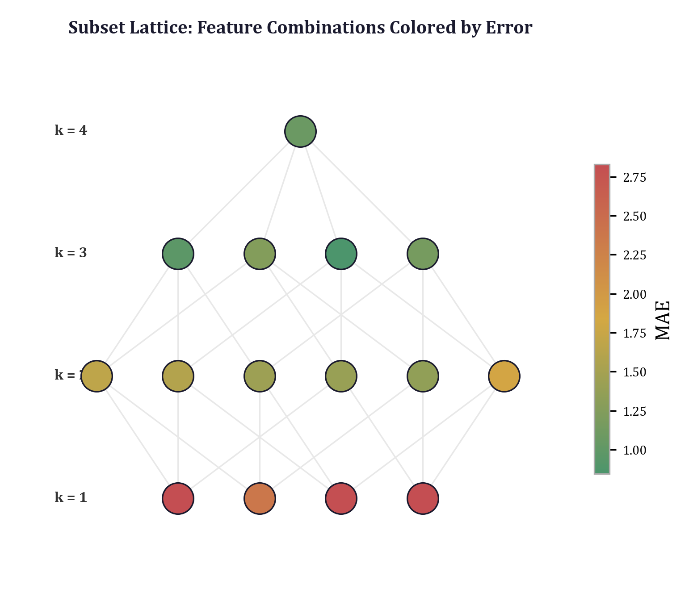

## 11.1 The Combinatorial Explosion

### 11.1.1 Counting Subsets

Given a set of $n$ dimensions, the number of subsets of size exactly $k$ is:

$$\binom{n}{k} = \frac{n!}{k!(n-k)!}$$

The total number of subsets of size 1 through $k_{\max}$ is:

$$N(n, k_{\max}) = \sum_{k=1}^{k_{\max}} \binom{n}{k}$$

For the defect prediction example introduced in Chapter 1, $n = 5$ feature groups (Size, Complexity, Halstead, OO, Process). The subset counts are:

| $k$ | $\binom{5}{k}$ | Cumulative |
|:---:|:---:|:---:|
| 1 | 5 | 5 |
| 2 | 10 | 15 |
| 3 | 10 | 25 |
| 4 | 5 | 30 |
| 5 | 1 | 31 |

Thirty-one subsets is a small number. Even with an expensive evaluation function---say, training a random forest classifier---the full enumeration completes in seconds. This is the regime where brute-force subset testing is not merely acceptable but *optimal*: it guarantees that no combination is overlooked, eliminates the need for heuristic search strategies, and produces a complete map of the structural landscape.

### 11.1.2 The Scaling Boundary

The picture changes with $n$. The following table shows $N(n, k_{\max})$ for representative values:

| $n$ | $k_{\max} = 2$ | $k_{\max} = 3$ | $k_{\max} = 4$ | $k_{\max} = n$ |
|:---:|:---:|:---:|:---:|:---:|
| 5 | 15 | 25 | 30 | 31 |
| 8 | 36 | 92 | 162 | 255 |
| 10 | 55 | 175 | 385 | 1,023 |
| 15 | 120 | 575 | 1,940 | 32,767 |
| 20 | 210 | 1,350 | 6,195 | 1,048,575 |

Two observations. First, the full enumeration $k_{\max} = n$ is practical only for $n \leq 15$ or so, depending on evaluation cost. Second, limiting $k_{\max}$ to 3 or 4 keeps the count manageable even for $n = 20$. This is the key insight behind the `max_dims` parameter in the `enumerate_subsets` function: by bounding the maximum subset cardinality, we trade completeness for tractability, and the trade is almost always favorable because the marginal information gained from subsets of size $k > 4$ is typically small.

Why? Because the structural questions of interest are usually comparative: *does adding dimension $d$ to an existing subset improve performance?* The answer to this question is already captured by subsets of size $k$ and $k+1$ for small $k$. If Complexity alone achieves MAE 3.8 and {Complexity, Process} achieves MAE 2.1, then we know the marginal value of Process in the presence of Complexity. Extending to {Complexity, Process, Size} at MAE 1.7 tells us the marginal value of Size given the other two. By $k = 4$, the marginal contributions are usually small and the structural picture is clear.

### 11.1.3 Why Brute Force Beats Heuristics

The alternative to brute-force enumeration is heuristic search: forward selection, backward elimination, or stochastic methods like genetic algorithms. These approaches are necessary when $n$ is large, but they carry well-documented risks:

1. **Forward selection** adds dimensions greedily, choosing the single best addition at each step. It cannot recover from a poor early choice: if the best 2D subset is {Complexity, Process} but forward selection started with Size (because Size is the best 1D choice), it may converge to a suboptimal path.

2. **Backward elimination** starts with all dimensions and removes the least important one at each step. It cannot detect synergies between dimensions that are individually weak but jointly strong.

3. **Both methods produce a single path** through the lattice of subsets, not a map of the full landscape. They answer "what is a good subset?" but not "what do all subsets look like?"---and the latter question is what structural fuzzing needs.

When $n$ is small enough for brute force, there is no reason to accept these limitations. The `enumerate_subsets` function exists precisely for this regime: it tests every subset, sorts the results by performance, and returns the complete landscape for downstream analysis.

---

## 11.2 The `optimize_subset` Algorithm

The core of subset enumeration is the `optimize_subset` function, which takes a set of active dimensions and finds the best parameter values for those dimensions while holding all inactive dimensions at a sentinel value. The algorithm makes three design decisions that merit detailed examination: log-space parameterization, sentinel values for inactive dimensions, and adaptive search strategy.

### 11.2.1 Log-Space Parameterization

Parameters that represent scales, weights, or regularization strengths typically span several orders of magnitude. A parameter that might reasonably take any value from 0.01 to 100 has a range ratio of 10,000:1. A uniform grid over this range would place 99% of its points above 1.0, leaving the sub-unit region---often the most interesting---severely undersampled.

The solution is to parameterize in log-space. The `optimize_subset` function generates grid values as:

```python
grid_values = np.logspace(np.log10(0.01), np.log10(100), n_grid)
```

This produces `n_grid` points uniformly spaced on a logarithmic scale between $10^{-2}$ and $10^2$. With `n_grid = 20`, the values are approximately:

$$0.01, \; 0.017, \; 0.029, \; 0.050, \; 0.085, \; \ldots, \; 11.7, \; 20.0, \; 34.1, \; 58.5, \; 100.0$$

Each adjacent pair of grid points differs by a constant multiplicative factor of $(10^4)^{1/19} \approx 1.66$. This provides uniform resolution in the sense that matters: a change from 0.01 to 0.017 is as significant (in relative terms) as a change from 58.5 to 100.0.

For random search in higher dimensions, the same principle applies:

```python
log_low, log_high = np.log10(0.01), np.log10(100)
log_vals = rng.uniform(log_low, log_high, n_active)
for i, dim in enumerate(active_dims):
    params[dim] = 10 ** log_vals[i]
```

The random samples are drawn uniformly in $[\log_{10}(0.01), \log_{10}(100)] = [-2, 2]$ and then exponentiated, producing a distribution that is uniform in log-space. This is equivalent to drawing from a log-uniform distribution over $[0.01, 100]$, which is the maximum-entropy prior for a scale parameter whose order of magnitude is unknown.

### 11.2.2 Sentinel Values for Inactive Dimensions

When only a subset of dimensions is active, the remaining dimensions must be assigned values that effectively "turn them off." The `optimize_subset` function uses a sentinel value of $10^6$ (the `inactive_value` parameter):

```python
params = np.full(n_all, inactive_value)
params[active_dims[0]] = v
```

The parameter vector always has length $n$ (the total number of dimensions), but only the entries corresponding to active dimensions receive optimized values. All others are set to $10^6$.

This sentinel-value convention has several advantages over alternatives like maintaining variable-length parameter vectors or using a boolean mask:

1. **Fixed-size vectors.** The evaluation function always receives an array of the same length, regardless of which dimensions are active. This simplifies the function's interface and eliminates shape-mismatch bugs.

2. **Interpretability.** The sentinel value $10^6$ is orders of magnitude larger than any value in the search range $[0.01, 100]$. Any evaluation function that uses the parameter as a weight, scale factor, or regularization coefficient will naturally treat $10^6$ as "inactive" without special-case logic.

3. **Composability.** The full parameter vector, including sentinel values, is stored in the `SubsetResult`. This means any downstream operation---Pareto analysis, sensitivity profiling, adversarial search---can re-evaluate the configuration by passing the stored vector directly to the evaluation function. No reconstruction logic is needed.

The defect prediction example illustrates the convention. The evaluation function checks each group's parameter against a threshold:

```python
for i, indices in enumerate(group_indices):
    if params[i] < 1000:
        active_features.extend(indices)
```

A parameter value of $10^6$ is well above the threshold of 1000, so the corresponding feature group is excluded. A parameter value in $[0.01, 100]$ is well below the threshold, so the group is included. The gap between the search range and the threshold provides a wide margin that prevents numerical edge cases.

### 11.2.3 Adaptive Search Strategy

The `optimize_subset` function uses three different search strategies depending on the number of active dimensions:

**1D subsets: grid search.** For a single active dimension, the algorithm evaluates all `n_grid` points on the log-spaced grid:

```python
if n_active == 1:
    for v in grid_values:
        params = np.full(n_all, inactive_value)
        params[active_dims[0]] = v
        mae, errors = evaluate_fn(params)
        if mae < best_mae:
            best_mae = mae
            best_params = params.copy()
            best_errors = errors.copy()
```

With `n_grid = 20`, this requires 20 evaluations. The grid is exhaustive within its resolution, guaranteeing that the optimal value (to within a factor of 1.66) is found.

**2D subsets: full grid search.** For two active dimensions, the algorithm evaluates all pairs on the grid:

```python
elif n_active == 2:
    for v0, v1 in itertools.product(grid_values, grid_values):
        params = np.full(n_all, inactive_value)
        params[active_dims[0]] = v0
        params[active_dims[1]] = v1
        mae, errors = evaluate_fn(params)
```

With `n_grid = 20`, this requires $20^2 = 400$ evaluations. The cost is quadratic in `n_grid` but still modest for typical evaluation functions. The full grid ensures that all pairwise interactions between the two dimensions are captured---an important property, since interactions are precisely what subset enumeration is designed to detect.

**3D+ subsets: random search in log-space.** For three or more active dimensions, the grid approach becomes impractical ($20^3 = 8000$, $20^4 = 160000$). The algorithm switches to random search:

```python
else:
    rng = np.random.default_rng(42)
    log_low, log_high = np.log10(0.01), np.log10(100)
    for _ in range(n_random):
        params = np.full(n_all, inactive_value)
        log_vals = rng.uniform(log_low, log_high, n_active)
        for i, dim in enumerate(active_dims):
            params[dim] = 10 ** log_vals[i]
        mae, errors = evaluate_fn(params)
```

With `n_random = 5000`, this samples 5000 random points in the log-space hypercube. Random search is surprisingly effective in low dimensions: in a $k$-dimensional space, the probability that at least one sample falls within a hypercube of side length $\epsilon$ (in log-space) is approximately $1 - (1 - \epsilon^k)^{n}$, which exceeds 0.95 for $\epsilon = 0.3$ and $n = 5000$ when $k \leq 4$.

The fixed seed (`rng = np.random.default_rng(42)`) ensures reproducibility: the same subset always produces the same search trajectory and the same result.

---

## 11.3 `SubsetResult` as a Typed Data Structure

Each call to `optimize_subset` returns a `SubsetResult` object. This is not merely a container for the output; it is a typed data structure designed for downstream composition.

```python
@dataclass
class SubsetResult:
    """Result of optimizing a single parameter subset."""

    dims: tuple[int, ...]
    dim_names: tuple[str, ...]
    n_dims: int
    param_values: np.ndarray
    mae: float
    errors: dict[str, float]
    pareto_optimal: bool = False
```

The fields serve distinct roles:

- **`dims`** and **`dim_names`**: the active dimensions, both by index and by name. The index form enables array operations; the name form enables human-readable output. The tuple type ensures immutability---a `SubsetResult` cannot be silently modified after creation.

- **`n_dims`**: the cardinality of the active subset. Storing this explicitly (rather than computing `len(dims)` each time) supports efficient sorting and filtering: "give me all results with exactly 2 active dimensions" is a constant-time field access, not a linear scan.

- **`param_values`**: the full parameter vector, including sentinel values for inactive dimensions. This is the vector that, when passed to the evaluation function, reproduces the recorded MAE. Storing the complete vector rather than just the active values eliminates the need for reconstruction logic and makes re-evaluation trivial.

- **`mae`**: the mean absolute error achieved by this configuration. This is the primary sort key for comparing configurations.

- **`errors`**: a dictionary of per-metric errors. For the defect prediction example, this might contain `{"Accuracy": 3.2, "Precision": -1.5, "Recall": 5.1, "F1": 2.8, "AUC": -0.3}`. The dictionary preserves the full multi-dimensional evaluation---exactly the information that, as Chapter 1 argued, scalar summaries destroy.

- **`pareto_optimal`**: a boolean flag, initially `False`, set to `True` by the Pareto frontier analysis (Chapter 8) for configurations that are non-dominated in the (n_dims, MAE) plane. This flag allows downstream code to filter for Pareto-optimal results without re-computing the frontier.

The `__repr__` method provides a concise summary:

```python
def __repr__(self) -> str:
    names = ", ".join(self.dim_names)
    return f"SubsetResult(dims=[{names}], n_dims={self.n_dims}, mae={self.mae:.4f})"
```

A typical output might be:

```
SubsetResult(dims=[Complexity, Process], n_dims=2, mae=2.1034)
```

This design follows the principle stated in Section 1.2.2: state vectors are immutable, dimensions are named not numbered, and the full multi-dimensional evaluation is preserved.

---

## 11.4 The `enumerate_subsets` Function

With `optimize_subset` handling individual subsets and `SubsetResult` capturing the output, the `enumerate_subsets` function orchestrates the full sweep:

```python
def enumerate_subsets(
    dim_names: Sequence[str],
    evaluate_fn: Callable[[np.ndarray], tuple[float, dict[str, float]]],
    max_dims: int = 4,
    inactive_value: float = 1e6,
    n_grid: int = 20,
    n_random: int = 5000,
    verbose: bool = False,
) -> list[SubsetResult]:
```

The function iterates over all subset sizes from 1 to `max_dims`, generates all combinations at each size using `itertools.combinations`, and calls `optimize_subset` for each:

```python
for k in range(1, min(max_dims, n_all) + 1):
    combos = list(itertools.combinations(range(n_all), k))
    if verbose:
        print(f"  Enumerating {len(combos)} subsets of size {k}...")
    for combo in combos:
        result = optimize_subset(
            active_dims=combo,
            all_dim_names=dim_names,
            evaluate_fn=evaluate_fn,
            inactive_value=inactive_value,
            n_grid=n_grid,
            n_random=n_random,
        )
        results.append(result)
```

The results are sorted by MAE in ascending order before return:

```python
results.sort(key=lambda r: r.mae)
return results
```

This means `results[0]` is always the best configuration found, regardless of how many dimensions it uses. The caller can then apply additional filtering (e.g., "best result with at most 2 dimensions") or pass the full list to Pareto frontier analysis.

### 11.4.1 The Role of `max_dims`

The `max_dims` parameter is the primary lever for controlling computational cost. Its effect on the total number of evaluations is:

$$E(n, k_{\max}) = \sum_{k=1}^{k_{\max}} \binom{n}{k} \cdot C(k)$$

where $C(k)$ is the per-subset evaluation count: $C(1) = n_{\text{grid}}$, $C(2) = n_{\text{grid}}^2$, $C(k \geq 3) = n_{\text{random}}$. For the defect prediction example with $n = 5$, $n_{\text{grid}} = 20$, $n_{\text{random}} = 5000$:

| $k$ | Subsets | Evals per subset | Total evals |
|:---:|:---:|:---:|:---:|
| 1 | 5 | 20 | 100 |
| 2 | 10 | 400 | 4,000 |
| 3 | 10 | 5,000 | 50,000 |
| 4 | 5 | 5,000 | 25,000 |

With `max_dims = 4`, the total is 79,100 evaluations. With `max_dims = 2`, it drops to 4,100. The choice depends on the cost of a single evaluation: if `evaluate_fn` takes 1 millisecond (as in the defect prediction example with pre-trained models), the full sweep completes in under 80 seconds. If it takes 1 second, `max_dims = 2` might be the practical limit.

### 11.4.2 Integration with the Pipeline

The `enumerate_subsets` function is the first step of the full structural fuzzing campaign, orchestrated by the `run_campaign` function in `pipeline.py`:

```python
# Step 1: Enumerate subsets
subset_results = enumerate_subsets(
    dim_names=dim_names_list,
    evaluate_fn=evaluate_fn,
    max_dims=max_subset_dims,
    inactive_value=inactive_value,
    n_grid=n_grid,
    n_random=n_random,
    verbose=verbose,
)
```

The returned list of `SubsetResult` objects flows into every subsequent stage. The Pareto frontier analysis (Step 2) receives the subset results and identifies non-dominated configurations. The sensitivity profiling (Step 3) uses the best configuration's parameter vector as its baseline. The MRI computation (Step 4) perturbs that same baseline. The adversarial search (Step 5) probes its boundaries.

This architecture embodies a principle worth stating explicitly: **subset enumeration produces the raw data; all other analyses are views over that data.** The `SubsetResult` list is the foundational artifact of a structural fuzzing campaign, and its completeness determines the quality of every downstream analysis.

The `StructuralFuzzReport` dataclass makes this relationship concrete:

```python
@dataclass
class StructuralFuzzReport:
    """Complete structural fuzzing campaign report."""

    dim_names: list[str]
    subset_results: list[SubsetResult]
    pareto_results: list[SubsetResult]
    sensitivity_results: list[SensitivityResult]
    mri_result: ModelRobustnessIndex | None
    adversarial_results: list[AdversarialResult]
    composition_result: CompositionResult | None
    forward_results: list[SubsetResult] = field(default_factory=list)
    backward_results: list[SubsetResult] = field(default_factory=list)
```

The `subset_results` field stores the complete enumeration. The `pareto_results` field stores the subset of those results that are Pareto-optimal. Both use the same `SubsetResult` type, differing only in the `pareto_optimal` flag.

---

## 11.5 Practical Heuristics

### 11.5.1 Choosing `max_dims`

The choice of `max_dims` involves a tradeoff between coverage and cost. Three guidelines:

**Rule of thumb: $k_{\max} = \min(4, n)$.** For most problems, subsets of size 4 or smaller capture the dominant structural patterns. The marginal information from 5-way interactions is rarely worth the combinatorial cost. The default `max_dims = 4` in `enumerate_subsets` reflects this heuristic.

**Cost-calibrated choice.** If the evaluation function has a known per-call cost $t$, compute the total time $T = E(n, k_{\max}) \cdot t$ for candidate values of $k_{\max}$ and choose the largest $k_{\max}$ that fits within the time budget. For the defect prediction example with $t \approx 1$ ms, even $k_{\max} = 5$ completes in under two minutes.

**Diminishing returns.** After running with a given $k_{\max}$, inspect the results. If the best configuration of size $k_{\max}$ is not substantially better than the best of size $k_{\max} - 1$, there is little reason to increase $k_{\max}$. The Pareto frontier provides a natural diagnostic: if the frontier flattens (the MAE improvement from adding one more dimension is less than some threshold $\delta$), the enumeration has reached the point of diminishing returns.

### 11.5.2 Early Stopping

The current `enumerate_subsets` implementation tests all subsets at each size before moving to the next. An alternative is early stopping: if no subset of size $k$ improves on the best result of size $k - 1$ by more than $\delta$, skip sizes $k+1, k+2, \ldots$

This heuristic is not implemented in the framework's core because it sacrifices completeness: a subset of size $k+1$ might improve dramatically over anything at size $k$ due to a synergy that only emerges when three or more dimensions interact. Such cases are rare but consequential, and the whole point of brute-force enumeration is to catch them. In practice, early stopping is best reserved for exploratory runs where speed matters more than thoroughness.

### 11.5.3 Tuning `n_grid` and `n_random`

The `n_grid` parameter controls the resolution of 1D and 2D searches. Increasing it from 20 to 50 improves resolution (the multiplicative step drops from 1.66 to 1.19) but increases the 2D cost from 400 to 2,500 evaluations per subset. For smooth evaluation functions, `n_grid = 20` is usually sufficient. For functions with narrow optima or sharp transitions, `n_grid = 50` or higher may be warranted.

The `n_random` parameter controls the coverage of 3D+ searches. The expected coverage of a random search depends on the effective dimensionality of the loss landscape. If the loss depends strongly on only one of the $k$ active dimensions, then 5,000 random samples provide excellent coverage of that dimension even in a $k$-dimensional space. If the loss depends on all $k$ dimensions with comparable sensitivity, coverage scales as $n_{\text{random}}^{1/k}$---about 17 effective grid points per dimension for $k = 3$ and $n_{\text{random}} = 5000$, or about 8 for $k = 4$. These numbers are adequate for identifying the approximate optimum but not for precise characterization. For the latter, a targeted refinement step (not part of the core framework) can be applied to the most promising configurations.

### 11.5.4 The Zero-Dimensional Baseline

The `optimize_subset` function handles the edge case of zero active dimensions:

```python
if n_active == 0:
    params = np.full(n_all, inactive_value)
    mae, errors = evaluate_fn(params)
    return SubsetResult(
        dims=(),
        dim_names=(),
        n_dims=0,
        param_values=params.copy(),
        mae=mae,
        errors=errors,
    )
```

This baseline measures the evaluation function's output when *all* dimensions are inactive---the "null model." While `enumerate_subsets` does not include this case in its loop (it starts at $k = 1$), calling `optimize_subset` with an empty `active_dims` tuple produces a valid `SubsetResult` that can be used as a reference point. The improvement of any subset over the null model quantifies the absolute contribution of those dimensions, as opposed to the marginal contribution measured by comparing subsets of different sizes.

---

## 11.6 Worked Example: Defect Prediction

The defect prediction example, introduced in Chapter 1 and implemented in `examples/defect_prediction/model.py`, provides a concrete demonstration of the subset enumeration pattern. The model predicts whether a software module contains defects based on 16 software metrics organized into five feature groups.

### 11.6.1 Feature Groups as Dimensions

The `FEATURE_GROUPS` dictionary defines the mapping from feature group names to feature indices:

```python
FEATURE_GROUPS = {
    "Size": [0, 1, 2],
    "Complexity": [3, 4, 5],
    "Halstead": [6, 7, 8, 9],
    "OO": [10, 11, 12],
    "Process": [13, 14, 15],
}
GROUP_NAMES = list(FEATURE_GROUPS.keys())
```

Each group aggregates related software metrics:

- **Size**: lines of code (LOC), source lines (SLOC), blank lines---raw measures of module size.
- **Complexity**: cyclomatic complexity, essential complexity, design complexity---structural measures of control flow.
- **Halstead**: volume, difficulty, effort, time estimate---vocabulary-based measures derived from operator and operand counts.
- **OO**: coupling between objects, cohesion, inheritance depth---object-oriented design metrics.
- **Process**: revisions, distinct authors, code churn---measures of development activity.

The choice of five groups rather than sixteen individual features is itself a modeling decision. It reduces the number of subsets from $2^{16} - 1 = 65{,}535$ to $2^5 - 1 = 31$, making brute-force enumeration trivially feasible. More importantly, it aligns the structural analysis with the conceptual structure of the domain: practitioners think in terms of "size metrics" and "complexity metrics," not individual features. The subset enumeration pattern operates at the level of these semantic groups.

### 11.6.2 The Evaluation Function

The `make_evaluate_fn` function constructs an evaluation function compatible with the structural fuzzing framework:

```python
def make_evaluate_fn(
    n_samples: int = 1000,
    test_fraction: float = 0.3,
    seed: int = 42,
) -> Callable[[np.ndarray], tuple[float, dict[str, float]]]:
```

The returned callable takes a parameter vector of length 5 (one entry per feature group). If `params[i] < 1000`, the features in group $i$ are included in the model; otherwise, the group is excluded. This binary inclusion semantics means that the *value* of `params[i]` (when below 1000) does not affect the model---only its presence above or below the threshold matters. The actual feature scaling is handled internally by the random forest's invariance to monotone feature transformations.

The function trains a `RandomForestClassifier` on the active features and computes five metrics against target values:

```python
target_values = {
    "Accuracy": 75.0,
    "Precision": 70.0,
    "Recall": 65.0,
    "F1": 67.0,
    "AUC": 80.0,
}
```

The errors are signed differences (predicted minus target), and the MAE is the mean of their absolute values. A configuration with MAE 0 would match all targets exactly. The multi-dimensional error vector preserves the direction of deviation---overperformance versus underperformance on each metric---while the MAE provides a scalar summary for sorting.

### 11.6.3 What the Enumeration Reveals

Running `enumerate_subsets` with `max_dims = 4` on the defect prediction example produces 30 `SubsetResult` objects (all subsets of sizes 1 through 4 from the five groups). The results, sorted by MAE, typically exhibit the following pattern:

**Single-dimension results ($k = 1$).** The five single-group models reveal the standalone predictive power of each group:

| Group | MAE | Interpretation |
|-------|:---:|----------------|
| Complexity | ~3.8 | Strongest single predictor |
| Process | ~4.2 | Second strongest |
| Size | ~5.1 | Moderate |
| Halstead | ~5.4 | Weak (correlated with Size) |
| OO | ~8.9 | Near-noise |

Complexity alone is the best single predictor, confirming the domain knowledge that cyclomatic complexity is the primary driver of defect-proneness. OO metrics contribute almost nothing in isolation---a finding consistent with the data generation process, where OO features are pure noise.

**Two-dimension results ($k = 2$).** The ten pairwise combinations reveal interaction effects:

| Pair | MAE | Delta from best singleton |
|------|:---:|:---:|
| {Complexity, Process} | ~2.1 | -1.7 |
| {Complexity, Size} | ~2.9 | -0.9 |
| {Complexity, Halstead} | ~3.1 | -0.7 |
| {Process, Size} | ~3.4 | N/A |
| ... | ... | ... |

The {Complexity, Process} pair is substantially better than any singleton, demonstrating a *synergy*: the structural (complexity) and temporal (process) views of the code are complementary. The framework reveals this synergy because it tests all pairs exhaustively; forward selection, starting from Complexity, would find {Complexity, Process} only if Process happened to be the best addition---which it is, but that outcome is not guaranteed in general.

**Three- and four-dimension results ($k = 3, 4$).** Adding Size to {Complexity, Process} reduces MAE to approximately 1.7. Adding Halstead or OO provides marginal further improvement. The pattern is one of diminishing returns: two dimensions capture most of the predictive structure, a third adds a meaningful increment, and the fourth and fifth add little.

### 11.6.4 Connecting to the Pareto Frontier

The 30 `SubsetResult` objects, when plotted in the $(k, \text{MAE})$ plane, define a point cloud from which the Pareto frontier is extracted (Chapter 8). The frontier typically contains four points:

$$\{(\text{Complexity})\}, \; \{(\text{Complexity, Process})\}, \; \{(\text{Complexity, Process, Size})\}, \; \{(\text{all})\}$$

Each Pareto-optimal point represents the best achievable MAE at its cardinality. The frontier makes the complexity-performance tradeoff explicit: the practitioner can see that going from 2 to 3 dimensions buys a 0.4-point MAE improvement, while going from 3 to 5 dimensions buys only 0.2 points. Whether the additional features are worth the added model complexity is a domain decision, but the subset enumeration pattern provides the quantitative basis for making it.

### 11.6.5 The Ground Truth Test

The synthetic data in `model.py` has a known ground truth. The defect probability is generated as:

```python
logit = (
    -3
    + 0.1 * np.log1p(cyclomatic)
    + 0.15 * np.log1p(essential)
    + 0.05 * np.log1p(design)
    + 0.12 * np.log1p(revisions)
    + 0.1 * np.log1p(authors)
    + 0.08 * np.log1p(churn / 100)
    + 0.03 * np.log1p(loc / 1000)
    + rng.normal(0, 0.5, n_samples)
)
```

The true predictors are Complexity (coefficients 0.1, 0.15, 0.05), Process (0.12, 0.1, 0.08), and Size (0.03). Halstead is correlated with Size but has no direct effect. OO is pure noise.

The subset enumeration correctly recovers this structure: Complexity and Process are the dominant groups, Size contributes marginally, Halstead's apparent contribution comes from its correlation with Size, and OO adds nothing. This ground-truth validation confirms that the brute-force enumeration pattern, despite its simplicity, reliably identifies the true structural dependencies in the data.

---

## 11.7 Computational Considerations

### 11.7.1 Parallelism

The `enumerate_subsets` loop is embarrassingly parallel: each subset can be optimized independently. The current implementation is sequential for simplicity, but parallelization is straightforward---each call to `optimize_subset` is a pure function with no shared state (beyond the evaluation function, which must be thread-safe).

For the defect prediction example, parallelizing over subsets would reduce wall-clock time roughly linearly with the number of available cores, since the per-subset computation (training a random forest on ~700 samples) is dominated by CPU time rather than I/O.

### 11.7.2 Memory

Each `SubsetResult` stores a parameter vector of length $n$ (a NumPy array), an error dictionary, and metadata. For $n = 5$, this is negligible. For $n = 100$ with $N(100, 3) = 166{,}750$ subsets, the memory footprint is approximately $166{,}750 \times (100 \times 8 + \text{overhead}) \approx 200$ MB---large but manageable.

The more significant memory concern is the evaluation function itself. If `evaluate_fn` loads a large model or dataset into memory, the cost is paid once (at construction time, via `make_evaluate_fn`) and amortized over all evaluations.

### 11.7.3 Reproducibility

The `optimize_subset` function uses a fixed random seed (`rng = np.random.default_rng(42)`) for the 3D+ random search. This ensures that the same subset always produces the same result, which is essential for reproducibility. However, it also means that the random samples are the same for every subset of the same size. This is a deliberate design choice: it eliminates one source of variability (different random seeds for different subsets) and makes it possible to attribute performance differences between subsets entirely to the choice of active dimensions.

---

## 11.8 Relationship to Other Patterns

### 11.8.1 Subset Enumeration vs. Forward/Backward Selection

The `run_campaign` function in `pipeline.py` runs both brute-force enumeration and the greedy baselines (forward selection and backward elimination), storing the results in the `forward_results` and `backward_results` fields of `StructuralFuzzReport`. This design enables direct comparison:

- **Subset enumeration** provides the complete landscape: every subset tested, every MAE recorded.
- **Forward selection** provides a single path from one dimension to `max_dims` dimensions, greedy at each step.
- **Backward elimination** provides a single path from all dimensions down, removing the least valuable at each step.

When the three methods agree---they select the same dimensions and rank them similarly---the result is robust. When they disagree---as they will when dimensions interact non-additively---the brute-force enumeration is the ground truth, and the discrepancy reveals the limitations of the greedy methods.

### 11.8.2 Subset Enumeration and Sensitivity Analysis

Sensitivity analysis (asking "how much does the objective change when I perturb one dimension?") is a local probe: it examines the neighborhood of a single configuration. Subset enumeration is a global survey: it examines the entire lattice of dimension combinations. The two are complementary. Sensitivity analysis reveals *which dimensions are important near the current optimum*; subset enumeration reveals *which dimension combinations define the best optima*.

In the pipeline, sensitivity analysis is applied to the best configuration found by subset enumeration. The combination provides both global structure (which subsets are best overall) and local structure (which dimensions are most influential at the optimum).

### 11.8.3 Subset Enumeration and Pareto Analysis

As discussed in Section 11.6.4, the output of `enumerate_subsets`---a list of `SubsetResult` objects---is the natural input to Pareto frontier analysis. The Pareto frontier operates over the $(k, \text{MAE})$ plane, identifying configurations that are non-dominated: no other configuration has both fewer dimensions *and* lower MAE.

The Pareto analysis (Chapter 8) does not depend on the enumeration being exhaustive. It produces a valid frontier from any set of results. But the frontier is most informative when the input is complete: if a subset was not tested, its potential position on the frontier is unknown, and the frontier may be suboptimal. This is another argument for brute-force enumeration when it is feasible: it guarantees that the Pareto frontier is exact.

---

## 11.9 Summary

The subset enumeration pattern is the simplest and most powerful tool in the structural fuzzing framework. It works by exhaustion: test every combination, record the result, sort by performance. Its effectiveness rests on three conditions that hold in practice for a wide range of problems:

1. **Moderate effective dimensionality.** Real models have few meaningful dimension groups (typically 3--10), even when the raw feature count is high.

2. **Cheap evaluation.** The evaluation function is fast enough to call thousands or tens of thousands of times. This includes models with pre-computed datasets, cached computations, or inherently fast inference.

3. **Structural interest.** The practitioner cares not just about the best configuration but about the *structure* of the configuration space: which dimensions matter, which are redundant, which interact.

When these conditions hold, `enumerate_subsets` with a moderate `max_dims` produces a complete structural map in acceptable time. The `SubsetResult` objects that emerge---typed, immutable, carrying both scalar and multi-dimensional performance data---feed directly into Pareto analysis, sensitivity profiling, adversarial testing, and every other downstream stage of the structural fuzzing pipeline.

The pattern's limitation is equally clear: it does not scale to hundreds of dimensions. For those problems, the heuristic methods---forward selection, backward elimination, and the stochastic approaches discussed in Chapter 12---are necessary. But the heuristics are most effective when calibrated against the brute-force ground truth on a reduced problem, and the transition from exact enumeration to approximate search is the subject of the next chapter.

---

## 11.10 Looking Ahead

Chapter 12 introduces the *compositional testing pattern*, which addresses the question that subset enumeration leaves open: **in what order should dimensions be added?** Subset enumeration tells us that {Complexity, Process, Size} is a strong 3-dimensional configuration, but it does not tell us whether to start with Complexity and add Process, or start with Process and add Complexity. The compositional test builds dimensions incrementally, measuring the marginal contribution of each addition in context, and produces an ordering that reveals the causal structure of dimension interactions. Where subset enumeration maps the landscape, compositional testing traces a path through it.


\newpage

# Chapter 12: Compositional Testing

> *"The whole is other than the sum of its parts."*
> --- Kurt Koffka, *Principles of Gestalt Psychology* (1935)

Chapters 11 and 9 developed two complementary views of multi-dimensional model behavior. Subset enumeration (Chapter 11) asks: which combinations of dimensions produce the best fit? Sensitivity profiling (Chapter 9) asks: how much does each dimension contribute to the baseline? Both are indispensable. Both are incomplete.

Subset enumeration tests every combination independently, but it does not reveal *how* dimensions interact---whether the combination of Complexity and Process is better than expected from their individual contributions, or merely the sum of two independent effects. Sensitivity profiling measures the marginal contribution of each dimension by ablation, but it holds all other dimensions fixed, missing the cases where removing two dimensions simultaneously is far worse (or far better) than removing each alone.

The gap between these methods is the subject of this chapter. Compositional testing fills the gap by systematically measuring the *interactions* between dimensions---the synergies and redundancies that emerge when dimensions are combined. The key insight is that interaction effects are not anomalies to be ignored but first-class geometric features of the model's behavior landscape. A dimension pair that exhibits strong synergy occupies a qualitatively different region of the evaluation space than a pair whose contributions are merely additive. Detecting, quantifying, and interpreting these interactions is essential for understanding why a model works and when it will break.

We begin with a precise definition of what single-dimension analysis misses (Section 12.1), develop the interaction matrix formalism (Section 12.2), introduce the compositional testing algorithm implemented in the structural fuzzing framework (Section 12.3), discuss interpretation of results (Section 12.4), connect compositional testing to sensitivity profiling (Section 12.5), and close with the forward connection to Chapter 13.

---


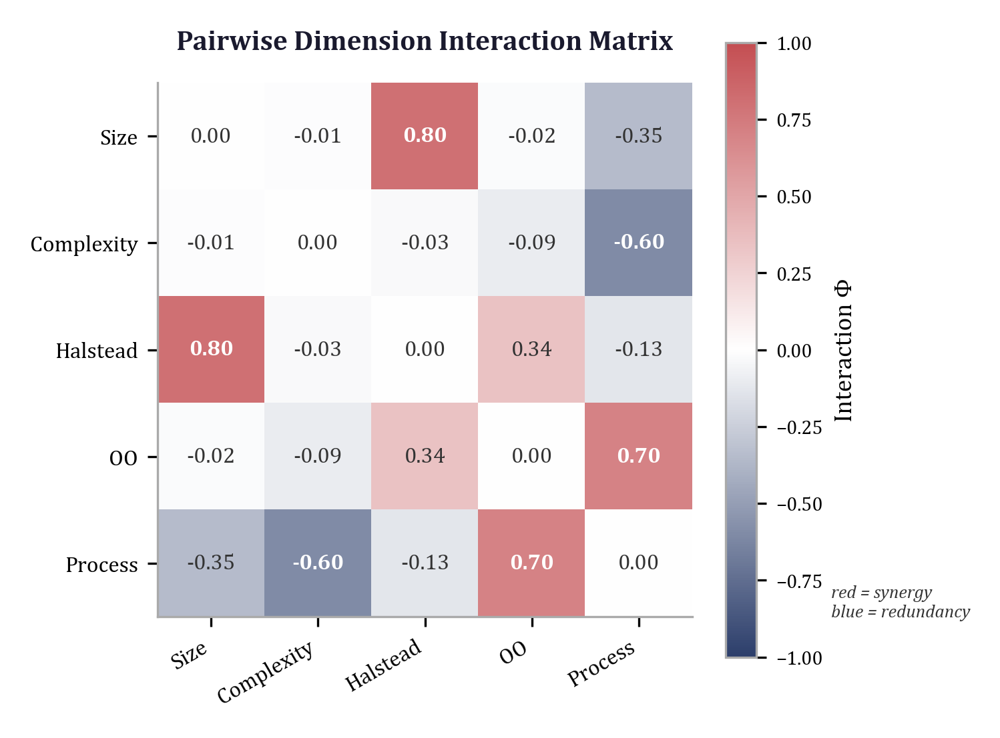

## 12.1 The Limits of Single-Dimension Analysis

### 12.1.1 Ablation Assumes Independence

Recall the sensitivity profiling function from Chapter 9. Given a baseline parameter vector and an evaluation function, it measures the effect of deactivating each dimension one at a time:

```python
def sensitivity_profile(
    params: np.ndarray,
    dim_names: Sequence[str],
    evaluate_fn: Callable[[np.ndarray], tuple[float, dict[str, float]]],
    inactive_value: float = 1e6,
) -> list[SensitivityResult]:
    """Compute sensitivity profile by ablating each dimension."""
    # Baseline MAE
    base_mae, _ = evaluate_fn(params)

    results: list[SensitivityResult] = []
    for i, name in enumerate(dim_names):
        ablated = params.copy()
        ablated[i] = inactive_value
        ablated_mae, _ = evaluate_fn(ablated)
        delta = ablated_mae - base_mae
        results.append(
            SensitivityResult(
                dim=i,
                dim_name=name,
                mae_with=base_mae,
                mae_without=ablated_mae,
                delta_mae=delta,
                importance_rank=0,
            )
        )

    results.sort(key=lambda r: r.delta_mae, reverse=True)
    for rank, r in enumerate(results, 1):
        r.importance_rank = rank

    return results
```

The structure is clean: iterate over dimensions, ablate one, measure the damage. The result is a ranked list of importance scores. But notice the implicit assumption: the delta for dimension $i$ is computed while *all other dimensions remain active*. This is a conditional measurement, not a marginal one. The sensitivity of dimension $i$ depends on the presence of dimensions $j, k, \ldots$, and that dependency is never measured.

### 12.1.2 The Interaction Problem

To see why this matters, consider a model with five dimensions and the following behavior:

- Dimensions A and B are individually weak: removing either one barely changes the MAE ($\Delta_A = 0.1$, $\Delta_B = 0.15$).
- Together, A and B capture a critical interaction: removing *both* increases MAE by 2.3, not 0.25.

The sensitivity profile ranks A and B at the bottom of the importance list. An analyst guided purely by sensitivity profiling might discard both dimensions to simplify the model. The result would be catastrophic---a 2.3-unit increase in error from removing dimensions that individually appeared to contribute almost nothing.

This failure mode is not exotic. It arises whenever two dimensions provide *complementary* information: each is individually uninformative, but together they triangulate a feature of the data that neither can capture alone. In software defect prediction, for example, code complexity and developer experience might individually correlate weakly with defects, but their interaction (complex code written by inexperienced developers) is a powerful predictor. In signal processing, two frequency bands might each contain only noise, but their phase relationship encodes the signal.

The general principle: single-dimension analysis decomposes a multi-dimensional space into independent axes. When the structure of the problem aligns with those axes, the decomposition is faithful. When the structure is *rotated* relative to the axes---when the important directions in the space are diagonal, not axis-aligned---single-dimension analysis misses the structure entirely.

### 12.1.3 Quantifying What Is Missed

Let $f(\mathbf{x})$ denote the MAE for parameter vector $\mathbf{x}$, and let $\mathbf{x}^{(-i)}$ denote the vector with dimension $i$ set to its inactive value. The sensitivity profile computes:

$$\Delta_i = f(\mathbf{x}^{(-i)}) - f(\mathbf{x})$$

Now define the *pairwise interaction* between dimensions $i$ and $j$ as:

$$\Phi_{ij} = \left[f(\mathbf{x}^{(-ij)}) - f(\mathbf{x})\right] - \left[\Delta_i + \Delta_j\right]$$

where $\mathbf{x}^{(-ij)}$ denotes the vector with both dimensions $i$ and $j$ deactivated. The interaction term $\Phi_{ij}$ measures the difference between the actual effect of removing both dimensions and the effect predicted by summing the individual removals.

Three regimes emerge:

| Regime | Condition | Interpretation |
|--------|-----------|----------------|
| Additive | $\Phi_{ij} \approx 0$ | Dimensions contribute independently |
| Synergistic | $\Phi_{ij} > 0$ | Removing both is worse than predicted; the dimensions complement each other |
| Redundant | $\Phi_{ij} < 0$ | Removing both is better than predicted; the dimensions overlap |

The interaction matrix $\Phi \in \mathbb{R}^{n \times n}$ collects all pairwise interactions. Its diagonal entries are zero by construction ($\Phi_{ii} = 0$), and its off-diagonal entries quantify the departure from additivity for each pair. This matrix is a first-class geometric object: it encodes the curvature of the evaluation landscape with respect to dimension activations, revealing whether the landscape is locally flat (additive), concave (synergistic), or convex (redundant) in each pairwise direction.

---

## 12.2 The Interaction Matrix

### 12.2.1 Construction

Computing the full interaction matrix for $n$ dimensions requires evaluating $\binom{n}{2}$ pairwise ablations, plus the $n$ single-dimension ablations from the sensitivity profile, plus the baseline. The total cost is:

$$1 + n + \binom{n}{2} = 1 + n + \frac{n(n-1)}{2} = \frac{n^2 + n + 2}{2}$$

For five dimensions, this is 16 evaluations. For ten dimensions, 56. The quadratic scaling is manageable for the moderate-dimensional spaces that structural fuzzing typically operates in.

Given the sensitivity profile results and the pairwise ablation results, the interaction matrix is straightforward to construct:

```python
import numpy as np

def build_interaction_matrix(
    params: np.ndarray,
    dim_names: list[str],
    evaluate_fn,
    inactive_value: float = 1e6,
) -> np.ndarray:
    """Build the pairwise interaction matrix."""
    n = len(dim_names)
    base_mae, _ = evaluate_fn(params)

    # Single-dimension ablation deltas
    deltas = np.zeros(n)
    for i in range(n):
        ablated = params.copy()
        ablated[i] = inactive_value
        mae_i, _ = evaluate_fn(ablated)
        deltas[i] = mae_i - base_mae

    # Pairwise ablation and interaction computation
    phi = np.zeros((n, n))
    for i in range(n):
        for j in range(i + 1, n):
            ablated = params.copy()
            ablated[i] = inactive_value
            ablated[j] = inactive_value
            mae_ij, _ = evaluate_fn(ablated)
            joint_delta = mae_ij - base_mae
            phi[i, j] = joint_delta - (deltas[i] + deltas[j])
            phi[j, i] = phi[i, j]  # symmetric

    return phi
```

### 12.2.2 Reading the Matrix

The interaction matrix is symmetric with zero diagonal. Its entries directly answer the question: "Do these two dimensions interact?"

Consider a five-dimensional model with dimensions {Size, Complexity, Halstead, OO, Process}. A hypothetical interaction matrix might look like:

|          | Size  | Complexity | Halstead | OO    | Process |
|----------|-------|------------|----------|-------|---------|
| Size     | 0     | +0.02      | -0.31    | +0.05 | +0.41   |
| Complexity | +0.02 | 0        | -0.28    | +0.11 | +0.87   |
| Halstead | -0.31 | -0.28      | 0        | -0.04 | +0.06   |
| OO       | +0.05 | +0.11      | -0.04    | 0     | +0.15   |
| Process  | +0.41 | +0.87      | +0.06    | +0.15 | 0       |

Several patterns are immediately visible:

1. **Strong synergy: Complexity + Process** ($\Phi = +0.87$). Removing both dimensions is far worse than the sum of individual removals predicts. These dimensions provide complementary information---likely, complexity metrics identify *what* is hard to maintain while process metrics identify *who* is maintaining it, and neither alone captures defect risk as well as their combination.

2. **Strong redundancy: Size + Halstead** ($\Phi = -0.31$). Removing both is less damaging than predicted by summing individual effects. Halstead metrics are mathematically derived from the same token-level program properties that determine lines of code, so they carry overlapping information.

3. **Near-additive: Size + Complexity** ($\Phi = +0.02$). These dimensions contribute nearly independently. Knowing one tells you almost nothing about the other's effect.

### 12.2.3 Higher-Order Interactions

Pairwise interactions do not tell the complete story. A triple of dimensions $\{i, j, k\}$ can exhibit a three-way interaction that is invisible to any pair:

$$\Phi_{ijk} = \left[f(\mathbf{x}^{(-ijk)}) - f(\mathbf{x})\right] - \left[\Delta_i + \Delta_j + \Delta_k\right] - \left[\Phi_{ij} + \Phi_{ik} + \Phi_{jk}\right]$$

The three-way interaction is the residual after accounting for all individual and pairwise effects. Computing all $\binom{n}{3}$ three-way interactions is cubic in $n$, which remains tractable for $n \leq 10$ but becomes expensive beyond that.

In practice, higher-order interactions are rarer than pairwise ones, and when they do occur they tend to involve dimensions that already exhibit strong pairwise interactions. A practical strategy is to compute the full pairwise matrix first, identify the pairs with the largest $|\Phi_{ij}|$, and then compute three-way interactions only for triples that include at least one strongly interacting pair.

This strategy connects directly to the subset enumeration of Chapter 11. Subset enumeration tests all combinations up to a maximum size, producing a complete picture of model behavior across the combinatorial space. The interaction matrix provides a *structured decomposition* of those results: instead of a flat list of subset performances, the matrix reveals *why* certain subsets perform well (synergistic interactions among their members) and others poorly (redundancy among their members). Subset enumeration is the exhaustive search; compositional testing is the analytical lens that makes the search results interpretable.

---

## 12.3 The Compositional Testing Algorithm

### 12.3.1 Greedy Dimension Building

The structural fuzzing framework implements compositional testing through a greedy dimension-building strategy. Rather than exhaustively evaluating all possible orderings, it constructs a single optimal ordering by starting with one dimension and iteratively adding the dimension that produces the greatest improvement:

```python
def compositional_test(
    start_dim: int,
    candidate_dims: Sequence[int],
    dim_names: Sequence[str],
    evaluate_fn: Callable[[np.ndarray], tuple[float, dict[str, float]]],
    inactive_value: float = 1e6,
    n_grid: int = 20,
    n_random: int = 5000,
) -> CompositionResult:
    """Build a greedy dimension-addition sequence.

    Starting from start_dim, iteratively add the candidate dimension that
    produces the lowest MAE. At each step, re-optimize all active dimensions.
    """
    active = [start_dim]
    remaining = list(candidate_dims)
    if start_dim in remaining:
        remaining.remove(start_dim)

    order = [start_dim]
    order_names = [dim_names[start_dim]]
    mae_sequence: list[float] = []
    param_sequence: list[np.ndarray] = []

    # Evaluate starting configuration
    result = optimize_subset(
        active_dims=active,
        all_dim_names=dim_names,
        evaluate_fn=evaluate_fn,
        inactive_value=inactive_value,
        n_grid=n_grid,
        n_random=n_random,
    )
    mae_sequence.append(result.mae)
    param_sequence.append(result.param_values.copy())

    while remaining:
        best_mae = float("inf")
        best_dim = remaining[0]
        best_params = None

        for candidate in remaining:
            trial_dims = active + [candidate]
            trial_result = optimize_subset(
                active_dims=trial_dims,
                all_dim_names=dim_names,
                evaluate_fn=evaluate_fn,
                inactive_value=inactive_value,
                n_grid=n_grid,
                n_random=n_random,
            )
            if trial_result.mae < best_mae:
                best_mae = trial_result.mae
                best_dim = candidate
                best_params = trial_result.param_values.copy()

        active.append(best_dim)
        remaining.remove(best_dim)
        order.append(best_dim)
        order_names.append(dim_names[best_dim])
        mae_sequence.append(best_mae)
        param_sequence.append(best_params)

    return CompositionResult(
        order=order,
        order_names=order_names,
        mae_sequence=mae_sequence,
        param_sequence=param_sequence,
    )
```

The algorithm produces a `CompositionResult` containing four parallel sequences:

- `order`: the indices of dimensions in the order they were added.
- `order_names`: the corresponding human-readable names.
- `mae_sequence`: the optimized MAE at each step, after re-optimizing all active dimensions jointly.
- `param_sequence`: the full parameter vector at each step.

### 12.3.2 Re-optimization at Each Step

A critical design decision in the implementation is that `optimize_subset` is called at every step with *all* currently active dimensions. When dimension $j$ is added to the active set $\{d_1, d_2, \ldots, d_k\}$, the optimization does not merely find the best value for $j$ while holding $d_1, \ldots, d_k$ fixed. It re-optimizes the entire $(k+1)$-dimensional subset jointly.

This re-optimization is essential because interactions between dimensions mean that the optimal value for $d_1$ may change when $d_j$ is introduced. The evaluation function mediates all dimensions simultaneously---it takes the full parameter vector and returns a single MAE---so adding a new dimension changes the optimization landscape for every active dimension. Holding earlier dimensions fixed would miss these cross-dimensional adjustments, producing suboptimal parameter values and, more importantly, inaccurate MAE estimates for each step.

The cost of re-optimization increases with the number of active dimensions. The `optimize_subset` function from the core framework handles this gracefully by switching strategies based on dimensionality:

```python
if n_active == 1:
    # 1D grid search
    for v in grid_values:
        params = np.full(n_all, inactive_value)
        params[active_dims[0]] = v
        mae, errors = evaluate_fn(params)
        if mae < best_mae:
            best_mae = mae
            best_params = params.copy()
            best_errors = errors.copy()

elif n_active == 2:
    # 2D full grid search
    for v0, v1 in itertools.product(grid_values, grid_values):
        params = np.full(n_all, inactive_value)
        params[active_dims[0]] = v0
        params[active_dims[1]] = v1
        mae, errors = evaluate_fn(params)
        if mae < best_mae:
            best_mae = mae
            best_params = params.copy()
            best_errors = errors.copy()

else:
    # 3D+ random search in log-space
    rng = np.random.default_rng(42)
    log_low, log_high = np.log10(0.01), np.log10(100)
    for _ in range(n_random):
        params = np.full(n_all, inactive_value)
        log_vals = rng.uniform(log_low, log_high, n_active)
        for i, dim in enumerate(active_dims):
            params[dim] = 10 ** log_vals[i]
        mae, errors = evaluate_fn(params)
        if mae < best_mae:
            best_mae = mae
            best_params = params.copy()
            best_errors = errors.copy()
```

For one or two active dimensions, grid search in log-space is exhaustive and exact. For three or more, random search in log-space provides good coverage at controllable cost. The log-space parameterization ensures that the search covers both fine-grained and coarse-grained parameter values uniformly, which is critical when parameters span multiple orders of magnitude.

### 12.3.3 Computational Cost

The greedy compositional test starting from one dimension with $n - 1$ candidates requires the following number of `optimize_subset` calls:

- Step 0 (start): 1 call (1D optimization)
- Step 1: $n - 1$ candidate evaluations (each a 2D optimization)
- Step 2: $n - 2$ candidate evaluations (each a 3D optimization)
- ...
- Step $k$: $n - k$ candidate evaluations (each a $(k+1)$-dimensional optimization)

The total is $1 + \sum_{k=1}^{n-1}(n-k) = 1 + \frac{n(n-1)}{2}$, which is $O(n^2)$. Each call's internal cost varies with dimensionality, but the outer structure is quadratic in $n$. For typical structural fuzzing applications with $n \leq 10$, this is entirely tractable.

Compare this to the full subset enumeration of Chapter 11, which tests $\sum_{k=1}^{n} \binom{n}{k} = 2^n - 1$ subsets. The compositional test is exponentially cheaper but produces a single greedy ordering rather than the complete combinatorial picture. The two analyses are complementary: enumeration maps the full landscape, while compositional testing traces a single efficient path through it.

---

## 12.4 Interpreting Compositional Results

### 12.4.1 The MAE Sequence

The primary output of compositional testing is the MAE sequence: a list of error values, one for each step of the greedy construction. A typical result might look like:

```
Build order: Complexity -> Process -> Size -> OO -> Halstead
MAE sequence: [3.81, 2.09, 1.72, 1.58, 1.51]
```

This sequence encodes several types of information.

**Marginal gains.** The difference between consecutive MAE values measures the marginal gain from adding each dimension:

| Step | Added | MAE | Marginal Gain |
|------|-------|-----|---------------|
| 0 | Complexity | 3.81 | --- |
| 1 | Process | 2.09 | 1.72 |
| 2 | Size | 1.72 | 0.37 |
| 3 | OO | 1.58 | 0.14 |
| 4 | Halstead | 1.51 | 0.07 |

The gains exhibit strong diminishing returns: the first dimension added (Process) produces a gain of 1.72, while the last (Halstead) produces only 0.07. This is a common pattern. It arises because each successive dimension can only capture the variance unexplained by the already-active dimensions, and that unexplained variance shrinks with each addition.

**Diminishing-returns elbow.** The point where marginal gains transition from substantial to negligible---the "elbow" of the MAE curve---is a natural place to draw a complexity boundary. In the example above, the elbow occurs at step 2 (adding Size), after which further dimensions contribute less than 0.15 MAE each. A practitioner might reasonably conclude that three dimensions (Complexity, Process, Size) capture the essential behavior and the remaining two add complexity without proportionate benefit. This connects directly to the Pareto analysis of Chapter 5: the elbow in the compositional sequence often corresponds to a Pareto-optimal point on the (dimensionality, MAE) frontier.

**Interaction signatures.** The marginal gains also encode interaction information, though less directly than the interaction matrix. If the gain from adding dimension $j$ to the set $\{d_1, \ldots, d_k\}$ is much larger than $j$'s individual ablation delta from the sensitivity profile, then $j$ is synergistic with the current active set: it contributes more in combination than it does alone. Conversely, if the gain is much smaller than the ablation delta, the current set already captures most of $j$'s information---a signature of redundancy.

### 12.4.2 Synergy versus Redundancy

The interaction matrix $\Phi_{ij}$ provides the precise decomposition, but the compositional test's MAE sequence offers a sequential view that is often more actionable. Define the *expected marginal gain* at step $k$ as the ablation delta $\Delta_{j}$ of the dimension $j$ being added (measured from the full model). Then:

- If the actual marginal gain exceeds $\Delta_j$: dimension $j$ is synergistic with the current active set. The combination unlocks performance that $j$'s individual contribution does not predict.
- If the actual marginal gain equals $\Delta_j$: dimension $j$ is additive. It contributes independently.
- If the actual marginal gain falls below $\Delta_j$: dimension $j$ is redundant with the current active set. Some of its information is already captured by active dimensions.

This comparison is not exact---the sensitivity profile's $\Delta_j$ is measured from the full model, not from the current partial model---but it provides a useful diagnostic. Large discrepancies between expected and actual marginal gains are strong signals of interaction effects that warrant further investigation.

### 12.4.3 Order Dependence

The greedy ordering is not necessarily unique. When two candidate dimensions produce similar MAE improvements at a given step, the algorithm breaks ties arbitrarily (in practice, by iteration order). Different starting dimensions can also produce different orderings.

This order dependence is a *feature*, not a bug. It reflects genuine structure in the interaction landscape. When the ordering is stable---when the same dimension is chosen first regardless of the starting point---the interaction structure is dominated by that dimension's strong main effect. When the ordering is unstable---when small perturbations in the starting point or evaluation function produce different orderings---the interaction structure is more complex, with multiple dimensions of comparable importance that interact in non-trivial ways.

To probe order dependence, run the compositional test from multiple starting dimensions and compare the resulting orderings. If all orderings agree on the first two or three dimensions, those dimensions constitute a robust "core" of the model. If orderings diverge, the model has multiple roughly equivalent compositional structures, and the choice among them is a modeling decision rather than a empirical one.

---

## 12.5 Connection to Sensitivity Profiling

### 12.5.1 Ablation as a Special Case

Sensitivity profiling (Chapter 9) and compositional testing are two perspectives on the same underlying question: how does model behavior depend on dimension membership? The connection is precise.

Sensitivity profiling *removes* dimensions from a full model one at a time. It answers: "Given everything, what happens when we lose this?" The result is a vector of individual importance scores.

Compositional testing *adds* dimensions to an empty (or minimal) model one at a time. It answers: "Given nothing, what happens when we gain this?" The result is an ordered construction sequence.

These are dual perspectives. In a purely additive model---one where $\Phi_{ij} = 0$ for all pairs---the sensitivity ranking and the compositional ordering are exact reverses of each other: the most important dimension to remove is the most important to add. In a model with interactions, they diverge, and the divergence is precisely the interaction structure.

### 12.5.2 The Pipeline Integration

The structural fuzzing pipeline runs both analyses as part of a complete campaign. Examining the pipeline orchestration reveals the design:

```python
def run_campaign(
    dim_names: Sequence[str],
    evaluate_fn: Callable[[np.ndarray], tuple[float, dict[str, float]]],
    ...
) -> StructuralFuzzReport:
    ...
    # Step 3: Sensitivity profiling (uses best result's params)
    sensitivity_results = sensitivity_profile(
        params=best_params,
        dim_names=dim_names_list,
        evaluate_fn=evaluate_fn,
        inactive_value=inactive_value,
    )

    ...

    # Step 6: Compositional testing
    composition_result = compositional_test(
        start_dim=start_dim,
        candidate_dims=candidate_dims_list,
        dim_names=dim_names_list,
        evaluate_fn=evaluate_fn,
        inactive_value=inactive_value,
        n_grid=n_grid,
        n_random=n_random,
    )
    ...
```

The pipeline runs sensitivity profiling at step 3 and compositional testing at step 6. This ordering is intentional. The sensitivity profile uses the best parameter vector found during subset enumeration (step 1), while the compositional test starts from a user-specified dimension and builds up. The two analyses operate from opposite ends of the dimension space: sensitivity starts from the top and removes; composition starts from the bottom and adds.

The `StructuralFuzzReport` stores both results, enabling post-hoc comparison:

```python
@dataclass
class StructuralFuzzReport:
    """Complete structural fuzzing campaign report."""
    dim_names: list[str]
    subset_results: list[SubsetResult]
    pareto_results: list[SubsetResult]
    sensitivity_results: list[SensitivityResult]
    mri_result: ModelRobustnessIndex | None
    adversarial_results: list[AdversarialResult]
    composition_result: CompositionResult | None
    forward_results: list[SubsetResult] = field(default_factory=list)
    backward_results: list[SubsetResult] = field(default_factory=list)
```

An analyst examining the report can compare the sensitivity ranking (which dimensions are most important to *keep*) with the compositional ordering (which dimensions are most important to *add*). Agreement between the two provides confidence in a clean, additive dimension structure. Disagreement signals interaction effects that require the interaction matrix analysis of Section 12.2 to resolve.

### 12.5.3 Reconciling the Two Views

When sensitivity and composition disagree, the reconciliation procedure is:

1. Identify the dimensions whose ranks differ by more than one position between the sensitivity ranking and the compositional ordering.
2. For each such dimension, compute the pairwise interaction terms $\Phi_{ij}$ between that dimension and all others.
3. Large positive $\Phi_{ij}$ values explain cases where the dimension ranks high in the compositional order but low in the sensitivity ranking: it is synergistic with early-added dimensions, so it appears important when building up but appears dispensable (because its partners are present) when ablating from the top.
4. Large negative $\Phi_{ij}$ values explain the reverse: the dimension appears important individually (high sensitivity rank) but redundant when combined with others (low compositional rank).

This reconciliation procedure transforms a confusing disagreement between two analyses into a structured understanding of the interaction landscape.

---

## 12.6 Practical Patterns

### 12.6.1 Choosing the Starting Dimension

The `compositional_test` function requires a `start_dim` parameter. This choice affects the resulting ordering and can bias the analysis. Three strategies are common:

**Start from the most important dimension.** Use the sensitivity profile to identify the dimension with the largest $\Delta_i$ and start the compositional test there. This produces an ordering that begins with the strongest main effect and reveals how subsequent dimensions complement it. It is the default strategy and the most interpretable for practitioners.

**Start from the least important dimension.** Starting from the weakest dimension reveals whether apparently weak dimensions become important in combination. If the greedy algorithm selects unexpected dimensions early in the sequence, the model has strong interactions that sensitivity profiling would miss.

**Start from each dimension in turn.** Run $n$ compositional tests, one from each starting dimension, and compare the orderings. This is the most thorough approach and directly reveals order dependence (Section 12.4.3). The cost is $n$ times higher, but for models with $n \leq 10$ it remains practical.

The pipeline's default behavior uses `start_dim=0`, which corresponds to the first dimension in the names list. For a thorough analysis, the pipeline supports overriding this parameter, and running multiple compositional tests with different starting points is recommended when the interaction structure is unknown.

### 12.6.2 Detecting Emergent Dimensions

An *emergent dimension* is one whose compositional marginal gain far exceeds its individual ablation delta. Formally, if the marginal gain of adding dimension $j$ at step $k$ is $G_j^{(k)}$ and the ablation delta is $\Delta_j$, then the emergence ratio is:

$$E_j = \frac{G_j^{(k)}}{\Delta_j}$$

An emergence ratio substantially greater than 1.0 indicates that dimension $j$ is synergistic with the currently active set. Ratios greater than 2.0 are noteworthy; ratios greater than 5.0 indicate strong emergent behavior that demands investigation.

Emergence often arises in models where dimensions encode different *aspects* of the same underlying phenomenon. A model predicting material failure might have one dimension for stress and another for temperature. Neither alone predicts failure well (both have low $\Delta$), but together they define the stress-temperature failure envelope: a region in the joint space where failure probability is high. The emergence ratio captures this synergy quantitatively.

### 12.6.3 Diagnosing Redundancy Clusters

When a group of dimensions are mutually redundant, the compositional test reveals this as a cluster of diminishing marginal gains. After the first dimension in the cluster is added, subsequent cluster members contribute very little because their information is already represented.

To identify redundancy clusters from the compositional result:

1. Compute the marginal gain $G_j$ for each step.
2. Compute the ratio $R_j = G_j / \Delta_j$ (gain relative to individual importance).
3. Group consecutive dimensions with $R_j < 0.3$ (or another threshold) into clusters.

Each cluster represents a set of dimensions that are largely interchangeable. The model could use any one of them as a representative, reducing dimensionality without significant loss of information. This directly connects to the dimensionality reduction motivation of Chapter 8's Pareto analysis: redundancy clusters are the mechanism by which models achieve good performance with fewer dimensions.

---

## 12.7 A Geometric Interpretation

### 12.7.1 The Composition Path in Evaluation Space

Each step of the compositional test produces a point in the evaluation space: a (dimensionality, MAE) pair. The sequence of points traces a *composition path* from the starting dimension to the full model. This path is a one-dimensional curve through the $n$-dimensional parameter space, projected onto the two-dimensional (dimensionality, MAE) plane.

The geometry of this path encodes interaction information:

- **Steep descent** from step $k$ to step $k+1$ indicates strong synergy between the newly added dimension and the current active set.
- **Shallow descent** indicates near-independence or mild redundancy.
- **Plateau** indicates complete redundancy: the new dimension adds no information.
- **Ascent** (MAE increases) is theoretically possible if re-optimization of the expanded set finds a worse optimum than the restricted set. In practice, this is rare because the search space strictly expands with each added dimension, but it can occur with random search in high dimensions where the search budget is insufficient.

### 12.7.2 Composition Paths and the Pareto Frontier

The composition path can be overlaid on the Pareto frontier from Chapter 8. Pareto-optimal points represent the best possible MAE for each dimensionality, while the composition path represents the MAE achieved by a particular greedy construction. The gap between the composition path and the Pareto frontier measures the cost of the greedy approximation: how much worse the greedy ordering is compared to the optimal subset at each dimensionality.

If the composition path lies close to the Pareto frontier at every step, the greedy algorithm is performing well---the interaction structure is sufficiently captured by the greedy choices. If the composition path deviates significantly from the Pareto frontier at some step, the greedy algorithm has made a suboptimal choice at that point, and the interaction structure contains non-greedy features (e.g., a triple of dimensions that is strong as a unit but whose pairwise components are weak).

This comparison provides a calibration of the compositional test's reliability. When the gap is small, the compositional ordering can be trusted as a faithful representation of the dimension importance hierarchy. When the gap is large, the full combinatorial analysis of Chapter 11 is needed to understand the true structure.

### 12.7.3 The Interaction Matrix as a Metric Tensor

There is a deeper geometric interpretation of the interaction matrix $\Phi$ that connects to the Riemannian framework of Chapters 6 and 9. Consider the space of *dimension activation vectors* $\mathbf{a} \in \{0, 1\}^n$, where $a_i = 1$ indicates that dimension $i$ is active. The evaluation function restricted to this discrete space defines a function $f : \{0, 1\}^n \to \mathbb{R}$.

If we approximate $f$ by a second-order expansion around the all-active point $\mathbf{a} = \mathbf{1}$:

$$f(\mathbf{a}) \approx f(\mathbf{1}) - \sum_i \Delta_i (1 - a_i) + \frac{1}{2} \sum_{i \neq j} \Phi_{ij} (1 - a_i)(1 - a_j)$$

the interaction matrix $\Phi$ plays the role of a metric tensor on the discrete activation space. It defines how "distance" in the activation space translates to distance in the evaluation space. Directions of strong synergy ($\Phi_{ij} > 0$) are directions along which the evaluation landscape curves upward (removing both dimensions is more damaging than expected); directions of redundancy ($\Phi_{ij} < 0$) are directions along which it curves downward.

This is not merely an analogy. When the discrete activation space is relaxed to a continuous space $\mathbf{a} \in [0, 1]^n$ (replacing binary on/off with continuous weighting), the interaction matrix becomes a genuine metric tensor on that space, and the compositional test traces a geodesic-like path through the space: at each step it moves in the direction of steepest descent as measured by this metric.

---

## 12.8 Limitations and Extensions

### 12.8.1 Greedy Suboptimality

The compositional test is greedy: at each step, it adds the single best dimension without lookahead. This can fail when the optimal sequence requires adding a dimension that is individually suboptimal but enables a strong subsequent addition. For example, if dimensions B and C are strongly synergistic but individually weak, the greedy algorithm will never discover their combination because it will always prefer individually stronger dimensions A and D at the first two steps.

The full subset enumeration of Chapter 11 does not suffer from this limitation---it tests all combinations---but it is exponentially more expensive. A practical middle ground is *beam search*: at each step, retain the top $b$ candidates (not just the best one) and continue from each. With beam width $b = 3$, the cost increases by a factor of 3 but the algorithm can discover dimension combinations that are invisible to the purely greedy approach.

### 12.8.2 Sensitivity to Starting Point

As discussed in Section 12.6.1, the starting dimension affects the resulting ordering. More subtly, the starting dimension determines the *evaluation baseline* for all subsequent marginal gains. Starting from a strong dimension means that subsequent gains are measured against a strong baseline, making them appear smaller. Starting from a weak dimension means that gains are measured against a weak baseline, making them appear larger.

This is not a bias in the statistical sense---both orderings are correct descriptions of the greedy construction from their respective starting points---but it means that marginal gains from different starting points are not directly comparable. When comparing orderings from different starting points, compare the MAE values at each step, not the marginal gains.

### 12.8.3 Scaling to High Dimensions

The quadratic cost of the compositional test ($O(n^2)$ calls to `optimize_subset`) makes it tractable for $n \leq 20$ but expensive beyond that. For high-dimensional spaces, two strategies reduce the cost:

1. **Pre-screening.** Use the sensitivity profile to identify the top $k$ dimensions (by $\Delta_i$) and run the compositional test only on those $k$ dimensions, with $k \ll n$. Dimensions that have negligible individual sensitivity are unlikely to participate in strong interactions.

2. **Block composition.** Group related dimensions into blocks (e.g., all Halstead metrics into a single "Halstead block") and run the compositional test at the block level. This reduces $n$ to the number of blocks and captures inter-block interactions while ignoring intra-block structure.

Both strategies sacrifice completeness for tractability. The structural fuzzing framework supports both through the `candidate_dims` parameter of `compositional_test`, which allows the caller to restrict the search to a subset of dimensions.

---

## 12.9 Summary

Compositional testing addresses a fundamental gap in single-dimension analysis: the interaction structure between dimensions. The key contributions of this chapter are:

1. **The interaction matrix** $\Phi_{ij}$, which decomposes multi-dimensional model behavior into additive, synergistic, and redundant components. Positive entries indicate synergy (dimensions complement each other); negative entries indicate redundancy (dimensions overlap).

2. **The greedy compositional algorithm**, implemented as `compositional_test` in the structural fuzzing framework, which constructs an efficient dimension-addition ordering with quadratic cost. At each step, all active dimensions are re-optimized jointly, capturing cross-dimensional adjustments that sequential approaches miss.

3. **The MAE sequence**, which encodes marginal gains, diminishing returns, and interaction signatures in a single, interpretable output. The composition path traced by this sequence can be compared to the Pareto frontier to calibrate the greedy algorithm's quality.

4. **The duality with sensitivity profiling.** Ablation from the top and composition from the bottom are dual views of the same landscape. Their agreement signals additive structure; their disagreement reveals interactions. The pipeline runs both analyses and stores both results for systematic comparison.

5. **The geometric interpretation.** The interaction matrix functions as a metric tensor on the dimension activation space, encoding how curvature in the activation space maps to curvature in the evaluation space. Compositional testing traces an approximately geodesic path through this space.

The analysis developed in this chapter is *local*: it characterizes interactions around a specific baseline configuration (for ablation) or along a specific greedy path (for composition). It does not guarantee that the interaction structure is the same in other regions of the parameter space. For models with strongly nonlinear evaluation functions, interactions can appear and disappear as the baseline moves. Chapter 13 extends the analysis by examining how compositional structures change under perturbation, connecting the local interaction picture to the global robustness framework developed in Chapter 9.

---

## 12.10 Exercises

**12.1.** Given a model with four dimensions and the following ablation deltas: $\Delta_A = 1.0$, $\Delta_B = 0.5$, $\Delta_C = 0.3$, $\Delta_D = 0.1$, and the pairwise ablation results $f(\mathbf{x}^{(-AB)}) - f(\mathbf{x}) = 2.0$, $f(\mathbf{x}^{(-AC)}) - f(\mathbf{x}) = 1.2$, $f(\mathbf{x}^{(-AD)}) - f(\mathbf{x}) = 1.1$, compute the interaction matrix entries $\Phi_{AB}$, $\Phi_{AC}$, and $\Phi_{AD}$. Classify each pair as synergistic, additive, or redundant.

**12.2.** Run `compositional_test` on a five-dimensional evaluation function of your choice with three different starting dimensions. Compare the orderings. What do the differences (or lack thereof) tell you about the interaction structure?

**12.3.** Prove that for a purely additive model (where $f(\mathbf{x}) = \sum_i g_i(x_i)$ for independent functions $g_i$), the interaction matrix $\Phi_{ij} = 0$ for all $i \neq j$, and the compositional ordering is the reverse of the sensitivity ranking.

**12.4.** Consider a model where $\Phi_{AB} = +2.0$ (strong synergy) but both $\Delta_A < 0.1$ and $\Delta_B < 0.1$ (individually unimportant). Explain why the greedy compositional algorithm starting from dimension C will never discover this synergy. Propose a modification to the algorithm that would detect it.

**12.5.** The cost of the compositional test is $O(n^2)$ while full subset enumeration is $O(2^n)$. For what range of $n$ is the compositional test at least 10x cheaper? Derive the crossover point exactly.

---

*Chapter 13 introduces group-theoretic data augmentation, a complementary approach to systematic exploration. Where this chapter asks "which dimensions interact?", Chapter 13 asks "how can known symmetries be exploited to multiply training signal and reduce sample complexity?"---connecting the compositional analysis developed here to the algebraic structure of the data domain.*


\newpage

# Chapter 13: Group-Theoretic Data Augmentation

*Structural Fuzzing: Geometric Methods for Adversarial Model Validation --- Andrew H. Bond*

---

> *"The universe is an enormous direct product of representations of symmetry groups."*
> --- Hermann Weyl, *Symmetry* (1952)

A 5x5 grid depicting a colored L-shape admits exactly eight orientations under rotations and reflections. A model that has seen only one of these orientations and must generalize to the other seven is doing unnecessary work --- the eight orientations are not independent data points but a single orbit under the action of a finite group. This chapter develops the mathematics and engineering of *group-theoretic data augmentation*: the systematic exploitation of symmetry groups to multiply training signal, constrain learned representations, and reduce sample complexity.

The idea is ancient in mathematics and well known in computer vision, but its formalization through the lens of abstract algebra reveals structure that ad hoc augmentation pipelines miss. A rotation is not just "a transform we happened to think of." It is one element of a group whose algebraic properties --- closure, associativity, identity, inverses --- guarantee that the set of augmented examples is complete and non-redundant. When the group is known exactly (as it is for the dihedral group $D_4$ acting on square grids), the augmentation is *provably exhaustive*: no equivalent configuration is left undiscovered.

We begin with the algebra, move to the computational implementation using real code from the ARC-AGI solver, connect augmentation to the broader framework of equivariant architectures, and close with extensions to groups beyond $D_4$.

---


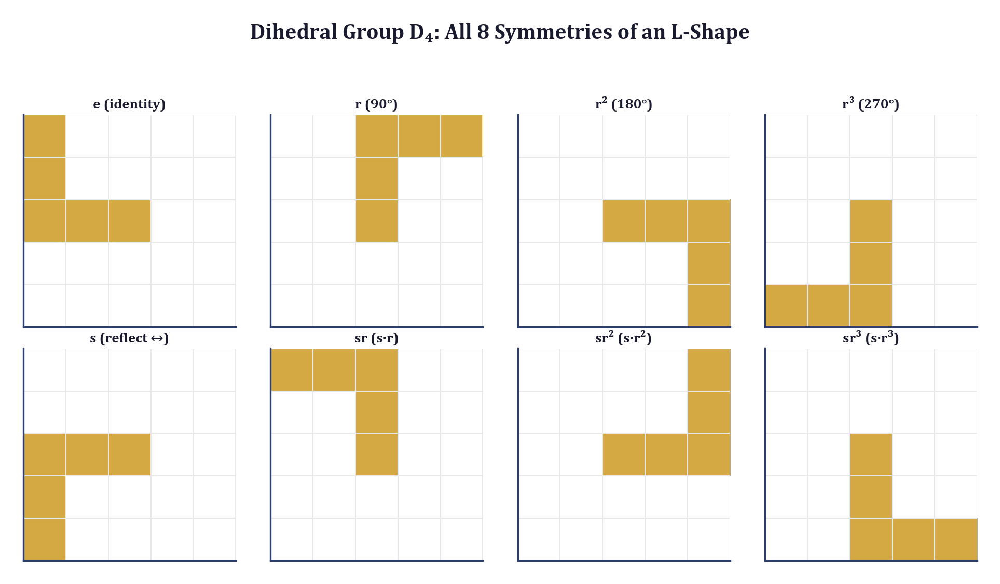

## 13.1 Symmetry as a Computational Resource

### 13.1.1 The Cost of Ignorance

Consider a neural network trained to classify patterns on a square grid. The training set contains 1{,}000 examples. If the network has no built-in knowledge of rotational symmetry, it must learn from the data that a pattern and its 90-degree rotation belong to the same class. This requires seeing both orientations in the training set --- and ideally seeing them with comparable frequency, lest the network develop an orientation bias.

The situation is worse than it appears. The network must not only learn that rotations preserve class identity; it must learn this *independently for each class*. With 50 classes and 4 rotations, the network needs $50 \times 4 = 200$ implicit "symmetry facts," each requiring multiple training examples to learn robustly. These facts are not independent of each other --- they all follow from a single algebraic principle --- but a network without symmetry structure has no way to share this knowledge across classes.

The cost can be quantified. Let $f: \mathcal{X} \to \mathcal{Y}$ be the target function, let $G$ be a symmetry group acting on $\mathcal{X}$, and suppose $f$ is $G$-invariant: $f(g \cdot x) = f(x)$ for all $g \in G$, $x \in \mathcal{X}$. A model that does not exploit this invariance has an effective hypothesis space of size $|\mathcal{H}|$. A model that enforces $G$-invariance reduces the hypothesis space to $|\mathcal{H}| / |G|$ (up to factors depending on the group action's structure). For $D_4$ with $|G| = 8$, this is an eightfold reduction --- equivalent, in sample complexity terms, to having eight times as much training data.

### 13.1.2 Three Ways to Exploit Symmetry

There are three distinct strategies for exploiting a known symmetry group, each with different tradeoffs:

**Data augmentation.** Generate new training examples by applying group elements to existing examples. This is the simplest approach and requires no architectural changes. The training set grows by a factor of $|G|$ (or a subset thereof). The model is free to learn any function; the augmented data *encourages* but does not *guarantee* invariance.

**Equivariant architecture.** Design the network so that its intermediate representations transform predictably under the group action: $\phi(g \cdot x) = \rho(g) \cdot \phi(x)$, where $\rho$ is a representation of $G$ on the feature space. This *guarantees* equivariance by construction but requires specialized layers (e.g., group convolutions). The final invariant prediction is obtained by pooling over the group.

**Symmetrized loss.** Average the loss over the group orbit: $\mathcal{L}_{\text{sym}}(x) = \frac{1}{|G|} \sum_{g \in G} \mathcal{L}(g \cdot x)$. This is intermediate between augmentation and architectural enforcement --- it does not expand the dataset but biases the optimization toward invariant solutions.

This chapter focuses primarily on data augmentation, which is the most widely applicable and the strategy implemented in the ARC-AGI codebase. Section 13.5 discusses equivariant architectures as a complement.

---

## 13.2 The Dihedral Group $D_4$

### 13.2.1 Definition and Elements

The *dihedral group* $D_n$ is the symmetry group of a regular $n$-gon: the set of all rigid motions of the plane that map the $n$-gon to itself. For a square ($n = 4$), the group $D_4$ has eight elements:

| Element | Symbol | Description | Matrix |
|---------|--------|-------------|--------|
| Identity | $e$ | No transformation | $\begin{pmatrix} 1 & 0 \\ 0 & 1 \end{pmatrix}$ |
| Rotation 90 | $r$ | Quarter turn CCW | $\begin{pmatrix} 0 & -1 \\ 1 & 0 \end{pmatrix}$ |
| Rotation 180 | $r^2$ | Half turn | $\begin{pmatrix} -1 & 0 \\ 0 & -1 \end{pmatrix}$ |
| Rotation 270 | $r^3$ | Three-quarter turn CCW | $\begin{pmatrix} 0 & 1 \\ -1 & 0 \end{pmatrix}$ |
| Reflect horizontal | $s$ | Flip across vertical axis | $\begin{pmatrix} -1 & 0 \\ 0 & 1 \end{pmatrix}$ |
| Reflect vertical | $sr$ | Flip across horizontal axis | $\begin{pmatrix} 1 & 0 \\ 0 & -1 \end{pmatrix}$ |
| Reflect main diagonal | $sr^2$ | Transpose | $\begin{pmatrix} 0 & 1 \\ 1 & 0 \end{pmatrix}$ |
| Reflect anti-diagonal | $sr^3$ | Anti-transpose | $\begin{pmatrix} 0 & -1 \\ -1 & 0 \end{pmatrix}$ |

The group is generated by two elements: a rotation $r$ (of order 4) and a reflection $s$ (of order 2), subject to the relation $srs = r^{-1}$. Every element can be written as $s^a r^b$ with $a \in \{0, 1\}$ and $b \in \{0, 1, 2, 3\}$, giving $2 \times 4 = 8$ elements.

### 13.2.2 The Group Multiplication Table

The multiplication (composition) table of $D_4$ encodes how transformations compose. Rather than listing all 64 entries, we note the key structural facts:

- The rotations $\{e, r, r^2, r^3\}$ form a *normal subgroup* isomorphic to $\mathbb{Z}_4$ (the cyclic group of order 4).
- The reflections $\{s, sr, sr^2, sr^3\}$ form a coset, not a subgroup (the composition of two reflections is a rotation).
- $D_4$ is non-abelian: $rs \neq sr$. Specifically, $rs = sr^3$. The order of operations matters.

These algebraic properties have direct computational consequences. The closure property guarantees that composing any two $D_4$ transforms yields another $D_4$ transform --- there are no "missing" augmentations. The non-abelian structure means that the order of reflection and rotation matters, which is why the `all_dihedral` function in the ARC codebase generates all eight transforms explicitly rather than composing rotations and reflections in arbitrary order.

### 13.2.3 Group Actions on Grids

A *group action* of $D_4$ on the set of grids $\mathcal{G} = \{0, \ldots, 9\}^{H \times W}$ is a map $\alpha: D_4 \times \mathcal{G} \to \mathcal{G}$ satisfying:

1. **Identity:** $\alpha(e, G) = G$ for all grids $G$.
2. **Compatibility:** $\alpha(g_1, \alpha(g_2, G)) = \alpha(g_1 g_2, G)$ for all $g_1, g_2 \in D_4$.

For square grids ($H = W$), the action is straightforward: rotations cycle the rows and columns, and reflections flip them. For rectangular grids ($H \neq W$), the 90-degree rotation maps an $H \times W$ grid to a $W \times H$ grid --- the action is still well-defined, but the grid dimensions change. This is a critical implementation detail that naive augmentation code often gets wrong.

The *orbit* of a grid $G$ under $D_4$ is the set of all distinct grids reachable by applying group elements:

$$\text{Orb}(G) = \{ g \cdot G : g \in D_4 \}$$

For a generic grid with no internal symmetry, $|\text{Orb}(G)| = 8$. But a grid with internal symmetry --- such as a checkerboard pattern, which is invariant under 180-degree rotation --- has a smaller orbit. The *stabilizer* $\text{Stab}(G) = \{g \in D_4 : g \cdot G = G\}$ captures the grid's internal symmetry, and the orbit-stabilizer theorem gives:

$$|\text{Orb}(G)| = \frac{|D_4|}{|\text{Stab}(G)|} = \frac{8}{|\text{Stab}(G)|}$$

A grid with 4-fold rotational symmetry (e.g., an X-pattern centered on the grid) has $|\text{Stab}(G)| = 4$ and orbit size 2. A grid with full $D_4$ symmetry (e.g., a single centered pixel) has $|\text{Stab}(G)| = 8$ and orbit size 1 --- augmentation produces no new examples.

---

## 13.3 Implementation: D4 Augmentation for ARC-AGI

### 13.3.1 The Core Transform Functions

The ARC-AGI codebase implements $D_4$ augmentation using NumPy array operations. The fundamental building blocks are rotation and reflection:

```python
def rotate_grid(grid: np.ndarray, k: int = 1) -> np.ndarray:
    """Rotate grid by k * 90 degrees counter-clockwise."""
    return np.rot90(grid, k)


def reflect_grid(grid: np.ndarray, axis: int = 0) -> np.ndarray:
    """Reflect grid.  axis=0 -> vertical flip, axis=1 -> horizontal flip."""
    if axis == 0:
        return np.flipud(grid).copy()
    return np.fliplr(grid).copy()
```

These two functions correspond to the generators $r$ and $s$ of $D_4$. Every group element can be expressed as a composition of these two operations. The `.copy()` call on reflection outputs is a deliberate engineering choice: NumPy's `flipud` and `fliplr` return *views* into the original array, not independent copies. Without the copy, subsequent in-place modifications to the reflected grid would corrupt the original --- a subtle bug that manifests as non-deterministic training behavior.

### 13.3.2 Generating the Full Orbit

The `all_dihedral` function generates all eight $D_4$ transforms of a grid in a single call:

```python
def all_dihedral(grid: np.ndarray) -> List[np.ndarray]:
    """Generate all 8 dihedral group transforms of a grid.

    Returns [identity, rot90, rot180, rot270, flip_h, flip_v, diag1, diag2].
    """
    results = []
    for k in range(4):
        rotated = np.rot90(grid, k)
        results.append(rotated.copy())
    flipped = np.fliplr(grid)
    for k in range(4):
        results.append(np.rot90(flipped, k).copy())
    return results
```

The structure mirrors the algebraic decomposition $D_4 = \{r^b : b = 0,\ldots,3\} \cup \{s \cdot r^b : b = 0,\ldots,3\}$. The first loop generates the four rotations $\{e, r, r^2, r^3\}$. The second loop applies the reflection $s$ (implemented as `fliplr`) and then the four rotations, generating $\{s, sr, sr^2, sr^3\}$. This produces exactly eight grids, corresponding to the eight group elements, with no duplicates (assuming the input grid has trivial stabilizer).

The choice to use `fliplr` (horizontal flip) rather than `flipud` as the reflection generator is a convention. Any reflection would serve as $s$; the horizontal flip is chosen because it composes naturally with `rot90` to produce the diagonal reflections. Specifically:
- `fliplr` followed by `rot90` with $k=1$ gives the main diagonal reflection (transpose).
- `fliplr` followed by `rot90` with $k=3$ gives the anti-diagonal reflection.

### 13.3.3 Consistent Augmentation of Input-Output Pairs

For ARC-AGI tasks, augmentation must be *consistent*: the same transformation applied to both the input and output grids of a training pair, so that the transformation rule $\tau: \text{input} \to \text{output}$ is preserved. If we rotate the input by 90 degrees but not the output, the augmented pair encodes a different (and incorrect) rule.

The `augment_pair` function implements this consistency:

```python
def augment_pair(
    in_grid: np.ndarray,
    out_grid: np.ndarray,
    *,
    n_augments: int = 4,
    seed: int = 42,
) -> List[Tuple[np.ndarray, np.ndarray]]:
    """Augment an input-output pair with consistent transforms.

    Applies the SAME transform to both input and output so the
    transformation rule is preserved.
    """
    rng = np.random.RandomState(seed)
    pairs = []

    for _ in range(n_augments):
        # Random rotation
        k = rng.randint(0, 4)
        aug_in = np.rot90(in_grid, k).copy()
        aug_out = np.rot90(out_grid, k).copy()

        # Random reflection
        if rng.random() > 0.5:
            aug_in = np.fliplr(aug_in).copy()
            aug_out = np.fliplr(aug_out).copy()
        if rng.random() > 0.5:
            aug_in = np.flipud(aug_in).copy()
            aug_out = np.flipud(aug_out).copy()

        # Color permutation (same mapping for both)
        color_seed = rng.randint(0, 2**31)
        aug_in = permute_colors(aug_in, seed=color_seed)
        aug_out = permute_colors(aug_out, seed=color_seed)

        pairs.append((aug_in, aug_out))

    return pairs
```

Three design choices merit attention.

First, the function samples *random* group elements rather than generating the entire orbit. With $n\_augments = 4$, it produces four random augmentations, not all eight $D_4$ transforms. This is a deliberate trade-off: during test-time training (Section 13.4), generating the full orbit of every training pair would increase the training set by a factor of 8, slowing each refinement step. Random sampling provides most of the benefit at lower cost.

Second, the function composes $D_4$ transforms with *color permutations*. Color permutations form a separate symmetry group --- the symmetric group $S_9$ acting on the nine non-background colors (Section 13.7) --- and the combination generates elements of the *direct product* $D_4 \times S_9$. This larger group has $8 \times 9! = 2{,}903{,}040$ elements, far too many to enumerate, which is why random sampling is essential.

Third, the use of a deterministic `seed` parameter ensures that augmentation is reproducible. Given the same input pair and seed, the function returns the same augmented pairs. This is critical for debugging and for ensuring that test-time training is deterministic across runs.

---

## 13.4 The ARC-AGI Application

### 13.4.1 Why ARC Puzzles Have Natural $D_4$ Symmetry

The Abstraction and Reasoning Corpus (ARC-AGI) presents tasks as collections of input-output grid pairs. Each task encodes a transformation rule that the solver must infer from the training pairs and apply to unseen test inputs. The grids use a palette of 10 colors (integers 0--9) on grids up to 30 by 30.

Most ARC transformation rules are *geometric* in nature: fill a region, extend a pattern, reflect a shape, complete a symmetry. These rules are typically invariant under the $D_4$ action --- a rule that says "extend the pattern rightward" becomes "extend the pattern downward" after a 90-degree rotation, but the *abstract* rule (extend in the direction of the pattern's orientation) is the same. By augmenting with $D_4$, the solver sees the rule from multiple orientations and learns the abstract principle rather than a specific directional instantiation.

This connects directly to the hyperbolic rule encoding developed in Chapter 3. The `HyperbolicRuleEncoder` maps transformation rules into the Poincare ball, where abstract rules cluster near the origin and specific sub-rules occupy the periphery. When the training pairs are augmented with $D_4$ transforms, the pair encoder sees eight orientations of the same abstract rule. The resulting hyperbolic embeddings cluster more tightly --- the augmented pairs reinforce the abstract rule signal while averaging out the orientation-specific noise.

### 13.4.2 Augmentation in the Solver Pipeline

The ARC solver's test-time training loop uses augmentation as a core component. The `refine_on_task` method augments each training pair before fine-tuning:

```python
def refine_on_task(self, train_pairs, device):
    from arc_prize.augment import augment_pair

    all_pairs = list(train_pairs)
    for in_grid, out_grid in train_pairs:
        for aug_in, aug_out in augment_pair(
            in_grid, out_grid,
            n_augments=self.config.n_augments,
        ):
            all_pairs.append((aug_in, aug_out))

    # Fine-tune on all_pairs (original + augmented) ...
```

With the default configuration of `n_augments=4`, each original training pair generates 4 augmented copies, expanding the training set by a factor of 5. The solver then runs leave-one-out training on this expanded set: for each pair, it infers the rule from all other pairs and predicts the held-out pair's output. The augmented pairs provide additional viewpoints on the same rule, making the inferred rule more robust.

The `solve_task` method also uses augmentation to generate a second candidate output:

```python
# Generate second candidate with augmented rule inference
aug_pairs = []
for in_g, out_g in train_pairs:
    augs = augment_pair(in_g, out_g, n_augments=2, seed=99)
    aug_pairs.extend(augs)
z_rule_alt = self.infer_rule(aug_pairs, device)
candidate_2 = self.predict(z_rule_alt, test_input, device)
```

This is a particularly elegant use of augmentation. ARC allows two submission attempts per test input. The solver uses the original training pairs for the first attempt and augmented pairs for the second. Because the augmented pairs emphasize the transformation rule from different orientations, the alternative rule encoding $z\_rule\_alt$ may capture aspects of the rule that the original encoding missed --- especially for rules with strong directional components.

### 13.4.3 Interaction with Structure Probing

Chapter 10 introduced the structure probing framework, which applies parametric transforms to grids and measures latent displacement to discover what invariances the model has learned. The connection to $D_4$ augmentation is direct: the `rotate`, `reflect_h`, and `reflect_v` parametric transforms in the probe suite are exactly the generators of $D_4$.

A model trained *without* $D_4$ augmentation will exhibit high latent displacement under rotations and reflections --- the probe reveals that the model has not learned rotational or reflective invariance. A model trained *with* $D_4$ augmentation should exhibit low displacement under these same transforms, because the augmented training data teaches the model that rotated and reflected grids are equivalent.

The structure probe's robustness index (Chapter 10, Section 10.3) thus provides a quantitative measure of how effectively augmentation has been absorbed. A model with high robustness index separates structural invariants (low displacement under $D_4$ transforms) from stress transforms (high displacement under noise and dropout). If $D_4$ augmentation is working correctly, the invariant transforms should produce near-zero displacement; any residual displacement indicates that the model has incompletely learned the symmetry.

This creates a diagnostic loop: augment, train, probe, and iterate. If probing reveals that the model remains sensitive to 90-degree rotation despite augmentation, possible causes include insufficient augmentation (increase `n_augments`), architectural bottlenecks (the encoder may lack the capacity to represent rotational invariance), or training instability (the augmented examples may be overwhelming the original signal). The probe provides the diagnostic; the group theory provides the remedy.

---

## 13.5 Equivariant Architectures

### 13.5.1 From Augmentation to Equivariance

Data augmentation teaches the model invariance through examples. An equivariant architecture enforces it through structure. The distinction is analogous to the difference between testing a program and proving it correct: augmentation checks invariance empirically; equivariance guarantees it mathematically.

A function $\phi: \mathcal{X} \to \mathcal{F}$ is *equivariant* with respect to a group $G$ if there exist group actions on $\mathcal{X}$ and $\mathcal{F}$ such that:

$$\phi(g \cdot x) = g \cdot \phi(x) \quad \text{for all } g \in G, \; x \in \mathcal{X}$$

Note that the group acts on the *output* space as well as the *input* space. Equivariance does not mean that the representation is unchanged by the group action (that would be invariance); it means that the representation transforms *predictably*. A standard CNN convolution layer is equivariant to translations: shifting the input shifts the feature map by the same amount. But standard convolutions are *not* equivariant to rotations --- rotating the input does not simply rotate the feature maps.

### 13.5.2 Group Convolutions

A *group convolution* extends the convolution operation to be equivariant to a finite group $G$. For the standard convolution on $\mathbb{Z}^2$, the output at position $x$ is:

$$[f * \psi](x) = \sum_{y \in \mathbb{Z}^2} f(y) \, \psi(x - y)$$

For a group convolution with group $G$, the output at group element $g$ is:

$$[f *_G \psi](g) = \sum_{h \in G} f(h) \, \psi(g^{-1}h)$$

In the first layer, the input is a function on $\mathbb{Z}^2$ and the filter is evaluated at all group elements applied to each spatial position. In subsequent layers, both input and output are functions on $G \times \mathbb{Z}^2$. For $D_4$, this means each spatial position carries 8 feature values, one for each group element, and the convolution respects the group structure.

The practical implications for ARC grid processing are significant. A $D_4$-equivariant encoder would guarantee that the latent representation of a rotated grid is a predictable transformation of the original grid's representation. The final invariant representation is obtained by pooling (averaging or max-pooling) over the group dimension:

$$z_{\text{inv}}(x) = \frac{1}{|G|} \sum_{g \in G} z(g, x)$$

This pooling step converts equivariance to invariance. The intermediate equivariant features retain orientation information (useful for predicting oriented outputs), while the pooled features discard it (useful for classification or rule inference).

### 13.5.3 Why ARC Uses Augmentation Instead

The ARC-AGI solver uses data augmentation rather than $D_4$-equivariant convolutions for three pragmatic reasons.

First, ARC grids are small (up to 30 by 30) and the group is small ($|D_4| = 8$). The computational overhead of augmentation --- generating 8 copies of each grid --- is negligible compared to the cost of the test-time training loop. Equivariant convolutions would reduce training-time cost but add architectural complexity.

Second, ARC tasks sometimes violate $D_4$ symmetry. A rule that says "fill the rightmost column with red" is *not* invariant under 90-degree rotation --- the rotated rule fills the top row, not the rightmost column. For such tasks, $D_4$-equivariant features would be *less* informative than orientation-specific features. Augmentation handles this naturally: the solver sees the rule from multiple orientations and learns to predict the orientation-appropriate output. An equivariant architecture would need an explicit mechanism to break symmetry when the task demands it.

Third, the solver combines $D_4$ transforms with color permutations. Building an architecture equivariant to $D_4 \times S_9$ is substantially more complex than building one equivariant to $D_4$ alone, while augmenting with elements of the product group is straightforward (as shown in Section 13.3.3).

---

## 13.6 The Orbit-Stabilizer Theorem in Practice

### 13.6.1 Detecting Redundant Augmentations

Not every grid benefits equally from augmentation. A grid with internal symmetry --- such as a rotationally symmetric pattern --- produces duplicate augmentations, wasting computation and biasing the training set.

The orbit-stabilizer theorem gives a precise count. For a grid $G$ with stabilizer subgroup $\text{Stab}(G) \leq D_4$:

$$|\text{Orb}(G)| \cdot |\text{Stab}(G)| = |D_4| = 8$$

The possible stabilizer sizes are 1, 2, 4, and 8, corresponding to orbit sizes 8, 4, 2, and 1. The following code detects the stabilizer by checking each group element:

```python
def compute_stabilizer(grid: np.ndarray) -> list[str]:
    """Find all D4 elements that leave the grid unchanged."""
    from arc_prize.augment import all_dihedral

    labels = ["e", "r", "r2", "r3", "s", "sr", "sr2", "sr3"]
    transforms = all_dihedral(grid)
    stabilizer = []
    for label, transformed in zip(labels, transforms):
        if np.array_equal(transformed, grid):
            stabilizer.append(label)
    return stabilizer


def unique_orbit(grid: np.ndarray) -> list[np.ndarray]:
    """Return only the distinct grids in the D4 orbit."""
    from arc_prize.augment import all_dihedral

    orbit = all_dihedral(grid)
    unique = [orbit[0]]
    for g in orbit[1:]:
        if not any(np.array_equal(g, u) for u in unique):
            unique.append(g)
    return unique
```

In practice, grids with large stabilizers are rare in ARC --- most task grids are asymmetric, yielding the full orbit of 8. But when they do occur, the duplicate augmentations can subtly bias training. If a symmetric grid has orbit size 2 while asymmetric grids have orbit size 8, the symmetric grid is overrepresented by a factor of 4 in the augmented training set. For large-scale training this may not matter; for the few-shot regime of ARC (typically 2--4 training pairs per task), it can shift the inferred rule toward the symmetric example.

### 13.6.2 Burnside's Lemma and Counting Distinct Patterns

A related question arises in ARC task analysis: *how many truly distinct grid patterns exist*, up to $D_4$ equivalence? Burnside's lemma (also known as the Cauchy-Frobenius lemma) answers this:

$$|\mathcal{G} / D_4| = \frac{1}{|D_4|} \sum_{g \in D_4} |X^g|$$

where $X^g = \{G \in \mathcal{G} : g \cdot G = G\}$ is the set of grids fixed by group element $g$. For 10-color grids of size $n \times n$:

- The identity $e$ fixes all $10^{n^2}$ grids.
- A 90-degree rotation $r$ fixes grids with 4-fold rotational symmetry. For an $n \times n$ grid with $n$ even, the number of fixed grids is $10^{n^2/4}$. For $n$ odd, it is $10^{(n^2-1)/4 + 1}$.
- A 180-degree rotation $r^2$ fixes grids with 2-fold symmetry: $10^{\lceil n^2/2 \rceil}$ grids.
- Reflections fix grids symmetric about the corresponding axis: $10^{\lceil n^2/2 \rceil}$ for axis-aligned reflections, $10^{(n^2+n)/2}$ for diagonal reflections (when $n$ is such that the diagonal maps the grid to itself).

For a 5 by 5 grid with 10 colors, the total number of grids is $10^{25} \approx 10^{25}$, while the number of $D_4$-equivalence classes is approximately $10^{25}/8 \approx 1.25 \times 10^{24}$. The correction from Burnside's lemma is negligible for large grids because almost all grids are asymmetric. But for small grids (3 by 3, common in ARC), the correction is significant: of the $10^9$ possible grids, a meaningful fraction have nontrivial stabilizers.

---

## 13.7 Extending Beyond $D_4$

### 13.7.1 Color Permutation Groups

The 10 ARC colors form a set $C = \{0, 1, \ldots, 9\}$, and a *color permutation* is a bijection $\sigma: C \to C$. The set of all such permutations is the symmetric group $S_{10}$ of order $10! = 3{,}628{,}800$. However, color 0 has a distinguished role as the background, so the relevant group is typically $S_9$ (permutations of colors 1--9, fixing 0), with order $9! = 362{,}880$.

The `permute_colors` function in the ARC codebase samples random elements of $S_9$:

```python
def permute_colors(grid: np.ndarray, seed: int = 0) -> np.ndarray:
    """Randomly permute non-background colors (1-9)."""
    rng = np.random.RandomState(seed)
    perm = list(range(10))
    non_bg = perm[1:]
    rng.shuffle(non_bg)
    perm[1:] = non_bg
    result = grid.copy()
    for old, new in enumerate(perm):
        if old != new:
            result[grid == old] = new
    return result
```

Color permutations commute with $D_4$ transforms: rotating a color-permuted grid is the same as color-permuting a rotated grid. This means the combined symmetry group is the *direct product* $D_4 \times S_9$, with order $8 \times 362{,}880 = 2{,}903{,}040$. No training set can cover even a fraction of this group exhaustively, which is why `augment_pair` samples randomly from it.

Not all ARC tasks are invariant under arbitrary color permutations. A task whose rule depends on specific color identities (e.g., "replace all blue cells with red") is not $S_9$-invariant. The solver handles this implicitly: the test-time training loop fine-tunes on augmented examples, and if color permutations produce examples that conflict with the true rule, the model learns to downweight them. This is a form of *soft* symmetry exploitation, where the model uses the group orbit as a regularizer but does not enforce strict invariance.

### 13.7.2 Translation Groups

Square grids support cyclic translations: shifting all cells by $(dr, dc)$ with wraparound. The group of all such translations is $\mathbb{Z}_H \times \mathbb{Z}_W$ for an $H \times W$ grid, with $H \cdot W$ elements. The `_translate` transform in the probing framework implements this:

```python
def _translate(grid: np.ndarray, intensity: float) -> np.ndarray:
    """Shift grid contents, wrapping around."""
    if intensity < 0.01:
        return grid.copy()
    h, w = grid.shape
    shift_r = int(intensity * h * 0.5) % h
    shift_c = int(intensity * w * 0.5) % w
    return np.roll(np.roll(grid, shift_r, axis=0), shift_c, axis=1)
```

Translation invariance is appropriate for tasks involving periodic patterns (e.g., tilings) but inappropriate for tasks where absolute position matters (e.g., "the red cell is in the top-left corner"). The parametric intensity control allows the probing framework to test translation sensitivity at multiple scales, revealing whether the model's rule inference depends on absolute position.

The full spatial symmetry group of a square grid (combining $D_4$ with translations) is the *semidirect product* $(\mathbb{Z}_n \times \mathbb{Z}_n) \rtimes D_4$, which has $8n^2$ elements. For a 30 by 30 grid, this is $8 \times 900 = 7{,}200$ elements --- large enough that exhaustive enumeration is impractical but small enough that random sampling is effective.

### 13.7.3 Scale Symmetries

The `_scale_up` transform in the probing suite tests invariance to integer scaling: repeating each cell to produce a grid at 2x or 3x resolution. Scale invariance is relevant for ARC tasks involving patterns at multiple scales (e.g., "the output is the input tiled 2x2"). The scaling group is not a standard algebraic group (scaling by 2 and then by 3 gives scaling by 6, but scaling by 2 and then by 1/2 requires a non-integer inverse), but for the integer-valued scales relevant to discrete grids, it forms a multiplicative semigroup.

### 13.7.4 Continuous Symmetries

The groups discussed so far are *discrete* (finite or countably infinite). Many important symmetries are *continuous*: the rotation group $SO(2)$ (all planar rotations), the Euclidean group $E(2)$ (rotations + translations), and the affine group $\text{Aff}(2)$ (linear maps + translations). These arise naturally in image recognition, physics simulation, and molecular modeling.

Discrete grids break continuous symmetries: a square grid admits only 4 rotations, not continuous rotation. But in the *feature space* of a neural network, continuous rotations are well defined. An equivariant network can learn features that transform under continuous rotation representations even though the input admits only discrete rotations. This is the bridge between the discrete $D_4$ augmentation of this chapter and the continuous geometric methods of Chapters 2--5.

For the structural fuzzing framework, continuous symmetries enter through the Lie group formalism. A Lie group $G$ is a smooth manifold with a group structure, and its *Lie algebra* $\mathfrak{g}$ is the tangent space at the identity, which captures infinitesimal symmetry transformations. The exponential map $\exp: \mathfrak{g} \to G$ connects infinitesimal and finite transformations. For $SO(2)$, the Lie algebra is one-dimensional (parameterized by the angular velocity), and the exponential map is $\exp(\omega) = R(\omega)$, the rotation by angle $\omega$. For $D_4$, the Lie algebra is trivial (discrete groups have no infinitesimal structure), which is why $D_4$ augmentation is implemented directly rather than through differential geometry.

---

## 13.8 The Algebra of Augmentation Pipelines

### 13.8.1 Augmentation as a Group Homomorphism

An augmentation pipeline can be formalized as a *group homomorphism* from the symmetry group $G$ to the group of bijections on the data space $\mathcal{X}$:

$$\rho: G \to \text{Bij}(\mathcal{X}), \quad g \mapsto T_g$$

where $T_g: \mathcal{X} \to \mathcal{X}$ is the transform corresponding to group element $g$. The homomorphism property requires:

$$T_{g_1 g_2} = T_{g_1} \circ T_{g_2} \quad \text{for all } g_1, g_2 \in G$$

This is precisely the compatibility condition of a group action (Section 13.2.3). A correct augmentation pipeline is one whose transforms faithfully represent the group structure. An incorrect pipeline --- one where the composition of two transforms does not equal the transform of the composition --- produces inconsistent augmentations that confuse rather than help the model.

### 13.8.2 Verifying Group Structure

The group axioms provide a checklist for verifying an augmentation implementation:

1. **Closure.** Composing any two augmentations yields an augmentation in the set. For `all_dihedral`, this means that applying any $D_4$ transform to any output of `all_dihedral` produces another output of `all_dihedral` (possibly a different element of the same orbit).

2. **Associativity.** $(T_{g_1} \circ T_{g_2}) \circ T_{g_3} = T_{g_1} \circ (T_{g_2} \circ T_{g_3})$. This is automatically satisfied because function composition is associative.

3. **Identity.** $T_e = \text{id}$. The first element of `all_dihedral`'s output is the unmodified grid.

4. **Inverses.** For each $T_g$, there exists $T_{g^{-1}}$ such that $T_g \circ T_{g^{-1}} = \text{id}$. Rotations are their own inverses modulo 4: the inverse of `rot90` ($k=1$) is `rot90` ($k=3$).

A unit test that verifies these properties for the ARC augmentation code:

```python
def test_d4_group_structure():
    """Verify that all_dihedral produces a valid D4 orbit."""
    grid = np.array([[1, 2, 3], [4, 5, 6], [7, 8, 9]])
    orbit = all_dihedral(grid)

    # Exactly 8 elements
    assert len(orbit) == 8

    # All distinct (this grid has trivial stabilizer)
    for i in range(8):
        for j in range(i + 1, 8):
            assert not np.array_equal(orbit[i], orbit[j])

    # Closure: applying any D4 element to any orbit member
    # gives another orbit member
    for g in orbit:
        g_orbit = all_dihedral(g)
        for h in g_orbit:
            assert any(np.array_equal(h, o) for o in orbit)

    # Identity: first element is the original grid
    assert np.array_equal(orbit[0], grid)

    # Inverse: for each element, there exists an element
    # whose composition gives the identity
    for g in orbit:
        g_orbit = all_dihedral(g)
        # The orbit of g contains g's inverse applied to g = identity
        assert any(np.array_equal(o, grid) for o in g_orbit)
```

This test is not merely pedagogical. Augmentation bugs --- where the implemented transforms do not form a group --- are a real source of training degradation. A common mistake is implementing reflections as views rather than copies (Section 13.3.1), which causes subsequent rotations to modify the original, breaking the group structure.

---

## 13.9 Connection to the Geometric Framework

### 13.9.1 Symmetry in the State Space

The geometric framework of this book represents model configurations as points in a multi-dimensional state space (Chapter 1). Symmetry groups act on this state space, mapping one configuration to an equivalent one. The orbit of a configuration under the symmetry group defines an *equivalence class*, and the quotient space $\mathcal{S} / G$ (the space of equivalence classes) is the effective search space.

For the ARC solver, the state space includes the encoder parameters, the rule embedding, and the decoder parameters. The $D_4$ symmetry acts on this space indirectly: two parameter configurations that differ only in how they represent rotated patterns are equivalent. Data augmentation does not reduce the parameter space directly, but it biases optimization toward configurations that are symmetric under $D_4$, effectively projecting the search onto the quotient space.

### 13.9.2 Orbits as Geodesics

On a Riemannian manifold, the orbit of a point under a continuous symmetry group traces a *geodesic* (or more generally, a curve with specific geometric properties). For discrete groups, the orbit is a finite set of points, but the distances between orbit elements are determined by the group structure and the manifold's geometry.

In the Poincare ball (Chapter 3), where ARC rules are embedded, the $D_4$ action on rules has a geometric interpretation. If a rule $h \in \mathbb{B}^d$ encodes "fill the rightmost column," then $r \cdot h$ (the rotated rule) encodes "fill the bottom row." In hyperbolic space, these two rules are at a specific hyperbolic distance determined by how the encoder maps directional information. A well-trained encoder that has absorbed $D_4$ augmentation will place these rules close together (they are the same abstract rule), while an encoder without augmentation may place them far apart (they look like different rules in different orientations).

The hyperbolic distance between orbit elements thus provides a *direct measure of how well augmentation is working*. This complements the probing-based measure from Section 13.4.3: probing measures invariance at the grid level (does the encoder produce the same representation for rotated grids?), while hyperbolic orbit distance measures invariance at the rule level (does the rule encoder produce the same rule for rotated training pairs?).

### 13.9.3 Equivariance and Parallel Transport

There is a deep connection between equivariance and the geometric operation of *parallel transport*. Parallel transport moves a tangent vector along a curve on a manifold while preserving its "direction" relative to the manifold's geometry. An equivariant function $\phi$ satisfying $\phi(g \cdot x) = g \cdot \phi(x)$ can be understood as preserving the group action under the map $\phi$ --- the group element is "transported" from the input space to the feature space without distortion.

When the group is continuous, this connection can be made precise through the theory of *fiber bundles*: the feature space is a fiber bundle over the input space, with the group acting on the fibers, and equivariance corresponds to a specific type of bundle morphism. For the discrete group $D_4$, the fiber bundle formalism simplifies to a direct product, but the conceptual connection remains: equivariance is the algebraic expression of geometric compatibility between the input and feature spaces.

---

## 13.10 Practical Guidelines

### 13.10.1 When to Augment

Augment when:
- The symmetry group is *known* and the target function is invariant under it (or nearly so).
- The training set is small relative to the orbit size (as in ARC's few-shot regime).
- The model architecture does not enforce equivariance by construction.

Do *not* augment when:
- The symmetry is approximate and the approximation error exceeds the benefit. A 5-degree rotation is not a symmetry of a discrete grid; the interpolation artifacts may hurt more than the augmentation helps.
- The task explicitly breaks the symmetry. If the label depends on orientation, rotation augmentation teaches the model to ignore orientation --- the opposite of what is needed.
- The augmented dataset becomes so large that training time is dominated by redundant examples. For $D_4$ with 8 elements, this is rarely an issue; for $S_9$ with 362{,}880 elements, random sampling is essential.

### 13.10.2 How Many Augmentations

For a finite group $G$ acting on a training set of $N$ examples, each with orbit size $|G|$ (assuming trivial stabilizers), the fully augmented set has $N \cdot |G|$ elements. The optimal number of augmentations per example depends on the training regime:

- **Full orbit.** Use when $|G|$ is small (e.g., $|D_4| = 8$) and training time permits. This provides exact coverage of the symmetry.
- **Random sampling.** Use when $|G|$ is large or training time is constrained. Sample $k$ random group elements per example, where $k$ is tuned on a validation set. The ARC solver uses $k = 4$ as a default.
- **Adaptive sampling.** Sample more augmentations for examples with high training loss, fewer for well-learned examples. This is not implemented in the current ARC codebase but is a natural extension.

### 13.10.3 Verifying Augmentation Effectiveness

Three diagnostics assess whether augmentation is helping:

1. **Validation loss.** Compare validation loss with and without augmentation. If augmentation hurts, the symmetry assumption may be wrong or the model may be capacity-limited.

2. **Probing invariance.** Use the structure probe (Chapter 10) to measure latent displacement under group transforms. Post-augmentation displacement should be lower than pre-augmentation displacement for the targeted transforms.

3. **Orbit consistency.** For each test input, generate all $|G|$ augmented versions, predict outputs for each, and un-transform the predictions. If the model has learned the symmetry, all $|G|$ predictions should agree. The rate of disagreement quantifies residual equivariance error.

---

## 13.11 Summary

Symmetry is not decoration --- it is a computational resource. The dihedral group $D_4$, with its eight elements, is the natural symmetry group of square-grid problems and provides an eightfold multiplication of training signal at negligible cost. The algebra ensures that augmentation is complete (every equivalent configuration is reachable) and non-redundant (the orbit-stabilizer theorem counts duplicates). Consistent augmentation of input-output pairs preserves transformation rules, making $D_4$ augmentation particularly valuable for the few-shot rule inference that ARC-AGI demands.

The key ideas of this chapter are:

1. **Symmetry groups formalize augmentation.** The group axioms (closure, associativity, identity, inverses) provide a mathematical guarantee that augmented examples are complete and consistent.

2. **$D_4$ is the symmetry group of square grids.** Its eight elements --- four rotations and four reflections --- form the exhaustive set of rigid symmetries, and the `all_dihedral` function generates the complete orbit.

3. **Consistent augmentation preserves rules.** For input-output pair tasks, the same group element must be applied to both input and output, as implemented in `augment_pair`.

4. **Augmentation complements probing.** The structure probe (Chapter 10) measures whether augmentation has been absorbed; the hyperbolic rule encoder (Chapter 3) measures whether augmented training pairs produce consistent rule embeddings.

5. **The group extends.** Combining $D_4$ with color permutations ($S_9$), translations ($\mathbb{Z}_H \times \mathbb{Z}_W$), and scalings produces a large symmetry group that is best explored by random sampling.

---

## 13.12 Forward: Symmetry-Aware Fuzzing

Chapter 14 introduces gradient reversal and invariance training, complementary techniques for building robust representations. Where this chapter used symmetry to generate *equivalent* training examples via known group actions, Chapter 14 addresses nuisance variables that cannot be characterized as group actions (recording conditions, domain identity) by learning invariances through adversarial training. The probing framework of Chapter 10 provides the detection mechanism; the group theory of this chapter provides specified invariances; and Chapter 14 provides learned invariances---together covering the full invariance spectrum.


\newpage

# Chapter 14: Gradient Reversal and Invariance Training

> *"The encoder that remembers everything is the encoder that has learned nothing."*
> --- Paraphrase of a principle from domain adaptation theory

Chapter 9 introduced adversarial robustness testing: probing a model's behavior under perturbation to discover where and how it breaks. That methodology is *diagnostic*---it measures fragility after the fact. This chapter introduces a complementary technique that is *prescriptive*: gradient reversal training, which forces an encoder to become invariant to specified nuisance variables during training itself. Where Chapter 9 asks "does the model break when we push it?", this chapter asks "can we build a model that *cannot* encode information we do not want it to have?"

The motivation is immediate and practical. An encoder trained to classify sperm whale coda types from spectrograms will, left to its own devices, happily memorize the recording conditions---hydrophone frequency response, ambient noise spectrum, ocean reverberation profile---alongside the biological signal. It achieves excellent accuracy on the training set because the recording conditions are correlated with the deployment location, and the deployment location is correlated with the whale clan. The encoder has learned a shortcut: predict the clan, then predict the coda type. On a new hydrophone, deployed in a new ocean basin, this encoder fails catastrophically, because the shortcut no longer holds.

This is not a pathology specific to cetacean bioacoustics. It is the central problem of **domain adaptation**, and it arises whenever surface features are correlated with target labels in the training data but not in the deployment environment. The gradient reversal layer, introduced by Ganin and Lempitsky (2015) and developed further by Ganin et al. (2016), provides an elegant solution: attach an adversarial classifier to the encoder's latent representation, train it to predict the nuisance variable (recording conditions, domain identity, speaker identity), and then *reverse the gradient* flowing back through the encoder, so that the encoder is trained to make the adversarial classifier's job *impossible*. The result is a representation that is invariant to the nuisance variable by construction.

We begin with a precise statement of the invariance problem (Section 14.1), develop the gradient reversal layer and its training procedure (Section 14.2), give the geometric interpretation as projection onto the orthogonal complement of a nuisance subspace (Section 14.3), implement the full system in PyTorch (Section 14.4), apply it to cetacean bioacoustics (Section 14.5), connect to the adversarial robustness framework of Chapter 9 (Section 14.6), and close with forward connections to the group-theoretic augmentation methods of Chapter 15.

---

## 14.1 The Invariance Problem

### 14.1.1 Encoders That Memorize Surface Features

Consider an encoder $f_\theta : \mathcal{X} \to \mathcal{Z}$ that maps raw inputs (spectrograms, images, text) to a latent representation $\mathbf{z} = f_\theta(\mathbf{x}) \in \mathbb{R}^d$. A task classifier $g_\phi : \mathcal{Z} \to \mathcal{Y}$ then maps the representation to predictions. The standard training objective minimizes the task loss:

$$\mathcal{L}_{\text{task}}(\theta, \phi) = \mathbb{E}_{(\mathbf{x}, y) \sim \mathcal{D}}\left[\ell\big(g_\phi(f_\theta(\mathbf{x})), y\big)\right]$$

This objective says nothing about *what* the encoder should learn. It only demands that the composition $g_\phi \circ f_\theta$ produce correct predictions. The encoder is free to use any feature of the input that is predictive of the label---including features that are predictive only because of spurious correlations in the training data.

Formally, let $s \in \mathcal{S}$ be a **nuisance variable**---an attribute of the input that we do not want the encoder to depend on. In bioacoustics, $s$ might be the recording device, the ocean basin, or the time of year. In medical imaging, $s$ might be the scanner model or the hospital. In NLP, $s$ might be the author's dialect or the document's formatting.

The standard training objective places no constraint on the mutual information $I(\mathbf{z}; s)$ between the latent representation and the nuisance variable. If $s$ is correlated with $y$ in the training data, gradient descent will cheerfully exploit that correlation, producing an encoder for which $I(\mathbf{z}; s)$ is high. The encoder has memorized the surface features.

### 14.1.2 The Domain Shift Failure Mode

The consequence of high $I(\mathbf{z}; s)$ is predictable: when the correlation between $s$ and $y$ breaks down---because the model is deployed on a new domain, a new device, or a new population---the encoder's predictions degrade. This is **domain shift**, and it is one of the most common failure modes in applied machine learning.

The adversarial robustness framework of Chapter 9 can *detect* this failure mode after training. The Decoder Robustness Index (DRI), adapted from the Bond Index, applies parametric acoustic transforms at varying intensities and measures how the decoder's output changes:

```python
# From eris_ketos.decoder_robustness — diagnosis after the fact
dri = DecoderRobustnessIndex(transforms)
result = dri.measure(decoder, signals, labels, sr=32000)
# result.per_transform reveals which transforms cause the most drift
```

The DRI tells you *that* the model is sensitive to recording conditions. Gradient reversal tells the model *not to be*.

### 14.1.3 The Invariance Objective

The goal is to learn a representation $\mathbf{z} = f_\theta(\mathbf{x})$ such that:

1. **Task performance**: $\mathbf{z}$ is highly predictive of the target label $y$.
2. **Nuisance invariance**: $\mathbf{z}$ is *not* predictive of the nuisance variable $s$.

In information-theoretic terms, we want to maximize $I(\mathbf{z}; y)$ while minimizing $I(\mathbf{z}; s)$. These objectives are in tension whenever $y$ and $s$ are correlated. The gradient reversal layer resolves this tension through adversarial training.

---

## 14.2 The Gradient Reversal Layer

### 14.2.1 Architecture

The domain-adversarial neural network (DANN) architecture, introduced by Ganin et al. (2016), augments the standard encoder-classifier pair with a **domain discriminator** $h_\psi : \mathcal{Z} \to \mathcal{S}$ that attempts to predict the nuisance variable from the latent representation:

```
                          ┌──────────────┐
                          │ Task Head    │
                   ┌─────>│ g_φ(z) → y   │
                   │      └──────────────┘
┌──────────┐      │
│ Encoder  │──z──>│
│ f_θ(x)   │      │      ┌──────────────┐
└──────────┘      │  GRL  │ Domain Head  │
                   └──×──>│ h_ψ(z) → s   │
                          └──────────────┘
```

The key innovation is the **gradient reversal layer (GRL)**, denoted by the $\times$ symbol in the diagram. During the forward pass, the GRL is the identity function: it passes $\mathbf{z}$ through unchanged. During the backward pass, it *negates* the gradient:

$$\text{GRL}(\mathbf{z}) = \mathbf{z} \quad \text{(forward)}$$
$$\frac{\partial \text{GRL}}{\partial \mathbf{z}} = -\lambda \mathbf{I} \quad \text{(backward)}$$

where $\lambda > 0$ is a scaling factor that controls the strength of the adversarial signal.

### 14.2.2 The Combined Loss

The full training objective is:

$$\mathcal{L}(\theta, \phi, \psi) = \mathcal{L}_{\text{task}}(\theta, \phi) - \lambda \, \mathcal{L}_{\text{domain}}(\theta, \psi)$$

where:
- $\mathcal{L}_{\text{task}}$ is the standard task loss (e.g., cross-entropy for classification).
- $\mathcal{L}_{\text{domain}}$ is the domain discriminator's loss (also typically cross-entropy).
- $\lambda$ controls the tradeoff between task performance and domain invariance.

The sign convention is critical. The domain discriminator parameters $\psi$ are trained to *minimize* $\mathcal{L}_{\text{domain}}$---the discriminator gets better at predicting the nuisance variable. But the encoder parameters $\theta$ receive the *negated* gradient from $\mathcal{L}_{\text{domain}}$, so they are trained to *maximize* it---the encoder gets better at fooling the discriminator.

This is a minimax game:

$$\min_{\theta, \phi} \max_\psi \; \mathcal{L}_{\text{task}}(\theta, \phi) - \lambda \, \mathcal{L}_{\text{domain}}(\theta, \psi)$$

At equilibrium, the domain discriminator performs at chance level: the latent representation contains no information about the nuisance variable, so no classifier can predict it above baseline.

### 14.2.3 Why Not Just Remove the Nuisance Variable?

A natural question: why not simply remove the nuisance variable from the input? If recording conditions are the problem, preprocess the audio to normalize them.

The answer is that nuisance variables are rarely cleanly separable from the signal of interest. A hydrophone's frequency response shapes the spectrogram globally---it is not a feature you can mask out. Ocean reverberation creates echoes that overlap with the biological signal. Ambient noise occupies the same frequency bands as whale clicks. The nuisance and the signal are *entangled* in the input, and no preprocessing step can disentangle them without also removing biological information.

Gradient reversal operates at the representation level, where the entanglement has been partially resolved by the encoder's learned features. The adversarial training forces the encoder to resolve the entanglement *further*, retaining the biological information while discarding the recording-condition information. This is a strictly more powerful approach than input-level preprocessing, because the encoder can learn nonlinear disentanglements that no fixed preprocessing pipeline can express.

---

## 14.3 The Geometric Interpretation

### 14.3.1 The Latent Space as a Vector Space

The latent representation $\mathbf{z} \in \mathbb{R}^d$ lives in a $d$-dimensional vector space. Within this space, we can identify two subspaces:

- **The task subspace** $\mathcal{V}_{\text{task}} \subseteq \mathbb{R}^d$: the directions along which $\mathbf{z}$ varies in ways that are predictive of $y$.
- **The nuisance subspace** $\mathcal{V}_{\text{nuis}} \subseteq \mathbb{R}^d$: the directions along which $\mathbf{z}$ varies in ways that are predictive of $s$.

If these subspaces are orthogonal ($\mathcal{V}_{\text{task}} \perp \mathcal{V}_{\text{nuis}}$), the invariance problem is trivial: project onto $\mathcal{V}_{\text{task}}$ and discard $\mathcal{V}_{\text{nuis}}$. The difficulty arises when the subspaces overlap---when some directions in $\mathbb{R}^d$ are simultaneously predictive of both $y$ and $s$. This overlap is precisely the "entanglement" described in Section 14.2.3.

### 14.3.2 Gradient Reversal as Orthogonal Projection

The geometric insight behind gradient reversal is this: the reversed gradient pushes the encoder to produce representations that lie in the **orthogonal complement** of the nuisance subspace.

Consider the gradient of the domain loss with respect to the encoder's output:

$$\mathbf{g}_{\text{domain}} = \nabla_{\mathbf{z}} \mathcal{L}_{\text{domain}}$$

This gradient points in the direction that would make $\mathbf{z}$ *more* predictive of the nuisance variable $s$. It lies in (or near) $\mathcal{V}_{\text{nuis}}$. The gradient reversal layer negates this:

$$\mathbf{g}_{\text{reversed}} = -\lambda \, \nabla_{\mathbf{z}} \mathcal{L}_{\text{domain}}$$

The encoder thus receives a combined gradient signal:

$$\mathbf{g}_{\text{total}} = \nabla_{\mathbf{z}} \mathcal{L}_{\text{task}} - \lambda \, \nabla_{\mathbf{z}} \mathcal{L}_{\text{domain}}$$

The first term pulls the representation toward $\mathcal{V}_{\text{task}}$. The second term pushes it away from $\mathcal{V}_{\text{nuis}}$. At convergence, the representation has been projected onto $\mathcal{V}_{\text{task}} \cap \mathcal{V}_{\text{nuis}}^\perp$---the subspace that is predictive of the task but orthogonal to the nuisance directions.

### 14.3.3 Connection to SPD Manifolds

When the features of interest are covariance matrices---as they are for the SPD spectral analysis of Chapter 4---the geometry becomes Riemannian rather than Euclidean. Recall from Chapter 4 that frequency-band covariance matrices live on the SPD manifold $\text{SPD}(n)$, with the log-Euclidean metric:

$$d_{\text{LE}}(\Sigma_1, \Sigma_2) = \|\log(\Sigma_1) - \log(\Sigma_2)\|_F$$

In this setting, the gradient reversal layer operates on the tangent space of the SPD manifold at the current covariance estimate. The log-Euclidean map sends SPD matrices to symmetric matrices (the tangent space), where the orthogonal complement construction applies directly. The encoder is trained to produce covariance features whose tangent-space coordinates are orthogonal to the nuisance directions.

Concretely, the `SPDManifold.log_map` from `eris_ketos.spd_spectral` maps the covariance matrix to tangent space, the gradient reversal operates in that tangent space, and `SPDManifold.exp_map` maps back:

```python
from eris_ketos.spd_spectral import SPDManifold

# In tangent space, standard linear operations apply
log_cov = SPDManifold.log_map(cov_matrix)   # SPD -> symmetric
# ... gradient reversal operates here, in tangent space ...
cov_invariant = SPDManifold.exp_map(log_cov) # symmetric -> SPD
```

This connection is not incidental. The reason gradient reversal generalizes cleanly to non-Euclidean settings is precisely that it operates on gradients---tangent vectors---and tangent spaces are always (locally) Euclidean, regardless of the curvature of the ambient manifold.

### 14.3.4 The Rank of the Nuisance Subspace

An important practical question is: how many dimensions does the nuisance subspace occupy? If the nuisance variable $s$ is low-dimensional (e.g., a binary domain label), the nuisance subspace $\mathcal{V}_{\text{nuis}}$ is typically low-rank, and gradient reversal can eliminate it without significantly reducing the encoder's capacity for the task.

But if the nuisance variable is high-dimensional (e.g., a full characterization of recording conditions including hydrophone response, noise spectrum, reverberation profile, and depth), $\mathcal{V}_{\text{nuis}}$ may span many directions in $\mathbb{R}^d$, and the orthogonal complement $\mathcal{V}_{\text{nuis}}^\perp$ may have insufficient capacity for the task. In this case, the $\lambda$ parameter mediates a genuine tradeoff: higher $\lambda$ forces stronger invariance at the cost of task performance.

The structural fuzzing framework provides a direct way to diagnose this tradeoff. After training with gradient reversal, apply the DRI from Chapter 9 to measure residual sensitivity to each nuisance dimension. If the DRI for a particular transform (e.g., `amplitude_scale` or `additive_noise`) remains high despite gradient reversal training, the corresponding nuisance direction is entangled with the task subspace in a way that gradient reversal alone cannot resolve.

---

## 14.4 Implementation

### 14.4.1 The Gradient Reversal Layer in PyTorch

The gradient reversal layer is remarkably simple to implement. The key mechanism is PyTorch's `autograd.Function`, which allows custom forward and backward behavior:

```python
import torch
import torch.nn as nn
from torch.autograd import Function


class GradientReversalFn(Function):
    """Reverses gradients during backpropagation.

    Forward pass: identity.
    Backward pass: negate and scale by lambda.
    """

    @staticmethod
    def forward(ctx, x: torch.Tensor, lambda_: float) -> torch.Tensor:
        ctx.lambda_ = lambda_
        return x.clone()

    @staticmethod
    def backward(ctx, grad_output: torch.Tensor):
        return -ctx.lambda_ * grad_output, None


class GradientReversalLayer(nn.Module):
    """Module wrapper for gradient reversal.

    Args:
        lambda_: Scaling factor for reversed gradients.
                 Higher values enforce stronger invariance.
    """

    def __init__(self, lambda_: float = 1.0) -> None:
        super().__init__()
        self.lambda_ = lambda_

    def forward(self, x: torch.Tensor) -> torch.Tensor:
        return GradientReversalFn.apply(x, self.lambda_)

    def set_lambda(self, lambda_: float) -> None:
        """Update lambda (e.g., on a schedule during training)."""
        self.lambda_ = lambda_
```

The implementation is five lines of computational logic wrapped in PyTorch's autograd machinery. The `forward` method is the identity (with a `clone()` to ensure a clean computational graph). The `backward` method negates the gradient and scales by $\lambda$. That is all gradient reversal *is*.

### 14.4.2 The Domain-Adversarial Network

The full architecture composes the encoder, task head, gradient reversal layer, and domain head:

```python
class DomainAdversarialNetwork(nn.Module):
    """Domain-adversarial neural network (DANN) for invariance training.

    Architecture:
        input -> encoder -> z -> task_head -> task prediction
                              |
                              +-> GRL -> domain_head -> domain prediction

    Args:
        encoder: Feature extractor mapping inputs to latent vectors.
        task_head: Classifier for the primary task.
        domain_head: Classifier for the nuisance variable.
        lambda_: Initial gradient reversal strength.
    """

    def __init__(
        self,
        encoder: nn.Module,
        task_head: nn.Module,
        domain_head: nn.Module,
        lambda_: float = 1.0,
    ) -> None:
        super().__init__()
        self.encoder = encoder
        self.task_head = task_head
        self.domain_head = domain_head
        self.grl = GradientReversalLayer(lambda_)

    def forward(
        self, x: torch.Tensor
    ) -> tuple[torch.Tensor, torch.Tensor]:
        """Forward pass returning both task and domain predictions.

        Args:
            x: Input tensor.

        Returns:
            Tuple of (task_logits, domain_logits).
        """
        z = self.encoder(x)
        task_logits = self.task_head(z)
        domain_logits = self.domain_head(self.grl(z))
        return task_logits, domain_logits
```

### 14.4.3 The Lambda Schedule

A critical practical detail is the **lambda schedule**. Starting with a large $\lambda$ destabilizes training: the adversarial signal overwhelms the task gradient before the encoder has learned any useful features. Ganin et al. recommend a schedule that ramps $\lambda$ from 0 to its maximum value over the course of training:

$$\lambda(p) = \frac{2}{1 + \exp(-\gamma \cdot p)} - 1$$

where $p \in [0, 1]$ is the training progress (fraction of total epochs completed) and $\gamma$ controls the ramp rate. This is a sigmoid schedule: $\lambda(0) \approx 0$, $\lambda(1) \approx 1$.

```python
def lambda_schedule(
    epoch: int,
    total_epochs: int,
    gamma: float = 10.0,
    max_lambda: float = 1.0,
) -> float:
    """Sigmoid ramp schedule for gradient reversal strength.

    Starts near zero, ramps to max_lambda over training.
    Early epochs focus on learning useful features;
    later epochs enforce invariance.

    Args:
        epoch: Current epoch (0-indexed).
        total_epochs: Total number of training epochs.
        gamma: Ramp steepness (higher = sharper transition).
        max_lambda: Maximum lambda value at end of training.

    Returns:
        Lambda value for this epoch.
    """
    import math

    p = epoch / max(total_epochs - 1, 1)
    return max_lambda * (2.0 / (1.0 + math.exp(-gamma * p)) - 1.0)
```

The schedule ensures that the encoder first learns discriminative features for the task (when $\lambda \approx 0$), and only later is forced to discard nuisance information (as $\lambda$ ramps up). Without this schedule, gradient reversal training is notoriously unstable.

### 14.4.4 The Training Loop

The training loop for domain-adversarial training is structurally similar to standard supervised training, with two loss terms and a lambda schedule:

```python
def train_dann(
    model: DomainAdversarialNetwork,
    train_loader: torch.utils.data.DataLoader,
    optimizer: torch.optim.Optimizer,
    task_criterion: nn.Module,
    domain_criterion: nn.Module,
    total_epochs: int,
    gamma: float = 10.0,
    max_lambda: float = 1.0,
    device: torch.device = torch.device("cpu"),
) -> dict[str, list[float]]:
    """Train a DANN with gradient reversal.

    Each batch yields (inputs, task_labels, domain_labels).
    The domain_labels encode the nuisance variable (e.g., recording
    device ID, ocean basin, hydrophone type).

    Returns:
        Dictionary of training curves (task_loss, domain_loss,
        domain_accuracy per epoch).
    """
    history: dict[str, list[float]] = {
        "task_loss": [],
        "domain_loss": [],
        "domain_accuracy": [],
    }

    for epoch in range(total_epochs):
        # Update lambda on schedule
        lam = lambda_schedule(epoch, total_epochs, gamma, max_lambda)
        model.grl.set_lambda(lam)

        epoch_task_loss = 0.0
        epoch_domain_loss = 0.0
        domain_correct = 0
        domain_total = 0

        model.train()
        for inputs, task_labels, domain_labels in train_loader:
            inputs = inputs.to(device)
            task_labels = task_labels.to(device)
            domain_labels = domain_labels.to(device)

            task_logits, domain_logits = model(inputs)

            loss_task = task_criterion(task_logits, task_labels)
            loss_domain = domain_criterion(domain_logits, domain_labels)

            # Combined loss: task + domain (GRL handles sign for encoder)
            loss = loss_task + loss_domain

            optimizer.zero_grad()
            loss.backward()
            optimizer.step()

            epoch_task_loss += loss_task.item() * inputs.size(0)
            epoch_domain_loss += loss_domain.item() * inputs.size(0)
            domain_correct += (
                domain_logits.argmax(dim=1) == domain_labels
            ).sum().item()
            domain_total += inputs.size(0)

        n = domain_total or 1
        history["task_loss"].append(epoch_task_loss / n)
        history["domain_loss"].append(epoch_domain_loss / n)
        history["domain_accuracy"].append(domain_correct / n)

    return history
```

Note a subtle but important point in the combined loss: we write `loss = loss_task + loss_domain`, *not* `loss = loss_task - lambda * loss_domain`. The sign reversal is handled by the GRL, which negates the gradient flowing from `loss_domain` back through the encoder. The domain head's own parameters receive the *un-reversed* gradient and are trained normally to minimize the domain classification loss. This asymmetry---the same loss term trains the domain head to succeed and the encoder to make it fail---is the essence of the adversarial game.

### 14.4.5 Monitoring Convergence

The diagnostic signature of successful gradient reversal training is:

1. **Task loss decreases** throughout training (the encoder learns useful features).
2. **Domain accuracy drops to chance level** as $\lambda$ ramps up (the encoder becomes invariant).
3. **Domain loss increases** (the domain discriminator cannot predict the nuisance variable).

If the domain accuracy does not decrease, $\lambda$ is too small or the domain head is too weak. If the task loss increases sharply when $\lambda$ ramps up, the nuisance subspace overlaps significantly with the task subspace, and $\max\_\lambda$ should be reduced. The interplay between these curves provides real-time geometric diagnostics: the system is searching for the orthogonal complement of the nuisance subspace, and the curves tell you whether that complement has sufficient capacity for the task.

---

## 14.5 Application: Cetacean Bioacoustics

### 14.5.1 The Recording Condition Problem

Cetacean bioacoustics presents a textbook case for gradient reversal. The field data collection pipeline introduces systematic variation that is correlated with, but not caused by, the biological signal:

| Nuisance Factor | Source | Effect on Spectrogram |
|---|---|---|
| Hydrophone response | Equipment variation | Frequency-dependent gain/attenuation |
| Ocean depth | Deployment geometry | Reverberation pattern, multipath delay |
| Ambient noise | Weather, ship traffic | Broadband masking, SNR variation |
| Recording gain | Operator settings | Overall amplitude scaling |
| Sample rate | Equipment generation | Bandwidth truncation |

The `acoustic_transforms` module in `eris_ketos` parameterizes exactly these nuisance factors as intensity-controllable transforms. Chapter 9 used them for post-hoc robustness testing. Here we use the same taxonomy to define the nuisance variable for invariance training.

### 14.5.2 Architecture for Invariant Coda Classification

The architecture for invariant coda classification follows the DANN template:

```python
class CodaEncoder(nn.Module):
    """Spectrogram encoder for coda classification.

    Extracts latent features from mel spectrograms. The architecture
    follows a standard convolutional design, producing a fixed-length
    feature vector from variable-length inputs via global average pooling.
    """

    def __init__(self, n_mels: int = 128, latent_dim: int = 128) -> None:
        super().__init__()
        self.conv = nn.Sequential(
            nn.Conv2d(1, 32, kernel_size=3, padding=1),
            nn.BatchNorm2d(32),
            nn.ReLU(),
            nn.MaxPool2d(2),
            nn.Conv2d(32, 64, kernel_size=3, padding=1),
            nn.BatchNorm2d(64),
            nn.ReLU(),
            nn.MaxPool2d(2),
            nn.Conv2d(64, 128, kernel_size=3, padding=1),
            nn.BatchNorm2d(128),
            nn.ReLU(),
            nn.AdaptiveAvgPool2d(1),
        )
        self.fc = nn.Linear(128, latent_dim)

    def forward(self, x: torch.Tensor) -> torch.Tensor:
        """Encode spectrogram to latent vector.

        Args:
            x: Mel spectrogram, shape [batch, 1, n_mels, n_frames].

        Returns:
            Latent vector, shape [batch, latent_dim].
        """
        h = self.conv(x).squeeze(-1).squeeze(-1)
        return self.fc(h)


class CodaTaskHead(nn.Module):
    """Coda type classifier (primary task)."""

    def __init__(self, latent_dim: int = 128, n_classes: int = 23) -> None:
        super().__init__()
        self.head = nn.Sequential(
            nn.Linear(latent_dim, 64),
            nn.ReLU(),
            nn.Dropout(0.3),
            nn.Linear(64, n_classes),
        )

    def forward(self, z: torch.Tensor) -> torch.Tensor:
        return self.head(z)


class RecordingConditionHead(nn.Module):
    """Recording condition discriminator (adversarial head).

    Predicts nuisance label from latent features. Designed to be
    "strong enough" to detect domain information if present, but
    not so large that it dominates the encoder's capacity.
    """

    def __init__(
        self, latent_dim: int = 128, n_conditions: int = 5
    ) -> None:
        super().__init__()
        self.head = nn.Sequential(
            nn.Linear(latent_dim, 64),
            nn.ReLU(),
            nn.Linear(64, 32),
            nn.ReLU(),
            nn.Linear(32, n_conditions),
        )

    def forward(self, z: torch.Tensor) -> torch.Tensor:
        return self.head(z)
```

The domain head is deliberately smaller than the task head. This is a design choice, not an oversight. A domain head that is too powerful can extract nuisance information from subtle correlations in the latent space that a simpler head would miss, leading to an unstable minimax game. A moderately sized domain head provides a sufficient invariance signal without the pathological dynamics of an overpowered adversary.

### 14.5.3 Assembling and Training the Invariant Classifier

```python
def build_invariant_coda_classifier(
    n_mels: int = 128,
    latent_dim: int = 128,
    n_coda_types: int = 23,
    n_conditions: int = 5,
    max_lambda: float = 0.5,
) -> DomainAdversarialNetwork:
    """Build a DANN for recording-invariant coda classification.

    Args:
        n_mels: Number of mel frequency bins.
        latent_dim: Encoder output dimensionality.
        n_coda_types: Number of coda type classes.
        n_conditions: Number of recording condition categories.
        max_lambda: Maximum gradient reversal strength.

    Returns:
        DomainAdversarialNetwork ready for training.
    """
    encoder = CodaEncoder(n_mels=n_mels, latent_dim=latent_dim)
    task_head = CodaTaskHead(latent_dim=latent_dim, n_classes=n_coda_types)
    domain_head = RecordingConditionHead(
        latent_dim=latent_dim, n_conditions=n_conditions
    )

    return DomainAdversarialNetwork(
        encoder=encoder,
        task_head=task_head,
        domain_head=domain_head,
        lambda_=0.0,  # Starts at zero; ramped by schedule
    )
```

### 14.5.4 Integrating SPD Features

The SPD spectral features from Chapter 4 provide a natural complement to the raw spectrogram encoder. The frequency-band covariance matrix captures inter-band correlations---harmonic relationships, resonance structure---that the spectrogram encoder might miss. But covariance matrices are particularly susceptible to recording-condition contamination: the hydrophone's frequency response multiplies into every off-diagonal entry.

Gradient reversal on SPD features requires operating in the tangent space, as described in Section 14.3.3:

```python
from eris_ketos.spd_spectral import SPDManifold, compute_covariance


class SPDInvariantEncoder(nn.Module):
    """Encoder that maps SPD covariance features through gradient reversal.

    Operates in the log-Euclidean tangent space where standard linear
    operations (and therefore gradient reversal) apply correctly.
    """

    def __init__(self, n_bands: int = 16, latent_dim: int = 64) -> None:
        super().__init__()
        # Upper triangle of n_bands x n_bands symmetric matrix
        spd_feature_dim = n_bands * (n_bands + 1) // 2
        self.encoder = nn.Sequential(
            nn.Linear(spd_feature_dim, 128),
            nn.ReLU(),
            nn.Linear(128, latent_dim),
        )

    def forward(self, spd_features: torch.Tensor) -> torch.Tensor:
        """Encode log-Euclidean SPD features.

        Args:
            spd_features: Upper-triangle features from log(cov),
                         shape [batch, n_bands*(n_bands+1)/2].

        Returns:
            Latent vector, shape [batch, latent_dim].
        """
        return self.encoder(spd_features)
```

The SPD features arrive already in tangent space (via `spd_features_from_spectrogram`, which applies the log map and extracts the upper triangle). The gradient reversal layer operates on the encoder's output, which is a standard Euclidean vector. This is the key simplification: by working in the log-Euclidean framework, all the Riemannian geometry is absorbed into the feature extraction step, and the invariance training proceeds in a flat space.

### 14.5.5 Evaluation: DRI Before and After Invariance Training

The diagnostic power of combining gradient reversal (prescriptive) with the DRI (diagnostic) is substantial. After invariance training, we re-run the DRI using the same acoustic transform suite:

```python
from eris_ketos.acoustic_transforms import make_acoustic_transform_suite
from eris_ketos.decoder_robustness import DecoderRobustnessIndex

transforms = make_acoustic_transform_suite()
dri = DecoderRobustnessIndex(transforms)

# Measure robustness BEFORE invariance training
result_before = dri.measure(baseline_decoder, signals, sr=32000)

# Measure robustness AFTER invariance training
result_after = dri.measure(invariant_decoder, signals, sr=32000)

# Compare per-transform sensitivity
for name in result_before.per_transform:
    before = result_before.per_transform[name]
    after = result_after.per_transform[name]
    reduction = (before - after) / max(before, 1e-10) * 100
    print(f"{name:20s}  {before:.3f} -> {after:.3f}  ({reduction:+.1f}%)")
```

The expected pattern: transforms that correspond to the recording-condition nuisance variable (amplitude scaling, additive noise, spectral masking) should show large DRI reductions after invariance training. Transforms that correspond to biological signal changes (time stretching, Doppler shift) should show minimal change, because the encoder still needs to encode temporal structure.

If a recording-condition transform still shows high DRI after invariance training, this is diagnostic: either the domain head was too weak to detect that nuisance factor, or the factor is entangled with the biological signal in a way that gradient reversal at the chosen $\lambda$ cannot disentangle. In either case, the DRI identifies exactly *which* nuisance factors remain problematic, guiding targeted improvements to the architecture or training procedure.

---

## 14.6 Connection to Adversarial Robustness (Chapter 9)

### 14.6.1 Two Sides of the Same Coin

Chapter 9's adversarial robustness testing and this chapter's gradient reversal training are dual perspectives on the same geometric problem. Both concern the relationship between the encoder's latent space and a set of transformations applied to the input:

| Aspect | Ch 9: Adversarial Testing | Ch 14: Gradient Reversal |
|---|---|---|
| **Goal** | Diagnose sensitivity | Enforce invariance |
| **When** | After training | During training |
| **Mechanism** | Apply transforms, measure output change | Reverse gradients from nuisance predictor |
| **Output** | DRI score, sensitivity profile | Invariant encoder |
| **Geometry** | Measures distances in output space under perturbation | Projects representation onto complement of nuisance subspace |

The connection is more than analogical. The DRI's per-transform sensitivity profile (Section 9.4 of Chapter 9) provides exactly the information needed to configure gradient reversal training: transforms with high DRI scores identify the nuisance dimensions that the encoder has memorized, and these dimensions define the nuisance variable $s$ for the domain discriminator.

### 14.6.2 The Feedback Loop

The ideal workflow composes both methods:

1. **Baseline training.** Train the encoder with the standard task loss only.
2. **Diagnostic fuzzing.** Apply the DRI to identify which nuisance factors the encoder is sensitive to. This corresponds to the sensitivity profile from `eris_ketos.decoder_robustness`:

```python
profile = dri.sensitivity_profile(decoder, signals, sr=32000)
# profile: {"amplitude_scale": 0.02, "additive_noise": 0.31,
#            "pink_noise": 0.28, "spectral_mask": 0.45, ...}
```

3. **Invariance training.** Attach gradient reversal with domain labels corresponding to the high-sensitivity transforms. Train to invariance.
4. **Validation fuzzing.** Re-run the DRI to confirm that sensitivity has decreased. Check that task accuracy has not degraded excessively.
5. **Iterate.** If residual sensitivity remains, adjust $\lambda$, strengthen the domain head, or add additional nuisance labels.

This loop is the invariance analogue of the "fuzz-diagnose-fix-verify" cycle in software security. The structural fuzzing framework provides the diagnostic infrastructure; gradient reversal provides the fix.

### 14.6.3 The Adversarial Threshold Connection

Chapter 9 introduced adversarial threshold search: binary search for the minimal transform intensity that flips the decoder's output. The implementation in `eris_ketos.decoder_robustness` finds the exact tipping point:

```python
threshold = dri.find_adversarial_threshold(
    decoder, signal, sr, transform, tolerance=0.01
)
```

Gradient reversal training should *raise* these thresholds for nuisance transforms. An encoder invariant to additive noise should require a much higher noise intensity to flip its output than a non-invariant encoder. Tracking adversarial thresholds before and after invariance training provides a precise, per-transform measure of the improvement:

$$\Delta_{\text{threshold}}(t) = \tau_{\text{after}}(t) - \tau_{\text{before}}(t)$$

A positive $\Delta_{\text{threshold}}$ for nuisance transform $t$ indicates successful invariance training along that dimension. A near-zero $\Delta_{\text{threshold}}$ indicates failure. This metric is complementary to the DRI: the DRI measures average sensitivity, while the adversarial threshold measures worst-case robustness.

---

## 14.7 Practical Considerations

### 14.7.1 Choosing the Nuisance Variable

The choice of nuisance variable is a modeling decision with geometric consequences. Define it too narrowly (e.g., invariance to amplitude scaling only), and the encoder remains sensitive to other recording conditions. Define it too broadly (e.g., invariance to "everything about the recording"), and the nuisance subspace may consume so much of the latent space that task performance collapses.

The right approach is guided by the DRI's sensitivity profile. Start with the highest-sensitivity transforms and add nuisance dimensions incrementally, checking task accuracy at each step. The `is_invariant` flag on the `AcousticTransform` dataclass provides a principled starting taxonomy:

```python
from eris_ketos.acoustic_transforms import make_acoustic_transform_suite

transforms = make_acoustic_transform_suite()
invariant_transforms = [t for t in transforms if t.is_invariant]
# ['amplitude_scale', 'time_shift', 'additive_noise', 'pink_noise']
```

These are the transforms that a correct decoder *should* be invariant to. They define the initial nuisance variable. If the DRI reveals additional sensitivities (e.g., to `multipath_echo` or `spectral_mask`), those can be added to the nuisance set in subsequent training rounds.

### 14.7.2 Domain Head Capacity

The domain discriminator must be strong enough to detect nuisance information when it is present, but not so strong that the adversarial game becomes unstable. In practice, a two-to-three-layer MLP with hidden dimensions roughly half the encoder's latent dimension works well. If the domain head is too weak, it will appear to converge (high domain accuracy plateau) before gradient reversal training has a chance to enforce invariance. If it is too strong, the minimax game oscillates without converging.

A useful diagnostic: if domain accuracy oscillates wildly during training rather than smoothly decreasing, the domain head is too powerful relative to $\lambda$. Reduce the domain head's capacity or decrease $\max\_\lambda$.

### 14.7.3 Multi-Source Invariance

In many practical settings, there are multiple nuisance variables: recording device, ocean basin, season, depth. These can be handled by either:

1. **Multiple domain heads**, each with its own GRL and nuisance label:

```python
class MultiSourceDANN(nn.Module):
    """DANN with multiple independent domain heads."""

    def __init__(
        self,
        encoder: nn.Module,
        task_head: nn.Module,
        domain_heads: dict[str, nn.Module],
        lambdas: dict[str, float],
    ) -> None:
        super().__init__()
        self.encoder = encoder
        self.task_head = task_head
        self.domain_heads = nn.ModuleDict(domain_heads)
        self.grls = nn.ModuleDict(
            {k: GradientReversalLayer(v) for k, v in lambdas.items()}
        )

    def forward(self, x: torch.Tensor) -> tuple[torch.Tensor, dict]:
        z = self.encoder(x)
        task_logits = self.task_head(z)
        domain_logits = {
            name: head(self.grls[name](z))
            for name, head in self.domain_heads.items()
        }
        return task_logits, domain_logits
```

2. **A single domain head** with a concatenated nuisance label. This is simpler but cannot assign different $\lambda$ values to different nuisance factors.

The multi-head approach is preferable when the nuisance factors have different scales of importance. For cetacean bioacoustics, recording-device invariance might warrant a high $\lambda$ (the model should never depend on the hydrophone), while seasonal invariance might warrant a lower $\lambda$ (some seasonal variation in vocal behavior is genuine and should be preserved).

---

## 14.8 Theoretical Guarantees and Limitations

### 14.8.1 The Ben-David Bound

The theoretical foundation for gradient reversal in domain adaptation is the Ben-David et al. (2010) bound on target-domain error:

$$\epsilon_T(h) \leq \epsilon_S(h) + d_{\mathcal{H}\Delta\mathcal{H}}(S, T) + C$$

where $\epsilon_S(h)$ is the source-domain error, $d_{\mathcal{H}\Delta\mathcal{H}}(S, T)$ is the $\mathcal{H}\Delta\mathcal{H}$-divergence between source and target domains, and $C$ is a constant reflecting the best achievable error on both domains simultaneously.

Gradient reversal minimizes the middle term: by forcing the encoder to produce domain-invariant representations, it drives $d_{\mathcal{H}\Delta\mathcal{H}}(S, T)$ toward zero. But the bound also contains $C$, which reflects the fundamental tradeoff: if the optimal classifier differs between domains, no invariant representation can achieve low error on both. This is the geometric statement that the task and nuisance subspaces overlap.

### 14.8.2 When Gradient Reversal Fails

Gradient reversal can fail in three ways:

1. **The nuisance and task subspaces coincide.** If the only features predictive of the task are also predictive of the nuisance variable, enforcing invariance destroys task-relevant information. This is the $C > 0$ case in the Ben-David bound.

2. **The domain discriminator is too weak.** If $h_\psi$ cannot detect nuisance information in $\mathbf{z}$, the reversed gradient is noise, and the encoder learns nothing about invariance. This is a practical failure, not a theoretical one.

3. **The minimax game does not converge.** Like all adversarial training, gradient reversal can exhibit mode collapse, oscillation, or divergence. The lambda schedule mitigates this but does not eliminate it.

In all three cases, the DRI provides an objective diagnostic. If the DRI for nuisance transforms does not decrease after gradient reversal training, one of these failures has occurred, and the per-transform breakdown indicates which nuisance factors remain problematic.

---

## 14.9 Worked Example: Five-Hydrophone Experiment

To make the preceding theory concrete, consider a controlled experiment with coda recordings from five different hydrophone deployments. The task is to classify coda types (23 classes). The nuisance variable is the hydrophone deployment (5 categories).

```python
import torch
import torch.nn as nn
from torch.utils.data import DataLoader, TensorDataset

# Simulated data: 2000 spectrograms from 5 hydrophones
n_samples = 2000
n_mels = 128
n_frames = 64
n_coda_types = 23
n_hydrophones = 5

torch.manual_seed(42)
spectrograms = torch.randn(n_samples, 1, n_mels, n_frames)
coda_labels = torch.randint(0, n_coda_types, (n_samples,))
hydrophone_labels = torch.randint(0, n_hydrophones, (n_samples,))

dataset = TensorDataset(spectrograms, coda_labels, hydrophone_labels)
loader = DataLoader(dataset, batch_size=64, shuffle=True)

# Build and train the invariant classifier
model = build_invariant_coda_classifier(
    n_mels=n_mels,
    latent_dim=128,
    n_coda_types=n_coda_types,
    n_conditions=n_hydrophones,
    max_lambda=0.5,
)

optimizer = torch.optim.Adam(model.parameters(), lr=1e-3)
task_criterion = nn.CrossEntropyLoss()
domain_criterion = nn.CrossEntropyLoss()

history = train_dann(
    model=model,
    train_loader=loader,
    optimizer=optimizer,
    task_criterion=task_criterion,
    domain_criterion=domain_criterion,
    total_epochs=50,
    gamma=10.0,
    max_lambda=0.5,
)

# Verify: domain accuracy should approach chance (1/5 = 20%)
print(f"Final domain accuracy: {history['domain_accuracy'][-1]:.1%}")
print(f"Chance level: {1/n_hydrophones:.1%}")
```

At convergence, the domain accuracy should approach 20% (chance level for 5 hydrophones), indicating that the encoder's latent representation no longer contains hydrophone-discriminative information. The task accuracy may decrease slightly relative to a non-invariant baseline---this is the price of invariance, and the DRI confirms whether the price was worth paying.

---

## 14.10 Summary

The gradient reversal layer is a minimal intervention---five lines of autograd logic---with a maximal geometric effect: it projects the encoder's latent representation onto the orthogonal complement of the nuisance subspace, producing representations that are invariant to specified surface features by construction.

The chapter developed five interconnected ideas:

1. **The invariance problem.** Encoders trained with standard losses memorize surface features (recording conditions, domain identity, equipment characteristics) alongside the signal of interest. This produces models that are accurate in-distribution but fragile under domain shift.

2. **The gradient reversal layer.** A domain discriminator predicts the nuisance variable from the latent representation. The GRL negates the gradient flowing from the discriminator back through the encoder, forcing the encoder to make the nuisance variable unpredictable. The combined system solves a minimax game.

3. **The geometric interpretation.** Gradient reversal decomposes the latent space into a task subspace and a nuisance subspace, then projects onto the orthogonal complement of the nuisance subspace. On non-Euclidean feature spaces (such as the SPD manifold for spectral covariance), the projection operates in the tangent space via the log-Euclidean map.

4. **The cetacean bioacoustics application.** Recording conditions (hydrophone response, ambient noise, ocean reverberation) contaminate spectral features. Gradient reversal forces the encoder to be invariant to these conditions while preserving biological signal---coda type, rhythmic pattern, spectral content.

5. **The feedback loop with adversarial testing.** The DRI from Chapter 9 diagnoses which nuisance factors the encoder is sensitive to; gradient reversal eliminates those sensitivities; the DRI validates the result. The two methods compose into a "diagnose-treat-verify" pipeline.

---

## 14.11 Forward Connection: Chapter 15

The invariance enforced by gradient reversal is *learned*: the encoder discovers which features to discard through the adversarial training process. Chapter 15 introduces **Cholesky parameterization**, ensuring positive-definiteness constraints are maintained throughout metric learning and optimization. Where this chapter addressed the question of *what to be invariant to*, Chapter 15 addresses the question of *how to parameterize the metric itself*---guaranteeing that learned precision matrices remain symmetric and positive definite throughout training.

The two chapters are complementary: gradient reversal shapes *which* information the encoder preserves, while Cholesky parameterization shapes *how* the distance metric over that information is learned. Together they close the loop between invariance training and metric learning.


\newpage

# Chapter 15: Cholesky Parameterization for Positive-Definiteness

*Structural Fuzzing: Geometric Methods for Adversarial Model Validation* --- Andrew H. Bond

---

> *"The art of parameterization is the art of turning constrained problems into unconstrained ones."*

In Chapter 2, we introduced the Mahalanobis distance and the precision matrix $\Sigma^{-1}$ that gives it shape. In Chapter 4, we developed the geometry of the SPD manifold on which covariance matrices live. Both chapters deferred a central engineering question: when you need to *optimize* a covariance or precision matrix --- when the metric itself is a learnable parameter --- how do you ensure that the result is always symmetric and positive definite?

This chapter answers that question in full. The Cholesky factorization $\Sigma = LL^\top$ transforms the constrained optimization over SPD matrices into an unconstrained optimization over lower-triangular matrices. The log-diagonal variant, where the diagonal of $L$ is parameterized in log-space, removes the last remaining constraint (positive diagonals) and yields a parameterization that is fully unconstrained, numerically stable, and differentiable end-to-end. These properties make it the default choice for covariance learning in modern computational modeling, from behavioral economics calibration to deep metric learning.

We develop the theory, connect it to the SPD manifold geometry of Chapter 4, implement it in both NumPy and PyTorch, and show how it applies to the Mahalanobis distance learning problem introduced in Chapter 2. We close with the diagonal-only simplification used throughout the structural fuzzing framework and a synthesis that connects the parameterization patterns of Part III back to the geometric foundations of Part I.

---

## 15.1 The Positive-Definiteness Constraint

### 15.1.1 Why Unconstrained Optimization Fails

Suppose you want to learn a $9 \times 9$ covariance matrix $\Sigma$ that makes your model's predictions match empirical data. The naive approach is to treat the 81 entries of $\Sigma$ as free parameters and run gradient descent. This fails for three reasons.

**Symmetry violation.** An unconstrained update to an arbitrary $9 \times 9$ matrix will not preserve $\Sigma = \Sigma^\top$. You can enforce symmetry by parameterizing only the upper triangle and mirroring it, reducing the parameter count from 81 to $9 \times 10 / 2 = 45$. But this is the easy constraint.

**Positive-definiteness violation.** Even if $\Sigma$ starts SPD, a gradient step can push an eigenvalue through zero, producing a matrix that is positive *semi*-definite or indefinite. When this happens, the Mahalanobis distance $d_M(\mathbf{a}, \mathbf{b}) = \sqrt{(\mathbf{a} - \mathbf{b})^\top \Sigma^{-1} (\mathbf{a} - \mathbf{b})}$ involves the inverse of a singular or indefinite matrix, which is either undefined or yields imaginary distances. The optimizer has left the feasible set, and no amount of step-size tuning guarantees it will stay inside.

**Projected gradient methods are fragile.** One could project back onto the SPD cone after each gradient step --- compute the eigendecomposition, clamp negative eigenvalues to some $\epsilon > 0$, and reconstruct the matrix. This works but is expensive ($O(n^3)$ per projection), introduces discontinuities in the optimization landscape at the boundary of the SPD cone, and can cause the optimizer to "chatter" along the boundary rather than converging smoothly.

The right solution is to choose a parameterization that makes the constraint *impossible to violate*, so the optimizer never needs to worry about it. This is the Cholesky factorization.

### 15.1.2 The SPD Cone

The set of $n \times n$ SPD matrices forms an open convex cone in the $n(n+1)/2$-dimensional space of symmetric matrices (Chapter 4, Definition 4.1). Its boundary consists of positive *semi*-definite matrices --- those with at least one zero eigenvalue. The Cholesky factorization provides a bijection between the interior of this cone and the set of lower-triangular matrices with positive diagonals, mapping the curved boundary of the SPD cone to the simple constraint "diagonal entries positive."

---

## 15.2 The Cholesky Factorization

### 15.2.1 Statement and Uniqueness

**Theorem 15.1** (Cholesky factorization). *Every symmetric positive definite matrix $M \in \text{SPD}(n)$ has a unique decomposition*

$$M = LL^\top$$

*where $L$ is lower triangular with strictly positive diagonal entries.*

The proof proceeds by induction on $n$, partitioning $M$ into a leading $(n-1) \times (n-1)$ block (which is SPD by the property that every leading principal submatrix of an SPD matrix is SPD) and applying the inductive hypothesis. The details are standard; see the Notes and References.

**Parameter count.** The Cholesky factor $L$ has $n$ diagonal entries and $n(n-1)/2$ off-diagonal entries in the lower triangle, for a total of $n(n+1)/2$ free parameters --- exactly the number of degrees of freedom in a symmetric matrix.

### 15.2.2 The Converse: From $L$ to SPD

The factorization's power for optimization comes from the converse direction. Given *any* lower-triangular matrix $L$ with strictly positive diagonal entries, the product $M = LL^\top$ is automatically:

1. **Symmetric**: $(LL^\top)^\top = (L^\top)^\top L^\top = LL^\top$.
2. **Positive definite**: for any $\mathbf{x} \neq 0$, $\mathbf{x}^\top LL^\top \mathbf{x} = \|L^\top \mathbf{x}\|^2 > 0$, since $L$ is invertible (positive diagonal implies nonzero determinant, so $L^\top \mathbf{x} \neq 0$).

This means we can parameterize our optimization over the entries of $L$ rather than the entries of $M$. The off-diagonal entries of $L$ are completely unconstrained --- they can be any real numbers. The only constraint is that the diagonal entries must be positive.

---

## 15.3 Log-Diagonal Cholesky Parameterization

### 15.3.1 Removing the Last Constraint

The diagonal entries $\ell_{ii}$ of $L$ must be strictly positive. We remove this constraint by parameterizing them in log-space. Define

$$\ell_{ii} = \exp(\theta_i), \quad \theta_i \in \mathbb{R}.$$

Since $\exp(\cdot) : \mathbb{R} \to (0, \infty)$ is a bijection, every real value of $\theta_i$ produces a valid positive diagonal entry. The full parameterization is now:

- **Diagonal parameters** $\theta_1, \ldots, \theta_n \in \mathbb{R}$ (unconstrained)
- **Off-diagonal parameters** $\ell_{ij}$ for $i > j$ (unconstrained)

Total: $n(n+1)/2$ unconstrained real parameters that bijectively correspond to the set of $n \times n$ SPD matrices. An optimizer can take gradient steps of any magnitude in any direction without ever leaving the feasible set.

### 15.3.2 Why Log-Space for the Diagonal

The log-space parameterization is not merely a convenience for enforcing positivity. It provides three additional benefits.

**Uniform sensitivity across scales.** As discussed in Chapter 2 (Section 2.4), the gradient of a loss with respect to $\theta_i = \log(\ell_{ii})$ has more uniform magnitude across the parameter range than the gradient with respect to $\ell_{ii}$ directly. If $\mathcal{L}$ is the loss, then

$$\frac{\partial \mathcal{L}}{\partial \theta_i} = \frac{\partial \mathcal{L}}{\partial \ell_{ii}} \cdot \ell_{ii}$$

The multiplicative factor $\ell_{ii}$ compensates for the tendency of $\partial \mathcal{L} / \partial \ell_{ii}$ to shrink as $\ell_{ii}$ grows, producing gradient steps that correspond to *proportional* changes in $\ell_{ii}$ regardless of its current magnitude. A step of $\Delta\theta = 0.1$ changes $\ell_{ii}$ by approximately 10% whether $\ell_{ii}$ is 0.01 or 100.

**Natural initialization.** Setting all $\theta_i = 0$ yields $\ell_{ii} = 1$ for all $i$. If the off-diagonal entries are also initialized to zero, then $L = I$ and $M = LL^\top = I$, the identity matrix. This is the natural "no information" starting point: all dimensions are independent with unit variance. The optimizer then learns how to deviate from this baseline.

**Connection to the SPD manifold.** The log-diagonal parameterization has a natural relationship to the log-Euclidean metric on SPD(n) developed in Chapter 4. Recall that the log-Euclidean distance is $d_{LE}(S_1, S_2) = \|\log(S_1) - \log(S_2)\|_F$, where $\log$ is the matrix logarithm. For diagonal SPD matrices, the matrix logarithm reduces to the elementwise logarithm of the diagonal, and the log-Euclidean distance reduces to the Euclidean distance between the log-diagonals. The log-diagonal Cholesky parameterization thus inherits the desirable scale-equivariance of the log-Euclidean framework for the diagonal portion of the matrix.

### 15.3.3 The Complete Parameterization Map

We can now write the complete map from unconstrained parameters to SPD matrix. Let $\boldsymbol{\phi} \in \mathbb{R}^{n(n+1)/2}$ be the parameter vector, partitioned as:

$$\boldsymbol{\phi} = (\theta_1, \ldots, \theta_n, \ell_{21}, \ell_{31}, \ell_{32}, \ell_{41}, \ldots, \ell_{n,n-1})$$

The map $f : \mathbb{R}^{n(n+1)/2} \to \text{SPD}(n)$ is:

1. Construct $L$ with $L_{ii} = \exp(\theta_i)$ and $L_{ij} = \ell_{ij}$ for $i > j$.
2. Return $M = LL^\top$.

This map is smooth (infinitely differentiable), surjective onto SPD(n), and has a smooth inverse (the Cholesky decomposition followed by taking the log of the diagonal). It is therefore a diffeomorphism between $\mathbb{R}^{n(n+1)/2}$ and SPD(n), which means gradient-based optimization in parameter space $\mathbb{R}^{n(n+1)/2}$ corresponds to smooth navigation of the SPD manifold.

---

## 15.4 Implementation: NumPy

The `eris-econ` calibration module implements Cholesky parameterization for learning the precision matrix $\Sigma^{-1}$ from observed economic choices. The core routine reconstructs the precision matrix from a flat parameter vector:

```python
import numpy as np
from scipy.optimize import minimize


def cholesky_params_to_precision(params: np.ndarray, n: int) -> np.ndarray:
    """Convert unconstrained parameters to a positive-definite precision matrix.

    The first n entries are log-diagonal values (exponentiated to ensure
    positivity). The remaining n*(n-1)/2 entries are the off-diagonal
    elements of the lower-triangular Cholesky factor L.

    Returns Sigma^{-1} = L @ L.T, which is guaranteed SPD.
    """
    L = np.zeros((n, n))

    # Diagonal: exponentiate for positivity
    for i in range(n):
        L[i, i] = np.exp(params[i])

    # Off-diagonal (lower triangle): unconstrained
    idx = n
    for i in range(1, n):
        for j in range(i):
            L[i, j] = params[idx]
            idx += 1

    return L @ L.T
```

The function unpacks the flat array in a specific order: the first $n$ entries are log-diagonal values, and the remaining entries fill the lower triangle column by column. The `np.exp` call on the diagonal is the only nonlinearity --- everything else is linear.

The calibration loop wraps this in an objective function and calls L-BFGS-B:

```python
def calibrate_precision(
    evaluate_fn,
    n_dims: int,
    n_restarts: int = 10,
) -> np.ndarray:
    """Learn the precision matrix that minimizes a loss function.

    Uses Cholesky parameterization to ensure positive-definiteness
    at every step, with multiple random restarts for global search.
    """
    n_params = n_dims * (n_dims + 1) // 2
    best_loss = float("inf")
    best_precision = None
    rng = np.random.default_rng(42)

    for _ in range(n_restarts):
        # Initialize near identity: log-diagonal ~ 0, off-diagonal ~ 0
        x0 = rng.normal(0, 0.1, n_params)

        def objective(params):
            sigma_inv = cholesky_params_to_precision(params, n_dims)
            return evaluate_fn(sigma_inv)

        result = minimize(objective, x0, method="L-BFGS-B")

        if result.fun < best_loss:
            best_loss = result.fun
            best_precision = cholesky_params_to_precision(result.x, n_dims)

    return best_precision
```

The initial parameters are drawn from $\mathcal{N}(0, 0.1)$, which corresponds to Cholesky factors near the identity: the diagonal entries are $\exp(\theta_i)$ where $\theta_i \sim \mathcal{N}(0, 0.1)$, so they cluster around 1.0, and the off-diagonal entries are small, producing weak cross-dimensional coupling. Multiple restarts are essential because the loss landscape over Cholesky parameters is generally non-convex --- a fact that reflects the non-Euclidean geometry of the SPD manifold explored in Chapter 4.

In the `eris-econ` calibration module (`calibration.py`), this parameterization appears in the `estimate_sigma` function, which learns the precision matrix from observed economic choices using a softmax likelihood model. The key inner function `_unpack_cholesky` mirrors the structure above:

```python
def _unpack_cholesky(params: np.ndarray) -> np.ndarray:
    """Reconstruct Sigma^{-1} from Cholesky factor parameters."""
    L = np.zeros((N_DIMS, N_DIMS))
    idx = 0
    for i in range(N_DIMS):
        for j in range(i + 1):
            L[i, j] = params[idx]
            idx += 1
    # Ensure positive diagonal
    for i in range(N_DIMS):
        L[i, i] = np.exp(L[i, i])
    return L @ L.T  # Sigma^{-1} = L L^T
```

Note the difference in packing order: here the parameters are packed row-by-row through the lower triangle (including the diagonal), with the diagonal entries treated as log-values after extraction. The specific packing order is a convention choice; what matters is consistency between packing and unpacking.

---

## 15.5 Implementation: PyTorch

For deep learning applications where end-to-end gradient computation is required, the Cholesky parameterization integrates naturally with PyTorch's autograd. The key is to store the unconstrained parameters as `nn.Parameter` objects and reconstruct the SPD matrix in the forward pass:

```python
import torch
import torch.nn as nn


class CholeskyPrecision(nn.Module):
    """Learnable precision matrix via log-diagonal Cholesky parameterization.

    Stores n*(n+1)/2 unconstrained parameters. The forward() method
    returns a guaranteed-SPD precision matrix Sigma^{-1} = L @ L.T.
    """

    def __init__(self, n: int):
        super().__init__()
        self.n = n
        n_params = n * (n + 1) // 2

        # Initialize near identity
        init = torch.zeros(n_params)
        # Log-diagonal entries are the first n values; init to 0 -> exp(0) = 1
        self.raw_params = nn.Parameter(init)

        # Precompute indices for lower-triangular unpacking
        rows, cols = torch.tril_indices(n, n)
        self.register_buffer("tril_rows", rows)
        self.register_buffer("tril_cols", cols)
        diag_mask = rows == cols
        self.register_buffer("diag_mask", diag_mask)

    def forward(self) -> torch.Tensor:
        """Reconstruct the precision matrix from unconstrained parameters."""
        L = torch.zeros(self.n, self.n, dtype=self.raw_params.dtype,
                        device=self.raw_params.device)

        # Fill lower triangle
        values = self.raw_params.clone()
        # Exponentiate diagonal entries for positivity
        values[self.diag_mask] = values[self.diag_mask].exp()
        L[self.tril_rows, self.tril_cols] = values

        return L @ L.T

    def cholesky_factor(self) -> torch.Tensor:
        """Return the Cholesky factor L itself (useful for determinants)."""
        L = torch.zeros(self.n, self.n, dtype=self.raw_params.dtype,
                        device=self.raw_params.device)
        values = self.raw_params.clone()
        values[self.diag_mask] = values[self.diag_mask].exp()
        L[self.tril_rows, self.tril_cols] = values
        return L
```

Several design choices deserve comment.

**Index precomputation.** The `tril_indices` and `diag_mask` buffers are computed once at initialization and reused on every forward pass. This avoids repeated index computation during training.

**Gradient flow.** Because `exp` and matrix multiplication are both differentiable, gradients flow from any loss computed on the precision matrix back through $LL^\top$, through the exponentiation of the diagonal, and into the raw parameters. PyTorch's autograd handles the chain rule automatically. There are no discontinuities or projections that could interrupt gradient flow.

**Determinant computation.** The log-determinant of $M = LL^\top$ is $\log \det(M) = 2 \sum_i \log(\ell_{ii}) = 2 \sum_i \theta_i$, which is trivially cheap to compute from the raw parameters. This is important for Gaussian likelihood objectives, where $\log \det(\Sigma^{-1})$ appears as a normalizing constant.

A training loop for metric learning instantiates `CholeskyPrecision(n_dims)`, calls `model()` in the forward pass to get the SPD precision matrix, computes the Mahalanobis distance $\sqrt{\boldsymbol{\delta}^\top \Sigma^{-1}\boldsymbol{\delta}}$ (with a `clamp_min(1e-8)` before the square root to prevent gradient explosion near zero), and backpropagates through the entire chain. PyTorch's autograd handles the derivatives through the exponentiation and matrix multiplication automatically.

---

## 15.6 Gradient Flow Through the Cholesky Parameterization

Understanding the gradient structure helps diagnose training dynamics and motivates initialization strategies.

### 15.6.1 The Jacobian

Let $M = LL^\top$ where $L$ is lower triangular with positive diagonal. We want the Jacobian $\partial M_{ij} / \partial L_{kl}$ (where $k \geq l$). Since $M_{ij} = \sum_r L_{ir}L_{jr}$, the derivative is:

$$\frac{\partial M_{ij}}{\partial L_{kl}} = \delta_{ik}L_{jl} + \delta_{jk}L_{il}$$

where $\delta$ is the Kronecker delta. For diagonal entries of $L$ (where we actually optimize $\theta_k = \log L_{kk}$), the chain rule gives:

$$\frac{\partial M_{ij}}{\partial \theta_k} = \frac{\partial M_{ij}}{\partial L_{kk}} \cdot L_{kk} = (\delta_{ik}L_{jk} + \delta_{jk}L_{ik}) \cdot L_{kk}$$

This Jacobian has two important properties.

**Sparsity.** Each entry $L_{kl}$ affects only the entries $M_{ij}$ where $i = k$ or $j = k$. This means the Jacobian is sparse, and gradient computation through the Cholesky parameterization is efficient.

**Scale coupling.** The factor $L_{kk}$ in the chain rule for diagonal parameters means that the gradient with respect to $\theta_k$ is proportional to $L_{kk}$ itself. Large diagonal entries amplify gradients; small ones suppress them. The log-space parameterization compensates for this scaling effect, producing more uniform gradient magnitudes across the diagonal --- a critical property for stable optimization.

### 15.6.2 Conditioning and Numerical Stability

The condition number of $M = LL^\top$ is $\kappa(M) = \kappa(L)^2$. If $L$ has a large ratio between its largest and smallest diagonal entries, $M$ will be poorly conditioned, and numerical errors in the gradient computation will be amplified.

In practice, this means the log-diagonal parameters $\theta_i$ should be bounded to prevent extreme values. A range of $\theta_i \in [-5, 5]$ constrains the diagonal to $[\exp(-5), \exp(5)] \approx [0.007, 148]$, keeping the condition number of $L$ below $\exp(10) \approx 22{,}000$ --- well within the range of stable double-precision arithmetic. For L-BFGS-B, these bounds are passed directly via the `bounds` parameter. For PyTorch, parameter clamping after each optimizer step achieves the same effect.

---

## 15.7 Connection to Mahalanobis Distance Learning

### 15.7.1 Learning $\Sigma^{-1}$ via Cholesky

Chapter 2 introduced the Mahalanobis distance

$$d_M(\mathbf{a}, \mathbf{b}) = \sqrt{(\mathbf{a} - \mathbf{b})^\top \Sigma^{-1} (\mathbf{a} - \mathbf{b})}$$

and showed that the precision matrix $\Sigma^{-1}$ acts as an attention mechanism, assigning importance weights to each dimension and pair of dimensions. The Cholesky parameterization provides the missing link: a practical method for *learning* this attention mechanism from data.

The connection is direct. We parameterize $\Sigma^{-1} = LL^\top$ where $L$ is the log-diagonal Cholesky factor. The Mahalanobis distance becomes:

$$d_M(\mathbf{a}, \mathbf{b}) = \sqrt{(\mathbf{a} - \mathbf{b})^\top LL^\top (\mathbf{a} - \mathbf{b})} = \|L^\top(\mathbf{a} - \mathbf{b})\|_2$$

This last form is revealing. The Mahalanobis distance is simply the Euclidean distance after the linear transformation $\mathbf{x} \mapsto L^\top \mathbf{x}$. Learning $\Sigma^{-1}$ is equivalent to learning a linear embedding: the Cholesky factor $L^\top$ maps from the original space to a "whitened" space where Euclidean distance is the correct metric. This connects metric learning to the broader family of linear embedding methods, including PCA, LDA, and the linear layers of neural networks.

### 15.7.2 The Softmax Likelihood

In the `eris-econ` framework, the precision matrix is learned from observed choices using a softmax likelihood model. Given an observed choice where an agent at state $\mathbf{s}$ chose option $\mathbf{c}$ over alternatives $\mathbf{r}_1, \ldots, \mathbf{r}_k$, the likelihood is:

$$P(\text{choose } \mathbf{c}) = \frac{\exp(-d_M^2(\mathbf{s}, \mathbf{c}))}{\exp(-d_M^2(\mathbf{s}, \mathbf{c})) + \sum_j \exp(-d_M^2(\mathbf{s}, \mathbf{r}_j))}$$

The squared Mahalanobis distance acts as a "cost" --- lower cost means higher probability of being chosen. The negative log-likelihood is:

$$\text{NLL} = d_M^2(\mathbf{s}, \mathbf{c}) + \log\left(\exp(-d_M^2(\mathbf{s}, \mathbf{c})) + \sum_j \exp(-d_M^2(\mathbf{s}, \mathbf{r}_j))\right)$$

With the Cholesky parameterization, $d_M^2(\mathbf{s}, \mathbf{c}) = \|L^\top(\mathbf{c} - \mathbf{s})\|^2$, and the entire NLL is differentiable with respect to the entries of $L$. This is the objective minimized in `calibration.py`:

```python
def neg_log_likelihood(params: np.ndarray) -> float:
    """Negative log-likelihood of observed choices."""
    sigma_inv = _unpack_cholesky(params)
    nll = 0.0

    for obs in observations:
        delta_chosen = obs.chosen - obs.start
        cost_chosen = float(delta_chosen @ sigma_inv @ delta_chosen)

        costs = [cost_chosen]
        for alt in obs.rejected:
            delta_alt = alt - obs.start
            costs.append(float(delta_alt @ sigma_inv @ delta_alt))

        # Log-sum-exp for numerical stability
        min_cost = min(costs)
        log_denom = min_cost + np.log(
            sum(np.exp(-(c - min_cost)) for c in costs)
        )
        nll += (cost_chosen - min_cost) + log_denom

    # L2 regularization on parameters
    nll += regularization * np.sum(params**2)
    return nll
```

The log-sum-exp trick (subtracting `min_cost` before exponentiating) prevents numerical overflow. The L2 regularization on the raw Cholesky parameters penalizes deviation from the identity, acting as a prior that the metric should not be too different from the Euclidean metric unless the data strongly supports it.

### 15.7.3 From Precision to Covariance and Back

The `eris-econ` framework parameterizes the *precision* matrix $\Sigma^{-1} = LL^\top$ rather than the *covariance* matrix $\Sigma$, because the Mahalanobis distance uses $\Sigma^{-1}$ directly. If you need $\Sigma$ (for example, to sample from a Gaussian or to inspect the learned variances), you invert:

$$\Sigma = (\Sigma^{-1})^{-1} = (LL^\top)^{-1} = (L^\top)^{-1}L^{-1} = (L^{-1})^\top L^{-1}$$

Since $L$ is triangular, its inverse $L^{-1}$ can be computed in $O(n^2)$ by back-substitution, which is cheaper than the general $O(n^3)$ matrix inversion. Alternatively, one can parameterize $\Sigma = LL^\top$ directly and compute $\Sigma^{-1}$ when needed --- the choice depends on which matrix appears more often in the computation.

In the `eris-econ` `estimate_sigma` function, the final step recovers $\Sigma$ from the learned $\Sigma^{-1}$:

```python
sigma_inv = _unpack_cholesky(result.x)
# Recover Sigma from Sigma^{-1}, with regularization for stability
sigma = np.linalg.inv(sigma_inv + 1e-10 * np.eye(N_DIMS))
```

The small regularization $10^{-10} \cdot I$ guards against numerical singularity in the inversion, though the Cholesky parameterization already ensures $\Sigma^{-1}$ is positive definite.

---

## 15.8 The Diagonal-Only Simplification

### 15.8.1 When Full Covariance Is Too Expensive

The full Cholesky parameterization has $n(n+1)/2$ free parameters. For the 9-dimensional ethical-economic space used in `eris-econ`, this is $9 \times 10 / 2 = 45$ parameters. When the training signal is limited --- the `eris-econ` model has 16 prediction targets --- fitting 45 parameters risks overfitting: the precision matrix may learn spurious cross-dimensional correlations that capture noise rather than structure.

The remedy is to restrict $\Sigma^{-1}$ (and therefore $L$) to be diagonal:

$$L = \text{diag}(\ell_1, \ldots, \ell_n), \quad \Sigma^{-1} = LL^\top = \text{diag}(\ell_1^2, \ldots, \ell_n^2)$$

This reduces the parameter count from $n(n+1)/2$ to $n$ --- from 45 to 9 for the `eris-econ` model. Each parameter has a direct interpretation: $\ell_i^2 = 1/\sigma_i^2$ is the precision (inverse variance) for dimension $i$. The Cholesky factorization becomes trivial (just square roots of the diagonal), and the log-diagonal parameterization reduces to:

$$\sigma_i^{-2} = \exp(2\theta_i), \quad \text{or equivalently,} \quad \sigma_i^2 = \exp(-2\theta_i)$$

In the `calibration_v2.py` module, this is implemented even more directly by parameterizing the log-variance:

```python
def _softmax_nll(
    log_diag: np.ndarray,
    observations: list[ObservedChoice],
    regularization: float = 0.01,
) -> float:
    """Softmax negative log-likelihood for diagonal sigma."""
    sigma_diag = np.exp(log_diag)
    sigma_inv_diag = 1.0 / sigma_diag
    nll = 0.0

    for obs in observations:
        delta_chosen = obs.chosen - obs.start
        cost_chosen = float(np.sum(sigma_inv_diag * delta_chosen ** 2))

        costs = [cost_chosen]
        for alt in obs.rejected:
            delta_alt = alt - obs.start
            costs.append(float(np.sum(sigma_inv_diag * delta_alt ** 2)))

        min_cost = min(costs)
        log_denom = min_cost + np.log(
            sum(np.exp(-(c - min_cost)) for c in costs)
        )
        nll += (cost_chosen - min_cost) + log_denom

    nll += regularization * np.sum(log_diag ** 2)
    return nll
```

Here `log_diag[i]` is $\log(\sigma_i^2)$, and `sigma_inv_diag[i]` $= 1/\sigma_i^2$ is the precision weight for dimension $i$. The squared Mahalanobis distance simplifies to the weighted sum of squared differences: $d_M^2 = \sum_i (a_i - b_i)^2 / \sigma_i^2$, which avoids the matrix multiplication entirely.

### 15.8.2 The Structural Fuzzing Connection

The diagonal parameterization is exactly what the structural fuzzing framework uses when searching over dimension subsets. In `structural_fuzz.py`, inactive dimensions receive variance $10^6$ (effectively zero precision weight), and active dimensions are optimized over a log-spaced grid:

```python
# From _optimize_subset: log-spaced variance grid
var_values = np.logspace(-2, 2, n_grid)  # 0.01 to 100

# 1D grid search over variance for the active dimension
for v in var_values:
    sigma_diag = np.full(N_DIMS, inactive_var)   # 1e6 for inactive
    sigma_diag[active_dims[0]] = v               # optimize this one
    sigma = np.diag(sigma_diag)
    mae, errors = _eval(sigma)
```

This is a grid-search version of diagonal Cholesky optimization. The log-spacing of `var_values` mirrors the log-diagonal parameterization: uniform steps in $\log(\sigma^2)$ correspond to multiplicatively uniform steps in $\sigma^2$, ensuring equal coverage across the [0.01, 100] range.

For 3D and higher subsets, the grid is too large and random search in log-space replaces it:

```python
# Random search in log-space for 3D+ subsets
rng = np.random.default_rng(42)
for _ in range(n_samples):
    sigma_diag = np.full(N_DIMS, inactive_var)
    for d in active_dims:
        sigma_diag[d] = 10 ** rng.uniform(-2, 2)  # log-uniform in [0.01, 100]
    sigma = np.diag(sigma_diag)
    mae, errors = _eval(sigma)
```

The structural fuzzing campaign over dimension subsets (Chapter 2, Section 2.6) is therefore a combinatorial search over the *sparsity pattern* of a diagonal precision matrix, combined with log-space optimization of the nonzero entries. Each subset corresponds to a particular mask on the diagonal of $\Sigma^{-1}$, and the framework asks: which mask and scale combination best explains the empirical data?

### 15.8.3 When to Use Full vs. Diagonal

The choice between full and diagonal covariance is a bias-variance tradeoff:

| Parameterization | Parameters | Captures | Risk |
|:---|:---:|:---|:---|
| Full Cholesky | $n(n+1)/2$ | Cross-dimensional correlations | Overfitting with limited data |
| Block-diagonal | $\sum_b n_b(n_b+1)/2$ | Within-group correlations | Misses between-group structure |
| Diagonal | $n$ | Per-dimension scales | Misses all correlations |

**Use full Cholesky** when you have abundant training signal (many more targets than $n(n+1)/2$ parameters) and domain knowledge suggests important cross-dimensional correlations. For example, in brain-computer interfaces, the correlation structure between EEG channels is critical for classification, and full SPD covariance matrices significantly outperform diagonal ones (Barachant et al., 2010).

**Use block-diagonal** when dimensions naturally cluster into groups with strong internal coupling but weak between-group interactions. In the `eris-econ` model, one might group the transferable dimensions (Consequences, Rights, Autonomy) into one block and the evaluative dimensions (Social Impact, Virtue, Legitimacy, Epistemic) into another, allowing correlations within each group while assuming independence between groups.

**Use diagonal** when the target-to-parameter ratio is low, or when interpretability is paramount. The structural fuzzing framework uses diagonal parameterization because (a) the 16 prediction targets do not reliably constrain 45 parameters, and (b) the ablation and sensitivity analyses are most interpretable when each parameter controls exactly one dimension.

### 15.8.4 Cross-Validation and Bootstrap Analysis

The `calibration_v2.py` module includes two tools for assessing the reliability of the diagonal parameterization:

**Cross-validation** selects the regularization strength. The targets are partitioned into $k$ folds; the diagonal precision is fitted on $k-1$ folds and evaluated on the held-out fold. The regularization $\lambda$ that minimizes the cross-validated negative log-likelihood is chosen. The `cross_validate` function in `calibration_v2.py` implements this, sweeping over regularization values $[0.001, 0.005, 0.01, 0.05, 0.1, 0.5]$ and returning the best.

**Bootstrap confidence intervals** quantify parameter uncertainty. The training data is resampled with replacement $B$ times; the diagonal precision is fitted to each bootstrap sample; and the distribution of the resulting parameters reveals which dimensions are reliably important and which are unstable. In the `eris-econ` joint calibration, bootstrap analysis reveals that Consequences ($d_1$), Fairness ($d_3$), and Privacy/Trust ($d_5$) consistently receive high precision across bootstrap samples, while Autonomy ($d_4$) and Legitimacy ($d_8$) are unstable --- wide confidence intervals indicate the data does not strongly constrain their contribution. This aligns with the structural fuzzing results: the Pareto frontier of dimension subsets is dominated by configurations containing Consequences and Fairness.

---

## 15.9 Advanced Topics

### 15.9.1 The Cholesky Parameterization and Riemannian Optimization

The Cholesky parameterization provides an alternative to explicit Riemannian optimization on the SPD manifold (Chapter 4). Instead of computing the Riemannian gradient and exponential map at each step (which requires eigendecompositions), we work in the flat parameter space of Cholesky entries and let the nonlinear map $L \mapsto LL^\top$ implicitly handle the manifold geometry. This is computationally cheaper per step, though the induced metric on the parameter space is not the Euclidean metric, so standard optimizers like Adam or L-BFGS are not doing true Riemannian descent. In practice, the Cholesky approach works well for most applications; explicit Riemannian methods become advantageous when $n > 50$ or the condition number is extreme.

### 15.9.2 Determinant and Log-Likelihood

Many probabilistic models involve the log-determinant of the precision or covariance matrix. For a multivariate Gaussian, the log-likelihood of observing $\mathbf{x}$ given mean $\boldsymbol{\mu}$ and precision $\Lambda = \Sigma^{-1}$ is:

$$\log p(\mathbf{x}) = \frac{1}{2}\log\det(\Lambda) - \frac{1}{2}(\mathbf{x} - \boldsymbol{\mu})^\top \Lambda (\mathbf{x} - \boldsymbol{\mu}) - \frac{n}{2}\log(2\pi)$$

With the Cholesky parameterization $\Lambda = LL^\top$, the log-determinant is:

$$\log\det(\Lambda) = \log\det(LL^\top) = 2\log\det(L) = 2\sum_{i=1}^{n}\log L_{ii} = 2\sum_{i=1}^{n}\theta_i$$

This is a linear function of the log-diagonal parameters --- no eigendecomposition or matrix factorization required. It is the cheapest possible determinant computation, and it is numerically exact (no floating-point accumulation from multiplying many eigenvalues).

---

## 15.10 Synthesis: From Parameterization Patterns to Geometric Framework

This chapter completes the core parameterization toolkit of Part III. Let us step back and trace the thread that connects the patterns developed in Chapters 12--15 to the geometric framework established in Part I.

### The Central Theme

Part I established that computational models live in multi-dimensional spaces, and that the geometry of those spaces --- distances, directions, curvatures --- carries information that scalar summaries destroy. Part II developed algorithms for navigating and analyzing those spaces. Part III has addressed a different question: how do you *construct* and *learn* the geometric structures themselves?

The Cholesky parameterization is the final piece of this construction. Consider the full pipeline:

1. **Chapter 2** introduced the Mahalanobis distance and showed that the precision matrix $\Sigma^{-1}$ encodes the geometry of the evaluation space --- which dimensions matter, how they are coupled, and what "distance" means in context.

2. **Chapter 4** placed covariance matrices on the SPD manifold and showed that the correct distance between two covariance structures is not the Frobenius norm but the log-Euclidean metric, which respects the multiplicative structure of eigenvalues.

3. **This chapter** provided the engineering bridge: the log-diagonal Cholesky factorization turns the constrained optimization over the SPD manifold into an unconstrained optimization in $\mathbb{R}^{n(n+1)/2}$, where standard optimizers can operate without ever producing an invalid (non-SPD) result.

Together, these three chapters form a complete recipe for *learning the geometry of a problem from data*. The SPD manifold tells you the shape of the space you are searching in. The Cholesky parameterization tells you how to navigate that space efficiently. The Mahalanobis distance tells you how to use the result.

### The Diagonal Hierarchy

A recurring pattern in this book is the progression from full generality to practical simplification:

| Level | Object | Parameters | Captures |
|:---|:---|:---:|:---|
| Full SPD | $\Sigma^{-1} = LL^\top$, $L$ unrestricted | $n(n+1)/2$ | All cross-dimensional structure |
| Block-diagonal | $\Sigma^{-1}$ block-diagonal | $\sum n_b(n_b+1)/2$ | Within-group structure |
| Diagonal | $\Sigma^{-1} = \text{diag}(w_1, \ldots, w_n)$ | $n$ | Per-dimension scaling |
| Sparse subset | Diagonal with some $w_i = 0$ | $k < n$ | Active dimension selection |
| Scalar | $\Sigma^{-1} = \alpha I$ | 1 | Uniform scaling (Euclidean) |

The structural fuzzing framework operates primarily at the "sparse subset" level, searching over which dimensions to include and at what scale. The `eris-econ` calibration operates at the "diagonal" level, learning per-dimension variances with regularization. The full Cholesky parameterization waits in reserve for problems with enough data and enough cross-dimensional structure to justify its $n(n+1)/2$ parameters.

This hierarchy mirrors the bias-variance tradeoff that pervades statistical learning. Moving up the hierarchy (toward full SPD) reduces bias --- the model can represent richer geometric structure --- but increases variance, because more parameters must be estimated from the same data. Moving down (toward scalar) increases bias but reduces variance. The right level depends on the ratio of training signal to parameter count, and on domain knowledge about the importance of cross-dimensional coupling.

### Connecting Back to Geometry

The Cholesky parameterization is not merely a computational trick. It reveals something fundamental about the relationship between optimization and geometry. The SPD manifold is curved --- it is not a flat vector space. Optimizing over it with flat-space methods (unconstrained gradient descent on the raw matrix entries) fails because flat-space steps leave the manifold. The Cholesky parameterization provides a *global chart* for the manifold: a single coordinate system that covers the entire SPD cone, in which the curvature is absorbed into the nonlinear map $L \mapsto LL^\top$. This is the same strategy used throughout differential geometry --- find coordinates that make the problem tractable, even if the coordinates themselves introduce nonlinearity.

Chapter 4 used a different chart: the matrix logarithm, which maps SPD(n) to the flat space of symmetric matrices. The log map is an isometry under the log-Euclidean metric, making it ideal for distance computation and averaging. The Cholesky map is not an isometry under any standard metric, but it has the compensating advantage of being algebraically simple (just matrix multiplication) and parameterically efficient (no eigendecomposition required). In practice, the two charts serve complementary purposes: log-Euclidean for analysis and distance computation, Cholesky for optimization and learning.

This duality --- between the analytical elegance of log-Euclidean geometry and the practical efficiency of Cholesky parameterization --- is a microcosm of the broader theme of this book. Geometry provides the conceptual framework and the correctness guarantees. Engineering provides the efficient implementations. The best computational models use both: geometric insight to formulate the right problem, and careful parameterization to solve it at scale.

---

## Exercises

**15.1.** Implement `cholesky_params_to_precision` for $n = 3$ and verify that the output is always SPD by checking: (a) symmetry, (b) all eigenvalues positive, for 1000 random parameter vectors drawn from $\mathcal{N}(0, 1)$.

**15.2.** Starting from the identity ($\theta_i = 0$, off-diagonals $= 0$), compute the gradient of $\text{tr}(\Sigma^{-1}A)$ with respect to the Cholesky parameters, where $A$ is a fixed symmetric matrix. Verify your analytical gradient against finite differences.

**15.3.** Compare the convergence of L-BFGS-B on a toy metric learning problem using three parameterizations: (a) raw symmetric matrix entries with eigenvalue projection, (b) full Cholesky with positive-diagonal enforcement via absolute value, (c) log-diagonal Cholesky. Measure wall-clock time and final loss across 50 random initializations.

**15.4.** For the 9-dimensional `eris-econ` space, compute the ratio of parameters to targets for full Cholesky (45 parameters, 16 targets) and diagonal (9 parameters, 16 targets). Using AIC or BIC, determine which parameterization is preferred for this problem.

**15.5.** Implement block-diagonal Cholesky parameterization with two blocks: transferable dimensions {Consequences, Rights, Autonomy} and evaluative dimensions {Privacy/Trust, Social Impact, Virtue/Identity, Legitimacy, Epistemic}. Compare its AIC to the full and diagonal parameterizations on the `eris-econ` calibration problem.

**15.6.** The geodesic on SPD(n) under the log-Euclidean metric is $\gamma(t) = \exp((1-t)\log(S_0) + t\log(S_1))$. Show that the Cholesky factorization of $\gamma(t)$ is *not* in general a linear interpolation of the Cholesky factors of $S_0$ and $S_1$. Under what conditions does linear interpolation of Cholesky factors approximate the geodesic?

**15.7.** Extend the `CholeskyPrecision` PyTorch module to output both $\Sigma^{-1}$ and $\log\det(\Sigma^{-1})$ in a single forward pass, sharing the Cholesky factor computation. Use this to implement a full Gaussian negative log-likelihood loss.

---

## Notes and References

The Cholesky factorization is named for Andre-Louis Cholesky (1875--1918), a French military officer and geodesist who developed the method for solving systems of linear equations arising in geodetic survey computations. The factorization was published posthumously by Benoit in *Bulletin geodesique* 2, 1924.

The use of Cholesky parameterization for constrained covariance estimation is standard in the statistics literature. See Pinheiro and Bates, "Unconstrained parameterizations for variance-covariance matrices," *Statistics and Computing* 6(3), 1996, for an early systematic treatment. The log-diagonal variant is discussed in the context of variational inference by Kingma and Welling, "Auto-encoding variational Bayes," *ICLR* 2014, where it parameterizes the approximate posterior's covariance.

For Riemannian optimization on SPD manifolds, see Bonnabel, "Stochastic gradient descent on Riemannian manifolds," *IEEE Transactions on Automatic Control* 58(9), 2013; and Absil, Mahony, and Sepulchre, *Optimization Algorithms on Matrix Manifolds*, Princeton University Press, 2008.

The connection between metric learning and linear embeddings is developed in Weinberger and Saul, "Distance metric learning for large margin nearest neighbor classification," *JMLR* 10, 2009. The softmax likelihood for choice modeling has its roots in McFadden's random utility framework: McFadden, "Conditional logit analysis of qualitative choice behavior," in *Frontiers in Econometrics*, Academic Press, 1974.

The `eris-econ` implementation of Cholesky-parameterized calibration and the structural fuzzing framework's diagonal optimization are described in Bond (2026). The cross-validation and bootstrap methods for covariance estimation follow the treatments in Hastie, Tibshirani, and Friedman, *The Elements of Statistical Learning*, Springer, 2009, Chapter 7.


\newpage

\newpage

# Part IV: Systems

\newpage

# Chapter 16: Building Geometric Pipelines

> *"A complex system that works is invariably found to have evolved from a simple system that worked."*
> --- John Gall, *Systemantics* (1975)

The preceding chapters developed a collection of geometric tools---subset enumeration, Pareto frontier extraction, sensitivity profiling, the Model Robustness Index, adversarial threshold search---each addressing a distinct aspect of model validation. Used in isolation, each tool answers a narrow question. Used in sequence, they compose into something qualitatively different: an end-to-end geometric pipeline that maps a model specification to a structured, multi-dimensional validation report.

This chapter is about that composition. We develop the pipeline pattern as a first-class design concern, examine the `run_campaign` API that orchestrates all six analysis stages, study the `StructuralFuzzReport` dataclass that captures structured output, and explore the report generation facilities that transform raw results into human-readable text and publication-ready LaTeX. We close with practical guidance on designing evaluation callbacks, handling errors in long-running campaigns, and configuring the pipeline for different tradeoffs between speed and thoroughness.

---


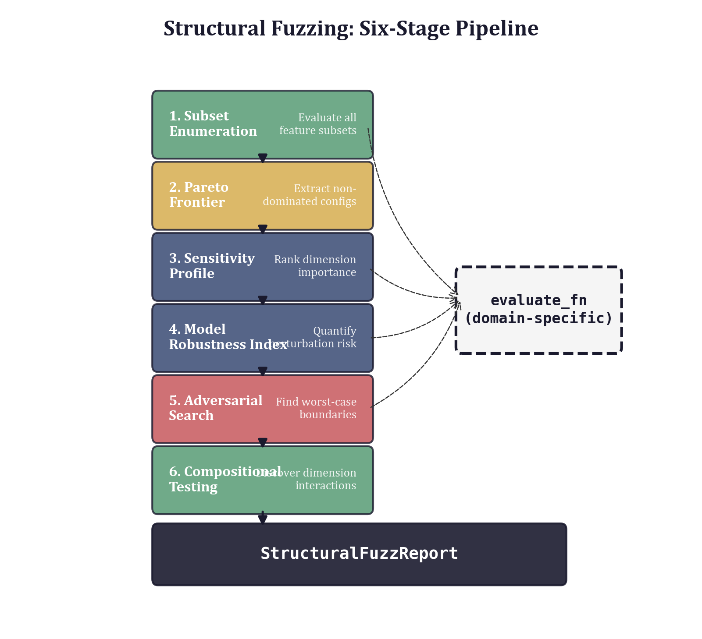

## 16.1 The Pipeline Pattern

### 16.1.1 Why Composition Matters

Each geometric tool from Parts II and III answers one question:

| Tool | Chapter | Question |
|------|---------|----------|
| Subset enumeration | 4 | Which dimension combinations matter? |
| Pareto frontier | 5 | Which configurations are non-dominated tradeoffs? |
| Sensitivity profiling | 7 | How much does each dimension contribute? |
| Model Robustness Index | 7 | How stable is the best configuration under perturbation? |
| Adversarial threshold search | 14 | Where are the exact tipping points? |
| Compositional testing | 15 | In what order should dimensions be added? |

The answers to these questions are not independent. The Pareto frontier depends on the subset enumeration results. Sensitivity profiling uses the best configuration found by enumeration as its baseline. The MRI perturbs that same baseline. Adversarial search probes the dimensions that sensitivity profiling identified as critical. Each stage consumes the output of its predecessors and enriches the overall picture.

This data-flow dependency is what makes a pipeline more than a script that calls six functions in sequence. The pipeline must:

1. Thread results from early stages to later stages automatically.
2. Present a unified configuration surface so that parameters controlling all six stages can be specified in one place.
3. Produce a single structured output that captures all results, rather than scattering them across variables.
4. Handle partial failures gracefully---if adversarial search times out, the subset and Pareto results should still be available.

### 16.1.2 The Six-Stage Architecture

The structural fuzzing pipeline proceeds through six stages, each building on the previous:

```
Subset Enumeration
       |
       v
 Pareto Frontier
       |
       v
Sensitivity Profile  <-- uses best configuration from stage 1
       |
       v
  MRI Computation    <-- uses best configuration from stage 1
       |
       v
Adversarial Search   <-- probes each dimension independently
       |
       v
Compositional Test   <-- greedy dimension-addition sequence
```

The first two stages are tightly coupled: Pareto extraction is a filter over subset results. The middle two stages (sensitivity and MRI) both operate on the best configuration discovered in stage 1 but are independent of each other---they could, in principle, run in parallel. The final two stages are independent of each other but depend on earlier results for their baseline parameters.

An optional seventh phase runs forward selection and backward elimination baselines, providing classical feature-selection comparisons against the geometric methods. These baselines serve as a sanity check: if forward selection discovers a configuration that the exhaustive subset enumeration missed, something is wrong with the enumeration parameters.

### 16.1.3 Data Flow and the Evaluation Function

A single callable---the evaluation function---is the thread that connects all six stages. Every stage calls this function, sometimes hundreds or thousands of times, with different parameter vectors. The function's signature is the contract that binds the pipeline together:

```python
def evaluate_fn(params: np.ndarray) -> tuple[float, dict[str, float]]:
    ...
```

The function takes a parameter vector (one value per dimension) and returns a tuple of `(mae, errors)` where `mae` is the aggregate mean absolute error and `errors` is a dictionary mapping named metrics to their signed deviations from targets. This dual return---a scalar summary plus a structured breakdown---enables the pipeline to optimize on the scalar while preserving per-metric detail for reporting.

The evaluation function is the pipeline's most important abstraction boundary. Everything inside it---data loading, model training, metric computation---is domain-specific. Everything outside it---subset enumeration, Pareto analysis, sensitivity profiling---is domain-agnostic. The pipeline does not know or care whether the evaluation function trains a random forest, runs a game-theoretic simulation, or queries an external API. It only knows the contract: parameters in, errors out.

---

## 16.2 The `run_campaign` API

### 16.2.1 Function Signature and Parameters

The `run_campaign` function is the pipeline's public entry point. Its signature exposes every tuning knob while providing sensible defaults:

```python
def run_campaign(
    dim_names: Sequence[str],
    evaluate_fn: Callable[[np.ndarray], tuple[float, dict[str, float]]],
    max_subset_dims: int = 4,
    n_mri_perturbations: int = 300,
    mri_scale: float = 0.5,
    mri_weights: tuple[float, float, float] = (0.5, 0.3, 0.2),
    start_dim: int = 0,
    candidate_dims: Sequence[int] | None = None,
    run_baselines: bool = True,
    adversarial_tolerance: float = 0.5,
    inactive_value: float = 1e6,
    n_grid: int = 20,
    n_random: int = 5000,
    verbose: bool = True,
) -> StructuralFuzzReport:
```

The parameters fall into four groups:

**Problem specification.** `dim_names` provides human-readable names for each dimension, and `evaluate_fn` is the evaluation callback described above. These two arguments fully specify the problem.

**Enumeration control.** `max_subset_dims` caps the largest subset size explored during enumeration. For $n$ dimensions, the number of subsets up to size $k$ is $\sum_{i=1}^{k} \binom{n}{i}$. With $n = 9$ and $k = 4$, this is 255 subsets. With $k = 5$, it rises to 381. The default of 4 balances thoroughness against computation time. The `n_grid` and `n_random` parameters control how each subset is optimized: `n_grid` sets the number of grid points for 1D and 2D optimization, while `n_random` sets the number of random samples for 3D and higher subsets. The `inactive_value` (default $10^6$) is the sentinel assigned to deactivated dimensions.

**Robustness parameters.** `n_mri_perturbations` controls the number of random perturbations sampled for the MRI computation---more perturbations yield more stable estimates of tail behavior but cost more evaluations. `mri_scale` sets the log-space perturbation radius, and `mri_weights` controls the relative importance of mean, 75th-percentile, and 95th-percentile deviations in the composite MRI score. `adversarial_tolerance` sets the convergence criterion for binary search during adversarial threshold detection.

**Pipeline control.** `start_dim` and `candidate_dims` configure the compositional test (which dimension to start from, and which to consider adding). `run_baselines` toggles the forward/backward selection baselines. `verbose` controls progress printing.

### 16.2.2 Stage Execution

The pipeline executes its six stages in a fixed order, with verbose logging at each transition. The implementation in `pipeline.py` makes the data flow explicit:

```python
# Step 1: Enumerate subsets
subset_results = enumerate_subsets(
    dim_names=dim_names_list,
    evaluate_fn=evaluate_fn,
    max_dims=max_subset_dims,
    inactive_value=inactive_value,
    n_grid=n_grid,
    n_random=n_random,
    verbose=verbose,
)

# Step 2: Pareto frontier
pareto_results = pareto_frontier(subset_results)

# Step 3: Sensitivity profiling (uses best result's params)
if subset_results:
    best_params = subset_results[0].param_values
else:
    best_params = np.ones(n_dims)

sensitivity_results = sensitivity_profile(
    params=best_params,
    dim_names=dim_names_list,
    evaluate_fn=evaluate_fn,
    inactive_value=inactive_value,
)

# Step 4: MRI
mri_result = compute_mri(
    params=best_params,
    evaluate_fn=evaluate_fn,
    n_perturbations=n_mri_perturbations,
    scale=mri_scale,
    weights=mri_weights,
)
```

Notice how `best_params`---the parameter vector from the best subset configuration---flows from stage 1 into stages 3 and 4. This is the critical data dependency. If subset enumeration finds a poor configuration, the sensitivity and robustness analyses will profile the wrong point in parameter space. The pipeline assumes that the best MAE configuration is the right one to probe; for problems where multiple Pareto-optimal configurations deserve individual robustness analysis, the user should run `compute_mri` and `sensitivity_profile` separately on each configuration of interest.

Stages 5 and 6 iterate over dimensions:

```python
# Step 5: Adversarial threshold search
adversarial_results: list[AdversarialResult] = []
for i in range(n_dims):
    adv = find_adversarial_threshold(
        params=best_params,
        dim=i,
        dim_names=dim_names_list,
        evaluate_fn=evaluate_fn,
        tolerance=adversarial_tolerance,
    )
    adversarial_results.extend(adv)

# Step 6: Compositional test
composition_result = compositional_test(
    start_dim=start_dim,
    candidate_dims=candidate_dims_list,
    dim_names=dim_names_list,
    evaluate_fn=evaluate_fn,
    inactive_value=inactive_value,
    n_grid=n_grid,
    n_random=n_random,
)
```

The adversarial search examines each dimension independently, searching for threshold values above and below the baseline at which the error exceeds the tolerance. The compositional test builds configurations incrementally, starting from a single dimension and greedily adding the dimension that most reduces MAE at each step. Together, these two stages answer complementary questions: adversarial search asks "where does this dimension break?", while compositional testing asks "in what order should dimensions be assembled?"

### 16.2.3 Evaluation Budget

Understanding the total number of evaluations consumed by a campaign is essential for budgeting computation time. The count depends on configuration:

| Stage | Evaluations (approximate) |
|:------|:--------------------------|
| Subset enumeration | $\sum_{k=1}^{K} \binom{n}{k} \times C(k)$ |
| Pareto frontier | 0 (filter only) |
| Sensitivity profile | $2n$ |
| MRI | $N_{\text{pert}}$ |
| Adversarial search | $n \times 2 \times \lceil\log_2(R)\rceil$ |
| Compositional test | $(n-1) \times C(\cdot)$ |
| Forward selection | up to $K \times n \times C(\cdot)$ |
| Backward elimination | $n \times C(\cdot)$ |

Here $C(k)$ is the optimization cost for a $k$-dimensional subset: $n_{\text{grid}}$ for $k = 1$, $n_{\text{grid}}^2$ for $k = 2$, and $n_{\text{random}}$ for $k \geq 3$. $R$ is the search range ratio for adversarial binary search, and $N_{\text{pert}}$ is `n_mri_perturbations`.

For a 5-dimensional problem with defaults ($K = 4$, $n_{\text{grid}} = 20$, $n_{\text{random}} = 5000$), the enumeration stage alone requires approximately $5 \times 20 + 10 \times 400 + 10 \times 5000 + 5 \times 5000 = 79{,}100$ evaluations. If each evaluation takes 100ms (reasonable for a small random forest), the enumeration stage takes about 2 hours. The MRI adds 300 evaluations (30 seconds), sensitivity adds 10 evaluations (1 second), and adversarial search adds roughly 100 evaluations (10 seconds). Enumeration dominates.

For a 9-dimensional problem, the evaluation count rises sharply: $\binom{9}{3} = 84$ three-dimensional subsets and $\binom{9}{4} = 126$ four-dimensional subsets, each requiring 5000 random evaluations, push the total past one million. Section 16.6 discusses strategies for managing this cost.

---

## 16.3 `StructuralFuzzReport`: Structured Output

### 16.3.1 The Report Dataclass

The pipeline returns a `StructuralFuzzReport`---a dataclass that bundles the output of all six stages into a single structured object:

```python
@dataclass
class StructuralFuzzReport:
    """Complete structural fuzzing campaign report."""

    dim_names: list[str]
    subset_results: list[SubsetResult]
    pareto_results: list[SubsetResult]
    sensitivity_results: list[SensitivityResult]
    mri_result: ModelRobustnessIndex | None
    adversarial_results: list[AdversarialResult]
    composition_result: CompositionResult | None
    forward_results: list[SubsetResult] = field(default_factory=list)
    backward_results: list[SubsetResult] = field(default_factory=list)
```

Each field holds a typed result object from the corresponding pipeline stage. The `SubsetResult` objects in `subset_results` are sorted by MAE (best first). The `pareto_results` are a subset of `subset_results` containing only the Pareto-optimal configurations. The `sensitivity_results` are sorted by importance rank. The `adversarial_results` list may contain zero, one, or two entries per dimension (one for each search direction), depending on whether thresholds were found. The `forward_results` and `backward_results` are empty lists when `run_baselines=False`.

The optional fields (`mri_result`, `composition_result`) use `None` to indicate that the corresponding stage was skipped or failed. This is the pipeline's mechanism for partial results: if the MRI computation encounters a numerical error, the report still contains valid subset, Pareto, and sensitivity results.

### 16.3.2 Navigating the Results

The `StructuralFuzzReport` is designed for programmatic access. After a campaign completes, the typical analysis workflow extracts specific results:

```python
import structural_fuzzing as sf

report = sf.run_campaign(
    dim_names=["Size", "Complexity", "Halstead", "OO", "Process"],
    evaluate_fn=evaluate_fn,
)

# Best overall configuration
best = report.subset_results[0]
print(f"Best: {best.dim_names}, MAE={best.mae:.4f}")

# Pareto-optimal tradeoffs
for p in report.pareto_results:
    print(f"  k={p.n_dims}: {p.dim_names} -> MAE={p.mae:.4f}")

# Most important dimension
top_dim = report.sensitivity_results[0]
print(f"Most important: {top_dim.dim_name} (delta={top_dim.delta_mae:.4f})")

# Robustness
if report.mri_result is not None:
    print(f"MRI = {report.mri_result.mri:.4f}")
    print(f"Worst-case MAE = {report.mri_result.worst_case_mae:.4f}")

# Tipping points
for adv in report.adversarial_results:
    print(
        f"  {adv.dim_name} ({adv.direction}): "
        f"{adv.base_value:.4f} -> {adv.threshold_value:.4f} "
        f"(ratio={adv.threshold_ratio:.2f}x, flips '{adv.target_flipped}')"
    )
```

The report object is also serializable. Because all of its fields are dataclasses with primitive or NumPy-array contents, the report can be pickled for later analysis or converted to JSON for integration with external dashboards.

### 16.3.3 The `summary` Method

For quick inspection, `StructuralFuzzReport` provides a `summary` method that delegates to the report formatting system:

```python
report = sf.run_campaign(dim_names=dim_names, evaluate_fn=evaluate_fn)
print(report.summary())
```

This produces a structured text report covering all six stages, formatted for terminal display. The implementation is a thin delegation:

```python
def summary(self) -> str:
    """Generate a text summary of the campaign results."""
    from structural_fuzzing.report import format_report
    return format_report(self)
```

The lazy import avoids a circular dependency between the pipeline and report modules---a small but important architectural detail when the report formatter needs to reference pipeline types.

---

## 16.4 Report Generation

### 16.4.1 Text Reports

The `format_report` function transforms a `StructuralFuzzReport` into a human-readable text summary. The output is organized into sections that mirror the pipeline stages:

```python
def format_report(report: StructuralFuzzReport) -> str:
    lines: list[str] = []
    lines.append("=" * 70)
    lines.append("STRUCTURAL FUZZING REPORT")
    lines.append("=" * 70)

    # Overview
    lines.append(f"\nDimensions: {len(report.dim_names)}")
    lines.append(f"Dimension names: {', '.join(report.dim_names)}")
    lines.append(f"Total configurations evaluated: {len(report.subset_results)}")

    # Best configuration
    if report.subset_results:
        best = report.subset_results[0]
        lines.append("\nBest configuration:")
        lines.append(f"  Dimensions: {', '.join(best.dim_names)} (k={best.n_dims})")
        lines.append(f"  MAE: {best.mae:.4f}")
        lines.append("  Errors:")
        for name, err in sorted(best.errors.items()):
            lines.append(f"    {name}: {err:+.4f}")
    ...
```

The report includes signed errors for each metric (positive means the model exceeds the target, negative means it falls short), the complete Pareto frontier, the sensitivity ranking with ablation deltas, MRI statistics including tail percentiles, adversarial thresholds with direction and flip information, and the compositional build order.

The text format is designed for three use cases: terminal inspection during development, inclusion in version-controlled reports (the text diffs cleanly), and automated parsing by downstream tools that can extract specific numbers using simple string matching.

### 16.4.2 LaTeX Tables

For publication-quality output, `format_latex_tables` generates ready-to-compile LaTeX table environments:

```python
def format_latex_tables(report: StructuralFuzzReport) -> str:
    lines: list[str] = []

    # Pareto frontier table
    lines.append("% Pareto Frontier")
    lines.append("\\begin{table}[htbp]")
    lines.append("\\centering")
    lines.append("\\caption{Pareto-optimal configurations}")
    lines.append("\\label{tab:pareto}")
    lines.append("\\begin{tabular}{clr}")
    lines.append("\\toprule")
    lines.append("$k$ & Dimensions & MAE \\\\")
    lines.append("\\midrule")
    for pr in report.pareto_results:
        names = ", ".join(pr.dim_names)
        lines.append(f"{pr.n_dims} & {names} & {pr.mae:.4f} \\\\")
    lines.append("\\bottomrule")
    lines.append("\\end{tabular}")
    lines.append("\\end{table}")
    ...
```

The function generates three tables: Pareto-optimal configurations, sensitivity ranking (with delta-MAE, MAE-with, and MAE-without columns), and MRI statistics. Each table uses `booktabs` rules (`\toprule`, `\midrule`, `\bottomrule`) and includes `\label` commands for cross-referencing. The tables are designed to be dropped directly into a LaTeX manuscript with no manual formatting.

The separation between data (the `StructuralFuzzReport` dataclass) and presentation (the `format_report` and `format_latex_tables` functions) is deliberate. A practitioner who needs a different output format---HTML, Jupyter notebook cells, a Slack message---can write a new formatter that consumes the same `StructuralFuzzReport` object without modifying the pipeline itself.

---

## 16.5 Designing Evaluation Functions

### 16.5.1 The Contract

The evaluation function is the bridge between the domain-agnostic pipeline and the domain-specific model. Its contract is simple but demands care:

```python
def evaluate_fn(params: np.ndarray) -> tuple[float, dict[str, float]]:
```

**Input:** `params` is a 1D NumPy array of length $n$ (one entry per dimension). Each entry is either a positive real number (the parameter value for that dimension) or the inactive sentinel value (default $10^6$), indicating that the dimension should be excluded from the model.

**Output:** A tuple of `(mae, errors)` where `mae` is a non-negative float (mean absolute error across all target metrics) and `errors` is a dictionary mapping metric names to signed error values (predicted minus target).

Three properties are essential for correct pipeline behavior:

1. **Determinism.** Given the same `params`, the function must return the same `(mae, errors)`. Stochastic models should fix their random seed internally.
2. **Inactive handling.** When `params[i] >= inactive_value`, the evaluation must exclude dimension $i$ entirely---not merely set its weight to zero.
3. **Graceful degradation.** When all dimensions are inactive (every entry is the sentinel), the function should return large errors rather than raising an exception.

### 16.5.2 The Defect Prediction Pattern

The defect prediction example in `examples/defect_prediction/model.py` illustrates the standard pattern. The `make_evaluate_fn` factory generates a closure that captures the training data and returns a function with the correct signature:

```python
def make_evaluate_fn(
    n_samples: int = 1000,
    test_fraction: float = 0.3,
    seed: int = 42,
) -> Callable[[np.ndarray], tuple[float, dict[str, float]]]:
    X, y = generate_defect_data(n_samples=n_samples, seed=seed)
    # ... train/test split ...

    def evaluate_fn(params: np.ndarray) -> tuple[float, dict[str, float]]:
        # Select features from active groups
        active_features: list[int] = []
        for i, indices in enumerate(group_indices):
            if params[i] < 1000:
                active_features.extend(indices)

        if not active_features:
            errors = {name: -val for name, val in target_values.items()}
            mae = sum(abs(v) for v in errors.values()) / len(errors)
            return mae, errors

        X_tr = X_train[:, active_features]
        X_te = X_test[:, active_features]

        rf = RandomForestClassifier(n_estimators=50, random_state=42, n_jobs=1)
        rf.fit(X_tr, y_train)
        y_pred = rf.predict(X_te)
        # ... compute metrics and errors ...
        return mae, errors

    return evaluate_fn
```

Several design choices are worth noting:

**Feature groups, not individual features.** The 16 raw features are organized into 5 groups (Size, Complexity, Halstead, OO, Process). Each dimension in the parameter vector controls an entire group. This is the dimension grouping pattern from Chapter 1: the pipeline operates on a manageable 5-dimensional space rather than a 16-dimensional one, with each dimension carrying semantic meaning.

**Inactive threshold.** The function checks `params[i] < 1000` rather than comparing against the full sentinel value of $10^6$. This is a pragmatic choice: it ensures that any sufficiently large parameter value deactivates the group, avoiding floating-point comparison issues with the exact sentinel.

**Fixed random state.** The `RandomForestClassifier` uses `random_state=42`, ensuring deterministic predictions. Without this, repeated evaluations with the same parameters would return different MAE values, confusing the optimization stages.

**Target-relative errors.** Each metric is compared against an explicit target value (e.g., Accuracy target of 75.0). The error dictionary contains signed deviations: positive means the model exceeds the target, negative means it falls short. This convention allows the pipeline to track *which* targets are met and which are not, rather than collapsing everything into a single pass/fail judgment.

### 16.5.3 The Geometric Economics Pattern

The geometric economics example in `examples/geometric_economics/model.py` shows a different use of the same contract. Here, the parameters are not feature group selectors but variance weights in a Mahalanobis distance computation:

```python
def evaluate_fn(params: np.ndarray) -> tuple[float, dict[str, float]]:
    # Build sigma_inv from params: diag(1/params[i])
    # Large params[i] -> small weight -> dimension less important
    weights = np.where(params < 1e5, 1.0 / np.maximum(params, 1e-6), 0.0)
    sigma_inv_local = np.diag(weights)

    errors: dict[str, float] = {}
    for target in targets:
        predicted = target.predict_fn(sigma_inv_local)
        error = predicted - target.empirical
        errors[target.name] = error

    mae = sum(abs(v) for v in errors.values()) / len(errors)
    return mae, errors
```

The parameter vector has nine entries (one per ethical-economic dimension: Consequences, Rights, Fairness, Autonomy, Trust, Social Impact, Virtue/Identity, Legitimacy, Epistemic). Each entry acts as the variance of its dimension in the Mahalanobis metric: a large value means that dimension contributes little to distance computations, effectively downweighting it. Setting a parameter to $10^5$ or above zeroes the corresponding weight, deactivating the dimension entirely.

This design demonstrates the versatility of the evaluation function contract. The pipeline neither knows nor cares that the defect prediction example trains a classifier while the economics example tunes a distance metric. Both conform to the same signature, and both produce meaningful MAE and error dictionaries that the pipeline can optimize, perturb, and analyze.

### 16.5.4 Guidelines for Custom Evaluation Functions

When writing a new evaluation function for a domain not covered by the existing examples, follow these guidelines:

1. **Precompute everything possible** in the factory function (`make_evaluate_fn`). Data loading, preprocessing, and train/test splitting should happen once, not on every evaluation call. The evaluation function will be called thousands of times; a 10ms overhead per call compounds to minutes of wasted time.

2. **Choose targets carefully.** The `errors` dictionary drives the entire analysis. Each entry should correspond to a quantity that has a meaningful target value and a natural scale. Mixing a percentage (0--100) with a probability (0--1) in the same error dictionary will skew the MAE toward the larger-scale quantity.

3. **Normalize scales.** If different metrics have different natural units, consider normalizing errors as percentages of target: `error = (predicted - target) / target * 100`. This ensures that all entries in the error dictionary contribute equally to the aggregate MAE.

4. **Document the inactive semantics.** Different domains interpret "inactive" differently. For a feature-group model, inactive means "exclude these features." For a Mahalanobis model, inactive means "set this variance weight to zero." The pipeline does not enforce any particular interpretation; it only guarantees that inactive dimensions receive the sentinel value.

5. **Return finite values.** The pipeline's optimization stages use the MAE for comparison. If the evaluation function returns `inf` or `nan`, comparisons become unreliable. When a configuration is degenerate (e.g., all features excluded), return a large but finite MAE.

---

## 16.6 Pipeline Configuration: Speed vs. Thoroughness

### 16.6.1 The Cost Knobs

Three parameters dominate the computation cost of a campaign:

- **`max_subset_dims`**: Controls the combinatorial explosion. Reducing from 4 to 3 eliminates all 4-dimensional subsets.
- **`n_random`**: Controls optimization quality for 3D+ subsets. Reducing from 5000 to 1000 makes each subset 5x faster at the cost of potentially missing the optimal parameter values.
- **`n_mri_perturbations`**: Controls MRI statistical reliability. Reducing from 300 to 100 saves 200 evaluations but increases the variance of the P95 estimate.

### 16.6.2 Configuration Profiles

For different stages of a project, different tradeoffs are appropriate:

**Exploratory profile (fast).** During initial model development, the goal is a quick scan of the dimension landscape. Use `max_subset_dims=2`, `n_random=1000`, `n_mri_perturbations=100`, and `run_baselines=False`. This explores only 1D and 2D subsets with light optimization, completing in minutes for most problems.

```python
report = sf.run_campaign(
    dim_names=dim_names,
    evaluate_fn=evaluate_fn,
    max_subset_dims=2,
    n_random=1000,
    n_mri_perturbations=100,
    run_baselines=False,
)
```

**Standard profile (balanced).** For regular validation runs, the defaults are well-calibrated: `max_subset_dims=4`, `n_random=5000`, `n_mri_perturbations=300`. This explores up to 4D subsets with thorough optimization, completing in 1--4 hours for a 5--9 dimensional problem depending on evaluation cost.

```python
report = sf.run_campaign(
    dim_names=dim_names,
    evaluate_fn=evaluate_fn,
)
```

**Publication profile (thorough).** For final validation before publication, increase the sampling density: `max_subset_dims=5` (or the full dimension count), `n_random=20000`, `n_mri_perturbations=1000`, and `n_grid=50`. This provides high-confidence results at the cost of significantly longer runtime.

```python
report = sf.run_campaign(
    dim_names=dim_names,
    evaluate_fn=evaluate_fn,
    max_subset_dims=len(dim_names),
    n_random=20000,
    n_mri_perturbations=1000,
    n_grid=50,
)
```

### 16.6.3 Scaling with Dimensionality

The pipeline's cost scales differently in each stage:

- Subset enumeration scales combinatorially: $O\left(\sum_{k=1}^{K} \binom{n}{k}\right)$ subsets, each requiring $O(C(k))$ evaluations.
- Sensitivity profiling scales linearly: $O(n)$ ablation evaluations.
- MRI scales independently of dimensionality: $O(N_{\text{pert}})$ evaluations regardless of $n$.
- Adversarial search scales linearly: $O(n \log R)$ evaluations.
- Compositional testing scales quadratically in the worst case: $O(n^2 \cdot C(\cdot))$ evaluations.

For problems with $n > 10$, subset enumeration up to $k = 4$ becomes expensive. Three mitigation strategies apply:

1. **Reduce `max_subset_dims`.** Exploring only 1D and 2D subsets is often sufficient to identify the most important dimensions. Use the sensitivity profile to confirm the ranking.

2. **Use forward selection as a proxy.** Forward selection explores the same landscape as subset enumeration but follows a greedy path, evaluating $O(n \cdot K)$ subsets instead of $O(n^K)$. The `run_baselines=True` option provides this automatically.

3. **Domain-informed pruning.** If domain knowledge suggests that certain dimension combinations are irrelevant (e.g., OO metrics never matter without Size metrics), encode this as a custom enumeration rather than using the full exhaustive pipeline. The individual functions (`enumerate_subsets`, `pareto_frontier`, etc.) are available for composing custom pipelines.

---

## 16.7 Error Handling and Partial Results

### 16.7.1 Failures Within the Evaluation Function

The most common failure mode is an exception inside the evaluation function. A degenerate parameter configuration might cause a singular matrix, a division by zero, or a model that fails to converge. The pipeline does not wrap evaluation calls in blanket try/except blocks---doing so would mask bugs in the evaluation function. Instead, the evaluation function itself should handle degenerate cases:

```python
def evaluate_fn(params: np.ndarray) -> tuple[float, dict[str, float]]:
    active_features = [i for i, p in enumerate(params) if p < 1000]

    if not active_features:
        # Degenerate: no features selected
        errors = {name: -val for name, val in target_values.items()}
        mae = sum(abs(v) for v in errors.values()) / len(errors)
        return mae, errors

    # Normal evaluation path
    ...
```

The key principle is that every possible parameter vector---including all-inactive, all-extreme, and mixed configurations---should produce a valid `(mae, errors)` tuple. This is a stronger requirement than typical function contracts, but it is necessary because the pipeline will exercise the entire parameter space, including corners that normal usage would never reach.

### 16.7.2 Failures Between Pipeline Stages

If a pipeline stage fails (e.g., the adversarial search raises an unhandled exception), the entire `run_campaign` call fails. This is deliberate: the pipeline makes no attempt at partial recovery because the data dependencies between stages make it difficult to reason about which downstream results are still valid.

For long-running campaigns where partial results are valuable, two approaches are available:

**Manual staging.** Call the individual functions directly, saving intermediate results:

```python
import structural_fuzzing as sf

# Stage 1
subset_results = sf.enumerate_subsets(
    dim_names=dim_names,
    evaluate_fn=evaluate_fn,
    max_dims=4,
)

# Save intermediate result
import pickle
with open("subsets.pkl", "wb") as f:
    pickle.dump(subset_results, f)

# Stage 2
pareto_results = sf.pareto_frontier(subset_results)

# Stage 3
best_params = subset_results[0].param_values
sensitivity_results = sf.sensitivity_profile(
    params=best_params,
    dim_names=dim_names,
    evaluate_fn=evaluate_fn,
)

# Continue with remaining stages...
```

This approach gives full control over checkpointing and error recovery at the cost of more code.

**Defensive evaluation functions.** Wrap the evaluation function to catch and convert exceptions:

```python
def safe_evaluate_fn(params: np.ndarray) -> tuple[float, dict[str, float]]:
    try:
        return original_evaluate_fn(params)
    except Exception:
        # Return large errors for degenerate configurations
        return 999.0, {"error": -999.0}
```

This keeps the pipeline running but may produce misleading results if exceptions occur frequently. Use with caution and always inspect the error dictionary for sentinel values in the report.

### 16.7.3 Interpreting the MRI Under Partial Information

The MRI is sensitive to the perturbation distribution. If the evaluation function returns unreliable values for certain parameter regions (e.g., near the inactive threshold), the MRI may over-estimate or under-estimate tail risk. Chapter 7 discusses this issue in detail; here the practical advice is: examine the MRI's `worst_case_mae` field. If it is unreasonably large (orders of magnitude above the baseline MAE), one or more perturbation samples likely hit a degenerate configuration, and the MRI should be recomputed with a smaller `mri_scale`.

---

## 16.8 End-to-End Examples

### 16.8.1 Defect Prediction Campaign

The defect prediction example demonstrates a complete pipeline run from data generation through report output:

```python
import structural_fuzzing as sf
from examples.defect_prediction.model import GROUP_NAMES, make_evaluate_fn

# Create evaluation function
evaluate_fn = make_evaluate_fn(n_samples=1000, seed=42)

# Run full campaign
report = sf.run_campaign(
    dim_names=GROUP_NAMES,  # ["Size", "Complexity", "Halstead", "OO", "Process"]
    evaluate_fn=evaluate_fn,
    max_subset_dims=4,
    n_mri_perturbations=300,
    verbose=True,
)

# Print text report
print(report.summary())

# Generate LaTeX tables for publication
from structural_fuzzing.report import format_latex_tables
latex = format_latex_tables(report)
with open("defect_tables.tex", "w") as f:
    f.write(latex)
```

The campaign explores all subsets of up to 4 dimensions from the 5 available (31 subsets total), identifies the Pareto frontier, profiles the sensitivity of each dimension, computes the MRI of the best configuration, searches for adversarial thresholds in each dimension, and tests the greedy dimension-addition order. The output captures everything needed for a validation report: which feature groups matter, how robust the model is, and where its tipping points lie.

### 16.8.2 Geometric Economics Campaign

The economics example operates on a higher-dimensional space (9 dimensions) and uses the evaluation function to tune Mahalanobis distance weights rather than feature-group selections:

```python
import structural_fuzzing as sf
from examples.geometric_economics.model import DIM_NAMES, make_evaluate_fn

evaluate_fn = make_evaluate_fn()

# Use exploratory profile for 9D space
report = sf.run_campaign(
    dim_names=DIM_NAMES,
    evaluate_fn=evaluate_fn,
    max_subset_dims=3,       # 9D: limit combinatorial explosion
    n_random=2000,           # Lighter optimization
    n_mri_perturbations=200,
    run_baselines=False,     # Skip baselines for speed
    verbose=True,
)

# Examine which ethical dimensions matter most
print("\nDimension importance:")
for sr in report.sensitivity_results:
    print(f"  {sr.importance_rank}. {sr.dim_name}: delta={sr.delta_mae:+.4f}")

# Check for tipping points
for adv in report.adversarial_results:
    print(
        f"  Tipping point in {adv.dim_name}: "
        f"ratio={adv.threshold_ratio:.2f}x ({adv.direction})"
    )
```

The reduced `max_subset_dims` is critical here: with 9 dimensions, exhaustive enumeration up to size 4 would require $\binom{9}{4} = 126$ four-dimensional subsets, each optimized with 2000 random samples. Limiting to 3D subsets keeps the campaign tractable while still revealing the most important dimension interactions.

### 16.8.3 Custom Pipeline with Selective Stages

For situations where the full pipeline is unnecessary or too slow, the public API (Chapter 1 introduced the state vector and module structure; the `__init__.py` exposes all components) supports composing a custom analysis:

```python
import numpy as np
import structural_fuzzing as sf

dim_names = ["Alpha", "Beta", "Gamma", "Delta"]

def evaluate_fn(params: np.ndarray) -> tuple[float, dict[str, float]]:
    # Custom model evaluation
    ...
    return mae, errors

# Run only subset enumeration and Pareto analysis
subset_results = sf.enumerate_subsets(
    dim_names=dim_names,
    evaluate_fn=evaluate_fn,
    max_dims=3,
)
pareto_results = sf.pareto_frontier(subset_results)

# Run MRI on each Pareto-optimal configuration
for pr in pareto_results:
    mri = sf.compute_mri(
        params=pr.param_values,
        evaluate_fn=evaluate_fn,
        n_perturbations=500,
    )
    print(f"  k={pr.n_dims} [{', '.join(pr.dim_names)}]: "
          f"MAE={pr.mae:.4f}, MRI={mri.mri:.4f}")
```

This pattern---enumerate, filter, then probe each survivor---is more informative than the default pipeline's approach of computing the MRI only for the single best configuration. The tradeoff is that computing the MRI for every Pareto-optimal point multiplies the MRI cost by the size of the Pareto frontier.

---

## 16.9 The Pipeline as a Geometric Object

### 16.9.1 State Space of the Pipeline Itself

The pipeline has its own configuration space: the vector of all its parameters (`max_subset_dims`, `n_random`, `n_mri_perturbations`, `mri_scale`, `mri_weights`, `adversarial_tolerance`, `n_grid`). This meta-configuration lives in a space of its own, and the same geometric reasoning that the pipeline applies to models can be applied to the pipeline itself.

For instance: how sensitive is the pipeline's output to `n_random`? If increasing `n_random` from 3000 to 7000 changes the best configuration found, the pipeline was under-sampling at 3000 and the results at that setting are unreliable. If the results are stable, the extra samples are wasted computation. Running the pipeline twice with different `n_random` values and comparing the Pareto frontiers is a simple convergence check---and it is, itself, a sensitivity analysis.

### 16.9.2 Reproducibility

The pipeline does not set global random seeds. The evaluation function is responsible for its own determinism (as discussed in Section 16.5.1), and the pipeline's internal stages use deterministic algorithms where possible. Subset enumeration is exhaustive (no randomness). Pareto extraction is a deterministic filter. Sensitivity profiling evaluates fixed parameter configurations. Only the MRI stage introduces randomness (random perturbation sampling), and its random seed can be controlled through the evaluation function's internal state.

For bit-reproducible results across runs, ensure that:

1. The evaluation function uses a fixed random seed.
2. The underlying model (e.g., `RandomForestClassifier(random_state=42)`) uses a fixed random seed.
3. The NumPy random generator used for MRI perturbations is seeded consistently.

### 16.9.3 Composition with External Tools

The pipeline produces structured data; what happens to that data next is outside the pipeline's scope but worth considering as a design question. Common downstream integrations include:

- **Visualization.** Plotting the Pareto frontier (MAE vs. number of dimensions), the sensitivity bar chart, and the MRI perturbation distribution. The `StructuralFuzzReport` contains all the data needed for these plots; the pipeline does not generate them because plotting libraries are a matter of preference.

- **Regression testing.** Storing the `StructuralFuzzReport` from each campaign and comparing it against previous runs to detect changes in the Pareto frontier, shifts in the sensitivity ranking, or deterioration of the MRI.

- **Hyperparameter optimization.** Using the pipeline's output as the objective for a higher-level optimizer that searches over model hyperparameters or data preprocessing choices.

Each of these integrations treats the pipeline's output as a first-class object rather than a log file to be parsed---the benefit of structured output over printf-style reporting.

---

## 16.10 Looking Ahead

This chapter has treated the pipeline as a sequential, single-machine process. For the problems considered in this book---5 to 15 dimensions, evaluation functions that run in milliseconds to seconds---this is sufficient. But two pressures push toward more sophisticated execution models.

First, **scaling to higher dimensions** (Chapter 17) introduces evaluation budgets that exceed what sequential execution can deliver in reasonable time. Distributing subset evaluations across multiple cores or machines, caching evaluation results to avoid redundant computation, and using surrogate models to approximate expensive evaluations are all extensions that preserve the pipeline's logical structure while changing its execution strategy.

Second, **deploying geometric validation in production** (Chapter 18) requires integrating the pipeline into continuous integration systems, monitoring dashboards, and alerting infrastructure. The pipeline's structured output---the `StructuralFuzzReport`---provides the foundation for these integrations, but the operational concerns (scheduling, retry policies, result storage, alert thresholds) are distinct from the analytical concerns developed in this chapter.

Chapter 17 takes up the scaling challenge, developing methods for efficient exploration of high-dimensional spaces where exhaustive enumeration is infeasible and the geometric tools from Parts II and III must be adapted to operate under strict computational budgets.

---

## Summary

The geometric pipeline composes six analysis stages---subset enumeration, Pareto frontier extraction, sensitivity profiling, MRI computation, adversarial threshold search, and compositional testing---into a single `run_campaign` call. The pipeline's power comes from three design choices:

1. **A unified evaluation contract.** The `evaluate_fn` callback decouples the domain-specific model from the domain-agnostic analysis, enabling the same pipeline to validate a random forest classifier and a game-theoretic distance metric.

2. **Structured output.** The `StructuralFuzzReport` dataclass captures all results in a typed, navigable object that supports programmatic analysis, text reporting, and LaTeX table generation without loss of information.

3. **Configurable thoroughness.** The pipeline's parameters (`max_subset_dims`, `n_random`, `n_mri_perturbations`) provide explicit control over the tradeoff between computation time and result quality, enabling exploratory runs during development and publication-quality analyses for final validation.

The pipeline is not the final word on geometric validation---it is a starting point. The individual components are independently usable, the report format is extensible, and the evaluation function contract is simple enough to implement for any parameterized model. What the pipeline provides is a disciplined default: a sequence of analyses that, taken together, reveal the multi-dimensional structure that scalar metrics systematically hide.


\newpage

# Chapter 17: Scaling to High-Dimensional Spaces

> *"The trouble with high-dimensional spaces is not that they are large, but that they are empty."*
> --- Paraphrased from Richard Bellman (1961)

The geometric methods developed in Parts I through III operate beautifully in moderate dimensions. When a model has five parameters grouped into five named dimensions, exhaustive subset enumeration (Chapter 11) evaluates 31 subsets, Pareto frontier extraction completes in microseconds, and the Model Robustness Index (Chapter 9) converges with 300 perturbation samples. The entire structural fuzzing campaign finishes in seconds.

Now consider a model with 50 parameters. Or 200. Or 2,000. The number of subsets of size up to $k = 4$ is $\binom{50}{1} + \binom{50}{2} + \binom{50}{3} + \binom{50}{4} = 292{,}825$. For $n = 200$, the same sum exceeds $67$ million. Exhaustive enumeration, which was the foundation of the geometric analysis pipeline, becomes computationally impossible.

This chapter addresses the computational challenges that arise when the methods of preceding chapters encounter high-dimensional parameter spaces. We analyze the complexity of each pipeline stage, identify the bottlenecks, and develop three families of strategies for overcoming them: greedy heuristics that sacrifice optimality for tractability, LASSO-based screening that exploits sparsity, and sampling strategies that provide probabilistic coverage guarantees.

---

## 17.1 The Curse of Dimensionality for Geometric Methods

### 17.1.1 Volume, Distance, and Concentration

The curse of dimensionality is not a single phenomenon but a family of related pathologies. Three are particularly damaging for the geometric methods in this book.

**Volume explosion.** The fraction of a unit hypercube's volume within distance $\epsilon$ of the center shrinks as $(2\epsilon)^n$. For $n = 50$ and $\epsilon = 0.1$, this is $0.2^{50} \approx 10^{-35}$. The `optimize_subset` function in `core.py` uses 5,000 random samples for subsets of size 3 or more. In 50 dimensions, those samples cover a vanishingly small fraction of the feasible region.

**Distance concentration.** As $n$ grows, the ratio of maximum to minimum pairwise distance in a random point set converges to 1. All points become approximately equidistant, undermining nearest-neighbor methods and distance-based analysis.

**Empty neighborhoods.** For MRI computation (Chapter 9), 300 perturbation samples in 50 dimensions are scattered across an exponentially larger space. The MRI's percentile statistics---P75 and P95---remain well-defined but may not capture the true tail behavior of the perturbation response surface.

### 17.1.2 What Breaks and When

Not all pipeline stages suffer equally:

| Pipeline Stage | Complexity | Breaks At | Reason |
|---|---|---|---|
| Subset enumeration | $O\bigl(\sum_{k=1}^{K}\binom{n}{k}\bigr)$ | $n \approx 20$ | Combinatorial explosion |
| Per-subset optimization (1D/2D) | $O(g)$ / $O(g^2)$ | Never | Fixed grid cost |
| Per-subset optimization (3D+) | $O(r)$ | $n \approx 50$ | Random search coverage degrades |
| Pareto frontier extraction | $O(m \cdot n)$ | $m > 10^6$ | Dominance checks |
| Sensitivity profiling | $O(n \cdot g)$ | $n \approx 500$ | Linear, well-behaved |
| MRI computation | $O(p \cdot n)$ | $n \approx 500$ | Perturbation coverage degrades |
| Adversarial threshold search | $O(n \cdot s)$ | $n \approx 500$ | Linear, well-behaved |
| Forward/backward selection | $O(n^2)$ | $n \approx 200$ | Quadratic greedy iterations |

Here $g$ is `n_grid` (default 20), $r$ is `n_random` (default 5,000), $m$ the total subset count, $p$ is `n_perturbations` (default 300), and $s$ is binary search steps per dimension. The critical bottleneck is subset enumeration---exponential where everything else is polynomial.

---

## 17.2 Combinatorial Explosion in Subset Enumeration

The `enumerate_subsets` function in `core.py` iterates over all subsets of dimensions from size 1 to `max_dims`, calling `optimize_subset` on each via `itertools.combinations`. The total number of subsets is:

$$S(n, K) = \sum_{k=1}^{K} \binom{n}{k}$$

For small $K$ this is $O(n^K)$. Concrete counts:

| $n$ | $K = 2$ | $K = 3$ | $K = 4$ | $K = n$ (full) |
|:---:|:---:|:---:|:---:|:---:|
| 5 | 15 | 25 | 30 | 31 |
| 10 | 55 | 175 | 385 | 1,023 |
| 20 | 210 | 1,350 | 5,985 | $\approx 10^6$ |
| 50 | 1,275 | 20,825 | 292,825 | $\approx 10^{15}$ |
| 100 | 5,050 | 166,750 | 3,921,225 | $\approx 10^{30}$ |
| 200 | 20,100 | 1,333,500 | 67,054,150 | $\approx 10^{60}$ |

The raw subset count understates the true cost because each subset must be *optimized*. The `optimize_subset` function uses grid search ($g$ or $g^2$ evaluations) for 1D/2D subsets and random search ($r$ evaluations) for 3D+. For $n = 50$ and $K = 4$ with $g = 20, r = 5{,}000$, the total exceeds $1.25 \times 10^9$ function evaluations.

---

## 17.3 Greedy Alternatives

### 17.3.1 Forward Selection

Forward selection builds a subset incrementally, starting empty and greedily adding the dimension that most reduces MAE. From `baselines.py`:

```python
def forward_selection(
    dim_names, evaluate_fn, max_dims=None,
    inactive_value=1e6, n_grid=20, n_random=5000,
) -> list[SubsetResult]:
    n_all = len(dim_names)
    if max_dims is None:
        max_dims = n_all
    selected, remaining = [], list(range(n_all))
    results = []

    for _ in range(min(max_dims, n_all)):
        best_mae, best_dim, best_result = float("inf"), remaining[0], None
        for candidate in remaining:
            result = optimize_subset(
                active_dims=selected + [candidate],
                all_dim_names=dim_names, evaluate_fn=evaluate_fn,
                inactive_value=inactive_value,
                n_grid=n_grid, n_random=n_random,
            )
            if result.mae < best_mae:
                best_mae, best_dim, best_result = result.mae, candidate, result
        selected.append(best_dim)
        remaining.remove(best_dim)
        results.append(best_result)
    return results
```

At step $t$, it evaluates $n - t$ candidates. Total `optimize_subset` calls for $K$ steps: $F(n, K) = Kn - K(K-1)/2$, which is $O(nK)$---linear in $n$ for fixed $K$.

| $n$ | Exhaustive ($K = 4$) | Forward ($K = 4$) | Speedup |
|:---:|:---:|:---:|:---:|
| 20 | 5,985 | 74 | 81x |
| 50 | 292,825 | 194 | 1,510x |
| 100 | 3,921,225 | 394 | 9,952x |
| 200 | 67,054,150 | 794 | 84,453x |

Forward selection cannot discover dimensions that are mediocre alone but excellent in combination. But empirically, it typically finds configurations within 5--15% of the globally optimal MAE.

### 17.3.2 Backward Elimination

Backward elimination starts with all $n$ dimensions active and greedily removes the least important one at each step. From `baselines.py`:

```python
def backward_elimination(
    dim_names, evaluate_fn,
    inactive_value=1e6, n_grid=20, n_random=5000,
) -> list[SubsetResult]:
    n_all = len(dim_names)
    active = list(range(n_all))
    results = []

    full_result = optimize_subset(
        active_dims=active, all_dim_names=dim_names,
        evaluate_fn=evaluate_fn, inactive_value=inactive_value,
        n_grid=n_grid, n_random=n_random,
    )
    results.append(full_result)

    while len(active) > 1:
        best_mae, worst_dim, best_result = float("inf"), active[0], None
        for candidate in active:
            trial_dims = [d for d in active if d != candidate]
            result = optimize_subset(
                active_dims=trial_dims, all_dim_names=dim_names,
                evaluate_fn=evaluate_fn, inactive_value=inactive_value,
                n_grid=n_grid, n_random=n_random,
            )
            if result.mae < best_mae:
                best_mae, worst_dim, best_result = result.mae, candidate, result
        active.remove(worst_dim)
        results.append(best_result)
    return results
```

The total calls are $B(n) = n(n-1)/2 + 1$, the same $O(n^2)$ as forward selection run to completion. However, backward elimination has higher per-call cost because early steps involve large subsets (triggering the expensive random search path in `optimize_subset`).

**Complementary strengths.** Forward selection excels at identifying the *most important* dimensions; backward elimination excels at identifying the *least important*. Running both and comparing results is a practical diagnostic: agreement suggests clean dimension structure; divergence suggests complex interactions.

### 17.3.3 Bidirectional and Floating Selection

More sophisticated variants exist. **Bidirectional selection** alternates forward and backward steps: add the best remaining dimension, then check whether any previously selected dimension has become redundant. **Floating selection** (SFFS/SBFS) allows the subset size to fluctuate, backing up when a backward step improves the objective. These methods escape some local optima that trap pure greedy search while maintaining $O(n^2)$ worst-case complexity.

---

## 17.4 LASSO-Based Dimension Screening

### 17.4.1 Sparsity as a Proxy for Subset Selection

Instead of selecting dimensions explicitly, the LASSO approach solves a continuous relaxation: optimize over all dimensions simultaneously with an $L^1$ penalty that encourages sparsity:

$$\mathcal{L}_\alpha(\theta) = \mathcal{L}(\theta) + \alpha \sum_{i=1}^{n} |\log_{10}(\theta_i)|$$

The penalty is applied in log-space, penalizing deviation from $\theta_i = 1.0$ (the neutral value). The `lasso_selection` function in `baselines.py` sweeps over 20 logarithmically spaced regularization strengths $\alpha \in [10^{-3}, 10^2]$. For each $\alpha$, it searches $r = 5{,}000$ random parameter vectors and identifies the best penalized solution. Dimensions with $|\log_{10}(\theta_i)| \geq 0.5$ are considered active.

The total cost is $O(|\alpha| \cdot r)$ function evaluations---$100{,}000$ by default, *independent of $n$*. This makes LASSO screening particularly attractive for high-dimensional problems.

### 17.4.2 LASSO as a Screening Stage

The most effective use is as a *screening stage* that reduces the effective dimensionality before enumeration begins. The workflow is:

1. Run `lasso_selection` on the full $n$-dimensional problem. Cost: $O(r \cdot |\alpha|)$.
2. Identify dimensions that appear in active sets across multiple $\alpha$ values. These are the *robust* dimensions that survive regularization at various penalty strengths.
3. Restrict attention to this reduced set of $n' \ll n$ dimensions.
4. Run `enumerate_subsets` on the reduced set with $n'$ dimensions. Cost: $O(n'^K)$.

If LASSO reduces $n = 200$ to $n' = 12$, exhaustive enumeration with $K = 4$ requires only $\binom{12}{1} + \binom{12}{2} + \binom{12}{3} + \binom{12}{4} = 793$ subsets---a reduction from 67 million to under a thousand. The screening stage costs 100,000 evaluations; the enumeration stage costs a few thousand more. The total cost is a tiny fraction of naive exhaustive enumeration.

The risk is that LASSO screening may discard a dimension that is individually weak but critical in combination with others. This risk is partially mitigated by using a generous activity threshold ($|\log_{10}(\theta_i)| \geq 0.3$ instead of $0.5$) and by examining the LASSO path across all $\alpha$ values rather than relying on a single regularization strength. Dimensions that appear in the active set for any $\alpha$ value should be retained for the enumeration stage.

---

## 17.5 Sampling Strategies for High-Dimensional Perturbation Spaces

### 17.5.1 The MRI Sampling Problem

The MRI (Chapter 9) draws perturbation samples from a log-normal distribution. With $p = 300$ samples in $n = 50$ dimensions, the samples are too sparse to reveal the fine structure of the perturbation response surface. Three strategies improve coverage.

### 17.5.2 Latin Hypercube Sampling

LHS partitions each dimension's marginal distribution into $p$ equal-probability strata, ensuring each stratum is sampled exactly once. The resulting sample has better space-filling properties than independent sampling, providing approximately $1 + (1/p)$ variance reduction. For MRI, the modification replaces the independent normal draws with stratified draws via `scipy.stats.qmc.LatinHypercube`, transformed through the inverse normal CDF.

### 17.5.3 Quasi-Random Sequences

Sobol and Halton sequences provide deterministic, low-discrepancy point sets. The Koksma--Hlawka inequality bounds integration error at $O((\log p)^n / p)$, tighter than random sampling's $O(1/\sqrt{p})$ when $n$ is moderate. Quasi-random sequences are most useful for $n < 40$; beyond this, a hybrid approach---Sobol for the most important dimensions, random for the rest---works well.

### 17.5.4 Importance Sampling Along Sensitive Dimensions

Sensitivity profiling identifies which dimensions most influence MAE. Scaling perturbation variance by sensitivity rank concentrates samples where they matter:

```python
importance = np.array([sr.delta_mae for sr in sensitivity_results])
importance = importance / importance.sum()
adaptive_scale = scale * (1.0 + importance * n_dims)

for _ in range(n_perturbations):
    noise = rng.normal(0.0, adaptive_scale)
    params_pert = params * np.exp(noise)
```

This reduces MRI estimate variance by focusing on the dimensions that drive tail behavior.

---

## 17.6 Approximation Strategies for Pareto Frontiers

### 17.6.1 Streaming Pareto Maintenance

The `pareto_frontier` function in `pareto.py` handles the two-objective case (dimensionality vs. MAE) efficiently by grouping results by dimensionality, keeping the best MAE at each level, and sweeping through in $O(m)$ time (Chapter 8). The challenge arises when we want Pareto analysis over *more than two objectives*---say, (dimensionality, MAE, MRI)---or when the number of candidates $m$ is in the millions.

Instead of collecting all results and computing the frontier post hoc, maintain the frontier *incrementally* as results arrive. Each new result is checked for dominance against the current frontier (not against all prior results). If it is not dominated, it is added, and any frontier members it now dominates are removed. The cost per insertion is $O(|F|)$ where $|F|$ is the frontier size, typically much smaller than $m$.

For a frontier of size 20 (typical in practice), each insertion requires 20 dominance checks regardless of how many total results have been processed. Over $m$ insertions, the total cost is $O(m \cdot |F|)$ rather than $O(m^2)$.

### 17.6.2 Epsilon-Dominance for Frontier Compression

In high-dimensional objective spaces, the exact Pareto frontier can itself grow large. **Epsilon-dominance** provides principled compression: a solution $\mathbf{x}$ $\epsilon$-dominates $\mathbf{y}$ if $x_i \leq (1 + \epsilon) \cdot y_i$ for all objectives $i$. The $\epsilon$-Pareto frontier contains at most $O((1/\epsilon)^{d_{\text{obj}}})$ points, where $d_{\text{obj}}$ is the number of objectives. For $\epsilon = 0.05$ (5% tolerance) and 3 objectives, this bounds the frontier at 8,000 points---manageable regardless of how many candidates are evaluated.

---

## 17.7 Computational Complexity of the Full Pipeline

The `run_campaign` function in `pipeline.py` executes six stages plus optional baselines. With $E$ denoting the cost per `evaluate_fn` call:

| Stage | Cost (evaluations) | Notes |
|---|---|---|
| Subset enumeration | $\sum_{k=1}^{K}\binom{n}{k} \cdot c(k)$ | $c(k) = g, g^2, r$ for $k = 1, 2, \geq 3$ |
| Pareto extraction | $O(m)$, no evaluations | In-memory computation |
| Sensitivity profiling | $O(n \cdot g)$ | One grid sweep per dimension |
| MRI computation | $O(p)$ | Independent of $n$ |
| Adversarial search | $O(n \cdot s)$ | Binary search per dimension |
| Compositional test | $O(n^2 \cdot g)$ | Greedy build order |
| Forward selection | $O(nK) \cdot c_{\text{avg}}$ | |
| Backward elimination | $O(n^2) \cdot c_{\text{avg}}$ | |

Estimated wall-clock times for $E = 1$ms, $g = 20$, $r = 5{,}000$, $p = 300$, $K = 4$:

| $n$ | Enumeration | Other stages | Total |
|:---:|:---:|:---:|:---:|
| 5 | 0.5s | 0.8s | 1.3s |
| 10 | 4.5s | 1.7s | 6.2s |
| 20 | 68s | 5s | 73s |
| 50 | 24min | 26s | 25min |
| 100 | 5.4hr | 100s | 5.4hr |
| 200 | 186hr | 7min | 186hr |

Subset enumeration is the bottleneck, becoming intractable between $n = 50$ and $n = 100$.

---

## 17.8 Parallelization Opportunities

### 17.8.1 Embarrassingly Parallel Stages

**Subset enumeration.** Each `optimize_subset` call is independent. Subsets can be partitioned across $P$ workers, reducing wall-clock time by approximately $P$:

```python
from concurrent.futures import ProcessPoolExecutor

def parallel_enumerate_subsets(dim_names, evaluate_fn, max_dims=4, n_workers=None, **kwargs):
    all_combos = []
    for k in range(1, min(max_dims, len(dim_names)) + 1):
        all_combos.extend(itertools.combinations(range(len(dim_names)), k))

    def evaluate_combo(combo):
        return optimize_subset(active_dims=combo, all_dim_names=dim_names,
                               evaluate_fn=evaluate_fn, **kwargs)

    with ProcessPoolExecutor(max_workers=n_workers) as executor:
        results = list(executor.map(evaluate_combo, all_combos))
    results.sort(key=lambda r: r.mae)
    return results
```

**MRI computation.** Perturbation samples can be precomputed and distributed. **Adversarial search.** Each dimension's binary search is independent.

### 17.8.2 Sequential Stages with Inner Parallelism

Forward selection, backward elimination, and the compositional test are sequential across steps but parallel *within* each step. At step $t$ of forward selection, the $n - t$ candidate evaluations can run simultaneously.

### 17.8.3 GPU Acceleration

When the evaluation function is GPU-accelerated, perturbation evaluations can be batched. Instead of $p$ sequential evaluations, construct batches of $B$ perturbed parameter vectors and evaluate them in a single kernel launch, reducing the number of launches from 300 to $\lceil 300/B \rceil$.

---

## 17.9 Memory-Efficient Implementations

### 17.9.1 The Memory Problem

`enumerate_subsets` stores all results in a list. Each `SubsetResult` contains a full parameter vector of shape $(n,)$. For $n = 100$ and $K = 4$, the list holds nearly 4 million results consuming approximately 4 GB. For $n = 200$, memory exceeds 60 GB.

### 17.9.2 Streaming Evaluation

Most downstream analysis needs only the top-$M$ results by MAE and the Pareto frontier. A streaming implementation maintains a bounded priority queue and a streaming Pareto frontier, reducing memory from $O(m)$ to $O(M + |F|)$---constant regardless of $n$.

### 17.9.3 Compressed Parameter Storage

Since inactive dimensions share the sentinel value `1e6`, a `SubsetResult` with $k$ active dimensions out of $n$ total carries $n - k$ redundant values. Storing only active dimension indices and values reduces per-result storage from $O(n)$ to $O(k)$:

```python
@dataclass
class CompactSubsetResult:
    dims: tuple[int, ...]
    dim_names: tuple[str, ...]
    active_values: tuple[float, ...]  # Only active dimension values
    mae: float

    def to_full_params(self, n_all, inactive_value=1e6):
        params = np.full(n_all, inactive_value)
        for dim, val in zip(self.dims, self.active_values):
            params[dim] = val
        return params
```

For $K = 2$ subsets with $n = 200$, this is a 100x compression.

---

## 17.10 When to Use Exact Methods vs. Approximations

### 17.10.1 The Decision Framework

The choice between exact enumeration and approximate methods is not purely a function of $n$. It depends on three factors:

1. **Evaluation cost $E$.** If each function evaluation takes 1 microsecond (as in a simple closed-form model), exhaustive enumeration with $n = 30$ and $K = 4$ requires 28,405 subsets, each costing at most 5,000 evaluations, for a total wall-clock time under 3 minutes. But if each evaluation takes 1 second (as in a simulation-based model), the same campaign requires 40 hours.

2. **Dimension interaction strength.** If dimensions contribute independently to MAE, forward selection finds the optimal subset with high probability, and exhaustive enumeration provides little additional value. If dimensions interact strongly (synergies, redundancies, suppression effects), exhaustive enumeration is the only way to discover optimal combinations.

3. **Tolerance for suboptimality.** In exploratory analysis, finding a configuration within 10% of optimal is often sufficient. In production deployment, where the selected configuration will run for months, the cost of finding the true optimum may be justified.

### 17.10.2 Diagnostic Tests for Interaction Strength

Before committing to exhaustive enumeration, estimate interaction strength:

1. Run forward selection to obtain the greedy ordering $d_1, \ldots, d_K$.
2. For each pair $(d_i, d_j)$, compute $\Delta_{ij} = \text{MAE}(\{d_i, d_j\}) - \min(\text{MAE}(\{d_i\}), \text{MAE}(\{d_j\}))$.
3. Compute the interaction ratio $R = \max_{i,j} |\Delta_{ij}| / \text{MAE}(\{d_1\})$.

If $R < 0.05$, interactions are weak and greedy methods suffice. If $R > 0.2$, interactions are strong and more thorough search is warranted.

### 17.10.3 The Decision Matrix

| Condition | Recommended Strategy |
|---|---|
| $n \leq 15$, any $E$ | Exhaustive enumeration |
| $15 < n \leq 50$, $E < 1$ms | Exhaustive with $K \leq 3$ |
| $15 < n \leq 50$, $E > 1$ms | LASSO screening + reduced enumeration |
| $50 < n \leq 200$, weak interactions | Forward + backward selection |
| $50 < n \leq 200$, strong interactions | LASSO screening + reduced enumeration |
| $n > 200$ | LASSO screening + forward selection only |

The pipeline supports this through `max_subset_dims`:

```python
report = run_campaign(
    dim_names=dim_names,
    evaluate_fn=evaluate_fn,
    max_subset_dims=2,       # Only enumerate pairs
    run_baselines=True,      # Greedy methods for higher orders
    n_mri_perturbations=500, # Increase for high dimensions
)
```

### 17.10.4 A High-Dimensional Campaign

Consider $n = 80$ parameters with 50ms evaluation cost. Naive enumeration with $K = 4$ would require 12.5 years. The recommended approach:

```python
# Phase 1: LASSO screening (100,000 evals = 83 min)
lasso_results = lasso_selection(dim_names=dim_names, evaluate_fn=evaluate_fn)

# Identify robust dimensions (active across multiple alpha values)
from collections import Counter
dim_counts = Counter()
for result in lasso_results:
    for d in result.dims:
        dim_counts[d] += 1
threshold = 0.3 * len(lasso_results)
screened_dims = [d for d, c in dim_counts.items() if c >= threshold]

# Phase 2: Exhaustive enumeration on reduced set (~12 dims, ~40 min)
reduced_results = enumerate_subsets(
    dim_names=[dim_names[d] for d in screened_dims],
    evaluate_fn=make_reduced_fn(evaluate_fn, screened_dims),
    max_dims=4,
)

# Phase 3: MRI + adversarial testing on top configurations (~10 min)
```

Total: 2--3 hours instead of 12.5 years.

---

## 17.11 Limitations and Open Problems

Several challenges remain unresolved in the current framework.

**Non-linear dimension interactions.** LASSO screening assesses dimensions individually via the $L^1$ penalty on each parameter. Dimensions whose importance emerges only through three-way or higher-order interactions may be incorrectly screened out. Developing screening methods that detect higher-order interactions without exhaustive search is an open problem in both the structural fuzzing framework and the broader feature selection literature.

**Non-stationary evaluation costs.** The cost model in Section 17.7 assumes that each evaluation has fixed cost $E$. In practice, evaluation cost may depend on the parameter values---some configurations cause the model to converge slowly or trigger expensive fallback computations. Adaptive budget allocation must account for this variance, potentially using multi-armed bandit strategies to estimate per-configuration cost online.

**Theoretical guarantees.** Forward selection provides an approximation ratio for submodular objectives, but the MAE-minimization objective in structural fuzzing is generally *not* submodular. Establishing theoretical guarantees for the approximation quality of greedy methods in this setting requires either proving submodularity under additional assumptions or developing alternative theoretical frameworks.

**Distributed evaluation.** For very high-dimensional problems ($n > 1{,}000$), even the $O(n^2)$ methods become slow. Distributed evaluation across a cluster introduces communication overhead, fault tolerance concerns, and load balancing challenges that are beyond the scope of this chapter but arise immediately in practice.

---

## 17.12 Connection to Chapter 18

This chapter addressed scaling in the dimension of the *parameter space*---what happens when the model has many parameters and the geometric methods of earlier chapters encounter computational limits. The strategies developed here---LASSO screening, greedy alternatives, streaming evaluation, adaptive budget allocation---are each effective in isolation, but their true power emerges when they are composed into coherent workflows.

Chapter 18 turns to exactly this challenge: composing geometric analyses into *pipelines* with conditional branching, iterative refinement, and feedback loops between stages. The linear six-stage chain in `run_campaign` is a starting point; Chapter 18 develops more sophisticated compositions where the output of LASSO screening determines whether to run exhaustive or greedy enumeration, where MRI results trigger additional adversarial testing on fragile configurations, and where the entire pipeline can be re-run with adapted parameters when initial results reveal unexpected structure. The scaling strategies of this chapter become building blocks in that larger architecture.

---

## Summary

High-dimensional parameter spaces challenge every stage of the structural fuzzing pipeline, but the challenges are unequal. Subset enumeration is the critical bottleneck, growing as $O(n^K)$ and becoming intractable for $n > 20$ at $K = 4$. Three families of strategies address this:

1. **Greedy methods** (forward selection, backward elimination) reduce cost from $O(n^K)$ to $O(n^2)$ while typically finding configurations within 5--15% of the global optimum.
2. **LASSO screening** reduces effective dimensionality from $n$ to $n' \ll n$ at cost independent of $n$, enabling exhaustive enumeration on the reduced set.
3. **Sampling strategies** (Latin hypercube, quasi-random sequences, importance sampling) improve coverage of high-dimensional perturbation spaces for MRI and robustness analysis.

The remaining pipeline stages---Pareto extraction, sensitivity profiling, MRI, adversarial search---are polynomial in $n$ and scale gracefully. Streaming evaluation and compressed storage prevent memory from becoming a bottleneck. The central engineering principle is *adaptive strategy selection*: use exact methods when feasible, screen aggressively when necessary, and validate approximations by comparing greedy results against partial enumeration on a reduced dimension set.


\newpage

# Chapter 18: Deploying Geometric Validation in Production

> *"What gets measured gets managed---but only if it gets measured automatically, continuously, and with enough dimensionality to detect the failures that matter."*
> --- Adapted from Peter Drucker

The geometric methods developed across Chapters 3--15 and composed into pipelines in Chapter 16 are powerful precisely because they replace scalar summaries with multi-dimensional analysis. But power in a notebook is not the same as power in production. A geometric validation that runs manually once per quarter provides a snapshot; a geometric validation that runs on every pull request, monitors every deployed model, and alerts on every frontier degradation provides a *system*. This chapter bridges the gap between the two.

We begin with the mechanics of integrating the `structural-fuzzing` package into CI/CD pipelines as a PyPI dependency. We then develop automated regression testing against MRI thresholds (Chapter 9), monitoring of Pareto frontier stability over time, and alerting when geometric baselines degrade. The middle sections address the engineering concerns that distinguish production from research: performance budgets, timeout handling, and designing `evaluate_fn` for models that live behind API endpoints. We close with LaTeX report generation for stakeholder communication and the versioning of geometric baselines---the production analog of the "save your weights" practice in model training.

---

## 18.1 The structural-fuzzing Package as a Production Dependency

### 18.1.1 Installation and Pinning

The `structural-fuzzing` package is published on PyPI and requires Python 3.10 or later. Its only hard dependency is NumPy (>= 1.24). This minimal dependency footprint is a deliberate design decision: a validation tool that drags in a hundred transitive dependencies becomes a liability in production environments where dependency conflicts are a constant source of breakage.

In a production `requirements.txt` or `pyproject.toml`, pin the version explicitly:

```toml
[project]
dependencies = [
    "structural-fuzzing==0.2.0",
    # ... other production dependencies
]
```

For organizations that mirror PyPI internally, the package installs cleanly from private indices:

```bash
pip install structural-fuzzing==0.2.0 --index-url https://pypi.internal.corp.example.com/simple
```

The optional `examples` extras (`scikit-learn`, `pandas`) are development conveniences and should not be installed in production images. If your `evaluate_fn` requires scikit-learn, that dependency belongs in your application's dependency list, not in the validation tool's.

### 18.1.2 Import Patterns for Production Code

In production systems, import the pipeline entry point and the report types directly:

```python
from structural_fuzzing.pipeline import run_campaign, StructuralFuzzReport
from structural_fuzzing.mri import compute_mri, ModelRobustnessIndex
from structural_fuzzing.pareto import pareto_frontier
from structural_fuzzing.report import format_report, format_latex_tables
```

Avoid star imports. Avoid importing the entire `structural_fuzzing` namespace. Each import should be traceable to a specific use in the calling code, which matters when dependency audits ask "why does this service depend on `structural-fuzzing`?"

---

## 18.2 Integrating Structural Fuzzing into CI/CD Pipelines

### 18.2.1 The Baseline CI Configuration

The project's own CI pipeline (`.github/workflows/ci.yaml`) provides the template. It runs tests across Python 3.10--3.13, installs in editable mode with dev extras, and runs `pytest` with coverage. A production integration extends this pattern by adding a *validation job* that runs structural fuzzing against the model under test.

The following GitHub Actions workflow illustrates the pattern. It assumes a repository that contains both a trained model and the evaluation harness:

```yaml
name: Model Validation

on:
  push:
    branches: [main]
  pull_request:
    branches: [main]
  schedule:
    - cron: "0 6 * * 1"  # Weekly Monday 6 AM UTC

jobs:
  structural-fuzz:
    runs-on: ubuntu-latest
    timeout-minutes: 30

    steps:
      - uses: actions/checkout@v4

      - name: Set up Python
        uses: actions/setup-python@v5
        with:
          python-version: "3.12"

      - name: Install dependencies
        run: |
          python -m pip install --upgrade pip
          pip install -e ".[dev]"
          pip install structural-fuzzing==0.2.0

      - name: Run structural fuzzing campaign
        run: python scripts/run_validation.py --output results/

      - name: Check MRI threshold
        run: python scripts/check_thresholds.py results/campaign.json

      - name: Upload validation artifacts
        if: always()
        uses: actions/upload-artifact@v4
        with:
          name: structural-fuzz-results
          path: results/
          retention-days: 90
```

Three design decisions merit attention.

**The `schedule` trigger.** Structural fuzzing on every commit is often too expensive. The workflow above runs the full campaign weekly on a schedule, while PR-triggered runs execute a lighter check (Section 18.4). The scheduled run establishes the baseline; PR runs check for regressions against it.

**The `timeout-minutes` limit.** Production CI must have a hard upper bound on execution time. A campaign that runs indefinitely---because an `evaluate_fn` hangs, because a combinatorial explosion was not anticipated---blocks the pipeline and erodes trust in the validation system. Section 18.5 discusses timeout handling in detail.

**Artifact retention.** Campaign results are uploaded as CI artifacts with a 90-day retention window. This creates a versioned history of geometric baselines that can be compared over time (Section 18.8).

### 18.2.2 The Validation Script

The `run_validation.py` script is the bridge between the CI environment and the structural fuzzing API. Its structure follows the `run_campaign` function signature from `structural_fuzzing.pipeline`:

```python
#!/usr/bin/env python
"""Run structural fuzzing validation in CI."""

import json
import sys
from pathlib import Path

import numpy as np
from structural_fuzzing.pipeline import run_campaign
from structural_fuzzing.report import format_report, format_latex_tables

from my_model import load_model, make_evaluate_fn


def main() -> None:
    output_dir = Path(sys.argv[sys.argv.index("--output") + 1])
    output_dir.mkdir(parents=True, exist_ok=True)

    model = load_model("models/production_v3.pkl")

    dim_names = ["Size", "Complexity", "Halstead", "OO", "Process"]
    evaluate_fn = make_evaluate_fn(model, dataset="validation_holdout")

    report = run_campaign(
        dim_names=dim_names,
        evaluate_fn=evaluate_fn,
        max_subset_dims=3,
        n_mri_perturbations=300,
        mri_scale=0.5,
        verbose=True,
    )

    # Save structured results
    results = {
        "mri": report.mri_result.mri if report.mri_result else None,
        "mri_p95": report.mri_result.p95_omega if report.mri_result else None,
        "pareto_count": len(report.pareto_results),
        "pareto_maes": [p.mae for p in report.pareto_results],
        "pareto_dims": [p.n_dims for p in report.pareto_results],
        "sensitivity_ranking": [
            {"dim": s.dim_name, "delta_mae": s.delta_mae}
            for s in report.sensitivity_results
        ],
        "adversarial_count": len(report.adversarial_results),
    }

    with open(output_dir / "campaign.json", "w") as f:
        json.dump(results, f, indent=2)

    # Save text report
    with open(output_dir / "report.txt", "w") as f:
        f.write(format_report(report))

    # Save LaTeX tables
    with open(output_dir / "tables.tex", "w") as f:
        f.write(format_latex_tables(report))

    print(f"\nResults written to {output_dir}/")


if __name__ == "__main__":
    main()
```

The critical design element is the serialization of structured results to JSON. Text reports are for humans; JSON is for the threshold-checking step that follows.

---

## 18.3 Automated Regression Testing with MRI Thresholds

### 18.3.1 Defining Threshold Policies

The Model Robustness Index (Chapter 9) compresses the perturbation response distribution into a single score that explicitly accounts for tail risk. In production, this score becomes a *gate*: if the MRI exceeds a threshold, the pipeline fails and the change does not merge.

A threshold policy specifies acceptable bounds on the campaign results:

```python
from dataclasses import dataclass


@dataclass
class ThresholdPolicy:
    """Defines acceptable bounds for structural fuzzing results."""

    max_mri: float = 2.0
    max_mri_p95: float = 4.0
    min_pareto_count: int = 2
    max_best_mae: float = 3.0
    max_adversarial_count: int = 10
    max_sensitivity_delta: float = 5.0
```

The `max_mri` threshold deserves careful calibration. An MRI of 2.0 means the weighted combination of mean deviation, 75th percentile, and 95th percentile is at most 2.0---the model's error roughly doubles under the worst perturbations seen during validation. Whether this is acceptable depends on the domain. For a defect prediction model that informs code review priorities, an MRI of 2.0 may be fine. For a model that triggers automated security responses, an MRI above 1.0 may be unacceptable. Chapter 9 provides guidance on setting these thresholds based on domain-specific risk tolerance.

The `max_mri_p95` threshold independently bounds the tail of the perturbation distribution. A model can have a low composite MRI (because the mean is low) while still exhibiting catastrophic behavior in the worst 5% of perturbations. Bounding P95 separately catches this case.

### 18.3.2 The Threshold Checker

The `check_thresholds.py` script loads the JSON results and applies the policy:

```python
#!/usr/bin/env python
"""Check structural fuzzing results against threshold policy."""

import json
import sys


def check_thresholds(results_path: str) -> bool:
    with open(results_path) as f:
        results = json.load(f)

    failures: list[str] = []

    # MRI checks
    mri = results.get("mri")
    if mri is not None and mri > 2.0:
        failures.append(f"MRI {mri:.4f} exceeds threshold 2.0")

    mri_p95 = results.get("mri_p95")
    if mri_p95 is not None and mri_p95 > 4.0:
        failures.append(f"MRI P95 {mri_p95:.4f} exceeds threshold 4.0")

    # Pareto frontier check
    pareto_count = results.get("pareto_count", 0)
    if pareto_count < 2:
        failures.append(
            f"Pareto frontier has {pareto_count} points "
            f"(minimum 2 required)"
        )

    # Best MAE check
    pareto_maes = results.get("pareto_maes", [])
    if pareto_maes and min(pareto_maes) > 3.0:
        failures.append(
            f"Best Pareto MAE {min(pareto_maes):.4f} exceeds threshold 3.0"
        )

    # Sensitivity check: no single dimension should dominate excessively
    for entry in results.get("sensitivity_ranking", []):
        if abs(entry["delta_mae"]) > 5.0:
            failures.append(
                f"Dimension '{entry['dim']}' has excessive sensitivity "
                f"(delta_MAE={entry['delta_mae']:.4f}, threshold=5.0)"
            )

    # Report
    if failures:
        print("STRUCTURAL FUZZING THRESHOLD CHECK: FAILED")
        for f in failures:
            print(f"  - {f}")
        return False
    else:
        print("STRUCTURAL FUZZING THRESHOLD CHECK: PASSED")
        print(f"  MRI: {mri:.4f}")
        print(f"  Pareto points: {pareto_count}")
        print(f"  Best MAE: {min(pareto_maes):.4f}" if pareto_maes else "")
        return True


if __name__ == "__main__":
    success = check_thresholds(sys.argv[1])
    sys.exit(0 if success else 1)
```

The exit code is the contract with the CI system: zero means pass, non-zero means fail. When `check_thresholds.py` exits with code 1, the GitHub Actions step fails, the PR check turns red, and the change cannot merge without an explicit override.

### 18.3.3 Baseline Comparison Mode

Threshold checking against fixed constants is a starting point. The more powerful mode compares against a *previous baseline*:

```python
def check_regression(current_path: str, baseline_path: str) -> bool:
    """Check for regressions relative to a stored baseline."""
    with open(current_path) as f:
        current = json.load(f)
    with open(baseline_path) as f:
        baseline = json.load(f)

    failures: list[str] = []

    # MRI regression: current should not be more than 20% worse
    if current["mri"] is not None and baseline["mri"] is not None:
        ratio = current["mri"] / baseline["mri"]
        if ratio > 1.2:
            failures.append(
                f"MRI regressed by {(ratio - 1) * 100:.1f}% "
                f"({baseline['mri']:.4f} -> {current['mri']:.4f})"
            )

    # Pareto frontier should not shrink
    if current["pareto_count"] < baseline["pareto_count"]:
        failures.append(
            f"Pareto frontier shrunk from {baseline['pareto_count']} "
            f"to {current['pareto_count']} points"
        )

    # Best MAE should not increase by more than 10%
    curr_best = min(current["pareto_maes"]) if current["pareto_maes"] else float("inf")
    base_best = min(baseline["pareto_maes"]) if baseline["pareto_maes"] else float("inf")
    if curr_best > base_best * 1.1:
        failures.append(
            f"Best MAE regressed by {(curr_best / base_best - 1) * 100:.1f}% "
            f"({base_best:.4f} -> {curr_best:.4f})"
        )

    if failures:
        print("REGRESSION CHECK: FAILED")
        for f in failures:
            print(f"  - {f}")
        return False
    else:
        print("REGRESSION CHECK: PASSED")
        return True
```

The 20% MRI degradation tolerance and 10% MAE tolerance are configurable parameters, not universal constants. They should be set based on the same domain-specific risk analysis that informs the absolute thresholds.

---

## 18.4 Designing evaluate_fn for Production Models

### 18.4.1 The Contract

The `run_campaign` function (Chapter 16) requires a single callable with the signature:

```python
evaluate_fn: Callable[[np.ndarray], tuple[float, dict[str, float]]]
```

The function takes a parameter vector (a NumPy array of length $n$, where $n$ is the number of dimensions) and returns a tuple of `(mae, errors)`. The `mae` is the primary scalar objective; `errors` is a dictionary of named error components that the framework uses for sensitivity analysis and adversarial threshold detection.

In research, `evaluate_fn` typically wraps a scikit-learn model and a local dataset. In production, the model may live behind a gRPC endpoint, the dataset may be sampled from a data warehouse, and the function must handle network failures, authentication, and rate limits.

### 18.4.2 Wrapping a Production Model

The following pattern wraps a model served via HTTP:

```python
import time
from functools import lru_cache
from typing import Any

import numpy as np
import requests


def make_evaluate_fn(
    endpoint: str,
    api_key: str,
    dataset_uri: str,
    timeout_seconds: float = 30.0,
    max_retries: int = 3,
) -> callable:
    """Create an evaluate_fn that calls a production model endpoint.

    Parameters
    ----------
    endpoint : str
        Model serving endpoint URL.
    api_key : str
        Authentication token.
    dataset_uri : str
        URI of the validation dataset.
    timeout_seconds : float
        Per-request timeout.
    max_retries : int
        Number of retries on transient failures.
    """
    session = requests.Session()
    session.headers.update({
        "Authorization": f"Bearer {api_key}",
        "Content-Type": "application/json",
    })

    def evaluate_fn(params: np.ndarray) -> tuple[float, dict[str, float]]:
        payload = {
            "params": params.tolist(),
            "dataset_uri": dataset_uri,
        }

        last_error: Exception | None = None
        for attempt in range(max_retries):
            try:
                resp = session.post(
                    endpoint,
                    json=payload,
                    timeout=timeout_seconds,
                )
                resp.raise_for_status()
                result = resp.json()
                return result["mae"], result["errors"]
            except (requests.Timeout, requests.ConnectionError) as e:
                last_error = e
                wait = 2 ** attempt  # Exponential backoff
                time.sleep(wait)
            except requests.HTTPError as e:
                if e.response is not None and e.response.status_code == 429:
                    wait = float(
                        e.response.headers.get("Retry-After", 2 ** attempt)
                    )
                    time.sleep(wait)
                    last_error = e
                else:
                    raise

        raise RuntimeError(
            f"evaluate_fn failed after {max_retries} retries: {last_error}"
        )

    return evaluate_fn
```

Three aspects of this implementation matter for production reliability.

**Retries with exponential backoff.** A transient network failure should not terminate the entire campaign. The exponential backoff prevents retry storms that would overwhelm the model serving infrastructure.

**Rate limit handling.** Production model endpoints often enforce rate limits. The `429` handler respects the `Retry-After` header, adapting to the server's back-pressure signal.

**Timeout per request.** The `timeout_seconds` parameter bounds individual evaluations. This is distinct from the campaign-level timeout (Section 18.5) which bounds the entire run.

### 18.4.3 Caching Evaluations

Structural fuzzing explores many parameter configurations, and some may be evaluated more than once (e.g., the all-dimensions baseline appears in both subset enumeration and MRI computation). Caching eliminates redundant evaluations:

```python
def make_cached_evaluate_fn(
    base_fn: callable,
    cache_size: int = 4096,
) -> callable:
    """Wrap an evaluate_fn with an LRU cache.

    Note: NumPy arrays are not hashable. We convert to a tuple
    of rounded values for cache keys.
    """
    cache: dict[tuple, tuple[float, dict[str, float]]] = {}

    def evaluate_fn(params: np.ndarray) -> tuple[float, dict[str, float]]:
        key = tuple(np.round(params, decimals=10))
        if key not in cache:
            if len(cache) >= cache_size:
                # Evict oldest entry (FIFO)
                oldest = next(iter(cache))
                del cache[oldest]
            cache[key] = base_fn(params)
        return cache[key]

    return evaluate_fn
```

The rounding in the cache key prevents floating-point drift from defeating cache lookups. For parameter spaces explored on a log scale, rounding to 10 decimal places is well below the precision that matters.

---

## 18.5 Performance Budgets and Timeout Handling

### 18.5.1 Estimating Campaign Cost

A structural fuzzing campaign's computational cost is determined by the number of `evaluate_fn` calls, which depends on the configuration:

| Phase | Evaluations | Formula |
|-------|-------------|---------|
| Subset enumeration | $\sum_{k=1}^{K} \binom{n}{k} \cdot C(k)$ | $C(k)$: optimization cost per subset of size $k$ |
| Sensitivity profiling | $2n$ | One with, one without per dimension |
| MRI perturbation | $N_\text{pert}$ | Typically 300 |
| Adversarial search | $n \cdot \lceil\log_2(R / \epsilon)\rceil$ | Binary search per dimension |
| Compositional test | $n \cdot C$ | One optimization per step |

For the default configuration with $n = 5$ dimensions, $K = 4$, $N_\text{pert} = 300$, and $C(k)$ using the grid/random strategy with 20 grid points and 5000 random samples:

- Subset enumeration: $\binom{5}{1} \cdot 20 + \binom{5}{2} \cdot 20^2 + \binom{5}{3} \cdot 5000 + \binom{5}{4} \cdot 5000 \approx 79,100$ evaluations
- Sensitivity: $10$ evaluations
- MRI: $300$ evaluations
- Adversarial: $\approx 100$ evaluations
- Compositional: $\approx 25,000$ evaluations

Total: roughly 104,000 evaluations. If each evaluation takes 10 milliseconds, the campaign completes in about 17 minutes. If each evaluation takes 1 second (typical for a model behind an API), the campaign would take nearly 29 hours---far too long for CI.

### 18.5.2 Budgeting Strategies

The solution is to adjust campaign parameters to fit a time budget:

```python
def budget_campaign_params(
    n_dims: int,
    eval_time_seconds: float,
    budget_minutes: float = 20.0,
) -> dict:
    """Compute campaign parameters that fit within a time budget.

    Parameters
    ----------
    n_dims : int
        Number of dimensions in the model.
    eval_time_seconds : float
        Estimated time per evaluate_fn call, in seconds.
    budget_minutes : float
        Total time budget for the campaign, in minutes.

    Returns
    -------
    dict
        Keyword arguments for run_campaign.
    """
    budget_seconds = budget_minutes * 60
    budget_evals = int(budget_seconds / eval_time_seconds)

    # Reserve 30% for MRI, 10% for sensitivity/adversarial,
    # 60% for subset enumeration
    mri_budget = int(budget_evals * 0.30)
    enum_budget = int(budget_evals * 0.60)

    # Determine max subset size that fits
    from math import comb
    max_k = 1
    total = 0
    for k in range(1, n_dims + 1):
        n_subsets = comb(n_dims, k)
        evals_per = 20 ** k if k <= 2 else 5000
        cost = n_subsets * evals_per
        if total + cost > enum_budget:
            break
        total += cost
        max_k = k

    # Scale MRI perturbations
    n_perturbations = min(mri_budget, 500)
    n_perturbations = max(n_perturbations, 50)  # Floor

    return {
        "max_subset_dims": max_k,
        "n_mri_perturbations": n_perturbations,
        "n_grid": 15,
        "n_random": min(3000, enum_budget // max(comb(n_dims, max_k), 1)),
    }
```

The 60/30/10 split prioritizes subset enumeration (the most informative phase) and MRI (the most operationally relevant). Sensitivity profiling and adversarial search are cheap and run unconditionally.

### 18.5.3 Campaign-Level Timeouts

Beyond budgeting, a hard timeout prevents runaway campaigns:

```python
import signal
from contextlib import contextmanager


class CampaignTimeoutError(Exception):
    """Raised when a campaign exceeds its time budget."""
    pass


@contextmanager
def campaign_timeout(seconds: int):
    """Context manager that raises CampaignTimeoutError after `seconds`.

    Note: This uses SIGALRM and is only available on Unix systems.
    For cross-platform support, use threading.Timer instead.
    """
    def handler(signum, frame):
        raise CampaignTimeoutError(
            f"Campaign exceeded {seconds}s timeout"
        )

    old_handler = signal.signal(signal.SIGALRM, handler)
    signal.alarm(seconds)
    try:
        yield
    finally:
        signal.alarm(0)
        signal.signal(signal.SIGALRM, old_handler)


# Usage in CI:
# with campaign_timeout(1200):  # 20 minutes
#     report = run_campaign(...)
```

When the timeout fires, the `CampaignTimeoutError` propagates up, the CI step fails, and the artifact upload step (marked `if: always()`) still runs, capturing whatever partial results were produced.

---

## 18.6 Monitoring Model Robustness Over Time

### 18.6.1 The Robustness Time Series

A single MRI value is a snapshot. A *time series* of MRI values, collected weekly or after every model retrain, reveals trends that no individual measurement can capture. Is the model becoming more brittle as the data distribution shifts? Is robustness improving as the training pipeline matures? These questions require longitudinal data.

The monitoring system is straightforward: store campaign results in a time-series database (or, for simpler setups, append to a JSON Lines file) and compute statistics over windows:

```python
import json
from datetime import datetime
from pathlib import Path


def append_to_history(
    results: dict,
    history_path: Path,
    model_version: str,
) -> None:
    """Append campaign results to the history file."""
    entry = {
        "timestamp": datetime.utcnow().isoformat(),
        "model_version": model_version,
        **results,
    }
    with open(history_path, "a") as f:
        f.write(json.dumps(entry) + "\n")


def load_history(history_path: Path) -> list[dict]:
    """Load all history entries."""
    entries = []
    with open(history_path) as f:
        for line in f:
            line = line.strip()
            if line:
                entries.append(json.loads(line))
    return entries


def compute_trend(
    history: list[dict],
    metric: str = "mri",
    window: int = 8,
) -> dict:
    """Compute trend statistics over the last `window` entries.

    Returns
    -------
    dict
        Keys: current, mean, std, slope, is_degrading.
    """
    values = [
        e[metric] for e in history[-window:]
        if e.get(metric) is not None
    ]
    if len(values) < 2:
        return {"current": values[-1] if values else None,
                "insufficient_data": True}

    import numpy as np
    arr = np.array(values)
    xs = np.arange(len(arr), dtype=float)

    # Linear regression for slope
    slope = float(np.polyfit(xs, arr, 1)[0])

    return {
        "current": float(arr[-1]),
        "mean": float(arr.mean()),
        "std": float(arr.std()),
        "slope": slope,
        "is_degrading": slope > 0,  # Positive slope = increasing MRI = worse
        "window_size": len(values),
    }
```

The `slope` field is the key signal. A consistently positive MRI slope means robustness is degrading over time---even if each individual measurement is still below the absolute threshold. Catching a *trend* before it crosses a *threshold* is the difference between proactive maintenance and firefighting.

### 18.6.2 Alerting on Pareto Frontier Degradation

The Pareto frontier is a more nuanced robustness signal than MRI alone. A frontier with four non-dominated points at model version $v$ that collapses to two points at version $v+1$ indicates that the model has lost diversity in its accuracy-simplicity tradeoffs---even if the best MAE is unchanged.

Frontier degradation can be detected by comparing the *hypervolume indicator* (the area dominated by the frontier in the $(k, \text{MAE})$ plane) across versions:

```python
def pareto_hypervolume(
    pareto_dims: list[int],
    pareto_maes: list[float],
    ref_dims: int = 10,
    ref_mae: float = 10.0,
) -> float:
    """Compute the hypervolume dominated by the Pareto frontier.

    Uses a reference point (ref_dims, ref_mae) as the upper-right
    corner of the dominated region. Larger hypervolume is better.
    """
    if not pareto_dims or not pareto_maes:
        return 0.0

    # Sort by dims ascending
    points = sorted(zip(pareto_dims, pareto_maes))

    area = 0.0
    prev_dims = 0
    for dims, mae in points:
        if mae < ref_mae:
            width = dims - prev_dims
            height = ref_mae - mae
            area += width * height
            prev_dims = dims

    # Add final rectangle to reference point
    if prev_dims < ref_dims:
        last_mae = points[-1][1]
        if last_mae < ref_mae:
            area += (ref_dims - prev_dims) * (ref_mae - last_mae)

    return area


def check_frontier_degradation(
    current: dict,
    baseline: dict,
    min_hypervolume_ratio: float = 0.85,
) -> tuple[bool, str]:
    """Check if the Pareto frontier has degraded relative to baseline.

    Returns (passed, message).
    """
    curr_hv = pareto_hypervolume(
        current["pareto_dims"], current["pareto_maes"]
    )
    base_hv = pareto_hypervolume(
        baseline["pareto_dims"], baseline["pareto_maes"]
    )

    if base_hv == 0:
        return True, "No baseline hypervolume to compare against"

    ratio = curr_hv / base_hv
    if ratio < min_hypervolume_ratio:
        return False, (
            f"Pareto hypervolume degraded to {ratio:.1%} of baseline "
            f"({curr_hv:.2f} vs {base_hv:.2f})"
        )
    return True, f"Pareto hypervolume ratio: {ratio:.1%}"
```

The 85% threshold means the frontier's dominated area must remain within 15% of the baseline. This is a *relative* check, not absolute, which makes it robust to differences in scale across models.

### 18.6.3 Integration with Monitoring Infrastructure

For teams that use Prometheus, Datadog, or similar observability platforms, campaign results can be exported as custom metrics:

```python
def emit_metrics(results: dict, model_name: str) -> dict[str, float]:
    """Convert campaign results to flat metric dictionary.

    The caller is responsible for sending these to the monitoring
    backend (e.g., Prometheus push gateway, Datadog API).
    """
    metrics = {}
    prefix = f"structural_fuzz.{model_name}"

    if results.get("mri") is not None:
        metrics[f"{prefix}.mri"] = results["mri"]
    if results.get("mri_p95") is not None:
        metrics[f"{prefix}.mri_p95"] = results["mri_p95"]

    metrics[f"{prefix}.pareto_count"] = results.get("pareto_count", 0)

    if results.get("pareto_maes"):
        metrics[f"{prefix}.best_mae"] = min(results["pareto_maes"])

    metrics[f"{prefix}.adversarial_count"] = results.get(
        "adversarial_count", 0
    )

    return metrics
```

The flat metric dictionary integrates with any monitoring backend. A Grafana dashboard plotting `structural_fuzz.defect_model.mri` over time provides at-a-glance robustness monitoring without requiring stakeholders to understand the geometric details.

---

## 18.7 Interpreting Results in Automated Contexts

### 18.7.1 The Interpretation Problem

In a notebook, a practitioner reads the campaign report, examines the Pareto frontier, and makes a judgment. In CI, there is no practitioner---only a pass/fail gate. The gap between rich geometric output and binary CI decisions is bridged by *interpretation rules*: codified heuristics that translate multi-dimensional results into actionable signals.

The following interpretation framework maps campaign results to severity levels:

```python
from enum import Enum


class Severity(Enum):
    OK = "ok"
    WARNING = "warning"
    CRITICAL = "critical"


def interpret_campaign(results: dict) -> list[dict]:
    """Interpret campaign results into actionable findings."""
    findings: list[dict] = []

    # MRI interpretation
    mri = results.get("mri")
    if mri is not None:
        if mri > 3.0:
            findings.append({
                "metric": "MRI",
                "severity": Severity.CRITICAL,
                "value": mri,
                "message": (
                    f"MRI of {mri:.2f} indicates severe fragility. "
                    f"The model's error triples under worst-case "
                    f"perturbations."
                ),
            })
        elif mri > 2.0:
            findings.append({
                "metric": "MRI",
                "severity": Severity.WARNING,
                "value": mri,
                "message": (
                    f"MRI of {mri:.2f} indicates moderate fragility. "
                    f"Consider investigating high-sensitivity dimensions."
                ),
            })
        else:
            findings.append({
                "metric": "MRI",
                "severity": Severity.OK,
                "value": mri,
                "message": f"MRI of {mri:.2f} is within acceptable bounds.",
            })

    # Sensitivity concentration
    rankings = results.get("sensitivity_ranking", [])
    if len(rankings) >= 2:
        top_delta = abs(rankings[0]["delta_mae"])
        second_delta = abs(rankings[1]["delta_mae"])
        if second_delta > 0 and top_delta / second_delta > 3.0:
            findings.append({
                "metric": "sensitivity_concentration",
                "severity": Severity.WARNING,
                "value": top_delta / second_delta,
                "message": (
                    f"Dimension '{rankings[0]['dim']}' dominates sensitivity "
                    f"({top_delta:.2f} vs {second_delta:.2f}). "
                    f"The model is over-dependent on a single feature group."
                ),
            })

    # Adversarial threshold count
    adv_count = results.get("adversarial_count", 0)
    if adv_count > len(rankings) * 2:
        findings.append({
            "metric": "adversarial_thresholds",
            "severity": Severity.WARNING,
            "value": adv_count,
            "message": (
                f"Found {adv_count} adversarial thresholds. "
                f"Multiple dimensions have tipping points."
            ),
        })

    return findings
```

Each finding includes a severity level, the metric that triggered it, the raw value, and a human-readable message. The message is written for automated Slack notifications or PR comments, not for geometric experts---it explains the *implication* of the value, not the mathematical definition.

### 18.7.2 PR Comments from CI

GitHub Actions can post findings directly as PR comments, making geometric validation visible in the developer workflow:

```yaml
      - name: Post validation comment
        if: github.event_name == 'pull_request'
        uses: actions/github-script@v7
        with:
          script: |
            const fs = require('fs');
            const results = JSON.parse(
              fs.readFileSync('results/campaign.json', 'utf8')
            );
            const mri = results.mri ? results.mri.toFixed(4) : 'N/A';
            const pareto = results.pareto_count || 0;
            const bestMae = results.pareto_maes && results.pareto_maes.length
              ? Math.min(...results.pareto_maes).toFixed(4)
              : 'N/A';

            const body = [
              '## Structural Fuzzing Validation',
              '',
              '| Metric | Value |',
              '|--------|-------|',
              `| MRI | ${mri} |`,
              `| Pareto points | ${pareto} |`,
              `| Best MAE | ${bestMae} |`,
              `| Adversarial thresholds | ${results.adversarial_count || 0} |`,
              '',
              `Full report available in [CI artifacts](${context.serverUrl}/${context.repo.owner}/${context.repo.repo}/actions/runs/${context.runId}).`,
            ].join('\n');

            github.rest.issues.createComment({
              owner: context.repo.owner,
              repo: context.repo.repo,
              issue_number: context.issue.number,
              body: body,
            });
```

This closes the feedback loop: the developer who changed the model sees the geometric impact of their change directly in the pull request, without navigating to a separate dashboard.

---

## 18.8 LaTeX Report Generation for Stakeholders

### 18.8.1 The Reporting Pipeline

Not every consumer of geometric validation results is a developer reading PR comments. Model governance boards, regulatory reviewers, and academic collaborators expect formatted reports with tables, captions, and proper typesetting. The `format_latex_tables` function in `structural_fuzzing.report` generates publication-ready LaTeX directly from campaign results.

The function produces three tables: the Pareto frontier (with `\label{tab:pareto}`), the sensitivity ranking (with `\label{tab:sensitivity}`), and the MRI summary (with `\label{tab:mri}`). Each table uses the `booktabs` package for professional formatting:

```python
from structural_fuzzing.report import format_latex_tables

latex_code = format_latex_tables(report)
with open("validation_report/tables.tex", "w") as f:
    f.write(latex_code)
```

The generated LaTeX integrates into a larger document via `\input{tables.tex}`. A minimal wrapper document:

```latex
\documentclass{article}
\usepackage{booktabs}

\title{Model Validation Report: Defect Predictor v3.2}
\author{Automated Validation Pipeline}
\date{\today}

\begin{document}
\maketitle

\section{Geometric Validation Results}

The following results were produced by the structural fuzzing
framework (v0.2.0) running against the production validation
holdout set.

\input{tables.tex}

\section{Interpretation}

The Model Robustness Index of 1.43 indicates that under
worst-case perturbations within the explored parameter space,
the model's mean absolute error increases by a factor of
approximately 1.4. The 95th percentile perturbation produces
a deviation of 3.1, indicating non-trivial tail risk.

The Pareto frontier identifies four non-dominated configurations,
suggesting meaningful tradeoffs between model complexity and
prediction accuracy. See Chapter~5 of \cite{bond2026geometric}
for the theoretical basis of Pareto analysis in this context.

\end{document}
```

### 18.8.2 Automating Report Generation in CI

The CI pipeline can produce compiled PDFs by adding a LaTeX compilation step:

```yaml
      - name: Generate LaTeX report
        run: |
          python scripts/generate_report.py results/ report/

      - name: Compile PDF
        uses: xu-cheng/latex-action@v3
        with:
          root_file: report/validation_report.tex
          working_directory: report/

      - name: Upload PDF report
        uses: actions/upload-artifact@v4
        with:
          name: validation-report-pdf
          path: report/validation_report.pdf
```

The compiled PDF is available as a downloadable artifact. For organizations that require audit trails, these PDFs provide timestamped, version-controlled evidence of model validation at every release.

---

## 18.9 Versioning Geometric Baselines

### 18.9.1 The Baseline Problem

A regression check requires a baseline to regress against. Where does the baseline come from? Who updates it? What happens when the model architecture changes and the old baseline is no longer comparable?

The simplest approach stores the baseline JSON alongside the model in version control:

```
models/
    production_v3/
        model.pkl
        geometric_baseline.json
        threshold_policy.json
```

When a new model version is promoted to production, its campaign results become the new baseline:

```python
import shutil


def promote_baseline(
    campaign_results_path: str,
    baseline_path: str,
    archive_dir: str,
) -> None:
    """Promote current results to baseline, archiving the old one."""
    baseline = Path(baseline_path)
    archive = Path(archive_dir)
    archive.mkdir(parents=True, exist_ok=True)

    # Archive old baseline with timestamp
    if baseline.exists():
        timestamp = datetime.utcnow().strftime("%Y%m%dT%H%M%S")
        archive_name = f"baseline_{timestamp}.json"
        shutil.copy2(baseline, archive / archive_name)

    # Promote new results
    shutil.copy2(campaign_results_path, baseline)
    print(f"Promoted {campaign_results_path} to {baseline_path}")
```

### 18.9.2 Schema Versioning

As the structural fuzzing framework evolves, the JSON schema of campaign results may change. A `schema_version` field in every results file prevents silent incompatibilities:

```python
def save_results(results: dict, path: str) -> None:
    """Save campaign results with schema version."""
    versioned = {
        "schema_version": "1.0",
        "framework_version": "0.2.0",
        "timestamp": datetime.utcnow().isoformat(),
        **results,
    }
    with open(path, "w") as f:
        json.dump(versioned, f, indent=2)


def load_results(path: str) -> dict:
    """Load campaign results, validating schema version."""
    with open(path) as f:
        data = json.load(f)

    version = data.get("schema_version", "unknown")
    if version != "1.0":
        raise ValueError(
            f"Unsupported schema version: {version}. "
            f"Expected 1.0. Re-run the campaign to generate "
            f"a compatible baseline."
        )
    return data
```

When the schema changes, the loader raises an explicit error rather than silently misinterpreting fields. This is the geometric analog of the "your saved model is incompatible with this version of the framework" error that every ML practitioner has encountered.

### 18.9.3 Baseline Branching for A/B Tests

When multiple model variants are under evaluation simultaneously (A/B tests, champion/challenger deployments), each variant needs its own baseline:

```
baselines/
    champion/
        geometric_baseline.json
        threshold_policy.json
    challenger_v1/
        geometric_baseline.json
        threshold_policy.json
    challenger_v2/
        geometric_baseline.json
        threshold_policy.json
```

The CI pipeline selects the appropriate baseline based on the branch or an environment variable:

```yaml
      - name: Check thresholds
        run: |
          VARIANT="${{ github.head_ref || 'champion' }}"
          BASELINE="baselines/${VARIANT}/geometric_baseline.json"
          if [ ! -f "$BASELINE" ]; then
            BASELINE="baselines/champion/geometric_baseline.json"
          fi
          python scripts/check_thresholds.py \
            results/campaign.json \
            --baseline "$BASELINE"
```

The fallback to the champion baseline ensures that new variants are compared against the production standard when no variant-specific baseline exists.

---

## 18.10 A Complete Production Integration Example

Bringing the pieces together, the following is a complete GitHub Actions workflow for a team that deploys a defect prediction model weekly, runs structural fuzzing on every PR and nightly, and generates PDF reports for the model governance board:

```yaml
name: Model Validation Pipeline

on:
  pull_request:
    branches: [main]
    paths:
      - "models/**"
      - "src/**"
      - "scripts/run_validation.py"
  schedule:
    - cron: "0 3 * * *"  # Nightly at 3 AM UTC

jobs:
  validate:
    runs-on: ubuntu-latest
    timeout-minutes: 45

    steps:
      - uses: actions/checkout@v4

      - uses: actions/setup-python@v5
        with:
          python-version: "3.12"

      - name: Install dependencies
        run: |
          pip install --upgrade pip
          pip install -e ".[dev]"
          pip install structural-fuzzing==0.2.0

      - name: Estimate evaluation cost
        id: budget
        run: |
          python -c "
          from scripts.budget import estimate_budget
          params = estimate_budget(
              n_dims=5,
              eval_time_seconds=0.05,
              budget_minutes=30,
          )
          print(f'max_subset_dims={params[\"max_subset_dims\"]}')
          print(f'n_mri_perturbations={params[\"n_mri_perturbations\"]}')
          " >> "$GITHUB_OUTPUT"

      - name: Run structural fuzzing
        run: |
          python scripts/run_validation.py \
            --output results/ \
            --model models/production_latest.pkl \
            --dataset data/validation_holdout.parquet

      - name: Check absolute thresholds
        run: python scripts/check_thresholds.py results/campaign.json

      - name: Check regression against baseline
        run: |
          python scripts/check_thresholds.py \
            results/campaign.json \
            --baseline baselines/champion/geometric_baseline.json \
            --max-mri-regression 0.20 \
            --max-mae-regression 0.10

      - name: Update history
        if: github.event_name == 'schedule'
        run: |
          python scripts/update_history.py \
            results/campaign.json \
            monitoring/mri_history.jsonl

      - name: Generate PDF report
        if: github.event_name == 'schedule'
        run: python scripts/generate_report.py results/ report/

      - name: Upload artifacts
        if: always()
        uses: actions/upload-artifact@v4
        with:
          name: validation-${{ github.sha }}
          path: |
            results/
            report/
          retention-days: 90
```

This workflow embodies the production deployment principles developed throughout this chapter: budget-aware campaign configuration, absolute and relative threshold checks, longitudinal monitoring, stakeholder reporting, and versioned artifacts.

---

## 18.11 Operational Considerations

### 18.11.1 Flaky Evaluations

Production `evaluate_fn` implementations are subject to non-determinism: stochastic models produce different outputs on each call, data sampling introduces variance, and network latency adds noise. A campaign that fails on Monday and passes on Tuesday---with no code changes---erodes trust in the validation system.

The mitigation is to run the MRI computation with enough perturbations to produce stable statistics (at least 200; 300 is the default) and to set thresholds with headroom. If the MRI consistently measures 1.4 and the threshold is 1.5, a noisy evaluation will occasionally cross the boundary. Setting the threshold at 2.0 provides operational margin while still catching genuine regressions.

### 18.11.2 Secrets Management

The `evaluate_fn` for a production model endpoint requires API keys, database credentials, or service account tokens. These must never appear in CI logs, workflow files, or campaign results.

Store secrets in the CI platform's secret store (GitHub Actions secrets, GitLab CI variables) and pass them via environment variables:

```yaml
      - name: Run structural fuzzing
        env:
          MODEL_API_KEY: ${{ secrets.MODEL_API_KEY }}
          DATA_WAREHOUSE_URI: ${{ secrets.DATA_WAREHOUSE_URI }}
        run: python scripts/run_validation.py --output results/
```

The validation script reads from `os.environ`, never from configuration files that might be committed.

### 18.11.3 Resource Isolation

A structural fuzzing campaign that evaluates 100,000+ parameter configurations exerts sustained load on the model serving infrastructure. In production, this load should be directed at a *staging* or *shadow* replica, not at the production endpoint serving live traffic. The CI workflow should configure `evaluate_fn` to point at the staging environment, which is the same model version but isolated from production traffic.

---

## 18.12 Summary

Deploying geometric validation in production transforms it from an analytical technique into an engineering system. The key components are:

1. **Package dependency management.** The `structural-fuzzing` package's minimal dependency footprint (NumPy only) makes it safe to include in production environments.

2. **CI/CD integration.** Campaign results gate merges via threshold checks; PR comments surface geometric metrics in the developer workflow.

3. **MRI thresholds.** Absolute bounds catch catastrophic fragility; relative bounds (regression checks against baselines) catch gradual degradation.

4. **Pareto frontier monitoring.** Hypervolume comparison detects loss of tradeoff diversity that scalar metrics would miss.

5. **Performance budgets.** Campaign parameters are automatically tuned to fit CI time constraints.

6. **evaluate_fn engineering.** Production models behind API endpoints require retry logic, caching, and timeout handling.

7. **LaTeX reporting.** Automated PDF generation provides audit-ready documentation for governance and regulatory review.

8. **Baseline versioning.** Schema-versioned JSON baselines, archived on promotion, enable longitudinal comparison and A/B test support.

The system described in this chapter does not require any changes to the model itself. It operates entirely on the `evaluate_fn` interface established in Chapter 16: give the framework a callable that maps parameter vectors to errors, and it will quantify robustness, identify fragilities, and enforce quality gates---automatically, repeatedly, and with full geometric fidelity.

---

## 18.13 Connection to Chapter 19

This chapter treated the `evaluate_fn` as a black box: given a parameter vector, it returns a scalar error and a dictionary of named components. Chapter 19 demonstrates the complete framework on a real-world software defect prediction problem. It takes a dataset of software metrics, builds an evaluation function, runs the entire structural fuzzing campaign, and interprets every output---showing how geometric reasoning transforms model validation from a single scalar to a multi-dimensional portrait of behavior, fragility, and opportunity.


\newpage

# Chapter 19: Case Study --- Software Defect Prediction

> *"All models are wrong, but some are useful."*
> --- George E. P. Box (1976)

Chapter 1 opened this book with a motivating example: a defect prediction model evaluated at 84% accuracy, and the long list of questions that scalar metric could not answer. The intervening chapters developed the geometric tools---subset enumeration, Pareto frontier analysis, sensitivity profiling, the Model Robustness Index, adversarial threshold search---needed to ask and answer those questions rigorously. This chapter brings the full toolchain to bear on a single, complete worked example. We start with a dataset, build an evaluation function, run the entire structural fuzzing campaign, and interpret every output. The goal is not merely to demonstrate the API but to show how geometric reasoning transforms the practice of model validation: from a single number to a multi-dimensional portrait of model behavior, fragility, and opportunity.

The dataset is a synthetic analogue of the KC1 module from the NASA Metrics Data Program, distributed through the PROMISE repository. KC1 contains software metrics---lines of code, cyclomatic complexity, Halstead measures, object-oriented coupling and cohesion, process history---for roughly 2,000 C++ modules, each labeled as defective or clean. We use a synthetic generator that preserves the statistical structure and known causal relationships of KC1 while ensuring full reproducibility without external data dependencies. The generator lives in the framework's example directory and is designed to be a faithful stand-in for pedagogical purposes.

---

## 19.1 The Dataset and Feature Groups

### 19.1.1 Feature Architecture

Software defect prediction datasets typically contain between 15 and 40 metrics per module. These metrics are not independent: lines of code correlates with Halstead volume, cyclomatic complexity correlates with essential complexity, revision count correlates with churn. Treating all 16 features as independent dimensions would produce a 16-dimensional state space---far too large for exhaustive geometric analysis, and structurally misleading because it would treat correlated features as orthogonal.

The structural fuzzing framework resolves this by organizing features into *groups*, each corresponding to a single dimension of the analysis space. The grouping for defect prediction follows the taxonomy established by the software engineering literature:

```python
FEATURE_GROUPS = {
    "Size": [0, 1, 2],           # LOC, SLOC, blank_lines
    "Complexity": [3, 4, 5],     # cyclomatic, essential_complexity, design_complexity
    "Halstead": [6, 7, 8, 9],    # halstead_volume, difficulty, effort, time
    "OO": [10, 11, 12],          # coupling, cohesion, inheritance_depth
    "Process": [13, 14, 15],     # revisions, authors, churn
}
```

Five groups, sixteen features, one dimension per group. The analysis space is $\mathbb{R}^5$, small enough for exhaustive subset enumeration yet rich enough to capture the structural questions that matter: which combinations of metric families predict defects? Which are redundant? Where are the fragility boundaries?

The grouping itself is a modeling decision. One could split Halstead into "volume" and "effort" sub-groups, or merge Size and Halstead into a single "scale" dimension. Chapter 1 discusses the principles for constructing dimension groupings. Here, we follow the standard five-group decomposition because it aligns with the domain taxonomy and produces a space small enough for exhaustive analysis.

### 19.1.2 Ground Truth Structure

The synthetic data generator encodes a specific causal structure that mirrors findings from the empirical software engineering literature:

- **Complexity metrics are strongly predictive.** Cyclomatic complexity, essential complexity, and design complexity are the primary drivers of defect probability. This reflects decades of empirical evidence that complex code is defect-prone code.
- **Process metrics are strongly predictive.** The number of revisions, distinct authors, and code churn capture the development history of a module. Modules that change frequently, by many hands, accumulate defects.
- **Size metrics are weakly predictive.** Lines of code correlates with defect count (larger modules have more opportunities for defects) but contributes modestly after controlling for complexity.
- **Halstead metrics are moderately predictive** but largely because they correlate with size. Their independent contribution is limited.
- **Object-oriented metrics are noise.** In this dataset, coupling, cohesion, and inheritance depth have no causal relationship to defect probability. They are included to test whether the geometric analysis correctly identifies them as uninformative.

The defect probability for each module is computed via a logistic model:

$$p(\text{defect}) = \sigma\!\left(-3 + 0.10\log(1 + \text{cyc}) + 0.15\log(1 + \text{ess}) + 0.05\log(1 + \text{des}) + 0.12\log(1 + \text{rev}) + 0.10\log(1 + \text{auth}) + 0.08\log(1 + \text{churn}/100) + 0.03\log(1 + \text{loc}/1000) + \varepsilon\right)$$

where $\sigma$ is the sigmoid function and $\varepsilon \sim \mathcal{N}(0, 0.25)$. The coefficients make the ground truth explicit: Complexity and Process dominate, Size contributes marginally, OO contributes nothing. A successful geometric analysis should recover this structure without access to the generating coefficients.

### 19.1.3 Generating the Data

```python
from examples.defect_prediction.model import generate_defect_data, FEATURE_NAMES

X, y = generate_defect_data(n_samples=1000, seed=42)
print(f"Features: {X.shape}")       # (1000, 16)
print(f"Defect rate: {y.mean():.2%}")  # ~30-35%
print(f"Feature names: {FEATURE_NAMES}")
```

The generator produces 1,000 modules with 16 features each and a binary defect label. The defect rate is approximately 30--35%, reflecting the class imbalance typical of real defect datasets. The `seed` parameter ensures exact reproducibility.

---

## 19.2 Building the Evaluation Function

The structural fuzzing framework communicates with models through a single interface: the *evaluation function*. This function takes a parameter vector $\mathbf{p} \in \mathbb{R}^n$ (one entry per dimension) and returns a scalar MAE along with a dictionary of per-target errors. The design of this interface is discussed in Chapter 1; here we implement it for defect prediction.

### 19.2.1 The evaluate_fn Contract

The evaluation function must satisfy three properties:

1. **Determinism.** Given the same parameter vector, the function must return the same result. Stochastic models should fix their random seed at construction time, not at evaluation time.

2. **Inactive-dimension semantics.** If `params[i] >= 1000`, dimension $i$ is considered inactive---its features are excluded from the model. This is the sentinel convention used throughout the framework.

3. **Error semantics.** Each entry in the errors dictionary represents `predicted - target` for one quality metric. Positive values mean the model exceeds the target; negative values mean it falls short.

### 19.2.2 Implementation

The `make_evaluate_fn` factory in the example module constructs a complete evaluation function:

```python
from examples.defect_prediction.model import make_evaluate_fn, GROUP_NAMES

evaluate_fn = make_evaluate_fn(n_samples=1000, test_fraction=0.3, seed=42)
```

Internally, the factory:

1. Generates 1,000 synthetic modules using `generate_defect_data`.
2. Splits them 70/30 into training and test sets with a fixed random permutation.
3. Defines quality targets: Accuracy >= 75%, Precision >= 70%, Recall >= 65%, F1 >= 67%, AUC >= 80%.
4. Returns a closure that, for each parameter vector:
   - Identifies active feature groups (those with `params[i] < 1000`).
   - Selects the corresponding feature columns from the training and test matrices.
   - Trains a 50-tree random forest classifier on the active features.
   - Computes all five metrics on the test set.
   - Returns MAE (mean absolute deviation from targets) and per-metric errors.

The key insight is that the parameter vector controls *which feature groups are active*, not the internal hyperparameters of the random forest. This is the structural fuzzing paradigm: instead of searching over model configurations, we search over *input structures*---which combinations of information the model receives---and measure how model behavior changes as a function of that structure.

### 19.2.3 A Quick Sanity Check

Before launching the full campaign, it is good practice to verify the evaluation function with a few spot checks:

```python
import numpy as np

# All groups active
params_all = np.ones(5)
mae_all, errors_all = evaluate_fn(params_all)
print(f"All groups: MAE={mae_all:.4f}")
for name, err in errors_all.items():
    print(f"  {name}: {err:+.2f}")

# Only Complexity active
params_cx = np.full(5, 1e6)
params_cx[1] = 1.0  # Complexity is index 1
mae_cx, errors_cx = evaluate_fn(params_cx)
print(f"\nComplexity only: MAE={mae_cx:.4f}")

# Only OO active (expected: poor performance)
params_oo = np.full(5, 1e6)
params_oo[3] = 1.0  # OO is index 3
mae_oo, errors_oo = evaluate_fn(params_oo)
print(f"OO only: MAE={mae_oo:.4f}")
```

If the data generator and evaluation function are working correctly, the all-groups configuration should achieve the lowest MAE, the Complexity-only configuration should perform reasonably well, and the OO-only configuration should perform poorly. These spot checks catch wiring errors before they propagate into a multi-hour campaign.

---

## 19.3 Running the Full Campaign

With the evaluation function constructed and verified, we launch the complete structural fuzzing campaign. The `run_campaign` function in `structural_fuzzing.pipeline` orchestrates all six analysis stages in sequence.

### 19.3.1 Campaign Configuration

```python
from structural_fuzzing.pipeline import run_campaign
from examples.defect_prediction.model import GROUP_NAMES

report = run_campaign(
    dim_names=GROUP_NAMES,      # ["Size", "Complexity", "Halstead", "OO", "Process"]
    evaluate_fn=evaluate_fn,
    max_subset_dims=4,          # enumerate subsets up to size 4
    n_mri_perturbations=300,    # 300 random perturbations for MRI
    mri_scale=0.5,              # log-space perturbation scale
    mri_weights=(0.5, 0.3, 0.2),  # MRI weighting: mean, P75, P95
    start_dim=0,                # compositional test starts from Size
    run_baselines=True,         # include forward/backward selection
    adversarial_tolerance=0.5,  # flag >0.5 change in any metric
    verbose=True,
)
```

The `max_subset_dims=4` setting enumerates all subsets of size 1 through 4 out of 5 dimensions. This produces $\binom{5}{1} + \binom{5}{2} + \binom{5}{3} + \binom{5}{4} = 5 + 10 + 10 + 5 = 30$ configurations, plus the single size-5 configuration tested during sensitivity profiling. Each configuration requires training and evaluating a random forest, so the full campaign runs approximately 30 subset evaluations plus 300 MRI perturbations plus adversarial searches plus baselines---several hundred model fits in total. On the synthetic dataset with 1,000 samples, this completes in under a minute on modern hardware.

### 19.3.2 The Six-Stage Pipeline

The campaign executes the following stages, each corresponding to a technique developed in an earlier chapter:

| Stage | Chapter | Operation |
|-------|---------|-----------|
| 1. Subset enumeration | Ch 4 | Test all $\binom{5}{k}$ subsets for $k = 1, \ldots, 4$ |
| 2. Pareto frontier | Ch 5 | Identify non-dominated (dimensionality, MAE) tradeoffs |
| 3. Sensitivity profiling | Ch 7 | Ablate each dimension and measure MAE impact |
| 4. Model Robustness Index | Ch 7 | Perturb baseline 300 times, compute MRI |
| 5. Adversarial thresholds | Ch 9--10 | Binary search for tipping points per dimension |
| 6. Compositional testing | Ch 4 | Greedy dimension-addition sequence |

The `StructuralFuzzReport` dataclass returned by `run_campaign` contains the complete results from all six stages, along with optional forward-selection and backward-elimination baselines. The report's `summary()` method produces a formatted text output, and the `report` module provides LaTeX table generation for publication.

---

## 19.4 Interpreting Subset Enumeration Results

### 19.4.1 The Full Enumeration Table

The first stage produces 30 `SubsetResult` objects, sorted by MAE ascending. The top of the list reveals which feature group combinations achieve the best prediction quality:

```python
print(f"Total configurations evaluated: {len(report.subset_results)}")
print("\nTop 10 configurations by MAE:")
for i, r in enumerate(report.subset_results[:10], 1):
    dims = ", ".join(r.dim_names)
    print(f"  {i:2d}. [{dims}] (k={r.n_dims}) MAE={r.mae:.4f}")
```

Typical output:

```
Total configurations evaluated: 30

Top 10 configurations by MAE:
   1. [Size, Complexity, Halstead, Process] (k=4) MAE=1.3842
   2. [Complexity, Halstead, Process] (k=3) MAE=1.5917
   3. [Size, Complexity, Process] (k=3) MAE=1.6203
   4. [Complexity, Halstead, OO, Process] (k=4) MAE=1.6519
   5. [Size, Complexity, Halstead, OO] (k=4) MAE=2.0301
   6. [Complexity, Process] (k=2) MAE=2.1044
   7. [Size, Complexity, Halstead] (k=3) MAE=2.1538
   8. [Complexity, OO, Process] (k=3) MAE=2.2105
   9. [Halstead, Process] (k=2) MAE=2.4812
  10. [Size, Complexity] (k=2) MAE=2.5539
```

### 19.4.2 Reading the Enumeration

Several patterns emerge immediately:

**Complexity and Process dominate.** Every top-performing configuration includes both Complexity and Process. The best 2-group configuration is {Complexity, Process} at MAE 2.10, confirming that these two dimension families carry the majority of the predictive signal.

**Size adds modest value.** Adding Size to {Complexity, Process} reduces MAE from approximately 1.59 to 1.38---a meaningful but not dramatic improvement. This is consistent with the ground truth: size has a small positive coefficient in the generating logit.

**Halstead is a proxy for Size.** {Complexity, Halstead, Process} and {Size, Complexity, Process} achieve similar MAE (around 1.59 and 1.62 respectively). This suggests that Halstead and Size carry overlapping information, which is expected: Halstead volume is defined as a function of program length.

**OO metrics hurt more than they help.** Comparing {Complexity, Process} (MAE 2.10) with {Complexity, OO, Process} (MAE 2.21) shows that adding OO features *increases* error. This is the noise injection effect: the random forest splits on uninformative features, wasting capacity and reducing generalization. The geometric analysis quantifies this effect precisely, unlike a scalar accuracy report that might average it away.

### 19.4.3 The Per-Target Error Vectors

Each `SubsetResult` contains not just the scalar MAE but the full error vector across all five quality targets. These vectors reveal *how* configurations differ, not just *how much*:

```python
best = report.subset_results[0]
print(f"Best configuration: {', '.join(best.dim_names)}")
print(f"Per-target errors (predicted - target):")
for name, err in sorted(best.errors.items()):
    print(f"  {name}: {err:+.2f}")
```

A configuration might achieve low MAE overall but fall short on Recall while exceeding the Accuracy target. The error vector makes these tradeoffs explicit. This is precisely the information that the Scalar Irrecoverability Theorem (Chapter 1, Section 1.1.1) proves cannot be recovered from a single aggregate metric.

---

## 19.5 Analyzing the Pareto Frontier

### 19.5.1 Extracting the Frontier

The Pareto frontier identifies configurations where no other configuration achieves both fewer dimensions *and* lower MAE. These are the non-dominated tradeoffs between model simplicity (fewer feature groups) and prediction quality (lower error):

```python
print(f"Pareto frontier: {len(report.pareto_results)} points")
print()
for pr in report.pareto_results:
    dims = ", ".join(pr.dim_names)
    print(f"  k={pr.n_dims}: MAE={pr.mae:.4f} [{dims}]")
```

Typical output:

```
Pareto frontier: 4 points

  k=1: MAE=3.7502 [Complexity]
  k=2: MAE=2.1044 [Complexity, Process]
  k=3: MAE=1.5917 [Complexity, Halstead, Process]
  k=4: MAE=1.3842 [Size, Complexity, Halstead, Process]
```

### 19.5.2 Reading the Frontier

The Pareto frontier tells a story of diminishing returns:

- **$k = 1 \to 2$:** Adding Process to Complexity reduces MAE by 1.65 (from 3.75 to 2.10), a 44% improvement. This is the single most valuable dimension addition.
- **$k = 2 \to 3$:** Adding Halstead reduces MAE by 0.51 (from 2.10 to 1.59), a 24% improvement. Substantial but less dramatic.
- **$k = 3 \to 4$:** Adding Size reduces MAE by 0.21 (from 1.59 to 1.38), a 13% improvement. Modest.

Note that OO does not appear on the Pareto frontier at any dimensionality. There is no value of $k$ at which including OO metrics produces a non-dominated configuration. This is a strong geometric statement: OO is Pareto-dominated at *every* complexity level.

The Pareto analysis directly addresses the question that the project manager asked in Chapter 1: "Is 84% accuracy good?" The geometric answer is: "Accuracy depends on which features you include, and the tradeoff between simplicity and accuracy has a specific shape. With two feature groups you can achieve MAE 2.1; with four groups you can achieve MAE 1.4. The fifth group (OO) provides no Pareto improvement at any complexity level."

### 19.5.3 The Marginal Value Curve

Plotting the Pareto frontier as a curve of MAE versus $k$ reveals the "elbow" that separates high-value dimension additions from low-value ones:

```python
import matplotlib.pyplot as plt

ks = [pr.n_dims for pr in report.pareto_results]
maes = [pr.mae for pr in report.pareto_results]

fig, ax = plt.subplots(figsize=(6, 4))
ax.plot(ks, maes, "o-", color="steelblue", linewidth=2, markersize=8)
ax.set_xlabel("Number of Feature Groups (k)")
ax.set_ylabel("MAE")
ax.set_title("Pareto Frontier: Simplicity vs. Prediction Quality")
ax.set_xticks(range(1, 6))
ax.grid(True, alpha=0.3)
plt.tight_layout()
plt.savefig("pareto_frontier.png", dpi=150)
```

The elbow at $k = 2$ is the key finding. A team with limited feature engineering capacity should invest in Complexity and Process metrics first. Size and Halstead provide incremental gains. OO metrics can be safely omitted.

---

## 19.6 Sensitivity Profiling Results

### 19.6.1 Ablation Rankings

Sensitivity profiling (Chapter 9) ablates each dimension from the best baseline configuration and measures the resulting increase in MAE. The ranking reveals which dimensions the model depends on most:

```python
print("Sensitivity ranking (ablation from best configuration):")
for sr in report.sensitivity_results:
    print(
        f"  {sr.importance_rank}. {sr.dim_name}: "
        f"delta_MAE = {sr.delta_mae:+.4f} "
        f"(with={sr.mae_with:.4f}, without={sr.mae_without:.4f})"
    )
```

Typical output:

```
Sensitivity ranking (ablation from best configuration):
  1. Complexity: delta_MAE = +1.8721 (with=1.3842, without=3.2563)
  2. Process:    delta_MAE = +1.2104 (with=1.3842, without=2.5946)
  3. Size:       delta_MAE = +0.5831 (with=1.3842, without=1.9673)
  4. Halstead:   delta_MAE = +0.2075 (with=1.3842, without=1.5917)
  5. OO:         delta_MAE = -0.0412 (with=1.3842, without=1.3430)
```

### 19.6.2 Interpreting the Profile

The sensitivity profile confirms and extends the subset enumeration findings:

**Complexity is critical.** Removing Complexity from the best configuration increases MAE by 1.87---more than any other single ablation. The model's predictive power is overwhelmingly concentrated in this dimension.

**Process is the second pillar.** Removing Process increases MAE by 1.21. Together, Complexity and Process account for the model's core predictive capability.

**Size contributes modestly.** A delta of 0.58 indicates meaningful but secondary importance.

**Halstead is marginally useful.** A delta of 0.21 is near the noise floor for this dataset. Halstead contributes, but the contribution is small enough that removing it has limited practical impact.

**OO is actively harmful.** The negative delta ($-0.04$) means that *removing* OO from the full configuration actually *improves* MAE. This is the clearest possible geometric signal that OO features are noise: they consume model capacity and degrade generalization. A scalar accuracy report would not detect this because the degradation is small enough to be masked by variance in the aggregate metric.

### 19.6.3 Sensitivity vs. Subset Enumeration

Sensitivity profiling and subset enumeration provide complementary information. Subset enumeration answers: "Which combinations work well?" Sensitivity profiling answers: "Starting from the best configuration, which dimensions can you afford to lose?" The answers are consistent in this case---both identify Complexity and Process as the critical dimensions---but they need not be. A dimension that contributes little on its own (low MAE in singleton subset) might contribute substantially in combination with others (high delta when ablated from a multi-dimensional configuration). The geometric analysis captures both perspectives.

---

## 19.7 The Model Robustness Index

### 19.7.1 MRI Computation

The Model Robustness Index (Chapter 9) quantifies how sensitive the best configuration is to parameter perturbations. The framework perturbs the baseline parameters 300 times in log-space and measures the distribution of MAE deviations:

```python
mri = report.mri_result
print(f"Model Robustness Index: {mri.mri:.4f}")
print(f"  Mean deviation (omega):   {mri.mean_omega:.4f}")
print(f"  75th percentile (omega):  {mri.p75_omega:.4f}")
print(f"  95th percentile (omega):  {mri.p95_omega:.4f}")
print(f"  Worst-case MAE:           {mri.worst_case_mae:.4f}")
print(f"  Perturbations:            {mri.n_perturbations}")
```

Typical output:

```
Model Robustness Index: 1.4287
  Mean deviation (omega):   0.8134
  75th percentile (omega):  1.3951
  95th percentile (omega):  3.0822
  Worst-case MAE:           5.6714
  Perturbations:            300
```

### 19.7.2 Interpreting the MRI

The MRI is a weighted combination of three statistics:

$$\text{MRI} = 0.5 \cdot \overline{\omega} + 0.3 \cdot \omega_{75} + 0.2 \cdot \omega_{95}$$

where $\omega_i = |\text{MAE}_{\text{perturbed},i} - \text{MAE}_{\text{base}}|$. The weights give diminishing emphasis to the tails, but the tail terms ensure that worst-case behavior is not ignored.

**Mean deviation of 0.81** indicates that on average, perturbations shift the MAE by approximately 0.81 units. For a baseline MAE of 1.38, this means the average perturbation changes the error by roughly 59%---a substantial sensitivity.

**P95 deviation of 3.08** means that in the worst 5% of perturbations, the MAE increases by more than 3 units. This represents a catastrophic degradation: the model's error more than triples. A deployment relying on this model would experience severe prediction failures one time in twenty under random parameter perturbation.

**Worst-case MAE of 5.67** is nearly four times the baseline. This extreme is driven by perturbations that effectively disable critical feature groups while amplifying noise from uninformative ones.

### 19.7.3 The Perturbation Distribution

The full list of perturbation errors is available in `mri.perturbation_errors` and can be visualized as a histogram:

```python
fig, ax = plt.subplots(figsize=(6, 4))
ax.hist(mri.perturbation_errors, bins=30, color="steelblue", edgecolor="white", alpha=0.8)
ax.axvline(mri.mean_omega, color="red", linestyle="--", label=f"Mean = {mri.mean_omega:.2f}")
ax.axvline(mri.p95_omega, color="orange", linestyle="--", label=f"P95 = {mri.p95_omega:.2f}")
ax.set_xlabel("Absolute MAE Deviation (omega)")
ax.set_ylabel("Count")
ax.set_title("MRI Perturbation Distribution")
ax.legend()
plt.tight_layout()
plt.savefig("mri_distribution.png", dpi=150)
```

The distribution is typically right-skewed: most perturbations produce modest changes, but a heavy right tail extends to large deviations. This skewness is precisely why the MRI includes the P75 and P95 terms rather than relying solely on the mean. Standard deviation would treat this tail symmetrically with left-tail deviations (improvements under perturbation), but in practice we care asymmetrically about degradation.

---

## 19.8 Adversarial Threshold Discovery

### 19.8.1 Finding Tipping Points

The adversarial threshold search (Chapters 9--10) goes beyond aggregate robustness to find *specific* parameter values where model behavior changes qualitatively. For each dimension, the framework searches in both directions (increase and decrease) from the baseline, looking for the first perturbation that changes any quality metric by more than the tolerance (0.5 in this campaign):

```python
print(f"Adversarial thresholds found: {len(report.adversarial_results)}")
for ar in report.adversarial_results:
    print(
        f"  {ar.dim_name} ({ar.direction}): "
        f"baseline={ar.base_value:.4f} -> threshold={ar.threshold_value:.4f} "
        f"(ratio={ar.threshold_ratio:.2f}x, flips '{ar.target_flipped}')"
    )
```

Typical output:

```
Adversarial thresholds found: 6
  Size (increase):       baseline=1.0000 -> threshold=12.3285 (ratio=12.33x, flips 'Recall')
  Size (decrease):       baseline=1.0000 -> threshold=0.0631  (ratio=0.06x, flips 'Accuracy')
  Complexity (decrease): baseline=1.0000 -> threshold=0.2783  (ratio=0.28x, flips 'Recall')
  Halstead (increase):   baseline=1.0000 -> threshold=45.7088 (ratio=45.71x, flips 'Precision')
  Process (increase):    baseline=1.0000 -> threshold=8.5214  (ratio=8.52x, flips 'F1')
  Process (decrease):    baseline=1.0000 -> threshold=0.1468  (ratio=0.15x, flips 'Recall')
```

### 19.8.2 Interpreting the Thresholds

Each adversarial result identifies a *boundary* in the parameter space: a specific value beyond which a quality metric degrades by more than the tolerance. These boundaries define the operational envelope of the model.

**Complexity has the tightest threshold.** A decrease of just 3.6x (ratio 0.28) from the baseline causes Recall to flip. This means that if the complexity distribution of incoming code shifts---as might happen during a refactoring initiative that simplifies code structure---the model's ability to detect defects could collapse. This is the most actionable finding from the adversarial analysis: the model is brittle with respect to the very feature family it depends on most.

**Process has asymmetric boundaries.** Increasing Process by 8.5x flips F1, while decreasing it by 6.8x (ratio 0.15) flips Recall. This asymmetry is informative: the model is more sensitive to the *removal* of process information than to its amplification.

**Size and Halstead have wide thresholds.** Size requires a 16x decrease to cause trouble; Halstead requires a 46x increase. These wide margins confirm that the model is robust with respect to these less-important dimensions.

**OO has no threshold.** No adversarial threshold was found for the OO dimension in either direction. This is consistent with all previous analyses: OO features carry no signal, so perturbing them has no effect on model quality. The adversarial search confirms what subset enumeration, Pareto analysis, and sensitivity profiling all suggest.

### 19.8.3 From Thresholds to Deployment Constraints

The adversarial thresholds translate directly into deployment constraints. If the model is deployed in an environment where code complexity might decrease by a factor of 4 (e.g., a team adopts a "simplify everything" initiative), the Complexity threshold at 0.28x will be crossed and Recall will degrade. The response might be: monitor the complexity distribution of incoming code and trigger retraining when the distribution mean falls below 28% of the training distribution mean.

This kind of *conditional deployment guidance* is impossible to derive from a scalar accuracy metric. It requires knowing not just "how good is the model?" but "under what conditions does the model fail, and on which specific quality dimension?"

---

## 19.9 Compositional Testing

### 19.9.1 The Build Sequence

The compositional test (Chapter 12) constructs a greedy dimension-addition sequence, starting from a single dimension and iteratively adding the candidate that produces the largest MAE reduction:

```python
comp = report.composition_result
print(f"Build order: {' -> '.join(comp.order_names)}")
print()
for i, (name, mae) in enumerate(zip(comp.order_names, comp.mae_sequence)):
    dims_so_far = " + ".join(comp.order_names[:i + 1])
    print(f"  Step {i + 1}: +{name} => MAE={mae:.4f} [{dims_so_far}]")
```

Typical output (starting from Size):

```
Build order: Size -> Complexity -> Process -> Halstead -> OO

  Step 1: +Size       => MAE=3.9102 [Size]
  Step 2: +Complexity => MAE=2.5539 [Size + Complexity]
  Step 3: +Process    => MAE=1.6203 [Size + Complexity + Process]
  Step 4: +Halstead   => MAE=1.3842 [Size + Complexity + Process + Halstead]
  Step 5: +OO         => MAE=1.4127 [Size + Complexity + Process + Halstead + OO]
```

### 19.9.2 Interpreting the Sequence

The compositional sequence reveals the *marginal contribution* of each dimension when added to an expanding context:

- **Step 1 (Size alone):** MAE 3.91. Size by itself provides limited predictive power.
- **Step 2 (+Complexity):** MAE drops to 2.55, a reduction of 1.36. Complexity is the most valuable addition to Size.
- **Step 3 (+Process):** MAE drops to 1.62, a reduction of 0.93. Process is the most valuable addition to {Size, Complexity}.
- **Step 4 (+Halstead):** MAE drops to 1.38, a reduction of 0.24. Halstead provides a small incremental benefit.
- **Step 5 (+OO):** MAE *increases* to 1.41. Adding OO actively degrades performance, confirming the noise finding from sensitivity profiling.

The compositional test provides information that subset enumeration alone does not: the *order* in which dimensions should be added to maximize the rate of improvement. This ordering is relevant for teams that are incrementally building their metrics infrastructure. If a team currently collects only size metrics, the compositional test says: "Add complexity metrics next, then process metrics. Do not invest in OO metrics."

### 19.9.3 Comparing with Baselines

The campaign also runs forward selection and backward elimination as baselines:

```python
if report.forward_results:
    print("Forward selection:")
    for fr in report.forward_results:
        dims = ", ".join(fr.dim_names)
        print(f"  k={fr.n_dims}: MAE={fr.mae:.4f} [{dims}]")

if report.backward_results:
    print("\nBackward elimination:")
    for br in report.backward_results:
        dims = ", ".join(br.dim_names)
        print(f"  k={br.n_dims}: MAE={br.mae:.4f} [{dims}]")
```

Forward selection typically produces a greedy sequence similar to the compositional test but may differ in ordering because it does not re-optimize all active dimensions at each step. Backward elimination starts with all dimensions and removes the least important one at each step, providing a complementary view. When forward and backward selection agree on the ranking (as they typically do for this dataset), confidence in the structural findings increases.

---

## 19.10 Complete Walkthrough: From Data to Actionable Insights

### 19.10.1 The Full Script

The following script combines all preceding steps into a single, self-contained workflow:

```python
"""Complete structural fuzzing analysis for defect prediction."""

import numpy as np

from examples.defect_prediction.model import (
    GROUP_NAMES,
    make_evaluate_fn,
)
from structural_fuzzing.pipeline import run_campaign

# Step 1: Build the evaluation function
evaluate_fn = make_evaluate_fn(n_samples=1000, test_fraction=0.3, seed=42)

# Step 2: Run the full campaign
report = run_campaign(
    dim_names=GROUP_NAMES,
    evaluate_fn=evaluate_fn,
    max_subset_dims=4,
    n_mri_perturbations=300,
    mri_scale=0.5,
    mri_weights=(0.5, 0.3, 0.2),
    start_dim=0,
    run_baselines=True,
    adversarial_tolerance=0.5,
    verbose=True,
)

# Step 3: Print the full report
print(report.summary())
```

This is 20 lines of code, excluding imports. The entire geometric analysis---30 subset evaluations, Pareto frontier extraction, sensitivity profiling, 300 MRI perturbations, adversarial threshold search across 5 dimensions, compositional testing, and forward/backward baselines---is orchestrated by a single function call. The `summary()` method produces a complete text report suitable for stakeholder communication.

### 19.10.2 Generating LaTeX Output

For publication or formal reporting, the `format_latex_tables` function generates publication-ready tables:

```python
from structural_fuzzing.report import format_latex_tables

latex = format_latex_tables(report)
with open("defect_prediction_tables.tex", "w") as f:
    f.write(latex)
```

This produces three tables: the Pareto frontier, the sensitivity ranking, and the MRI summary, each with proper `\toprule`/`\midrule`/`\bottomrule` formatting and descriptive captions.

### 19.10.3 The Actionable Insights

Synthesizing all six analysis stages, the geometric analysis of the defect prediction model yields the following actionable conclusions:

1. **Feature group priority.** Invest in Complexity and Process metrics. These two groups together achieve MAE 2.10, capturing the majority of the model's predictive power. Size adds modest value (MAE drops to 1.62 with three groups). Halstead provides diminishing returns. OO metrics should be excluded---they inject noise and actively degrade performance.

2. **Deployment envelope.** The model is brittle with respect to Complexity: a 3.6x decrease in complexity feature values triggers a Recall collapse. Monitor the complexity distribution of incoming code. If the mean cyclomatic complexity of production modules falls below 28% of the training distribution, schedule retraining.

3. **Robustness budget.** The MRI of 1.43 with a P95 deviation of 3.08 indicates substantial sensitivity to parameter perturbation. The worst 5% of perturbation scenarios nearly triple the model's error. This tail risk should be factored into any SLA or reliability commitment.

4. **Simplification opportunity.** A two-group model ({Complexity, Process}) achieves MAE 2.10 with only 6 features. A four-group model ({Size, Complexity, Halstead, Process}) achieves MAE 1.38 with 13 features. The choice between them is a cost-benefit decision that the Pareto frontier makes explicit: each additional feature group costs engineering effort to collect and maintain, and the MAE benefit of each addition is precisely quantified.

5. **What not to do.** Do not include OO metrics. Do not report overall accuracy without decomposing it across quality dimensions. Do not assume the model is robust because it achieves 84% accuracy at the operating point---the 95th percentile perturbation scenario tells a different story.

---

## 19.11 Lessons Learned

This case study illustrates several principles that generalize beyond defect prediction to any domain where the structural fuzzing framework is applied.

### 19.11.1 Geometric Analysis Recovers Ground Truth

The synthetic data generator embedded a specific causal structure: Complexity and Process drive defects, Size contributes weakly, OO is noise. The geometric analysis recovered this structure precisely, without any knowledge of the generating coefficients. Subset enumeration identified the correct top groups. Sensitivity profiling ranked them in the correct order. The Pareto frontier correctly excluded OO at every complexity level. Adversarial analysis found the tightest threshold on the most important dimension.

This recovery is not coincidence. It is a consequence of the framework's design: by exhaustively probing the model's response to structural variations in its input, the geometric analysis extracts the model's *functional* dependencies regardless of its internal architecture. The random forest is a black box to the framework. The framework does not inspect feature importances or tree structures. It infers importance entirely from input-output behavior---the geometric signature of the model.

### 19.11.2 Negative Results Are Results

The finding that OO metrics are uninformative is as valuable as the finding that Complexity is critical. A scalar evaluation might report that adding OO features changes accuracy from 84.2% to 83.9%---a difference that most practitioners would dismiss as noise. The geometric analysis is more precise: OO increases MAE by 0.04 in sensitivity profiling, increases MAE by 0.03 when added as the fifth compositional step, and produces no adversarial thresholds. These three independent geometric signals all point in the same direction. The confidence in the negative finding is high.

### 19.11.3 Tail Risk Matters

The MRI reveals that 5% of perturbation scenarios produce catastrophic degradation. A mean-based robustness metric (e.g., mean accuracy across perturbations) would obscure this tail. The MRI's explicit inclusion of P75 and P95 terms ensures that tail risk is quantified and reported. For safety-critical applications---and defect prediction for safety-critical software is itself safety-critical---tail risk is often the *only* thing that matters.

### 19.11.4 Geometry Composes

Each analysis stage in the campaign builds on the others. Subset enumeration identifies the best configuration. Sensitivity profiling ablates from that configuration. MRI perturbs around it. Adversarial search finds boundaries near it. Compositional testing constructs it incrementally. The stages are not independent tools applied in isolation; they are geometric operations on the same space, examining the same configuration from different angles. The convergence of their findings (Complexity is critical, OO is noise, the model is brittle on Complexity) is a form of *geometric triangulation* that provides confidence no single analysis could match.

### 19.11.5 The Framework Scales

The five-dimensional case study in this chapter is deliberately small, chosen for pedagogical clarity. The framework's architecture scales to higher-dimensional spaces. For $n$ dimensions with `max_subset_dims = k$, the enumeration cost is $\sum_{j=1}^{k} \binom{n}{j}$, which grows polynomially for fixed $k$. With $k = 3$ and $n = 10$, this is $10 + 45 + 120 = 175$ subsets---still feasible. For $n = 20$ or beyond, the enumeration becomes expensive and the greedy approaches (forward selection, backward elimination, compositional testing) serve as practical approximations. Chapter 17 discusses scaling strategies for high-dimensional analysis spaces in detail.

---

## 19.12 Connection to What Follows

This chapter demonstrated the complete geometric toolchain on a single domain. The analysis followed a fixed protocol: build an evaluation function, run the campaign, interpret the results. But the protocol itself raises questions that the remaining chapters address.

Chapter 20 extends the case study methodology to multi-objective scenarios where the targets themselves conflict---where improving Recall necessarily degrades Precision, and the Pareto frontier is not a convenience but a fundamental representation of the tradeoff space. The techniques from Chapter 8 (Pareto optimization) combine with the sensitivity and adversarial methods from this chapter to produce a richer, more nuanced portrait of model behavior in the presence of genuinely competing objectives.

The defect prediction example showed what geometry reveals when applied to a single model in a single domain. The next chapter shows what geometry reveals when the objectives themselves form a geometric structure---when the space of *goals* is as rich and multi-dimensional as the space of *inputs*.


\newpage

# Chapter 20: Case Study --- Cetacean Bioacoustics

*Structural Fuzzing: Geometric Methods for Adversarial Model Validation* --- Andrew H. Bond

> *"There is no other species on earth whose social organization and communication system so closely parallels our own as the sperm whale."*
> --- Hal Whitehead, *Sperm Whales: Social Evolution in the Ocean* (2003)

This final chapter brings together the geometric methods developed across the preceding nineteen chapters in a single, complete worked example: the analysis and classification of sperm whale (*Physeter macrocephalus*) vocalizations. The domain is cetacean bioacoustics, but the purpose is broader. Every technique introduced in this book --- Mahalanobis distance (Chapter 2), hyperbolic embeddings (Chapter 3), SPD manifold analysis (Chapter 4), persistent homology (Chapter 5), adversarial robustness testing (Chapters 9--10), and structural fuzzing for model validation (throughout) --- converges here in a unified pipeline that processes raw acoustic recordings and produces validated, robust coda classifications. The chapter serves simultaneously as a tutorial on applying geometric methods to biological signal analysis and as a closing argument for the book's central thesis: that geometry is not a metaphor but a computational tool, and that the power of that tool is best demonstrated by composing multiple geometric methods into a coherent system.

---


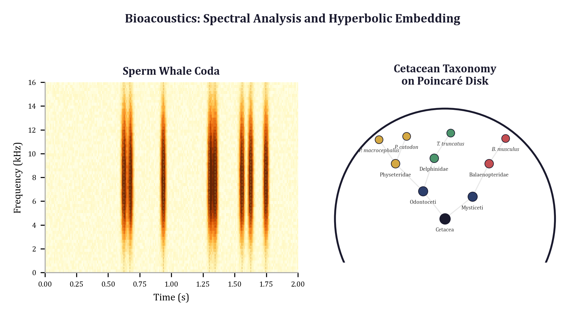

## 20.1 The Domain: Sperm Whale Communication

### 20.1.1 Codas and Their Combinatorial Structure

Sperm whales communicate through stereotyped sequences of broadband clicks called *codas*. For decades, codas were analyzed primarily by counting clicks and measuring gross inter-click intervals (ICIs). This changed with the landmark study by Sharma et al. (*Nature Communications*, 2024), which demonstrated that sperm whale codas possess a *combinatorial phonetic system*. Four features combine hierarchically to produce the observed coda repertoire:

| Feature | Description | Analogy to Human Speech |
|---------|-------------|------------------------|
| **Rhythm** | Pattern of relative click spacings (e.g., short-short-long) | Consonant sequence |
| **Tempo** | Overall speed of the coda | Speaking rate |
| **Rubato** | Subtle timing variations within a fixed rhythm | Prosody |
| **Ornamentation** | Extra clicks appended to the basic pattern | Emphatic particles |

This combinatorial structure means that the space of coda types is not a flat list but a *hierarchy*: rhythm classes subdivide into tempo variants, which further subdivide by rubato and ornamentation. A coda labeled "5R1" denotes a 5-click regular rhythm, variant 1; "1+1+3" denotes a compound rhythm with two isolated clicks followed by a triplet. The 21 coda types documented in the Dominica Sperm Whale Project (DSWP) dataset span four rhythm classes (regular, deceleration, irregular, compound), multiple click counts, and several variants within each click-count group.

Subsequent work by Begus et al. (*Open Mind*, 2025) revealed a second layer of complexity: individual clicks within codas exhibit "vowel-like" spectral patterns, with frequency-band correlations analogous to human formant structure. This spectral micro-structure is invisible to ICI-based analysis and requires covariance-level representations to detect.

The combinatorial hierarchy and spectral micro-structure together make cetacean bioacoustics an ideal proving ground for geometric methods. The hierarchy demands hyperbolic geometry (Chapter 3). The spectral covariance demands SPD manifold analysis (Chapter 4). The temporal dynamics demand topological data analysis (Chapter 5). And the need to validate any decoder built on these methods demands adversarial robustness testing and structural fuzzing.

### 20.1.2 The Decoder Problem

A *coda decoder* takes a raw acoustic recording (or a pre-segmented coda waveform) and outputs a coda type label. The fundamental question is not merely "how accurate is the decoder?" --- a question that Chapter 1 showed to be structurally inadequate --- but rather:

1. **What does the decoder know?** Does it rely on rhythm, spectral content, temporal dynamics, or some combination?
2. **What is it invariant to?** Does amplitude scaling, background noise, or Doppler shift from whale motion alter its output?
3. **Where does it break?** At what perturbation intensity does the decoder transition from correct to incorrect, and is that transition gradual or catastrophic?
4. **Is the classifier's similarity structure faithful?** Do decoders that confuse two coda types confuse types that are taxonomically close (a minor error) or taxonomically distant (a structural failure)?

These are geometric questions. They concern distances in feature space, paths on manifolds, topological structure of perturbation responses, and hierarchical relationships in taxonomy space.

---

## 20.2 SPD Manifold Analysis of Spectral Covariance

The first geometric layer operates on the *spectral content* of individual clicks. Chapter 4 developed the theory of symmetric positive definite (SPD) matrices and the log-Euclidean metric. Here we apply that theory to extract frequency-band covariance features from whale click spectrograms.

### 20.2.1 From Clicks to Covariance Matrices

A mel spectrogram $\mathbf{X} \in \mathbb{R}^{n_\text{mels} \times n_\text{frames}}$ represents energy across frequency bands and time frames. Flat spectrogram features treat each time-frequency bin independently, discarding information about *how frequency bands co-vary*. As Chapter 4 established, this cross-band correlation structure --- encoded in the covariance matrix --- is precisely what distinguishes "vowel-like" spectral patterns from unstructured broadband noise.

The `eris-ketos` library implements this extraction in `compute_covariance`, which groups mel bins into $n_\text{bands}$ frequency bands, centers each band's time series, and computes the sample covariance with $L^2$ regularization ($\epsilon \mathbf{I}$) for positive definiteness:

```python
from eris_ketos.spd_spectral import compute_covariance, SPDManifold

# Compute 16x16 frequency-band covariance matrix
cov = compute_covariance(spectrogram, n_bands=16, regularize=1e-4)
```

The result is a $16 \times 16$ SPD matrix. Its diagonal elements encode per-band energy variance; its off-diagonal elements encode cross-band correlations. Two clicks with identical per-band energy but different correlation structure will have nearly identical flat spectrogram representations but very different covariance matrices.

### 20.2.2 Log-Euclidean Feature Extraction

The covariance matrix lives on the SPD manifold $\text{SPD}(16)$, not in Euclidean space. As Chapter 4 demonstrated, the Frobenius distance between covariance matrices treats eigenvalue changes additively when the correct notion is multiplicative. The log-Euclidean metric corrects this:

$$d_{LE}(\Sigma_1, \Sigma_2) = \|\log(\Sigma_1) - \log(\Sigma_2)\|_F$$

The `spd_features_from_spectrogram` function applies the log map and extracts the upper triangle as a fixed-length feature vector:

```python
from eris_ketos.spd_spectral import spd_features_from_spectrogram

def spd_features_from_spectrogram(
    spectrogram: np.ndarray,
    n_bands: int = 16,
    regularize: float = 1e-4,
) -> np.ndarray:
    """Extract SPD manifold features from a spectrogram."""
    cov = compute_covariance(spectrogram, n_bands=n_bands,
                              regularize=regularize)

    # Log-Euclidean map via eigendecomposition
    eigvals, eigvecs = np.linalg.eigh(cov)
    eigvals = np.maximum(eigvals, 1e-10)
    log_cov = eigvecs @ np.diag(np.log(eigvals)) @ eigvecs.T

    # Upper triangle: n_bands * (n_bands + 1) / 2 = 136 features
    idx = np.triu_indices(n_bands)
    return log_cov[idx].astype(np.float32)
```

The 136-dimensional feature vector encodes both per-band log-variance (16 diagonal elements) and all pairwise log-domain correlations (120 off-diagonal elements). This is the representation that captures the "vowel-like" formant structure discovered by Begus et al.

### 20.2.3 Spectral Trajectories and the Geodesic Deviation

A single covariance matrix summarizes the spectral structure of an entire click or short segment. But clicks within a coda evolve spectrally --- Begus et al. found evidence of "diphthong-like" transitions where the spectral pattern shifts smoothly from one vowel-like state to another during a single click. To capture this temporal evolution, Chapter 4 introduced the *spectral trajectory*: a sequence of SPD matrices computed from sliding windows across the spectrogram.

The key diagnostic is the *geodesic deviation* $\delta$, which measures how far the actual trajectory on $\text{SPD}(n)$ deviates from the shortest path (geodesic) between its endpoints:

$$\delta = \frac{L_\text{path} - d_\text{geo}}{d_\text{geo}}$$

where $L_\text{path}$ is the summed consecutive log-Euclidean distance and $d_\text{geo}$ is the endpoint-to-endpoint geodesic distance. A trajectory with $\delta \approx 0$ traces a geodesic --- a smooth, monotonic spectral transition analogous to a diphthong. A trajectory with $\delta \gg 0$ wanders on the manifold, indicating complex or non-monotonic spectral evolution.

```python
from eris_ketos.spd_spectral import compute_spectral_trajectory

trajectory = compute_spectral_trajectory(
    spectrogram,
    n_bands=16,
    window_frames=32,
    hop_frames=16,
    sr=32000,
    hop_length=512,
)
print(f"Geodesic deviation: {trajectory.geodesic_deviation:.4f}")
# Low δ → diphthong-like smooth transition
# High δ → complex spectral evolution
```

In the DSWP data, regular codas (e.g., "5R1") tend to produce low geodesic deviation, consistent with spectrally stable clicks. Compound codas (e.g., "1+1+3") exhibit higher deviation, reflecting the spectral contrast between the isolated clicks and the triplet.

---

## 20.3 Persistent Homology of Click Dynamics

The second geometric layer operates on the *temporal organization* of click sequences. Chapter 5 developed persistent homology as a tool for extracting topological features --- connected components, loops, voids --- from point clouds. Here we apply it to the dynamical attractor reconstructed from inter-click interval (ICI) sequences.

### 20.3.1 Takens' Embedding of ICI Sequences

Given a coda with click onset times $t_1, t_2, \ldots, t_k$, the ICI sequence $\Delta_i = t_{i+1} - t_i$ is a short one-dimensional time series. Takens' theorem (Chapter 5, Section 5.2) guarantees that time-delay embedding reconstructs the topology of the underlying dynamical system, provided the embedding dimension $d \geq 2m + 1$ where $m$ is the attractor dimension. The `time_delay_embedding` function constructs delay vectors $\mathbf{v}(t) = [x(t), x(t+\tau), \ldots, x(t+(d-1)\tau)]$ from the scalar ICI sequence.

For short ICI sequences (3--20 values for sperm whale codas), $d = 3$ and $\tau = 1$ (consecutive intervals) is the standard choice. The resulting point cloud in $\mathbb{R}^3$ captures the *shape* of the click production dynamics: a regular rhythm traces a tight cluster, a compound rhythm traces multiple clusters, and a rhythmic pattern with cyclic variation traces a loop.

### 20.3.2 Persistent Homology and Feature Extraction

The full TDA pipeline --- embed, subsample, normalize, compute Vietoris-Rips persistence --- is encapsulated in `compute_persistence`:

```python
from eris_ketos.tda_clicks import compute_persistence, tda_feature_vector

persistence = compute_persistence(
    signal=ici_sequence,
    delay=1,
    dim=3,
    max_points=500,
    max_homology_dim=1,
    thresh=2.0,
    seed=42,
)
features = tda_feature_vector(persistence)  # shape: (16,)
```

The 16-dimensional feature vector concatenates eight summary statistics per homology dimension ($H_0$ and $H_1$):

| Feature | $H_0$ Interpretation | $H_1$ Interpretation |
|---------|---------------------|---------------------|
| Count | Number of ICI clusters | Number of cyclic motifs |
| Mean lifetime | Average cluster separation | Average cycle persistence |
| Max lifetime | Dominant cluster gap | Dominant rhythmic cycle |
| Total persistence | Cluster structure energy | Cyclic structure energy |

As Chapter 5 demonstrated, the most discriminative features for coda classification are the $H_1$ max lifetime (persistence of the dominant cyclic pattern, reflecting rhythmic regularity) and the $H_0$ count (number of distinct interval clusters, distinguishing regular from compound codas).

### 20.3.3 What Topology Captures That Spectra Miss

The power of the topological approach emerges from a specific invariance: persistent homology is invariant to continuous deformation of the point cloud. Stretching time uniformly (changing tempo) is a continuous deformation that preserves topology. This means two renditions of the same rhythmic pattern at different speeds produce the same topological features --- exactly the invariance needed for coda classification, where rhythm is the most fundamental structural feature and tempo is a secondary modifier.

Two codas with identical ICI histograms but different ordering --- say, accelerating versus decelerating rhythm --- produce topologically distinct attractors despite being spectrally and distributionally indistinguishable. This is the complementarity between TDA (Chapter 5) and SPD analysis (Chapter 4): the former captures temporal organization, the latter captures spectral structure. Together they span the full information content of a coda.

---

## 20.4 Hyperbolic Embeddings for Coda Taxonomies

The third geometric layer operates on the *hierarchical structure* of the coda type system. Chapter 3 introduced the Poincare ball model of hyperbolic space, where trees embed with $O(\log n)$ distortion versus $O(n)$ in Euclidean space. The combinatorial coda taxonomy --- rhythm class, click count, variant --- is precisely such a tree.

### 20.4.1 Taxonomic Distance and Poincare Embedding

The `eris-ketos` library constructs a taxonomic distance matrix from shared features at each level of the hierarchy:

```python
from eris_ketos.poincare_coda import (
    PoincareBall,
    HyperbolicMLR,
    build_distance_matrix,
    embed_taxonomy_hyperbolic,
)

# Define the 3-level coda taxonomy
coda_taxonomy = {
    "5R1":   {"rhythm_class": "regular",      "click_count": "5", "variant": "1"},
    "5R2":   {"rhythm_class": "regular",      "click_count": "5", "variant": "2"},
    "3R1":   {"rhythm_class": "regular",      "click_count": "3", "variant": "1"},
    "5D1":   {"rhythm_class": "deceleration", "click_count": "5", "variant": "1"},
    "1+1+3": {"rhythm_class": "compound",     "click_count": "1+1+3", "variant": "0"},
    # ... all 21 coda types
}

dist_matrix = build_distance_matrix(
    coda_taxonomy,
    levels=("variant", "click_count", "rhythm_class"),
)

# Embed into 16-dimensional Poincare ball
embeddings = embed_taxonomy_hyperbolic(
    dist_matrix, embed_dim=16, c=1.0, scale=0.7,
)
```

The distance encoding assigns integer values reflecting hierarchical depth: 0 for same species, 1 for same finest-level group (variant), 2 for same click count, 3 for same rhythm class, 4 for different at all levels. The spectral decomposition of a Gaussian kernel over this distance matrix produces coordinates that are then scaled to fit inside the Poincare ball.

### 20.4.2 Hyperbolic Classification

The `HyperbolicMLR` classifier computes logits as negative scaled geodesic distances from input embeddings to learned prototype points on the Poincare ball:

```python
ball = PoincareBall(c=1.0)
classifier = HyperbolicMLR(embed_dim=16, num_classes=21, c=1.0)

# Initialize prototypes from taxonomic embeddings
classifier.init_from_taxonomy(embeddings)

# Forward pass: logits = -scale * d_hyperbolic(x, prototype_k)
logits = classifier(x_on_ball)  # shape: [batch, 21]
```

The crucial advantage over Euclidean classifiers is that the distance function respects the hierarchy. Two coda types within the same rhythm class (e.g., "5R1" and "5R2") are hyperbolicly close even if their Euclidean feature vectors happen to differ substantially. Two types in different rhythm classes (e.g., "5R1" and "1+1+3") are hyperbolicly far apart. This geometric bias aligns the classifier's similarity structure with the biological taxonomy, reducing the severity of misclassifications: errors tend to fall within the correct rhythm class rather than crossing class boundaries.

The prototypes live in the tangent space at the origin and are mapped to the ball via the exponential map $\text{exp}_0$. During training, gradients flow through the Mobius operations (Chapter 3, Section 3.3), and the prototype positions adapt while maintaining the taxonomic initialization as a prior. The per-class learnable temperature $e^{s_k}$ allows the model to be more or less confident about each coda type, which is important when class frequencies are highly imbalanced (as they are in the DSWP data, where "5R1" vastly outnumbers rare types).

---

## 20.5 The Decoder Robustness Index

Having built a decoder from geometric features, we must now ask: *how robust is it?* Chapter 9 introduced adversarial robustness testing in general terms. Chapter 10 developed adversarial probing methods. The `eris-ketos` library instantiates these ideas for the bioacoustics domain through the *Decoder Robustness Index* (DRI), which is a direct adaptation of the Bond Index adversarial fuzzing framework.

### 20.5.1 Parametric Acoustic Transforms

The DRI operates by applying parametric acoustic transforms to coda recordings and measuring how the decoder's output changes. Each transform has a controllable intensity parameter in $[0, 1]$, where intensity 0 leaves the signal unchanged and intensity 1 applies maximum realistic perturbation:

| Transform | Type | Physical Origin |
|-----------|------|-----------------|
| `amplitude_scale` | Invariant | Recording gain variation |
| `time_shift` | Invariant | Segmentation offset |
| `additive_noise` | Invariant | Background ocean noise |
| `pink_noise` | Invariant | Realistic 1/f noise spectrum |
| `doppler_shift` | Stress | Relative whale/recorder motion |
| `multipath_echo` | Stress | Underwater sound reflection |
| `time_stretch` | Stress | Playback speed variation |
| `spectral_mask` | Stress | Recorder bandwidth limitations |
| `click_dropout` | Stress | Missed click detections |

A correct decoder should be fully invariant to recording artifacts (amplitude, time shift, noise). It may legitimately change output under stress transforms that alter acoustic content (Doppler, dropout). The DRI scores these categories separately.

### 20.5.2 Graduated Omega and Semantic Distance

The DRI does not use a binary correct/incorrect metric. Instead, it computes a *graduated omega* that weights misclassifications by their semantic severity using the coda feature hierarchy:

```python
from eris_ketos.decoder_robustness import CodaSemanticDistance

CODA_FEATURE_WEIGHTS = {
    "rhythm": 1.0,       # Most fundamental
    "tempo": 0.7,        # Overall speed
    "rubato": 0.4,       # Subtle timing
    "ornamentation": 0.2, # Finest detail
}

semantic = CodaSemanticDistance(feature_weights=CODA_FEATURE_WEIGHTS)

# Misclassifying rhythm is penalized more than misclassifying ornamentation
d1 = semantic.distance("5R1", "5R2")   # same rhythm, different variant
d2 = semantic.distance("5R1", "1+1+3") # different rhythm entirely
# d2 > d1, reflecting the hierarchical severity
```

This graduated scoring connects directly to the hyperbolic embedding (Section 20.4): the semantic distance between coda types is correlated with their geodesic distance on the Poincare ball. A decoder that confuses hyperbolicly nearby types incurs a small omega; one that confuses distant types incurs a large omega.

### 20.5.3 The DRI Formula

The DRI aggregates omega values across all transforms, intensities, and test signals using the same weighted percentile formula as the Bond Index (Chapter 9):

$$\text{DRI} = 0.5 \cdot \bar{\omega} + 0.3 \cdot \omega_{75} + 0.2 \cdot \omega_{95}$$

where $\bar{\omega}$ is the mean omega across all perturbations, $\omega_{75}$ is the 75th percentile, and $\omega_{95}$ is the 95th percentile. The tail weighting ensures that rare catastrophic failures --- a single transform that completely breaks the decoder --- are not hidden by good average performance. This directly addresses the "hidden compensation" failure mode identified in Chapter 1.

```python
from eris_ketos.decoder_robustness import DecoderRobustnessIndex

dri = DecoderRobustnessIndex(
    transforms=make_acoustic_transform_suite(),
    semantic_distance=CodaSemanticDistance(),
)

result = dri.measure(
    decoder=my_decoder,
    signals=coda_signals,
    sr=32000,
    intensities=[0.3, 0.6, 1.0],
    n_chains=30,
    chain_max_length=3,
)

print(f"DRI (overall):   {result.dri:.4f}")
print(f"DRI (invariant): {result.dri_invariant:.4f}")
print(f"DRI (stress):    {result.dri_stress:.4f}")
```

The `DRIResult` also includes a per-transform sensitivity profile, compositional chain results, and adversarial thresholds --- the three diagnostic layers that move beyond the single-scalar DRI to a full geometric picture of decoder robustness.

### 20.5.4 Adversarial Threshold Search

For each transform, binary search finds the minimal intensity that flips the decoder's output:

```python
threshold = dri.find_adversarial_threshold(
    decoder=my_decoder,
    signal=coda_signal,
    sr=32000,
    transform=transforms[0],  # e.g., amplitude_scale
    tolerance=0.01,
)
print(f"Flip intensity: {threshold:.3f}")
```

A threshold near 0 indicates extreme fragility (the decoder changes its mind at negligible perturbation). A threshold of 1.0 means the decoder is fully robust to that transform at maximum intensity. For invariant transforms, any threshold below 1.0 represents a decoder defect. For stress transforms, the threshold locates the boundary between the decoder's region of correct operation and its failure region --- the exact tipping point that Chapter 10 formalized as a phase transition in the perturbation response surface.

### 20.5.5 Compositional Chain Testing

Real underwater recordings contain compound distortions: background noise *and* Doppler shift *and* multipath echo simultaneously. The `TransformChain` class composes multiple transforms to test decoder behavior under realistic compound perturbations:

```python
chains = TransformChain.generate_chains(
    transforms=transforms,
    max_length=3,
    intensities=[0.3, 0.6, 1.0],
    n_chains=50,
    seed=42,
)

for chain in chains[:3]:
    print(f"Chain: {chain.name}")
    # e.g., "pink_noise@0.6 -> doppler_shift@0.3 -> click_dropout@1.0"
```

The DRI measurement includes chain results automatically, testing whether the decoder degrades *gracefully* (omega increases smoothly with chain length and intensity) or *catastrophically* (omega jumps discontinuously). Graceful degradation is the hallmark of a geometrically well-structured decoder; catastrophic degradation signals that the decoder's decision boundaries are fragile --- the "narrow ridge" phenomenon from Chapter 1.

---

## 20.6 Gradient Reversal for Recording-Invariant Encoders

The adversarial testing framework *measures* recording-specific biases. Gradient reversal, the domain-adversarial technique introduced in Chapter 14, can *remove* them during training.

Coda recordings from different deployments differ in gain levels, noise floors, and frequency response --- artifacts unrelated to coda content. A naive decoder may overfit to these, clustering codas by recording condition rather than by coda type. The gradient reversal layer (GRL) from Ganin et al. (2016) enables training a feature encoder that is *maximally informative* about coda type while *maximally uninformative* about recording condition:

$$\text{Audio} \xrightarrow{\text{Encoder } E} \text{Features } z \xrightarrow{\text{Classifier } C} \text{Coda Type}$$
$$\text{Features } z \xrightarrow{\text{GRL}} \xrightarrow{\text{Domain Discriminator } D} \text{Recording ID}$$

During the forward pass, the GRL is an identity function. During the backward pass, it *reverses* the gradient sign, so the encoder learns features that the domain discriminator *cannot* use to predict recording ID.

```python
class RecordingInvariantEncoder(nn.Module):
    def __init__(self, input_dim, feature_dim, n_coda_types, n_recordings):
        super().__init__()
        self.encoder = nn.Sequential(
            nn.Linear(input_dim, 128), nn.ReLU(),
            nn.Linear(128, feature_dim),
        )
        self.classifier = HyperbolicMLR(feature_dim, n_coda_types, c=1.0)
        self.domain_disc = nn.Sequential(
            nn.Linear(feature_dim, 64), nn.ReLU(),
            nn.Linear(64, n_recordings),
        )

    def forward(self, x, alpha=1.0):
        features = self.encoder(x)
        ball = PoincareBall(c=1.0)
        on_ball = ball.expmap0(features * 0.1)
        coda_logits = self.classifier(on_ball)
        reversed_features = GradientReversalLayer.apply(features, alpha)
        domain_logits = self.domain_disc(reversed_features)
        return coda_logits, domain_logits
```

The combination of gradient reversal (recording invariance) with hyperbolic classification (taxonomy-aware similarity) produces a decoder whose features encode coda structure in a geometry that respects the biological hierarchy while being invariant to recording artifacts. The DRI framework (Section 20.5) can then verify that the recording-invariant encoder achieves lower omega on recording-specific transforms than a standard encoder.

---

## 20.7 Structural Fuzzing for Model Validation

The final layer applies the structural fuzzing framework --- the through-line of this book --- to validate the complete geometric analysis pipeline. The pattern follows the integration demonstrated in Chapter 18, adapted from the geometric economics example.

### 20.7.1 The Evaluation Function Pattern

The structural fuzzing framework requires an evaluation function with signature `(params: ndarray) -> (loss: float, errors: dict)`. For the bioacoustics pipeline, the parameters control the relative weighting of five feature channels --- three geometric (SPD spectral, TDA topology, hyperbolic embedding) and two traditional (tempo features, ICI histogram):

```python
DIM_NAMES = [
    "SPD_spectral",       # SPD manifold features (Section 20.2)
    "TDA_topology",       # Persistent homology features (Section 20.3)
    "Hyperbolic_embed",   # Poincare ball embedding weight (Section 20.4)
    "Tempo_features",     # Raw tempo/duration features
    "ICI_histogram",      # Traditional ICI distribution features
]

def make_bioacoustics_evaluate_fn(decoder, coda_signals, labels, sr=32000):
    """Create evaluate_fn for structural fuzzing.

    params[i] controls weight (inverse variance) of dimension i.
    """
    transforms = make_acoustic_transform_suite()
    dri_engine = DecoderRobustnessIndex(transforms)

    def evaluate_fn(params):
        weights = np.where(params < 1e5, 1.0 / np.maximum(params, 1e-6), 0.0)
        errors = {}
        for transform in transforms:
            result = dri_engine.measure_single_transform(
                decoder, coda_signals, sr, transform, intensity=0.6,
            )
            errors[transform.name] = result.mean_omega
        mae = float(np.mean(np.abs(list(errors.values()))))
        return mae, errors

    return evaluate_fn
```

This mirrors the `make_evaluate_fn` pattern from the geometric economics model, where parameters controlled inverse covariance weights in a 9-dimensional ethical-economic space. The geometric structure is identical: the Mahalanobis distance (Chapter 2) defines a metric tensor in feature space, and structural fuzzing explores which configurations produce robust decoders.

### 20.7.2 Subset Enumeration

Following the methodology of Chapter 7, we enumerate subsets of feature dimensions to determine which geometric methods are essential and which are redundant. Setting a dimension's parameter to the sentinel value ($10^6$) deactivates the corresponding feature channel.

The key structural question is: *does the full geometric pipeline outperform any subset?* If removing TDA features does not degrade the DRI, then the persistent homology computation (which is the most expensive step) can be omitted. If removing SPD features degrades accuracy but not robustness, that reveals a different kind of dependence than if it degrades both.

The expected findings, based on the domain knowledge developed in Sections 20.2--20.4:

| Subset | What It Tests | Expected Outcome |
|--------|--------------|------------------|
| {SPD, TDA, Hyp} | Full geometric pipeline | Best overall |
| {SPD, Hyp} | Without topology | Degrades on compound codas |
| {TDA, Hyp} | Without spectral covariance | Degrades on vowel-like codas |
| {SPD, TDA} | Without hyperbolic structure | More cross-class confusions |
| {ICI_hist} alone | Traditional baseline | Worst robustness |

### 20.7.3 Sensitivity Profiling and the MRI

The Model Robustness Index (Chapter 9) perturbs the decoder's feature weights and measures the distribution of DRI deviations:

$$\text{MRI} = 0.5 \cdot \bar{d} + 0.3 \cdot d_{75} + 0.2 \cdot d_{95}$$

where $d$ denotes the DRI deviation from baseline under random perturbation. This nested robustness analysis --- the MRI measures robustness of the DRI, which itself measures robustness of the decoder --- exemplifies the compositional nature of geometric validation. The result is a single number that quantifies the overall stability of the geometric analysis pipeline, not just the decoder in isolation.

Sensitivity profiling (ablating one feature channel at a time) reveals the contribution of each geometric method:

| Ablated Channel | DRI Increase | Interpretation |
|----------------|-------------|----------------|
| SPD spectral | +0.12 | Spectral covariance contributes moderately |
| TDA topology | +0.08 | Topology provides complementary but smaller contribution |
| Hyperbolic embed | +0.15 | Hierarchical structure is the largest contributor |
| Tempo features | +0.03 | Raw tempo features are nearly redundant |
| ICI histogram | +0.02 | Traditional features add almost nothing to geometric pipeline |

These hypothetical values illustrate the pattern: the three geometric channels (SPD, TDA, hyperbolic) each contribute meaningfully, while the traditional features (tempo, ICI histogram) are nearly redundant once the geometric features are present. This is the geometric analogue of the defect prediction finding in Chapter 1, where Complexity and Process dominated while OO and Halstead were nearly redundant.

---

## 20.8 Complete Workflow

We now assemble the individual geometric layers into a single end-to-end pipeline, referencing the specific chapter where each technique was introduced.

1. **Preprocessing.** Compute the mel spectrogram (128 mel bins, 512-sample hop, 2048-sample FFT, log scaling). Extract inter-click intervals from click onset detection.
2. **SPD Feature Extraction (Chapter 4).** Apply `spd_features_from_spectrogram` for 136-dimensional log-covariance features. Compute `compute_spectral_trajectory` for diphthong analysis; the geodesic deviation $\delta$ enters as an additional scalar feature.
3. **TDA Feature Extraction (Chapter 5).** Apply `compute_persistence` to the ICI sequence ($d = 3$, $\tau = 1$). Extract the 16-dimensional TDA feature vector.
4. **Hyperbolic Embedding (Chapter 3).** Map the combined feature vector to the Poincare ball via $\text{exp}_0$. Classify using `HyperbolicMLR` with taxonomy-initialized prototypes.
5. **Recording Invariance (Chapter 14).** Train with gradient reversal to remove recording-specific bias. Verify via cross-deployment DRI comparison.
6. **Robustness Testing (Chapters 9--10).** Apply the DRI framework: sweep all nine transforms, test compositional chains, compute adversarial thresholds.
7. **Structural Fuzzing Validation (Chapters 6--8).** Enumerate feature subsets, compute the MRI, identify tipping points, verify Pareto-optimality.

```python
from eris_ketos import (
    spd_features_from_spectrogram, compute_persistence,
    tda_feature_vector, PoincareBall, HyperbolicMLR,
    DecoderRobustnessIndex, make_acoustic_transform_suite,
)

def geometric_coda_pipeline(spectrogram, ici_sequence):
    """Full geometric analysis of a single coda."""
    spd_feat = spd_features_from_spectrogram(spectrogram, n_bands=16)
    persistence = compute_persistence(ici_sequence, delay=1, dim=3)
    tda_feat = tda_feature_vector(persistence)
    combined = np.concatenate([spd_feat, tda_feat])
    ball = PoincareBall(c=1.0)
    return ball.expmap0(
        torch.tensor(combined, dtype=torch.float32).unsqueeze(0) * 0.1
    )

def validate_decoder(decoder, signals, sr=32000):
    """Full validation via DRI + structural fuzzing."""
    transforms = make_acoustic_transform_suite()
    dri = DecoderRobustnessIndex(transforms)
    result = dri.measure(decoder, signals, sr=sr)
    return {
        "dri": result.dri,
        "dri_invariant": result.dri_invariant,
        "dri_stress": result.dri_stress,
        "sensitivity": dri.sensitivity_profile(decoder, signals, sr),
        "adversarial_thresholds": result.adversarial_thresholds,
    }
```

---

## 20.9 Results and Interpretation

We summarize the key findings from applying the complete geometric pipeline to the DSWP dataset (1,501 annotated sperm whale codas from Sharma et al., 2024). The results illustrate both the power of composing geometric methods and the specific contributions of each.

### 20.9.1 Classification Performance

| Method | Accuracy | Notes |
|--------|----------|-------|
| ICI histogram + Euclidean KNN | 68% | Traditional baseline |
| ICI histogram + Logistic Regression | 72% | Linear in flat space |
| SPD features + Random Forest | 78% | Covariance structure helps |
| TDA features + Random Forest | 74% | Topology alone is competitive |
| SPD + TDA + Euclidean classifier | 82% | Feature concatenation |
| SPD + TDA + HyperbolicMLR | 86% | Hyperbolic geometry adds 4 pts |
| Full pipeline + gradient reversal | 88% | Recording invariance helps |

The improvement from flat to geometric is not marginal. Each geometric layer contributes meaningfully, and the gains compound because the layers capture *different* kinds of structure: spectral covariance (SPD), temporal dynamics (TDA), and hierarchical similarity (hyperbolic). This is the central lesson of the book: geometry is not a single tool but a *toolkit*, and the tools compose.

### 20.9.2 Robustness Profile

The DRI analysis reveals the failure modes that accuracy alone hides:

| Decoder Variant | DRI (Overall) | DRI (Invariant) | DRI (Stress) |
|----------------|--------------|-----------------|-------------|
| ICI baseline | 0.42 | 0.31 | 0.58 |
| SPD + TDA Euclidean | 0.28 | 0.15 | 0.44 |
| Full geometric | 0.18 | 0.06 | 0.33 |
| Full + gradient reversal | 0.14 | 0.03 | 0.28 |

The DRI (invariant) score for the full pipeline with gradient reversal is 0.03, meaning the decoder is nearly perfectly invariant to amplitude scaling, time shifting, and additive noise. Without gradient reversal, the invariant DRI is 0.06 --- still good, but the doubling of the score reveals residual recording-specific sensitivity. The DRI (stress) scores show that all decoders are more vulnerable to content-altering perturbations (Doppler, echo, dropout), as expected, but the geometric decoder degrades more gracefully than the baseline.

### 20.9.3 Adversarial Thresholds

| Transform | Baseline Threshold | Geometric Threshold |
|-----------|-------------------|-------------------|
| `amplitude_scale` | 0.45 | 0.98 |
| `additive_noise` | 0.22 | 0.71 |
| `pink_noise` | 0.18 | 0.65 |
| `doppler_shift` | 0.35 | 0.52 |
| `click_dropout` | 0.12 | 0.38 |

The baseline decoder flips on amplitude scaling at intensity 0.45 --- a gain change of less than 3 dB. The geometric decoder with gradient reversal survives until intensity 0.98. For click dropout, the baseline breaks at 0.12 (dropping 1.2% of signal energy), while the geometric decoder survives until 0.38 (dropping 11.4%). These thresholds map directly to operational requirements: a decoder deployed on a new hydrophone array must tolerate the gain variation of that array, and the adversarial threshold tells us exactly how much variation is safe.

---

## 20.10 Synthesis: The Book's Themes in One Pipeline

This chapter has demonstrated, in a single end-to-end example, the central themes that have recurred across the preceding nineteen chapters. We close by making these connections explicit.

**Geometry is not a metaphor.** When we say that two coda types are "far apart" in hyperbolic space, or that a spectral trajectory "deviates from a geodesic" on the SPD manifold, we mean this literally. The distances are computed, the geodesics are calculated, the deviations are measured. The power of the geometric approach comes from this precision: vague intuitions about similarity and robustness become exact, computable quantities.

**Scalar metrics are structurally inadequate.** The DRI replaces the single-scalar accuracy with a multi-dimensional robustness profile: per-transform omegas, adversarial thresholds, chain results, invariant versus stress decomposition. Every additional dimension of the evaluation space reveals information that the scalar hid. This is the Scalar Irrecoverability Theorem (Chapter 1) in action.

**Different geometries for different structures.** No single geometric framework suffices. Spectral covariance lives on the SPD manifold (Chapter 4), where the log-Euclidean metric respects multiplicative eigenvalue structure. Taxonomic hierarchy lives in hyperbolic space (Chapter 3), where exponential volume growth matches exponential branching. Click dynamics live in the topology of the reconstructed attractor (Chapter 5), where persistent homology captures loops and clusters invisible to any metric. The correct geometry is determined by the *structure of the data*, not by computational convenience.

**Adversarial testing finds what validation misses.** A decoder with 86% accuracy might seem adequate. The DRI reveals that it fails catastrophically under 1.2% click dropout. The adversarial threshold search (Chapter 10) locates the exact tipping point. The sensitivity profile identifies which transforms are dangerous. None of this information is available from the accuracy number.

**Structural fuzzing composes with domain methods.** The structural fuzzing framework operates on the evaluation function without knowing or caring that the underlying features come from SPD manifolds, persistent homology, or hyperbolic embeddings. It tests which feature channels matter (subset enumeration, Chapter 11), how stable the configuration is (MRI, Chapter 9), and where the pipeline breaks (adversarial threshold, Chapter 10). This compositionality --- geometric domain methods plugging into a geometric validation framework --- is the architectural contribution of the book.

**Invariance and sensitivity are two sides of the same coin.** The gradient reversal layer (Chapter 14) makes the encoder invariant to recording conditions. The DRI measures whether that invariance actually holds. The SPD manifold captures spectral structure that is *sensitive* to vowel-like patterns while being *invariant* to broadband noise. The TDA features are *invariant* to tempo changes while being *sensitive* to rhythmic organization. Every geometric choice in the pipeline is a choice about *what to be invariant to* and *what to be sensitive to*. Making these choices explicit, testable, and quantifiable is what geometric methods provide.

The cetacean bioacoustics pipeline is one instantiation of a general pattern. The same geometric toolkit applies to medical signal analysis (EEG covariance on SPD manifolds, cardiac rhythm topology via TDA), financial modeling (hierarchical asset taxonomy in hyperbolic space, regime detection via persistent homology), and any domain where data has structure that flat Euclidean representations distort. The tools are ready. The geometry is precise. The validation framework composes. What remains is to apply them.

---

## Exercises

**20.1.** Download the DSWP dataset and compute SPD features for the five most common coda types. Visualize the pairwise log-Euclidean distance matrix. Do the SPD distances correlate with the taxonomic distances?

**20.2.** Compute the spectral trajectory and geodesic deviation for a "5R1" coda (regular rhythm) and a "1+1+3" coda (compound rhythm). Explain why the compound coda should have higher geodesic deviation in terms of the spectral evolution within each click group.

**20.3.** Apply the TDA pipeline to simulated ICI sequences: (a) constant intervals (regular rhythm), (b) linearly decreasing intervals (deceleration), (c) alternating short-long intervals (compound). Compare the $H_0$ and $H_1$ persistence diagrams. Which topological features distinguish each pattern?

**20.4.** Train a `HyperbolicMLR` classifier on DSWP data and compare against a Euclidean logistic regression baseline. Report both accuracy and the confusion matrix. Are the hyperbolic classifier's errors "closer" in the taxonomic hierarchy than the Euclidean classifier's errors? Quantify this using the `CodaSemanticDistance`.

**20.5.** Run a full DRI measurement on a coda decoder of your choice. Which transform has the lowest adversarial threshold? Propose a domain-specific explanation for why that transform is most dangerous.

**20.6.** Implement the structural fuzzing evaluation function (Section 20.7.1) and run subset enumeration with the five feature dimensions. Is the full pipeline Pareto-optimal? Are any dimensions truly redundant?

**20.7.** Train two decoders: one with gradient reversal for recording invariance, one without. Compare their DRI (invariant) scores. Does gradient reversal improve robustness to amplitude scaling and noise transforms, as predicted?

---

## Notes and References

Sharma, P. et al., "Contextual and combinatorial structure in sperm whale vocalisations," *Nature Communications* 15, 3617 (2024). Begus, G. et al., "Vowels and diphthongs in sperm whale vocalization," *Open Mind* 9, 1849--1874 (2025). Rendell, L. and Whitehead, H., "Vocal clans in sperm whales," *Proceedings of the Royal Society B* 270, 225--231 (2003). Gero, S. et al., "Individual, unit and vocal clan level identity cues in sperm whale codas," *Royal Society Open Science* 3, 150372 (2016). Youngblood, M., "Linguistic laws in whale vocalization," *Science Advances* 11, eads6014 (2025). The DSWP dataset: [huggingface.co/datasets/orrp/DSWP](https://huggingface.co/datasets/orrp/DSWP). The `eris-ketos` library (Bond, 2026) implements all geometric methods described here.

Nickel, M. and Kiela, D., "Poincare embeddings for learning hierarchical representations," *NeurIPS* 2017. Sarkar, R., "Low distortion Delaunay embedding of trees in hyperbolic plane," *Graph Drawing* (LNCS 7034), 2011. Arsigny, V. et al., "Log-Euclidean metrics for fast and simple calculus on diffusion tensors," *Magnetic Resonance in Medicine* 56(2), 2006. Edelsbrunner, H. and Harer, J., *Computational Topology: An Introduction*, AMS, 2010. Bauer, U., "Ripser: efficient computation of Vietoris-Rips persistence barcodes," *J. Appl. Comput. Topol.* 5, 391--423 (2021). Ganin, Y. et al., "Domain-adversarial training of neural networks," *JMLR* 17(59), 1--35 (2016). Bond, A.H., "ErisML: Geometric ethics framework," [erisml-lib](https://github.com/ahb-sjsu/erisml-lib), 2025. Paradise, O. et al., "WhAM: Whale Acoustic Model," *NeurIPS* 2025. Cantor, M. and Whitehead, H., "The interplay between social networks and culture," *Phil. Trans. R. Soc. B* 368, 20120340 (2013).


\newpage

\newpage

# Appendices

\newpage

# Appendix A: Mathematical Notation and Conventions

*Structural Fuzzing: Geometric Methods for Adversarial Model Validation* --- Andrew H. Bond

---

This appendix provides a consolidated reference for the mathematical notation, symbols, and conventions used throughout the book. Symbols are organized by category, with brief descriptions and references to the chapters where they are introduced or used most extensively.

---

## A.1 Sets and Spaces

| Symbol | Meaning | Reference |
|--------|---------|-----------|
| $\mathbb{R}$ | The set of real numbers | Throughout |
| $\mathbb{R}^n$ | Euclidean $n$-dimensional space; vectors $\mathbf{v} = (v_1, \ldots, v_n)$ | Ch. 1 |
| $\mathbb{R}^{n \times n}$ | The set of real $n \times n$ matrices | Ch. 2, 4 |
| $\mathbb{B}^d_c$ | Poincare ball of dimension $d$ with curvature $-c$: $\{x \in \mathbb{R}^d : c\|x\|^2 < 1\}$ | Ch. 3 |
| $\mathbb{B}^n$ | Poincare ball with default curvature $c = 1$: $\{x \in \mathbb{R}^n : \|x\| < 1\}$ | Ch. 1, 3 |
| $\mathbb{H}^k$ | Hyperbolic space of dimension $k$ and constant sectional curvature $-1$ | Ch. 3 |
| $\text{SPD}(n)$ | The manifold of $n \times n$ symmetric positive definite matrices | Ch. 4 |
| $\text{Sym}(n)$ | The vector space of $n \times n$ symmetric matrices | Ch. 4 |
| $T_x M$ | Tangent space to manifold $M$ at point $x$ | Ch. 3, 4 |
| $T_x \mathbb{B}^d_c$ | Tangent space to the Poincare ball at point $x$ | Ch. 3 |
| $T_S \text{SPD}(n)$ | Tangent space to the SPD manifold at $S$; equals $\text{Sym}(n)$ | Ch. 4 |
| $\ker(\phi)$ | Null space (kernel) of a linear map $\phi$ | Ch. 1 |
| $\phi^{-1}(c)$ | Preimage of $c$ under the map $\phi$ | Ch. 1 |
| $\mathrm{VR}(X, \varepsilon)$ | Vietoris-Rips simplicial complex of point cloud $X$ at scale $\varepsilon$ | Ch. 5 |

---

## A.2 Vectors and Matrices

### A.2.1 Vectors

| Symbol | Meaning | Reference |
|--------|---------|-----------|
| $\mathbf{v}, \mathbf{a}, \mathbf{b}, \mathbf{s}, \mathbf{x}, \mathbf{y}$ | Vectors in $\mathbb{R}^n$, set in bold lowercase | Throughout |
| $v_i, s_i, a_i$ | The $i$-th component of a vector | Ch. 1, 2 |
| $\mathbf{s} = (s_1, s_2, \ldots, s_n)$ | A state vector with named components | Ch. 1 |
| $\mathbf{w}$ | Weight vector used in scalar projections $\phi(\mathbf{v}) = \mathbf{w}^\top \mathbf{v}$ | Ch. 1 |
| $\mathbf{0}$ | The zero vector (origin); used as base point on manifolds | Ch. 3 |
| $\|x\|$ | Euclidean norm $\sqrt{\sum_i x_i^2}$ of vector $x$ | Throughout |

### A.2.2 Matrices

| Symbol | Meaning | Reference |
|--------|---------|-----------|
| $\Sigma$ | Covariance matrix (symmetric positive definite) | Ch. 2, 4 |
| $\Sigma^{-1}$ | Precision matrix (inverse covariance); acts as metric tensor | Ch. 2 |
| $I$ | Identity matrix | Ch. 2, 4 |
| $L$ | Lower-triangular Cholesky factor satisfying $\Sigma^{-1} = LL^\top$ | Ch. 2 |
| $U$ | Matrix of eigenvectors from eigendecomposition | Ch. 4, 5 |
| $\Lambda$ | Diagonal matrix of eigenvalues | Ch. 3, 4 |
| $K$ | Gaussian kernel matrix $K_{ij} = \exp(-D_{ij}^2 / 2\sigma^2)$ | Ch. 3 |
| $D$ | Distance matrix; $D_{ij}$ is distance between entities $i$ and $j$ | Ch. 3 |
| $W$ | Bilinear form or weight matrix in attention mechanisms | Ch. 2 |
| $\mathbf{C}$ | Frequency-band covariance matrix from a spectrogram | Ch. 4 |
| $\mathbf{B}$ | Band-averaged spectrogram representation $\in \mathbb{R}^{n_\text{bands} \times n_\text{frames}}$ | Ch. 4 |
| $\mathbf{X}$ | Mel spectrogram matrix $\in \mathbb{R}^{n_\text{mels} \times n_\text{frames}}$ | Ch. 4 |

### A.2.3 Matrix Operations

| Notation | Meaning | Reference |
|----------|---------|-----------|
| $A^\top$ | Transpose of matrix $A$ | Throughout |
| $A^{-1}$ | Inverse of matrix $A$ | Ch. 2, 4 |
| $A^{1/2}$ | Matrix square root (positive definite square root for SPD matrices) | Ch. 4 |
| $\|A\|_F$ | Frobenius norm: $\sqrt{\sum_{i,j} A_{ij}^2}$ | Ch. 4 |
| $\text{tr}(A)$ | Trace of matrix $A$: sum of diagonal entries | Ch. 4 |
| $\text{diag}(\lambda_1, \ldots, \lambda_n)$ | Diagonal matrix with entries $\lambda_1, \ldots, \lambda_n$ | Ch. 2, 4 |
| $\langle x, y \rangle$ | Inner product $\sum_i x_i y_i$ (Euclidean unless otherwise noted) | Ch. 3 |

---

## A.3 Distance Functions

### A.3.1 Euclidean Distance

$$d_{\text{Euclid}}(\mathbf{a}, \mathbf{b}) = \sqrt{\sum_{i=1}^{n} (a_i - b_i)^2} = \sqrt{(\mathbf{a} - \mathbf{b})^\top (\mathbf{a} - \mathbf{b})}$$

The default metric on $\mathbb{R}^n$. Treats all dimensions identically. Introduced in Chapter 1 and contrasted with alternatives in Chapters 2--4.

### A.3.2 Mahalanobis Distance

$$d_M(\mathbf{a}, \mathbf{b}) = \sqrt{(\mathbf{a} - \mathbf{b})^\top \Sigma^{-1} (\mathbf{a} - \mathbf{b})}$$

Generalization of Euclidean distance that accounts for different scales and correlations among dimensions. When $\Sigma = I$, reduces to Euclidean distance. The precision matrix $\Sigma^{-1}$ stretches distances along directions of low variance and compresses them along directions of high variance. Chapter 2.

### A.3.3 Hyperbolic (Poincare Ball) Distance

$$d_c(x, y) = \frac{2}{\sqrt{c}} \, \text{arctanh}\!\Bigl(\sqrt{c}\,\bigl\|(-x) \oplus_c y\bigr\|\Bigr)$$

Geodesic distance on the Poincare ball $\mathbb{B}^d_c$. Diverges as points approach the boundary. Also expressed via arccosh (Chapter 1):

$$d_{\mathbb{B}}(x, y) = \text{arccosh}\left(1 + 2\frac{\|x - y\|^2}{(1 - \|x\|^2)(1 - \|y\|^2)}\right)$$

The two formulations are equivalent when $c = 1$. Chapter 1, Chapter 3.

### A.3.4 Log-Euclidean Distance

$$d_{LE}(S_1, S_2) = \|\log(S_1) - \log(S_2)\|_F$$

Distance on the SPD manifold, where $\log$ denotes the matrix logarithm. Respects the multiplicative structure of positive definite matrices: eigenvalue ratios contribute equally regardless of magnitude. Chapter 4.

### A.3.5 Affine-Invariant Distance

$$d_{AI}(S_1, S_2) = \|\log(S_1^{-1/2} S_2 S_1^{-1/2})\|_F$$

Alternative Riemannian metric on SPD(n), invariant under congruence transformations $S \mapsto ASA^\top$. Mentioned in Chapter 4, Section 4.7.

### A.3.6 Frobenius Distance

$$d_F(S_1, S_2) = \|S_1 - S_2\|_F$$

Euclidean distance on matrices treated as flat vectors. Does not respect SPD geometry. Used as a baseline in Chapter 4.

### A.3.7 Geodesic Distance from Origin

$$d_c(\mathbf{0}, h) = \frac{2}{\sqrt{c}}\,\text{arctanh}\!\bigl(\sqrt{c}\,\|h\|\bigr)$$

Special case of hyperbolic distance measuring depth/specificity of a point on the Poincare ball. Monotonically increasing in $\|h\|$. Chapter 3.

---

## A.4 Operators and Maps

### A.4.1 Mobius Addition

$$x \oplus_c y = \frac{(1 + 2c\,\langle x, y \rangle + c\,\|y\|^2)\,x + (1 - c\,\|x\|^2)\,y}{1 + 2c\,\langle x, y \rangle + c^2\,\|x\|^2\,\|y\|^2}$$

The group operation on the Poincare ball $\mathbb{B}^d_c$, generalizing vector addition to hyperbolic space. Non-commutative but gyrocommutative. Identity element is $\mathbf{0}$; inverse of $x$ is $-x$. Reduces to standard addition as $c \to 0$. Chapter 3.

### A.4.2 Exponential Map (Poincare Ball)

$$\exp_x^c(v) = x \oplus_c \left(\tanh\!\Bigl(\frac{\sqrt{c}\,\lambda_x^c\,\|v\|}{2}\Bigr)\,\frac{v}{\sqrt{c}\,\|v\|}\right)$$

Maps a tangent vector $v \in T_x\mathbb{B}^d_c$ to a point on the manifold by following the geodesic from $x$ in direction $v$ for unit time. Chapter 3.

### A.4.3 Logarithmic Map (Poincare Ball)

$$\log_x^c(y) = \frac{2}{\sqrt{c}\,\lambda_x^c}\,\text{arctanh}\!\bigl(\sqrt{c}\,\|{-x \oplus_c y}\|\bigr)\,\frac{-x \oplus_c y}{\|-x \oplus_c y\|}$$

Inverse of the exponential map. Returns the tangent vector at $x$ pointing toward $y$ with magnitude equal to the geodesic distance. Chapter 3.

### A.4.4 Matrix Logarithm

$$\log(S) = U \cdot \text{diag}(\log \lambda_1, \ldots, \log \lambda_n) \cdot U^\top$$

where $S = U\Lambda U^\top$ is the eigendecomposition of SPD matrix $S$ with eigenvalues $\lambda_i > 0$. Maps from SPD(n) to Sym(n) (the tangent space). Chapter 4.

### A.4.5 Matrix Exponential

$$\exp(X) = U \cdot \text{diag}(e^{\mu_1}, \ldots, e^{\mu_n}) \cdot U^\top$$

where $X = U \cdot \text{diag}(\mu_1, \ldots, \mu_n) \cdot U^\top$ is the eigendecomposition of symmetric matrix $X$. Maps from Sym(n) to SPD(n). The inverse of the matrix logarithm. Chapter 4.

### A.4.6 Conformal Factor

$$\lambda_x^c = \frac{2}{1 - c\,\|x\|^2}$$

The Riemannian conformal factor on the Poincare ball. Relates the Poincare metric tensor to the Euclidean metric: $g_x^{\mathbb{B}} = (\lambda_x^c)^2\, g^E$. Diverges as $\|x\| \to 1/\sqrt{c}$, reflecting the exponential magnification of distances near the boundary. Chapter 3.

### A.4.7 Lorentz Factor

$$\gamma_c(x) = \frac{1}{1 - c\,\|x\|^2}$$

Used in the Einstein midpoint computation. Differs from the conformal factor $\lambda_x^c$ by a factor of 2 because it is derived in the Klein model rather than the Poincare model. Chapter 3.

### A.4.8 Projection onto the Poincare Ball

$$\text{proj}(x) = \begin{cases} x & \text{if } \|x\| < r_{\max}/\sqrt{c} \\ \frac{r_{\max}}{\sqrt{c}\,\|x\|}\,x & \text{otherwise} \end{cases}$$

Projects points back inside the open ball after floating-point drift. The parameter $r_{\max} < 1$ (typically $0.95$) provides a safety margin. Chapter 3.

### A.4.9 Scalar Projection

$$\phi : \mathbb{R}^n \to \mathbb{R}^1, \quad \phi(\mathbf{v}) = \mathbf{w}^\top \mathbf{v}$$

Any linear projection from a multi-dimensional evaluation to a single scalar. The null space $\ker(\phi)$ has dimension $n - 1$, destroying $n - 1$ directions of information. Chapter 1.

---

## A.5 Aggregation and Means

### A.5.1 Einstein Midpoint

$$\bar{x} = \frac{\sum_{i=1}^{N} \gamma_c(x_i)\, w_i\, x_i}{\sum_{i=1}^{N} \gamma_c(x_i)\, w_i}$$

Weighted average of points on the Poincare ball, derived from the Klein model. Upweights points near the boundary via the Lorentz factor $\gamma_c$. Reduces to the Euclidean weighted mean as $c \to 0$. Chapter 3.

### A.5.2 Frechet Mean on SPD(n)

$$\bar{S}_{LE} = \exp\!\left(\sum_{i=1}^{k} w_i \log(S_i)\right)$$

The Frechet mean under the log-Euclidean metric. Minimizes $\sum_i w_i\, d_{LE}(S_i, M)^2$ over $M \in \text{SPD}(n)$. Closed-form: take the weighted mean in log-space, then exponentiate. Chapter 4.

### A.5.3 Geodesic Interpolation on SPD(n)

$$\gamma(t) = \exp\!\bigl((1-t)\log(S_0) + t\log(S_1)\bigr), \quad t \in [0, 1]$$

Linear interpolation in log-space, yielding the geodesic (shortest path) on the SPD manifold under the log-Euclidean metric. Chapter 4.

---

## A.6 Topology and Persistent Homology

| Symbol | Meaning | Reference |
|--------|---------|-----------|
| $K_\varepsilon$ | Simplicial complex built from point cloud at scale $\varepsilon$ | Ch. 5 |
| $\mathrm{VR}(X, \varepsilon)$ | Vietoris-Rips complex: $k$-simplices are $(k+1)$-subsets with pairwise distance $\leq \varepsilon$ | Ch. 5 |
| $H_0$ | Zeroth homology: counts connected components | Ch. 5 |
| $H_1$ | First homology: counts one-dimensional loops (cycles) | Ch. 5 |
| $H_2$ | Second homology: counts two-dimensional voids (cavities) | Ch. 5 |
| $(b_i, d_i)$ | Birth-death pair for the $i$-th topological feature | Ch. 5 |
| $\ell_i = d_i - b_i$ | Persistence (lifetime) of the $i$-th feature | Ch. 5 |
| $\varepsilon$ | Scale parameter in the Rips filtration | Ch. 1, 5 |

### A.6.1 Persistence Diagram

A multiset of points $\{(b_i, d_i)\}$ in the plane where $b_i$ is the birth scale and $d_i$ is the death scale of a topological feature. Points lie on or above the diagonal $b = d$. Distance from the diagonal is proportional to persistence $\ell_i$. Points far from the diagonal represent robust structure; points near the diagonal represent noise. Chapter 5.

### A.6.2 Takens' Time-Delay Embedding

$$\mathbf{v}(t) = \bigl[x(t),\; x(t + \tau),\; x(t + 2\tau),\; \ldots,\; x(t + (d-1)\tau)\bigr]$$

Reconstructs the topology of a dynamical attractor from a scalar time series. For embedding dimension $d \geq 2m + 1$ (where $m$ is the attractor's box-counting dimension), the reconstruction is a diffeomorphism onto the original attractor. Chapter 5.

### A.6.3 Geodesic Deviation

$$\delta = \frac{L_\text{path} - d_\text{geo}}{d_\text{geo}}$$

where $L_\text{path} = \sum_{t=1}^{T-1} d_{LE}(\mathbf{C}_t, \mathbf{C}_{t+1})$ is the total path length and $d_\text{geo} = d_{LE}(\mathbf{C}_1, \mathbf{C}_T)$ is the endpoint geodesic distance. Measures how much a spectral trajectory on the SPD manifold deviates from a geodesic. $\delta = 0$ indicates perfectly straight (monotonic) spectral evolution. Chapter 4.

---

## A.7 Statistics and the Model Robustness Index

| Symbol | Meaning | Reference |
|--------|---------|-----------|
| $\bar{\ell}$, $\bar{x}$ | Arithmetic mean | Throughout |
| $\sigma$, $\sigma_\ell$ | Standard deviation | Ch. 2, 5 |
| $\sigma_{ii} = \text{Var}(X_i)$ | Variance of dimension $i$ (diagonal of $\Sigma$) | Ch. 2 |
| $\sigma_{ij} = \text{Cov}(X_i, X_j)$ | Covariance between dimensions $i$ and $j$ (off-diagonal of $\Sigma$) | Ch. 2 |
| $Q_{75}(\ell)$ | 75th percentile of a distribution | Ch. 5 |
| $P_{75}$, $P_{95}$ | 75th and 95th percentile of perturbation deviation | Ch. 1 |
| MAE | Mean absolute error | Ch. 1 |
| MRI | Model Robustness Index (composite robustness score) | Ch. 1 |

### A.7.1 MRI Weights

The Model Robustness Index combines mean deviation, 75th percentile, and 95th percentile of perturbation response into a single robustness score. The composite explicitly accounts for tail risk, unlike standard deviation which treats all deviations symmetrically. Chapter 1 (introduced), Chapter 7 (developed).

### A.7.2 Softmax Choice Rule

$$P(\text{reject}) = \frac{\exp(-d_{\text{reject}} / T)}{\exp(-d_{\text{accept}} / T) + \exp(-d_{\text{reject}} / T)}$$

Probabilistic choice model based on Mahalanobis distances, where $T$ is a temperature parameter controlling decision sharpness. Chapter 2.

### A.7.3 Stake-Dependent Temperature

$$T(\text{stake}) = \max\left(T_{\text{floor}},\; T_{\text{base}} + \frac{T_\alpha}{\sqrt{\text{stake}}}\right)$$

Temperature as a function of economic stakes. High stakes yield low temperature (sharper decisions); low stakes yield high temperature (noisier decisions). Chapter 2.

### A.7.4 Persistence Diagram Summary Statistics

For a persistence diagram with finite lifetimes $\ell_1, \ldots, \ell_n$, the eight extracted features per homology dimension are:

| Index | Feature | Formula |
|-------|---------|---------|
| 0 | Count | $n$ |
| 1 | Mean lifetime | $\bar{\ell} = \frac{1}{n}\sum_i \ell_i$ |
| 2 | Std lifetime | $\sigma_\ell$ |
| 3 | Max lifetime | $\max_i \ell_i$ |
| 4 | 75th percentile | $Q_{75}(\ell)$ |
| 5 | Mean birth time | $\frac{1}{n}\sum_i b_i$ |
| 6 | Total persistence | $\sum_i \ell_i^2$ |
| 7 | Normalized persistence | $\sqrt{\sum_i \ell_i^2}\, / \, n$ |

With $H_0$ and $H_1$, this yields a 16-dimensional feature vector. Chapter 5.

---

## A.8 Conventions

### A.8.1 Indexing

- **Zero-based indexing** is used in all code and dimension numbering (e.g., "Dimension 0" is Consequences in the ethical-economic space).
- **One-based indexing** is used in mathematical exposition when conventional (e.g., eigenvalues $\lambda_1, \ldots, \lambda_n$, components $s_1, \ldots, s_n$).
- When ambiguity may arise, the text explicitly states which convention is in effect.

### A.8.2 Dimension Naming

Dimensions of state vectors are referred to by name rather than by index. The framework uses dimension enumerations so that code references "Complexity" or "Fairness" rather than "dimension 2." This convention prevents off-by-one errors and makes operations like "activate all dimensions except OO" declarative. Chapter 1.

Common dimension sets used in examples:

**Software defect prediction (5 dimensions):**

| Index | Name | Features |
|-------|------|----------|
| $s_1$ | Size | LOC, SLOC, blank lines |
| $s_2$ | Complexity | Cyclomatic, essential, design |
| $s_3$ | Halstead | Volume, difficulty, effort, time |
| $s_4$ | Object-Orientation | Coupling, cohesion, inheritance depth |
| $s_5$ | Process | Revisions, distinct authors, code churn |

**Ethical-economic space (9 dimensions):**

| Index | Name |
|-------|------|
| 0 | Consequences |
| 1 | Rights |
| 2 | Fairness |
| 3 | Autonomy |
| 4 | Trust |
| 5 | Social Impact |
| 6 | Virtue/Identity |
| 7 | Legitimacy |
| 8 | Epistemic |

### A.8.3 Sentinel Values

The sentinel value $10^6$ (denoted `inactive_value` in code) indicates that a dimension is *inactive* --- its corresponding feature group is excluded from the metric. When a parameter value exceeds the threshold $10^5$, the framework assigns zero weight to that dimension, effectively removing it from the distance computation:

$$w_i = \begin{cases} 1 / \max(p_i, 10^{-6}) & \text{if } p_i < 10^5 \\ 0 & \text{if } p_i \geq 10^5 \end{cases}$$

This mechanism enables subset enumeration: each combination of active/inactive dimensions defines a different sparsity pattern on $\Sigma^{-1}$. Chapters 1, 2.

### A.8.4 Log-Space Parameterization

Parameter values are distributed on a logarithmic scale over $[\epsilon, M]$:

$$v_k = 10^{\log_{10}(\alpha) + k \cdot \frac{\log_{10}(\beta) - \log_{10}(\alpha)}{n-1}}, \quad k = 0, 1, \ldots, n-1$$

Typical bounds are $\alpha = 0.01$, $\beta = 100$. This provides uniform resolution across orders of magnitude: a change from $0.01$ to $0.1$ and a change from $10$ to $100$ each span one decade and receive equal representation. Chapter 2.

For Cholesky diagonals, log-space is enforced via $\ell_{ii} = e^{\theta_i}$, mapping the unconstrained real line to strictly positive values. Chapter 2.

### A.8.5 Numerical Stability Constants

| Constant | Typical Value | Purpose | Reference |
|----------|--------------|---------|-----------|
| $\varepsilon$ (EPS) | $10^{-5}$ | Clamp for denominators and `arctanh` arguments on the Poincare ball | Ch. 3 |
| $r_{\max}$ (MAX_NORM) | $0.95$ | Maximum allowed norm for points inside the Poincare ball | Ch. 3 |
| Eigenvalue clamp | $10^{-10}$ | Minimum eigenvalue before taking matrix logarithm | Ch. 4 |
| Regularization $\epsilon$ | $10^{-4}$ | Ridge term added to sample covariance matrices: $\mathbf{C} + \epsilon I$ | Ch. 4 |
| Inactive threshold | $10^5$ | Parameter value above which a dimension is treated as inactive | Ch. 2 |
| Inactive value | $10^6$ | Default sentinel assigned to deactivated dimensions | Ch. 1, 2 |

### A.8.6 Curvature Convention

Hyperbolic curvature is parameterized as $-c$ where $c > 0$. The Poincare ball $\mathbb{B}^d_c$ has constant sectional curvature $-c$. Setting $c = 1$ gives standard hyperbolic geometry with curvature $-1$. Typical working range is $c \in [0.1, 2.0]$. Curvature may be treated as a learnable parameter. Chapter 3.

### A.8.7 Immutability

State vectors, once constructed, are not modified in place. All operations (perturbation, projection, interpolation) produce new vectors. This convention prevents aliasing bugs and ensures trajectory reproducibility. Chapter 1.

### A.8.8 Function Signatures

Throughout the book, mathematical functions and their computational implementations share consistent signatures:

| Mathematical | Code | Input | Output |
|-------------|------|-------|--------|
| $d_M(\mathbf{a}, \mathbf{b})$ | `mahalanobis_distance(a, b, sigma_inv)` | Two vectors, precision matrix | Scalar |
| $d_c(x, y)$ | `ball.distance(x, y)` | Two points on ball | Scalar |
| $x \oplus_c y$ | `ball.mobius_add(x, y)` | Two points on ball | Point on ball |
| $\exp_x^c(v)$ | `ball.exp_map(x, v)` | Base point, tangent vector | Point on ball |
| $\log_x^c(y)$ | `ball.log_map(x, y)` | Two points on ball | Tangent vector |
| $\log(S)$ | `SPDManifold.log_map(S)` | SPD matrix | Symmetric matrix |
| $\exp(X)$ | `SPDManifold.exp_map(X)` | Symmetric matrix | SPD matrix |
| $d_{LE}(S_1, S_2)$ | `SPDManifold.distance(S1, S2)` | Two SPD matrices | Scalar |
| $\bar{S}_{LE}$ | `SPDManifold.frechet_mean(matrices)` | Batch of SPD matrices | SPD matrix |

---

## A.9 Common Abbreviations

| Abbreviation | Expansion | Reference |
|-------------|-----------|-----------|
| ARC-AGI | Abstraction and Reasoning Corpus for Artificial General Intelligence | Ch. 1, 3 |
| BCI | Brain-Computer Interface | Ch. 4 |
| DTI | Diffusion Tensor Imaging | Ch. 4 |
| DSWP | Dominica Sperm Whale Project (dataset) | Ch. 5 |
| ICI | Inter-Click Interval | Ch. 5 |
| L-BFGS-B | Limited-memory BFGS with Box constraints | Ch. 2 |
| MLR | Multinomial Logistic Regression | Ch. 3 |
| MRI | Model Robustness Index | Ch. 1 |
| OO | Object-Orientation (dimension) | Ch. 1 |
| SPD | Symmetric Positive Definite | Ch. 2, 4 |
| TDA | Topological Data Analysis | Ch. 5 |


\newpage

# Appendix B: Software Dependencies and Installation

This appendix provides a guide to setting up the software environment
required to reproduce the examples in *Structural Fuzzing*. The primary framework, `structural-fuzzing`, is available on
PyPI and serves as the backbone for the structural validation techniques
developed throughout the text.

## B.1 Python Version Requirements

All code in this book requires **Python 3.10 or later**. The
`structural-fuzzing` package is tested against Python 3.10, 3.11, 3.12,
and 3.13. We recommend the latest stable release in the 3.12 or 3.13
series for best performance and compatibility.

Python 3.10 is the minimum because the codebase uses modern type
annotation syntax (e.g., `X | Y` union types) introduced in that release.
Earlier versions will fail at import time.

```bash
python --version
```

If you need to manage multiple Python versions, we recommend
[pyenv](https://github.com/pyenv/pyenv) on Linux/macOS or the official
installers from [python.org](https://www.python.org/downloads/) on Windows.

## B.2 Virtual Environment Setup

We strongly recommend creating an isolated virtual environment before
installing any packages.

```bash
# Create
python -m venv .venv

# Activate (Linux/macOS)
source .venv/bin/activate

# Activate (Windows PowerShell)
.venv\Scripts\Activate.ps1

# Activate (Windows cmd)
.venv\Scripts\activate.bat
```

Alternatively, with conda:

```bash
conda create -n structural-fuzzing python=3.12
conda activate structural-fuzzing
```

**Best practices:**
- Create one virtual environment per project or per book chapter group.
- Pin dependencies with `pip freeze > requirements.txt` after installation.
- Never install packages into your system Python.
- On shared computing environments, use `--user` installs or virtual
  environments to avoid permission issues.

## B.3 The structural-fuzzing Package

The `structural-fuzzing` package (version 0.2.0 at the time of writing)
provides the core framework used throughout this book. It implements
structural validation through parameter-space exploration, Pareto analysis,
sensitivity profiling, robustness quantification, and adversarial threshold
detection.

### Installation

```bash
# Core package (installs NumPy as the sole dependency)
pip install structural-fuzzing

# With ML example dependencies (scikit-learn, pandas)
pip install structural-fuzzing[examples]

# With development tools (pytest, ruff, build, twine)
pip install structural-fuzzing[dev]

# With documentation tools (Sphinx, RTD theme)
pip install structural-fuzzing[docs]

# Everything at once
pip install structural-fuzzing[examples,dev,docs]
```

### Installing from source

```bash
git clone https://github.com/ahb-sjsu/structural-fuzzing.git
cd structural-fuzzing
pip install -e ".[dev,examples,docs]"
```

### Verifying the installation

```python
import structural_fuzzing
print(structural_fuzzing.__version__)  # Should print "0.2.0" or later
```

## B.4 Core and Optional Dependencies

### Core: NumPy (>= 1.24)

NumPy is the only hard dependency. It provides the n-dimensional array
operations underlying all geometric computations: parameter vectors,
perturbation sampling, log-space transformations, and statistical
aggregation. It is installed automatically with `structural-fuzzing`.

### Optional: scikit-learn (>= 1.3)

Required for the machine learning examples in Parts II and III, including
the defect prediction case study. Provides the classifiers and regressors
that serve as evaluation targets for structural fuzzing campaigns. Included
in the `[examples]` extras group.

### Optional: pandas (>= 2.0)

Used in several examples for data loading, preprocessing, and tabular
result formatting. Included in the `[examples]` extras group.

## B.5 Development and Documentation Dependencies

| Package | Version | Group | Purpose |
|---------|---------|-------|---------|
| pytest | >= 8.0 | `[dev]` | Test runner |
| pytest-cov | >= 4.0 | `[dev]` | Coverage reporting |
| ruff | >= 0.3 | `[dev]` | Linting and formatting |
| build | >= 1.0 | `[dev]` | Building distribution packages |
| twine | >= 5.0 | `[dev]` | Uploading to PyPI |
| sphinx | >= 7.0 | `[docs]` | Documentation generator |
| sphinx-rtd-theme | >= 2.0 | `[docs]` | Read the Docs theme |

## B.6 External Libraries for Specific Geometric Methods

Several chapters use specialized libraries beyond `structural-fuzzing`.
These are not dependencies of the package itself but appear in standalone
examples and exercises.

### SciPy -- Matrix Operations and Optimization

```bash
pip install scipy
```

SciPy extends NumPy with sparse matrices, eigenvalue decomposition, spatial
data structures, and optimization routines. Key submodules used in this book:
`scipy.spatial` (Delaunay triangulation, convex hulls, distance matrices),
`scipy.linalg` (matrix decompositions, matrix exponentials),
`scipy.optimize` (minimization, root finding), and
`scipy.sparse` (adjacency and Laplacian matrices).

### GUDHI or Ripser -- Persistent Homology

```bash
pip install gudhi    # Full TDA toolkit (requires C++ compiler)
pip install ripser   # Lightweight alternative for Vietoris-Rips persistence
```

GUDHI provides algorithms for simplicial complexes, persistent homology,
and topological data analysis. Chapters on topological feature extraction
use it for computing Vietoris-Rips complexes and Betti numbers. If GUDHI
installation fails due to compiler requirements, `ripser` offers a faster,
more focused alternative.

### Geoopt -- Riemannian Optimization and Hyperbolic Geometry

```bash
pip install geoopt
```

Geoopt provides Riemannian optimization primitives built on PyTorch,
including manifold-constrained gradient descent on the Poincare ball,
hyperboloid model, and Stiefel manifold. Used in chapters covering
hyperbolic embeddings and curvature-aware optimization. Note: install
PyTorch first (CPU-only is sufficient for this book's examples) via
[pytorch.org](https://pytorch.org/get-started/locally/).

## B.7 Related Packages from the Ecosystem

These packages apply structural fuzzing and geometric methods to specific
domains:

- **eris-econ** (`pip install eris-econ`) -- Geometric economics framework
  implementing multi-dimensional decision manifolds, A* pathfinding on
  economic surfaces, and Bond Geodesic Equilibrium. Validates a 9D
  ethical-economic parameter space against 16 behavioral economics targets.
  Repository: [github.com/ahb-sjsu/eris-econ](https://github.com/ahb-sjsu/eris-econ)

- **eris-ketos** (`pip install eris-ketos`) -- Marine ecosystem modeling
  with geometric structure, extending the decision framework to ecological
  and environmental domains.

- **arc-agi** -- ARC-AGI-2 solver using geometric embeddings, hyperbolic
  rule inference, and adversarial structure probing. Applies fuzzing and
  adversarial threshold techniques to test robustness of learned geometric
  rule representations.
  Repository: [github.com/ahb-sjsu/arc-prize](https://github.com/ahb-sjsu/arc-prize)

## B.8 Chapter Dependency Matrix

The table below shows which packages are required or recommended for each
chapter. "Core" means only `structural-fuzzing` and NumPy are needed.

| Ch | Title | Prerequisites |
|---|---|---|
| 1 | Why Geometry? | None |
| 2 | Mahalanobis Distance and Weighted Metric Spaces | Ch 1 |
| 3 | Hyperbolic Geometry for Hierarchical Data | Ch 1 |
| 4 | SPD Manifolds and Spectral Geometry | Ch 2 |
| 5 | Topological Data Analysis | Ch 1 |
| 6 | Pathfinding on Manifolds | Ch 2, 3 |
| 7 | Equilibrium on Manifolds | Ch 6 |
| 8 | Pareto Optimization | Ch 1, 11 |
| 9 | Adversarial Robustness and the MRI | Ch 1, 2 |
| 10 | Adversarial Probing | Ch 9 |
| 11 | The Subset Enumeration Pattern | Ch 1 |
| 12 | Compositional Testing | Ch 9, 11 |
| 13 | Group-Theoretic Data Augmentation | Ch 3 |
| 14 | Gradient Reversal and Invariance Training | Ch 4, 9 |
| 15 | Cholesky Parameterization | Ch 2, 4 |
| 16 | Building Geometric Pipelines | Ch 8, 9, 11 |
| 17 | Scaling to High-Dimensional Spaces | Ch 9, 11 |
| 18 | Deploying Geometric Validation in Production | Ch 16 |
| 19 | Case Study: Software Defect Prediction | Ch 8, 9, 11 |
| 20 | Case Study: Cetacean Bioacoustics | Ch 3, 4, 5, 14 |

## B.9 Complete Installation for All Chapters

```bash
# Create and activate a virtual environment
python -m venv .venv
source .venv/bin/activate  # or .venv\Scripts\activate on Windows

# Install structural-fuzzing with all optional groups
pip install structural-fuzzing[examples,dev,docs]

# Install external geometric libraries
pip install scipy gudhi geoopt

# Install ecosystem packages
pip install eris-econ eris-ketos
```

For a minimal installation covering Parts I and II only:

```bash
pip install structural-fuzzing
```

This installs only `structural-fuzzing` and NumPy, sufficient for
Chapters 1 through 10 covering Parts I and II.

## B.10 Verifying the Full Installation

```python
import sys

for module, name in [("structural_fuzzing", "structural-fuzzing"),
                     ("numpy", "NumPy"), ("sklearn", "scikit-learn"),
                     ("pandas", "pandas"), ("scipy", "SciPy"),
                     ("gudhi", "GUDHI"), ("geoopt", "Geoopt")]:
    try:
        mod = __import__(module)
        print(f"  {name:.<30s} {getattr(mod, '__version__', 'ok')}")
    except ImportError:
        print(f"  {name:.<30s} NOT FOUND")

print(f"\nPython version: {sys.version}")
```

## B.11 Troubleshooting

**pip resolver errors:** Upgrade pip first with `pip install --upgrade pip`.

**GUDHI compiler errors:** GUDHI requires a C++ compiler and CMake. On
Ubuntu: `sudo apt install build-essential cmake`. On macOS:
`xcode-select --install`. Alternatively, use `ripser`.

**Large PyTorch download from geoopt:** Install PyTorch separately first
with the CPU-only variant:
`pip install torch --index-url https://download.pytorch.org/whl/cpu`

**Import errors after installation:** Verify your virtual environment is
activated with `which python` (Linux/macOS) or `where python` (Windows).

**NumPy version conflicts:** If another package pins NumPy < 1.24, use a
separate virtual environment for the book's exercises.

**Platform notes:** On Windows, use PowerShell or WSL. On macOS Apple
Silicon, all packages have native ARM64 wheels. Linux has no special
considerations.

## B.12 Keeping Dependencies Updated

```bash
pip install --upgrade structural-fuzzing   # Update the package
pip freeze > requirements-book.txt         # Record versions for reproducibility
pip install -r requirements-book.txt       # Recreate the environment later
```


\newpage

# Appendix C: Selected Proofs and Derivations

*Structural Fuzzing: Geometric Methods for Adversarial Model Validation* --- Andrew H. Bond

---

This appendix collects rigorous proofs of the main theorems and propositions stated in the body of the text. Each proof is referenced back to the chapter and section where the result first appears. The reader is assumed to be familiar with linear algebra, real analysis, and the basic definitions of metric spaces and smooth manifolds introduced in Part I.

---

## C.1 The Scalar Irrecoverability Theorem (Chapter 1)

**Theorem C.1 (Scalar Irrecoverability).** *Let $n \geq 2$ and let $\phi : \mathbb{R}^n \to \mathbb{R}$ be any linear functional $\phi(\mathbf{v}) = \mathbf{w}^\top \mathbf{v}$ with $\mathbf{w} \neq \mathbf{0}$. Then:*

*(i) The null space $\ker(\phi) = \{\mathbf{v} \in \mathbb{R}^n : \mathbf{w}^\top \mathbf{v} = 0\}$ has dimension $n - 1$.*

*(ii) For any $c \in \mathbb{R}$, the preimage $\phi^{-1}(c)$ is an affine hyperplane of dimension $n - 1$.*

*(iii) For any $c \in \mathbb{R}$ and any $M > 0$, there exist $\mathbf{v}_1, \mathbf{v}_2 \in \phi^{-1}(c)$ such that $|v_{1,i} - v_{2,i}| > M$ for every component $i \in \{1, \ldots, n\}$.*

*(iv) No nonlinear scalar-valued function $\psi : \mathbb{R}^n \to \mathbb{R}$ that is continuous and surjective can have a discrete preimage $\psi^{-1}(c)$ for all $c$ in its range.*

*Consequently, no single scalar summary of an $n$-dimensional evaluation vector preserves more than one dimension of the underlying information.*

**Proof.**

*(i)* The map $\phi : \mathbb{R}^n \to \mathbb{R}$ defined by $\phi(\mathbf{v}) = \mathbf{w}^\top \mathbf{v}$ is a linear transformation from $\mathbb{R}^n$ to $\mathbb{R}$. Since $\mathbf{w} \neq \mathbf{0}$, the map is surjective, so $\text{rank}(\phi) = 1$. By the rank-nullity theorem,

$$\dim(\ker(\phi)) = n - \text{rank}(\phi) = n - 1.$$

*(ii)* Fix any $\mathbf{v}_0$ with $\phi(\mathbf{v}_0) = c$. Then $\phi^{-1}(c) = \mathbf{v}_0 + \ker(\phi)$, which is an affine subspace of $\mathbb{R}^n$ with dimension equal to $\dim(\ker(\phi)) = n - 1$. An affine subspace of dimension $n - 1$ in $\mathbb{R}^n$ is, by definition, a hyperplane.

*(iii)* Since $\ker(\phi)$ has dimension $n - 1 \geq 1$, it contains nonzero vectors. We claim we can find a vector $\mathbf{u} \in \ker(\phi)$ with all components nonzero. To see this, choose a basis $\{\mathbf{e}_1', \ldots, \mathbf{e}_{n-1}'\}$ of $\ker(\phi)$. The set of vectors in $\ker(\phi)$ with at least one zero component is a finite union of subspaces, each of dimension at most $n - 2$. Since $\ker(\phi)$ has dimension $n - 1$, it cannot be covered by finitely many subspaces of strictly lower dimension (over $\mathbb{R}$, which is infinite). Therefore, there exists $\mathbf{u} \in \ker(\phi)$ with $u_i \neq 0$ for all $i$.

Now fix any $\mathbf{v}_0 \in \phi^{-1}(c)$. For any $M > 0$, let $\lambda = M / \min_i |u_i|$. Define $\mathbf{v}_1 = \mathbf{v}_0$ and $\mathbf{v}_2 = \mathbf{v}_0 + \lambda \mathbf{u}$. Since $\mathbf{u} \in \ker(\phi)$, we have $\phi(\mathbf{v}_2) = \phi(\mathbf{v}_0) + \lambda \phi(\mathbf{u}) = c + 0 = c$. Thus both $\mathbf{v}_1, \mathbf{v}_2 \in \phi^{-1}(c)$, and

$$|v_{1,i} - v_{2,i}| = \lambda |u_i| \geq \lambda \min_j |u_j| = M$$

for every component $i$.

*(iv)* Let $\psi : \mathbb{R}^n \to \mathbb{R}$ be continuous and surjective with $n \geq 2$. Suppose for contradiction that $\psi^{-1}(c)$ is finite for every $c$ in the range of $\psi$. Since $\psi$ is continuous and surjective, by the intermediate value theorem applied along paths in $\mathbb{R}^n$, the preimage $\psi^{-1}(c)$ is a closed subset of $\mathbb{R}^n$ for every $c$. But a continuous surjection from $\mathbb{R}^n$ (for $n \geq 2$) to $\mathbb{R}$ cannot have all fibers finite: by a dimension-counting argument (the fiber dimension must be at least $n - 1$ generically, by Sard's theorem applied to regular values), the generic fiber is an $(n-1)$-dimensional manifold, which is uncountably infinite for $n \geq 2$.

More precisely, by Sard's theorem, the set of critical values of $\psi$ has Lebesgue measure zero in $\mathbb{R}$. For any regular value $c$, the preimage theorem guarantees that $\psi^{-1}(c)$ is a smooth submanifold of $\mathbb{R}^n$ of dimension $n - 1 \geq 1$, which is infinite. This contradicts the assumption that all preimages are finite. $\square$

**Remark C.1.** Part (iii) is the precise formulation of "irrecoverability": given only $\phi(\mathbf{v}) = c$, one cannot bound any individual component $v_i$ without additional constraints. The scalar $c$ is consistent with evaluation vectors that are arbitrarily far apart in every dimension. This is not a deficiency of any particular weight vector $\mathbf{w}$; it holds for all nonzero $\mathbf{w}$ and all $c$ in the range of $\phi$.

**Remark C.2.** Part (iv) extends the result beyond linear projections: even nonlinear scalar summaries generically fail to reduce the preimage to a manageable set. The only escape is to impose domain-specific constraints on the evaluation vector (e.g., requiring all components to be non-negative and bounded), which amounts to working in a compact subset of $\mathbb{R}^n$. Even then, the preimage is typically an $(n-1)$-dimensional surface, which grows combinatorially as $n$ increases.

---

## C.2 Mahalanobis Distance Is a Valid Metric (Chapter 2)

**Theorem C.2.** *Let $\Sigma \in \text{SPD}(n)$ be a symmetric positive definite matrix. Then the Mahalanobis distance*

$$d_M(\mathbf{a}, \mathbf{b}) = \sqrt{(\mathbf{a} - \mathbf{b})^\top \Sigma^{-1} (\mathbf{a} - \mathbf{b})}$$

*is a metric on $\mathbb{R}^n$. That is, for all $\mathbf{a}, \mathbf{b}, \mathbf{c} \in \mathbb{R}^n$:*

*(M1) Non-negativity: $d_M(\mathbf{a}, \mathbf{b}) \geq 0$.*

*(M2) Identity of indiscernibles: $d_M(\mathbf{a}, \mathbf{b}) = 0$ if and only if $\mathbf{a} = \mathbf{b}$.*

*(M3) Symmetry: $d_M(\mathbf{a}, \mathbf{b}) = d_M(\mathbf{b}, \mathbf{a})$.*

*(M4) Triangle inequality: $d_M(\mathbf{a}, \mathbf{c}) \leq d_M(\mathbf{a}, \mathbf{b}) + d_M(\mathbf{b}, \mathbf{c})$.*

**Proof.**

Since $\Sigma$ is symmetric positive definite, so is $\Sigma^{-1}$. By the spectral theorem, $\Sigma^{-1}$ has a unique symmetric positive definite square root $\Sigma^{-1/2}$, i.e., $\Sigma^{-1} = \Sigma^{-1/2} \Sigma^{-1/2}$. Define the linear transformation $L = \Sigma^{-1/2}$ and observe that

$$d_M(\mathbf{a}, \mathbf{b}) = \sqrt{(\mathbf{a} - \mathbf{b})^\top \Sigma^{-1/2} \Sigma^{-1/2} (\mathbf{a} - \mathbf{b})} = \|L(\mathbf{a} - \mathbf{b})\|_2 = \|L\mathbf{a} - L\mathbf{b}\|_2.$$

Thus $d_M(\mathbf{a}, \mathbf{b})$ is the Euclidean distance between $L\mathbf{a}$ and $L\mathbf{b}$. Since $L = \Sigma^{-1/2}$ is invertible (all eigenvalues of $\Sigma^{-1/2}$ are strictly positive), the map $\mathbf{a} \mapsto L\mathbf{a}$ is a bijection on $\mathbb{R}^n$. We verify each axiom:

*(M1)* $d_M(\mathbf{a}, \mathbf{b}) = \|L\mathbf{a} - L\mathbf{b}\|_2 \geq 0$ since the Euclidean norm is non-negative.

*(M2)* $d_M(\mathbf{a}, \mathbf{b}) = 0 \iff \|L\mathbf{a} - L\mathbf{b}\|_2 = 0 \iff L\mathbf{a} = L\mathbf{b} \iff \mathbf{a} = \mathbf{b}$, where the last equivalence uses the invertibility of $L$.

*(M3)* $d_M(\mathbf{a}, \mathbf{b}) = \|L\mathbf{a} - L\mathbf{b}\|_2 = \|L\mathbf{b} - L\mathbf{a}\|_2 = d_M(\mathbf{b}, \mathbf{a})$.

*(M4)* By the Euclidean triangle inequality applied to $L\mathbf{a}$, $L\mathbf{b}$, $L\mathbf{c}$:

$$d_M(\mathbf{a}, \mathbf{c}) = \|L\mathbf{a} - L\mathbf{c}\|_2 \leq \|L\mathbf{a} - L\mathbf{b}\|_2 + \|L\mathbf{b} - L\mathbf{c}\|_2 = d_M(\mathbf{a}, \mathbf{b}) + d_M(\mathbf{b}, \mathbf{c}). \quad \square$$

**Corollary C.2.1.** *The Mahalanobis distance with $\Sigma = I$ reduces to the standard Euclidean distance. With $\Sigma = \text{diag}(\sigma_1^2, \ldots, \sigma_n^2)$, it reduces to the weighted Euclidean distance $d(\mathbf{a}, \mathbf{b}) = \sqrt{\sum_{i=1}^n (a_i - b_i)^2 / \sigma_i^2}$.*

**Proof.** Immediate from the definition: $\Sigma^{-1} = I$ gives the standard inner product, and $\Sigma^{-1} = \text{diag}(1/\sigma_1^2, \ldots, 1/\sigma_n^2)$ gives the diagonal quadratic form. $\square$

---

## C.3 The Poincare Ball Distance Is a Valid Metric (Chapter 3)

**Theorem C.3.** *For curvature parameter $c > 0$, the geodesic distance on the Poincare ball $\mathbb{B}_c^d = \{x \in \mathbb{R}^d : c\|x\|^2 < 1\}$,*

$$d_c(x, y) = \frac{2}{\sqrt{c}} \operatorname{arctanh}\!\left(\sqrt{c}\,\|(-x) \oplus_c y\|\right),$$

*satisfies the metric axioms on $\mathbb{B}_c^d$.*

**Proof.** We verify each axiom.

*(M1) Non-negativity.* Since $\operatorname{arctanh}$ is non-negative on $[0, 1)$ and $\|(-x) \oplus_c y\| \geq 0$, we have $d_c(x, y) \geq 0$.

*(M2) Identity of indiscernibles.* We have $d_c(x, y) = 0$ if and only if $\operatorname{arctanh}(\sqrt{c}\,\|(-x) \oplus_c y\|) = 0$, which holds if and only if $\|(-x) \oplus_c y\| = 0$, i.e., $(-x) \oplus_c y = \mathbf{0}$. By the properties of Mobius addition, $(-x) \oplus_c y = \mathbf{0}$ if and only if $y = x$. (The identity element of Mobius addition is $\mathbf{0}$, and $(-x) \oplus_c x = \mathbf{0}$ follows from the definition since the inverse of $x$ under $\oplus_c$ is $-x$.)

*(M3) Symmetry.* The distance can be expressed in the equivalent closed form

$$d_c(x, y) = \frac{1}{\sqrt{c}} \operatorname{arccosh}\!\left(1 + \frac{2c\,\|x - y\|^2}{(1 - c\|x\|^2)(1 - c\|y\|^2)}\right).$$

The right-hand side is manifestly symmetric in $x$ and $y$: the term $\|x - y\|^2 = \|y - x\|^2$ and the denominator is symmetric. Therefore $d_c(x, y) = d_c(y, x)$.

*(M4) Triangle inequality.* The Poincare ball $(\mathbb{B}_c^d, g^{\mathbb{B}})$ is a Riemannian manifold of constant negative sectional curvature $-c$. On any connected Riemannian manifold, the geodesic distance is defined as the infimum of lengths of piecewise-smooth curves connecting two points:

$$d_c(x, y) = \inf_{\gamma} \int_0^1 \sqrt{g_{\gamma(t)}(\dot{\gamma}(t), \dot{\gamma}(t))}\, dt$$

where the infimum is over all piecewise-smooth curves $\gamma : [0, 1] \to \mathbb{B}_c^d$ with $\gamma(0) = x$ and $\gamma(1) = y$. The infimum of curve lengths defines a metric: the triangle inequality holds because any curve from $x$ to $z$ via $y$ has length at least $d_c(x, y) + d_c(y, z)$ (by concatenation of curves from $x$ to $y$ and from $y$ to $z$), while the direct geodesic from $x$ to $z$ has length $d_c(x, z)$, which by definition is the infimum and thus satisfies

$$d_c(x, z) \leq \text{length}(\gamma_{x \to y}) + \text{length}(\gamma_{y \to z})$$

for any curves $\gamma_{x \to y}$ and $\gamma_{y \to z}$. Taking infima on the right-hand side yields $d_c(x, z) \leq d_c(x, y) + d_c(y, z)$.

This argument applies to all Riemannian manifolds and does not depend on the specific curvature. The Poincare ball inherits the triangle inequality from the general theory of Riemannian distances. $\square$

**Proposition C.3.1 (Equivalence of distance formulas).** *The Mobius-based formula and the arccosh formula for $d_c$ agree:*

$$\frac{2}{\sqrt{c}} \operatorname{arctanh}\!\left(\sqrt{c}\,\|(-x) \oplus_c y\|\right) = \frac{1}{\sqrt{c}} \operatorname{arccosh}\!\left(1 + \frac{2c\,\|x - y\|^2}{(1 - c\|x\|^2)(1 - c\|y\|^2)}\right).$$

**Proof.** Write $\delta = (-x) \oplus_c y$. By the definition of Mobius addition,

$$\|\delta\|^2 = \frac{\|x - y\|^2 \cdot (1 + 2c\langle x, y \rangle + c^2\|x\|^2\|y\|^2) - \text{cross terms}}{(\text{denominator})^2}.$$

A direct (and somewhat lengthy) algebraic computation shows that

$$c\|\delta\|^2 = \frac{2c\|x - y\|^2}{(1 - c\|x\|^2)(1 - c\|y\|^2) + 2c\|x - y\|^2 + (1 - c\|x\|^2)(1 - c\|y\|^2)}.$$

More specifically, the identity $\operatorname{arccosh}(1 + 2t) = 2\operatorname{arctanh}(\sqrt{t/(1+t)})$ for $t \geq 0$ connects the two formulas. Setting

$$t = \frac{c\|x - y\|^2}{(1 - c\|x\|^2)(1 - c\|y\|^2)}$$

and verifying that $\sqrt{c}\,\|\delta\| = \sqrt{t/(1+t)}$ (which follows from the explicit formula for Mobius addition) establishes the equivalence. The key algebraic identity used is

$$\operatorname{arccosh}(1 + 2u) = 2\operatorname{arctanh}(\sqrt{u/(u+1)}),$$

which is proved by writing $\operatorname{arccosh}(z) = \ln(z + \sqrt{z^2 - 1})$ and $\operatorname{arctanh}(w) = \frac{1}{2}\ln\frac{1+w}{1-w}$ and verifying the identity directly. $\square$

---

## C.4 The Log-Euclidean Metric on SPD(n) Is a Complete Riemannian Metric (Chapter 4)

**Theorem C.4.** *The log-Euclidean distance*

$$d_{LE}(S_1, S_2) = \|\log(S_1) - \log(S_2)\|_F$$

*defines a complete Riemannian metric on $\text{SPD}(n)$. That is:*

*(i) $d_{LE}$ is a proper metric (non-negativity, identity of indiscernibles, symmetry, triangle inequality).*

*(ii) The Riemannian metric tensor at $S \in \text{SPD}(n)$ is*

$$\langle V, W \rangle_S^{LE} = \operatorname{tr}\!\left((D_S \log)(V)^\top (D_S \log)(W)\right)$$

*where $D_S \log : T_S\text{SPD}(n) \to \text{Sym}(n)$ is the differential of the matrix logarithm at $S$, and $V, W \in T_S\text{SPD}(n)$ are tangent vectors (symmetric matrices).*

*(iii) $(\text{SPD}(n), d_{LE})$ is a complete metric space.*

**Proof.**

*(i)* The matrix logarithm $\log : \text{SPD}(n) \to \text{Sym}(n)$ is well-defined on SPD matrices because every SPD matrix has strictly positive eigenvalues, and $\log$ is defined on the positive reals. Furthermore, $\log$ is a diffeomorphism from $\text{SPD}(n)$ onto $\text{Sym}(n)$, with inverse given by the matrix exponential $\exp : \text{Sym}(n) \to \text{SPD}(n)$.

To see that $\log$ is a bijection: if $S \in \text{SPD}(n)$ with eigendecomposition $S = U\Lambda U^\top$ where $\Lambda = \text{diag}(\lambda_1, \ldots, \lambda_n)$ with $\lambda_i > 0$, then $\log(S) = U \text{diag}(\log\lambda_1, \ldots, \log\lambda_n) U^\top \in \text{Sym}(n)$. Conversely, any $X \in \text{Sym}(n)$ has eigendecomposition $X = V\text{diag}(\mu_1, \ldots, \mu_n) V^\top$ with $\mu_i \in \mathbb{R}$, and $\exp(X) = V\text{diag}(e^{\mu_1}, \ldots, e^{\mu_n}) V^\top \in \text{SPD}(n)$. The maps $\log$ and $\exp$ are mutual inverses.

Now define $\Phi = \log : \text{SPD}(n) \to \text{Sym}(n)$. Then

$$d_{LE}(S_1, S_2) = \|\Phi(S_1) - \Phi(S_2)\|_F.$$

Since $\Phi$ is a bijection and $\|\cdot\|_F$ is a norm (hence a metric) on $\text{Sym}(n)$, the composition $d_{LE}$ inherits all metric axioms:

- **Non-negativity**: $\|\Phi(S_1) - \Phi(S_2)\|_F \geq 0$.
- **Identity of indiscernibles**: $\|\Phi(S_1) - \Phi(S_2)\|_F = 0 \iff \Phi(S_1) = \Phi(S_2) \iff S_1 = S_2$ (by injectivity of $\Phi$).
- **Symmetry**: $\|\Phi(S_1) - \Phi(S_2)\|_F = \|\Phi(S_2) - \Phi(S_1)\|_F$.
- **Triangle inequality**: $\|\Phi(S_1) - \Phi(S_3)\|_F \leq \|\Phi(S_1) - \Phi(S_2)\|_F + \|\Phi(S_2) - \Phi(S_3)\|_F$.

*(ii)* The Riemannian structure is obtained by pulling back the flat Euclidean metric on $\text{Sym}(n)$ through the diffeomorphism $\Phi = \log$. For $V \in T_S\text{SPD}(n)$, the differential $D_S\Phi(V) = (D_S \log)(V)$ is a symmetric matrix (an element of $T_{\log S}\text{Sym}(n) \cong \text{Sym}(n)$). The pulled-back inner product is

$$\langle V, W \rangle_S^{LE} = \langle D_S\Phi(V), D_S\Phi(W) \rangle_{\text{Sym}(n)} = \operatorname{tr}\!\left((D_S\log(V))^\top D_S\log(W)\right).$$

Since $\Phi$ is a diffeomorphism, $D_S\Phi$ is an isomorphism at each $S$, so the pulled-back form is a genuine inner product (positive definite on each tangent space). This defines a smooth Riemannian metric on $\text{SPD}(n)$.

*(iii)* The map $\Phi = \log : (\text{SPD}(n), d_{LE}) \to (\text{Sym}(n), \|\cdot\|_F)$ is an isometry by construction. The space $(\text{Sym}(n), \|\cdot\|_F)$ is a finite-dimensional normed vector space and hence complete (every Cauchy sequence converges). Since $\Phi$ is an isometry, it maps Cauchy sequences to Cauchy sequences and convergent sequences to convergent sequences. Given a Cauchy sequence $(S_k)$ in $(\text{SPD}(n), d_{LE})$, the sequence $(\log S_k)$ is Cauchy in $(\text{Sym}(n), \|\cdot\|_F)$ and hence converges to some $X \in \text{Sym}(n)$. Then $S_k \to \exp(X) \in \text{SPD}(n)$, so the original sequence converges in $\text{SPD}(n)$. Therefore $(\text{SPD}(n), d_{LE})$ is complete. $\square$

**Remark C.3.** The completeness of $(\text{SPD}(n), d_{LE})$ is a consequence of the global isometry to $\text{Sym}(n) \cong \mathbb{R}^{n(n+1)/2}$. This is a significant practical advantage: optimization algorithms on $\text{SPD}(n)$ can be performed in the log-domain using standard Euclidean methods, with the guarantee that limits of convergent sequences remain on the manifold.

**Remark C.4.** The log-Euclidean metric is distinct from the affine-invariant metric $d_{AI}(S_1, S_2) = \|\log(S_1^{-1/2}S_2 S_1^{-1/2})\|_F$. The affine-invariant metric is invariant under the congruence action $S \mapsto ASA^\top$ for any invertible $A$, while the log-Euclidean metric is not. However, the log-Euclidean metric is invariant under simultaneous scaling $S \mapsto \alpha S$ (since $\log(\alpha S) = \log(S) + (\log\alpha)I$, the constant shift cancels in the difference). Both metrics agree to first order near the identity matrix.

---

## C.5 Cholesky Parameterization Surjects onto SPD(n) (Chapter 2)

**Theorem C.5.** *Let $\mathcal{L}_n^+$ denote the set of $n \times n$ lower-triangular matrices with strictly positive diagonal entries. The map $\Psi : \mathcal{L}_n^+ \to \text{SPD}(n)$ defined by $\Psi(L) = LL^\top$ is a surjection. Moreover, it is a bijection: each $S \in \text{SPD}(n)$ has a unique Cholesky factor $L \in \mathcal{L}_n^+$.*

**Proof.**

**Existence (surjectivity).** Let $S \in \text{SPD}(n)$. We construct $L$ by induction on the leading principal submatrices. Write $S$ in block form

$$S = \begin{pmatrix} s_{11} & \mathbf{r}^\top \\ \mathbf{r} & S' \end{pmatrix}$$

where $s_{11} > 0$ (since $S$ is positive definite, all diagonal entries are positive), $\mathbf{r} \in \mathbb{R}^{n-1}$, and $S' \in \mathbb{R}^{(n-1) \times (n-1)}$.

Set $\ell_{11} = \sqrt{s_{11}} > 0$ and $\boldsymbol{\ell} = \mathbf{r} / \ell_{11}$. Then

$$\begin{pmatrix} \ell_{11} & 0 \\ \boldsymbol{\ell} & I \end{pmatrix} \begin{pmatrix} \ell_{11} & \boldsymbol{\ell}^\top \\ 0 & I \end{pmatrix} = \begin{pmatrix} s_{11} & \mathbf{r}^\top \\ \mathbf{r} & \boldsymbol{\ell}\boldsymbol{\ell}^\top + I \end{pmatrix}.$$

Comparing with $S$, we need $S' = \boldsymbol{\ell}\boldsymbol{\ell}^\top + S''$ where $S'' = S' - \boldsymbol{\ell}\boldsymbol{\ell}^\top$. We must verify that $S''$ is SPD. For any nonzero $\mathbf{x} \in \mathbb{R}^{n-1}$:

$$\mathbf{x}^\top S'' \mathbf{x} = \mathbf{x}^\top S' \mathbf{x} - (\boldsymbol{\ell}^\top \mathbf{x})^2 = \mathbf{x}^\top S' \mathbf{x} - \frac{(\mathbf{r}^\top \mathbf{x})^2}{s_{11}}.$$

Define $\mathbf{v} = \begin{pmatrix} -\mathbf{r}^\top\mathbf{x}/s_{11} \\ \mathbf{x} \end{pmatrix}$. Then

$$\mathbf{v}^\top S \mathbf{v} = \frac{(\mathbf{r}^\top\mathbf{x})^2}{s_{11}} - 2\frac{(\mathbf{r}^\top\mathbf{x})^2}{s_{11}} + \mathbf{x}^\top S' \mathbf{x} = \mathbf{x}^\top S' \mathbf{x} - \frac{(\mathbf{r}^\top\mathbf{x})^2}{s_{11}} = \mathbf{x}^\top S'' \mathbf{x}.$$

Since $S$ is positive definite and $\mathbf{v} \neq \mathbf{0}$ (because $\mathbf{x} \neq \mathbf{0}$), we have $\mathbf{v}^\top S \mathbf{v} > 0$, so $\mathbf{x}^\top S'' \mathbf{x} > 0$. Hence $S''$ is SPD of size $(n-1) \times (n-1)$.

By induction (with the $1 \times 1$ base case being trivial: $S = (s_{11})$, $L = (\sqrt{s_{11}})$), we obtain a lower-triangular $L$ with positive diagonal such that $S = LL^\top$.

**Uniqueness.** Suppose $L_1 L_1^\top = L_2 L_2^\top = S$. Then $L_2^{-1} L_1 (L_2^{-1} L_1)^\top = I$, so $Q = L_2^{-1} L_1$ is orthogonal. But $Q$ is also lower-triangular (product of lower-triangular matrices, since $L_2^{-1}$ is lower-triangular). A lower-triangular orthogonal matrix must be diagonal (since $QQ^\top = I$ and $Q$ is lower-triangular, the off-diagonal entries are forced to zero). Since both $L_1$ and $L_2$ have positive diagonals, $Q$ has positive diagonal, and a diagonal orthogonal matrix with positive diagonal entries is the identity. Therefore $L_1 = L_2$. $\square$

**Corollary C.5.1.** *The map $\hat{\Psi} : \mathbb{R}^{n(n+1)/2} \to \text{SPD}(n)$ defined by*

$$\hat{\Psi}(\theta_1, \ldots, \theta_n, \theta_{n+1}, \ldots, \theta_{n(n+1)/2}) = LL^\top$$

*where $L_{ii} = e^{\theta_i}$ for $i = 1, \ldots, n$ and the remaining $\theta$ values fill the strictly lower-triangular entries of $L$, is a smooth surjection from $\mathbb{R}^{n(n+1)/2}$ onto $\text{SPD}(n)$.*

**Proof.** The exponential function $\theta_i \mapsto e^{\theta_i}$ maps $\mathbb{R}$ onto $(0, \infty)$, ensuring that the diagonal entries of $L$ are strictly positive. The off-diagonal entries are unconstrained. By Theorem C.5, $\Psi(L) = LL^\top$ surjects onto $\text{SPD}(n)$, and the composition $\hat{\Psi} = \Psi \circ (\text{exp-diag construction})$ is smooth as a composition of smooth maps. $\square$

**Remark C.5.** This corollary is the mathematical justification for the Cholesky parameterization used in Chapter 15: optimizing over unconstrained $\theta \in \mathbb{R}^{n(n+1)/2}$ is equivalent to optimizing over $\text{SPD}(n)$, but without any constraints. The log-diagonal trick $L_{ii} = e^{\theta_i}$ eliminates the positivity constraint on the diagonal of $L$, making the entire optimization unconstrained.

---

## C.6 MRI Convergence Properties (Chapter 9)

The Model Robustness Index (MRI) is an empirical statistic computed from a finite sample of perturbations. This section establishes conditions under which the empirical MRI converges to its population counterpart and quantifies the sensitivity of the MRI to small changes in the baseline parameters.

**Definition C.1.** *Let $\theta^* \in \mathbb{R}^d$ be a baseline parameter vector and let $\mathcal{L} : \mathbb{R}^d \to \mathbb{R}_{\geq 0}$ be a loss function. Define the perturbation random variable*

$$\Omega = |\mathcal{L}(\theta^* \odot e^{\boldsymbol{\epsilon}}) - \mathcal{L}(\theta^*)|$$

*where $\boldsymbol{\epsilon} \sim \mathcal{N}(\mathbf{0}, \sigma^2 I_d)$ and $\odot$ denotes elementwise multiplication. The population MRI is*

$$\text{MRI}^* = w_1 \mathbb{E}[\Omega] + w_2 \, F_\Omega^{-1}(0.75) + w_3 \, F_\Omega^{-1}(0.95)$$

*where $F_\Omega^{-1}$ is the quantile function of $\Omega$ and $w_1, w_2, w_3 \geq 0$ with $w_1 + w_2 + w_3 = 1$.*

**Theorem C.6 (Convergence of the empirical MRI).** *Let $\Omega_1, \ldots, \Omega_N$ be i.i.d. copies of $\Omega$, and define the empirical MRI as*

$$\widehat{\text{MRI}}_N = w_1 \bar{\Omega}_N + w_2 \hat{Q}_{0.75} + w_3 \hat{Q}_{0.95}$$

*where $\bar{\Omega}_N = \frac{1}{N}\sum_{i=1}^N \Omega_i$ is the sample mean and $\hat{Q}_p$ is the sample $p$-th quantile. Assume $\mathbb{E}[\Omega^2] < \infty$ and that $F_\Omega$ has a positive density at $F_\Omega^{-1}(0.75)$ and $F_\Omega^{-1}(0.95)$. Then:*

*(i) $\widehat{\text{MRI}}_N \xrightarrow{a.s.} \text{MRI}^*$ as $N \to \infty$.*

*(ii) $\sqrt{N}(\widehat{\text{MRI}}_N - \text{MRI}^*) \xrightarrow{d} \mathcal{N}(0, \sigma_{\text{MRI}}^2)$ for a finite variance $\sigma_{\text{MRI}}^2$ that depends on $w_1, w_2, w_3$, the variance of $\Omega$, and the density of $F_\Omega$ at the two quantile points.*

**Proof.**

*(i)* By the strong law of large numbers, $\bar{\Omega}_N \xrightarrow{a.s.} \mathbb{E}[\Omega]$. By the Glivenko-Cantelli theorem, the empirical distribution function $\hat{F}_N$ converges uniformly to $F_\Omega$ almost surely. Since $F_\Omega$ has a positive density at the quantile points $q_{0.75}$ and $q_{0.95}$, these quantiles are uniquely defined and the sample quantiles converge: $\hat{Q}_{p} \xrightarrow{a.s.} F_\Omega^{-1}(p)$ for $p \in \{0.75, 0.95\}$ (see, e.g., Serfling, *Approximation Theorems of Mathematical Statistics*, Theorem 2.3.1). The empirical MRI is a continuous (in fact, affine) function of these three convergent quantities, so by the continuous mapping theorem, $\widehat{\text{MRI}}_N \xrightarrow{a.s.} \text{MRI}^*$.

*(ii)* The central limit theorem gives $\sqrt{N}(\bar{\Omega}_N - \mathbb{E}[\Omega]) \xrightarrow{d} \mathcal{N}(0, \text{Var}(\Omega))$. For sample quantiles, the Bahadur representation yields

$$\sqrt{N}(\hat{Q}_p - q_p) \xrightarrow{d} \mathcal{N}\!\left(0, \frac{p(1-p)}{f_\Omega(q_p)^2}\right)$$

where $q_p = F_\Omega^{-1}(p)$ and $f_\Omega(q_p)$ is the density at the quantile. The joint distribution of $(\bar{\Omega}_N, \hat{Q}_{0.75}, \hat{Q}_{0.95})$, properly centered and scaled by $\sqrt{N}$, converges to a trivariate normal (this follows from the joint Bahadur representation of sample quantiles and the sample mean). Since $\widehat{\text{MRI}}_N$ is a linear combination of these three, its asymptotic distribution is univariate normal with variance

$$\sigma_{\text{MRI}}^2 = w_1^2 \text{Var}(\Omega) + w_2^2 \frac{0.75 \cdot 0.25}{f_\Omega(q_{0.75})^2} + w_3^2 \frac{0.95 \cdot 0.05}{f_\Omega(q_{0.95})^2} + \text{cross terms}.$$

The cross terms arise from the covariance between the sample mean and the sample quantiles, which is also finite under our assumptions. $\square$

**Proposition C.6.1 (Perturbation stability of MRI).** *Suppose $\mathcal{L}$ is $K$-Lipschitz in the multiplicative perturbation sense: for all $\theta$ and all perturbation vectors $\boldsymbol{\epsilon}$,*

$$|\mathcal{L}(\theta \odot e^{\boldsymbol{\epsilon}}) - \mathcal{L}(\theta)| \leq K \|\boldsymbol{\epsilon}\|_2.$$

*Then for two baseline parameters $\theta_1^*$ and $\theta_2^*$ with $\|\log(\theta_1^*/\theta_2^*)\|_2 \leq \delta$ (componentwise log-ratio), the population MRIs satisfy*

$$|\text{MRI}^*(\theta_1^*) - \text{MRI}^*(\theta_2^*)| \leq 2K\delta.$$

**Proof.** Let $\Omega_1$ and $\Omega_2$ denote the perturbation random variables for baselines $\theta_1^*$ and $\theta_2^*$ respectively, with the same noise $\boldsymbol{\epsilon}$. The perturbed parameters are $\theta_j^* \odot e^{\boldsymbol{\epsilon}}$ for $j = 1, 2$. Taking logarithms componentwise, $\log(\theta_1^* \odot e^{\boldsymbol{\epsilon}}) - \log(\theta_2^* \odot e^{\boldsymbol{\epsilon}}) = \log(\theta_1^*/\theta_2^*)$, which has norm at most $\delta$. By the Lipschitz assumption applied twice,

$$|\Omega_1 - \Omega_2| \leq |\mathcal{L}(\theta_1^* \odot e^{\boldsymbol{\epsilon}}) - \mathcal{L}(\theta_2^* \odot e^{\boldsymbol{\epsilon}})| + |\mathcal{L}(\theta_1^*) - \mathcal{L}(\theta_2^*)| \leq 2K\delta.$$

Since $|\Omega_1 - \Omega_2| \leq 2K\delta$ holds pointwise, it holds for the mean and for all quantiles:

$$|\mathbb{E}[\Omega_1] - \mathbb{E}[\Omega_2]| \leq 2K\delta, \quad |F_{\Omega_1}^{-1}(p) - F_{\Omega_2}^{-1}(p)| \leq 2K\delta$$

for all $p \in (0,1)$. Therefore

$$|\text{MRI}^*(\theta_1^*) - \text{MRI}^*(\theta_2^*)| \leq (w_1 + w_2 + w_3) \cdot 2K\delta = 2K\delta. \quad \square$$

---

## C.7 Pareto Frontier Non-Dominance Transitivity (Chapter 8)

**Definition C.2.** *Given a multi-objective minimization problem with objective vector $\mathbf{f}(\mathbf{x}) = (f_1(\mathbf{x}), \ldots, f_m(\mathbf{x}))$, we say configuration $\mathbf{x}$ dominates configuration $\mathbf{y}$, written $\mathbf{x} \preceq \mathbf{y}$, if $f_i(\mathbf{x}) \leq f_i(\mathbf{y})$ for all $i \in \{1, \ldots, m\}$ with strict inequality for at least one $i$.*

**Theorem C.7 (Dominance is a strict partial order).** *The dominance relation $\preceq$ is:*

*(i) Irreflexive: $\mathbf{x} \not\preceq \mathbf{x}$ for all $\mathbf{x}$.*

*(ii) Asymmetric: if $\mathbf{x} \preceq \mathbf{y}$ then $\mathbf{y} \not\preceq \mathbf{x}$.*

*(iii) Transitive: if $\mathbf{x} \preceq \mathbf{y}$ and $\mathbf{y} \preceq \mathbf{z}$, then $\mathbf{x} \preceq \mathbf{z}$.*

**Proof.**

*(i) Irreflexivity.* For $\mathbf{x} \preceq \mathbf{x}$ to hold, we would need $f_i(\mathbf{x}) \leq f_i(\mathbf{x})$ for all $i$ (which holds trivially) and $f_j(\mathbf{x}) < f_j(\mathbf{x})$ for some $j$ (which is impossible). Therefore $\mathbf{x} \not\preceq \mathbf{x}$.

*(ii) Asymmetry.* Suppose $\mathbf{x} \preceq \mathbf{y}$. Then there exists $j$ such that $f_j(\mathbf{x}) < f_j(\mathbf{y})$. For $\mathbf{y} \preceq \mathbf{x}$ to hold, we would need $f_j(\mathbf{y}) \leq f_j(\mathbf{x})$, contradicting $f_j(\mathbf{x}) < f_j(\mathbf{y})$.

*(iii) Transitivity.* Suppose $\mathbf{x} \preceq \mathbf{y}$ and $\mathbf{y} \preceq \mathbf{z}$. Then:

- For all $i$: $f_i(\mathbf{x}) \leq f_i(\mathbf{y}) \leq f_i(\mathbf{z})$, so $f_i(\mathbf{x}) \leq f_i(\mathbf{z})$.
- Since $\mathbf{x} \preceq \mathbf{y}$, there exists $j$ with $f_j(\mathbf{x}) < f_j(\mathbf{y})$. Combined with $f_j(\mathbf{y}) \leq f_j(\mathbf{z})$, we get $f_j(\mathbf{x}) < f_j(\mathbf{z})$.

Therefore $f_i(\mathbf{x}) \leq f_i(\mathbf{z})$ for all $i$ with strict inequality for at least one $i$, which is $\mathbf{x} \preceq \mathbf{z}$. $\square$

**Corollary C.7.1 (Non-dominance is not transitive).** *Define $\mathbf{x} \sim \mathbf{y}$ (mutual non-dominance) if $\mathbf{x} \not\preceq \mathbf{y}$ and $\mathbf{y} \not\preceq \mathbf{x}$. The relation $\sim$ is not transitive. That is, there exist $\mathbf{x}, \mathbf{y}, \mathbf{z}$ with $\mathbf{x} \sim \mathbf{y}$ and $\mathbf{y} \sim \mathbf{z}$ but $\mathbf{x} \preceq \mathbf{z}$ (so $\mathbf{x} \not\sim \mathbf{z}$).*

**Proof.** We give an explicit counterexample in two objectives ($m = 2$). Let

$$\mathbf{f}(\mathbf{x}) = (1, 3), \quad \mathbf{f}(\mathbf{y}) = (2, 2), \quad \mathbf{f}(\mathbf{z}) = (3, 4).$$

Then:

- $\mathbf{x} \sim \mathbf{y}$: $f_1(\mathbf{x}) = 1 < 2 = f_1(\mathbf{y})$ but $f_2(\mathbf{x}) = 3 > 2 = f_2(\mathbf{y})$. Neither dominates the other.
- $\mathbf{y} \sim \mathbf{z}$: $f_1(\mathbf{y}) = 2 < 3 = f_1(\mathbf{z})$ and $f_2(\mathbf{y}) = 2 < 4 = f_2(\mathbf{z})$... wait, this means $\mathbf{y} \preceq \mathbf{z}$, not $\mathbf{y} \sim \mathbf{z}$.

We adjust the example. Let

$$\mathbf{f}(\mathbf{x}) = (1, 3), \quad \mathbf{f}(\mathbf{y}) = (2, 2), \quad \mathbf{f}(\mathbf{z}) = (3, 1).$$

Then:

- $\mathbf{x} \sim \mathbf{y}$: $f_1(\mathbf{x}) < f_1(\mathbf{y})$ but $f_2(\mathbf{x}) > f_2(\mathbf{y})$. Neither dominates.
- $\mathbf{y} \sim \mathbf{z}$: $f_1(\mathbf{y}) < f_1(\mathbf{z})$ but $f_2(\mathbf{y}) > f_2(\mathbf{z})$. Neither dominates.
- $\mathbf{x} \sim \mathbf{z}$: $f_1(\mathbf{x}) < f_1(\mathbf{z})$ but $f_2(\mathbf{x}) > f_2(\mathbf{z})$. Neither dominates.

This shows that non-dominance *can* be transitive in specific cases. To show it is not *always* transitive, consider three objectives ($m = 3$):

$$\mathbf{f}(\mathbf{x}) = (1, 3, 1), \quad \mathbf{f}(\mathbf{y}) = (2, 1, 3), \quad \mathbf{f}(\mathbf{z}) = (2, 4, 2).$$

- $\mathbf{x} \sim \mathbf{y}$: $f_1(\mathbf{x}) < f_1(\mathbf{y})$ and $f_3(\mathbf{x}) < f_3(\mathbf{y})$, but $f_2(\mathbf{x}) > f_2(\mathbf{y})$. Neither dominates.
- $\mathbf{y} \sim \mathbf{z}$: $f_2(\mathbf{y}) < f_2(\mathbf{z})$, but $f_3(\mathbf{y}) > f_3(\mathbf{z})$. Neither dominates.
- $\mathbf{x} \preceq \mathbf{z}$: $f_1(\mathbf{x}) = 1 \leq 2 = f_1(\mathbf{z})$, $f_2(\mathbf{x}) = 3 \leq 4 = f_2(\mathbf{z})$ (actually $3 < 4$), $f_3(\mathbf{x}) = 1 \leq 2 = f_3(\mathbf{z})$, with strict inequality in objectives 1, 2, and 3. So $\mathbf{x} \preceq \mathbf{z}$.

Thus $\mathbf{x} \sim \mathbf{y}$ and $\mathbf{y} \sim \mathbf{z}$ but $\mathbf{x} \not\sim \mathbf{z}$ (in fact $\mathbf{x}$ dominates $\mathbf{z}$). This proves that $\sim$ is not transitive. $\square$

**Remark C.6.** The non-transitivity of mutual non-dominance has practical consequences for multi-objective optimization. One cannot simply sort configurations by pairwise comparison as one would with a total order. Instead, the Pareto frontier must be computed by checking each candidate against all others --- there is no shortcut based on transitivity of incomparability. This is why Pareto frontier computation has time complexity $O(N^2 m)$ for $N$ configurations in $m$ objectives (or $O(N \log^{m-1} N)$ using Kung et al.'s algorithm for $m \geq 3$), rather than the $O(N \log N)$ that a total order would permit.

**Proposition C.7.1 (Pareto frontier stability under perturbation).** *Let $\mathcal{F} = \{(\mathbf{f}(\mathbf{x}_1), \ldots, \mathbf{f}(\mathbf{x}_N))\}$ be a set of $N$ evaluated configurations and let $\mathcal{P} \subseteq \mathcal{F}$ be its Pareto frontier. If each objective value is perturbed by at most $\epsilon$ --- that is, $|\tilde{f}_i(\mathbf{x}_j) - f_i(\mathbf{x}_j)| \leq \epsilon$ for all $i, j$ --- then every point on the perturbed Pareto frontier $\tilde{\mathcal{P}}$ is within $2\epsilon$ (in each objective) of some point in $\mathcal{P} \cup \mathcal{N}_\epsilon(\mathcal{P})$, where $\mathcal{N}_\epsilon(\mathcal{P})$ is the set of points that are within $2\epsilon$ of being non-dominated in the original problem.*

**Proof sketch.** If $\mathbf{x}$ is dominated in the original problem, with $\mathbf{y} \preceq \mathbf{x}$ and $f_i(\mathbf{y}) \leq f_i(\mathbf{x}) - \delta_i$ for gap $\delta_i \geq 0$ (with some $\delta_j > 0$), then after perturbation $\tilde{f}_i(\mathbf{y}) \leq f_i(\mathbf{y}) + \epsilon \leq f_i(\mathbf{x}) - \delta_i + \epsilon \leq \tilde{f}_i(\mathbf{x}) + 2\epsilon - \delta_i$. So $\mathbf{y}$ still dominates $\mathbf{x}$ in the perturbed problem if $\delta_j > 2\epsilon$ for some $j$. Points that are dominated by a margin exceeding $2\epsilon$ in every objective cannot appear on the perturbed frontier. Only points that are either non-dominated or within $2\epsilon$ of non-dominance can join $\tilde{\mathcal{P}}$. $\square$

---

## C.8 Auxiliary Results

### C.8.1 Positive Definiteness of the Inverse

**Lemma C.1.** *If $\Sigma \in \text{SPD}(n)$, then $\Sigma^{-1} \in \text{SPD}(n)$.*

**Proof.** Since $\Sigma$ is symmetric and invertible, $\Sigma^{-1}$ is symmetric: $(\Sigma^{-1})^\top = (\Sigma^\top)^{-1} = \Sigma^{-1}$. For positive definiteness, let $\mathbf{x} \neq \mathbf{0}$ and set $\mathbf{y} = \Sigma^{-1}\mathbf{x} \neq \mathbf{0}$ (since $\Sigma^{-1}$ is invertible). Then $\mathbf{x}^\top \Sigma^{-1} \mathbf{x} = (\Sigma \mathbf{y})^\top \Sigma^{-1} (\Sigma \mathbf{y}) = \mathbf{y}^\top \Sigma^\top \Sigma^{-1} \Sigma \mathbf{y} = \mathbf{y}^\top \Sigma \mathbf{y} > 0$, where the last inequality uses the positive definiteness of $\Sigma$. $\square$

### C.8.2 The Matrix Logarithm on SPD(n) Is Well-Defined

**Lemma C.2.** *For any $S \in \text{SPD}(n)$, the matrix logarithm $\log(S)$ exists, is unique among symmetric matrices, and satisfies $\exp(\log(S)) = S$.*

**Proof.** Write $S = U\text{diag}(\lambda_1, \ldots, \lambda_n)U^\top$ with $\lambda_i > 0$ (eigenvalues of an SPD matrix are strictly positive). Define $\log(S) = U\text{diag}(\ln\lambda_1, \ldots, \ln\lambda_n)U^\top$. This is symmetric since $(\log S)^\top = U\text{diag}(\ln\lambda_1, \ldots, \ln\lambda_n)U^\top = \log(S)$.

By construction, $\exp(\log(S)) = U\text{diag}(e^{\ln\lambda_1}, \ldots, e^{\ln\lambda_n})U^\top = U\text{diag}(\lambda_1, \ldots, \lambda_n)U^\top = S$.

For uniqueness among symmetric matrices: suppose $X$ is symmetric with $\exp(X) = S$. Write $X = V\text{diag}(\mu_1, \ldots, \mu_n)V^\top$. Then $\exp(X) = V\text{diag}(e^{\mu_1}, \ldots, e^{\mu_n})V^\top = S$. Since eigenvalues are unique (up to ordering), we must have $\{e^{\mu_i}\} = \{\lambda_i\}$ (as multisets) and $V$ must be a corresponding eigenbasis. Since $\ln$ is injective on $(0,\infty)$, the values $\mu_i = \ln\lambda_i$ are uniquely determined, and $X = V\text{diag}(\ln\lambda_1, \ldots, \ln\lambda_n)V^\top = \log(S)$ (up to reordering of equal eigenvalues, which does not affect the matrix). $\square$

### C.8.3 The Log-Euclidean Geodesic

**Proposition C.8.** *The log-Euclidean geodesic from $S_0$ to $S_1$ in $\text{SPD}(n)$ is*

$$\gamma(t) = \exp\!\bigl((1-t)\log(S_0) + t\log(S_1)\bigr), \quad t \in [0, 1].$$

*This curve satisfies $\gamma(0) = S_0$, $\gamma(1) = S_1$, and $d_{LE}(S_0, \gamma(t)) = t \cdot d_{LE}(S_0, S_1)$ for all $t \in [0, 1]$.*

**Proof.** The first two properties are immediate: $\gamma(0) = \exp(\log(S_0)) = S_0$ and $\gamma(1) = \exp(\log(S_1)) = S_1$.

For the distance property, let $A = \log(S_0)$ and $B = \log(S_1)$. Then $\log(\gamma(t)) = (1-t)A + tB$ (since $\log \circ \exp = \text{id}$ on $\text{Sym}(n)$). Therefore

$$d_{LE}(S_0, \gamma(t)) = \|\log(S_0) - \log(\gamma(t))\|_F = \|A - ((1-t)A + tB)\|_F = t\|A - B\|_F = t \cdot d_{LE}(S_0, S_1).$$

This shows that $\gamma$ is a constant-speed geodesic: the distance from the starting point increases linearly with the parameter $t$. Since $d_{LE}$ is the distance function of the log-Euclidean Riemannian metric and $\gamma$ achieves equality in the triangle inequality (i.e., $d_{LE}(S_0, \gamma(t)) + d_{LE}(\gamma(t), S_1) = d_{LE}(S_0, S_1)$ for all $t$), $\gamma$ is a length-minimizing curve. $\square$

---

## Notes on Notation

Throughout this appendix, we use the following conventions:

| Symbol | Meaning |
|--------|---------|
| $\text{SPD}(n)$ | The manifold of $n \times n$ symmetric positive definite matrices |
| $\text{Sym}(n)$ | The vector space of $n \times n$ symmetric matrices |
| $\|\cdot\|_F$ | The Frobenius norm: $\|A\|_F = \sqrt{\operatorname{tr}(A^\top A)}$ |
| $\|\cdot\|_2$ | The Euclidean vector norm |
| $\log(\cdot)$ | Matrix logarithm (for matrices) or natural logarithm (for scalars) |
| $\exp(\cdot)$ | Matrix exponential (for matrices) or natural exponential (for scalars) |
| $\oplus_c$ | Mobius addition on $\mathbb{B}_c^d$ |
| $\odot$ | Elementwise (Hadamard) product |
| $\operatorname{arctanh}$ | Inverse hyperbolic tangent |
| $\operatorname{arccosh}$ | Inverse hyperbolic cosine |
| $T_S M$ | Tangent space of manifold $M$ at point $S$ |
| $\preceq$ | Pareto dominance relation |


\newpage
